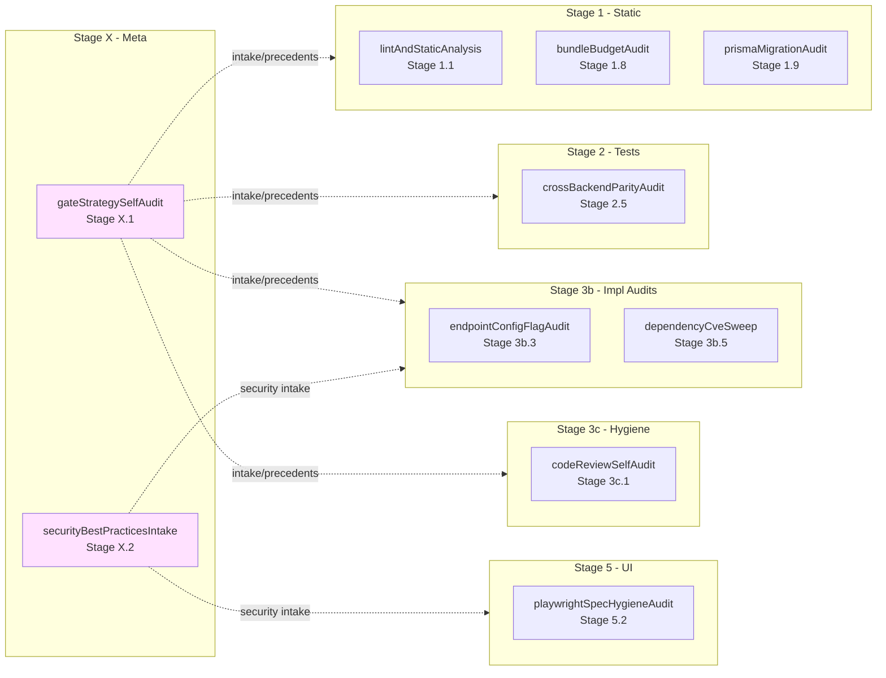
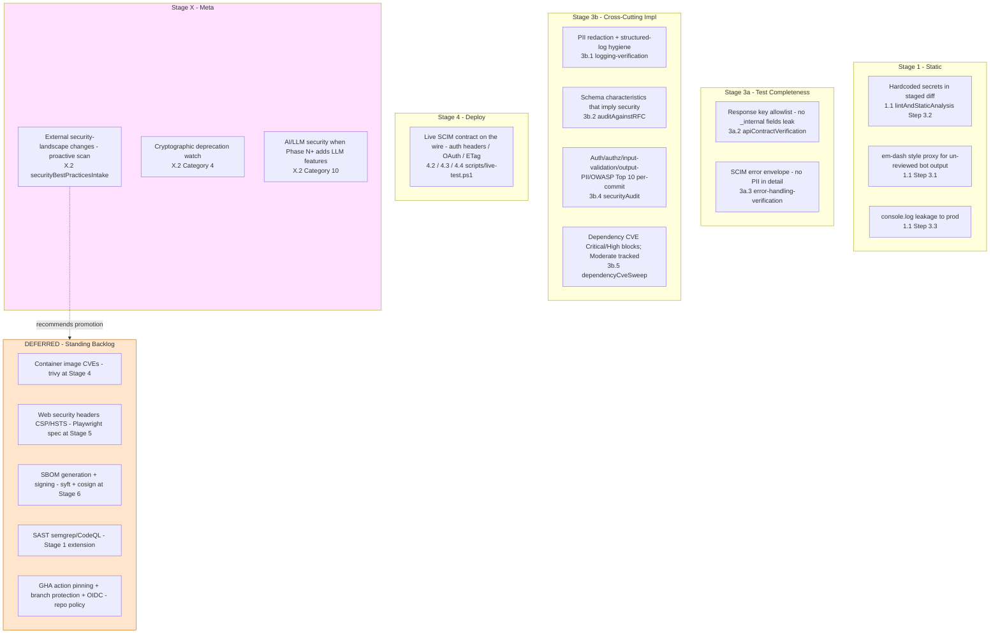
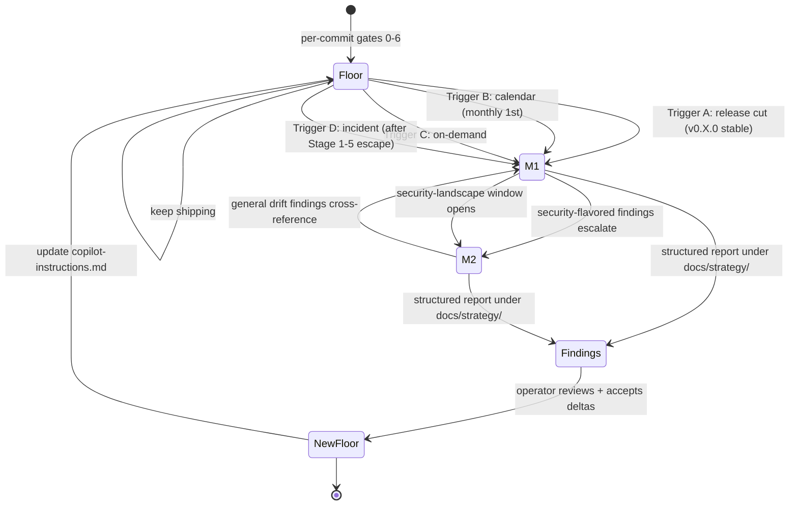
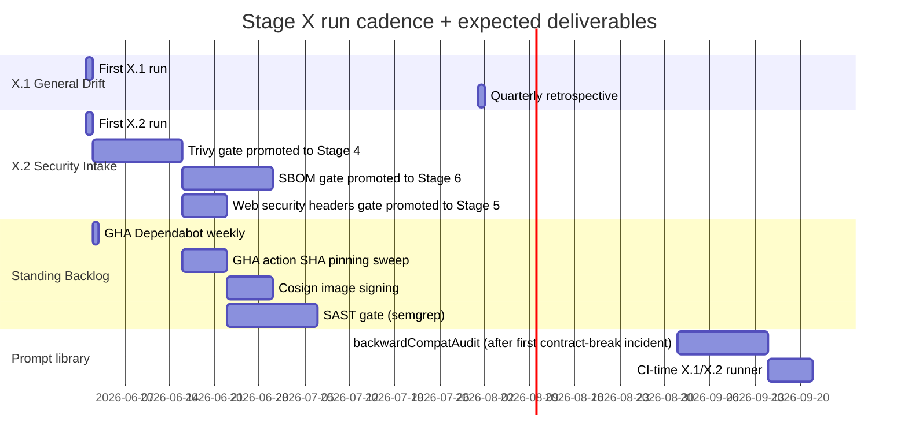

# Mandatory Quality Gates Strategy

> **Date:** 2026-05-16
> **Status:** Active standing rule (in effect as of commit `cb7fe7b`)
> **Owner:** Repo maintainers + AI coding assistants
> **Companion:** [.github/copilot-instructions.md](../.github/copilot-instructions.md) (the operational reference); this doc is the deliberation + rationale.
> **Why this exists:** two real defects (Finding-B inmemory parity gap, Finding-C 121 false Playwright failures) escaped the prior gate suite in May 2026. This doc captures the full deliberation that produced the new 7-stage strategy + 10 new self-improving prompts + Cross-Cutting Security Gate Map + Standing Backlog.

---

## Table of Contents

1. [Executive Summary](#1-executive-summary)
2. [What Was Wrong Before](#2-what-was-wrong-before)
3. [Design Principles](#3-design-principles)
4. [The 7-Stage Sequence](#4-the-7-stage-sequence)
5. [10 New Self-Improving Prompts](#5-10-new-self-improving-prompts)
6. [Cross-Cutting Security Gate Map](#6-cross-cutting-security-gate-map)
7. [Stage X: Meta / Strategy Evolution](#7-stage-m-meta--strategy-evolution)
8. [Hard Constraints on Meta Prompts](#8-hard-constraints-on-meta-prompts)
9. [Standing Backlog](#9-standing-backlog)
10. [Real Precedents That Drove Each Addition](#10-real-precedents-that-drove-each-addition)
11. [Risk Register](#11-risk-register)
12. [Future Evolution Path](#12-future-evolution-path)
13. [How To Apply This Strategy on Day-to-Day Work](#13-how-to-apply-this-strategy-on-day-to-day-work)

---

## 1. Executive Summary

The Mandatory Quality Gates section in [.github/copilot-instructions.md](../.github/copilot-instructions.md) used to be a **flat 11-item list** with no ordering, no cost-vs-value rationale, and no formal incident-learning loop. Two bug classes escaped to production-adjacent environments in May 2026 (Finding-B and Finding-C - see Section 2). Each escape made it obvious which gate would have caught it, but adding gates reactively guarantees we keep paying for the next escape pattern we haven't seen yet.

This strategy reorganizes gates into a **7-stage sequence** (Stage 0 -> 6 + Stage X) where:

- Each stage has explicit ordering, cost, and trigger conditions.
- Each gate has a precedent traceable to a real failure or a documented standard.
- Cheap gates run first (left-shift bug catch).
- Security is threaded through every stage and made visible via a dedicated **Cross-Cutting Security Gate Map**.
- A **Stage X (Meta)** layer formalizes proactive strategy evolution via two periodic prompts: `gateStrategySelfAudit` (internal drift + external standards) and `securityBestPracticesIntake` (10-category security-landscape scan).
- A **Standing Backlog** captures concrete deferred items (mostly security tools) with cost + value, so they can be promoted in order.

The prompt library grew from 22 to 32 files (+10 new self-improving prompts).

---

## 2. What Was Wrong Before

### Finding-B (May 2026): InMemory parity gap

`POST /admin/endpoints` with a duplicate `name` returned **200** on the inmemory backend but **400** on the Prisma backend. The Prisma branch in `EndpointService.createEndpoint()` called `findUnique({ where: { name } })` and threw `BadRequestException` on duplicate. The inmemory branch had no equivalent guard so the operation silently succeeded (creating two endpoints with the same name in the in-process cache, with the second overwriting the first in `cacheByName`).

**Detection latency:** ~10 minutes from `git push` to local live-test run that surfaced 9z-AA.5 as 983/984. Dev (Prisma) and Docker (Prisma) both passed 984/984 on the same source revision - which is exactly how the gap stayed hidden.

**Root cause class:** any code path with an `if (this.isInMemoryBackend) { ... } else { ... }` branch is a parity-divergence risk. There are 18 such branches in current source.

**Precedent for parity gaps:** Phase D4 (2026-05-08) found `LoggingService.listLogs` honored 9 filter dimensions on Prisma but only `endpointId` on inmemory. Same bug class.

### Finding-C (May 2026): 121 stale Playwright failures vs healthy dev

Playwright against dev = **37 pass / 121 fail / 3 skip**. But dev was healthy (984/984 live SCIM tests passing). Almost every failure was a spec written for the **legacy admin UI deleted in Phase I v0.48.0 (2026-05-09)** - the specs clicked tab buttons like "Raw Logs" / "Manual Provision" / "Database Browser" / "Activity Feed" that no longer exist; the legacy `?ui=legacy` escape hatch was also removed. The specs were never deleted in the same commit as the UI surgery, and they kept failing for ~7 weeks.

**Net cost:** an operator-untrustworthy signal. When the failure baseline is 121, operators stop reading the failure list, and real regressions hide inside the noise.

### Common pattern

Both defects share a **failure to evolve test infrastructure alongside code surgery**. Finding-B is the test-suite missing a unit-level lock on a behavior the live suite already covered; Finding-C is the test-suite holding tests for code that was deleted. Neither was caught by any of the 11 flat gates in the prior list because:

1. The flat list said WHAT to verify, not WHEN or WHY.
2. There was no introspection mechanism that looked for missing gates BEFORE bugs escaped.
3. The reactive update loop ("add a gate after the bug ships") guaranteed we kept paying for the next escape.

---

## 3. Design Principles

The new strategy is built on six principles. Each principle traces to a real precedent in the codebase history.

| # | Principle | Rationale | Precedent |
|---|---|---|---|
| 1 | **Left-shift bug catch** | A bug caught in Stage 1 costs seconds. The same bug caught in Stage 4 costs minutes. The same bug shipped to prod costs days. Gates are ordered cheapest-fastest first. | Finding-B was a 2-second unit-test gap that took ~10 min to surface at the live layer. |
| 2 | **No gate replaces another** | Static gates don't replace unit tests. Unit tests don't replace E2E. E2E doesn't replace live. Coverage is by layer, not by substitution. | Phase D4 listLogs gap was missed by unit tests AND E2E; only the in-memory live run found it. |
| 3 | **Self-improvement is mandatory** | Every escape pattern that surfaces gets a new gate. The standing-rules file has a `Gate-Strategy Self-Improvement Loop` section that records every gate's precedent. Stage X.1 formalizes the loop into a periodic prompt. | The 7-stage list itself was triggered by Finding-B + Finding-C. |
| 4 | **Stage 3 split by SCOPE** | A 9-prompt Stage 3 with no sub-grouping invites skipping. Splitting into 3a (test completeness) -> 3b (cross-cutting impl) -> 3c (hygiene + docs) makes the dependency order obvious and the cost of skipping any sub-stage visible. | The flat list put `securityAudit` next to `auditAndUpdateDocs` - prompts that have nothing in common except being prompts. |
| 5 | **Cost ordering matches risk** | Slow gates (Playwright, Azure deploy) come last so we never pay their cost for code that would fail Stage 1. | Pre-strategy, operators sometimes ran Playwright before Stage 1 and wasted 8 minutes per fail. |
| 6 | **Baselines ratchet, never raise** | Test counts, lint warning ceiling, web tsc error count, web bundle size - all are ceilings that can only ratchet down (`raise without explicit justification = blocked`). | API lint baseline of 465 warnings has been stable for 3 weeks; bundle gz floor of 153 KB has held since Phase K1. |

---

## 4. The 7-Stage Sequence

### Visual architecture

```mermaid
flowchart TD
    Start([Change ready to commit]) --> S0
    S0[Stage 0<br/>TDD Discipline<br/>RED -> GREEN -> REFACTOR]
    S0 --> S1
    S1[Stage 1<br/>Local Static Gates<br/>9 sub-gates ~1 min<br/>lintAndStaticAnalysis orchestrator]
    S1 --> S2
    S2[Stage 2<br/>Local Test Gates<br/>6 sub-gates ~5-10 min<br/>crossBackendParityAudit + test-all-modes]
    S2 --> S3a
    S3a[Stage 3a<br/>Test-Completeness Audits<br/>addMissingTests / apiContractVerification / error-handling-verification]
    S3a --> S3b
    S3b[Stage 3b<br/>Cross-Cutting Impl Audits<br/>logging / RFC / configFlag / security / dependencyCveSweep / performance]
    S3b --> S3c
    S3c[Stage 3c<br/>Code Hygiene + Docs<br/>codeReviewSelfAudit + auditAndUpdateDocs]
    S3c --> S4
    S4[Stage 4<br/>Pipeline + Multi-Mode Deploy<br/>fullValidationPipeline / Docker / Local / Dev Azure live]
    S4 --> S5{Change<br/>touches web/?}
    S5 -->|yes| S5UI[Stage 5<br/>UI-Specific Gates<br/>uiTestAndValidation / playwrightSpecHygiene / Playwright vs dev / browser sync]
    S5 -->|no| S6
    S5UI --> S6
    S6[Stage 6<br/>Commit Hygiene + Release Docs<br/>Version bump / CHANGELOG / Session_starter / generateCommitMessage]
    S6 --> Push([git push])
    Push --> Prod{Operator-invoked<br/>prod promote?}
    Prod -->|on-demand only| ProdGate[Stage 4.4 green on exact SHA<br/>+ promote-to-prod.ps1]
    Prod -->|no| Done([Done])
    ProdGate --> Done

    StageM[Stage X - Meta / Strategy Evolution<br/>NOT per-commit<br/>4 trigger types<br/>X.1 gateStrategySelfAudit<br/>X.2 securityBestPracticesIntake]
    StageM -.runs on cadence.-> S0

    style S0 fill:#ffe1c4
    style S1 fill:#c4e1ff
    style S2 fill:#c4e1ff
    style S3a fill:#c4ffc4
    style S3b fill:#c4ffc4
    style S3c fill:#c4ffc4
    style S4 fill:#ffc4c4
    style S5UI fill:#e1c4ff
    style S6 fill:#ffe1c4
    style StageM fill:#ffe1ff
    style ProdGate fill:#ff8080,color:#fff
```

### Stage-by-stage cost / value

| Stage | Purpose | Gate count | Typical trigger | Avg cost | Avg ROI on a bug |
|---|---|---|---|---|---|
| **0** | TDD discipline | 4 sub-rules | every commit | n/a (process) | Catches design bugs at zero cost |
| **1** | Local static | 9 gates | every commit | ~1 min | Tsc/lint catch ~30% of mechanical bugs |
| **2** | Local tests | 6 gates | every commit | ~5-10 min | Unit/E2E catch ~50% of behavioural bugs; parity audit catches the rest |
| **3a** | Test completeness | 3 prompts | every feature/fix | ~10 min | Surfaces tests-you-should-have-written |
| **3b** | Cross-cutting impl | 6 prompts | every feature/fix | ~10-15 min | Surfaces logging/RFC/security/perf gaps |
| **3c** | Code hygiene + docs | 2 prompts | every feature/fix | ~5 min | Prevents god-class growth + doc rot |
| **4** | Multi-mode deploy | 4 gates | every sub-phase ship | ~15-20 min | Catches deploy-shape bugs; last line before user impact |
| **5** | UI-specific | 4 gates | when web/ touched | ~10 min | Locks Playwright/a11y/visual + spec hygiene |
| **6** | Commit hygiene + release | 5 gates | every commit ready to push | ~2 min | Closes the loop; locks audit trail |
| **M** | Meta / strategy evolution | 2 prompts | release / monthly / on-demand / incident | 30-60 min/run | Compounds across multiple commits |

---

## 5. 10 New Self-Improving Prompts

### Prompt-by-prompt purpose

| # | Prompt | Stage | Bug class prevented | Real precedent that motivated it |
|---|---|---|---|---|
| 1 | [`lintAndStaticAnalysis`](../.github/prompts/lintAndStaticAnalysis.prompt.md) | 1.1 | Inconsistent static enforcement; secret/em-dash/console.log leakage | Operationalizes 6 inline Stage-1 gates that were previously documented but not consistently run |
| 2 | [`bundleBudgetAudit`](../.github/prompts/bundleBudgetAudit.prompt.md) | 1.8 | "Lazy route ships unbounded" - new TanStack route with no size-limit entry | Phase K1/L1/M1 manually-added budgets - workflow was tribal knowledge until v0.52.x |
| 3 | [`prismaMigrationAudit`](../.github/prompts/prismaMigrationAudit.prompt.md) | 1.9 | "Schema edited but migration not generated" CD blocker | Cross-cutting concern; CD-class risk on every `api/prisma/` touch |
| 4 | [`crossBackendParityAudit`](../.github/prompts/crossBackendParityAudit.prompt.md) | 2.5 | InMemory vs Prisma divergence | Finding-B (2026-05-16) + Phase D4 (2026-05-08) listLogs |
| 5 | [`endpointConfigFlagAudit`](../.github/prompts/endpointConfigFlagAudit.prompt.md) | 3b.3 | "Added a flag but forgot doc / UI Switch / live test" | Codebase-specific 14-flag architecture; 10-cell completeness matrix |
| 6 | [`dependencyCveSweep`](../.github/prompts/dependencyCveSweep.prompt.md) | 3b.5 | Critical/High CVE in transitive deps | Continuous CVE DB updates need cadence-based scan separate from per-commit `securityAudit` |
| 7 | [`codeReviewSelfAudit`](../.github/prompts/codeReviewSelfAudit.prompt.md) | 3c.1 | God-class growth, helper-bloat, naming drift | May 2026 Design Deep Analysis: SchemaValidator 1,467 lines + service-helpers 1,230 lines |
| 8 | [`playwrightSpecHygieneAudit`](../.github/prompts/playwrightSpecHygieneAudit.prompt.md) | 5.2 | Stale specs vs deleted UI inflating failure noise | Finding-C (2026-05-16): 121 false fails for 7 weeks |
| 9 | [`gateStrategySelfAudit`](../.github/prompts/gateStrategySelfAudit.prompt.md) | X.1 | Drift in baselines/prompts/coverage/docs; missed RFC errata; recurring escape patterns | Meta - formalizes the previously-ad-hoc self-improvement loop |
| 10 | [`securityBestPracticesIntake`](../.github/prompts/securityBestPracticesIntake.prompt.md) | X.2 | Missed security-landscape changes (OAuth 2.1, SLSA, npm provenance, OWASP LLM Top 10) | xz-utils precedent + OAuth 2.0 BCP (RFC 9700) shipped Apr 2025; no existing prompt would have intaken either |

---

## 6. Cross-Cutting Security Gate Map

Security checks are intentionally threaded through every stage. The map makes the threading visible so the next reviewer knows where each security concern is enforced.

When `securityBestPracticesIntake` (X.2) recommends moving any DEFERRED item to an active gate, the Cross-Cutting Security Gate Map in [.github/copilot-instructions.md](../.github/copilot-instructions.md) MUST be updated in the same commit.

---

## 7. Stage X: Meta / Strategy Evolution

Stage X is structurally different from the other 6 stages. It does NOT gate any single commit. It runs on **inflection points** to evolve the gate strategy itself.

The 6 per-commit stages are the FLOOR. Stage X is what RAISES the floor over time.

### 4-trigger cadence (shared by X.1 + X.2)

| Trigger | Cadence | Recommended scope | Why exactly this trigger |
|---|---|---|---|
| **A. Release cuts** | Every `v0.X.0` stable rollup | last release cycle | Natural reflection point; matches existing release rhythm; alphas N1..Nn rolled into vN.0.0 is the right "what patterns emerged?" moment |
| **B. Calendar** | Monthly (1st of month) | full sweep | Catches drift in 3-week feature blocks with no release; ensures external-standard advisories don't sit unintaken |
| **C. On-demand** | User invokes | operator-specified | Bug-hunt / planning / threat-hunt mode |
| **D. Incident-driven** | After ANY bug or security incident escapes Stages 1-5 to live/dev | focused on the escape path | Auto-captures Finding-B / Finding-C / supply-chain-class events into the loop in real-time, not at next monthly |

### Why separate X.1 from X.2

Security best practices change faster than RFC errata or framework upgrades (OAuth 2.1 deprecated implicit flow Q1 2024; OWASP Top 10 reshuffled 2021; xz-utils supply-chain attack 2024; SLSA + provenance became table-stakes 2023). A single missed advisory can cascade to full RCE (supply chain) or full data exposure (auth bypass). The cost of NOT intaking is asymmetric: bug-class costs scale linearly, security-class costs scale exponentially.

If security intake stayed as one of four sub-sections inside `gateStrategySelfAudit`, it would be diluted. Splitting it into X.2 keeps the depth dedicated; X.1 stays focused on internal drift + general external standards.

### X.2 covers 10 categories

1. Standards bodies (OWASP, CWE, NIST, CIS)
2. Protocol-level (OAuth 2.1, OIDC FAPI, DPoP, TLS)
3. Supply chain (SLSA, npm provenance, Sigstore, GHA pinning)
4. Cryptographic deprecations (NIST SP 800-131A)
5. Container/runtime (distroless, rootless, trivy, syft, cosign)
6. CI/CD security (OIDC, branch protection, signed commits, Dependabot)
7. Web/UI security (CSP, HSTS, COOP/COEP, Trusted Types)
8. Privacy/PII (GDPR, CCPA, PIPL)
9. Cloud-specific (Azure Security Baselines, Managed Identity, WAF)
10. AI/LLM-specific (OWASP LLM Top 10, prompt injection, model supply chain)

Findings tagged `[LLM]` have different action paths from traditional security findings.

---

## 8. Hard Constraints on Meta Prompts

Both X.1 and X.2 enforce six constraints. These exist to prevent the LLM-running-the-prompt from inventing advisories or proposing prompt-library bloat.

| # | Constraint | What it prevents |
|---|---|---|
| 1 | **URL citation MANDATORY for every external claim.** No URL = tagged `"SPECULATIVE - verify before action"`. | LLM hallucinating CVEs / RFCs / advisories that don't exist. The strongest anti-hallucination defense. |
| 2 | **Confidence level mandatory.** `Critical / High / Medium / Speculative` for X.2; `High / Medium / Speculative` for X.1. | Bare assertions that look authoritative but aren't. |
| 3 | **Owner action mandatory per finding.** | "This seems off" findings that no human knows what to do with. |
| 4 | **2-escape threshold for new prompts.** A new prompt is only proposed when >=2 historical bug-escape patterns match it. Single-escape patterns extend an existing prompt. | Prompt-library bloat. |
| 5 | **30-day no-fire evidence for retirement.** A silent prompt may be having deterrent effect; we don't retire on first absence. | Premature deletion of gates that are doing prophylactic work. |
| 6 | **Baseline ratchets require measured snapshot.** "Tighten the warning ceiling from 465 to 442" requires today's `npm run lint` output AND 442 must be supported by the measurement. | Aspirational ratchets that immediately get bypassed. |

Plus two X.2-specific:

- **CVE-overlap rule** - pure-CVE findings defer to `dependencyCveSweep`. X.2 only handles structural/behavioral security best practices, not per-CVE triage.
- **Tool-dependent recommendations flagged DEFERRED** if the tool isn't installed; do not recommend a gate the runner can't execute today.

---

## 9. Standing Backlog

Items recorded with cost + value but NOT yet promoted to active gates. Each can be evaluated for promotion at the next X.1 or X.2 run.

### Strategy / process

| Item | Notes | Estimated cost |
|---|---|---|
| `backwardCompatAudit` prompt | "Does this change break a previously-published contract?" Partially covered by `apiContractVerification`. Specialize after next public-contract-breaking incident. | 1 day to scope |
| CI-time runner for Stage X.1 + X.2 | Both prompts are operator-invoked today. A scheduled GitHub Actions runner on the 1st of each month would automate Trigger B (calendar). | 1-2 days |
| Auto-creation of `docs/strategy/*_<date>.md` | X.1 and X.2 outputs are structured Markdown; a small script could open a PR with the report attached. | 0.5 day |

### Security tool gates (surfaced by X.2 / `securityBestPracticesIntake`)

| Item | Tool | Cost | Value | Where it would slot |
|---|---|---|---|---|
| Stage 1 SAST gate | [semgrep](https://semgrep.dev/) or [GitHub CodeQL](https://codeql.github.com/) | $0; +30s per commit; ~20% FP rate before tuning | Catches common bug patterns | New Stage 1.10 |
| Stage 4 container CVE scan | [trivy](https://github.com/aquasecurity/trivy) (FOSS gold-standard) or grype | $0; +60s per Docker build | Catches OS-level CVEs in base image | New Stage 4.x |
| Stage 4 SBOM generation | [syft](https://github.com/anchore/syft) | $0; near-zero overhead | Enables post-deploy CVE lookup | New Stage 4.x |
| Stage 5 web security headers gate | new Playwright spec | $0; ~5s per run | Locks CSP/HSTS/X-Frame-Options/X-Content-Type/Referrer/Permissions-Policy as code | New Stage 5.5 |
| Stage 6 image signing | [cosign](https://github.com/sigstore/cosign) keyless OIDC | $0; ~5s per build | Verifies image came from our CI | New Stage 6.x |
| Stage 6 GHA action SHA pinning | [stepsecurity.io](https://app.stepsecurity.io/) | $0; manual sweep | Prevents tag-rewrite attacks (precedent: tj-actions/changed-files Mar 2025) | Repo policy |
| Repo policy: Dependabot weekly | GitHub native | $0 | Complements per-commit `dependencyCveSweep` | Repo policy |
| Repo policy: signed commits + branch protection | GPG + repo settings | $0 | Authorship + force-push prevention | Repo policy |
| Migration to distroless or rootless base image | rebase Dockerfile | engineer time | Smaller attack surface, no shell | Dockerfile rewrite |
| CORS hardening on API | code change | engineer time | Tighten permissive default to explicit allow-list | api/src/main.ts |
| Rotate long-lived secrets quarterly | process | quarterly review | `SCIM_SHARED_SECRET`, `JWT_SECRET`, `OAUTH_CLIENT_SECRET` | Runbook |

---

## 10. Real Precedents That Drove Each Addition

The Gate-Strategy Self-Improvement Loop section in `copilot-instructions.md` records 9 standing rules with their originating precedent. This is the same list expanded with the deliberation:

| Standing rule | Precedent | What it costs to NOT have | What it costs to have |
|---|---|---|---|
| **Schema-Characteristic Test Rule** | May 2026 Group.displayName uniqueness flip from `none` to `server` (Phase L5 RFC sweep) - every test that asserted `expect(attr.uniqueness).toBe('none')` red-failed even though the schema change was correct | Tests churn on every legitimate schema tightening; silent regressions when schema relaxes | Test pattern `expectCharacteristicIn(attr, key, VALID_KEYWORD)` + `Get-EffectiveUniqueness` PS helper; modest one-time refactor cost |
| **Stage 2.5 + 2.6 cross-backend parity** | Finding-B (May 2026) + Phase D4 (May 2026) listLogs | Inmemory developer-experience path silently broken; one bug class per quarter | `crossBackendParityAudit` prompt + `test-all-modes.ps1` orchestrator; ~30s per commit to walk the matrix |
| **Stage 5.2 Playwright spec hygiene** | Finding-C (May 2026): 121 false fails for 7 weeks | Operators distrust the signal; real regressions hide in noise; -67% confidence in UI testing | `playwrightSpecHygieneAudit` prompt; ~1 min static audit per commit that touches `web/` |
| **Stage 1.8 bundleBudgetAudit** | Phase K1/L1/M1 manual budget-add discipline that worked until it didn't (caught only by code review) | New route ships unbounded; bundle bloat undetected until next size measurement | `bundleBudgetAudit` prompt; ~10s per route added |
| **Stage 1.9 prismaMigrationAudit** | Cross-cutting CD concern; classic "schema edited but no migration generated" 500s in fresh-DB deploys | Dev/prod deploys 500 on first request after schema change | `prismaMigrationAudit` prompt; ~5s per `api/prisma/` touch |
| **Stage 3b.3 endpointConfigFlagAudit** | 14-flag ProfileSettings architecture; the "added a flag but forgot the UI Switch / live test / doc" pattern | New flag ships incomplete; users can't actually use it | `endpointConfigFlagAudit` prompt with 10-cell completeness matrix per flag |
| **Stage 3b.5 dependencyCveSweep** | CVE freshness discipline separate from feature-driven `securityAudit` (continuous DB updates) | Transitive CVEs lurk for weeks/months | `dependencyCveSweep`; ~30s per package.json change + weekly schedule |
| **Stage 3c.1 codeReviewSelfAudit** | May 2026 Design Deep Analysis: SchemaValidator god class 1,467 lines + service-helpers Swiss army 1,230 lines | God-class growth compounds; refactor cost grows quadratically | `codeReviewSelfAudit` prompt scoped to CHANGED files only; suggestions not blocks |
| **Stage X.1 gateStrategySelfAudit** | May 2026 meta-audit need; the standing rules said "update this section after a bug escapes" but had no formal engine for proactive review | Reactive-only loop; every new escape pattern costs ~10 min real-time detection + the underlying bug | X.1 prompt; 20-60 min per run on cadence triggers |
| **Stage X.2 securityBestPracticesIntake** | May 2026 security-intake gap; external advisories (xz-utils Mar 2024, OAuth BCP RFC 9700 Apr 2025, OWASP LLM Top 10 2024) had no intake mechanism | Missed mitigations for known-attack-classes; potential supply-chain / auth-bypass / RCE | X.2 prompt; 30-90 min per run on cadence triggers; URL-citation + tool-deferred discipline |

---

## 11. Risk Register

Risks introduced by the new strategy itself (not by the bugs it prevents):

| Risk | Likelihood | Impact | Mitigation |
|---|---|---|---|
| **Strategy over-engineering** - 7 stages + 32 prompts looks complex; smaller projects may copy-paste then drop most of it | Medium | Medium | Each stage explicitly has its own trigger condition (e.g. Stage 5 only when `web/` touched). The cost-vs-value table at Section 4 makes the per-stage budget visible. |
| **Prompt-library bloat** | Medium | Low | 2-escape threshold for new prompts (Section 8); 30-day retirement evidence rule. X.1 specifically reports on prompt-rot. |
| **LLM hallucinating security advisories in X.2** | High (without mitigation) | Critical | URL-citation requirement + `SPECULATIVE` tag (Section 8 Constraint 1). |
| **Operators skipping Stage 3 when prompted** | Medium | High | Stage 3 split into 3a/3b/3c by SCOPE means each sub-stage is a meaningful unit. Per-commit gate sequence is explicit in standing rules. |
| **Baseline ratchets becoming aspirational, then bypassed** | Medium | Medium | Constraint 6: ratchet requires measured snapshot. Today's baselines are written in the standing rules with measurement date. |
| **Meta prompts triggering churn on every run** | Low | Medium | X.1/X.2 produce structured reports; operator reviews and accepts deltas. Reports go under `docs/strategy/` for review trail. |
| **CI-runner debt** - X.1/X.2 are operator-invoked today; Trigger B (calendar) not actually triggered | Medium | Medium | Documented in Standing Backlog; first X.2 run will recommend the GHA workflow. |
| **Cross-Cutting Security Gate Map drift** | Low | Medium | Map must be updated in the same commit when any DEFERRED item is promoted to active gate (explicit rule in standing rules). |

---

## 12. Future Evolution Path

The strategy is designed to compound. Each Stage X run produces a structured `docs/strategy/SELF_AUDIT_<date>.md` (X.1) or `SECURITY_INTAKE_<date>.md` (X.2) with proposed deltas to standing rules. Over time:

The expectation is that 6-12 months from now:

- The Standing Backlog will have shrunk by ~5-8 items (the high-ROI security tools promoted).
- Two or three new prompts will be in the library, each with documented 2-escape precedents.
- One or two prompts will be retired (30-day no-fire evidence accumulated).
- Baselines will have ratcheted down 3-5% on average (lint warnings, web tsc, coverage thresholds).
- The Cross-Cutting Security Gate Map will have fewer DEFERRED rows.

If after 12 months none of this happens, the strategy itself is the bug - run X.1 to identify why.

---

## 13. How To Apply This Strategy on Day-to-Day Work

### For a feature commit

1. Stage 0 - write the failing test first. Confirm RED.
2. Stage 1 - run `lintAndStaticAnalysis` (or the underlying gates manually). 1 min.
3. Stage 2 - run the relevant test suite. If you touched a file with `isInMemoryBackend` branches, also run `crossBackendParityAudit`. 5-10 min.
4. Stage 3a - run `addMissingTests`, `apiContractVerification`, `error-handling-verification`. 10 min.
5. Stage 3b - run the impl audits relevant to your change. If you touched auth, `securityAudit`. If you bumped a dep, `dependencyCveSweep`. If you touched a flag, `endpointConfigFlagAudit`. 10-15 min.
6. Stage 3c - run `codeReviewSelfAudit` (CHANGED files only) + `auditAndUpdateDocs`. 5 min.
7. Stage 4 - `fullValidationPipeline` then deploy to dev + live-test. 15-20 min.
8. Stage 5 - if web touched, `playwrightSpecHygieneAudit` then Playwright vs dev. 10 min.
9. Stage 6 - version bump, CHANGELOG, Session_starter, `generateCommitMessage`. 2 min.

Total: 1-1.5 hours per feature commit. Most of the audit prompts produce empty findings on small changes - that's fine; the cost is bounded.

### For a defect fix commit

Same 7 stages but Stage 3a/b/c often empty. The discriminator is Stage 0 (RED test first) and Stage 4 (verify the fix in the deployment topology that caught the bug).

### For a docs-only commit

Stages 1, 2, 3a, 3b, 4, 5 all empty. Stage 3c.2 (`auditAndUpdateDocs`) is the whole job. Stage 6 commit + push.

### For a refactor commit

Stages 1, 2, 3a all run. Stage 3c.1 (`codeReviewSelfAudit`) is where the refactor's quality gets graded. Stage 4 confirms behavior unchanged.

### When to invoke Stage X (Meta)

- After every release cut (v0.X.0 stable rollup).
- 1st of every month.
- Immediately after any bug escapes Stages 1-5 to live/dev.
- On demand when you want to threat-hunt or strategize.

NEVER per-commit. Cost too high; signal too noisy at that frequency.

---

## See also

- [.github/copilot-instructions.md](../.github/copilot-instructions.md) - the operational standing-rules file (Mandatory Quality Gates section + Cross-Cutting Security Gate Map + Standing Backlog + Gate-Strategy Self-Improvement Loop).
- [.github/prompts/](../.github/prompts/) - the 32 prompt files (10 new in this strategy revision).
- [DELIVERY_PLAN.md](DELIVERY_PLAN.md) - companion 6-week delivery plan that uses these gates.
- [DESIGN_IMPROVEMENT_DEEP_ANALYSIS.md](DESIGN_IMPROVEMENT_DEEP_ANALYSIS.md) - the May 2026 design audit whose findings motivated `codeReviewSelfAudit`.
- [LOGGING_ERROR_HANDLING_QUALITY_AUDIT.md](LOGGING_ERROR_HANDLING_QUALITY_AUDIT.md) - companion quality audit that motivated `logging-verification` and `error-handling-verification`.
