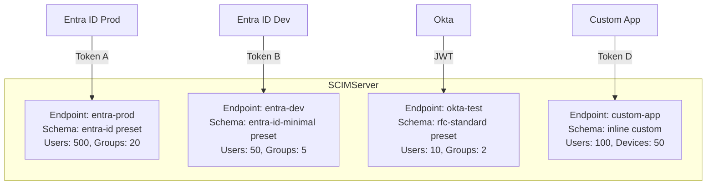
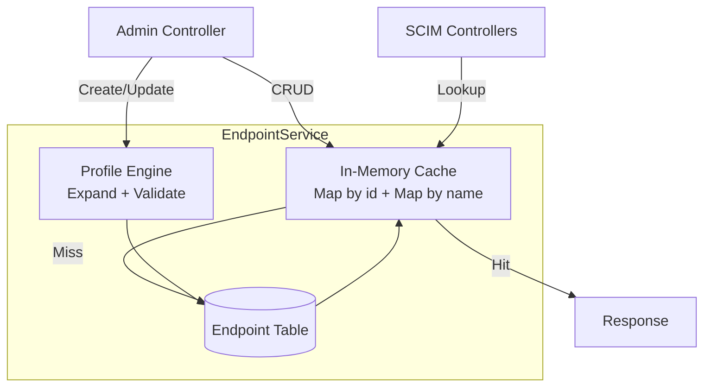
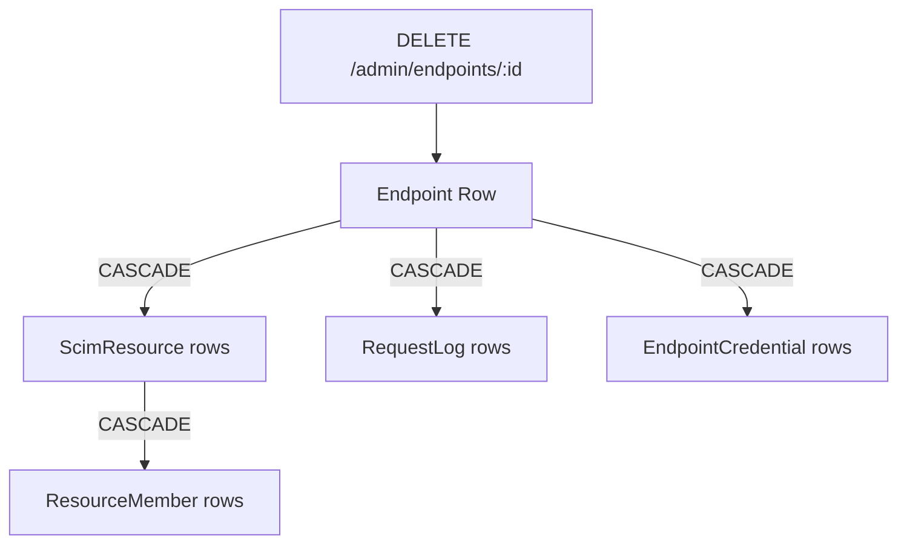
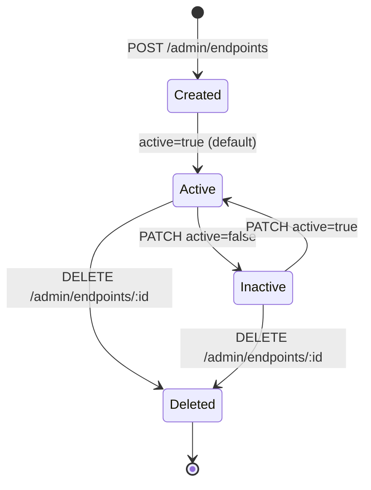
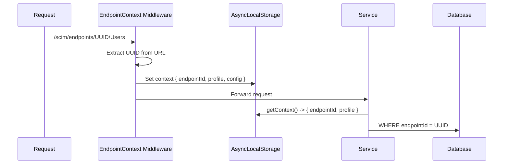
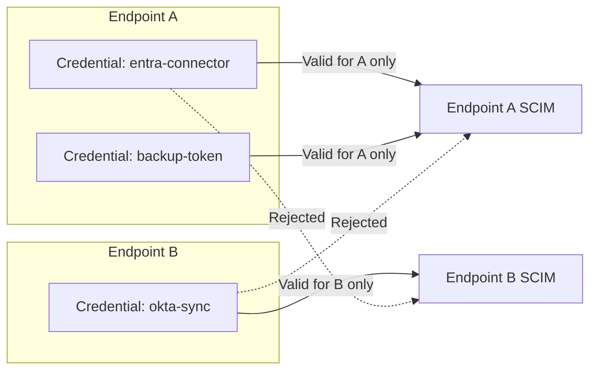

# Multi-Endpoint Architecture Guide

> **Version:** 0.40.0 - **Updated:** April 28, 2026  
> **Source of truth:** [endpoint.service.ts](../api/src/modules/endpoint/services/endpoint.service.ts)

---

## Table of Contents

- [Overview](#overview)
- [Architecture](#architecture)
- [Data Isolation](#data-isolation)
- [Endpoint Lifecycle](#endpoint-lifecycle)
- [Request Routing](#request-routing)
- [Endpoint Cache](#endpoint-cache)
- [Profile Isolation](#profile-isolation)
- [Credential Isolation](#credential-isolation)
- [Log Isolation](#log-isolation)
- [Controllers & Routing](#controllers--routing)
- [Common Scenarios](#common-scenarios)

---

## Overview

SCIMServer is a **multi-tenant** SCIM server where each tenant is represented by an **endpoint**. Endpoints provide complete isolation of:

- Users and Groups (SCIM resources)
- Schema definitions and resource types
- Configuration flags and behavioral settings
- Authentication credentials
- Log streams and audit trails



---

## Architecture

### Endpoint Service

The `EndpointService` is the central authority for endpoint management:



### Cache Architecture

- **Dual-key cache**: Two Maps maintained in sync - `cacheById` and `cacheByName`
- **Cache population**: On first access or after cache miss, loads from database
- **Cache invalidation**: On create, update, or delete operations
- **Thread safety**: Single-process Node.js, no locking needed

---

## Data Isolation

### Database-Level Isolation

All SCIM resource queries include `endpointId` in the WHERE clause:

```sql
-- Users are scoped to endpoint
SELECT * FROM "ScimResource"
  WHERE "endpointId" = 'a1b2c3d4-...'
    AND "resourceType" = 'User';

-- Uniqueness is per-endpoint
UNIQUE INDEX ON "ScimResource" ("endpointId", "userName");
UNIQUE INDEX ON "ScimResource" ("endpointId", "scimId");
```

### Cascade Delete

Deleting an endpoint cascades to all associated data:



---

## Endpoint Lifecycle



| State | SCIM Operations | Admin Operations | Data |
|-------|----------------|------------------|------|
| **Active** | Allowed | Allowed | Preserved |
| **Inactive** | Blocked (403) | Allowed | Preserved |
| **Deleted** | N/A | N/A | Cascade deleted |

---

## Request Routing

### URL Pattern

```
/scim/endpoints/{endpointId}/{ResourceType}/{resourceId?}
                 ^^^^^^^^^^^
                 UUID that identifies the tenant
```

### AsyncLocalStorage Context

Every request passes through `EndpointContextStorage` middleware that:

1. Extracts `endpointId` from the URL path
2. Looks up the endpoint via `EndpointService` cache
3. Stores the endpoint context in Node.js `AsyncLocalStorage`
4. Services access the context via `endpointContextStorage.getContext()`



---

## Endpoint Cache

The `EndpointService` maintains an in-memory cache for fast lookups:

| Operation | Cache Behavior |
|-----------|---------------|
| Create endpoint | Add to both caches |
| Get by ID | Check `cacheById`, miss -> DB load |
| Get by name | Check `cacheByName`, miss -> DB load |
| Update endpoint | Update both caches |
| Delete endpoint | Remove from both caches |
| List endpoints | Direct DB query (not cached) |

---

## Profile Isolation

Each endpoint has its own profile defining:

| Aspect | Isolation |
|--------|-----------|
| **Schemas** | Different attribute sets per endpoint |
| **Resource Types** | Different resource types (User-only, custom types) |
| **SPC** | Different capabilities (bulk, sort, filter limits) |
| **Settings** | Different behavioral flags per endpoint |

### Example: Different Presets

```bash
# Production: full Entra ID compatibility
curl -X POST /scim/admin/endpoints \
  -d '{"name":"prod","profilePreset":"entra-id"}'

# Development: minimal schema for speed
curl -X POST /scim/admin/endpoints \
  -d '{"name":"dev","profilePreset":"minimal"}'

# Compliance testing: strict RFC mode
curl -X POST /scim/admin/endpoints \
  -d '{"name":"rfc-test","profilePreset":"rfc-standard"}'
```

---

## Credential Isolation

Per-endpoint credentials are scoped to a single endpoint:



- Credentials created via `POST /admin/endpoints/{id}/credentials`
- Token hash stored with `endpointId` FK
- Auth guard checks token against credentials for the specific endpoint in the URL

---

## Log Isolation

### Per-Endpoint Log Access

| Route | Scope |
|-------|-------|
| `GET /admin/log-config/stream` | All endpoints |
| `GET /endpoints/{id}/logs/stream` | Single endpoint |
| `GET /admin/log-config/recent` | All endpoints |
| `GET /endpoints/{id}/logs/recent` | Single endpoint |
| `GET /admin/logs` | All endpoints (+ endpointId filter) |
| `GET /endpoints/{id}/logs/history` | Single endpoint |

### Per-Endpoint Log Level

```bash
# Set endpoint-specific log level (does not affect other endpoints)
curl -X PUT /scim/admin/log-config/endpoint/{id}/TRACE
```

---

## Controllers & Routing

All 19 controllers participate in multi-endpoint routing:

| Controller | Route Prefix | Endpoint-Scoped |
|-----------|-------------|-----------------|
| EndpointController | `/admin/endpoints` | Admin scope |
| AdminCredentialController | `/admin/endpoints/:id/credentials` | Per-endpoint |
| EndpointScimUsersController | `/endpoints/:id` | Per-endpoint |
| EndpointScimGroupsController | `/endpoints/:id` | Per-endpoint |
| EndpointScimBulkController | `/endpoints/:id` | Per-endpoint |
| EndpointScimDiscoveryController | `/endpoints/:id` | Per-endpoint |
| EndpointScimGenericController | `/endpoints/:id` | Per-endpoint |
| ScimMeController | `/endpoints/:id` | Per-endpoint |
| EndpointLogController | `/endpoints/:id/logs` | Per-endpoint |
| SchemasController | `/Schemas` | Global |
| ResourceTypesController | `/ResourceTypes` | Global |
| ServiceProviderConfigController | `/ServiceProviderConfig` | Global |
| AdminController | `/admin` | Global |
| LogConfigController | `/admin/log-config` | Global |
| DatabaseController | `/admin/database` | Global |
| ActivityController | `/admin/activity` | Global |
| HealthController | `/health` | Global |
| OAuthController | `/oauth` | Global |
| WebController | `/` | Global |

---

## Common Scenarios

### Scenario 1: Separate Prod/Dev Endpoints

```bash
# Create production endpoint with strict settings
curl -X POST /scim/admin/endpoints \
  -d '{"name":"prod","profilePreset":"entra-id","profile":{"settings":{"RequireIfMatch":true,"PerEndpointCredentialsEnabled":true}}}'

# Create dev endpoint with relaxed settings
curl -X POST /scim/admin/endpoints \
  -d '{"name":"dev","profilePreset":"entra-id-minimal"}'
```

### Scenario 2: ISV Testing

```bash
# Lexmark endpoint with custom extensions
curl -X POST /scim/admin/endpoints \
  -d '{"name":"lexmark","profilePreset":"user-only-with-custom-ext"}'

# Okta endpoint with RFC-standard compliance
curl -X POST /scim/admin/endpoints \
  -d '{"name":"okta","profilePreset":"rfc-standard"}'
```

### Scenario 3: Custom Resource Types

```bash
# Endpoint with User + custom Device type
curl -X POST /scim/admin/endpoints \
  -d '{"name":"iot","profile":{"schemas":[{"id":"...:User","name":"User","attributes":"all"},{"id":"urn:example:Device","name":"Device","attributes":[{"name":"serial","type":"string","required":true}]}],"resourceTypes":[{"id":"User","name":"User","endpoint":"/Users","schema":"...:User"},{"id":"Device","name":"Device","endpoint":"/Devices","schema":"urn:example:Device"}]}}'

# Both types are fully isolated to this endpoint
curl POST /scim/endpoints/{id}/Users ...
curl POST /scim/endpoints/{id}/Devices ...
```
