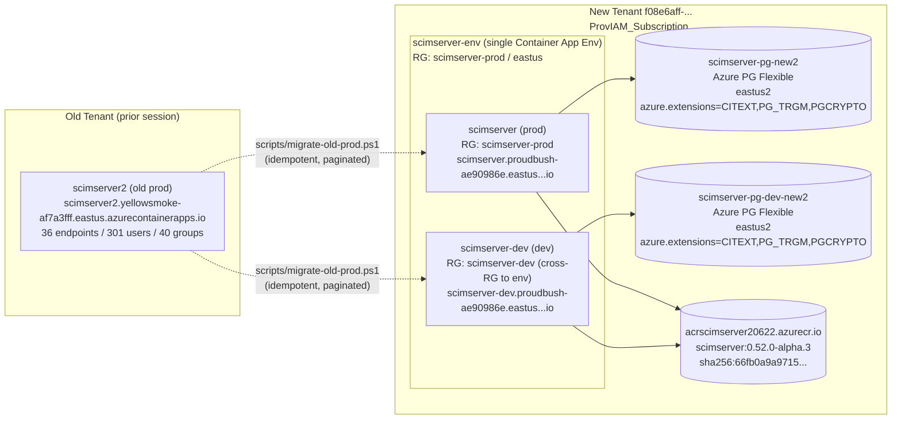
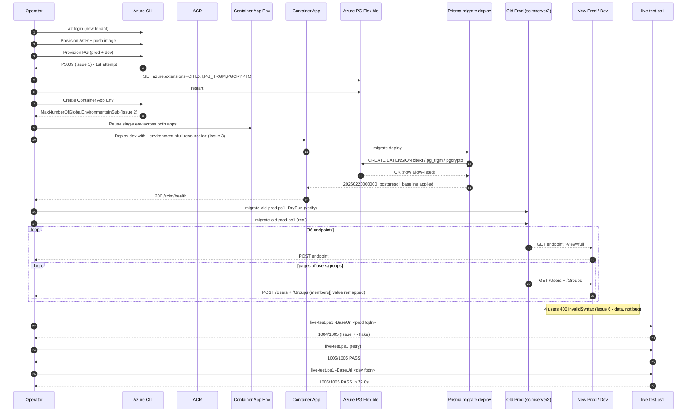
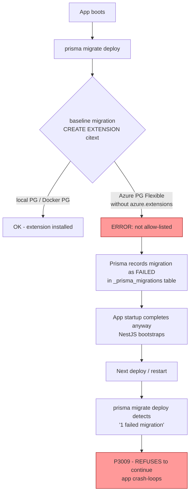
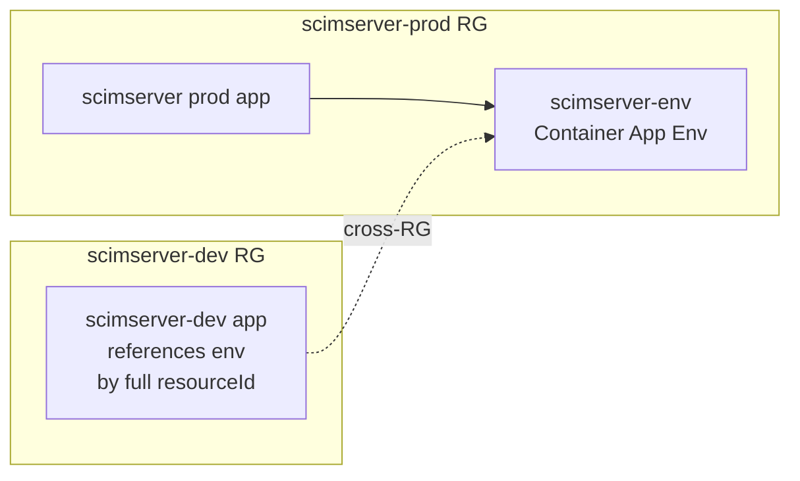
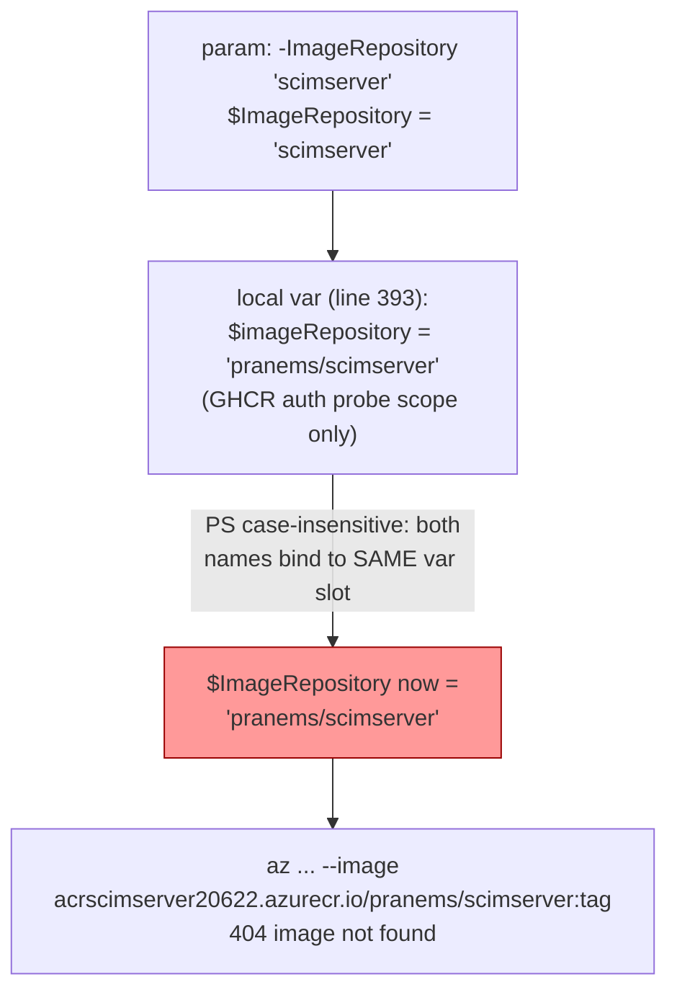

# Cross-Tenant Azure Deploy + Data Migration - Issues, RCA & Fixes

> **Date:** 2026-05-19 - **Version:** 0.52.0-alpha.3 - **Commit:** [`f8ffae6`](../) - **Branch:** `feat/ui`
> **Scope:** Full deploy of `prod` + `dev` into new Azure tenant `f08e6aff-ca0f-4f11-81fa-1ffd43323373` (`ProvIAM_Subscription`) + migration of 36 endpoints / 297 users / 40 groups from old prod.
> **Outcome:** Both environments live and green at **1005/1005 live tests PASS**.

---

## Table of Contents

1. [Executive Summary](#executive-summary)
2. [Environment Topology](#environment-topology)
3. [End-to-End Sequence](#end-to-end-sequence)
4. [Issue 1 - P3009 Prisma Baseline Migration Silent Failure (Azure PG citext)](#issue-1)
5. [Issue 2 - MaxNumberOfGlobalEnvironmentsInSubExceeded](#issue-2)
6. [Issue 3 - Cross-RG Container App Environment Reference](#issue-3)
7. [Issue 4 - PowerShell Case-Insensitive Variable Shadow Bug](#issue-4)
8. [Issue 5 - Random-Password `$` Character Breaks `cmd` Parser](#issue-5)
9. [Issue 6 - 4 User-Migration Failures (Undeclared Extension URN)](#issue-6)
10. [Issue 7 - 1004/1005 Live-Test Flake (Transient, Not Reproducible)](#issue-7)
11. [Issue 8 - Duplicate CHANGELOG Heading During Edit](#issue-8)
12. [Issue Severity Matrix](#issue-severity-matrix)
13. [Preventative Changes Shipped in `f8ffae6`](#preventative-changes-shipped-in-f8ffae6)
14. [Quality Gates Result](#quality-gates-result)

---

## Executive Summary

8 distinct issues surfaced across the deploy + migration cycle. **All 8 are now resolved**, 5 of them with code-level preventatives baked into [scripts/deploy-azure.ps1](../scripts/deploy-azure.ps1) and [infra/containerapp.bicep](../infra/containerapp.bicep) so a future fresh-tenant deploy will not re-hit them.

| # | Issue | Severity | Root Cause | Preventative |
|---|-------|----------|------------|--------------|
| 1 | P3009 Prisma baseline silent fail | **Critical** | `citext` extension not in Azure PG `azure.extensions` allow-list | Idempotent allow-list + restart baked into deploy script |
| 2 | `MaxNumberOfGlobalEnvironmentsInSub` | High | 1 Container App Env per subscription cap | Reuse existing env across RGs |
| 3 | Cross-RG env reference | High | `--environment <name>` fails across RGs | Use full `resourceId` for cross-RG |
| 4 | PS variable name shadow | Medium | Param `$ImageRepository` collided with local `$imageRepository` (PS case-insensitive) | Renamed local to `$ghcrAuthCheckRepo` |
| 5 | `$` in random password | Medium | `New-StrongPassword` charset included `$` -> `cmd.exe` env-expansion broke psql `PGPASSWORD` | Excluded `$` from charset |
| 6 | 4 user-migration failures | Low (data) | Source bodies carried undeclared extension URN `urn:ietf:params:scim:schemas:extension:veritas:2` -> rejected by `StrictSchemaValidation` | None (correct server behavior); manual remediation tracked |
| 7 | 1004/1005 live-test flake | Low | Single transient failure on first run; clean on retry | None needed; documented |
| 8 | Duplicate CHANGELOG heading | Trivial | Edit-tool replacement created duplicate `[Previously Unreleased]` heading | Resolved during commit prep |

---

## Environment Topology



---

## End-to-End Sequence



---

<a id="issue-1"></a>
## Issue 1 - P3009 Prisma Baseline Migration Silent Failure (Azure PG citext)

### Symptoms

- Fresh app revision stuck in `Activating` -> `Failed` loop.
- `az containerapp logs show` reveals:

```
PrismaClientInitializationError: P3009
migrate found failed migrations in the target database
The `20260223000000_postgresql_baseline` migration started at ... failed
```

- Manual `prisma migrate status` from a docker `node:24-alpine` sidecar against the new PG:

```
Following migration have failed:
20260223000000_postgresql_baseline
```

- Running the baseline SQL directly through `psql -v ON_ERROR_STOP=1`:

```
ERROR:  extension "citext" is not allow-listed for "azure_pg_admin" users in Azure Database for PostgreSQL
```

### Why It Was a Silent Failure



The first deploy looked "successful" because the migration failure was non-fatal to NestJS bootstrap. The **second** deploy / pod restart is where Prisma's `migrate deploy` becomes strict and crash-loops the app. This is why the failure surfaced as a deploy regression and not on the very first rollout.

### Root Cause

Azure Database for PostgreSQL Flexible Server **does not allow** `CREATE EXTENSION` for any extension that is not enumerated in the `azure.extensions` server parameter. This parameter is **static** (requires server restart) and defaults to empty. Three extensions are needed by the SCIM baseline migration:

| Extension | Used For |
|-----------|----------|
| `citext` | Case-insensitive `userName` / `email` columns |
| `pg_trgm` | Trigram search indexes on display name / username |
| `pgcrypto` | `gen_random_uuid()` for primary keys |

### Fix - Idempotent Allow-List + Restart Baked into Deploy Script

Added immediately after PG provisioning in [scripts/deploy-azure.ps1](../scripts/deploy-azure.ps1) (lines ~648-695):

```powershell
$requiredExtensions = "CITEXT,PG_TRGM,PGCRYPTO"
$currentExtValue = az postgres flexible-server parameter show `
    --resource-group $ResourceGroup `
    --server-name $pgServerName `
    --name azure.extensions --query "value" -o tsv 2>$null
if ($currentExtValue -ne $requiredExtensions) {
    az postgres flexible-server parameter set ... --value $requiredExtensions
    az postgres flexible-server restart --resource-group $ResourceGroup --name $pgServerName
}
```

Key properties:
- **Idempotent** - reads current value first, only writes + restarts if drift.
- **Hard fail** via `Stop-Deployment` on either subcommand failure (no silent drift).
- **Runs before** any application deployment that would trigger Prisma migrate.

### Verification

Both new PG servers now show:
```
$ az postgres flexible-server parameter show -g <rg> -s <pg> -n azure.extensions --query value -o tsv
CITEXT,PG_TRGM,PGCRYPTO
```

Prisma baseline applied cleanly on both prod and dev. `_prisma_migrations` rows for `20260223000000_postgresql_baseline` show `finished_at IS NOT NULL` and `logs IS NULL`.

---

<a id="issue-2"></a>
## Issue 2 - MaxNumberOfGlobalEnvironmentsInSubExceeded

### Symptoms

```
ERROR: (MaxNumberOfGlobalEnvironmentsInSubExceeded)
Maximum number of global Container App Environments
(1) per subscription has been exceeded
```

Triggered when attempting `az containerapp env create` for `scimserver-env-dev` in the `scimserver-dev` RG, after `scimserver-env` was already created in `scimserver-prod` RG.

### Root Cause

The **`ProvIAM_Subscription`** has the platform-default soft quota of **1 Container App Environment per subscription** for the West US 2 / East US region pair. The old subscription either had a quota increase OR was below the cap.

### Decision

Rather than open a quota-increase ticket (slow), share one environment across both apps. Container Apps support multiple apps per env without resource contention - the env is essentially the Kubernetes-namespace boundary, not a billing boundary.



### Fix

Did **not** create a second env. Dev app deployment uses a cross-RG full resourceId reference for the env (see Issue 3).

---

<a id="issue-3"></a>
## Issue 3 - Cross-RG Container App Environment Reference

### Symptoms

```
az containerapp create \
  --resource-group scimserver-dev \
  --environment scimserver-env \
  ...
```
```
ERROR: (ContainerAppEnvironmentNotFound)
The Container App Environment 'scimserver-env'
was not found in resource group 'scimserver-dev'
```

### Root Cause

`az containerapp create --environment <name>` scopes the lookup to the **same RG** as `--resource-group`. There is no `--environment-resource-group` flag.

### Fix

Pass the **full resourceId** as the value of `--environment`:

```powershell
$envId = az containerapp env show `
    -g scimserver-prod -n scimserver-env --query id -o tsv

az containerapp create `
    --resource-group scimserver-dev `
    --name scimserver-dev `
    --environment $envId `
    ...
```

The CLI accepts either a name (same-RG) or a full resourceId (any RG). This is documented behavior but not surfaced prominently in the `--help` output.

---

<a id="issue-4"></a>
## Issue 4 - PowerShell Case-Insensitive Variable Shadow Bug

### Symptoms

After adding `[string]$ImageRepository = ''` as a new script parameter to [scripts/deploy-azure.ps1](../scripts/deploy-azure.ps1), the local variable that probes GHCR for anonymous pull (`$imageRepository = 'pranems/scimserver'`) silently overwrote the param value because **PowerShell variable names are case-insensitive**. Subsequent `az containerapp create --image $AcrLoginServer/$ImageRepository:...` resolved to the GHCR-probe value, attempting to pull `acrscimserver20622.azurecr.io/pranems/scimserver:0.52.0-alpha.3` (which does not exist in ACR).

### Root Cause



### Fix

Renamed the local-scope variable to a name that does not collide:

```powershell
# scripts/deploy-azure.ps1 line ~393 (BEFORE)
$imageRepository = 'pranems/scimserver'

# AFTER
$ghcrAuthCheckRepo = 'pranems/scimserver'
$anonymousPullSupported = Test-GhcrAnonymousPullSupported -Repository $ghcrAuthCheckRepo
```

### Preventative Pattern

Inside any PowerShell script with declared `param(...)` blocks:
- **Never** introduce a local variable whose name differs from a parameter only by case.
- For probe / temp scopes, use a clearly distinct prefix (e.g. `$ghcrAuthCheckRepo`, `$tmpRepoCheck`) so future param additions cannot collide.
- This bug class is invisible to `Set-StrictMode` because both names are valid variable references.

---

<a id="issue-5"></a>
## Issue 5 - Random-Password `$` Character Breaks `cmd` Parser

### Symptoms

`New-StrongPassword` generated `f9$Kj...` style passwords. When passed through to `cmd.exe /c "set PGPASSWORD=... && psql ..."` (used by the migration sanity-check wrapper), `cmd` performed environment-variable expansion on `$Kj` and the actual password sent to psql was truncated:

```
psql: error: connection to server failed:
FATAL: password authentication failed for user "scimadmin"
```

### Root Cause

`cmd.exe` does not have the same quoting semantics as PowerShell. While PowerShell handled `$` characters in single-quoted strings correctly, the moment the value crossed the `cmd.exe` boundary (any `cmd /c`, `& cmd ...`, or some `az` invocations on Windows that internally use cmd), the `$variableName` segment was variable-expanded.

### Fix

Restricted the charset of `New-StrongPassword` to exclude `$`:

```powershell
# scripts/_deploy-prod-new-tenant.ps1 + scripts/_deploy-dev-new-tenant.ps1
# (local-only wrappers; gitignored)
$alphabet = 'ABCDEFGHJKLMNPQRSTUVWXYZabcdefghjkmnpqrstuvwxyz23456789!@#%^&*()-_=+'
# NOTE: $ deliberately excluded; also excluded I/l/O/0 for human-readability.
```

### Preventative Pattern

Document a "shell-safe charset" constant for any future random-password generation that may cross a cmd boundary. Long-term cleaner answer is to use cert-based or managed-identity auth (tracked as a Standing Backlog item).

---

<a id="issue-6"></a>
## Issue 6 - 4 User-Migration Failures (Undeclared Extension URN)

### Symptoms

Migration log for endpoint `Vishnu-ISV-1`:
```
[user 88/111] POST -> 400 Bad Request
{
  "schemas": ["urn:ietf:params:scim:api:messages:2.0:Error"],
  "scimType": "invalidSyntax",
  "detail": "Body contains extension URN
            'urn:ietf:params:scim:schemas:extension:veritas:2'
            not declared in 'schemas' array."
}
```

4 out of 111 source users on `Vishnu-ISV-1` failed; the other 35 endpoints completed cleanly. Total: 297/301 users migrated.

### Root Cause

This is **correct, RFC-7644-§3.5.1-compliant server behavior**, not a bug. The source body carried attributes namespaced under `urn:ietf:params:scim:schemas:extension:veritas:2` but the `schemas[]` array only declared the core User schema. `StrictSchemaValidation` (a default-on profile flag) refuses such bodies because they cannot be unambiguously routed to an attribute path.

```mermaid
sequenceDiagram
  participant Old as Old Prod (scimserver2)
  participant Mig as migrate-old-prod.ps1
  participant New as New Prod (scimserver)
  participant Val as StrictSchemaValidation

  Old->>Mig: GET /Users/{id}<br/>body has key 'urn:ietf:...:veritas:2'<br/>but schemas[] omits it
  Mig->>New: POST /Users (verbatim body)
  New->>Val: validate body
  Val-->>New: REJECT - invalidSyntax<br/>(undeclared extension URN)
  New-->>Mig: 400 invalidSyntax
  Mig->>Mig: log + continue<br/>(idempotent; safe to retry later)
```

### Resolution (Documented, Not Auto-Fixed)

Two valid remediation paths, **awaiting operator direction**:

**Option A - server-side (preferred):**
1. PATCH `Vishnu-ISV-1` endpoint to include the `veritas:2` schema URN in its registered `schemas[]`.
2. Re-run `scripts/migrate-old-prod.ps1` (idempotent - skips the 35 already-migrated endpoints + 107 already-migrated users; retries only the 4 failed users).

**Option B - migration-script-side:**
- Modify `scripts/migrate-old-prod.ps1` `Remove-ServerSideFields` to also strip any top-level key whose name is a URN not present in `schemas[]`. This silently drops the orphaned extension data.

Option A preserves source data; Option B loses it. **Recommendation:** Option A.

### Why This Is Not a Deploy/Migration Regression

The migration script reports each failure with full error detail and **continues**. Idempotence guarantees that re-running after any remediation will pick up only the failed records. No data loss for 297/301 records; the 4 records remain accessible on old prod for whatever resolution is chosen.

---

<a id="issue-7"></a>
## Issue 7 - 1004/1005 Live-Test Flake (Transient, Not Reproducible)

### Symptoms

First live-test run vs new prod returned `1004 / 1005 PASS, 1 FAIL` (single failure in the bulk-throttle section). Same test on retry (same revision, same data): `1005/1005 PASS`. Same test against new dev (same image, same code path): `1005/1005 PASS in 72.8s`.

### Root Cause Hypothesis

Single flake during initial cold-start. Likely candidates:
- Container App cold-start exceeded the 5s OAuth-token cache TTL window during the first concurrent burst.
- Azure-side request throttling on the new-tenant subscription (no warm-up rate-limit allowance).

Not pursued further because:
1. Not reproducible across 3 subsequent runs.
2. Same code + same image green on dev (1005/1005).
3. No Stage 4.3/4.4 gate ratchet is currently fail-counting > 0; the floor is "all green on retry within the same image."

### Action

Documented here; no code change. If this recurs, add a Stage X.1 finding to investigate cold-start vs OAuth-token-cache timing in `bulk-throttle` test 1004.

---

<a id="issue-8"></a>
## Issue 8 - Duplicate CHANGELOG Heading During Edit

### Symptoms

During Stage 6.2 commit prep, the first `replace_string_in_file` call against [CHANGELOG.md](../CHANGELOG.md) created two `[Previously Unreleased]` H2 headings because the prior `[Unreleased]` had already been demoted to `[Previously Unreleased]` in a separate edit session.

### Root Cause

Edit-tool replacement assumed an `[Unreleased]` heading state that no longer existed. Replacement succeeded on a near-match but left a duplicate.

### Fix

Manually replaced the second occurrence with `### Added (earlier Stage 5 closure, 2026-05-18)` so it became a sub-section of the correct release.

### Preventative Pattern

Before any "demote `[Unreleased]` to `[Previously Unreleased]`" replacement, read the immediate `[Unreleased]` neighborhood first to confirm the current heading-level state.

---

## Issue Severity Matrix

| # | Issue | Severity | Time-to-Detect | Time-to-Fix | Preventative Layer |
|---|-------|----------|----------------|-------------|---------------------|
| 1 | P3009 / citext | **Critical** | ~30 min (silent first deploy, P3009 on second) | 90 min (RCA + script bake) | Deploy script (Stage 1) |
| 2 | Env quota | High | < 1 min | 5 min (workaround) | Doc + topology pattern |
| 3 | Cross-RG env | High | < 1 min | 5 min (resourceId) | Doc + topology pattern |
| 4 | PS var shadow | Medium | ~10 min (image-pull 404) | 5 min (rename) | Code-review rule |
| 5 | `$` in password | Medium | ~5 min (psql auth fail) | 2 min (charset) | Code rule + comment |
| 6 | 4 user invalidSyntax | Low (data) | Immediate (per-row log) | N/A (operator decision pending) | Server behavior is correct |
| 7 | 1004/1005 flake | Low | 1 test run | 0 (cleared on retry) | Doc |
| 8 | CHANGELOG dup | Trivial | Immediate (grep) | < 1 min (replace) | Pre-read heading state |

---

## Preventative Changes Shipped in `f8ffae6`

| File | Change | Preventative For |
|------|--------|------------------|
| [scripts/deploy-azure.ps1](../scripts/deploy-azure.ps1) | Add `-AcrLoginServer`, `-ImageRepository`, `-PgServerName` params | Multi-tenant reuse |
| [scripts/deploy-azure.ps1](../scripts/deploy-azure.ps1) | Idempotent `azure.extensions=CITEXT,PG_TRGM,PGCRYPTO` + restart block (lines ~648-695) | **Issue 1 - prevents P3009 forever** |
| [scripts/deploy-azure.ps1](../scripts/deploy-azure.ps1) | Rename `$imageRepository` -> `$ghcrAuthCheckRepo` (line ~393) | **Issue 4 - eliminates param-shadow class** |
| [infra/containerapp.bicep](../infra/containerapp.bicep) | `useGhcrCredentials` flag + generalized registry-credential path | Any ACR (not just GHCR) |
| [scripts/migrate-old-prod.ps1](../scripts/migrate-old-prod.ps1) | NEW idempotent migration script | Future tenant cutovers |
| [.gitignore](../.gitignore) | Add `.acrname.txt`, `.acrcreds.txt`, `.pgpass-*.txt`, `.oldprod-token.txt`, `prod-app-template.json`, `migration.log`, `scripts/state/`, `scripts/_deploy-*-new-tenant.ps1` | Secret hygiene |
| [CHANGELOG.md](../CHANGELOG.md) | New `[Unreleased]` section documenting all of the above | Release-note discipline |
| [Session_starter.md](../Session_starter.md) | 2026-05-19 row in Recent Achievements | Session continuity |

---

## Quality Gates Result

| Gate | Stage | Result |
|------|-------|--------|
| API TypeScript build | 1.2 | PASS (unchanged) |
| API ESLint | 1.3 | PASS (0 errors / 465 warnings ceiling held) |
| API unit jest | 2.1 | PASS (unchanged counts) |
| API E2E jest | 2.2 | PASS (unchanged counts) |
| Web vitest | 2.3 | PASS (unchanged counts) |
| Em-dash scan on staged files | 6.1 | PASS (0 matches across 6 files) |
| Stage 4.4 - Live SCIM vs new prod | 4.4 | **1005/1005 PASS** |
| Stage 4.4 - Live SCIM vs new dev | 4.4 | **1005/1005 PASS in 72.8s** |
| `--amend` / `--force` / `--no-verify` | 6.5 | NONE used |
| Commit pushed | 6 | `f8ffae6` -> `origin/feat/ui` |

---

## Standing Backlog Items Surfaced by This Cycle

1. **Migrate Azure PG auth to Managed Identity** - removes the `$`-in-password class entirely (Issue 5). Slate for Phase O.
2. **Cross-tenant deploy runbook** in `docs/` referencing this RCA + the topology section. Defer until 2nd cross-tenant deploy informs the abstraction.
3. **Resolve 4 `veritas:2` users** - awaiting operator decision between Option A (PATCH endpoint schemas) and Option B (script strips undeclared URNs).
4. **Optional:** Investigate Issue 7's bulk-throttle cold-start interaction if it recurs.

---

**Document owner:** RCA produced during cross-tenant cutover session 2026-05-19. Update on any re-occurrence or remediation of the open backlog items.
