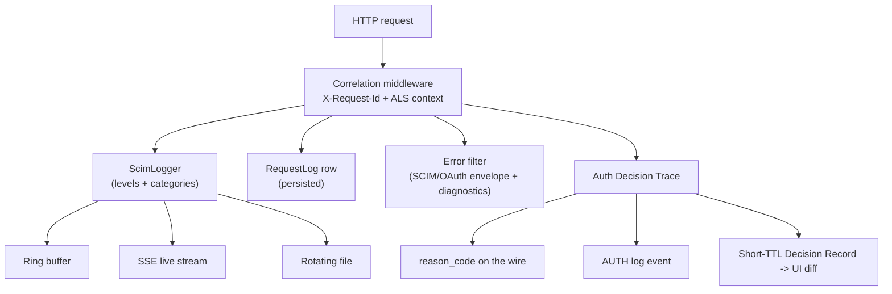
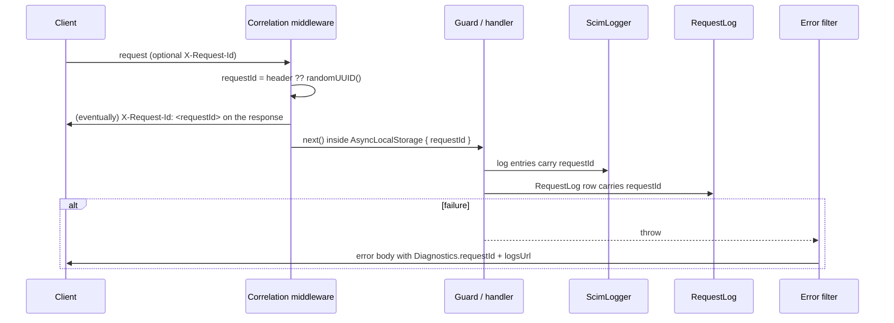
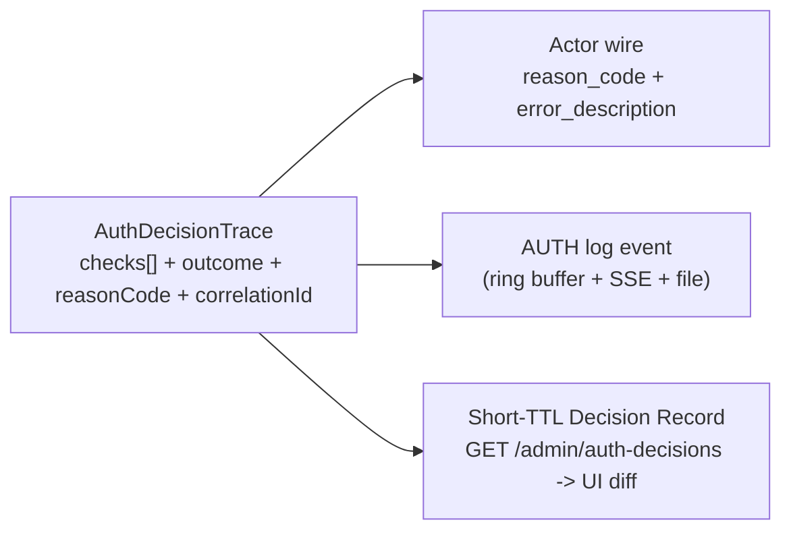

# Observability, Traceability, Correlation IDs, Logging, Error Handling and Diagnostics

> **Status:** User-facing reference - **Last verified:** 2026-07-31 - **Product version:** `0.55.8`

> **What this is.** The cross-cutting synthesis of how SCIMServer makes a request *observable*: the single correlation id and why it is not split into a trace/span family, the custom logging stack, the persistent request log, the SCIM/OAuth error envelopes with their diagnostics extension, and the Auth Decision Trace that renders one decision at three fidelities. It carries worked HTTP examples (headers + request/response bodies), Mermaid flows, endpoint tables, and an honest cross-domain comparison against W3C Trace Context, OpenTelemetry, Elastic Common Schema, and RFC 9457.

> **Scope.** This is the *architecture + comparison* doc. For the logging-stack field reference (ring buffer, SSE, file rotation, env vars) see [LOGGING_AND_OBSERVABILITY.md](LOGGING_AND_OBSERVABILITY.md); for the middleware that establishes correlation before guards see [auth/CORRELATION_MIDDLEWARE_AND_REQUEST_TRACEABILITY.md](auth/CORRELATION_MIDDLEWARE_AND_REQUEST_TRACEABILITY.md); for the auth-diagnostics design see [auth/AUTH_ERROR_DIAGNOSTICS_AND_OBSERVABILITY.md](auth/AUTH_ERROR_DIAGNOSTICS_AND_OBSERVABILITY.md); for the operator-facing usability layer see [USABILITY_GUIDE.md](USABILITY_GUIDE.md).

---

## Table of contents

1. [The five pillars](#1-the-five-pillars)
2. [The correlation ID model: one value, two role-names](#2-the-correlation-id-model-one-value-two-role-names)
3. [The ID lifecycle](#3-the-id-lifecycle)
4. [Logging stack](#4-logging-stack)
5. [Persistent request logging](#5-persistent-request-logging)
6. [Error handling: envelopes and the diagnostics extension](#6-error-handling-envelopes-and-the-diagnostics-extension)
7. [The Auth Decision Trace: one object, three fidelities](#7-the-auth-decision-trace-one-object-three-fidelities)
8. [Endpoint and surface reference](#8-endpoint-and-surface-reference)
9. [Security and PII handling](#9-security-and-pii-handling)
10. [Worked end-to-end example: a rejected WIF token mint](#10-worked-end-to-end-example-a-rejected-wif-token-mint)
11. [Cross-domain comparison scorecard](#11-cross-domain-comparison-scorecard)
12. [Gaps and roadmap](#12-gaps-and-roadmap)
13. [Test coverage](#13-test-coverage)
14. [Related docs](#14-related-docs)

---

## 1. The five pillars

| Pillar | Question it answers | Primary mechanism |
|---|---|---|
| **Traceability** | "Which request was this, and where are all its signals?" | `X-Request-Id` + `AsyncLocalStorage` correlation context |
| **Logging** | "What happened, at what severity, in which subsystem?" | `ScimLogger` (RFC 5424 levels, 14 categories, ring buffer + SSE + file) |
| **Observability** | "What is the system doing right now / recently?" | ring buffer, SSE live stream, persisted `RequestLog`, dashboard series, Auth Decision Records |
| **Error handling** | "What went wrong and in what standard shape?" | SCIM error envelope (RFC 7644), OAuth error (RFC 6749/6750), the diagnostics URN extension |
| **Diagnostics** | "*Why* did it fail, and how do I fix it?" | reason-code catalog + Auth Decision Trace (expected-vs-received) + `logsUrl` deep-link |



---

## 2. The correlation ID model: one value, two role-names

A single logical operation only needs *multiple* IDs when it crosses process or async boundaries. The general family:

| ID | Answers | Scope | Canonical source |
|---|---|---|---|
| **Request ID** | "Which single inbound HTTP call?" | one hop | `X-Request-Id` convention |
| **Correlation ID** | "Which logical transaction?" | end-to-end, many hops | enterprise integration / CQRS |
| **Trace ID** | "Which whole distributed call graph?" | whole graph | [W3C Trace Context](https://www.w3.org/TR/trace-context/), OpenTelemetry |
| **Span ID** | "Which unit of work inside the trace?" | one node | OpenTelemetry span |
| **Causation ID** | "Which message caused this one?" | parent->child edge | event sourcing (NServiceBus/MassTransit) |
| **Idempotency key** | "Has this exact write happened already?" | one write | Stripe keys, SCIM `bulkId` |

SCIMServer is a **single synchronous service** with no fan-out and no async messaging, so request-id, correlation-id, and trace-id are the *same value*. It is modelled as **one UUID with two role-names**:

- `requestId` at the HTTP/logging layer - the `X-Request-Id` header and `CorrelationContext.requestId` ([scim-logger.service.ts](../api/src/modules/logging/scim-logger.service.ts)).
- `correlationId` at the auth/domain layer - assigned directly from the request id: `correlationId: getCorrelationContext()?.requestId` ([oauth.controller.ts](../api/src/oauth/oauth.controller.ts), [admin-credential.controller.ts](../api/src/modules/scim/controllers/admin-credential.controller.ts)).

The two names are a **seam that documents intent**: they are equal today, and naming them by role means the value can diverge later (for example if a token mint fans out to a traced JWKS fetch) without renaming every field. Inventing `traceId`/`spanId` fields that would only ever hold the same value would be cargo-culting - the *correct* monolith choice is one id, named for its role.

---

## 3. The ID lifecycle

The id is minted (or honored from the client) in an Express middleware that runs **before** guards, so even a guard-rejected `401` is traceable (see [auth/CORRELATION_MIDDLEWARE_AND_REQUEST_TRACEABILITY.md](auth/CORRELATION_MIDDLEWARE_AND_REQUEST_TRACEABILITY.md)). One value then flows to every downstream artifact:



A client may supply its own `X-Request-Id` to stitch SCIMServer's logs to an upstream system; if absent, the server mints a UUID. The same value is echoed on the response header, stamped on every log entry, persisted on the `RequestLog` row, embedded in the error `Diagnostics`, and set as the Auth Decision Trace `correlationId`.

---

## 4. Logging stack

SCIMServer uses a fully custom, zero-dependency logging stack (no Winston/Pino/Bunyan) built on the NestJS `Logger`, `AsyncLocalStorage`, and `fs`. Full field reference: [LOGGING_AND_OBSERVABILITY.md](LOGGING_AND_OBSERVABILITY.md).

### 4.1 Levels (RFC 5424 / OpenTelemetry aligned)

`TRACE(0) -> DEBUG(1) -> INFO(2) -> WARN(3) -> ERROR(4) -> FATAL(5) -> OFF(6)` ([log-levels.ts](../api/src/modules/logging/log-levels.ts)). The global level, each category, and each endpoint can be tuned independently at runtime via the admin API (no restart).

### 4.2 Categories (14 subsystems)

`http`, `auth`, `scim.user`, `scim.group`, `scim.patch`, `scim.filter`, `scim.discovery`, `endpoint`, `database`, `oauth`, `scim.bulk`, `scim.resource`, `config`, `general`.

### 4.3 Structured log entry

Every entry ([scim-logger.service.ts](../api/src/modules/logging/scim-logger.service.ts) `StructuredLogEntry`) carries the correlation id so any log line pivots to its request:

```json
{
  "timestamp": "2026-07-22T00:39:44.512Z",
  "level": "WARN",
  "category": "auth",
  "message": "Auth decision",
  "requestId": "a16360c6-db64-4949-ae7c-3bb49084a32e",
  "endpointId": "d915cf86-414f-47a0-98e0-bcaf45791c9b",
  "method": "POST",
  "path": "/scim/endpoints/d915cf86-414f-47a0-98e0-bcaf45791c9b/oauth/token",
  "durationMs": 435,
  "data": {
    "outcome": "reject",
    "plane": "token-mint",
    "method": "oauth_client",
    "reasonCode": "oauth_client_auth_failed",
    "checkCount": 5,
    "failedChecks": [
      "secret_match"
    ]
  }
}
```

### 4.4 Output and transports

- **Pretty vs JSON** output (`LOG_FORMAT`) - human-readable in dev, machine JSON in production.
- **Ring buffer** - the recent-N entries in memory, queried at `GET /scim/admin/log-config/recent` (filterable by level/category/requestId).
- **SSE live stream** - a Server-Sent-Events feed the UI subscribes to for live logs.
- **Rotating file transport** - size-based rotation on disk.

---

## 5. Persistent request logging

Each request (except successful health probes) becomes a durable `RequestLog` row ([logging.service.ts](../api/src/modules/logging/logging.service.ts)), at parity across the Prisma and InMemory backends. Fields include `method`, `url`, `status`, `durationMs`, the request/response headers + bodies (redaction-gated), `errorMessage`, a derived reportable `identifier`, the `requestId`, and - since V10 - the persisted auth summary `authOutcome` / `authMethod` / `authReason` / `authCredentialId` (see [auth/CREDENTIAL_LIFECYCLE_AND_AUTH_IN_LOGS_PLAN.md](auth/CREDENTIAL_LIFECYCLE_AND_AUTH_IN_LOGS_PLAN.md)).

A list item from `GET /scim/admin/logs`:

```json
{
  "id": "6efa1e04-f9da-42e5-9a98-39ca0b248e87",
  "method": "POST",
  "url": "/scim/endpoints/d915cf86-414f-47a0-98e0-bcaf45791c9b/oauth/token",
  "status": 401,
  "durationMs": 435,
  "createdAt": "2026-07-22T00:39:44.887Z",
  "errorMessage": "Http Exception",
  "reportableIdentifier": null,
  "requestId": "a16360c6-db64-4949-ae7c-3bb49084a32e",
  "authOutcome": "reject",
  "authMethod": "oauth_client",
  "authReason": "oauth_client_auth_failed"
}
```

Because the auth outcome lives on the row itself, the logs list renders it instantly and durably (it survives the 30-minute Decision-Record TTL), and `GET /scim/admin/logs?requestId=<id>` pivots straight from any error to its request.

### 5.1 Pre-parse failures: the body is captured or explicitly marked

A request can fail *before* its body is parsed into `request.body` - a malformed JSON body (400) or a wrong `Content-Type` (415). The row is still persisted (the exception filters run), and its stored `requestBody` is never silently empty ([request-body-capture.ts](../api/src/modules/logging/request-body-capture.ts)):

- **Malformed JSON (right content-type).** The body parsers install a `verify` hook ([body-parsers.ts](../api/src/bootstrap/body-parsers.ts)) that stashes the raw buffer *before* parsing, so even when `JSON.parse` throws, the bytes are recovered as a capped preview:

```json
{
  "_bodyNotCaptured": true,
  "reason": "unparseable",
  "contentType": "application/scim+json",
  "contentLength": 24,
  "_rawPreview": "{ \"userName\": \"broken\", "
}
```

- **Wrong content-type (415).** The parser is skipped entirely (its type predicate is false), so there are no raw bytes; the row records a marker naming the content-type and length instead:

```json
{
  "_bodyNotCaptured": true,
  "reason": "content-type-rejected",
  "contentType": "text/plain",
  "contentLength": 39
}
```

Two cross-cutting safeties apply to every stored body: it is **size-capped** (`MAX_STORED_BODY_BYTES`, over-cap bodies become a `{ "_truncated": true, "originalLength": N, "preview": "..." }` marker so a multi-MB payload cannot bloat the table), and the free-text `_rawPreview` is **redacted** (`[REDACTED]`) when the effective `PersistRequestSecrets` flag is off, since a key-based redactor cannot reach a blob's contents.

---

## 6. Error handling: envelopes and the diagnostics extension

SCIMServer returns the *standard* shape for each protocol, then augments it with a vendor diagnostics extension that never changes the standard fields.

### 6.1 SCIM error envelope (RFC 7644 §3.12)

Resource-plane errors use the SCIM `Error` schema. The vendor extension `urn:scimserver:api:messages:2.0:Diagnostics` carries the `requestId`, `endpointId`, and a resolved `logsUrl`, plus a `reason_code` when a guard set one. Because SCIM ignores unknown members, this is safe for Entra and every SCIM client.

```http
GET /scim/v2/endpoints/d915cf86-.../Users HTTP/1.1
Host: scimserver-dev.purplecliff-91e4026d.eastus.azurecontainerapps.io
Authorization: Bearer bogus-token
Accept: application/scim+json
```

```http
HTTP/1.1 401 Unauthorized
Content-Type: application/scim+json; charset=utf-8
X-Request-Id: 8f1c0b2a-9d3e-4f77-a1b2-3c4d5e6f7a8b
WWW-Authenticate: Bearer error="invalid_token"
```

```json
{
  "schemas": [
    "urn:ietf:params:scim:api:messages:2.0:Error"
  ],
  "detail": "Authentication failed.",
  "status": "401",
  "urn:scimserver:api:messages:2.0:Diagnostics": {
    "reason_code": "bearer_invalid",
    "requestId": "8f1c0b2a-9d3e-4f77-a1b2-3c4d5e6f7a8b",
    "logsUrl": "/scim/endpoints/d915cf86-.../logs/recent?requestId=8f1c0b2a-9d3e-4f77-a1b2-3c4d5e6f7a8b"
  }
}
```

### 6.2 OAuth token error (RFC 6749 §5.2 / RFC 6750)

The token endpoint returns the *native* OAuth JSON (NOT the SCIM envelope), enriched with a stable `reason_code`, `correlation_id`, and `timestamp`. The generic `error` stays RFC-6749-valid; specificity lives in `reason_code` + `error_description` (the Entra AADSTS model).

```http
POST /scim/endpoints/d915cf86-.../oauth/token HTTP/1.1
Content-Type: application/x-www-form-urlencoded

grant_type=client_credentials&client_id=epc_ab12&client_secret=wrong
```

```json
{
  "error": "invalid_client",
  "error_description": "Client authentication failed.",
  "reason_code": "oauth_client_auth_failed",
  "correlation_id": "a16360c6-db64-4949-ae7c-3bb49084a32e",
  "timestamp": "2026-07-22T00:39:44.512Z"
}
```

### 6.3 The reason-code catalog

Every reason an operator can see is a bounded, additive allowlist ([auth-reason-catalog.ts](../api/src/oauth/auth-reason-catalog.ts)) published at a public reference endpoint. Each entry carries the RFC wire error it maps to, its plane, its visibility tier, an actor description, and a remediation hint - the same module the runtime uses, so wire/log/UI can never drift.

```http
GET /scim/docs/auth-errors?plane=oauth_client HTTP/1.1
```

```json
{
  "description": "Auth-failure reason-code catalog. reason_code appears in token-endpoint error bodies, AUTH log events, and the admin diagnostics UI.",
  "docsUrl": "https://github.com/pranems/scimserver/blob/main/docs/auth/AUTH_ERROR_DIAGNOSTICS_AND_OBSERVABILITY.md",
  "count": 1,
  "reasons": [
    {
      "reasonCode": "oauth_client_auth_failed",
      "wireError": "invalid_client",
      "plane": "oauth_client",
      "tier": "T3",
      "actorDescription": "Client authentication failed.",
      "remediation": "Verify the client_id and client_secret; rotate the secret if unsure."
    }
  ]
}
```

The four visibility tiers govern how much reaches the actor on the wire while the admin UI and logs always get full fidelity: **T1** config-transparent (safe to reveal), **T2** protocol (request-shape), **T3** secret-opaque (never distinguish existence vs correctness of a secret - enumeration defense), **T4** internal (generic on wire, full detail log-only).

---

## 7. The Auth Decision Trace: one object, three fidelities

The strongest diagnostic primitive. A validator builds one `AuthDecisionTrace` ([auth-decision-trace.ts](../api/src/oauth/auth-decision-trace.ts)) recording each check as a structured step (`id`, `status`, `expected`, `received`, `detail`), then the surrounding layers render that ONE object at three fidelities so they can never disagree:



The short-TTL admin store keeps recent decisions for 30 minutes (`AUTH_DECISION_STORE_TTL_MS`, [auth-decision-record.store.ts](../api/src/oauth/auth-decision-record.store.ts)) and powers the UI expected-vs-received diff. A recorded reject (secrets never present):

```json
{
  "id": "adr_3f_lm90x",
  "recordedAt": "2026-07-22T00:39:44.512Z",
  "plane": "token-mint",
  "method": "wif",
  "outcome": "reject",
  "reasonCode": "wif_audience_mismatch",
  "endpointId": "d915cf86-414f-47a0-98e0-bcaf45791c9b",
  "correlationId": "a16360c6-db64-4949-ae7c-3bb49084a32e",
  "checks": [
    { "id": "jwks_signature", "status": "pass", "expected": "RS256", "received": "RS256" },
    { "id": "issuer_match", "status": "pass", "expected": "https://issuer", "received": "https://issuer" },
    { "id": "audience_match", "status": "fail", "expected": "api://app", "received": "api://wrong" }
  ],
  "decodedClaims": { "iss": "https://issuer", "aud": "api://wrong" }
}
```

---

## 8. Endpoint and surface reference

All admin surfaces require a bearer (OAuth token or the SCIM shared secret); the catalog is public.

| Surface | Method + path | Purpose |
|---|---|---|
| Ring buffer (recent logs) | `GET /scim/admin/log-config/recent?level=&category=&requestId=&limit=` | Live in-memory recent entries |
| Log config | `GET` / `PUT /scim/admin/log-config` | Read/replace the whole log config |
| Global level | `PUT /scim/admin/log-config/level/:level` | Set global minimum level |
| Category level | `PUT /scim/admin/log-config/category/:category/:level` | Per-subsystem override |
| Endpoint level | `PUT /scim/admin/log-config/endpoint/:endpointId/:level` | Per-endpoint override |
| Audit trail | `GET /scim/admin/log-config/audit` | Config-change audit |
| Request logs (list) | `GET /scim/admin/logs?endpointId=&status=&since=&requestId=&search=&pageSize=` | Persisted request rows |
| Request log (detail) | `GET /scim/admin/logs/:id` | Full headers + parsed bodies |
| Clear / prune | `POST /scim/admin/logs/clear` · `POST /scim/admin/logs/prune` | Maintenance |
| Per-endpoint recent | `GET /scim/endpoints/:endpointId/logs/recent` | Tenant-scoped recent logs |
| Per-endpoint stream | `GET /scim/endpoints/:endpointId/logs/stream` | Tenant-scoped SSE |
| Per-endpoint history | `GET /scim/endpoints/:endpointId/logs/history` | Tenant-scoped persisted rows |
| Auth decisions (global) | `GET /scim/admin/auth-decisions?outcome=&reasonCode=&limit=` | Recent auth decisions |
| Auth decisions (per-endpoint) | `GET /scim/admin/endpoints/:endpointId/auth-decisions` | Tenant-scoped decisions |
| Reason catalog | `GET /scim/docs/auth-errors?plane=` (public) | Machine-readable reason codes |
| Dashboard | `GET /scim/admin/dashboard` | Request series + health rollup |
| Version | `GET /scim/admin/version` | Build + runtime + storage facts |

---

## 9. Security and PII handling

- **Secrets by reference, never in traces.** The Auth Decision Trace and its log event carry only non-secret decoded identifiers (a signed JWT's `iss`/`aud`, not the signature); raw assertions, tokens, and client secrets are never placed in a trace or a decision record.
- **Redaction on persistence.** When the effective `PersistRequestSecrets` flag is off, a recursive redactor ([redact-sensitive.ts](../api/src/security/redact-sensitive.ts)) masks secret-bearing header/body values before the `RequestLog` row is written; structured console/file logs always redact nested secrets regardless of the flag (defense in depth).
- **Enumeration defense.** T3 secret-opaque reasons are merged on the wire so a caller cannot distinguish "secret not found" from "secret mismatch" - the admin UI and logs still see the specific reason.
- **Health-probe noise control.** Successful health `GET`s are dropped before the buffer; failed ones are kept (they are what an operator wants).

---

## 10. Worked end-to-end example: a rejected WIF token mint

A federation assertion with the wrong audience, traced across all five pillars with one id `a16360c6-...`:

1. **Request** - `POST /scim/endpoints/<id>/oauth/token` with `grant_type=urn:ietf:params:oauth:grant-type:jwt-bearer&assertion=<jwt>`.
2. **Wire response** - `401` native OAuth JSON:

```json
{
  "error": "invalid_client",
  "error_description": "The federated assertion's audience does not match the endpoint.",
  "reason_code": "wif_audience_mismatch",
  "correlation_id": "a16360c6-db64-4949-ae7c-3bb49084a32e",
  "timestamp": "2026-07-22T00:39:44.512Z"
}
```

3. **AUTH log event** - one WARN entry in category `auth` with `outcome: reject`, `reasonCode: wif_audience_mismatch`, `failedChecks: ["audience_match"]`, `correlationId` equal to the wire `correlation_id`.
4. **Decision Record** - queryable for 30 minutes at `GET /scim/admin/auth-decisions?outcome=reject`, carrying the full `checks[]` with `expected: api://app` vs `received: api://wrong`.
5. **Request log row** - `GET /scim/admin/logs?requestId=a16360c6-...` returns the row with `authOutcome: reject`, `authMethod: wif`, `authReason: wif_audience_mismatch`.

One id; five consistent views; a click from the error to the log; a precise "you sent `api://wrong`, this endpoint expects `api://app`" diff.

---

## 11. Cross-domain comparison scorecard

| Aspect | Best practice across domains | SCIMServer | Verdict |
|---|---|---|---|
| Correlation propagation | Establish at edge, carry context-locally, echo on response | ALS + `X-Request-Id` on *every* response incl. guard rejections | Meets / exceeds |
| Client-supplied id | Accept inbound id for cross-system stitching | Honors client `X-Request-Id`, else mints UUID | Meets |
| ID naming by role | Name for role, do not over-invent | One value, `requestId` (HTTP) / `correlationId` (domain) | Pragmatic best practice |
| Distributed tracing | [W3C Trace Context](https://www.w3.org/TR/trace-context/), OTel `trace_id`+`span_id`, baggage | None - single flat id | Gap (fine while single-service) |
| Causation id | parent->child edge in async/event systems | None | Gap only if it goes async |
| Structured log schema | [Elastic Common Schema](https://www.elastic.co/guide/en/ecs/current/index.html) / [OTel log conventions](https://opentelemetry.io/docs/specs/semconv/general/logs/) | Custom stable JSON, bespoke field names | Meets intent, non-standard shape |
| Log levels | RFC 5424 | RFC 5424 + OFF, runtime per-category/endpoint | Meets / exceeds |
| HTTP error format | [RFC 9457 Problem Details](https://www.rfc-editor.org/rfc/rfc9457) generically | SCIM RFC 7644 + diagnostics URN + RFC 6749/6750 at token | Domain-correct (Problem Details would be wrong here) |
| Error -> log pivot | Return a correlation id | Returns `requestId` AND a resolved `logsUrl` deep-link | Exceeds |
| Single source of truth | Avoid wire/log/UI drift | Auth Decision Trace: one object, 3 fidelities | Exceeds |
| PII handling | Redact before persistence + logs (GDPR) | Recursive redactor + secrets-by-reference | Meets |
| Metrics (RED/USE) | Rate/Errors/Duration export (Prometheus/OTel) | Slow-request flags + dashboard series, no export | Gap |
| Sampling | Head/tail sampling at scale | None (full persistence + ring buffer) | Fine now, will not scale to high QPS |

---

## 12. Gaps and roadmap

The honest gaps are all "distributed-system" features, consciously deferred (see [DELIVERY_PLAN.md](DELIVERY_PLAN.md)) and worth adding exactly when the topology stops being a single synchronous service:

1. **`traceparent` ingestion (lowest-cost interop win).** Read an inbound [W3C `traceparent`](https://www.w3.org/TR/trace-context/) and use its `trace-id` as the correlation id when present (mint otherwise). Near-zero effort; makes the existing id interoperate with any upstream tracer without adopting full OTel.
2. **Span hierarchy / OTel export.** When the Entra JWKS fetch or a Postgres query should appear as child spans of the inbound request, add OpenTelemetry with `trace_id` + `span_id` and export to a collector.
3. **Metrics signal.** A `/metrics` endpoint (RED metrics: rate, errors, duration histograms) so the same `requestId` can correlate a slow-trace log with a latency percentile.
4. **OTel/ECS-standard log field names.** Emit `trace.id` / `service.name` / `severity_text` aliases so logs drop into Datadog/Elastic/Loki without a custom parser.
5. **Causation id** - only when a bulk op or webhook becomes async; SCIM `bulkId` / `CorrelationContext.bulkOperationIndex` is the hook to build on.

---

## 13. Test coverage

| Layer | File | Locks |
|---|---|---|
| Unit | [scim-logger.service.spec.ts](../api/src/modules/logging/scim-logger.service.spec.ts) | Correlation context set/leak/enrich; structured entry shape |
| Unit | [auth-decision-trace.spec.ts](../api/src/oauth/auth-decision-trace.spec.ts) | Trace -> event mapping; context stamping; no secret leakage |
| Unit | [auth-reason-catalog.spec.ts](../api/src/oauth/auth-reason-catalog.spec.ts) | Catalog validity, tiers, wire-error mapping |
| Unit | [logging-auth-summary.spec.ts](../api/src/modules/logging/logging-auth-summary.spec.ts) | Auth summary persisted + projected (both backends) |
| Unit | [scim-exception.filter.spec.ts](../api/src/modules/scim/filters/scim-exception.filter.spec.ts) | Diagnostics enrichment from context or stashed meta |
| E2E | [auth-reason-codes.e2e-spec.ts](../api/test/e2e/auth-reason-codes.e2e-spec.ts) | Guard-rejected 401 carries reason_code + requestId + header |
| E2E | [error-handling.e2e-spec.ts](../api/test/e2e/error-handling.e2e-spec.ts) | X-Request-Id present + client id propagated |
| E2E | [global-logs-filters.e2e-spec.ts](../api/test/e2e/global-logs-filters.e2e-spec.ts) | `?requestId=` round-trips the X-Request-Id |
| E2E | [endpoint-oauth-client.e2e-spec.ts](../api/test/e2e/endpoint-oauth-client.e2e-spec.ts) | Decision events + auth summary on the request log |

---

## 14. Related docs

- [LOGGING_AND_OBSERVABILITY.md](LOGGING_AND_OBSERVABILITY.md) - the logging-stack field reference (ring buffer, SSE, rotation, env vars).
- [auth/CORRELATION_MIDDLEWARE_AND_REQUEST_TRACEABILITY.md](auth/CORRELATION_MIDDLEWARE_AND_REQUEST_TRACEABILITY.md) - why correlation is established before guards.
- [auth/AUTH_ERROR_DIAGNOSTICS_AND_OBSERVABILITY.md](auth/AUTH_ERROR_DIAGNOSTICS_AND_OBSERVABILITY.md) - the auth-diagnostics design + visibility tiers.
- [auth/CREDENTIAL_LIFECYCLE_AND_AUTH_IN_LOGS_PLAN.md](auth/CREDENTIAL_LIFECYCLE_AND_AUTH_IN_LOGS_PLAN.md) - V10-V12 durable auth-on-log.
- [USABILITY_GUIDE.md](USABILITY_GUIDE.md) - the operator-facing usability layer built on top of these signals.
