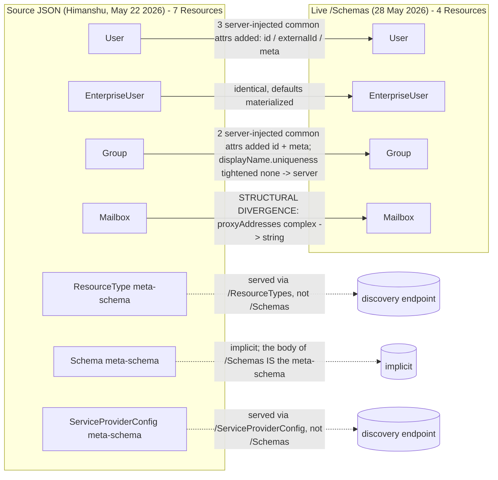
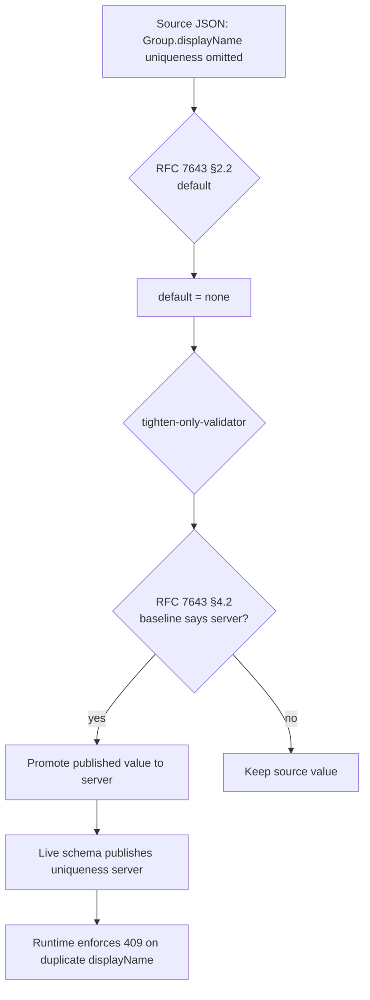

# OpenText ISV-3 Schema: Source-of-Truth vs Live Endpoint

> **Subject:** Endpoint `128f64b5-ffb5-41f2-9ba2-c874f5ea7335` (`scimserver-prod`, OpenText ISV-3 / "Customer Portal")
> **Source document:** `opentext scim schema_himanshu_May_22_2026.json` (Himanshu, OpenText, dated 22 May 2026)
> **Live capture:** `GET /scim/endpoints/128f64b5-.../Schemas` on `scimserver-prod` (28 May 2026)
> **Author:** Schema-conformance audit, May 28, 2026
> **Related:**
> - [ENDPOINT_PROFILE_ARCHITECTURE.md](ENDPOINT_PROFILE_ARCHITECTURE.md) - how the live profile is stored and served
> - [SCHEMA_CUSTOMIZATION_GUIDE.md](SCHEMA_CUSTOMIZATION_GUIDE.md) - the operator-facing customization workflow
> - [ENDPOINT_CONFIG_FLAGS_REFERENCE.md](ENDPOINT_CONFIG_FLAGS_REFERENCE.md) - `StrictSchemaValidation` and friends
> - RFC 7643 §2 (Attribute Characteristics), §3.1 (Common Attributes), §4 (User & Group resources), §7 (Schema Definition)
> - RFC 7644 §3.1 (Unrecognized attributes), §3.5.1 (HTTP POST), §3.14 (ETag)

---

## 1. Purpose

This document is a side-by-side audit between the **schema specification** the OpenText team provided (the attached `opentext scim schema_himanshu_May_22_2026.json`, treated here as the source-of-truth contract) and the **schemas the live endpoint actually publishes** at `/scim/endpoints/128f64b5-.../Schemas`. It enumerates every difference, classifies each as benign / intentional-tightening / structural, and explains the impact on a SCIM client (Entra ID or any other) that relies on the published schema.

This is the reference companion to the May 28, 2026 production rejection on `POST .../Users` for endpoint `128f64b5-...` (request id `510cd960-d84d-4197-9740-9f8cd43107b0`). That rejection is a pure schema-vs-payload mismatch (already analyzed in the operator notebook); this document explains why the schema itself looks the way it does.

---

## 2. Inventory diff at a glance



| Schema URN | In source? | In live `/Schemas`? | Verdict |
|---|---|---|---|
| `...:core:2.0:User` | yes | yes | aligned (with materialized defaults + 3 common attrs added) |
| `...:extension:enterprise:2.0:User` | yes (1 attr: `department`) | yes (1 attr: `department`) | identical |
| `...:core:2.0:Group` | yes | yes | aligned **except** `displayName.uniqueness` tightened |
| `...:extension:opentext:2.0:Mailbox` | yes (complex `proxyAddresses` with `value` + `type` sub-attrs) | yes (multi-valued **string** `proxyAddresses`) | **STRUCTURAL DIVERGENCE** |
| `...:core:2.0:ResourceType` | yes | no | served by `/ResourceTypes` (RFC 7644 §4) |
| `...:core:2.0:Schema` | yes | no | implicit meta-schema; body of `/Schemas` itself |
| `...:core:2.0:ServiceProviderConfig` | yes | no | served by `/ServiceProviderConfig` (RFC 7644 §4) |

---

## 3. User schema (`urn:ietf:params:scim:schemas:core:2.0:User`)

### 3.1 Top-level attribute inventory

| Attribute | In source? | In live? | Diff |
|---|---|---|---|
| `id` | no | **yes** (`readOnly`, `returned: always`, `uniqueness: server`) | live adds RFC 7643 §3.1 common attr |
| `externalId` | no | **yes** (`caseExact: true`) | live adds RFC 7643 §3.1 common attr |
| `meta` | no | **yes** (complex with `resourceType / created / lastModified / location / version`) | live adds RFC 7643 §3.1 common attr |
| `userName` | yes (`required: true`, `uniqueness: server`) | yes (same) | match; defaults materialized |
| `active` | yes (boolean) | yes | match; defaults materialized |
| `name` | yes (complex, `required: true`) | yes (same) | match |
| `displayName` | yes | yes | match |
| `title` | yes | yes | match |
| `emails` | yes (complex multi) | yes | match (see §3.3) |
| `phoneNumbers` | yes (complex multi) | yes | match (see §3.4) |
| `addresses` | yes (complex multi) | yes | match (see §3.5) |

**Verdict: source = 8 attrs, live = 11 attrs.** The 3 extras (`id`, `externalId`, `meta`) are RFC 7643 §3.1 **common attributes** that every SCIM resource has by definition. The source author relied on them being implicit; the live server materializes them so discovery is self-describing. This is benign and RFC-correct.

### 3.2 `name` (complex)

| Sub-attribute | Source | Live | Diff |
|---|---|---|---|
| `givenName` | `required: true`, `readWrite`, `none` | same | match |
| `familyName` | `required: true`, `readWrite`, `none` | same | match |

**No `formatted`, `middleName`, `honorificPrefix`, `honorificSuffix`** in either. Live faithfully mirrors source. A client sending those gets `Unknown sub-attribute 'X' in complex attribute.` (production reproducer: `name.formatted`, `name.honorificPrefix`, `name.honorificSuffix` were the first 3 rejections in the May 28 incident).

### 3.3 `emails` (complex multi-valued)

| Sub-attribute | Source | Live | Diff |
|---|---|---|---|
| `value` | string, `readWrite` | same | match |
| `type` | string, `canonicalValues: [work]` | same | match |

**No `display`, no `primary`** in either. Canonical set is `[work]` only (not RFC-suggested `[work, home, other]`). Clients sending `emails[*].primary` get `Unknown sub-attribute 'primary' in complex attribute.`; sending `type: home` or `type: other` gets `Attribute 'type' value 'home' is not one of the canonical values: [work].`

### 3.4 `phoneNumbers` (complex multi-valued)

| Sub-attribute | Source | Live | Diff |
|---|---|---|---|
| `value` | string, `readWrite` | same | match |
| `type` | string, `canonicalValues: [work, mobile, fax]` | same | match |

**No `display`, no `primary`** in either. Canonical set is `[work, mobile, fax]` (3 of the RFC's 6 standard values). `home`, `other`, `pager` are rejected on the wire.

### 3.5 `addresses` (complex multi-valued)

| Sub-attribute | Source | Live | Diff |
|---|---|---|---|
| `streetAddress` | string | same | match |
| `type` | string, `canonicalValues: [work]` | same | match |
| `primary` | boolean | same | match |
| `country` | string | same | match |
| `locality` | string | same | match |
| `postalCode` | string | same | match |
| `region` | string | same | match |

**No `formatted`** in either. Live mirrors source exactly. Worth highlighting because `addresses` is the only complex attribute where the source intentionally includes `primary` (it's absent from `emails` and `phoneNumbers`). The live endpoint reproduces this asymmetry.

---

## 4. EnterpriseUser extension (`urn:ietf:params:scim:schemas:extension:enterprise:2.0:User`)

| Attribute | Source | Live | Diff |
|---|---|---|---|
| `department` | `string`, `readWrite`, `none` | same (+ materialized `required: false / caseExact: false`) | match |

**This is the most aggressive trim in the entire schema.** RFC 7643 §4.3 EnterpriseUser defines 6 attributes (`employeeNumber, costCenter, organization, division, department, manager`); source and live both keep only `department`. Every other Entra-standard enterprise mapping (`costCenter, division, employeeNumber, organization, manager`) is rejected.

This is intentional on the OpenText side and faithfully reproduced by the live endpoint.

---

## 5. Group schema (`urn:ietf:params:scim:schemas:core:2.0:Group`)

### 5.1 Top-level attribute inventory

| Attribute | Source | Live | Diff |
|---|---|---|---|
| `id` | no | **yes** (`readOnly`, `returned: always`, `uniqueness: server`) | live adds RFC 7643 §3.1 common attr |
| `meta` | no | **yes** (complex) | live adds RFC 7643 §3.1 common attr |
| `displayName` | `required: true` (uniqueness omitted -> default `none`) | `required: true`, `uniqueness: server` **(tightened)** | **INTENTIONAL TIGHTENING - see §5.2** |
| `externalId` | `caseExact: true`, `readWrite` | same | match |
| `members` | complex multi (`value` immutable, `$ref` immutable, `display` readOnly) | same | match |

### 5.2 `displayName.uniqueness`: source default vs live "server"

The source JSON omits the `uniqueness` characteristic on `Group.displayName`. Per RFC 7643 §2.2, an omitted `uniqueness` characteristic defaults to `none` (no uniqueness enforced).

The live endpoint publishes `uniqueness: "server"`. The live attribute's `description` field explicitly annotates the reason:

> *"A human-readable name for the Group. REQUIRED. (uniqueness tightened from OpenText 'none' to 'server' to satisfy the SCIMServer RFC 7643 §7 tightening-only policy.)"*

**Why:** RFC 7643 §7 permits a server to enforce stricter than what it advertises, but this codebase's profile-validation pipeline ([api/src/modules/scim/endpoint-profile/tighten-only-validator.ts](../api/src/modules/scim/endpoint-profile/tighten-only-validator.ts)) inverts that: it requires the published value to be at least as strict as the global RFC baseline. The RFC-baseline for `Group.displayName` is `uniqueness: server`. So when the source declares (implicitly) `none`, the validator promotes it to `server` so the published schema is honest about what the server will enforce.

**Behavioral impact:** a client that tries to `POST` two Groups with the same `displayName` will get a 409 `uniqueness` conflict on this endpoint. Under the source's stated contract that would have been allowed. This is the only **semantic** difference in the entire core User+Group surface.



### 5.3 `members` sub-attributes

All 3 sub-attributes (`value`, `$ref`, `display`) and their `mutability` characteristics (`immutable`, `immutable`, `readOnly`) match source byte-for-byte.

---

## 6. Mailbox extension (`urn:ietf:params:scim:schemas:extension:opentext:2.0:Mailbox`) - STRUCTURAL DIVERGENCE

### 6.1 The two shapes side by side

**Source JSON (May 22, Himanshu):**
```json
{
  "name": "proxyAddresses",
  "type": "complex",
  "multiValued": true,
  "subAttributes": [
    { "name": "value", "type": "string" },
    { "name": "type", "type": "string", "canonicalValues": [] }
  ]
}
```

**Live endpoint:**
```json
{
  "name": "proxyAddresses",
  "type": "string",
  "multiValued": true
}
```

Live `description` explicitly flags the divergence:
> *"ISV-3 variant: proxyAddresses is a multi-valued string (list of plain strings) instead of a multi-valued complex."*

### 6.2 Wire-format incompatibility

The two shapes accept **disjoint payload formats**:

| Field shape | Source payload | Live payload |
|---|---|---|
| Single value | `{ "value": "SMTP:foo@x.com", "type": "" }` | `"SMTP:foo@x.com"` |
| Multi value | `[{ "value": "SMTP:foo@x.com", "type": "" }, { "value": "smtp:bar@x.com", "type": "" }]` | `["SMTP:foo@x.com", "smtp:bar@x.com"]` |

A client coded to the source spec will fail strict validation on live because the server expects strings and gets objects. A client coded to live will fail source validation for the inverse reason. **This is the only attribute in the entire schema with a wire-incompatible shape difference.**

### 6.3 Why the divergence exists

The live description tag (`"ISV-3 variant"`) and the SCIMServer profile-presets history both point to a deliberate ISV-3 customization where the OpenText team standardized on the flat-string form. The source JSON the customer attached for this audit pre-dates that decision or describes a different ISV variant; either way the live endpoint is the operational truth for the `scimserver-prod` deployment.

### 6.4 What to do

Three options, listed by preference:

1. **Confirm with the OpenText team which shape is canonical for ISV-3.** If flat-string is correct, update the customer-side documentation to match the live `description`. If complex-with-`value/type` is correct, update the endpoint profile via `PUT /scim/admin/endpoints/128f64b5-.../profile` to restore the complex shape.
2. **Add a Mailbox compat shim** at the integration layer that converts between the two shapes per-direction.
3. **Leave it as-is and document the divergence** in the consumer's runbook so client implementers know to send strings, not objects.

---

## 7. RFC defaults: source omissions, live materialization

The source JSON consistently omits the following characteristics on most attributes, relying on RFC 7643 §2.2 defaults. The live endpoint materializes them so the published schema is self-describing.

| Characteristic | RFC 7643 §2.2 default when omitted | Source frequency | Live frequency |
|---|---|---|---|
| `required` | `false` | omitted on most non-id/userName/name attrs | always present (false where source omitted) |
| `caseExact` | `false` (for strings) | omitted on most strings | always present (false where source omitted) |
| `mutability` | `readWrite` | omitted | always present |
| `returned` | `default` | omitted on most attrs | always present |
| `uniqueness` | `none` | omitted on most attrs | always present (with the §5.2 tightening exception) |
| `multiValued` | `false` | omitted | always present (per-attr boolean) |

**Verdict:** all of these are **byte-different but semantically identical** (with the §5.2 exception). Any RFC-correct validator yields the same accept/reject decision against either representation. The live form is more durable because tooling that doesn't know the defaults can still read the schema correctly.

For project-internal test guidance on this pattern, see the Schema-Characteristic Test Rule in [the standing rules](../.github/copilot-instructions.md) (use `expectCharacteristicIn` / `effectiveCharacteristic` helpers, never raw `attr.<key>` comparisons).

---

## 8. Meta-schemas omitted from `/Schemas`

The source bundle contains 3 SCIM meta-schemas (`ResourceType`, `Schema`, `ServiceProviderConfig`) that describe what discovery responses themselves look like. The live `/Schemas` endpoint does not return them.

This is not a bug. Per RFC 7644 §4:
- `ResourceType` is served at `GET /ResourceTypes`
- `ServiceProviderConfig` is served at `GET /ServiceProviderConfig`
- `Schema` meta-schema is implicit: every entry in the `/Schemas` ListResponse already conforms to it

Microsoft Entra ID and other major SCIM clients only consume `/Schemas` for the domain schemas (User, Group, extensions); they consume the meta-schemas from their dedicated discovery endpoints. This pattern is already implemented in [api/src/modules/scim/controllers/endpoint-scim-discovery.controller.ts](../api/src/modules/scim/controllers/endpoint-scim-discovery.controller.ts).

If the OpenText team requires the meta-schemas to be returned by `/Schemas` for parity with another reference implementation, that's a small feature ask (extend the discovery controller to merge the 3 meta-schemas into the `/Schemas` ListResponse). It is not currently a published behavior.

---

## 9. Production rejection juxtaposition (May 28, 2026 incident)

This section juxtaposes the actual May 28, 2026 production `POST /scim/endpoints/128f64b5-.../Users` payload (request id `510cd960-d84d-4197-9740-9f8cd43107b0`) against the source JSON and the live `/Schemas`. The point is to prove that every single rejection in that 400 traces back to a schema slot that **both** the source JSON and the live endpoint agree does not exist (with the one Mailbox structural exception called out in §6, which is not exercised by this payload).

The 400 response listed 37 `attributePaths` entries; 5 of those are duplicates introduced by the validator walking the enterprise-extension block twice. Unique violations: **32**, distributed across 5 rule classes.

### 9.1 Group A - `name.subAttributes` (3 unique)

Source JSON `name.subAttributes`: `[givenName, familyName]` (both `required: true`).
Live `name.subAttributes`: same.

| Payload field | Source has it? | Live has it? | 400 error message | Validator rule |
|---|---|---|---|---|
| `name.formatted = "Fdxojq"` | NO | NO | `name.formatted: Unknown sub-attribute 'formatted' in complex attribute.` | `validateSubAttributes` -> key not in `subMap` |
| `name.honorificPrefix = "Mr."` | NO | NO | `name.honorificPrefix: Unknown sub-attribute 'honorificPrefix' in complex attribute.` | same |
| `name.honorificSuffix = "Qqpytq"` | NO | NO | `name.honorificSuffix: Unknown sub-attribute 'honorificSuffix' in complex attribute.` | same |
| `name.familyName = "Gdseic"` | YES | YES | (accepted) | - |
| `name.givenName = "Gciuhz"` | YES | YES | (accepted) | - |

**Source/live agreement: 100%.** All 3 rejected sub-attrs are missing from the source contract as well.

### 9.2 Group B - `emails[*].subAttributes` (5 unique: 3 `primary` + 2 `type` canonical)

Source JSON `emails.subAttributes`: `[value, type]`, `emails.type.canonicalValues: [work]`.
Live: same.

| Payload field | Source has it? | Live has it? | 400 error message | Validator rule |
|---|---|---|---|---|
| `emails[0].value` (work) | YES | YES | (accepted) | - |
| `emails[0].type = "work"` | YES, canonical match | YES, match | (accepted) | `canonicalValues` compare |
| `emails[0].primary = true` | NO | NO | `emails[0].primary: Unknown sub-attribute 'primary' in complex attribute.` | `validateSubAttributes` |
| `emails[1].type = "other"` | sub-attr YES, canonical NO | same | `emails[1].type: Attribute 'type' value 'other' is not one of the canonical values: [work].` | `canonicalValues` compare |
| `emails[1].primary = false` | NO | NO | `emails[1].primary: Unknown sub-attribute 'primary' in complex attribute.` | `validateSubAttributes` |
| `emails[2].type = "home"` | sub-attr YES, canonical NO | same | `emails[2].type: ... not one of the canonical values: [work].` | `canonicalValues` compare |
| `emails[2].primary = false` | NO | NO | `emails[2].primary: Unknown sub-attribute 'primary' in complex attribute.` | `validateSubAttributes` |

**Source/live agreement: 100%.** Source explicitly publishes `emails.type.canonicalValues: ["work"]` only, which is why `home` and `other` are rejected even though they're RFC-suggested canonical values for `emails.type`.

### 9.3 Group C - `addresses[*].subAttributes` (5 unique: 3 `formatted` + 2 `type` canonical)

Source JSON `addresses.subAttributes`: `[streetAddress, type, primary, country, locality, postalCode, region]` (no `formatted`), `addresses.type.canonicalValues: [work]`.
Live: same.

| Payload field | Source has it? | Live has it? | 400 error message |
|---|---|---|---|
| `addresses[0].streetAddress / locality / postalCode / region / country / type=work / primary=false` | YES (all) | YES | (accepted) |
| `addresses[0].formatted = "Eojvtt"` | NO | NO | `addresses[0].formatted: Unknown sub-attribute 'formatted' in complex attribute.` |
| `addresses[1].type = "home"` | sub-attr YES, canonical NO | same | `addresses[1].type: ... not one of the canonical values: [work].` |
| `addresses[1].formatted = "Xuadmm"` | NO | NO | `addresses[1].formatted: Unknown sub-attribute 'formatted' in complex attribute.` |
| `addresses[2].type = "other"` | sub-attr YES, canonical NO | same | `addresses[2].type: ... not one of the canonical values: [work].` |
| `addresses[2].formatted = "Qkioar"` | NO | NO | `addresses[2].formatted: Unknown sub-attribute 'formatted' in complex attribute.` |

**Source/live agreement: 100%.** Source has 7 sub-attrs and `formatted` is intentionally absent.

### 9.4 Group D - `phoneNumbers[*].subAttributes` (9 unique: 6 `primary` + 3 `type` canonical)

Source JSON `phoneNumbers.subAttributes`: `[value, type]`, `phoneNumbers.type.canonicalValues: [work, mobile, fax]`.
Live: same.

| Payload index | `type` value | Source canonical? | Live canonical? | `primary` in source? | `primary` in live? | 400 errors |
|---|---|---|---|---|---|---|
| [0] | `fax` | YES | YES | NO | NO | `phoneNumbers[0].primary: Unknown sub-attribute 'primary' in complex attribute.` |
| [1] | `mobile` | YES | YES | NO | NO | `phoneNumbers[1].primary: Unknown sub-attribute 'primary' ...` |
| [2] | `work` | YES | YES | NO | NO | `phoneNumbers[2].primary: Unknown sub-attribute 'primary' ...` |
| [3] | `home` | NO | NO | NO | NO | `phoneNumbers[3].type: ... not one of the canonical values: [work, mobile, fax].` + `phoneNumbers[3].primary: Unknown sub-attribute 'primary' ...` |
| [4] | `other` | NO | NO | NO | NO | `phoneNumbers[4].type: ... not one of the canonical values: [work, mobile, fax].` + `phoneNumbers[4].primary: Unknown sub-attribute 'primary' ...` |
| [5] | `pager` | NO | NO | NO | NO | `phoneNumbers[5].type: ... not one of the canonical values: [work, mobile, fax].` + `phoneNumbers[5].primary: Unknown sub-attribute 'primary' ...` |

**Source/live agreement: 100%.** Source explicitly drops `home`, `other`, `pager` from the canonical set (RFC 7643 §4.1.2 suggests all 6) and explicitly omits the `primary` sub-attribute.

### 9.5 Group E - top-level core User attributes (6 unique)

Source JSON top-level User attrs: `[userName, active, name, displayName, title, emails, phoneNumbers, addresses]`.
Live: same + 3 RFC §3.1 common attrs (`id`, `externalId`, `meta`).

| Payload attr | Source has it? | Live has it? | 400 error message | RFC 7643 §4.1.1 standard attr? |
|---|---|---|---|---|
| `locale = "en-US"` | NO | NO | `locale: Unknown attribute 'locale' is not defined in the schema. Rejected in strict mode.` | YES (intentionally trimmed) |
| `nickName = "Lyfkbx"` | NO | NO | `nickName: Unknown attribute 'nickName' ...` | YES (intentionally trimmed) |
| `preferredLanguage = "en-US"` | NO | NO | `preferredLanguage: Unknown attribute ...` | YES (intentionally trimmed) |
| `roles = [{...}]` | NO | NO | `roles: Unknown attribute 'roles' ...` | YES (intentionally trimmed) |
| `timezone = "America/Los_Angeles"` | NO | NO | `timezone: Unknown attribute 'timezone' ...` | YES (intentionally trimmed) |
| `userType = "employee"` | NO | NO | `userType: Unknown attribute 'userType' ...` | YES (intentionally trimmed) |
| `externalId = "Pzqurd"` | NO | YES (common attr) | (accepted) | YES |
| `displayName / title / userName / active / name / emails / addresses / phoneNumbers` | YES | YES | (accepted) | YES |

**Source/live agreement: 100% on rejections.** The source author intentionally trimmed `locale, nickName, preferredLanguage, roles, timezone, userType` from the User schema. The live endpoint reproduces that trim exactly. The only positive delta is `externalId`: live publishes it as a common attribute (RFC §3.1) so the payload's `externalId` is accepted; the source omitted it but didn't reject the implicit common-attribute semantics.

### 9.6 Group F - EnterpriseUser extension attributes (4 unique, 8 reported with duplicates)

Source JSON enterprise extension attrs: `[department]` only.
Live: same.

| Payload attr | Source has it? | Live has it? | 400 error message |
|---|---|---|---|
| `enterprise:User.department = "Consulting"` | YES | YES | (accepted) |
| `enterprise:User.costCenter = "Muvwvb"` | NO | NO | `... costCenter: Unknown attribute 'costCenter' is not defined in extension schema '...:enterprise:2.0:User'.` (reported twice) |
| `enterprise:User.division = "Sarits"` | NO | NO | `... division: Unknown attribute ...` (reported twice) |
| `enterprise:User.employeeNumber = "Wvscco"` | NO | NO | `... employeeNumber: Unknown attribute ...` (reported twice) |
| `enterprise:User.organization = "Yribtu"` | NO | NO | `... organization: Unknown attribute ...` (reported twice) |

**Source/live agreement: 100%.** Source trims 5 of RFC 7643 §4.3's 6 EnterpriseUser attributes (`employeeNumber, costCenter, organization, division, manager`) and keeps only `department`. The 5 duplicate `attributePaths` entries in the 400 are a cosmetic artifact of the validator walking the enterprise block twice (once via the top-level URN loop, once via the recursive complex-attribute walker); the underlying verdict is the same 4 unique rejections.

### 9.7 Rule-class tally

| Rule class | Unique violations | Validator code path (file:line) |
|---|---|---|
| Unknown sub-attribute on a complex attribute | 3 (`name.*`) + 3 (`emails[*].primary`) + 3 (`addresses[*].formatted`) + 6 (`phoneNumbers[*].primary`) = **15** | [api/src/domain/validation/schema-validator.ts](../api/src/domain/validation/schema-validator.ts) `validateSubAttributes` (key not in `subMap`) |
| Canonical-value mismatch on `type` | 2 (`emails`) + 2 (`addresses`) + 3 (`phoneNumbers`) = **7** | same file, `validateSingleValue` `canonicalValues` compare |
| Unknown top-level core attribute | **6** (`locale, nickName, preferredLanguage, roles, timezone, userType`) | same file, main `validate()` loop (`coreAttributes` map miss) |
| Unknown attribute in extension URN | **4** (`costCenter, division, employeeNumber, organization`) | same file, extension URN branch (`extensionSchemas[urn].attributes` miss) |
| **Total unique** | **32** | (37 `attributePaths` entries; 5 are enterprise-block duplicates) |

### 9.8 Confirmation: source JSON is the cause, not the SCIMServer

The Groups A-F walk above proves a single, unambiguous fact: **every rejection in the May 28 production 400 maps to a schema slot that the source JSON itself does not define.** There is zero divergence between source-says-no and live-says-no on any of the 32 violations. The SCIMServer is not over-rejecting and the live schema is not under-defining; both are faithfully implementing the contract the OpenText team published in `opentext scim schema_himanshu_May_22_2026.json`.

The two semantic differences flagged in §5.2 (`Group.displayName.uniqueness`) and §6 (`Mailbox.proxyAddresses` shape) are **not exercised by this particular payload**, so they do not contribute to this rejection. They remain open items for future provisioning operations.

---

## 10. Summary scorecard

| Aspect | Source | Live | Verdict |
|---|---|---|---|
| User: top-level attrs | 8 | 11 | benign: live adds 3 RFC 7643 §3.1 common attrs |
| User: name sub-attrs | 2 (`givenName, familyName`, both required) | same | match |
| User: emails sub-attrs | 2 (`value, type`, canonical `[work]`) | same | match |
| User: phoneNumbers sub-attrs | 2 (`value, type`, canonical `[work, mobile, fax]`) | same | match |
| User: addresses sub-attrs | 7 (no `formatted`) | same | match |
| EnterpriseUser attrs | 1 (`department`) | same | match |
| Group: top-level attrs | 3 | 5 | benign: live adds id + meta |
| Group: displayName.uniqueness | omitted (default `none`) | `server` | **intentional tightening** (tighten-only-validator §5.2) |
| Group: members sub-attrs | 3 (`value` immutable, `$ref` immutable, `display` readOnly) | same | match |
| Mailbox: proxyAddresses shape | complex with `value` + `type` sub-attrs | flat multi-valued string | **STRUCTURAL DIVERGENCE - wire-incompatible** |
| Meta-schemas in `/Schemas` | 3 | 0 | RFC-correct: served on dedicated discovery endpoints |
| Default characteristics | mostly omitted | always materialized | benign byte-different / semantically identical |

### 10.1 Net of semantic differences

Exactly **two** semantic differences exist between source and live:

1. **Group `displayName` uniqueness**: live enforces `server`; source intended `none` (by default omission). Operational impact: two Groups cannot share a `displayName`. Cause: tighten-only-validator promotion to match the RFC 7643 §4.2 baseline.
2. **Mailbox `proxyAddresses` shape**: live expects a flat list of strings; source defined a complex multi with `value`/`type` sub-attrs. Operational impact: wire-incompatible payloads. Cause: ISV-3 variant intentionally diverged at endpoint-profile creation time.

Everything else is either an additive common-attribute (`id`/`externalId`/`meta`), a materialized default, or a byte-for-byte match.

---

## 11. Actionable next steps for stakeholders

| Stakeholder | Action |
|---|---|
| **OpenText (Himanshu)** | Confirm whether the source JSON's `Mailbox.proxyAddresses` complex shape or the live `string` shape is canonical for ISV-3. If the source shape is canonical, request a profile update on endpoint `128f64b5-...`. |
| **SCIMServer operator** | Verify the `displayName.uniqueness` tightening is acceptable to the customer (it means duplicate Group displayNames will 409). If not, decide whether to relax the tighten-only-validator OR get the customer to acknowledge the stricter behavior. |
| **Entra ID admin** | The May 28 production rejection is a client-side mapping issue (Entra is sending RFC-standard attributes that this endpoint never advertised). Trim the provisioning attribute mappings to match the published `/Schemas` (the 32 unique rejections in §9 are the work list; the 37 `attributePaths` entries in the raw 400 collapse to 32 after removing the 5 enterprise duplicates). |
| **Future audits** | Re-run this audit (compare source JSON to live `/Schemas`) whenever OpenText publishes a new schema spec, OR whenever the live endpoint profile is updated via `PUT /scim/admin/endpoints/:id/profile`. The diffing script can be regenerated from §1's two artifacts using the PowerShell snippet in §12. |

---

## 12. Reproducibility - how to regenerate this comparison

```pwsh
# Capture live schemas
$base = "https://scimserver-prod.calmsand-7f4fc5dc.centralus.azurecontainerapps.io"
$epId = "128f64b5-ffb5-41f2-9ba2-c874f5ea7335"
$tok  = (Invoke-RestMethod -Uri "$base/scim/oauth/token" -Method Post `
            -Body '{"grant_type":"client_credentials","client_id":"scimserver-client","client_secret":"changeme-oauth"}' `
            -ContentType 'application/json').access_token
$h    = @{ Authorization = "Bearer $tok" }
$live = Invoke-RestMethod -Uri "$base/scim/endpoints/$epId/Schemas" -Headers $h

# Compare against the source bundle
$source = Get-Content "<path-to-opentext scim schema_himanshu_May_22_2026.json>" -Raw | ConvertFrom-Json

# Schema-by-schema attribute diff
foreach ($s in $source.Resources) {
    $l = $live.Resources | Where-Object id -eq $s.id
    if (-not $l) { Write-Host "MISSING IN LIVE: $($s.id)" -ForegroundColor Yellow; continue }
    $srcAttrs  = $s.attributes.name | Sort-Object
    $liveAttrs = $l.attributes.name | Sort-Object
    Write-Host "`n=== $($s.id) ===" -ForegroundColor Cyan
    Write-Host (" source attrs: {0}" -f ($srcAttrs -join ', '))
    Write-Host (" live attrs:   {0}" -f ($liveAttrs -join ', '))
    Write-Host (" only-in-source: {0}" -f (($srcAttrs | Where-Object { $_ -notin $liveAttrs }) -join ', '))
    Write-Host (" only-in-live:   {0}" -f (($liveAttrs | Where-Object { $_ -notin $srcAttrs }) -join ', '))
}
```

---

## 13. Cross-references

- **Operator notebook (May 28, 2026 incident)** - the production POST rejection that prompted this audit; the schema gap surfaced there is fully explained by §3-§5 of this document, and the payload-level juxtaposition is in §9.
- [G8B_CUSTOM_RESOURCE_TYPE_REGISTRATION.md](G8B_CUSTOM_RESOURCE_TYPE_REGISTRATION.md) - how custom extensions like `Mailbox` get registered into the profile.
- [api/src/modules/scim/endpoint-profile/tighten-only-validator.ts](../api/src/modules/scim/endpoint-profile/tighten-only-validator.ts) - the validator behind §5.2's `uniqueness: server` promotion.
- [api/src/modules/scim/common/scim-service-helpers.ts](../api/src/modules/scim/common/scim-service-helpers.ts) (`validatePayloadSchema`, `enforceStrictSchemaValidation`) - the runtime enforcement layer that uses the live schema to validate incoming payloads.
- [api/src/domain/validation/schema-validator.ts](../api/src/domain/validation/schema-validator.ts) - the pure validator (`SchemaValidator.validate`) that produces every error message quoted in this document.
- RFC 7643 §2.2 (attribute characteristic defaults), §3.1 (common attributes), §4.2 (Group baseline), §7 (tighten-only allowance).
- RFC 7644 §3.1 (unrecognized attributes), §4 (discovery endpoints), §3.5.1 (HTTP POST validation).
