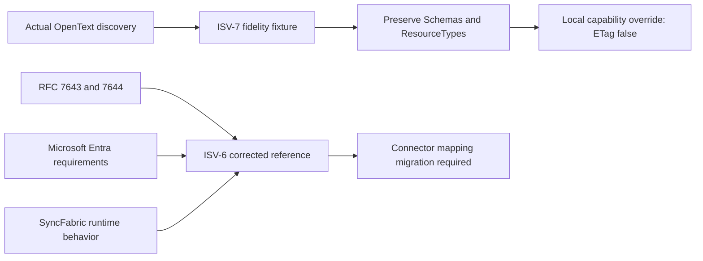
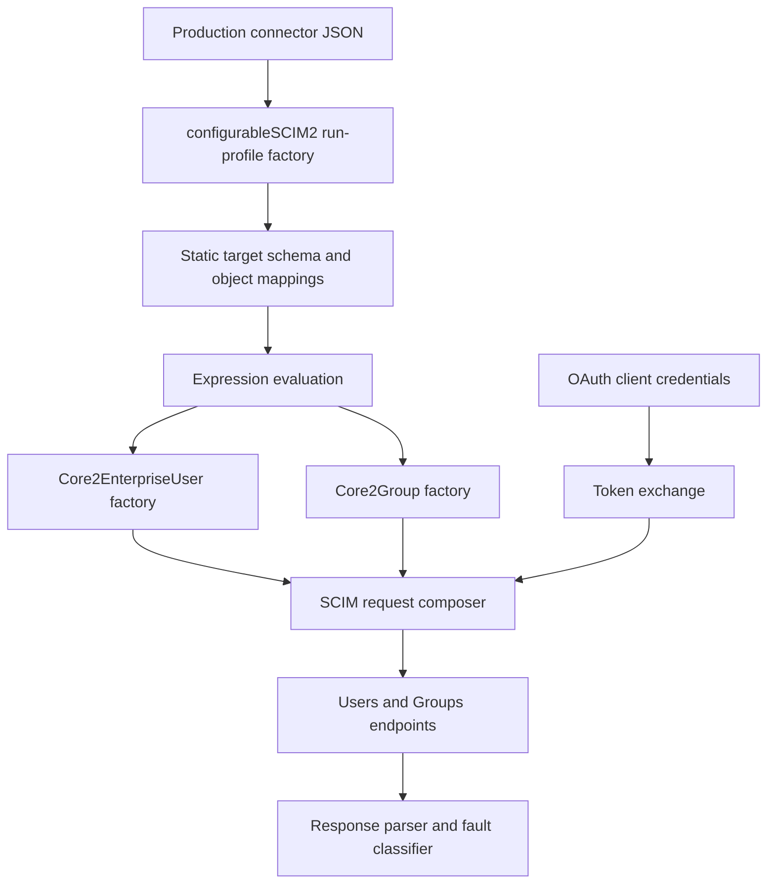
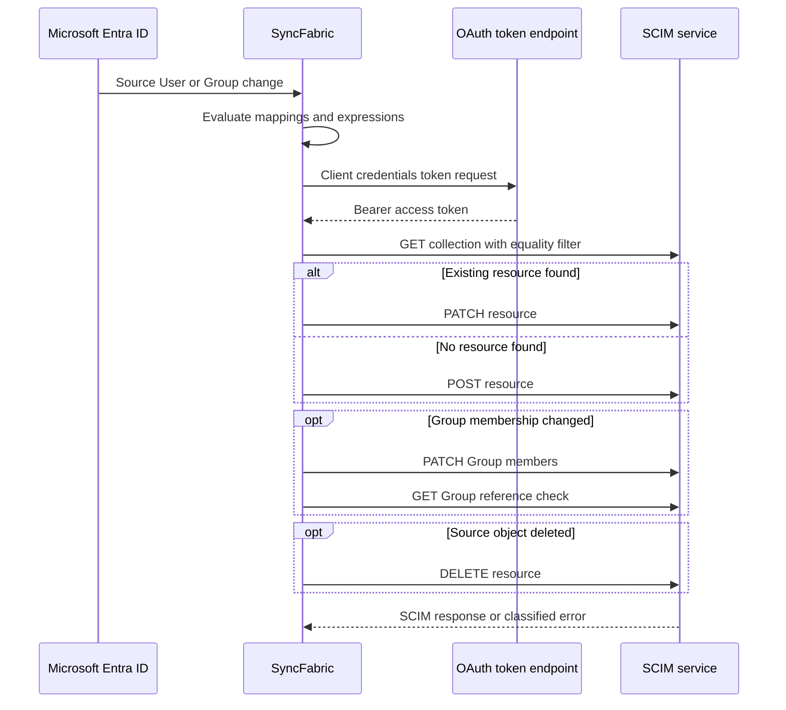

# OpenText Discovery, SyncFabric Flow, and Corrected Contract

> **Status:** Live-corrected, source-verified architecture and interoperability record
> **Last verified:** 2026-09-15
> **Scope:** Actual OpenText discovery, calmsand ISV-6 and ISV-7, Microsoft Entra provisioning, and the production SyncFabric connector

## 1. Executive decision

ISV-6 and ISV-7 serve different purposes and MUST NOT converge.

- **ISV-7 is the fidelity fixture.** Its stored `schemas` and `resourceTypes` remain exactly as they were before this review. Only `serviceProviderConfig.etag.supported` changed from `true` to `false`, as requested. Canonical pre/post hashes prove the fidelity sections did not change.
- **ISV-6 is the corrected reference.** Its topology is RFC-oriented: two ResourceTypes, five data schemas, separate vendor-owned mailbox URNs, and explicit extension bindings. This review corrected Group member typing, mailbox case semantics, and User-name requiredness, then proved the behavior with disposable live resources.
- **The checked-in SyncFabric connector is compatible with neither mailbox contract as written.** It maps a comma-joined scalar under the legacy OpenText IETF-style URN, while both the actual OpenText discovery and ISV-7 declare a multi-valued string. ISV-6 correctly expects plural vendor-URN values. SyncFabric must migrate its mapping before it can use ISV-6's mailbox extensions.
- **`targetObjectName = EnterpriseUser` is intentional in SyncFabric.** It does not mean SyncFabric calls a separate EnterpriseUser endpoint. The runtime constructs `Core2EnterpriseUser`, merges core and enterprise fields, and uses the standard `/Users` collection.



The actual OpenText discovery remains structurally problematic. It publishes a standalone EnterpriseUser ResourceType on `/Users`, omits `schemaExtensions[].required`, uses an unregistered value in the IETF-controlled URN namespace, and contains inaccurate fixed meta-schema characteristics. Those defects are intentionally retained in ISV-7 because it is evidence, not a recommendation.

## 2. Evidence and method

| Source | Evidence | Result |
|---|---|---|
| OpenText upstream | Authenticated response supplied by the operator from `https://api.appriver.com/scim/api` | 3 ResourceTypes, 7 Schemas |
| OpenText upstream recheck | Read-only GET on 2026-09-15 with an unrelated bearer token | `401 Unauthorized`; expected and not a discovery-conformance finding |
| Calmsand ISV-6 | Read-only live GETs using the customer-production estate resolver | 2 ResourceTypes, 5 Schemas |
| Calmsand ISV-7 | Read-only live GETs using the customer-production estate resolver | 3 ResourceTypes, 7 Schemas |
| SyncFabric connector | Production JSON at `src/deployment/data/connector_configurations/prod/opentext-cybersecurity.ffa091eb-067e-427a-8f41-e75f6346a98d.json` | Static Entra-to-SCIM mapping, OAuth client credentials, target discovery disabled |
| SyncFabric runtime | `src/dev/Controller/RunProfile/SCIM` and `ConfigurableSCIM20Connector` | Request construction, schema shaping, custom-extension serialization, OAuth, and error mapping verified from source |

A disposable User and Group were created only on the empty ISV-6 fixture to verify the corrected behavior. Both were deleted in `finally`, and aggregate counts returned to zero. No customer resource was read or changed.

The supplied upstream JSON proves discovery content, not upstream response headers or runtime enforcement. The direct upstream `401` proves only that the unrelated credential was invalid. RFC 7644 permits authenticated discovery.

### 2.1 Evidence quality

| Classification | Meaning in this document |
|---|---|
| Confirmed | Directly observed in live output or executable source |
| Inferred | Strongly implied by configuration but not exercised against the actual OpenText tenant |
| Proposed | Recommended future connector or server change |

### 2.2 Fidelity boundary

ISV-7 preserves the previously imported OpenText profile. Its public output is the closest representation SCIMServer can currently publish, not byte-for-byte upstream output. The profile pipeline always expands defaults and common attributes, and its tighten-only validator rejects some upstream loosenings. The known forced differences are:

1. `schemaExtensions[].required` is materialized as `false`.
2. Core `id`, `externalId`, and `meta` definitions are auto-injected where absent.
3. Group `displayName.uniqueness` remains `server` instead of upstream `none`.
4. Group `members.type` remains declared because the server can materialize it under strict validation.

Achieving literal byte fidelity would require a separate raw-discovery passthrough mode. Changing the fixture profile cannot bypass the current expansion and tighten-only pipeline.

## 3. Live endpoint roles and final state

| Model | Endpoint ID | Name | Intended role |
|---|---|---|---|
| ISV-6 | `10d6845a-a1fd-4151-aab0-3d7b0c5f0e01` | `OpenText-Jun-4-Corrected-ISV-6` | Corrected reference with separate User and Group mailbox extensions |
| ISV-7 | `f7a58b02-ef8d-4c12-be4b-d3df0b363cbf` | `OpenText-Cybersecurity-ISV-7` | Preserved upstream discovery fixture |

Both endpoints had `StrictSchemaValidation: true`, `WifCredentialsEnabled: true`, and `OAuthClientCredentialsAuthEnabled: true` at capture time.

| Final fact | ISV-6 | ISV-7 |
|---|---|---|
| ResourceTypes | 2 | 3 |
| Schemas | 5 | 7 |
| `etag.supported` | `false` | `false` |
| Users / Groups / Members after validation | 0 / 0 / 0 | 0 / 0 / 0 |
| Final admin ETag | `W/"87607ac2c13a9e699af483939f9f6932"` | `W/"7fe6158101e937189d21d6a8942155b3"` |
| Schema SHA-256 | `56fb6d0aa6cacec16dea046b55b14c721dbaa8dd8246f2510d584664c19894cc` | `bd56bc0510916bbc34766d16dcf7b86c7370efd60bf9d0646400ace3e0a11f86` |
| ResourceType SHA-256 | `c2b80e82d9bc5b52fef87014217fb997479f55ff761547faf4825a49f15609d5` | `b30b32619156a33a25e7361a712a7cc8f9cbcd597e17403af586d4c02a85a77b` |

Hashes are over PowerShell depth-100 compressed JSON in stored array order. ISV-7's Schema and ResourceType hashes are identical before and after its ETag-only update.

## 4. Structural comparison

| Concern | OpenText upstream | Calmsand ISV-7 | Calmsand ISV-6 | Assessment |
|---|---|---|---|---|
| ResourceType count | 3 | 3 | 2 | ISV-6 is correct |
| Schema count | 7 | 7 | 5 | ISV-7 mirrors; ISV-6 publishes only data-resource schemas |
| User ResourceType | `/Users`, core User | Same | Same | Correct in all three |
| EnterpriseUser ResourceType | Separate `/Users` ResourceType | Preserved | Removed | Upstream and ISV-7 are wrong |
| Enterprise User binding | User extension | User extension | User extension | Correct in all three |
| Group ResourceType | `/Groups`, core Group | Same | Same | Correct in all three |
| `schemaExtensions[].required` | Omitted | Materialized as `false` | Materialized as `false` | Upstream violates RFC 7643 section 6 |
| Mailbox URN | Unregistered IETF namespace | Preserved | Vendor-owned User and Group URNs | ISV-6 is correct |
| One mailbox schema bound to User and Group | Yes | Yes | No, separate schemas | ISV-6 is clearer and safer |
| Group `displayName.uniqueness` | `none` | `server` | `server` | RFC permits upstream; Entra requires the latter |
| Group `members.type` | Omitted | Added by fixture normalization | Added with `User` and `Group` canonical values | ISV-6 corrected on 2026-09-15 |
| Group `members.$ref.referenceTypes` | User and Group in supplied model | Preserved | User and Group | ISV-6 corrected on 2026-09-15 |
| User `name` requiredness | Name, given name, and family name required | Preserved | All optional | ISV-6 aligns with RFC defaults and SF source optionality |
| Mailbox `caseExact` | Omitted, effective `false` | Preserved | `true` | ISV-6 preserves `SMTP:` versus `smtp:` semantics |
| Core `id` and `meta` definitions | Omitted | Injected | Injected | SCIMServer materialization is correct |
| Fixed discovery meta-schemas | Included | Preserved | Omitted | If included, they must be corrected |
| ETag capability | Not established by supplied payload | `false` | `false` | Explicit local policy on both fixtures |
| Authentication schemes | Not established by supplied payload | SCIMServer OAuth bearer plus WIF | Same | Not an upstream mirror |

## 5. SyncFabric execution model

### 5.1 Connector selection and authentication

The production JSON declares `factoryTag: configurableSCIM2` and only `OAuth2ClientCredentialsGrant`. The run-profile factory exported under that tag builds the configured mappings. The target directory has `discoverabilities: None`, so its target schema is static. `discoverable: true` describes catalog availability, not a runtime call to SCIM discovery.

The default configurable adapter is `ConfigurableSCIM20ProxyAdapter`. It derives from the SCIM 2 adapter template and uses `Core2EnterpriseUser` for Users and `Core2Group` for Groups. Both factories support custom extension objects and plural custom-extension values.



### 5.2 Request lifecycle



Confirmed implementation behavior:

| Concern | Confirmed behavior | Source anchor in SyncFabric |
|---|---|---|
| Connector factory | `configurableSCIM2` selects `ConfigurableScim20ConnectorRunProfileFactory` | `ConfigurableSCIM20ConnectorConstants.cs:10-14`, `ConfigurableSCIM20ConnectorRunProfileFactory.cs:13-31` |
| Default adapter | Uses `ConfigurableSCIM20ProxyAdapter` and SCIM 2 factories | `ConfigurableSCIM20ConnectorProxyAdapter.cs:15-35` |
| User wire model | `Core2EnterpriseUser`; core and enterprise values travel to `/Users` | `SystemForCrossDomainIdentityManagementRequestComposerTemplate.cs:847-878`, `EntryResourceObjectFactory.cs:38-61` |
| Discovery | Runtime supports `GET /Schemas`, but this connector target sets `discoverabilities: None` and ships a static target schema | `SystemForCrossDomainIdentityManagementProxyAdapterTemplate.cs:581-638`, connector JSON line 3097 |
| Correlation | Joining property becomes an `eq` filter | `SystemForCrossDomainIdentityManagementRequestComposerTemplate.cs:593-634`, `1229-1246` |
| Add | `POST` | `SystemForCrossDomainIdentityManagementRequestComposerTemplate.cs:242-278`, `366-389` |
| Update | `PATCH` when patch support is active, otherwise `PUT` | `SystemForCrossDomainIdentityManagementRequestComposerTemplate.cs:174-215`, `280-356`, `366-389` |
| Delete | `DELETE` | `SystemForCrossDomainIdentityManagementRequestComposerTemplate.cs:113-154` |
| User custom arrays | A plural target property serializes as a JSON array | `EntryCore2UserFactoryBase.cs:267-320` |
| Group custom arrays | A plural target property serializes as a collection in the extension object | `EntryCore2GroupFactory.cs:16-167` |
| Group reads | `members` is excluded by default and explicitly read for enabled correlation flows | `SystemForCrossDomainIdentityManagementRequestComposerTemplate.cs:1005-1105` |
| OAuth | Configurable adapter acquires and refreshes client-credential tokens | `ConfigurableSCIM20ConnectorProxyAdapter.cs:98-153`, `SystemForCrossDomainIdentityManagementStreamingWebProxyAdapterTemplate.cs:62` |
| Errors | 400, 401, 409, 412, 429, 5xx, and timeout classes map to distinct SyncFabric errors | `SystemForCrossDomainIdentityManagementFaultFactoryBase.cs:74-153` |
| Conditional writes | No SCIM-layer `If-Match` construction was found | Bounded search under `src/dev/Controller/RunProfile/SCIM` |

### 5.3 Current production mappings

| Object | Current join | Identity export | Mailbox export | Assessment |
|---|---|---|---|---|
| Group | `displayName`, priority 1 | `objectId -> externalId` | `Join(",", [proxyAddresses])` to legacy mailbox URN | Join is lossy and contradicts target discovery |
| User | `userPrincipalName -> userName`, priority 1 | `mailNickname -> externalId` | Same Join and legacy URN | User join and externalId are both mutable aliases |

The Group mapping also passes `members` directly. The source Group schema declares both User and Group referenced object types, which is why ISV-6 now declares `members.type` canonical values and `$ref.referenceTypes` as `User` plus `Group`.

## 6. Cross-system findings

### Critical

**C1. The shipped mailbox mapping contradicts both upstream discovery and ISV-6.**

The connector maps both User and Group mailbox values through `Join(",", [proxyAddresses])` to `urn:ietf:params:scim:schemas:extension:opentext:2.0:Mailbox:proxyAddresses`. Its static target property is nonplural. The actual OpenText schema and ISV-7 say the field is a multi-valued string; ISV-6 says the same under separate vendor URNs. The current mapping therefore sends one scalar where discovery says array.

Consequences:

- strict validation can reject the request;
- commas become an undocumented secondary protocol with no escaping rule;
- individual alias add/remove operations become full-string replacement;
- primary-versus-alias case semantics become harder to preserve and compare;
- ISV-6 rejects the legacy URN even if cardinality were corrected.

**Correction:** migrate both target properties to plural vendor-URN attributes and map `[proxyAddresses]` directly. Remove `Join` and the empty-string default.

### High

**H1. User correlation is rename-sensitive and `externalId` is not the Entra object identifier.**

The User matching key is `userName <- userPrincipalName`; `externalId` receives `mailNickname`. Both can change, and `mailNickname` is not Entra's immutable object identifier. A UPN rename can make the equality lookup miss the existing target, while the stored externalId does not provide a stable recovery key.

**Correction:** map `objectId -> externalId`. Keep `userName` matching during the first migration stage. After externalId is backfilled and its filter behavior is proven, evaluate moving the matching priority to externalId. Do not change both identity mapping and match priority in one rollout.

**H2. Upstream discovery is internally inconsistent.**

1. Every `schemaExtensions[]` item omits the REQUIRED `required` boolean.
2. EnterpriseUser is both an extension and a standalone ResourceType on `/Users`.
3. The OpenText mailbox URN is unregistered in the IETF-controlled SCIM namespace.
4. The fixed ResourceType, Schema, and ServiceProviderConfig schema definitions contain false or incomplete characteristics.

ISV-7 preserves these facts for diagnosis. ISV-6 corrects them and must remain separate.

**H3. Static target schema means discovery corrections do not repair the connector.**

The target directory has `discoverabilities: None`. Editing `/Schemas` or `/ResourceTypes` changes server validation and observability but does not rewrite the checked-in SyncFabric target schema or mappings. Server and connector changes must be reviewed together.

**H4. User-name requiredness contradicted the source schema. Resolved on ISV-6.**

The OpenText model requires `name`, `givenName`, and `familyName`, while the SF source marks `givenName` optional and the connector target marks both leaves optional. ISV-6 now uses the RFC defaults (`required:false`) for `name`, `givenName`, and `familyName`. ISV-7 intentionally preserves upstream requiredness.

### Medium

**M1. Group matching by displayName is Entra-compatible but rename-sensitive.**

Microsoft Entra expects Group `displayName` to be unique and filterable, and the current server enforces that. A rename still changes the join key. The Group already exports `objectId -> externalId`, so externalId is available as a more stable future join after filter and migration testing.

**M2. `caseExact:true` preserves mailbox prefix semantics but does not enforce mailbox policy.**

ISV-6 now distinguishes `SMTP:` from `smtp:` in comparison semantics. Generic schema validation does not enforce exactly one primary address or global alias uniqueness. The descriptions now state this honestly. Add a domain validator only if endpoint 6 is intended to enforce those business rules.

**M3. `etag:false` matches current SyncFabric behavior.**

The SCIM request layer builds POST, PATCH, PUT, and DELETE requests but no `If-Match` header was found. Advertising ETag support would invite a concurrency contract this connector does not exercise. Both fixtures now advertise `false`, and live creates returned no ETag header.

**M4. OAuth metadata has no explicit scope or audience field.**

The production connector exposes base address, token-exchange URI, client ID, and client secret. If the OpenText token service later requires a scope, resource, or audience parameter, this template has no declared field for it. Confirm the token service contract and extend the auth metadata before such a requirement is introduced.

### Low

**L1. Fixed discovery meta-schemas are optional in common Entra practice but dangerous when wrong.**

ISV-6 publishes only the five data schemas. That is compatible with Microsoft's common discovery examples. If fixed meta-schemas are added, use corrected definitions rather than copying ISV-7.

**L2. Relative discovery locations are valid but less portable.**

Relative `meta.location` values are permitted. Absolute HTTPS values are more convenient for standalone diagnostics but are not required for provisioning.

## 7. Corrected ISV-6 contract

Applied on 2026-09-15:

| Area | Final contract | Why |
|---|---|---|
| ResourceTypes | User on `/Users`, Group on `/Groups` | One resource type per collection |
| Enterprise schema | Optional extension of User only | RFC 7643 section 4.3 |
| Mailbox URNs | Separate vendor-owned `:User` and `:Group` URNs | Avoid IETF namespace misuse and cross-resource ambiguity |
| Mailbox cardinality | Multi-valued string | Matches Entra `proxyAddresses` and SF direct-array capability |
| Mailbox case | `caseExact:true` | Preserves `SMTP:` versus `smtp:` semantics |
| User name | Parent, given name, and family name optional | RFC default and SF source compatibility |
| Group member type | Immutable string with `User`, `Group` canonical values | RFC Group shape and runtime materialization |
| Group member reference | `referenceTypes: ["User", "Group"]` | Matches source reference model |
| ETag | Unsupported | Matches connector behavior and requested fixture policy |

The corrected profile remains strict. It does not silently accept the legacy mailbox URN or scalar comma-joined values.

## 8. SyncFabric connector correction

### 8.1 Mailbox mapping

The same change is required in the Group and User mappings, with the resource-specific URN.

```jsonc
// Schematic shape for the corrected User mailbox mapping.
{
	"defaultValue": null,
	"exportMissingReferences": false,
	"flowBehavior": "FlowWhenChanged",
	"flowType": "Always",
	"matchingPriority": 0,
	"targetAttributeName": "urn:opentext:scim:schemas:extension:mailbox:2.0:User:proxyAddresses",
	"source": {
		"expression": "[proxyAddresses]",
		"name": "proxyAddresses",
		"type": "Attribute",
		"parameters": []
	}
}
```

For Group, replace `:User:proxyAddresses` with `:Group:proxyAddresses`. In the static target directory schema, both corresponding attributes must set `multivalued: true` and `caseExact: true`.

### 8.2 Identity mapping

```jsonc
// Schematic first-stage User identity correction.
{
	"matchingPriority": 0,
	"targetAttributeName": "externalId",
	"source": {
		"expression": "[objectId]",
		"name": "objectId",
		"type": "Attribute",
		"parameters": []
	}
}
```

Keep `userName` at matching priority 1 for the first stage. A later change to externalId matching requires a backfill audit and an equality-filter test against all existing target users.

### 8.3 What not to change

- Do not change the User `targetObjectName` away from `urn:ietf:params:scim:schemas:extension:enterprise:2.0:User`. That name is the adapter's compound User type and still routes to `/Users`.
- Do not copy ISV-7's duplicate EnterpriseUser ResourceType into ISV-6.
- Do not make endpoint 6 accept both mailbox URN families indefinitely. Use a bounded migration window if backward compatibility is required.
- Do not claim primary-address or alias uniqueness enforcement until a runtime validator exists.

## 9. Entra interpretation

1. Group `displayName` remains required, unique, and equality-filterable.
2. User `userName` remains required, unique, and equality-filterable.
3. Optional source `givenName` no longer makes ISV-6 reject an otherwise valid User.
4. Entra custom-schema discovery is not available for every non-gallery application. The checked-in SF target schema is authoritative for this connector regardless.
5. Entra discovery is additive. Renaming a mailbox URN requires explicit mapping migration; removing it from discovery does not remove an existing Entra target attribute.
6. PATCH operation names must remain case-insensitive.
7. Complex mappings with several leaves have Entra UI limitations, but `proxyAddresses` remains a simple multi-valued string and avoids that problem.

## 10. Live validation record

### 10.1 ISV-7 fidelity update

| Check | Result |
|---|---|
| Conditional admin PATCH | `200` using pre-change ETag |
| Public `etag.supported` | `false` |
| Stored `etag.supported` | `false` |
| Schema hash before and after | `bd56bc0510916bbc34766d16dcf7b86c7370efd60bf9d0646400ace3e0a11f86` |
| ResourceType hash before and after | `b30b32619156a33a25e7361a712a7cc8f9cbcd597e17403af586d4c02a85a77b` |
| Authentication hash unchanged | Yes |
| Settings hash unchanged | Yes |

### 10.2 ISV-6 profile validation

| Check | Result |
|---|---|
| `members.type` | Present, immutable, canonical `User` and `Group` |
| `members.$ref.referenceTypes` | `User` and `Group` |
| User `name`, `givenName`, `familyName` | Optional |
| User and Group mailbox attributes | String arrays, `caseExact:true` |
| Public `etag.supported` | `false` |
| ResourceType hash unchanged | Yes |
| Authentication hash unchanged | Yes |
| Settings hash unchanged | Yes |

### 10.3 Disposable behavior proof

| Operation or outcome | Result |
|---|---|
| Create User without `name` | `201` |
| User mailbox array round trip | 2 values |
| Filter User by `userName eq` | 1 result |
| Create Group with typed User member | `201` |
| Group mailbox array round trip | 2 values |
| Filter Group by `displayName eq` | 1 result |
| ETag header on User and Group create | Absent |
| Delete Group and User | `204`, `204` |
| Final User / Group / Member counts | 0 / 0 / 0 |

### 10.4 Reusable drift verification

Run the read-only verifier from the repository root:

```powershell
pwsh scripts/verify-opentext-isv6-corrections.ps1 -Purpose customer-prod
```

The 2026-09-15 run passed all 14 invariants: endpoint identity; five-schema topology; ETag policy; Group member `type` and `$ref`; User-name requiredness; two vendor mailbox schemas; both `proxyAddresses` characteristic sets; and the exact stored hashes of schemas, resource types, authentication, and settings. The script resolves customer prod through `scripts/scim-estates.ps1`, performs GET requests only, emits structured JSON, and exits nonzero on any drift.

The stored schema hash is `56fb6d0aa6cacec16dea046b55b14c721dbaa8dd8246f2510d584664c19894cc`. The public `/Schemas` response has a different hash (`71a3999d2d0b67829089b02e51a383c2985f3e5a942a61b0bda7951518a8413c`) because SCIMServer expands defaults and common attributes before publishing it. Conflating those two representations would create a false drift signal. The verifier contract is locked by `scripts/test/verify-opentext-isv6-corrections.contract.ps1`.

## 11. Correction status

| Owner | Action | Status |
|---|---|---|
| SCIMServer ISV-7 | Preserve imported Schemas and ResourceTypes | Complete, hash-proven |
| SCIMServer ISV-7 | Set ETag capability false | Complete |
| SCIMServer ISV-6 | Correct members type and reference types | Complete |
| SCIMServer ISV-6 | Correct mailbox case semantics and descriptions | Complete |
| SCIMServer ISV-6 | Relax User-name fields to RFC/SF optionality | Complete |
| SCIMServer ISV-6 | Lock corrected live profile with an estate-resolved verifier | Complete, 14/14 PASS |
| SyncFabric connector | Replace legacy mailbox URN with resource-specific vendor URNs | Proposed |
| SyncFabric connector | Remove comma Join and export plural values directly | Proposed |
| SyncFabric connector | Map User `objectId` to `externalId` | Proposed, migration required |
| OpenText service | Correct upstream discovery graph and fixed schemas | Vendor action |
| SCIMServer platform | Add raw-discovery passthrough if byte fidelity is required | Proposed architecture item |

## 12. Execution issues and RCA

| Issue | Severity | Symptom | Root cause | Resolution and prevention |
|---|---|---|---|---|
| Wrong adapter inferred | High | Initial trace suggested Group custom extensions might be skipped | Analysis followed the legacy `SystemForCrossDomainIdentityManagement2ProxyAdapter` instead of resolving `factoryTag` through the configurable run-profile factory | Traced `configurableSCIM2` to `ConfigurableSCIM20ProxyAdapter`; future reviews must resolve tag to exported adapter before reasoning from a sibling adapter |
| Stale-variable false green | High | A failed admin GET was followed by plausible hash output | PowerShell parsed `"$id?view=full"` ambiguously and persistent-shell variables retained prior values | Use `"${id}?view=full"`, fresh variable names, `-ErrorAction Stop`, and assert the returned endpoint id before evaluating hashes |
| Interrupted PATCH | Medium | Terminal returned `Ctrl+C` with no response | The server completed the write before output was interrupted | Never blindly retry an interrupted conditional write; re-read ETag and intended fields first |
| Broad source scans timed out | Low | Recursive `Select-String` exceeded the command window | `rg` was unavailable and the fallback scan included too many files | Use the existing knowledge graph, filename-filtered searches, and bounded source directories |
| Mermaid render exceeded wrapper time | Low | Full-doc render moved to a background terminal | The gate renders hundreds of diagrams in Chromium | Retain full render as the authoritative gate and use targeted grammar checks only as an early signal |

The most important escape was the wrong-adapter inference. It would have produced an incorrect architecture recommendation even though all observed endpoint data was accurate. The durable rule is: **configuration tag -> run-profile factory -> directory factory -> exported proxy adapter -> object factories** before concluding what a connector can serialize.

## 13. Normative and implementation references

- [RFC 7643 sections 2.2, 2.3, 4.2, 4.3, 6, 7, and 10](https://www.rfc-editor.org/rfc/rfc7643)
- [RFC 7644 sections 3.1, 3.4, and 4](https://www.rfc-editor.org/rfc/rfc7644)
- [RFC 7643 errata](https://errata.rfc-editor.org/search/?rfc_number=7643)
- [IANA SCIM schema URI registry](https://www.iana.org/assignments/scim/scim.xhtml)
- [Microsoft Entra SCIM endpoint guidance](https://learn.microsoft.com/en-us/entra/identity/app-provisioning/use-scim-to-provision-users-and-groups)
- [Microsoft Entra App Gallery provisioning requirements](https://learn.microsoft.com/en-us/entra/identity/enterprise-apps/app-gallery-user-provisioning-requirements)
- [Custom extension authoring guide](CUSTOM_EXTENSIONS_RFC_GUIDE.md)
- [OpenText source-versus-live predecessor](OPENTEXT_ISV3_SCHEMA_SOURCE_VS_LIVE.md)
- [Discovery output versus admin input](DISCOVERY_OUTPUT_VS_ADMIN_INPUT_INTEROP.md)

## 14. Self-improvement disposition

- Documentation gap: applied. This guide now binds endpoint roles, live fingerprints, SF source behavior, and migration actions in one record.
- Test/gate gap: applied through profile hashes, a disposable live round trip, `scripts/verify-opentext-isv6-corrections.ps1`, and its contract test. A general discovery-graph lint remains proposed for extension binding, endpoint uniqueness, URN ownership, and runtime-key parity.
- Design/architecture gate: accepted for the live endpoint changes because they alter data contracts without adding runtime dependencies. A raw-discovery passthrough is not added speculatively; it needs a second fidelity fixture or a concrete consumer requiring byte identity.