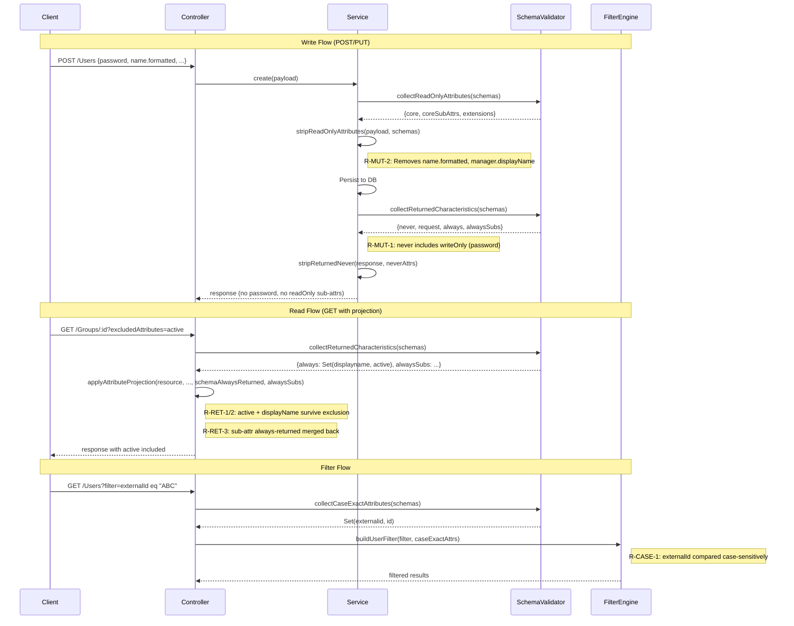

# P2 — Attribute Characteristic Enforcement (RFC 7643 §2)

## Overview

**Feature**: RFC 7643 §2 attribute characteristics — 6 behavioral gap fixes  
**Version**: current  
**Status**: ✅ Complete  
**RFC Reference**: [RFC 7643 §2 — Attribute Characteristics](https://datatracker.ietf.org/doc/html/rfc7643#section-2)  
**Predecessor**: G8e (v0.17.4), ReadOnly Stripping (v0.22.0), P1 Schema/Discovery (v0.23.0)

### Problem Statement

After the RFC 7643 §2 full audit ([RFC7643_ATTRIBUTE_CHARACTERISTICS_FULL_AUDIT.md](RFC7643_ATTRIBUTE_CHARACTERISTICS_FULL_AUDIT.md)), 6 behavioral gaps remained in the "P2 — Behavioral" priority tier. These gaps meant:

1. **`returned:"always"` partially hardcoded** — Only `schemas`, `id`, `meta` were guaranteed always-returned. `userName` (User) and `displayName` / `active` (Group) could be excluded via `?excludedAttributes=`, violating RFC 7643 §7.
2. **Sub-attribute `returned:"always"` not enforced** — `emails[].value`, `members[].value` could be stripped by `?attributes=emails.type`, violating §2.4.
3. **`writeOnly` → `returned:"never"` not enforced** — The `password` attribute had `mutability:"writeOnly"` but was not systematically stripped as `returned:"never"` in responses.
4. **ReadOnly sub-attributes not stripped on mutation** — `name.formatted` (readOnly) and `manager.displayName` (readOnly) were accepted in POST/PUT payloads instead of being silently stripped.
5. **`caseExact` filtering was column-type-based, not schema-driven** — In-memory filter evaluation did not consult schema `caseExact` definitions; it relied solely on Prisma column types.

### Solution

Six targeted code changes that make all characteristic enforcement **schema-driven** — reading attribute metadata from `SchemaAttributeDefinition` rather than hardcoded lists:

| ID | Gap | Fix |
|---|---|---|
| **R-RET-1** | Schema-driven `returned:"always"` | `getAlwaysReturnedForResource()` merges base set + `schemaAlwaysReturned` param |
| **R-RET-2** | Group `active` always-returned | Hardcoded into `getAlwaysReturnedForResource()` Group detection |
| **R-RET-3** | Sub-attr `returned:"always"` enforcement | `alwaysSubs` map parameter flows through `includeOnly()` to merge sub-attrs back |
| **R-MUT-1** | `writeOnly` → `returned:"never"` | `collectReturnedCharacteristics()` adds `mutability:"writeOnly"` attrs to `neverAttrs` |
| **R-MUT-2** | ReadOnly sub-attr stripping on mutation | `stripReadOnlyAttributes()` walks `coreSubAttrs` / `extensionSubAttrs` maps from `collectReadOnlyAttributes()` |
| **R-CASE-1** | Schema-driven `caseExact` filtering | `collectCaseExactAttributes()` → `caseExactAttrs` Set passed to `evaluateFilter()` |

## Architecture

```
┌─────────────────────────────────────────────────────────────────┐
│                     Client Request                              │
│         POST / GET / PUT / PATCH / LIST / SEARCH                │
└───────────────────────┬─────────────────────────────────────────┘
                        │
         ┌──────────────┼──────────────┐
         │              │              │
    Mutation Flow   Read Flow    Filter Flow
    (POST/PUT/PATCH) (GET/LIST)  (?filter=...)
         │              │              │
         ▼              ▼              ▼
┌────────────────┐ ┌────────────┐ ┌──────────────────┐
│ Service Layer  │ │ Controller │ │ Filter Engine    │
│                │ │ Layer      │ │                  │
│ R-MUT-1:      │ │ R-RET-1:   │ │ R-CASE-1:        │
│ writeOnly →   │ │ schema-    │ │ caseExactAttrs   │
│ never strip   │ │ driven     │ │ Set passed to    │
│               │ │ always-    │ │ evaluateFilter() │
│ R-MUT-2:      │ │ returned   │ │                  │
│ readOnly sub  │ │            │ │ Schema-driven    │
│ attr strip    │ │ R-RET-2:   │ │ eq/co/sw/ew      │
│ (name.format, │ │ Group      │ │ comparison       │
│  mgr.display) │ │ active     │ │ sensitivity      │
│               │ │            │ │                  │
│               │ │ R-RET-3:   │ │                  │
│               │ │ sub-attr   │ │                  │
│               │ │ always     │ │                  │
└───────┬────────┘ └─────┬──────┘ └────────┬─────────┘
        │                │                 │
        ▼                ▼                 ▼
┌─────────────────────────────────────────────────────────────────┐
│               Schema Infrastructure Layer                       │
│                                                                 │
│  SchemaValidator.collectReturnedCharacteristics(schemas)        │
│    → { never, request, always, alwaysSubs }                     │
│                                                                 │
│  SchemaValidator.collectReadOnlyAttributes(schemas)             │
│    → { core, extensions, coreSubAttrs, extensionSubAttrs }      │
│                                                                 │
│  SchemaValidator.collectCaseExactAttributes(schemas)            │
│    → Set<string> of caseExact=true attribute names              │
│                                                                 │
│  All data read from SchemaAttributeDefinition.returned,         │
│  .mutability, .caseExact — no hardcoded lists                   │
└─────────────────────────────────────────────────────────────────┘
```

## Key Components

| Component | File | Purpose |
|---|---|---|
| `getAlwaysReturnedForResource()` | `scim-attribute-projection.ts` | Merges `ALWAYS_RETURNED_BASE` + `schemaAlwaysReturned` param + Group `active`/`displayName` detection |
| `applyAttributeProjection()` | `scim-attribute-projection.ts` | Enhanced with `schemaAlwaysReturned` and `alwaysSubs` params for R-RET-1/2/3 |
| `stripReturnedNever()` | `scim-attribute-projection.ts` | Strips `returned:"never"` + `writeOnly` attrs from ALL responses (R-MUT-1) |
| `collectReturnedCharacteristics()` | `schema-validator.ts` | Returns `{ never, request, always, alwaysSubs }` — R-MUT-1 adds writeOnly to `never` |
| `collectReadOnlyAttributes()` | `schema-validator.ts` | Returns `{ core, extensions, coreSubAttrs, extensionSubAttrs }` — R-MUT-2 sub-attr maps |
| `collectCaseExactAttributes()` | `schema-validator.ts` | Returns `Set<string>` of attrs where `caseExact=true` — R-CASE-1 |
| `stripReadOnlyAttributes()` | `scim-service-helpers.ts` | Walks `coreSubAttrs` for R-MUT-2 sub-attr stripping (e.g., `name.formatted`, `manager.displayName`) |
| `stripReadOnlyPatchOps()` | `scim-service-helpers.ts` | Filters PATCH ops targeting readOnly sub-attrs (R-MUT-2 for PATCH) |
| `buildUserFilter()` / `buildGroupFilter()` | `apply-scim-filter.ts` | Accept `caseExactAttrs` param, pass to `evaluateFilter()` for R-CASE-1 |
| `evaluateFilter()` | `scim-filter-parser.ts` | Uses `caseExactAttrs` Set for case-sensitive comparison when attr is `caseExact=true` |

## Detailed Implementation

### R-RET-1: Schema-Driven Always-Returned

**Before**: Hardcoded `ALWAYS_RETURNED = new Set(['schemas', 'id', 'meta'])` — `userName` excluded by `?excludedAttributes=userName`.

**After**: `ALWAYS_RETURNED_BASE` includes `userName`. `getAlwaysReturnedForResource()` merges in any schema-provided `schemaAlwaysReturned` set, ensuring all `returned:"always"` attributes survive exclusion.

```typescript
const ALWAYS_RETURNED_BASE = new Set(['schemas', 'id', 'meta', 'username']);

function getAlwaysReturnedForResource(
  resource: Record<string, unknown>,
  schemaAlwaysReturned?: Set<string>,
): Set<string> {
  const alwaysReturned = new Set(ALWAYS_RETURNED_BASE);
  if (schemaAlwaysReturned) {
    for (const attr of schemaAlwaysReturned) alwaysReturned.add(attr);
  }
  // Group detection → add displayName, active
  ...
  return alwaysReturned;
}
```

### R-RET-2: Group `active` Always-Returned

Per RFC 7643 §4.2, Group's `active` attribute has `returned:"always"`. The `getAlwaysReturnedForResource()` function detects Group resources (via `meta.resourceType` or `schemas[]` URN) and adds `displayname` + `active` to the always-returned set.

### R-RET-3: Sub-Attribute Always-Returned

**Problem**: `?attributes=emails.type` would return only `type` within each email, omitting `value` (`returned:"always"` per RFC 7643 §4.1.2).

**Fix**: New `alwaysSubs` parameter (`Map<string, Set<string>>`) flows into `includeOnly()`. When projecting sub-attributes, the merge step ensures always-returned sub-attrs (e.g., `value` in emails/phoneNumbers/members) are preserved.

### R-MUT-1: WriteOnly → Returned:Never

`collectReturnedCharacteristics()` now checks `mutability === 'writeOnly'` in addition to `returned === 'never'`:

```typescript
if (attr.mutability === 'writeOnly' || attr.returned === 'never') {
  neverAttrs.add(attr.name.toLowerCase());
}
```

This ensures `password` (mutability:"writeOnly", returned:"never") is always stripped even if only one characteristic were accidentally missing.

### R-MUT-2: ReadOnly Sub-Attribute Stripping

`collectReadOnlyAttributes()` now returns `coreSubAttrs: Map<string, Set<string>>` mapping parent attribute names to their readOnly sub-attributes. `stripReadOnlyAttributes()` walks these maps to strip:

- `name.formatted` (readOnly within readWrite `name`)
- `manager.displayName` (readOnly within readWrite `manager`)
- Extension-level readOnly sub-attributes

For PATCH ops, `stripReadOnlyPatchOps()` parses dotted paths (e.g., `manager.displayName`) and filters ops targeting readOnly sub-attrs.

### R-CASE-1: Schema-Driven CaseExact Filtering

`collectCaseExactAttributes()` walks schema definitions and collects attribute names where `caseExact === true` (e.g., `externalId`, `id`). The resulting `Set<string>` is passed to `evaluateFilter()` which uses it for case-sensitive string comparison:

```typescript
// In evaluateFilter compare logic:
const isCaseExact = caseExactAttrs?.has(attrNameLower);
// eq: isCaseExact → strict === ; else → toLowerCase() ===
// co/sw/ew: isCaseExact → indexOf/startsWith/endsWith ; else → case-insensitive
```

## Request/Response Flow



## Test Coverage

### Unit Tests

| File | Tests | Coverage |
|---|:---:|---|
| `scim-attribute-projection.spec.ts` | 12+ | R-RET-1 schema-driven always-returned, R-RET-2 Group active, R-RET-3 sub-attr always |
| `scim-service-helpers.spec.ts` | 15+ | R-MUT-2 readOnly sub-attr stripping (POST/PUT + PATCH), core + extension parents |
| `schema-validator.spec.ts` | 10+ | R-MUT-1 writeOnly→never, R-RET-3 alwaysSubs, R-CASE-1 collectCaseExactAttributes, R-MUT-2 sub-attrs |
| `scim-filter-parser.spec.ts` | 8+ | R-CASE-1 caseExact-aware evaluateFilter for eq/co/sw/ew operators |

### E2E Tests

E2E coverage via existing attribute-projection, filter, and write-operation test suites validates end-to-end behavior for all 6 P2 items through HTTP.

### Live Integration Tests

| Test | Assertion | P2 Item |
|---|---|---|
| 9v.1 | POST /Users response omits password | R-MUT-1 |
| 9v.2 | GET /Users/:id omits password | R-MUT-1 |
| 9v.3 | GET /Users?attributes=password returns nothing | R-MUT-1 |
| 9v.4 | POST strips manager.displayName (readOnly sub-attr) | R-MUT-2 |
| 9v.5 | PATCH with readWrite path updates correctly | R-MUT-2 |
| 9v.6 | GET /Groups?excludedAttributes=active still returns active | R-RET-2 |
| 9v.7 | GET /Groups?attributes=displayName still includes active | R-RET-2 |
| 9v.8 | GET /Groups?attributes=externalId still includes displayName | R-RET-1 |
| 9v.9 | GET /Groups?excludedAttributes=displayName still includes it | R-RET-1 |
| 9v.10 | GET /Users?attributes=emails.type still includes emails.value | R-RET-3 |
| 9v.11 | GET /Groups?attributes=members.display includes members.value | R-RET-3 |
| 9v.12 | Filter on userName (caseExact:false) matches case-insensitively | R-CASE-1 |
| 9v.13 | Filter on externalId (caseExact:true) matches exact case | R-CASE-1 |

## Files Modified

| File | Lines | Changes |
|---|---|---|
| `api/src/modules/scim/common/scim-attribute-projection.ts` | 363 | `ALWAYS_RETURNED_BASE` with userName, `getAlwaysReturnedForResource()`, `applyAttributeProjection()` with `schemaAlwaysReturned` + `alwaysSubs`, R-RET-3 sub-attr merge in `includeOnly()` |
| `api/src/modules/scim/common/scim-service-helpers.ts` | 754 | `stripReadOnlyAttributes()` R-MUT-2 sub-attr walking, `stripReadOnlyPatchOps()` dotted-path R-MUT-2 |
| `api/src/domain/validation/schema-validator.ts` | ~1,200 | `collectReturnedCharacteristics()` R-MUT-1 writeOnly + R-RET-3 alwaysSubs, `collectCaseExactAttributes()` R-CASE-1, `collectReadOnlyAttributes()` R-MUT-2 sub-attr maps |
| `api/src/modules/scim/filters/apply-scim-filter.ts` | 299 | `buildUserFilter()` / `buildGroupFilter()` accept `caseExactAttrs`, pass to `evaluateFilter()` |
| `api/src/modules/scim/filters/scim-filter-parser.ts` | ~600 | `evaluateFilter()` `caseExactAttrs` parameter for R-CASE-1 |
| `api/src/modules/scim/discovery/scim-schemas.constants.ts` | 561 | Schema attribute definitions — `returned`, `mutability`, `caseExact` values verified/corrected |
| `api/src/modules/scim/services/endpoint-scim-users.service.ts` | — | Plumbed `schemaAlwaysReturned`, `alwaysSubs`, `caseExactAttrs` through service calls |
| `api/src/modules/scim/services/endpoint-scim-groups.service.ts` | — | Same — Group service plumbing |
| `api/src/modules/scim/controllers/endpoint-scim-users.controller.ts` | — | Passes collected characteristics to projection calls |
| `api/src/modules/scim/controllers/endpoint-scim-groups.controller.ts` | — | Same — Group controller plumbing |
| `scripts/live-test.ps1` | +170 | Section 9v: 13 live integration tests for all 6 P2 items |

## RFC Compliance Impact

| Before (v0.23.0) | After (v0.24.0) |
|---|---|
| `returned:"always"` partially hardcoded (3 attrs) | Schema-driven via `schemaAlwaysReturned` + Group detection |
| Sub-attr `returned:"always"` not enforced | `alwaysSubs` map preserves `value` in emails/members/etc. |
| `writeOnly` not mapped to `returned:"never"` | Defense-in-depth: both `writeOnly` and `returned:"never"` → strip |
| ReadOnly sub-attrs accepted in mutations | `coreSubAttrs` / `extensionSubAttrs` maps drive automatic stripping |
| `caseExact` filtering column-type-based | Schema-driven `caseExactAttrs` Set passed to `evaluateFilter()` |
| Fully hardcoded characteristic handling | All 6 characteristics read from `SchemaAttributeDefinition` |

---

*Document created 2026-03-01. Covers P2 Attribute Characteristic Enforcement for SCIMServer v0.24.0. 6/6 items complete. All unit, E2E, and live tests passing. 📊 See [PROJECT_HEALTH_AND_STATS.md](PROJECT_HEALTH_AND_STATS.md#test-suite-summary) for counts.*
