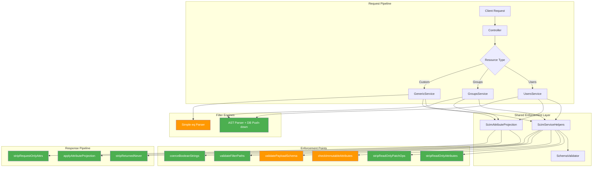

# P3 - Remaining Attribute Characteristic Gaps (RFC 7643 §2)

## Overview

**Feature**: Comprehensive audit of ALL RFC 7643 §2 attribute characteristic enforcement across every service, operation, and config combination  
**Version**: v0.40.0  
**Date**: 2026-04-23  
**Status**: Re-audited against source code (sole source of truth) - all GEN-01..GEN-12 resolved; G6 resolved in v0.32.0; 9 remaining gaps  
**Test Counts**: 3,429 unit (84 suites) - 1,128 E2E (53 suites) - ~817 live assertions - ~5,486 total

**RFC References**:
- [RFC 7643 §2 - Attribute Characteristics](https://datatracker.ietf.org/doc/html/rfc7643#section-2)
- [RFC 7643 §2.2 - Mutability](https://datatracker.ietf.org/doc/html/rfc7643#section-2.2)
- [RFC 7643 §2.3.7 - Reference Types](https://datatracker.ietf.org/doc/html/rfc7643#section-2.3.7)
- [RFC 7643 §2.4 - Returned / Required / Uniqueness / CaseExact](https://datatracker.ietf.org/doc/html/rfc7643#section-2.4)
- [RFC 7644 §3.9 - Attribute Projection](https://datatracker.ietf.org/doc/html/rfc7644#section-3.9)
- [RFC 7644 §3.14 - ETags / Conditional Requests](https://datatracker.ietf.org/doc/html/rfc7644#section-3.14)

---

## Enforcement Matrix (Source-of-Truth)

All data below is derived directly from source code inspection. No doc-to-doc assumptions.

### 1. Mutability: readOnly

| Enforcement Point | Generic | Users | Groups | Source Location |
|---|:---:|:---:|:---:|---|
| POST body stripping (top-level + sub-attrs) | ✅ | ✅ | ✅ | `stripReadOnlyAttributes()` in `scim-service-helpers.ts` L175–L277 |
| PUT body stripping | ✅ | ✅ | ✅ | Same - called in each service's `replaceResource()` |
| PATCH op stripping (non-strict) | ✅ | ✅ | ✅ | `stripReadOnlyPatchOps()` in `scim-service-helpers.ts` L291–L431 |
| PATCH pre-validation (strict mode, G8c) | ✅ | ✅ | ✅ | `validatePatchOperationValue()` in `schema-validator.ts` L880–L960 |
| Strict + IgnorePatchRO OFF → 400 | ✅ | ✅ | ✅ | Generic L448–L457 · Users L468–L480 · Groups L322–L336 |
| Schema validator reject on create/replace | ✅ (strict) | ✅ (strict) | ✅ (strict) | `schema-validator.ts` L252–L259 |
| `id` PATCH ops kept for G8c hard-reject | ✅ | ✅ | ✅ | `scim-service-helpers.ts` L309–L313 |
| Server-generated `id` | ✅ | ✅ | ✅ | All services use `randomUUID()` |
| R-MUT-2 readOnly sub-attrs | ✅ | ✅ | ✅ | Recursive stripping + PATCH ops sub-attr handling |

### 2. Mutability: immutable

| Enforcement Point | Generic | Users | Groups | Source Location |
|---|:---:|:---:|:---:|---|
| PUT check (existing vs incoming) | ✅ (strict) | ✅ (strict) | ✅ (strict) | `SchemaValidator.checkImmutable()` in `schema-validator.ts` L462–L540 |
| PATCH check (post-PATCH result vs existing) | ✅ (strict) | ✅ (strict) | ✅ (strict) | `checkImmutableAttributes()` called after patch engine |
| Sub-attribute immutable check | ✅ | ✅ | ✅ | `schema-validator.ts` L490–L515 |
| Multi-valued complex element matching | ✅ | ✅ | ✅ | `schema-validator.ts` L560–L598 (matches by `value` sub-attr) |
| **Gated by StrictSchemaValidation** | ⚠️ | ⚠️ | ⚠️ | Non-strict endpoints allow immutable mutation silently |

### 3. Mutability: writeOnly / Returned: never

| Enforcement Point | Generic | Users | Groups | Source Location |
|---|:---:|:---:|:---:|---|
| `returned:never` stripping from responses | ✅ | ✅ | ✅ | `stripReturnedNever()` in `scim-attribute-projection.ts` L136–L162 + inline in each `toScim*Resource()` |
| `writeOnly` → `returned:never` mapping | ✅ | ✅ | ✅ | `collectReturnedCharacteristics()` in `schema-validator.ts` L1077–L1078 |
| Extension URN never-attr stripping | ✅ | ✅ | ✅ | Each `toScim*Resource()` iterates extension objects |
| writeOnly filter blocking | ✅ (strict) | ✅ (strict) | ✅ (strict) | `validateFilterAttributePaths()` in `schema-validator.ts` L832–L841 |
| Password stripping from User responses | N/A | ✅ | N/A | `toScimUserResource()` always strips `password` |

### 4. Returned Characteristic (always/default/request/never)

| Enforcement Point | Generic | Users | Groups | Source Location |
|---|:---:|:---:|:---:|---|
| `returned:never` stripping | ✅ | ✅ | ✅ | See §3 above |
| `returned:request` stripping (unless `attributes` param) | ✅ | ✅ | ✅ | `stripRequestOnlyAttrs()` in `scim-attribute-projection.ts` L88–L109 |
| `returned:always` (schema-driven, R-RET-1) | ✅ | ✅ | ✅ | `getAlwaysReturnedForResource()` merges base set + schema always |
| `returned:always` sub-attrs (R-RET-3) | ✅ | ✅ | ✅ | `alwaysSubs` Map in `scim-attribute-projection.ts` L307–L316 |
| `attributes`/`excludedAttributes` query params | ✅ | ✅ | ✅ | Projection applied in controllers |
| G8g: Write response projection | ✅ | ✅ | ✅ | POST/PUT/PATCH responses support `attributes` param |

### 5. Required Attribute Enforcement

| Enforcement Point | Generic | Users | Groups | Source Location |
|---|:---:|:---:|:---:|---|
| Create/replace required check | ✅ (strict) | ✅ (strict) | ✅ (strict) | `schema-validator.ts` L101–L120 |
| Required sub-attribute check (V9) | ✅ (strict) | ✅ (strict) | ✅ (strict) | `schema-validator.ts` L408–L418 |
| PATCH mode exempt from required | ✅ | ✅ | ✅ | Required check skipped for `mode:'patch'` |
| **Gated by StrictSchemaValidation** | ⚠️ | ⚠️ | ⚠️ | Non-strict endpoints accept missing required attrs |

### 6. caseExact Enforcement

| Enforcement Point | Generic | Users | Groups | Source Location |
|---|:---:|:---:|:---:|---|
| In-memory filter (`evaluateFilter`) | ❌ | ✅ | ✅ | `scim-filter-parser.ts` L530–L548, `caseExactAttrs` Set |
| DB-level filter push-down | N/A | ⚠️ partial | ⚠️ partial | Hardcoded column types (citext/text), not schema-driven caseExact |
| Generic filter | ❌ | N/A | N/A | `parseSimpleFilter()` has no caseExact awareness |
| Schema-driven caseExact collection | ✅ | ✅ | ✅ | `collectCaseExactAttributes()` in `schema-validator.ts` L1095–L1115 |
| Uniqueness checks | DB collation | DB collation | DB collation | Uses DB column type, not schema's caseExact |

### 7. Boolean Coercion (Type Coercion)

| Enforcement Point | Generic | Users | Groups | Source Location |
|---|:---:|:---:|:---:|---|
| Pre-write coercion ("True"→true) | ✅ | ✅ | ✅ | `coerceBooleanStringsIfEnabled()` / `sanitizeBooleanStrings()` |
| PATCH value coercion | ✅ | ✅ | ✅ | Coerces boolean strings in PATCH op values |
| Post-PATCH result coercion | ✅ | ✅ | ✅ | Coerce on resulting payload before validation |
| Output coercion | ✅ | ✅ | ✅ | `sanitizeBooleanStrings()` in every `toScim*Resource()` |
| Gated by `AllowAndCoerceBooleanStrings` | ✅ | ✅ | ✅ | Config flag (default: true) |

### 8. Type Validation

| Enforcement Point | Generic | Users | Groups | Source Location |
|---|:---:|:---:|:---:|---|
| string/boolean/integer/decimal/dateTime/complex/reference/binary | ✅ (strict) | ✅ (strict) | ✅ (strict) | `schema-validator.ts` L296–L383 |
| xsd:dateTime format (V31) | ✅ (strict) | ✅ (strict) | ✅ (strict) | `schema-validator.ts` L359–L369 |
| Multi-valued/single-valued enforcement | ✅ (strict) | ✅ (strict) | ✅ (strict) | `schema-validator.ts` L265–L290 |
| Canonical values (V10) | ✅ (strict) | ✅ (strict) | ✅ (strict) | `schema-validator.ts` L389–L401 |
| **Gated by StrictSchemaValidation** | ⚠️ | ⚠️ | ⚠️ | All type validation is strict-mode-only |

### 9. Uniqueness Enforcement

| Enforcement Point | Generic | Users | Groups | Source Location |
|---|:---:|:---:|:---:|---|
| CREATE uniqueness | externalId + displayName | userName + externalId | displayName + externalId | Each service's `createResource()` |
| PUT uniqueness (excludes self) | ✅ | ✅ | ✅ | Each service's `replaceResource()` |
| PATCH uniqueness (post-patch, excludes self) | ✅ | ✅ | ✅ | Each service's `patchResource()` |
| Soft-delete-aware conflict | ✅ | ✅ | ✅ | Skip deleted conflicts on PUT/PATCH |
| Reprovision-on-conflict for soft-deleted | ✅ | ✅ | ✅ | GEN-10 |
| 409 Conflict + `scimType:uniqueness` | ✅ | ✅ | ✅ | All services |

### 10. Filter Engine

| Capability | Generic | Users | Groups |
|---|:---:|:---:|:---:|
| Engine type | AST-based + DB push-down + in-memory fallback | AST-based + DB push-down | AST-based + DB push-down |
| Supported operators | eq, ne, co, sw, ew, gt, ge, lt, le, pr | eq, ne, co, sw, ew, gt, ge, lt, le, pr | eq, ne, co, sw, ew, gt, ge, lt, le, pr |
| DB-pushable columns | displayName, externalId, id | userName, displayName, externalId, id, active | displayName, externalId, id, active |
| In-memory fallback | ✅ (`evaluateFilter`) | ✅ (`evaluateFilter`) | ✅ (`evaluateFilter`) |
| AND/OR compound | ✅ | ✅ | ✅ |
| valuePath (`attr[filter]`) | ✅ (in-memory) | ✅ (in-memory) | ✅ (in-memory) |
| caseExact-aware | ✅ (in-memory) | ✅ (in-memory) | ✅ (in-memory) |
| Filter path validation | ✅ | ✅ | ✅ |
| writeOnly filter blocking | ✅ (strict) | ✅ (strict) | ✅ (strict) |
| 400 for unsupported filter | ✅ | ✅ | ✅ |

### 11. Sorting

| Capability | Generic | Users | Groups |
|---|:---:|:---:|:---:|
| Engine | In-memory `localeCompare()` | DB-level via Prisma orderBy | DB-level via Prisma orderBy |
| Supported sortBy | id, externalId, displayName, meta.created, meta.lastModified | id, externalId, userName, displayName, active, meta.created, meta.lastModified | id, externalId, displayName, meta.created, meta.lastModified |
| Default sort | Insertion order | createdAt ascending | createdAt ascending |
| Unknown sortBy | Ignored silently | Falls back to createdAt | Falls back to createdAt |

### 12. Conditional Requests (ETags)

| Enforcement Point | Generic | Users | Groups | Source Location |
|---|:---:|:---:|:---:|---|
| ETag on responses (weak format) | ✅ | ✅ | ✅ | `meta.version` = `W/"<n>"` |
| If-Match enforcement (412 Precondition Failed) | ✅ | ✅ | ✅ | `assertIfMatch()` in each service |
| RequireIfMatch config flag → 428 | ✅ | ✅ | ✅ | `enforceIfMatch()` in each service |
| If-None-Match → 304 | ✅ | ✅ | ✅ | Controller-level GET handler |

---

## Resolved Items (GEN-01 through GEN-12)

All 12 items from the original Generic Service Parity audit are now confirmed resolved in source:

| ID | Description | Status |
|---|---|:---:|
| GEN-01 | Schema payload validation (create/replace/patch) | ✅ Resolved |
| GEN-02 | Immutable enforcement (replace/patch) | ✅ Resolved |
| GEN-03 | Boolean string coercion (pre-write) | ✅ Resolved |
| GEN-04 | Boolean sanitization (output) | ✅ Resolved |
| GEN-05 | Attribute projection (returned characteristic) | ✅ Resolved |
| GEN-06 | Request-only attribute handling | ✅ Resolved |
| GEN-07 | Write response projection (G8g) | ✅ Resolved |
| GEN-08 | CREATE uniqueness enforcement | ✅ Resolved |
| GEN-09 | PUT/PATCH uniqueness enforcement | ✅ Resolved |
| GEN-10 | Reprovision-on-conflict for soft-deleted | ✅ Resolved |
| GEN-11 | Strict schema extension URN enforcement | ✅ Resolved |
| GEN-12 | Config-aware soft-delete guard behavior | ✅ Resolved |

### v0.27.0 Fixes (3 additional)

| ID | Description | Status |
|---|---|:---:|
| Fix #1 | RequireIfMatch 428 enforcement on Generic PUT/PATCH/DELETE | ✅ Resolved |
| Fix #2 | `validateFilterAttributePaths()` wired in all 3 services | ✅ Resolved |
| Fix #3 | Generic filter returns 400 `invalidFilter` for unsupported expressions | ✅ Resolved |

---

## Remaining Gaps (9 items)

### Gap G1 - Immutable enforcement only active in strict mode
- **Severity**: Medium
- **Scope**: All services (Generic, Users, Groups)
- **RFC**: §2.2 - `immutable` attributes SHOULD NOT be changed after creation
- **Current**: `checkImmutableAttributes()` is gated by `StrictSchemaValidation` config flag. Non-strict endpoints allow silent mutation of immutable attributes.
- **Impact**: Endpoints without strict mode silently accept immutable attribute changes on PUT/PATCH.

### Gap G2 - Required attribute enforcement only in strict mode
- **Severity**: Medium
- **Scope**: All services
- **RFC**: §2.2 - `required` attributes MUST be present
- **Current**: `SchemaValidator.validate()` checks required only when `StrictSchemaValidation` is enabled.
- **Impact**: Non-strict endpoints accept payloads missing required attributes.

### Gap G3 - Schema-declared uniqueness on arbitrary attributes not enforced
- **Severity**: Medium
- **Scope**: All services
- **RFC**: §2.4 - `uniqueness: server|global` SHOULD be enforced
- **Current**: Uniqueness is hardcoded to specific columns (userName, displayName, externalId). Schema-declared `uniqueness` characteristic on other attributes is ignored.
- **Impact**: Custom attributes with `uniqueness: server` are not unique-checked.

### Gap G4 - referenceTypes not validated
- **Severity**: Low
- **Scope**: All services
- **RFC**: §2.3.7 - `referenceTypes` constrains what types of URIs a reference attribute can hold
- **Current**: `SchemaValidator` does not validate reference attribute values against declared `referenceTypes`.
- **Impact**: Reference attributes accept any string value regardless of declared type constraints.

### Gap G5 - $ref URI not systematically generated
- **Severity**: Low
- **Scope**: All services
- **RFC**: §8.2 - `$ref` should be a URI to the referenced resource
- **Current**: `$ref` URIs are not generated from schema `referenceTypes` declarations.
- **Impact**: Clients cannot follow `$ref` links to resolve referenced resources.

### ~~Gap G6 - Generic filter engine limited to eq only~~ ✅ RESOLVED (v0.32.0)
- **Resolution**: Wired `buildGenericFilter()` from `apply-scim-filter.ts` into `endpoint-scim-generic.service.ts`, replacing the regex-based `parseSimpleFilter()`. All 10 RFC 7644 operators + AND/OR compound expressions now supported with DB push-down for displayName/externalId/id and in-memory fallback for custom attributes.

### Gap G7 - Generic sorting is in-memory
- **Severity**: Low
- **Scope**: Generic service only
- **Current**: Generic resources sort via in-memory `localeCompare()` after fetching all records. Users/Groups use DB-level ORDER BY.
- **Impact**: Performance degrades with large record sets; sorting may differ from DB collation rules.

### Gap G8 - caseExact on DB filter push-down not schema-driven
- **Severity**: Low
- **Scope**: Users, Groups (DB push-down path)
- **RFC**: §2.2 - `caseExact` controls comparison semantics
- **Current**: DB push-down uses hardcoded column types (`citext` = case-insensitive, `text` = case-sensitive) rather than schema-declared `caseExact`. In-memory path does use schema-driven caseExact.
- **Impact**: Minimal - column types align with RFC defaults for standard attributes. Custom extensions may not honor caseExact correctly.

### Gap G9 - No type coercion beyond booleans
- **Severity**: Low
- **Scope**: All services
- **Current**: `coerceBooleanStringsIfEnabled()` handles `"True"`/`"False"` → `true`/`false`. No coercion for `string→integer`, `string→decimal`, or other type mismatches.
- **Impact**: Clients sending `"42"` for an integer attribute get a type validation error in strict mode rather than coercion.

### Gap G10 - caseExact not enforced on uniqueness checks
- **Severity**: Low
- **Scope**: All services
- **Current**: Uniqueness comparison relies on DB column collation (citext for userName/displayName, text for externalId). Schema-declared `caseExact` is not consulted.
- **Impact**: Minimal for standard attributes; custom extension attributes with `caseExact:true` + `uniqueness:server` might not get correct comparison.

---

## Architecture Diagram

Legend: Green = fully enforced across all services · Orange = partial/strict-mode-only

---

## Test Coverage Summary

### Unit Tests Added (v0.27.0 session)

| Spec File | Tests Added | Description |
|---|:---:|---|
| `endpoint-scim-generic.service.spec.ts` | 9 | Boolean coercion POST/PUT, returned:never stripping, readOnly stripping PUT, readOnly PATCH ops, immutable enforcement, post-PATCH uniqueness |
| `endpoint-scim-users.service.spec.ts` | 1 | Unknown filter attribute → 400 invalidFilter |
| `endpoint-scim-groups.service.spec.ts` | 1 | Unknown filter attribute → 400 invalidFilter |
| `scim-service-helpers.spec.ts` | 5 | validatePayloadSchema strict ON (unknown attr → 400, valid → pass), checkImmutableAttributes strict ON (changed → 400, unchanged → pass, strict OFF → pass) |
| **Total new unit tests** | **16** | |

### E2E Tests Added (v0.27.0 session)

| Spec File | Tests Added | Description |
|---|:---:|---|
| `generic-parity-fixes.e2e-spec.ts` | 5 | Users unknown filter → 400 (unconditional), Groups unknown filter → 400, Groups RequireIfMatch 428 (PUT/PATCH/DELETE), Generic DELETE with If-Match → 204 |
| **Total new E2E tests** | **5** | |

### Cumulative Test Counts

| Suite | Count | Suites |
|---|:---:|:---:|
| Unit | 3,429 | 84 |
| E2E | 1,128 | 53 |
| **Total** | **4,557** | **137** |

---

## Prioritization Matrix

| Priority | Gaps | Rationale |
|---|---|---|
| **P1 - Should Fix** | G1, G2 | Core RFC compliance; immutable/required should be enforced even without strict mode |
| **P2 - Nice to Have** | G3, G7, G9 | Uniqueness on custom attrs, sorting performance, type coercion beyond booleans |
| **P3 - Low Priority** | G4, G5, G8, G10 | referenceTypes, $ref, caseExact edge cases - minimal real-world impact |

---

*Document updated 2026-04-01 (G6 resolved in v0.32.0). Source files are the single source of truth - not this document.*
