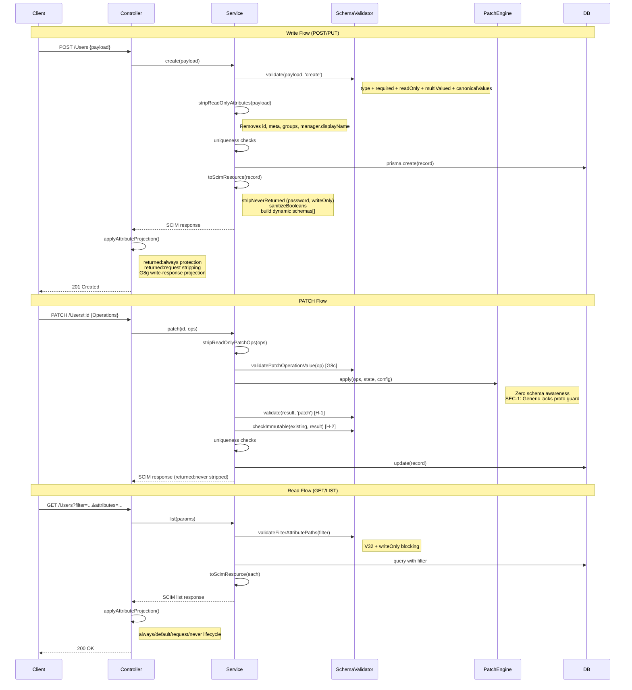

# P4 - Attribute Characteristic Schema Validation Deep Analysis (RFC 7643 §2)

## Overview

**Feature**: Comprehensive re-audit of ALL RFC 7643 §2 attribute characteristic enforcement across every service, operation, config combination, and code path  
**Version**: v0.38.0  
**Date**: 2026-04-23  
**Status**: Source-code-verified gap analysis - 19 gaps catalogued, 3 actionable fixes identified  
**Methodology**: Full RFC re-read → all prior audit docs re-read → source code inspection (sole source of truth)  
**Test Baseline**: 3,378 unit (84 suites) · 1,074 E2E (51 suites) · ~789 live assertions · ~5,353 total  
**Predecessor**: P3 (v0.32.0), P2 (v0.24.0), Cross-Cutting Concern Audit (v0.31.0), RFC7643 Full Audit (v0.22.0)

**RFC References**:
- [RFC 7643 §2 - Attribute Characteristics](https://datatracker.ietf.org/doc/html/rfc7643#section-2)
- [RFC 7643 §2.2 - Mutability](https://datatracker.ietf.org/doc/html/rfc7643#section-2.2)
- [RFC 7643 §2.3 - Data Types](https://datatracker.ietf.org/doc/html/rfc7643#section-2.3)
- [RFC 7643 §2.3.7 - Reference Types](https://datatracker.ietf.org/doc/html/rfc7643#section-2.3.7)
- [RFC 7643 §2.4 - Returned / Required / Uniqueness / CaseExact](https://datatracker.ietf.org/doc/html/rfc7643#section-2.4)
- [RFC 7643 §4.1 - Core User Schema](https://datatracker.ietf.org/doc/html/rfc7643#section-4.1)
- [RFC 7643 §4.2 - Core Group Schema](https://datatracker.ietf.org/doc/html/rfc7643#section-4.2)
- [RFC 7644 §3.4.2.2 - Filtering](https://datatracker.ietf.org/doc/html/rfc7644#section-3.4.2.2)
- [RFC 7644 §3.5.2 - Modifying with PATCH](https://datatracker.ietf.org/doc/html/rfc7644#section-3.5.2)
- [RFC 7644 §3.9 - Attribute Projection](https://datatracker.ietf.org/doc/html/rfc7644#section-3.9)

---

## Table of Contents

1. [Problem Statement](#problem-statement)
2. [RFC 7643 §2 - The 11 Characteristics](#rfc-7643-2--the-11-characteristics)
3. [Executive Compliance Matrix](#executive-compliance-matrix)
4. [Architecture](#architecture)
5. [Key Components](#key-components)
6. [Characteristic-by-Characteristic Audit](#characteristic-by-characteristic-audit)
7. [Operation × Service Enforcement Pipeline](#operation--service-enforcement-pipeline)
8. [Cross-Flow Combination Matrices](#cross-flow-combination-matrices)
9. [Remaining Gaps - Prioritized](#remaining-gaps--prioritized)
10. [Design Choices (Not Gaps)](#design-choices-not-gaps)
11. [What IS Done Well](#what-is-done-well)
12. [Recommended Fix Priority](#recommended-fix-priority)
13. [Industry Comparison](#industry-comparison)

---

## Problem Statement

After the P3 audit (v0.32.0) identified 9 remaining gaps and the Cross-Cutting Concern Audit (v0.31.0) documented 12 findings, a fresh full-stack re-audit was needed against v0.35.0 source to:

1. **Verify the actual current state** - prior audit docs were produced at different versions, causing conflicting claims
2. **Discover new gaps** introduced by v0.33.0 (uniqueness realignment) and v0.35.0 (deletedAt removal)
3. **Identify actionable security issues** - specifically the `GenericPatchEngine` prototype pollution vulnerability
4. **Produce a single authoritative gap register** with severity-based prioritization and effort estimates
5. **Catalogue every enforcement point** per characteristic × flow × service × config combination

---

## RFC 7643 §2 - The 11 Characteristics

Per RFC 7643 §2, every SCIM attribute definition includes these 11 characteristics:

| # | Characteristic | Type | RFC § | Purpose |
|---|---|---|---|---|
| 1 | `name` | String | §2.1 | Attribute identifier (case-insensitive per §2.1) |
| 2 | `type` | String | §2.3 | Data type: string, boolean, integer, decimal, dateTime, reference, binary, complex |
| 3 | `multiValued` | Boolean | §2.4 | Whether value is an array |
| 4 | `required` | Boolean | §2.4 | Whether attribute MUST be present on create/replace |
| 5 | `mutability` | String | §2.2 | Access rules: readOnly, readWrite, immutable, writeOnly |
| 6 | `returned` | String | §2.4 | Response rules: always, default, request, never |
| 7 | `caseExact` | Boolean | §2.4 | Whether string comparisons are case-sensitive |
| 8 | `uniqueness` | String | §2.4 | Uniqueness scope: none, server, global |
| 9 | `canonicalValues` | Array | §2.4 | Suggested/enforced enumeration values |
| 10 | `referenceTypes` | Array | §2.3.7 | Valid reference target types for `type=reference` |
| 11 | `description` | String | §2 | Human-readable description (informational only) |

---

## Executive Compliance Matrix

| Characteristic | POST | PUT | PATCH | GET | LIST/Filter | Sort | Discovery | Overall |
|---|:---:|:---:|:---:|:---:|:---:|:---:|:---:|:---:|
| **name** | ✅ | ✅ | ✅ | ✅ | ✅ | ✅ | ✅ | ✅ **Complete** |
| **type** | ✅¹ | ✅¹ | ✅¹ | - | - | - | ✅ | ✅ **Complete** (strict) |
| **multiValued** | ✅¹ | ✅¹ | ✅¹ | - | - | - | ✅ | ✅ **Complete** (strict) |
| **required** | ✅¹ | ✅¹ | ✅² | - | - | - | ✅ | ✅ **Complete** (strict) |
| **mutability:readOnly** | ✅ | ✅ | ✅ | - | - | - | ✅ | ✅ **Complete** |
| **mutability:readWrite** | ✅ | ✅ | ✅ | ✅ | ✅ | ✅ | ✅ | ✅ **Complete** |
| **mutability:immutable** | ✅ | ✅¹ | ✅¹ | ✅ | ✅ | - | ✅ | ⚠️ **Strict-gated** |
| **mutability:writeOnly** | ✅ | ✅ | ✅ | ✅ | ⚠️³ | ❌⁴ | ✅ | ⚠️ **Gap** |
| **returned:always** | ✅ | ✅ | ✅ | ✅ | ✅ | - | ✅ | ✅ **Complete** |
| **returned:default** | ✅ | ✅ | ✅ | ✅ | ✅ | - | ✅ | ✅ **Complete** |
| **returned:never** | ✅ | ✅ | ✅ | ✅ | ✅ | - | ✅ | ✅ **Complete** |
| **returned:request** | ✅ | ✅ | ✅ | ✅ | ✅ | - | ✅ | ✅ **Complete** |
| **caseExact** | - | - | ⚠️⁵ | - | ⚠️⁶ | ⚠️⁷ | ✅ | ⚠️ **Gap** |
| **uniqueness:server** | ✅ | ✅ | ✅ | - | - | - | ✅ | ✅ **Complete** |
| **uniqueness:global** | ❌ | ❌ | ❌ | - | - | - | ❌ | ❌ Not enforced |
| **canonicalValues** | ✅¹ | ✅¹ | ✅¹ | - | - | - | ✅ | ✅ **Complete** (strict) |
| **referenceTypes** | ❌ | ❌ | ❌ | - | - | ❌ | ✅ | ❌ Not enforced |
| **description** | - | - | - | - | - | - | ✅ | ✅ **Complete** |

**Legend**: ✅ = Fully enforced · ⚠️ = Partially enforced · ❌ = Not enforced · - = Not applicable

¹ Gated by `StrictSchemaValidation` config flag  
² Correctly skipped for PATCH per RFC 7644 §3.5.2  
³ `writeOnly` filter blocking works in strict mode only via `validateFilterAttributePaths()`  
⁴ `writeOnly` in `sortBy` not validated at all  
⁵ `GroupPatchEngine` has no `caseExactPaths` for valuePath matching  
⁶ Generic service captures `caseExactAttrs` but **never passes it** to `buildGenericFilter()`  
⁷ Generic sort uses hardcoded `localeCompare()` with zero caseExact awareness  

---

## Architecture

### Multi-Layer Enforcement Pipeline

```
Client Request (POST / PUT / PATCH / GET / LIST)
    │
    ▼
┌─────────────────────────────────────────────────────────────────┐
│  Layer 1: Controller                                            │
│  ┌───────────────────────────────────────────────────────────┐  │
│  │ applyAttributeProjection(resource, attrs, excluded,       │  │
│  │   alwaysByParent, requestByParent)                        │  │
│  │ → returned:'always' protection (from cache)               │  │
│  │ → returned:'request' stripping                            │  │
│  │ → attributes/excludedAttributes projection                │  │
│  └───────────────────────────────────────────────────────────┘  │
├─────────────────────────────────────────────────────────────────┤
│  Layer 2: Service                                               │
│  ┌───────────────────────────────────────────────────────────┐  │
│  │ * ensureSchema() - schema URN validation                  │  │
│  │ * enforceStrictSchemaValidation() - unknown URN reject    │  │
│  │ * coerceBoolean*() - "True"→true (parent-aware)          │  │
│  │ * validatePayloadSchema() - type/required/multiValued     │  │
│  │ * stripReadOnlyAttributes() - POST/PUT strip              │  │
│  │ * stripReadOnlyPatchOps() - PATCH op strip                │  │
│  │ * checkImmutableAttributes() - PUT/PATCH compare          │  │
│  │ * uniqueness checks - hardcoded + schema-driven           │  │
│  │ * toScimResource() - returned:never strip + boolean fix   │  │
│  └───────────────────────────────────────────────────────────┘  │
├─────────────────────────────────────────────────────────────────┤
│  Layer 3: Domain - SchemaValidator                              │
│  ┌───────────────────────────────────────────────────────────┐  │
│  │ validate() → type, multiValued, required, readOnly,       │  │
│  │   unknown attrs, canonicalValues (V10), required          │  │
│  │   sub-attrs (V9), dateTime (V31), schemas[] (V25)         │  │
│  │ checkImmutable() → deep compare for immutable attrs       │  │
│  │ validatePatchOperationValue() → G8c PATCH pre-check       │  │
│  │ buildCharacteristicsCache() → precomputed O(1) lookups    │  │
│  │ validateFilterAttributePaths() → V32 filter+writeOnly     │  │
│  └───────────────────────────────────────────────────────────┘  │
├─────────────────────────────────────────────────────────────────┤
│  Layer 4: Domain - PatchEngines (ZERO schema awareness)         │
│  ┌───────────────────────────────────────────────────────────┐  │
│  │ UserPatchEngine - DANGEROUS_KEYS guard ✅                  │  │
│  │ GroupPatchEngine - DANGEROUS_KEYS guard ✅                 │  │
│  │ GenericPatchEngine - NO prototype pollution guard ❌       │  │
│  │ All validation done BEFORE (G8c) and AFTER (H-1/H-2)     │  │
│  └───────────────────────────────────────────────────────────┘  │
├─────────────────────────────────────────────────────────────────┤
│  Layer 5: Data - Prisma / PostgreSQL / InMemory                 │
│  ┌───────────────────────────────────────────────────────────┐  │
│  │ userName: Citext (caseExact=false) - UNIQUE per endpoint  │  │
│  │ displayName: Citext (caseExact=false) - non-unique index  │  │
│  │ externalId: Text (caseExact=true) - non-unique index      │  │
│  │ active: Boolean   payload: JSONB   version: Int           │  │
│  └───────────────────────────────────────────────────────────┘  │
└─────────────────────────────────────────────────────────────────┘
```

### Precomputed Schema Characteristics Cache

All attribute characteristics are precomputed **once** at profile load time via `SchemaValidator.buildCharacteristicsCache()`. The cache is keyed by URN-qualified dot-paths (e.g., `urn:...:core:2.0:user.emails`) and stored per resource-type-URN on the endpoint profile. This provides O(1) lookups at request time with zero per-request tree walks and zero name-collision ambiguity.

**Cache fields** (15 total):

| Field | Type | Purpose |
|---|---|---|
| `booleansByParent` | `Map<string, Set<string>>` | Boolean-typed attrs per parent |
| `neverReturnedByParent` | `Map<string, Set<string>>` | `returned:never` + `writeOnly` attrs |
| `alwaysReturnedByParent` | `Map<string, Set<string>>` | `returned:always` attrs |
| `requestReturnedByParent` | `Map<string, Set<string>>` | `returned:request` attrs |
| `readOnlyByParent` | `Map<string, Set<string>>` | `mutability:readOnly` attrs |
| `immutableByParent` | `Map<string, Set<string>>` | `mutability:immutable` attrs |
| `caseExactByParent` | `Map<string, Set<string>>` | `caseExact:true` attrs |
| `caseExactPaths` | `Set<string>` | Flat lowercase dotted paths for filter/sort |
| `uniqueAttrs` | `Array<{schemaUrn, attrName, caseExact}>` | `uniqueness:server` custom attrs |
| `extensionUrns` | `readonly string[]` | Extension URNs for resource type |
| `coreSchemaUrn` | `string` | Lowercase core URN (root key) |
| `schemaUrnSet` | `ReadonlySet<string>` | All schema URNs for top-level key ID |
| `coreAttrMap` | `Map<string, SchemaAttributeDefinition>` | Core attr lookup |
| `extensionSchemaMap` | `Map<string, SchemaDefinition>` | Extension schema lookup |
| `readOnlyCollected` | `{core, extensions, coreSubAttrs, extensionSubAttrs}` | Structured for `stripReadOnlyAttributes()` |

### Request/Response Flow



---

## Key Components

| Component | File | Purpose |
|---|---|---|
| `SchemaAttributeDefinition` | `validation-types.ts` | Interface defining all 11 characteristics + subAttributes |
| `SchemaCharacteristicsCache` | `validation-types.ts` | Precomputed cache type with 15 URN-dot-path maps |
| `buildCharacteristicsCache()` | `schema-validator.ts` | Single-pass tree walk producing all cache fields |
| `validate()` | `schema-validator.ts` | Core validation: type, multiValued, required, readOnly, canonicalValues, dateTime, unknown attrs |
| `checkImmutable()` | `schema-validator.ts` | Deep comparison for immutable attrs on PUT/PATCH (H-2) |
| `validatePatchOperationValue()` | `schema-validator.ts` | G8c PATCH readOnly pre-check |
| `validateFilterAttributePaths()` | `schema-validator.ts` | V32 filter path + writeOnly blocking |
| `stripReadOnlyAttributes()` | `scim-service-helpers.ts` | ReadOnly stripping for POST/PUT (top-level + R-MUT-2 sub-attrs) |
| `stripReadOnlyPatchOps()` | `scim-service-helpers.ts` | ReadOnly PATCH op filtering |
| `assertSchemaUniqueness()` | `scim-service-helpers.ts` | Schema-driven uniqueness for custom extension attrs |
| `sanitizeBooleanStringsByParent()` | `scim-service-helpers.ts` | URN-dot-path boolean coercion (output) |
| `stripNeverReturnedFromPayload()` | `scim-service-helpers.ts` | `returned:never` + `writeOnly` stripping + dynamic `schemas[]` |
| `applyAttributeProjection()` | `scim-attribute-projection.ts` | Attribute projection with always/request/default/never lifecycle |
| `stripReturnedNever()` | `scim-attribute-projection.ts` | Removes `returned:never` attrs from responses |
| `buildUserFilter()` / `buildGroupFilter()` | `apply-scim-filter.ts` | Filter with `caseExactAttrs` param for in-memory + DB |
| `buildGenericFilter()` | `apply-scim-filter.ts` | Filter accepting `caseExactAttrs` param (**caller doesn't pass it - G3**) |
| `evaluateFilter()` | `scim-filter-parser.ts` | In-memory filter with schema-driven `caseExactAttrs` |
| `resolveUserSortParams()` / `resolveGroupSortParams()` | `scim-sort.util.ts` | Sort with `caseExactPaths` param |
| `UserPatchEngine` | `user-patch-engine.ts` | PATCH (zero schema awareness, `DANGEROUS_KEYS` guard ✅) |
| `GroupPatchEngine` | `group-patch-engine.ts` | PATCH (zero schema awareness, `DANGEROUS_KEYS` guard ✅) |
| `GenericPatchEngine` | `generic-patch-engine.ts` | PATCH (zero schema awareness, **NO proto pollution guard - SEC-1**) |

---

## Characteristic-by-Characteristic Audit

### 1. `name` - ✅ Complete

All code paths use case-insensitive matching per RFC 7643 §2.1:
- Schema validation: `attr.name.toLowerCase()` in `schema-validator.ts`
- PATCH path resolution: case-insensitive matching in `resolvePatchPath()`
- Projection: `findKey()` does case-insensitive object key lookup in `scim-attribute-projection.ts`
- Filter: column maps use lowercase keys in `apply-scim-filter.ts`
- Sort: lowercase normalization in `scim-sort.util.ts`
- Sub-attributes: case-insensitive matching in `validateSubAttributes()`

### 2. `type` - ✅ Complete (strict-gated)

`SchemaValidator.validateSingleValue()` validates all 8 SCIM types:

| Type | Check | Status |
|---|---|---|
| `string` | `typeof === 'string'` | ✅ |
| `boolean` | `typeof === 'boolean'` | ✅ |
| `integer` | `typeof === 'number' && Number.isInteger()` | ✅ |
| `decimal` | `typeof === 'number'` | ✅ |
| `dateTime` | `typeof === 'string'` + ISO 8601 regex (V31) | ✅ |
| `reference` | `typeof === 'string'` | ⚠️ No URI format validation |
| `binary` | `typeof === 'string'` | ⚠️ No Base64 format validation |
| `complex` | `typeof === 'object'` + sub-attr recursion | ✅ |

Sub-attributes: Types checked recursively via `validateSubAttributes()`.

### 3. `multiValued` - ✅ Complete (strict-gated)

`multiValued: true` → value MUST be array; `multiValued: false` → MUST NOT be array. Enforced in `schema-validator.ts`, recursive on sub-attrs.

### 4. `required` - ✅ Complete (strict-gated)

- POST/PUT: missing required (non-readOnly) attr → 400
- PATCH: skipped (correct per RFC 7644 §3.5.2)
- `readOnly + required` interaction: correctly exempts `id` (required + readOnly)
- Sub-attribute required: V9 enforcement in `validateSubAttributes()`

### 5. `mutability` - ✅ Complete (all 4 modes)

| Mode | POST | PUT | PATCH | Response |
|---|---|---|---|---|
| **readOnly** | Strip + warn | Strip + warn | Strip or reject (configurable) | Included normally |
| **readWrite** | Accept | Accept | Accept | Included normally |
| **immutable** | Accept (first write) | Reject 400 if changed¹ | Reject 400 if changed¹ | Included normally |
| **writeOnly** | Accept | Accept | Accept | **Stripped** (defense-in-depth) |

¹ Gated by `StrictSchemaValidation`

Sub-attribute handling (R-MUT-2): ReadOnly sub-attrs within readWrite parents (e.g., `manager.displayName` inside `manager`) are stripped individually via `coreSubAttrs` / `extensionSubAttrs` maps.

### 6. `returned` - ✅ Complete (all 4 modes)

| Mode | Enforcement Location | Method |
|---|---|---|
| `always` | Controller via `applyAttributeProjection()` | `getAlwaysReturnedForResource()` + cached `alwaysByParent` |
| `default` | Controller | `excludeAttrs()` - removed only if named in `excludedAttributes` |
| `never` | Service layer | `stripNeverReturnedFromPayload()` - applied to ALL responses |
| `request` | Controller | `stripRequestOnlyAttrs()` - stripped on reads unless in `?attributes=` |

Sub-attribute returned: Recursive via URN-dot-path `*ByParent` maps for all 4 modes (R-RET-3).

### 7. `caseExact` - ⚠️ Partially Enforced

| Context | Schema-Driven? | Status |
|---|---|---|
| In-memory filter (`evaluateFilter`) for Users/Groups | ✅ Yes | ✅ Correct |
| DB push-down filter | ❌ Column-type proxy | ⚠️ Correct for standard attrs |
| Generic filter | Captured but **not passed** | ❌ **BUG** (one-line fix - **G3**) |
| Sort (Users/Groups) | ✅ Yes (`caseExactPaths`) | ✅ Correct |
| Sort (Generic) | ❌ No awareness | ❌ Low impact |
| Uniqueness (schema-driven) | ✅ Yes | ✅ Correct |
| Uniqueness (column-hardcoded) | ❌ Always CI | ⚠️ Accepted |
| PATCH valuePath (Users) | ✅ `config.caseExactPaths` | ✅ Correct |
| PATCH valuePath (Groups) | ❌ No equivalent | ⚠️ Low impact |

### 8. `uniqueness` - ✅ Mostly Complete

| Scope | Enforcement | Status |
|---|---|---|
| `server` (hardcoded: User.userName, Group.displayName) | DB constraint + service check | ✅ |
| `server` (schema-driven custom attrs) | `assertSchemaUniqueness()` with caseExact | ✅ |
| `global` | Not implemented | ❌ (extremely rare in practice) |
| `none` | No check | ✅ |

### 9. `canonicalValues` - ✅ Complete (strict-gated)

V10 in `validateSingleValue()`. All email/phone/address/group `type` sub-attrs have canonical values.

### 10. `referenceTypes` - ❌ Not Enforced at Runtime

Present in schema constants and exposed via `/Schemas` discovery. No runtime validation. RFC says "MAY" - most SCIM servers don't validate. Group `members.$ref` properly defined with `referenceTypes: ['User', 'Group']`.

### 11. `description` - ✅ Complete

Informational only. All attributes have descriptions. Exposed in `/Schemas`.

---

## Operation × Service Enforcement Pipeline

### CREATE (POST)

| Step | Users | Groups | Generic | Notes |
|------|:---:|:---:|:---:|---|
| 1. `ensureSchema()` | ✅ | ✅ | ✅ | Validates core schema URN present |
| 2. `enforceStrictSchemaValidation()` | ✅ | ✅ | ✅ | Rejects undeclared extension URNs |
| 3. `coerceBoolean*()` | ✅ | ✅ | ✅ | Parent-aware boolean string coercion |
| 4. `validatePayloadSchema('create')` | ✅ | ✅ | ✅ | type + required + mutability + unknowns |
| 5. `stripReadOnlyAttributes()` | ✅ | ✅ | ✅ | RFC §2.2: server ignores client readOnly |
| 6. Core uniqueness check | ✅ `userName` | ✅ `displayName` | ❌ None | Generic: no canonical key by design |
| 7. Extension uniqueness | ✅ | ✅ | ✅ | `assertSchemaUniqueness()` |
| 8. Create record (`randomUUID()`) | ✅ | ✅ | ✅ | Server-assigned `id` |
| 9. Response: `toScim*()` | ✅ | ✅ | ✅ | boolean sanitize + returned:never strip |
| 10. Controller: projection + warnings | ✅ | ✅ | ✅ | G8g write-response projection |

### REPLACE (PUT)

| Step | Users | Groups | Generic | Notes |
|------|:---:|:---:|:---:|---|
| 1. `ensureSchema()` | ✅ | ✅ | ✅ | |
| 2. `enforceStrictSchemaValidation()` | ✅ | ✅ | ✅ | |
| 3. `coerceBoolean*()` | ✅ | ✅ | ✅ | |
| 4. `validatePayloadSchema('replace')` | ✅ | ✅ | ✅ | |
| 5. `stripReadOnlyAttributes()` | ✅ | ✅ | ✅ | |
| 6. Find existing (404 check) | ✅ | ✅ | ✅ | |
| 7. `enforceIfMatch()` | ✅ | ✅ | ✅ | ETag / 412 / 428 |
| 8. `checkImmutableAttributes()` | ✅ | ✅ | ✅ | H-2 (strict-gated - **G1**) |
| 9. Core uniqueness (self-excluded) | ✅ `userName` | ✅ `displayName` | ❌ None | |
| 10. Extension uniqueness | ✅ | ✅ | ✅ | |
| 11. Response: returned:never strip | ✅ | ✅ | ✅ | |

### PATCH

| Step | Users | Groups | Generic | Notes |
|------|:---:|:---:|:---:|---|
| 1. `ensureSchema(PatchOp)` | ✅ | ✅ | ✅ | |
| 2. Find existing (404 check) | ✅ | ✅ | ✅ | |
| 3. `enforceIfMatch()` | ✅ | ✅ | ✅ | ETag / 412 / 428 |
| 4. ReadOnly PATCH op stripping | ✅ | ✅ | ✅ | Configurable matrix |
| 5. `coercePatchOpBooleans()` | ✅ | ✅ | ✅ | Pre-PATCH boolean fix |
| 6. Pre-PATCH per-op validation (G8c) | ✅ | ✅ | ✅ | `validatePatchOperationValue()` |
| 7. Apply PatchEngine | ✅ | ✅ | ⚠️ | **SEC-1**: Generic has no proto pollution guard |
| 8. Post-PATCH boolean coercion | ✅ | ✅ | ✅ | |
| 9. Post-PATCH schema validation (H-1) | ✅ | ✅ | ✅ | |
| 10. `checkImmutableAttributes()` (H-2) | ✅ | ✅ | ✅ | strict-gated (**G1**) |
| 11. Core uniqueness (self-excluded) | ✅ `userName` | ✅ `displayName` | ❌ None | |
| 12. Extension uniqueness | ✅ | ✅ | ✅ | |
| 13. Response: returned:never strip | ✅ | ✅ | ✅ | |

### GET / LIST / SEARCH

| Step | Users | Groups | Generic | Notes |
|------|:---:|:---:|:---:|---|
| 1. Find / query | ✅ | ✅ | ✅ | |
| 2. Build filter (LIST) | ✅ | ✅ | ✅ | |
| 3. Validate filter paths (LIST) | ✅ | ✅ | ✅ | writeOnly blocked in strict mode |
| 4. caseExact in filter (LIST) | ✅ | ✅ | ❌ | **G3**: Generic doesn't pass `caseExactAttrs` |
| 5. Sort (LIST) | ✅ | ✅ | ⚠️ | Generic: in-memory localeCompare, no caseExact |
| 6. `toScim*()` per item | ✅ | ✅ | ✅ | bool sanitize + returned:never strip |
| 7. Controller: projection | ✅ | ✅ | ✅ | always / request / default / never |

### DELETE

No attribute characteristic concerns - only `enforceIfMatch()` and hard-delete gate.

---

## Cross-Flow Combination Matrices

### Mutability × Flow × Config

| Mutability | POST | PUT | PATCH | GET/LIST | Config Gate |
|---|---|---|---|---|---|
| **readOnly** | Strip silently + warn | Strip silently + warn | Strip if `!strict \|\| ignorePatchRO`; Reject 400 if `strict && !ignorePatchRO` | N/A | `StrictSchemaValidation`, `IgnoreReadOnlyAttributesInPatch`, `IncludeWarningAboutIgnoredReadOnlyAttribute` |
| **readWrite** | Accept | Accept | Accept | Return per `returned` | None |
| **writeOnly** | Accept (stored) | Accept (stored) | Accept (stored) | **Stripped** (defense-in-depth) | None |
| **immutable** | Accept (first write) | Reject 400 if changed | Reject 400 if result changed | Return normally | `StrictSchemaValidation` (**G1**) |

### Returned × Flow × Query Params

| Returned | No params | `?attributes=X` | `?excludedAttributes=X` | Write response |
|---|---|---|---|---|
| **always** | ✅ Included | ✅ Always included | ✅ Cannot be excluded | ✅ Included (G8g) |
| **default** | ✅ Included | Only if in X | Excluded if in X | ✅ Included (G8g) |
| **request** | ❌ Stripped (controller) | ✅ Only if in X | ❌ Stripped (regardless) | Same rules (G8g) |
| **never** | ❌ Stripped (service) | ❌ Cannot be requested | ❌ Stripped (service) | ❌ Stripped (service) |

### CaseExact × Feature

| Feature | caseExact:true | caseExact:false |
|---|---|---|
| **Filter (Users/Groups)** | Case-sensitive match | Case-insensitive match |
| **Filter (Generic)** | ❌ Always insensitive (**G3**) | Case-insensitive |
| **Sort (Users/Groups)** | Case-sensitive ordering | Case-insensitive ordering |
| **Sort (Generic)** | ⚠️ Always `localeCompare` | Always `localeCompare` |
| **Uniqueness (schema-driven)** | Exact compare | `toLowerCase()` compare |
| **Uniqueness (column-hardcoded)** | ⚠️ Always CI (CITEXT) | Case-insensitive |
| **PATCH valuePath (Users)** | Case-sensitive via `config.caseExactPaths` | Case-insensitive |
| **PATCH valuePath (Groups)** | ⚠️ Always insensitive | Always insensitive |
| **Attribute name matching** | Always CI (correct per §2.1) | Always CI |

### StrictSchemaValidation Config Matrix

| Feature | Strict OFF | Strict ON |
|---|---|---|
| Required attrs | ❌ Not checked (**G2**) | ✅ Checked (create/replace) |
| Type validation | ❌ Not checked | ✅ Checked |
| Unknown attrs | ❌ Ignored | ✅ 400 error |
| readOnly (POST/PUT) | ✅ Stripped (always) | ✅ Stripped + logged |
| readOnly (PATCH) | ✅ Stripped | Depends on `IgnoreReadOnlyAttributesInPatch` |
| Immutable check | ❌ Not checked (**G1**) | ✅ 400 on violation |
| V2 PATCH pre-validation | ❌ Not checked | ✅ Checked |
| H-1 PATCH post-validation | ❌ Not checked | ✅ Checked |
| Undeclared extension URNs | ❌ Ignored | ✅ 400 error |
| Filter path validation | ❌ Not checked | ✅ 400 `invalidFilter` |
| writeOnly in filter | ❌ Not checked | ✅ 400 `invalidFilter` |
| Canonical values | ❌ Not checked | ✅ 400 on violation |

---

## Remaining Gaps - Prioritized

### CRITICAL - Security

| ID | Gap | Scope | Files | Impact |
|---|---|---|---|---|
| **SEC-1** | `GenericPatchEngine` has **no prototype pollution guard** | Generic PATCH | `generic-patch-engine.ts` | A PATCH with `path: "__proto__.isAdmin"` could inject properties into `Object.prototype`. `UserPatchEngine` and `GroupPatchEngine` both have `DANGEROUS_KEYS` guards, but Generic's `setNested()` blindly traverses any path segments from user input. |

### HIGH - RFC Behavioral Compliance

| ID | Gap | Scope | RFC § | Impact |
|---|---|---|---|---|
| **G1** | Immutable enforcement gated by `StrictSchemaValidation` | All services, PUT/PATCH | §2.2 "SHALL NOT" | Non-strict endpoints silently allow mutation of immutable attributes |
| **G2** | Required attribute enforcement gated by `StrictSchemaValidation` | All services, POST/PUT | §2.4 "MUST" | Non-strict endpoints accept payloads missing required attributes |

### MEDIUM - Functional Gaps

| ID | Gap | Scope | RFC § | Impact |
|---|---|---|---|---|
| **G3** | Generic filter `caseExactAttrs` captured but **never passed** to `buildGenericFilter()` | Generic LIST/SEARCH | §2.4 | Custom `caseExact:true` attrs always compared case-insensitively. **One-line fix.** |
| **G4** | Schema-declared `uniqueness` on arbitrary attrs not enforced for column-promoted attrs | All services | §2.4 | Column-promoted attrs always enforce uniqueness regardless of schema |
| **G5** | DB filter push-down uses hardcoded `ColumnType` map, not schema `caseExact` | Users/Groups DB path | §2.4 | Standard attrs correct by alignment; custom resource types may be wrong |
| **G6** | `writeOnly` attributes not blocked from `sortBy` | All services | §2.2 | Client could infer partial info about writeOnly values via sort ordering |
| **G7** | `GroupPatchEngine` has no `caseExactPaths` for valuePath matching | Groups PATCH | §2.4 | `members[value eq "x"]` matching ignores caseExact |

### LOW - Completeness / Strict Compliance

| ID | Gap | Scope | RFC § | Impact |
|---|---|---|---|---|
| **G8** | `referenceTypes` not validated at runtime | All services | §2.3.7 "MAY" | Reference attrs accept any string |
| **G9** | `uniqueness:global` not implemented | All services | §2.4 | Only `server` scope checked |
| **G10** | Generic sort: hardcoded `localeCompare()`, no caseExact | Generic LIST | §2.4 | Always locale-sensitive |
| **G11** | `type:'reference'` values not validated as URIs (RFC 3986) | All services | §2.3 | Reference-typed attrs accept any string |
| **G12** | `type:'binary'` values not validated as Base64 (RFC 4648) | All services | §2.3 | Binary-typed attrs accept any string |
| **G13** | Server doesn't auto-generate `$ref` URIs for members/groups | Responses | §4.2 | Industry: Okta/Entra generate these |
| **G14** | `manager.displayName` not server-resolved | Enterprise ext | §4.3 | Stored as client-provided |
| **G15** | No validation on custom schema JSONB structure | Admin API | - | Malformed definitions → silent skips |
| **G16** | DELETE order inconsistency: Users checks hard-delete before `enforceIfMatch()` | Users DELETE | - | Different error precedence |
| **G17** | Group `members[].type` sub-attr lacks `canonicalValues` | Discovery | §4.2 | Minor `/Schemas` completeness |
| **G18** | `caseExact` not honored in column-promoted uniqueness | Users/Groups | §2.4 | Profiles rarely override |
| **G19** | No type coercion beyond booleans | All services | - | `"42"` → 400 in strict mode |

---

## Design Choices (Not Gaps)

| Decision | Rationale |
|---|---|
| `required` skipped on PATCH result | RFC 7644 §3.5.2 is ambiguous; lenient by design |
| PatchEngines have zero schema awareness | All validation external - enforced before + after engine application |
| Generic service has no hardcoded uniqueness | By design - generic resources have no canonical "natural key" |
| `StrictSchemaValidation` gates advanced checks | Entra ID compatibility requires lenient mode by default |
| `readOnly` strip on POST/PUT is unconditional | RFC says "SHALL be ignored" - stripping is always safe |
| Immutable multi-valued matching by `value` only | Standard SCIM pattern per RFC 7643 §2.4 |

---

## What IS Done Well

13 of 15 characteristics are fully enforced. Key strengths:

1. **All `returned` variants** - fully schema-driven via `SchemaCharacteristicsCache` with URN-dot-path precision (zero name collisions)
2. **Sub-attribute enforcement** - recursive for readOnly stripping, returned:never stripping, returned:always protection, boolean coercion
3. **Defense-in-depth** - `writeOnly` → `returned:never` mapping ensures no data leaks even with misconfigured schemas
4. **Precomputed cache** - `buildCharacteristicsCache()` single tree walk at profile load - zero per-request overhead
5. **Service parity** - near-perfect between Users/Groups/Generic (same shared helpers, same enforcement steps)
6. **Schema-driven uniqueness** - `assertSchemaUniqueness()` correctly handles `caseExact` for custom extension attrs
7. **`readOnly` + `required` interaction** - correctly exempts server-assigned readOnly attrs from required checks
8. **Cross-concern interactions** - `writeOnly+returned:never`, `immutable+readOnly`, `returned:always+excludedAttributes` all have explicit defense-in-depth
9. **G8g write-response projection** - consistently applied on POST, PUT, PATCH across all controllers
10. **Dynamic `schemas[]` in response** - G19/FP-1: only includes visible extension URNs after returned:never stripping

---

## Recommended Fix Priority

| Priority | IDs | Effort | Description |
|---|---|---|---|
| **P0 - Security** | SEC-1 | 15 min | Add `DANGEROUS_KEYS` guard to `GenericPatchEngine` - matching `UserPatchEngine` pattern |
| **P1 - Quick win** | G3 | 5 min | Pass `caseExactAttrs` to `buildGenericFilter()` - one-line fix |
| **P2 - RFC compliance** | G1, G2 | 4 hr | Make immutable + required enforcement unconditional (with warn-only option for Entra compat) |
| **P3 - Medium** | G6, G7 | 2 hr | writeOnly sort blocking, GroupPatchEngine caseExact |
| **P4 - Low** | G5, G8–G19 | ~20 hr | Schema-driven DB caseExact, referenceTypes, $ref generation, etc. |

### Top 3 Actionable Items for Immediate Fix

**1. SEC-1 - GenericPatchEngine prototype pollution guard** (15 min)
- Add `DANGEROUS_KEYS` Set and `guardPrototypePollution()` matching `UserPatchEngine` pattern
- Guard `setNested()`, `setAtPath()`, `removeAtPath()`, `removeNested()`, and no-path `applyAdd`/`applyReplace`
- Unit tests: verify `__proto__`, `constructor`, `prototype` all throw `PatchError(400, 'invalidPath')`
- E2E tests: HTTP PATCH with polluting paths returns 400

**2. G3 - Generic filter `caseExactAttrs` pass-through** (5 min)
- Change `buildGenericFilter(params.filter)` → `buildGenericFilter(params.filter, caseExactPaths)`
- The variable is already captured at the line before but never used
- Unit tests: verify Generic filter with caseExact:true attr does case-sensitive comparison
- E2E tests: HTTP GET with filter on caseExact attr

**3. G1/G2 - Unconditional immutable + required enforcement** (4 hr)
- Remove `StrictSchemaValidation` gate from `checkImmutableAttributes()` and required checks
- Add configurable `WarnOnlyForImmutableViolation` option for Entra ID backward compat
- Service-level changes in all 3 services
- Unit tests: verify immutable/required enforced even with strict=false
- E2E tests: verify 400 response for immutable mutation without strict mode

---

## Industry Comparison

| Provider | readOnly handling | returned:never | caseExact filter | referenceTypes validated | $ref generated |
|---|---|---|---|---|---|
| **Azure AD / Entra ID** | Strip + ignore | ✅ Strip password | Column-type-based | ❌ No | ✅ Yes |
| **Okta** | Strip + warn | ✅ Strip password | Schema-driven | ❌ No | ✅ Yes |
| **Ping Identity** | Strip + warn | ✅ Strip password | Schema-driven | ❌ No | ✅ Yes |
| **AWS SSO** | Strip + ignore | ✅ Strip password | Partial | ❌ No | ❌ No |
| **SCIMServer v0.35.0** | Strip + warn ✅ | ✅ Strip password | Schema-driven ✅ | ❌ No | ❌ No |

---

*Document created 2026-04-10. Source-code-verified against SCIMServer v0.35.0. Source files are the single source of truth - not this document. Supersedes prior P3 gap status for items re-audited here. See [PROJECT_HEALTH_AND_STATS.md](PROJECT_HEALTH_AND_STATS.md#test-suite-summary) for current test counts.*
