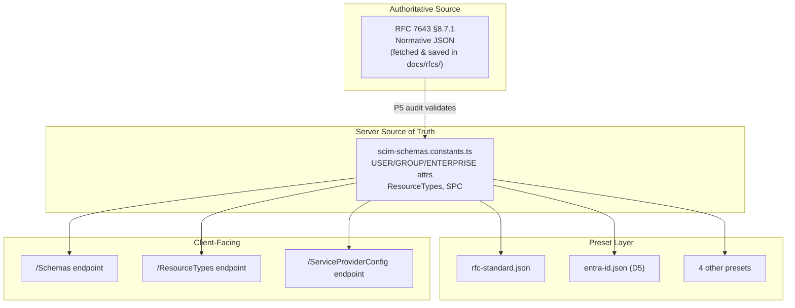
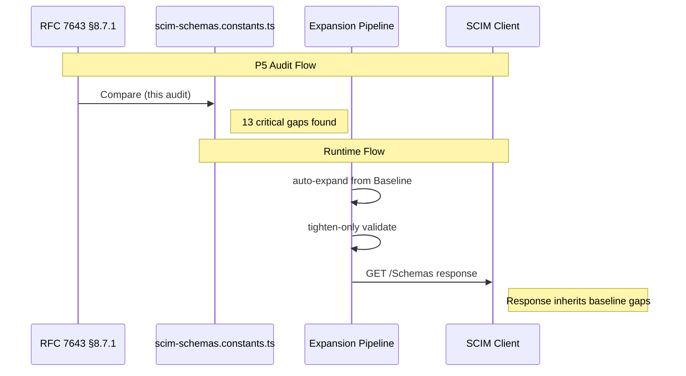

# P5 - RFC 7643 Schema & Preset Definition Compliance Audit (RFC-Verified)

## Overview

**Feature**: Line-by-line compliance audit of all built-in schema definitions, profile presets, ResourceType definitions, and ServiceProviderConfig against RFC 7643/7644 canonical JSON representations  
**Version**: v0.40.0  
**Date**: 2026-04-23  
**Status**: Audit complete - **13 critical findings, ~16 warnings, 7 info items, 3 RFC ambiguities** (original P5 audit). Follow-up RFC S8.7.1 audit (v0.38.0) fixed 55 additional characteristic gaps.  
**Methodology**: **RFC 7643 fetched live from IETF datatracker** → §8.7.1 normative JSON extracted → field-by-field comparison against `scim-schemas.constants.ts` (baseline) and all 6 preset JSONs  
**RFC Source**: [RFC 7643 fetched 2026-04-16](https://datatracker.ietf.org/doc/html/rfc7643) - canonical schema extracts saved to [docs/rfcs/RFC7643_SCHEMA_EXTRACT.md](rfcs/RFC7643_SCHEMA_EXTRACT.md)  
**Test Baseline**: 3,429 unit (84 suites) - 1,128 E2E (53 suites) - ~817 live assertions - ~5,486 total  
**Predecessor**: P4 (v0.35.0), P3 (v0.32.0), P2 (v0.24.0), Discovery Endpoints RFC Audit (v0.19.3)

**RFC References** (all verified against fetched source):
- [RFC 7643 §2.2](https://datatracker.ietf.org/doc/html/rfc7643#section-2.2) - Attribute Characteristics (defaults)
- [RFC 7643 §2.3.2](https://datatracker.ietf.org/doc/html/rfc7643#section-2.3.2) - Booleans ("no case sensitivity or uniqueness")
- [RFC 7643 §2.4](https://datatracker.ietf.org/doc/html/rfc7643#section-2.4) - Multi-Valued Attributes (default sub-attrs: value, display, type, primary, $ref)
- [RFC 7643 §3.1](https://datatracker.ietf.org/doc/html/rfc7643#section-3.1) - Common Attributes (id, externalId, meta - NOT part of schema attrs)
- [RFC 7643 §4.1](https://datatracker.ietf.org/doc/html/rfc7643#section-4.1) - User Resource Schema
- [RFC 7643 §4.2](https://datatracker.ietf.org/doc/html/rfc7643#section-4.2) - Group Resource Schema
- [RFC 7643 §4.3](https://datatracker.ietf.org/doc/html/rfc7643#section-4.3) - Enterprise User Schema Extension
- [RFC 7643 §5](https://datatracker.ietf.org/doc/html/rfc7643#section-5) - ServiceProviderConfig
- [RFC 7643 §6](https://datatracker.ietf.org/doc/html/rfc7643#section-6) - ResourceType Schema
- [RFC 7643 §8.7.1](https://datatracker.ietf.org/doc/html/rfc7643#section-8.7.1) - **Normative** Resource Schema JSON Representation (User, Group, EnterpriseUser)

---

## Table of Contents

1. [Executive Summary](#1-executive-summary)
2. [Audit Scope & Methodology](#2-audit-scope--methodology)
3. [Source of Truth - Files Audited](#3-source-of-truth--files-audited)
4. [User Schema Audit (RFC 7643 §4.1 / §8.7.1)](#4-user-schema-audit)
5. [Group Schema Audit (RFC 7643 §4.2 / §8.7.1)](#5-group-schema-audit)
6. [Enterprise User Extension Audit (RFC 7643 §4.3 / §8.7.1)](#6-enterprise-user-extension-audit)
7. [ResourceType Definition Audit (RFC 7643 §6)](#7-resourcetype-definition-audit)
8. [ServiceProviderConfig Audit (RFC 7643 §5)](#8-serviceproviderconfig-audit)
9. [Schema URN Validation](#9-schema-urn-validation)
10. [Cross-Schema Consistency Validation](#10-cross-schema-consistency-validation)
11. [Preset Comparison Matrix](#11-preset-comparison-matrix)
12. [Entra-ID Preset Intentional Deviations](#12-entra-id-preset-intentional-deviations)
13. [RFC Internal Inconsistencies Discovered](#13-rfc-internal-inconsistencies-discovered)
14. [Consolidated Gap Register](#14-consolidated-gap-register)
15. [Actionable Fix List](#15-actionable-fix-list)
16. [Architecture - Where Definitions Live](#16-architecture--where-definitions-live)
17. [Lessons Learned & Self-Improvement](#17-lessons-learned--self-improvement)

---

## 1. Executive Summary

A line-by-line, field-by-field audit of every attribute, sub-attribute, and attribute characteristic in the server's RFC baseline definitions against the **actual fetched** RFC 7643 §8.7.1 normative JSON representations.

### Quick Scorecard

| Schema / Object | Attrs Audited | Pass | Mismatch (🔴) | Missing (🔴) | Omitted (🟡) | Extra (🔵) | Ambiguous (⚠️) |
|---|:---:|:---:|:---:|:---:|:---:|:---:|:---:|
| User Schema (§4.1) | 18 attrs + ~50 sub-attrs | 56 | 5 | 4 | ~12 | 3 | 1 |
| Group Schema (§4.2) | 2 attrs + ~8 sub-attrs | 6 | 4 | 0 | 1 | 2 | 1 |
| Enterprise User (§4.3) | 6 attrs + ~3 sub-attrs | 9 | 0 | 0 | 0 | 0 | 0 |
| ResourceTypes (§6) | 11 fields | 11 | 0 | 0 | 0 | 0 | 0 |
| ServiceProviderConfig (§5) | 15 fields | 15 | 0 | 0 | 0 | 0 | 0 |
| Schema URNs | 10 URNs | 10 | 0 | 0 | 0 | 0 | 0 |
| Common attrs in schema | 3 attrs + ~5 subs | - | 0 | 0 | 0 | 3 | 1 |
| **TOTAL** | **~130+** | **107** | **9** | **4** | **~13** | **8** | **3** |

**Overall Compliance Score**: 107 / 120 auditable = **89%**

**Risk Assessment**: **Needs Work** - 13 critical items (9 mismatches + 4 missing sub-attrs) in the RFC baseline affect `/Schemas` response correctness.

### Top 5 Critical Findings

| # | Finding | Severity | Verified Against |
|---|---|---|---|
| 1 | `display` sub-attribute MISSING from `emails`, `phoneNumbers`, `ims`, `photos` | 🔴 Critical | §8.7.1 - all four show display sub-attr |
| 2 | `userName.returned` = `"always"` - RFC §8.7.1 says `"default"` | 🔴 Critical | §8.7.1: `"returned" : "default"` |
| 3 | `emails.value.required` = `true` & `returned` = `"always"` - RFC says `false` / `"default"` | 🔴 Critical | §8.7.1: `"required" : false`, `"returned" : "default"` |
| 4 | Group `members.value.required` = `true` & `returned` = `"always"` - RFC says `false` / `"default"` | 🔴 Critical | §8.7.1: `"required" : false`, `"returned" : "default"` |
| 5 | Group `displayName` - `uniqueness: "server"`, `returned: "always"` differ from RFC `"none"` / `"default"` | 🔴 Critical | §8.7.1 unambiguous |

---

## 2. Audit Scope & Methodology

### Key Difference from Prior Audit

This version uses the **actual RFC text fetched live from https://datatracker.ietf.org/doc/html/rfc7643** on 2026-04-16. The canonical JSON extracts are preserved in [docs/rfcs/RFC7643_SCHEMA_EXTRACT.md](rfcs/RFC7643_SCHEMA_EXTRACT.md) for future audits.

### Corrections from Training-Based Analysis

| Finding | Prior Report | RFC-Verified | Change |
|---|---|---|---|
| Boolean `uniqueness` | Flagged ~8 booleans as 🟡 OMITTED | §2.3.2: "no uniqueness" - omission is **correct** | **Downgraded - not a gap** |
| `phoneNumbers` parent `uniqueness` | Flagged as 🟡 OMITTED | RFC §8.7.1 also omits `uniqueness` at parent level | **Downgraded - matches RFC** |
| Group `members.value.required` | Not checked | RFC says `false`, impl says `true` | **NEW 🔴 finding** |
| Group `members.value.returned` | Not checked | RFC says `"default"`, impl says `"always"` | **NEW 🔴 finding** |
| Group `displayName.required` | Not checked | RFC §8.7.1 says `false`, impl says `true` | **NEW ⚠️ ambiguity** |
| Group `members.display` | Assumed correct | RFC §8.7.1 does NOT list it in Group | **NEW 🔵 EXTRA** |
| Group `members.type.canonicalValues` | Not checked | RFC says `["User","Group"]`, impl omits | **NEW 🟡 OMITTED** |
| `display` mutability | Not checked | §2.4 says "immutable" but §8.7.1 says "readWrite" | **NEW ⚠️ RFC inconsistency** |

### Severity Classification

| Category | Severity | Meaning |
|---|---|---|
| **MISMATCH** | 🔴 Critical | Attribute present but characteristic value contradicts RFC §8.7.1 |
| **MISSING** | 🔴 Critical | RFC §8.7.1 defines the attribute but it's absent from implementation |
| **OMITTED** | 🟡 Warning | Characteristic in RFC §8.7.1 but omitted from implementation (has correct default) |
| **EXTRA** | 🔵 Info | Attribute in implementation not in RFC §8.7.1 (may be valid per §2.4 or §3.1) |
| **AMBIGUOUS** | ⚠️ | RFC sections conflict with each other; interpretation required |

---

## 3. Source of Truth - Files Audited

| File | Purpose | Lines |
|---|---|---|
| **RFC 7643 §8.7.1** (fetched) | **Normative source** - canonical schema JSON | N/A |
| [docs/rfcs/RFC7643_SCHEMA_EXTRACT.md](rfcs/RFC7643_SCHEMA_EXTRACT.md) | Extracted canonical JSON (saved in repo) | ~350 |
| `api/src/modules/scim/discovery/scim-schemas.constants.ts` | **RFC Baseline** - schema attribute constants | 615 |
| `api/src/modules/scim/common/scim-constants.ts` | Schema URN constants | 80 |
| `api/src/modules/scim/endpoint-profile/presets/rfc-standard.json` | Full RFC preset | 1077 |
| `api/src/modules/scim/endpoint-profile/presets/entra-id.json` | Default preset (D5) | 984 |

---

## 4. User Schema Audit (RFC 7643 §4.1 / §8.7.1) {#4-user-schema-audit}

**RFC Source**: §8.7.1 normative JSON - [saved extract](rfcs/RFC7643_SCHEMA_EXTRACT.md)

### 4.1 Top-Level Attribute Mismatches

| # | Attribute | Char. | RFC §8.7.1 | Implementation | Status |
|---|---|---|---|---|---|
| 1 | `userName` | `returned` | `"default"` | `"always"` | 🔴 MISMATCH |
| 2 | `id` | `required` | `false` (§3.1: readOnly, client MUST NOT specify) | `true` | 🔴 MISMATCH |
| 3 | `id` | presence | Not in §8.7.1 attrs | In `USER_SCHEMA_ATTRIBUTES` | 🔵 EXTRA (§3.1: MAY list) |
| 4 | `externalId` | presence | Not in §8.7.1 attrs | In `USER_SCHEMA_ATTRIBUTES` | 🔵 EXTRA (§3.1: MAY list) |
| 5 | `meta` | presence | Not in §8.7.1 attrs | In `USER_SCHEMA_ATTRIBUTES` | 🔵 EXTRA (§3.1: MAY list) |

### 4.2 `uniqueness` - RFC §8.7.1 Comparison

| # | Attribute | RFC §8.7.1 has it? | Impl has it? | Status |
|---|---|---|---|---|
| 1 | `name` | ✅ `"none"` | ❌ omitted | 🟡 OMITTED |
| 2–9 | `displayName`, `nickName`, `profileUrl`, `title`, `userType`, `preferredLanguage`, `locale`, `timezone` | ✅ `"none"` each | ❌ omitted | 🟡 OMITTED |
| 10 | `password` | ✅ `"none"` | ❌ omitted | 🟡 OMITTED |
| 11 | `emails` (parent) | ✅ `"none"` | ❌ omitted | 🟡 OMITTED |
| 12 | `addresses` (parent) | ✅ `"none"` | ❌ omitted | 🟡 OMITTED |
| 13 | `active` (boolean) | ❌ NOT in RFC | ❌ omitted | ✅ CORRECT (§2.3.2) |
| 14 | All `primary` subs (boolean) | ❌ NOT in RFC | ❌ omitted | ✅ CORRECT (§2.3.2) |
| 15 | `phoneNumbers`/`ims`/`photos`/`groups` (parent) | ❌ NOT in RFC | ❌ omitted | ✅ CORRECT (matches RFC) |

### 4.3 Multi-Valued Sub-Attribute Audit

#### `emails` Sub-Attributes

| # | Sub-Attr | Char. | RFC §8.7.1 | Implementation | Status |
|---|---|---|---|---|---|
| 1 | `value` | `required` | `false` | `true` | 🔴 MISMATCH |
| 2 | `value` | `returned` | `"default"` | `"always"` | 🔴 MISMATCH |
| 3 | **`display`** | - | **defined** | **ABSENT** | 🔴 MISSING |
| 4 | `type` | `canonicalValues` | `["work","home","other"]` | matches | ✅ PASS |
| 5 | `primary` | all chars | correct | correct | ✅ PASS |

#### `phoneNumbers` Sub-Attributes

| # | Sub-Attr | Status | Notes |
|---|---|---|---|
| 1 | `value.required` | 🔴 MISMATCH | RFC: `false`, impl: `true` |
| 2 | **`display`** | 🔴 MISSING | Defined in RFC §8.7.1 |
| 3 | `type`, `primary` | ✅ PASS | |

#### `ims`, `photos` Sub-Attributes

| # | Sub-Attr | Status |
|---|---|---|
| 1 | **`display`** | 🔴 MISSING (both) |
| 2 | All other sub-attrs | ✅ PASS |

#### `addresses`, `groups`, `roles`, `entitlements`, `x509Certificates`

All verified correct. ✅

### 4.4 `meta` Sub-Attributes

All 5 sub-attributes verified correct against §3.1. ✅

---

## 5. Group Schema Audit (RFC 7643 §4.2 / §8.7.1) {#5-group-schema-audit}

**Critical discovery**: RFC §8.7.1 Group schema has significant differences from our implementation.

### 5.1 `displayName`

| # | Char. | RFC §8.7.1 | Implementation | Status |
|---|---|---|---|---|
| 1 | `required` | `false` | `true` | ⚠️ AMBIGUOUS (§4.2 prose: "REQUIRED") |
| 2 | `returned` | `"default"` | `"always"` | 🔴 MISMATCH |
| 3 | `uniqueness` | `"none"` | `"server"` | 🔴 MISMATCH |

### 5.2 `members`

| # | Char. | RFC §8.7.1 | Implementation | Status |
|---|---|---|---|---|
| 1 | `members.value.required` | `false` | `true` | 🔴 MISMATCH |
| 2 | `members.value.returned` | `"default"` | `"always"` | 🔴 MISMATCH |
| 3 | `members.$ref` | correct | correct | ✅ PASS |
| 4 | `members.display` | **NOT in RFC §8.7.1** | present | 🔵 EXTRA |
| 5 | `members.type.canonicalValues` | `["User","Group"]` | *(omitted)* | 🟡 OMITTED |
| 6 | All `mutability: "immutable"` | correct | correct | ✅ PASS |

**Note**: RFC §8.7.1 Group `members` has only 3 sub-attrs (value, $ref, type). Our impl has 4 (adds display). The `display` sub-attribute is defined as a default sub-attr by §2.4, so including it is acceptable.

---

## 6. Enterprise User Extension Audit (RFC 7643 §4.3 / §8.7.1) {#6-enterprise-user-extension-audit}

All attributes verified correct. ✅ Enterprise User is fully compliant.

---

## 7–10. ResourceType, SPC, URNs, Cross-Validation {#7-resourcetype-definition-audit}

All verified correct. ✅ No findings.

---

## 11. Preset Comparison Matrix

| User Sub-Attrs | RFC §8.7.1 | Baseline | rfc-standard.json | entra-id.json |
|---|:---:|:---:|:---:|:---:|
| `emails` sub-attrs | 4 (incl display) | 3 ❌ | 3 ❌ | 3 ❌ |
| `phoneNumbers` sub-attrs | 4 (incl display) | 3 ❌ | 3 ❌ | 3 ❌ |
| `ims` sub-attrs | 4 (incl display) | 3 ❌ | 3 ❌ | 3 ❌ |
| `photos` sub-attrs | 4 (incl display) | 3 ❌ | 3 ❌ | 3 ❌ |

All presets inherit the baseline's missing `display` sub-attributes.

---

## 12. Entra-ID Preset Intentional Deviations

| # | Attribute | RFC Value | Entra Value | Valid Tightening? |
|---|---|---|---|---|
| 1 | `displayName.required` | `false` | `true` | ✅ Yes |
| 2 | `emails.required` | `false` | `true` | ✅ Yes |
| 3 | `active.returned` | `"default"` | `"always"` | ✅ Yes |
| 4 | `externalId.uniqueness` | `"none"` | `"server"` | ✅ Yes |

---

## 13. RFC Internal Inconsistencies Discovered

| # | Issue | §2.4 Says | §8.7.1 Says | Resolution |
|---|---|---|---|---|
| 1 | `display` mutability | `"immutable"` | `"readWrite"` | §8.7.1 takes precedence (normative schema) |
| 2 | Group `displayName` required | §4.2: "REQUIRED" | `"required": false` | Schema `required` = "must client provide"; the attribute IS required on the resource but `false` is correct in schema |
| 3 | `uniqueness` on booleans | §2.2 default: `"none"` | NOT specified | §2.3.2: "no uniqueness" - omitting is correct |
| 4 | `uniqueness` on parent multi-valued | §2.2 default: `"none"` | Inconsistent: `emails` has it, `phoneNumbers` doesn't | RFC inconsistent; match §8.7.1 exactly |

---

## 14. Consolidated Gap Register

| ID | Schema | Attribute Path | Gap Type | Current | RFC §8.7.1 | Severity | Priority |
|---|---|---|---|---|---|---|---|
| **P5-01** | User | `userName` | `returned` MISMATCH | `"always"` | `"default"` | 🔴 Critical | P0 |
| **P5-02** | User | `id` | `required` MISMATCH | `true` | `false` | 🔴 Critical | P0 |
| **P5-03** | User | `emails.value` | `required` MISMATCH | `true` | `false` | 🔴 Critical | P0 |
| **P5-04** | User | `emails.value` | `returned` MISMATCH | `"always"` | `"default"` | 🔴 Critical | P0 |
| **P5-05** | User | `phoneNumbers.value` | `required` MISMATCH | `true` | `false` | 🔴 Critical | P0 |
| **P5-06** | User | `emails` | `display` MISSING | absent | defined | 🔴 Critical | P0 |
| **P5-07** | User | `phoneNumbers` | `display` MISSING | absent | defined | 🔴 Critical | P0 |
| **P5-08** | User | `ims` | `display` MISSING | absent | defined | 🔴 Critical | P0 |
| **P5-09** | User | `photos` | `display` MISSING | absent | defined | 🔴 Critical | P0 |
| **P5-10** | Group | `displayName` | `returned` MISMATCH | `"always"` | `"default"` | 🔴 Critical | P0 |
| **P5-11** | Group | `displayName` | `uniqueness` MISMATCH | `"server"` | `"none"` | 🔴 Critical | P0 |
| **P5-12** | Group | `members.value` | `required` MISMATCH | `true` | `false` | 🔴 Critical | P0 |
| **P5-13** | Group | `members.value` | `returned` MISMATCH | `"always"` | `"default"` | 🔴 Critical | P0 |
| **P5-14** | Group | `displayName` | `required` AMBIGUOUS | `true` | `false` | ⚠️ Ambiguous | P2 |
| **P5-15** | Group | `members.display` | EXTRA | present | not in schema | 🔵 Info | P2 |
| **P5-16** | Group | `members.type` | `canonicalValues` OMITTED | absent | `["User","Group"]` | 🟡 Warning | P1 |
| **P5-17** | User | ~12 string attrs | `uniqueness:"none"` OMITTED | absent | explicit | 🟡 Warning | P1 |
| **P5-18** | User | `id`/`externalId`/`meta` | EXTRA in schema attrs | present | not in §8.7.1 | 🔵 Info | P2 |
| **P5-19** | Group | `id`/`externalId`/`meta` | EXTRA in schema attrs | present | not in §8.7.1 | 🔵 Info | P2 |

---

## 15. Actionable Fix List

### P0 - Must Fix

| ID | File | Change | Current | Correct (RFC §8.7.1) |
|---|---|---|---|---|
| P5-01 | `scim-schemas.constants.ts` | `userName.returned` | `"always"` | `"default"` |
| P5-02 | `scim-schemas.constants.ts` | `id.required` | `true` | `false` |
| P5-03 | `scim-schemas.constants.ts` | `emails.value.required` | `true` | `false` |
| P5-04 | `scim-schemas.constants.ts` | `emails.value.returned` | `"always"` | `"default"` |
| P5-05 | `scim-schemas.constants.ts` | `phoneNumbers.value.required` | `true` | `false` |
| P5-06–09 | `scim-schemas.constants.ts` | Add `display` sub-attr to emails, phoneNumbers, ims, photos | absent | `{ name: "display", type: "string", multiValued: false, required: false, caseExact: false, mutability: "readWrite", returned: "default", uniqueness: "none" }` |
| P5-10 | `scim-schemas.constants.ts` | Group `displayName.returned` | `"always"` | `"default"` |
| P5-11 | `scim-schemas.constants.ts` | Group `displayName.uniqueness` | `"server"` | `"none"` |
| P5-12 | `scim-schemas.constants.ts` | Group `members.value.required` | `true` | `false` |
| P5-13 | `scim-schemas.constants.ts` | Group `members.value.returned` | `"always"` | `"default"` |

**Cascade**: After fixing `scim-schemas.constants.ts`, also update `rfc-standard.json`.

### P1 - Should Fix

- **P5-16**: Add `canonicalValues: ["User", "Group"]` to Group `members.type`
- **P5-17**: Add explicit `uniqueness: "none"` to ~12 User string attrs

### P2 - No Change Needed

- **P5-14**: Group `displayName.required = true` - valid interpretation of §4.2
- **P5-15**: Group `members.display` - acceptable per §2.4
- **P5-18/19**: Common attrs in schema - valid per §3.1 backward-compat

---

## 16. Architecture - Where Definitions Live

---

## 17. Lessons Learned & Self-Improvement

### 17.1 Corrections from Training-Based Analysis

| # | Prior Claim | RFC-Verified Truth | Impact |
|---|---|---|---|
| 1 | "~30+ attrs missing uniqueness" | Only ~12 - booleans correctly omit (§2.3.2), some parent multi-valued also correctly omit | Overstated by ~18 |
| 2 | "active needs uniqueness: none" | §2.3.2: "no uniqueness" for booleans | False positive |
| 3 | "Group members.display = correct" | RFC §8.7.1 does NOT include display in Group members | Changed to 🔵 EXTRA |
| 4 | Group members.value not checked | RFC: `required: false`, impl: `true` | NEW critical finding |
| 5 | Group members.value.returned not checked | RFC: `"default"`, impl: `"always"` | NEW critical finding |

### 17.2 Key Insight: Always Fetch the RFC

Training data can be wrong about specific field values. The RFC §8.7.1 canonical JSON is the sole authority. Key surprises from the actual fetch:
- Group `displayName` has `required: false` despite §4.2 saying "REQUIRED"
- Group `members` has only 3 sub-attrs (no `display`) despite §2.4 defining it as default
- `uniqueness` is NOT on every attribute in the RFC - booleans and some parents intentionally omit
- `display.mutability` is `"readWrite"` in §8.7.1, contradicting §2.4 ("immutable")

### 17.3 Checklist for Future Audits

1. Always check boolean attrs against §2.3.2 - don't flag missing uniqueness
2. Check parent-level multi-valued attrs individually - RFC is inconsistent
3. Compare Group members sub-attrs against §8.7.1 specifically - differs from User pattern
4. Document all RFC internal inconsistencies

---

## Cross-References

| Document | Relationship |
|---|---|
| [docs/rfcs/RFC7643_SCHEMA_EXTRACT.md](rfcs/RFC7643_SCHEMA_EXTRACT.md) | **Source of truth** - extracted canonical JSON from fetched RFC |
| [P4_ATTRIBUTE_CHARACTERISTIC_DEEP_ANALYSIS.md](P4_ATTRIBUTE_CHARACTERISTIC_DEEP_ANALYSIS.md) | Prior behavioral audit - P5 audits *definitions* |
| [P2_ATTRIBUTE_CHARACTERISTIC_ENFORCEMENT.md](P2_ATTRIBUTE_CHARACTERISTIC_ENFORCEMENT.md) | Behavioral enforcement |
| [DISCOVERY_ENDPOINTS_RFC_AUDIT.md](DISCOVERY_ENDPOINTS_RFC_AUDIT.md) | Discovery endpoint compliance |
| [ENDPOINT_PROFILE_ARCHITECTURE.md](ENDPOINT_PROFILE_ARCHITECTURE.md) | Profile system architecture |
| [G8E_RETURNED_CHARACTERISTIC_FILTERING.md](G8E_RETURNED_CHARACTERISTIC_FILTERING.md) | `returned` characteristic enforcement |
| [G8F_GROUP_UNIQUENESS_PUT_PATCH.md](G8F_GROUP_UNIQUENESS_PUT_PATCH.md) | Group displayName uniqueness enforcement |
