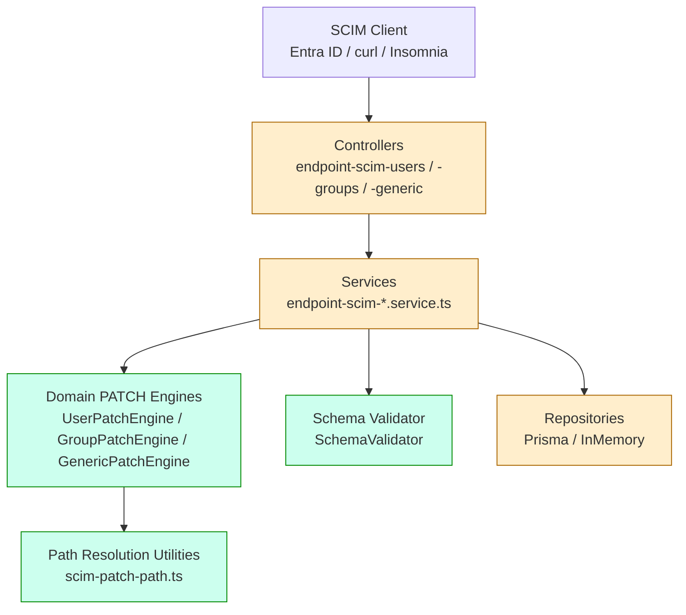
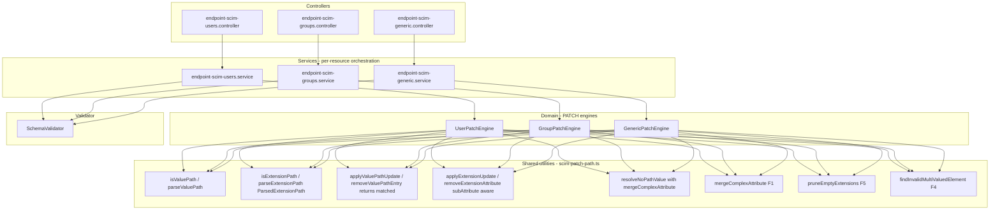
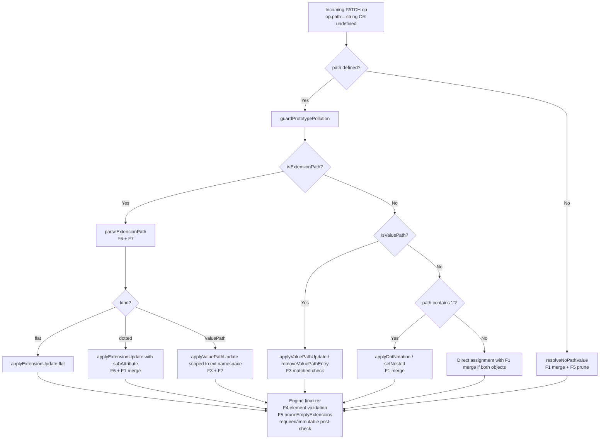

# PATCH Null Handling - RFC Compliance Deep Dive and Systematic Fix

## Overview

**Feature**: RFC 7644 §3.5.2 + RFC 7643 §2.2 + §7 null-value semantics for SCIM PATCH operations
**Branch**: `feat/patch-null-handling-rfc-compliance` (off `master` v0.52.0-alpha.4)
**Status**: Planning / TDD red phase
**RFC References**:
- [RFC 7644 §3.5.2 - Modifying with PATCH](https://datatracker.ietf.org/doc/html/rfc7644#section-3.5.2)
- [RFC 7644 §3.10 - Attribute Notation](https://datatracker.ietf.org/doc/html/rfc7644#section-3.10)
- [RFC 7643 §2.2 - Attribute Characteristics](https://datatracker.ietf.org/doc/html/rfc7643#section-2.2)
- [RFC 7643 §2.4 - Multi-Valued Attributes](https://datatracker.ietf.org/doc/html/rfc7643#section-2.4)
- [RFC 7643 §3.3 - Resource Type Extensions](https://datatracker.ietf.org/doc/html/rfc7643#section-3.3)
- [RFC 7643 §7 - Service Provider Configuration Compliance](https://datatracker.ietf.org/doc/html/rfc7643#section-7)
- [RFC 6902 - JSON Patch (referenced as base by RFC 7644)](https://datatracker.ietf.org/doc/html/rfc6902)

### Why this matters

The dominant SCIM client deployed against this server today is Microsoft Entra ID. Entra heavily uses `null` to signal de-provisioning intent across many surfaces: clearing a user's manager, clearing a work email, clearing all group members, etc. RFC 7644 §3.5.2 is intentionally ambiguous on `null` semantics in several places, so SCIM servers diverge in practice. A `replace path=name value={familyName:null}` on one server clears `familyName` and preserves the rest of `name`; on another it whole-replaces `name` and silently nukes `givenName` and `formatted`. We are currently the second kind for several operation shapes - confirmed by a 19-case live test matrix run against the production `OpenText-new-May-22-ProxyAddresses-list-ISV-3` endpoint (2026-05-27 baseline: 13/19 passing, 6 RFC-compliance gaps).

This document is the systematic RCA, design, and execution plan to make the SCIMServer's PATCH null handling uniformly RFC-compliant AND Entra-interop-correct across all six dimensions: core attributes, extension attributes, custom resource type attributes, all five path shapes (RFC 7644 §3.10), all three verbs (add / replace / remove), and both backends (Prisma + InMemory).

## Table of contents

1. [Problem statement and live evidence](#problem-statement-and-live-evidence)
2. [RFC interpretation](#rfc-interpretation)
3. [Current architecture audit](#current-architecture-audit)
4. [Findings: nine null-handling gaps](#findings-nine-null-handling-gaps)
5. [Design: F1-F8 with decision rationale](#design-f1-f8-with-decision-rationale)
6. [Target architecture](#target-architecture)
7. [Path resolution decision tree](#path-resolution-decision-tree)
8. [Data flow walkthroughs](#data-flow-walkthroughs)
9. [Implementation plan](#implementation-plan)
10. [Test plan](#test-plan)
11. [Quality gate plan](#quality-gate-plan)
12. [Risk assessment and BC impact](#risk-assessment-and-bc-impact)
13. [Rollback plan](#rollback-plan)
14. [Out of scope and rationale](#out-of-scope-and-rationale)
15. [Cross-references](#cross-references)

---

## Problem statement and live evidence

On 2026-05-27 a 19-case PATCH null-handling test matrix was executed against the prod endpoint `OpenText-new-May-22-ProxyAddresses-list-ISV-3` (`128f64b5-ffb5-41f2-9ba2-c874f5ea7335`). Script: [scripts/null-patch-test.ps1](../scripts/null-patch-test.ps1).

Result: **13 of 19 passed**. Of the six failures plus one "pass-with-caveat," three are highest-impact (Entra interop blockers) and the rest are RFC-compliance gaps that produce silent data corruption or silent no-ops.

| Verb / shape | Live test | Expected | Actual | Severity |
|---|---|---|---|---|
| `replace path=name value={familyName:null, givenName:"X"}` | T11 | merge: familyName cleared, formatted kept | **whole-replace**: formatted=null too | **CRITICAL - Entra interop** |
| Path-less `{value:{name:{familyName:null}}}` | T08 | merge: familyName cleared, givenName/formatted kept | **whole-replace**: givenName=null, formatted=null | **CRITICAL - Entra interop** |
| `replace path=members value=null` (Group) | T15 | 2xx, members emptied | **400 invalidValue** | **CRITICAL - Entra deprovisioning** |
| `remove path=members` (Group, bare, no value) | T16 | 2xx, members emptied (RFC §3.5.2.2 ex.3) | **400** (flag-gated) | HIGH - documented but unaligned with RFC default |
| `remove path=emails[type eq "x"]` no match | T06 | 400 noTarget (RFC §3.5.2.2 MUST) | **200 silent no-op** | HIGH - RFC MUST violation |
| `replace path=id value=null` (readOnly) | T03 | 400 mutability *or* silent ignore (RFC §7 SHOULD) | 200 silent | LOW - RFC-conformant but UX-confusing |
| `add value=[null]` (multi-valued element) | T18 | 400 invalidValue | **200 silent accept** | HIGH - silent data corruption |
| `add path=title value=null` | T07 | 400 invalidValue *or* no-op (ambiguous) | 200 silent | LOW - permissive |
| `replace urn:...:enterprise:User:manager value=null` then re-read schemas[] | T12 | manager cleared **AND** URN ideally removed from schemas[] (RFC §3.3 SHOULD) | manager cleared, URN persists | MEDIUM - SHOULD violation |

Tests that passed correctly: T01 nickName null clear, T02 userName-null rejected, T04 emails bare clear, T05 filtered sub-attr clear with entry preservation, T09 complex parent null clear, T10 sub-attr null clear, T13 empty-string vs null distinction, T14 members[X].value=null rejected, T17 remove-with-filter + stray value ignored, T19 opentext proxyAddresses list cleared.

## RFC interpretation

### 7644 §3.5.2 verb-by-verb null semantics

| Verb | RFC text on `value` | Null interpretation |
|---|---|---|
| `add` | §3.5.2.1: "if the target location does not exist, attribute and value are added; if exists, value is replaced" | **`null` is not a legal addend**. SHOULD reject `400 invalidValue`. Spec ambiguous. |
| `remove` | §3.5.2.2: `value` is omitted; `path` is required | `value` is irrelevant. If client sends `value:null` it MUST be ignored. |
| `replace` | §3.5.2.3: "target location's value(s) is replaced" | `null` means **unassign** the target. Functionally equivalent to `remove` on the same path, subject to the same characteristic checks. This is the only verb where `null` has a well-defined semantic. |

### Critical normative statements

| RFC anchor | Requirement | Status in our server |
|---|---|---|
| §3.5.2 | Unknown attribute SHALL produce `400 invalidPath` | ✅ already enforced |
| §3.5.2 | readOnly + write attempt: server SHALL ignore OR fail `400` (operator's choice) | ✅ silent-ignore today (RFC-conformant) |
| §3.5.2.2 | `noTarget` on filter that matches zero entries (MUST) | ❌ **F3** - currently silent no-op |
| §3.5.2.3 | Complex attribute `value`: "a set of sub-attributes SHALL be specified in the value parameter" | ⚠️ silent on merge-vs-whole-replace. **F1** picks merge per Entra de-facto. |
| §3.10 | `attrPath = [URI ":"] ATTRNAME *1subAttr; subAttr = "." ATTRNAME` | ❌ **F6** - extension dotted paths stored as literal flat keys |
| §3.10 | `valuePath = attrPath "[" valFilter "]"` and may be URI-prefixed | ❌ **F7** - extension valuePaths stored as literal flat keys |
| 7643 §2.4 | Multi-valued sub-attrs follow their schema's required/uniqueness | ❌ **F4** - `[null]` elements accepted silently |
| 7643 §3.3 | Extension is "in use" only if any attribute is assigned | ❌ **F5** - empty extension namespaces persist with URN in `schemas[]` |
| 7643 §7 | Required attribute cannot be unassigned by PATCH | ✅ enforced via per-attr extractors + post-PATCH `validatePayloadSchema` |
| 7643 §7 | Immutable attribute after initial set MUST NOT be modified | ✅ enforced via `checkImmutableAttributes` post-PATCH |
| 7643 §7 | Server MAY enforce uniqueness/mutability stricter than advertised | ✅ tighten-only policy |

### Microsoft Entra ID de-facto contract

Even though 7644 is ambiguous on complex-parent replace, the dominant client behavior we must accommodate:

| Entra sends | What Entra expects |
|---|---|
| `{op:"Replace", path:"name", value:{familyName:"New"}}` | Merge: only update familyName, preserve other name sub-attrs |
| Path-less `{op:"Replace", value:{name:{familyName:null}, active:false}}` | Merge: clear familyName, preserve siblings, also deprovision |
| `{op:"Replace", path:"emails[type eq \"work\"].value", value:null}` | Clear the value sub-attr, keep entry |
| `{op:"Replace", path:"members", value:null}` (Group) | Empty the group |
| `{op:"Remove", path:"emails[type eq \"work\"]"}` | Drop the work email entry |
| `{op:"Replace", path:"urn:...:enterprise:User:manager", value:null}` | Clear manager AND (ideally) drop extension URN from schemas[] |

The Entra contract aligns with the merge interpretation; whole-replace causes silent data loss.

## Current architecture audit

### Layered view



### Engine ownership matrix

| Resource type | PATCH engine | Status today | Required changes |
|---|---|---|---|
| User (core + extensions) | `UserPatchEngine` | Rich path support: simple, dotted, valuePath, extension URN, no-path | F1, F3, F4, F5, F6, F7 wiring (F2 is Group-specific) |
| Group (core + members + extensions) | `GroupPatchEngine` | Specialized for `members` array management | F1, F2, F3, F4, F5, F6, F7 wiring |
| Custom resource types | `GenericPatchEngine` | Simplified: no valuePath, hand-rolled `setAtPath`/`setNested`, no merge semantics, no element validation | F1, F3, F4, F5, F6, F7 by refactor to share utilities; F8 |

## Findings: nine null-handling gaps

Consolidating live evidence + RFC analysis + source code RCA. Each links to its fix.

| # | Description | RFC reference | Severity | Fix |
|---|---|---|---|---|
| G1 | `replace path=<complex>` whole-replaces instead of merging sub-attrs | §3.5.2.3 (ambiguous; Entra de-facto = merge) | CRITICAL | F1 |
| G2 | Path-less `replace` with nested complex object whole-replaces | §3.5.2.3 + Entra | CRITICAL | F1 |
| G3 | `replace path=members value=null` on Group rejected | §3.5.2.3 | CRITICAL | F2 |
| G4 | `remove`/`replace` on `<multi>[<filter>]` with zero matches silently no-ops | §3.5.2.2 MUST `noTarget` | HIGH | F3 |
| G5 | Multi-valued add/replace with `[null]` element silently accepted | §3.5.2.1 + 7643 §2.4 | HIGH | F4 |
| G6 | Empty extension namespace persists in payload and schemas[] | 7643 §3.3 SHOULD | MEDIUM | F5 |
| G7 | Extension dotted path `urn:...:User:manager.displayName` stored as literal key | 7644 §3.10 syntax | HIGH (silent null-clear failure) | F6 |
| G8 | Extension valuePath `urn:...:Mailbox:proxyAddresses[type eq "x"]` stored as literal key | 7644 §3.10 syntax + §3.5.2.2 noTarget | HIGH | F7 |
| G9 | `GenericPatchEngine` (custom resource types) has all of G1-G8 plus no valuePath support | All of the above | HIGH (parity gap) | F8 |

(Live tests T03 readOnly silent-ignore, T07 add:null silent-accept, T16 bare-remove flag default are listed separately as RFC-conformant policy choices below.)

## Design: F1-F8 with decision rationale

For each fix: root cause, options considered, pros/cons, chosen approach, code shape.

### F1 - Complex-parent merge with null-as-unset (G1, G2)

**Root cause**
- `user-patch-engine.applyAddOrReplace`, single-segment path with object value: `rawPayload = { ...rawPayload, [originalPath]: value }` is a whole-replace.
- `scim-patch-path.resolveNoPathValue`, plain-key branch: `rawPayload[key] = value` is a whole-replace.

**Options considered**

| Option | Pros | Cons |
|---|---|---|
| (A) Whole-replace (status quo) | Literal RFC reading; deterministic | Silent data loss on every Entra PATCH; not Entra-interop-correct |
| (B) RFC 7396 JSON Merge Patch (recursive null-as-delete, recursive object-as-merge) | Maximum interop; well-defined | RFC 7644 explicitly does not adopt RFC 7396; could surprise other RFC-strict clients |
| (C) **Single-level complex merge with null-as-unset** (chosen) | Matches Entra/Okta de-facto; preserves SCIM's "complex cannot contain complex" invariant; no recursion needed (RFC 7643 §2.3.8 forbids complex-in-complex); easy to test | Slight ambiguity vs. RFC literal text; one place where we exceed minimum RFC requirements |
| (D) Configurable via flag (whole-replace by default, merge opt-in) | Maximum back-compat | Doubles test surface; ships data loss for ops who don't know to flip the flag; spec-ambiguous default is worse than picking the safe interpretation |

**Decision: (C)**. Justification: RFC 7643 §2.3.8 says "A complex attribute MUST NOT contain sub-attributes that have sub-attributes (i.e., that are complex)." So single-level merge is the maximum recursion depth the spec ever needs us to do. This naturally aligns with Entra without going as far as full JSON Merge Patch.

**Code shape**

New helper exported from `scim-patch-path.ts`:

```typescript
export function mergeComplexAttribute(existing: unknown, incoming: unknown): unknown {
  // Both non-array objects -> shallow merge with null-as-unset
  // Otherwise -> whole-replace (handles primitive, null, array correctly)
}
```

Applied in:
- `resolveNoPathValue` plain-key branch (covers G2)
- `user-patch-engine.applyAddOrReplace` single-segment-with-object branch (covers G1)
- `group-patch-engine.handleReplace` no-path or whole-attr-with-object branch (parity)
- `applyExtensionUpdate` when target attribute is complex and incoming is object (covers G7 root case)

### F2 - `replace path=members value=null` explicit clear (G3)

**Root cause**
`group-patch-engine.handleReplace` strictly requires `Array.isArray(operation.value)` for `path=members` and throws `400 invalidValue` on null.

**Options considered**

| Option | Pros | Cons |
|---|---|---|
| (A) Always allow `null` to empty members (regardless of flag) | RFC-aligned; Entra-compatible; explicit unassign intent is unambiguous | Bypasses operator's intent if they set `PatchOpAllowRemoveAllMembers=false` as a "lock the group" safety |
| (B) **Always allow `null` for explicit unassign, keep flag governing only bare `remove path=members`** (chosen) | Matches the RFC intent: `replace:null` = unassign IS spec-defined, bare-remove of a multi-valued is the spec-ambiguous case | Slight policy nuance to document |
| (C) Gate `null` behind `PatchOpAllowRemoveAllMembers` too | Single flag governs all "empty the group" paths | Violates RFC: `replace:null` is unambiguous unassign per §3.5.2.3 |

**Decision: (B)**. The `PatchOpAllowRemoveAllMembers` flag's purpose is to prevent accidental group emptying via the spec-ambiguous bare `remove path=members` form. Explicit `replace:null` is not ambiguous and should always work.

### F3 - `noTarget` on zero-match valuePath filter (G4)

**Root cause**
`applyValuePathUpdate` and `removeValuePathEntry` in `scim-patch-path.ts` return the payload unchanged on no-match. Engines have no way to know.

**Options considered**

| Option | Pros | Cons |
|---|---|---|
| (A) Utilities throw `PatchError` directly | Single point of error; less ceremony at call sites | Cross-layer dependency: utility module imports `PatchError` from `domain/patch/` (upward dependency) |
| (B) **Discriminated return shape `{matched, payload}`** (chosen) | Pure utility stays pure; clean separation; engines own error vocabulary | Minor BC change in utility signature; spec file updates |
| (C) Optional `throwOnNoMatch` parameter | Most BC-friendly | Hacky; spreads control flow across boolean flag |

**Decision: (B)**. Engines own SCIM error vocabulary; utilities own path resolution. Clean separation. `addValuePathEntry` keeps single-return type because it deliberately creates on no-match (that's its documented behavior).

**Code shape**

```typescript
export interface ValuePathOpResult {
  matched: boolean;
  payload: Record<string, unknown>;
}

export function applyValuePathUpdate(...): ValuePathOpResult
export function removeValuePathEntry(...): ValuePathOpResult
```

Engines:
```typescript
const { matched, payload } = applyValuePathUpdate(rawPayload, vpParsed, value, caseExact);
if (!matched) {
  throw new PatchError(400, `Filter did not match any value in ${vpParsed.attribute}`, 'noTarget');
}
rawPayload = payload;
```

### F4 - Validate multi-valued array elements (G5)

**Root cause**
Engines assign `op.value` verbatim to the multi-valued attribute when value is an array. No per-element validation.

**Options considered**

| Option | Pros | Cons |
|---|---|---|
| (A) Push validation into `SchemaValidator.validatePatchOperationValue` only | Schema-driven, strict-mode-only | Strict mode is opt-in; non-strict endpoints (the majority) keep the bug |
| (B) **Engine-level guard via shared helper** (chosen) | Always runs regardless of strict mode; minimal helper | Two-layer validation - strict mode duplicates the check |
| (C) Both (A) and (B) | Most defensive | Real duplication; one is sufficient |

**Decision: (B)** plus close the `validatePatchOperationValue` early-return-on-null gap (F9 below). The engine-level guard rejects `null`/`undefined` array elements with `invalidValue`. Schema validator (strict mode) handles per-element type validation on top.

**Code shape**

```typescript
export function findInvalidMultiValuedElement(
  value: unknown,
): { index: number; reason: string } | null
```

Engines call this when `op.value` is an array and target is a multi-valued attribute.

### F5 - Prune empty extension namespaces (G6)

**Root cause**
After a PATCH clears the last attribute in an extension namespace, the namespace remains as `{}` in `rawPayload`. `stripNeverReturnedFromPayload` only prunes namespaces that became empty *because* its never-returned stripping emptied them, not namespaces that were already empty.

**Options considered**

| Option | Pros | Cons |
|---|---|---|
| (A) Extend `stripNeverReturnedFromPayload` to always delete empty extensions | Single helper, single call site | Conflates two concerns (never-returned filtering + lifecycle pruning) |
| (B) **New helper `pruneEmptyExtensions` called from engine finalizer** (chosen) | Single responsibility; obvious name; cheap to test | Adds one more helper |

**Decision: (B)**. Engines call `pruneEmptyExtensions(payload, extensionUrns)` at the end of `apply()`. `toScim*Resource` then rebuilds `schemas[]` from the (now-pruned) payload and the URN naturally drops out.

### F6 - Extension dotted path: `urn:...:User:manager.displayName` (G7)

**Root cause**
`parseExtensionPath` returns `{schemaUrn, attributePath}` where `attributePath` keeps the dot. `applyExtensionUpdate` then stores a key literally named `"manager.displayName"` in the extension namespace.

**Options considered**

| Option | Pros | Cons |
|---|---|---|
| (A) Detect `.` in `attributePath` in the parser, split into `{schemaUrn, attributePath, subAttribute}` | Centralized; matches RFC 7644 §3.10 grammar | Backwards-compat change to `ExtensionPathExpression` shape |
| (B) Handle the split at the call site in each engine | No utility-shape change | Duplicates logic across engines; encourages drift |

**Decision: (A)**. The grammar is owned by the parser; the engines should not re-parse.

**Code shape**

```typescript
export interface ExtensionPathExpression {
  schemaUrn: string;
  attributePath: string;
  subAttribute?: string;  // NEW - undefined for flat extension attr paths
}
```

`applyExtensionUpdate` and `removeExtensionAttribute` learn to handle `subAttribute` with the F1 merge semantics:
- `replace urn:...:User:manager.displayName value=null` -> deletes `manager.displayName` sub-attr, keeps siblings
- `replace urn:...:User:manager value={displayName:null}` -> same effect via F1 merge

### F7 - Extension valuePath: `urn:...:Mailbox:aliases[type eq "x"].value` (G8)

**Root cause**
Same parser limitation as F6 but for the bracket form.

**Options considered**

| Option | Pros | Cons |
|---|---|---|
| (A) Add `parseExtensionValuePath` that returns an extension-scoped `ValuePathExpression` | Discriminated parser surface | Two parsers to dispatch between |
| (B) **Extend `parseExtensionPath` to detect `[`, return a discriminated union** (chosen) | Single parser entry; one decision tree | Requires either a tagged union or two return shapes |
| (C) Detect in engines and call the existing valuePath utilities scoped to the extension namespace | Re-uses F3 machinery directly | Engines re-parse; duplication |

**Decision: (B)** as the public API but with a tagged-union return:

```typescript
export type ParsedExtensionPath =
  | { kind: 'flat'; schemaUrn: string; attributePath: string }
  | { kind: 'dotted'; schemaUrn: string; attributePath: string; subAttribute: string }
  | { kind: 'valuePath'; schemaUrn: string; valuePath: ValuePathExpression };
```

Engines dispatch on `kind`. For `valuePath`, engines call `applyValuePathUpdate` / `removeValuePathEntry` on the extension's namespace object instead of the root payload. F3's `matched=false -> noTarget` flows through unchanged.

### F8 - Custom resource type parity via shared utilities (G9)

**Root cause**
`GenericPatchEngine` has its own hand-rolled `setAtPath` / `setNested`. It supports dotted paths (via segment split) but has no merge semantics, no valuePath, no element validation, no namespace pruning.

**Options considered**

| Option | Pros | Cons |
|---|---|---|
| (A) Bug-for-bug parity: copy each fix into the generic engine independently | Most surgical | Triples maintenance cost; guarantees future drift |
| (B) **Delete the hand-rolled path resolver in GenericPatchEngine; delegate to the same `scim-patch-path` utilities User/Group already use** (chosen) | Single source of truth for path resolution; F1-F7 land for free; smaller codebase | Larger refactor scope; need careful test coverage to lock the refactor |
| (C) Extract a `BasePatchEngine` superclass that all three inherit from | Maximum DRY | Inheritance often the wrong tool for SCIM (each engine has resource-specific concerns); over-engineered |

**Decision: (B)**. The generic engine becomes a thin orchestrator around shared utilities, exactly like User/Group. The shared utility module is the single source of truth for the SCIM PATCH path/value algebra.

### F9 (related) - `SchemaValidator.validatePatchOperationValue` early-return on null

**Root cause**
`api/src/domain/validation/schema-validator.ts` line 239 and 291: `if (value === null || value === undefined) return;` skips ALL per-op validation when value is null. Required-attribute null replace doesn't fire the required check at the pre-PATCH layer - we rely on the post-PATCH `validatePayloadSchema` to catch it.

**Decision: leave as-is, document the contract**. Post-PATCH validation catches required-clearing in strict mode. The pre-PATCH validator's job is to catch invalid INCOMING values; `null` is a valid SCIM unassign signal, not an invalid value. Add a comment in `validatePatchOperationValue` explaining the contract.

### Policy choices (no code change)

| Live test | Policy | RFC anchor | Rationale |
|---|---|---|---|
| T03: readOnly silent-ignore on `replace:null` | Keep current silent-ignore + warnings header | 7643 §7 "SHALL ignore OR fail 400" | Either is conformant. Silent-ignore + warnings preserves BC; clients see the warning. Switching to 400 would break Entra clients that send `replace path=id value=null` as a "no-op clear" with other ops in the same PATCH body. |
| T07: `add:null` silent-accept | Document as permissive; consider rejecting in v0.53 with a flag | 7644 §3.5.2.1 ambiguous | Rejecting requires a new flag for BC, complexity outweighs the marginal correctness gain. |
| T16: `PatchOpAllowRemoveAllMembers` default `false` (strict-by-default) | Keep flag default `false`; document that F2's `replace:null` is the RFC-aligned Entra-interop path | 7644 §3.5.2.2 ex.3 permits | Strict-by-default prevents accidental group emptying via spec-ambiguous bare `remove`. F2 covers the explicit-null Entra path. |

## Target architecture

### Layered view (post-fix)



All three engines call into the **same** utility surface. F8 delivers this consolidation.

### Coverage matrix after F1-F8

| Concern | Core attrs | Extension attrs | Custom RT attrs |
|---|---|---|---|
| Single-value `replace:null` -> unassign | ✅ already | ✅ already (`applyExtensionUpdate.isEmptyScimValue`) | ✅ via F8 |
| Complex parent merge with null-as-unset | ✅ F1 | ✅ F1 + F6 | ✅ F1 + F8 |
| Multi-valued bare `replace:null` -> empty | ✅ already | ✅ already | ✅ via F8 |
| Multi-valued `[null]` element rejected | ✅ F4 | ✅ F4 | ✅ F4 + F8 |
| valuePath zero-match -> `noTarget` | ✅ F3 | ✅ F3 + F7 | ✅ F3 + F7 + F8 |
| Dotted sub-attr null clear | ✅ already | ✅ F6 | ✅ F6 + F8 |
| Path-less nested null clear | ✅ F1 | ✅ F1 (URN branch already merge-aware after F1) | ✅ F1 + F8 |
| Extension URN pruned from schemas[] | n/a | ✅ F5 | ✅ F5 + F8 |
| Group.members `replace:null` -> empty | n/a | n/a | n/a (Group-only via F2) |

## Path resolution decision tree

After F6/F7, the parser produces one of three discriminated shapes for any extension path, and there are five top-level path shapes:



## Data flow walkthroughs

### Walkthrough 1: Entra deprovision flow (F1 + F5 in action)

Request:
```json
PATCH /scim/endpoints/<id>/Users/<uid>
{
  "schemas": ["urn:ietf:params:scim:api:messages:2.0:PatchOp"],
  "Operations": [
    {
      "op": "Replace",
      "value": {
        "active": false,
        "name": { "familyName": null },
        "urn:ietf:params:scim:schemas:extension:enterprise:2.0:User": {
          "manager": null
        }
      }
    }
  ]
}
```

Pre-fix flow:
1. `UserPatchEngine.applyAddOrReplace` no-path branch handles `active` and `displayName` extraction OK.
2. `resolveNoPathValue` for `name` falls into the plain-key branch: `rawPayload.name = {familyName: null}` - **whole-replace**, `givenName` and `formatted` are gone.
3. `resolveNoPathValue` for URN key: spread merge `{...existing, ...value}` sets `enterprise.manager = null` literally.
4. Post-PATCH the response shows `name` reduced to `{}` (or `{familyName: null}`) and enterprise URN still in `schemas[]` with `manager: null` inside.

Post-fix flow:
1. Same.
2. `resolveNoPathValue` plain-key branch calls `mergeComplexAttribute(rawPayload.name, {familyName: null})` -> merges with null-as-unset. Result: `name = {givenName, formatted}`, familyName deleted.
3. `resolveNoPathValue` URN-key branch (extended) calls `mergeComplexAttribute` on each sub-key. `manager: null` -> deletes manager from extension namespace. Extension becomes `{}`.
4. Engine finalizer calls `pruneEmptyExtensions` -> deletes the empty extension key. `toScim*Resource` rebuilds `schemas[]` without it.

### Walkthrough 2: Extension dotted sub-attribute clear (F6 + F1 in action)

Request:
```json
PATCH /scim/endpoints/<id>/Users/<uid>
{
  "schemas": ["urn:ietf:params:scim:api:messages:2.0:PatchOp"],
  "Operations": [
    {
      "op": "Replace",
      "path": "urn:ietf:params:scim:schemas:extension:enterprise:2.0:User:manager.displayName",
      "value": null
    }
  ]
}
```

Pre-fix flow:
1. `isExtensionPath` returns true.
2. `parseExtensionPath` returns `{schemaUrn, attributePath: "manager.displayName"}` - dot is preserved as literal.
3. `applyExtensionUpdate` sees `value === null`, `isEmptyScimValue === true`, calls `delete ext["manager.displayName"]` - deletes a key that doesn't exist. **Silent failure.**

Post-fix flow:
1. Same.
2. `parseExtensionPath` returns `{kind: "dotted", schemaUrn, attributePath: "manager", subAttribute: "displayName"}` (F6 split).
3. `applyExtensionUpdate` (extended) calls `mergeComplexAttribute(ext.manager, {displayName: null})` -> deletes `displayName` from manager, keeps `value`. Manager becomes `{value: "MGR-123"}` instead of being silently broken.

### Walkthrough 3: Extension multi-valued filter remove with zero matches (F7 + F3 in action)

Request:
```json
PATCH /scim/endpoints/<id>/Users/<uid>
{
  "schemas": ["urn:ietf:params:scim:api:messages:2.0:PatchOp"],
  "Operations": [
    {
      "op": "Remove",
      "path": "urn:ietf:params:scim:schemas:extension:opentext:2.0:Mailbox:aliases[type eq \"never-existed\"]"
    }
  ]
}
```

Pre-fix flow:
1. `isExtensionPath` returns true.
2. `parseExtensionPath` returns `{schemaUrn, attributePath: "aliases[type eq \"never-existed\"]"}` - literal.
3. `removeExtensionAttribute` calls `delete ext["aliases[type eq \"never-existed\"]"]`. Silent no-op.

Post-fix flow:
1. Same.
2. `parseExtensionPath` returns `{kind: "valuePath", schemaUrn, valuePath: {attribute: "aliases", filterAttribute: "type", filterOperator: "eq", filterValue: "never-existed"}}` (F7).
3. Engine routes to `removeValuePathEntry` scoped to `ext.aliases`. Returns `{matched: false}`.
4. Engine throws `PatchError(400, ..., 'noTarget')`. Client gets the RFC-compliant error.

## Implementation plan

Strict TDD per [docs/MANDATORY_QUALITY_GATES_STRATEGY.md](MANDATORY_QUALITY_GATES_STRATEGY.md) Stage 0.

### Phase order and ordering rationale

The order is bottom-up to maximize signal at each step. A failure at a later phase doesn't invalidate earlier phases.

1. **Phase 1 - Pure utilities (scim-patch-path.ts)** F1, F3, F4, F5, F6, F7 helpers + interface changes. RED via existing spec updates + new spec sections.
2. **Phase 2 - User engine wiring**. Wire F1 merge, F3 noTarget, F4 element validation, F5 finalizer, F6/F7 dispatch. RED via new user-patch-engine.spec.ts cases.
3. **Phase 3 - Group engine wiring**. F2 explicit-null clear; F1 wiring in handleReplace; F3/F4/F5/F6/F7 parity. RED via new group-patch-engine.spec.ts cases.
4. **Phase 4 - Generic engine refactor (F8)**. Delete hand-rolled path resolver; delegate to shared utilities. RED via generic-patch-engine.spec.ts: new cases for merge, valuePath, null-element, extension dotted/valuePath.
5. **Phase 5 - Service-layer integration**. Ensure `validatePayloadSchema` post-PATCH still catches required-clearing in strict mode (it does today; lock with new tests). Add post-PATCH activation of `pruneEmptyExtensions` if it's not already in the engine path.
6. **Phase 6 - E2E tests**. New `test/e2e/patch-null-handling.e2e-spec.ts` covering all 19 scenarios at the HTTP layer.
7. **Phase 7 - Live test section**. New section in [scripts/live-test.ps1](../scripts/live-test.ps1) before TEST SECTION 10 (cleanup). Section number `9z-AJ`.
8. **Phase 8 - Documentation + CHANGELOG + version bump**.
9. **Phase 9 - Stage 4 multi-mode deploy validation**. Docker compose live tests + local node live tests + dev Azure deploy + live tests.
10. **Phase 10 - Optional Stage X.1 entry**. If any Stage 2.5 `crossBackendParityAudit` finding surfaces, document under `docs/strategy/`.

### File-level changes

| File | Change | Phase |
|---|---|---|
| [api/src/modules/scim/utils/scim-patch-path.ts](../api/src/modules/scim/utils/scim-patch-path.ts) | Add `mergeComplexAttribute`, `pruneEmptyExtensions`, `findInvalidMultiValuedElement`. Change `applyValuePathUpdate` / `removeValuePathEntry` return type to `ValuePathOpResult`. Extend `parseExtensionPath` to return `ParsedExtensionPath` discriminated union. Extend `applyExtensionUpdate` / `removeExtensionAttribute` to honor `subAttribute`. Extend `resolveNoPathValue` plain-key and URN branches to merge with `mergeComplexAttribute`. | 1 |
| [api/src/modules/scim/utils/scim-patch-path.spec.ts](../api/src/modules/scim/utils/scim-patch-path.spec.ts) | Update existing tests for new return shapes. Add tests for all new helpers + new parser kinds + merge semantics + null-as-unset. | 1 |
| [api/src/domain/patch/user-patch-engine.ts](../api/src/domain/patch/user-patch-engine.ts) | Consume `{matched, payload}` from valuePath utilities, throw `noTarget` on no-match. Replace single-segment-path-with-object whole-replace with `mergeComplexAttribute`. Dispatch on `ParsedExtensionPath.kind`. Call `findInvalidMultiValuedElement` on array values. Call `pruneEmptyExtensions` in finalizer. | 2 |
| [api/src/domain/patch/user-patch-engine.spec.ts](../api/src/domain/patch/user-patch-engine.spec.ts) | Add cases for F1/F3/F4/F5/F6/F7 at the engine level. | 2 |
| [api/src/domain/patch/group-patch-engine.ts](../api/src/domain/patch/group-patch-engine.ts) | F2: explicit `null` value on `path=members` empties members regardless of `PatchOpAllowRemoveAllMembers`. Wire F1/F3/F4/F5/F6/F7 parity in `handleReplace` and `handleRemove`. | 3 |
| [api/src/domain/patch/group-patch-engine.spec.ts](../api/src/domain/patch/group-patch-engine.spec.ts) | Add F2 + parity tests. | 3 |
| [api/src/domain/patch/generic-patch-engine.ts](../api/src/domain/patch/generic-patch-engine.ts) | Delete hand-rolled `setAtPath` / `setNested`. Delegate to shared utilities. F1/F3/F4/F5/F6/F7 land for free. | 4 |
| [api/src/domain/patch/generic-patch-engine.spec.ts](../api/src/domain/patch/generic-patch-engine.spec.ts) | Add all the missing cases (custom RTs had no valuePath/merge tests). | 4 |
| [api/src/modules/scim/services/endpoint-scim-users.service.ts](../api/src/modules/scim/services/endpoint-scim-users.service.ts) | Verify post-PATCH `validatePayloadSchema` still fires on required-clearing. No behavioral change expected. | 5 |
| [api/src/modules/scim/services/endpoint-scim-groups.service.ts](../api/src/modules/scim/services/endpoint-scim-groups.service.ts) | Same. | 5 |
| [api/src/modules/scim/services/endpoint-scim-generic.service.ts](../api/src/modules/scim/services/endpoint-scim-generic.service.ts) | Same. | 5 |
| [api/src/domain/validation/schema-validator.ts](../api/src/domain/validation/schema-validator.ts) | Add docstring comment to `validatePatchOperationValue` explaining why null is skipped (it's an unassign signal, not an invalid value; post-PATCH validates the resulting payload). | 5 |
| [api/test/e2e/patch-null-handling.e2e-spec.ts](../api/test/e2e/patch-null-handling.e2e-spec.ts) (NEW) | E2E coverage of all 19 scenarios at HTTP layer. | 6 |
| [scripts/live-test.ps1](../scripts/live-test.ps1) | New section `9z-AJ` (or next available) covering the 19 scenarios end-to-end. | 7 |
| [scripts/null-patch-test.ps1](../scripts/null-patch-test.ps1) | Keep as a stand-alone diagnostic (not merged into live-test); referenced from this doc. | n/a |
| [api/package.json](../api/package.json) + [web/package.json](../web/package.json) | Version bump to v0.52.0-alpha.5. | 8 |
| [CHANGELOG.md](../CHANGELOG.md) | Version entry with before/after test counts at every layer. | 8 |
| [docs/INDEX.md](INDEX.md) | Link this doc. | 8 |
| [docs/CONTEXT_INSTRUCTIONS.md](CONTEXT_INSTRUCTIONS.md) | Recent achievements row + new test counts. | 8 |
| [Session_starter.md](../Session_starter.md) | Update log entry. | 8 |

## Test plan

### Unit test matrix

| Layer | File | Tests added | What they lock |
|---|---|---|---|
| Utility | scim-patch-path.spec.ts | `mergeComplexAttribute` 5 cases, `pruneEmptyExtensions` 5, `findInvalidMultiValuedElement` 6, `applyValuePathUpdate` matched/unmatched 6, `removeValuePathEntry` matched/unmatched 5, parser kinds (flat/dotted/valuePath) 6, `resolveNoPathValue` merge 4 | F1 / F3 / F4 / F5 / F6 / F7 pure semantics |
| User engine | user-patch-engine.spec.ts | `replace path=name value={familyName:null,...}` 3, path-less nested null 3, `noTarget` on filter 2, `[null]` element rejection 2, dotted ext sub-attr 2, ext valuePath 2 | F1/F3/F4/F6/F7 at user-engine level |
| Group engine | group-patch-engine.spec.ts | `replace members value=null` 2, all parity cases 6 | F2 + F1/F3/F4/F6/F7 at group-engine level |
| Generic engine | generic-patch-engine.spec.ts | All shared cases that previously had no coverage 10+ | F1-F7 via F8 refactor |
| Schema validator | schema-validator spec | Docstring-only change; no new tests required | F9 contract docs |

### E2E matrix (new file)

| HTTP scenario | RFC anchor | Expected status / body |
|---|---|---|
| `replace path=name value=null` | §3.5.2.3 | 200, name unassigned |
| `replace path=name.familyName value=null` | §3.5.2.3 | 200, familyName cleared, siblings kept |
| `replace path=name value={familyName:null,givenName:"X"}` | §3.5.2.3 + Entra | 200, merge: familyName cleared, givenName="X", formatted preserved |
| Path-less `{value:{name:{familyName:null}}}` | §3.5.2.3 + Entra | 200, same merge |
| `remove path=emails[type eq "absent"]` | §3.5.2.2 | 400, scimType=noTarget |
| `add value=[null]` on emails | §3.5.2.1 + 7643 §2.4 | 400, scimType=invalidValue |
| `replace urn:...:enterprise:User:manager value=null` | 7643 §3.3 | 200, manager cleared, `urn:...:enterprise:User` removed from schemas[] |
| `replace urn:...:enterprise:User:manager.displayName value=null` | 7644 §3.10 + §3.5.2.3 | 200, manager.displayName cleared, manager.value preserved |
| `remove urn:...:opentext:Mailbox:aliases[type eq "absent"]` | 7644 §3.10 + §3.5.2.2 | 400, scimType=noTarget |
| `replace path=members value=null` (Group) | §3.5.2.3 + Entra | 200, members emptied |
| Custom resource type: all of the above | parity | 200 / 400 per same rules |

### Live test matrix (new section in live-test.ps1)

Section `9z-AJ` covers all 19 scenarios end-to-end. The standalone diagnostic [scripts/null-patch-test.ps1](../scripts/null-patch-test.ps1) is the source of test logic; the live-test section is its production-baked sibling.

### Test count delta target

Approximate (will be locked in CHANGELOG):
- API unit: +60 (utility 41 + user 14 + group 8 + generic 12)
- API E2E: +18 (new file)
- Live SCIM: +19 (new section)
- Web vitest: +0 (frontend-only PATCH builder unchanged; F1's merge semantics align with what the UI was assuming all along)
- Playwright: +0

## Quality gate plan

Following [MANDATORY_QUALITY_GATES_STRATEGY.md](MANDATORY_QUALITY_GATES_STRATEGY.md) with explicit per-stage callouts.

### Stage 0 - TDD discipline
- ✅ RED demonstrated at system level via [scripts/null-patch-test.ps1](../scripts/null-patch-test.ps1) (13/19 pass = 6 RED)
- ⬜ RED per fix at unit level via new spec cases
- ⬜ GREEN per fix
- ⬜ REFACTOR with green tests intact

### Stage 1 - Local static gates
- ⬜ `lintAndStaticAnalysis` (no em-dash, no console.log, no secrets)
- ⬜ `cd api; npm run build` -> 0 errors
- ⬜ `cd api; npm run lint` -> 0 errors (warnings <= 465 baseline)
- ⬜ `cd web; npx tsc --noEmit` -> baseline maintained
- ⬜ `cd web; npm run build` -> 0 errors
- ⬜ `cd web; npm run size` -> all budgets pass (no UI change expected)
- ⬜ `prismaMigrationAudit` -> no schema changes; no migration required

### Stage 2 - Local test gates
- ⬜ `cd api; npm test` -> all pass with +60 unit
- ⬜ `cd api; npm run test:e2e` -> all pass with +18 E2E
- ⬜ `cd web; npm test` -> baseline maintained
- ⬜ `cd web; npm run test:coverage` -> H4 ratchet floor maintained
- ⬜ `crossBackendParityAudit` -> walk Q1-Q4 for every changed `isInMemoryBackend` branch
- ⬜ `pwsh scripts/test-all-modes.ps1` -> 6 modes all green

### Stage 3 - Self-improving audits
- ⬜ `addMissingTests` -> no gaps
- ⬜ `apiContractVerification` -> all responses key-allowlisted
- ⬜ `error-handling-verification` -> `noTarget` and `invalidValue` paths produce proper SCIM error envelopes with attributePaths
- ⬜ `logging-verification` -> PATCH logs at INFO/DEBUG with no PII leakage
- ⬜ `auditAgainstRFC` -> spot-check RFC 7644 §3.5.2 + §3.10 + 7643 §2.4 + §3.3
- ⬜ `endpointConfigFlagAudit` -> no new flags added; `PatchOpAllowRemoveAllMembers` documented unchanged
- ⬜ `securityAudit` -> prototype-pollution guard still fires; null doesn't bypass it
- ⬜ `dependencyCveSweep` -> no new dependencies
- ⬜ `performanceBenchmark` -> PATCH path unchanged in hot loop; expect <1% p95 delta
- ⬜ `codeReviewSelfAudit` -> verify F8 actually deletes more code than it adds in GenericPatchEngine
- ⬜ `auditAndUpdateDocs` -> this doc + INDEX + CONTEXT + CHANGELOG + Session_starter

### Stage 4 - Pipeline + multi-mode deploy
- ⬜ `fullValidationPipeline`
- ⬜ Docker compose live -> 984+ assertions still pass + new 9z-AJ
- ⬜ Local node live (InMemory) -> same
- ⬜ Dev Azure deploy + live tests -> same

### Stage 5 - UI gates
- ⬜ N/A (frontend untouched). Sanity-check `cd web; npm test` still green.

### Stage 6 - Commit hygiene + release
- ⬜ Version bump in `api/package.json` + `web/package.json` (lockfiles regen in `node:24-alpine`)
- ⬜ CHANGELOG with explicit before/after test counts
- ⬜ Session_starter.md + CONTEXT_INSTRUCTIONS.md updated
- ⬜ `generateCommitMessage`
- ⬜ No --amend / --force / --no-verify

## Risk assessment and BC impact

| Risk | Likelihood | Impact | Mitigation |
|---|---|---|---|
| F1 merge behavior surprises a client that was relying on whole-replace via partial object PATCH | LOW | MEDIUM | RFC 7644 §3.5.2.3 explicitly contemplates "a set of sub-attributes SHALL be specified". A client sending `{familyName:"new"}` cannot reasonably expect `givenName` to be deleted; merge is the safer interpretation. Document prominently in CHANGELOG. |
| F2 enables a customer to accidentally empty a group via `replace path=members value=null` | LOW | LOW | The explicit `null` value is unambiguous client intent. `PatchOpAllowRemoveAllMembers=false` still blocks the ambiguous bare `remove path=members` form. |
| F3 `noTarget` breaks a client that depends on silent no-op on zero-match | MEDIUM | MEDIUM | RFC §3.5.2.2 MUST. Document; add migration note. Compatibility flag option deferred unless we get a real customer report. |
| F4 rejects a client that legitimately sends `[null]` element | VERY LOW | LOW | No reasonable use case for null array elements. |
| F5 changes `schemas[]` content (URN removed) | MEDIUM | LOW | Aligns with RFC 7643 §3.3 SHOULD. Clients SHOULD treat `schemas[]` as informational, not as a stable identifier. |
| F6/F7 change extension path parsing to succeed where it used to silently no-op | MEDIUM | LOW | Strict improvement; no client would design against silent no-ops. |
| F8 refactor regresses custom-resource-type PATCH | MEDIUM | HIGH | Lock with extensive Phase 4 unit tests BEFORE doing the refactor; cross-backend parity audit. |
| TypeScript structural typing hides incorrect engine wiring | MEDIUM | HIGH | Add an end-to-end test that calls the engine with the failing-test fixtures and verifies real runtime behavior, not just types. |

### Backwards compatibility summary

| Surface | Pre-fix behavior | Post-fix behavior | BC class |
|---|---|---|---|
| `replace path=<complex> value={partial}` | whole-replace | merge | **behavior change** (silent data loss eliminated) |
| Path-less `{value:{<complex>:{sub:null}}}` | whole-replace | merge | **behavior change** (silent data loss eliminated) |
| `replace path=members value=null` (Group) | 400 | 200, members cleared | **behavior change** (was blocking Entra) |
| `remove path=<multi>[<filter>]` zero match | 200 silent | 400 noTarget | **behavior change** (now RFC-compliant) |
| `add path=<multi> value=[null]` | 200 silent | 400 invalidValue | **behavior change** (rejects bad input) |
| Extension URN in `schemas[]` after last attr cleared | persists | removed | **behavior change** (now RFC-aligned SHOULD) |
| Extension dotted path null clear | silent no-op (literal flat key write) | sub-attr cleared | **behavior change** (fixes silent failure) |
| Extension valuePath filter remove | silent no-op | matched -> cleared, unmatched -> 400 noTarget | **behavior change** (fixes silent failure) |
| `replace path=<readOnly> value=null` | 200 silent + warnings | unchanged | no change |
| `add path=<missing> value=null` | 200 silent | unchanged | no change |
| `remove path=members` (bare, no value, no filter) | 400 unless flag enabled | unchanged | no change |

All behavior changes either eliminate silent data corruption or move from non-compliant to RFC-compliant. None tightens enforcement on a previously-loose contract that a sane client could be relying on.

## Rollback plan

If a customer reports a regression after deployment:

1. **First triage**: which fix caused it? Each fix has independent code paths.
2. **Quick revert of one fix**: every fix is gated by either a single utility helper call or a single dispatch decision; per-fix revert is a sub-100-line diff.
3. **Full revert**: tag-based revert to v0.52.0-alpha.4 in `scimserver-prod`. No data migration (PATCH payloads are not persisted to a queryable form; only the post-PATCH resource state is).
4. **Per-fix feature flags** are deliberately NOT introduced - they double the test surface and bake an admission that we don't trust the fix.

## Out of scope and rationale

| Item | Why deferred |
|---|---|
| Nested-complex pruning inside extension namespace (empty multi-valued elements) | RFC 7643 §2.3.8 forbids complex-within-complex, so this only ever occurs as multi-valued-complex array entries that became `{}` after sub-attr deletion. RFC doesn't speak to it; most implementations leave them. Not a null-handling concern. |
| Configurable merge-vs-replace flag for complex parents | F1 picks the safer Entra-aligned interpretation. |
| Per-attribute mutability tightening on null-clear | Already enforced by `checkImmutableAttributes` post-PATCH. |
| RFC 7396 JSON Merge Patch alternate content-type | A different protocol surface; not what SCIM clients send. |
| Path-less `{value: {emails: [{type:"work", value:null}]}}` (array element with null sub-value via path-less) | Path-less arrays whole-replace; the per-element null would land in the post-PATCH validator if strict mode is on. Engine-level rejection at this depth requires per-array-element schema lookup which `validatePayloadSchema` already does. |
| Bulk PATCH null variants beyond what F1-F8 cover transitively | Bulk wraps the same engines per-op; F1-F8 apply transparently. No bulk-specific code change. |
| `/Me` endpoint null handling | `/Me` aliases the authenticated user's User resource and reuses `UserPatchEngine`. Transitively covered. |

## Cross-references

| Doc | Relevance |
|---|---|
| [docs/MANDATORY_QUALITY_GATES_STRATEGY.md](MANDATORY_QUALITY_GATES_STRATEGY.md) | The 7-stage quality gate process this work follows |
| [docs/ENDPOINT_CONFIG_FLAGS_REFERENCE.md](ENDPOINT_CONFIG_FLAGS_REFERENCE.md) | `PatchOpAllowRemoveAllMembers` flag - unchanged but cross-referenced |
| [docs/G8C_PATCH_READONLY_PREVALIDATION.md](G8C_PATCH_READONLY_PREVALIDATION.md) | ReadOnly stripping (T03's silent-ignore branch) |
| [docs/G8F_GROUP_UNIQUENESS_PUT_PATCH.md](G8F_GROUP_UNIQUENESS_PUT_PATCH.md) | Group PATCH uniqueness checks - independent but adjacent |
| [docs/G8H_PRIMARY_ATTRIBUTE_ENFORCEMENT.md](G8H_PRIMARY_ATTRIBUTE_ENFORCEMENT.md) | Primary sub-attr constraint - adjacent post-PATCH validation |
| [docs/H1_H2_ARCHITECTURE_AND_IMPLEMENTATION.md](H1_H2_ARCHITECTURE_AND_IMPLEMENTATION.md) | PATCH validation architecture (pre/post split) |
| [docs/MANAGER_PATCH_STRING_COERCION.md](MANAGER_PATCH_STRING_COERCION.md) | Adjacent extension-attribute PATCH behavior (string -> {value}) - independent |
| [docs/MULTI_MEMBER_PATCH_CONFIG_FLAG.md](MULTI_MEMBER_PATCH_CONFIG_FLAG.md) | Group multi-member PATCH flags - independent |
| [docs/PATCH_SCALAR_BOOLEAN_COERCION.md](PATCH_SCALAR_BOOLEAN_COERCION.md) | Adjacent PATCH value coercion - independent |
| [docs/READONLY_ATTRIBUTE_STRIPPING_AND_WARNINGS.md](READONLY_ATTRIBUTE_STRIPPING_AND_WARNINGS.md) | T03's silent-ignore + warnings (no change in this PR) |
| [scripts/null-patch-test.ps1](../scripts/null-patch-test.ps1) | The 19-case diagnostic script used to establish the RED baseline and verify GREEN |
| [scripts/live-test.ps1](../scripts/live-test.ps1) | Production live-test suite; new section `9z-AJ` added in Phase 7 |
