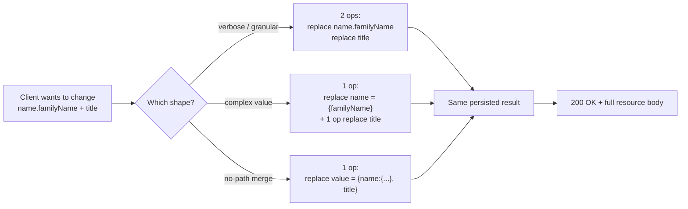
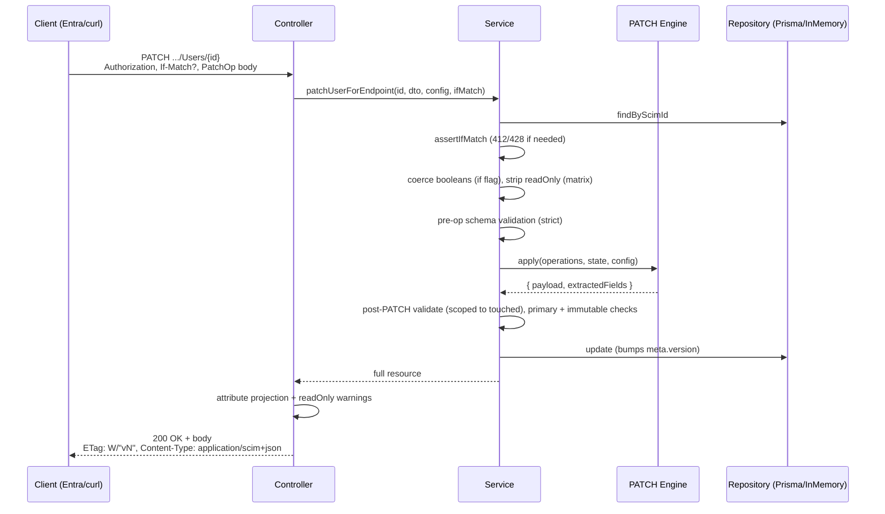
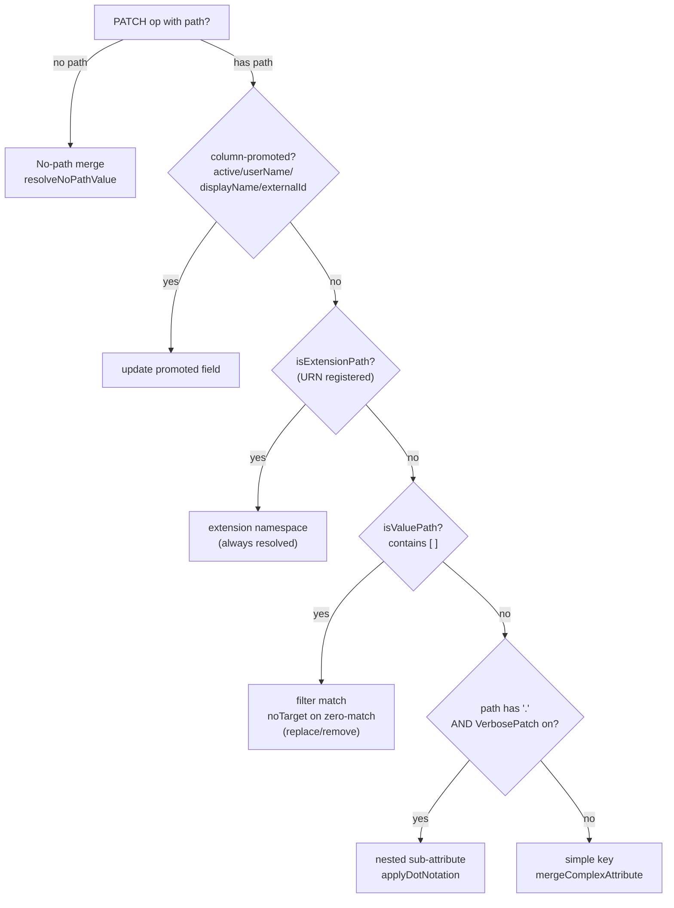
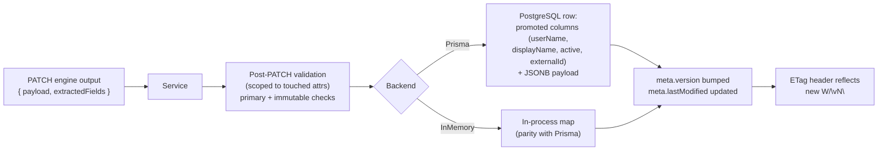

# SCIM PATCH Operations - Complete Behavior Guide

> Comprehensive, source-verified reference for every PATCH option, mode, setting, path form, verb, and persistence outcome across Users, Groups, custom extensions, and custom resource types - grounded in RFC 7644 / RFC 7643 and the SCIMServer implementation.

**Audience:** integrators wiring a SCIM client (Microsoft Entra ID, Okta, custom), operators configuring endpoint profiles, and contributors changing PATCH code.

**Status:** living reference. Last source-verified 2026-06-23 against `master` (v0.53.x) and a live run on the dev deployment.

**RFC references:**
- [RFC 7644 §3.5.2 - Modifying with PATCH](https://datatracker.ietf.org/doc/html/rfc7644#section-3.5.2)
- [RFC 7644 §3.5.2.1 - Add](https://datatracker.ietf.org/doc/html/rfc7644#section-3.5.2.1) / [§3.5.2.2 - Remove](https://datatracker.ietf.org/doc/html/rfc7644#section-3.5.2.2) / [§3.5.2.3 - Replace](https://datatracker.ietf.org/doc/html/rfc7644#section-3.5.2.3)
- [RFC 7644 §3.10 - Attribute Notation](https://datatracker.ietf.org/doc/html/rfc7644#section-3.10) (the `path` ABNF)
- [RFC 7644 §3.12 - HTTP Status and Error Response](https://datatracker.ietf.org/doc/html/rfc7644#section-3.12)
- [RFC 7644 §3.14 - ETag](https://datatracker.ietf.org/doc/html/rfc7644#section-3.14)
- [RFC 7643 §2.2 - Attribute Characteristics](https://datatracker.ietf.org/doc/html/rfc7643#section-2.2) / [§2.4 - Multi-Valued Attributes](https://datatracker.ietf.org/doc/html/rfc7643#section-2.4) / [§3.3 - Extensions](https://datatracker.ietf.org/doc/html/rfc7643#section-3.3)
- [Microsoft Entra SCIM implementation reference](https://learn.microsoft.com/en-us/entra/identity/app-provisioning/use-scim-to-provision-users-and-groups#understand-the-microsoft-entra-scim-implementation)

---

## Table of contents

1. [There is one PATCH (the "verbose" myth)](#1-there-is-one-patch-the-verbose-myth)
2. [Transport contract: URLs, headers, status codes](#2-transport-contract-urls-headers-status-codes)
3. [The PatchOp envelope](#3-the-patchop-envelope)
4. [The five path forms (RFC 7644 §3.10)](#4-the-five-path-forms-rfc-7644-310)
5. [The three verbs and null semantics](#5-the-three-verbs-and-null-semantics)
6. [Modes and settings that change PATCH behavior](#6-modes-and-settings-that-change-patch-behavior)
7. [Users PATCH](#7-users-patch)
8. [Groups PATCH](#8-groups-patch)
9. [Custom extension attributes PATCH](#9-custom-extension-attributes-patch)
10. [Custom resource types PATCH](#10-custom-resource-types-patch)
11. [Persistence: what is stored and how](#11-persistence-what-is-stored-and-how)
12. [Errors: status codes and scimType](#12-errors-status-codes-and-scimtype)
13. [End-to-end worked examples (request + response + headers)](#13-end-to-end-worked-examples-request--response--headers)
14. [Quick-reference behavior matrix](#14-quick-reference-behavior-matrix)
15. [Test coverage and source map](#15-test-coverage-and-source-map)

---

## 1. There is one PATCH (the "verbose" myth)

SCIM defines exactly **one** PATCH operation in [RFC 7644 §3.5.2](https://datatracker.ietf.org/doc/html/rfc7644#section-3.5.2). There is no "verbose mode" vs "normal mode" in the protocol. The word "verbose" comes from the **Microsoft Entra provisioning service / Microsoft SCIM Validator**, where a "verbose" request means "one `op` per leaf attribute, using dot-notation and value-path targeting." It is a client-side style, not a server mode.

What the RFC actually defines is a single envelope whose `Operations[]` can express the same change in several equally valid shapes:

| Shape | Example op | RFC anchor |
|-------|-----------|-----------|
| Granular, one op per attribute ("verbose") | `{ "op":"replace", "path":"name.familyName", "value":"Lovelace" }` | §3.5.2 path = `attrPath` |
| Complex value on the parent | `{ "op":"replace", "path":"name", "value":{ "familyName":"Lovelace" } }` | §3.5.2.3 |
| No-path object merge | `{ "op":"replace", "value":{ "displayName":"Ada", "title":"Engineer" } }` | §3.5.2.1 / §3.5.2.3 |

All three are valid and **none of them errors**. The server applies whichever shape the client sends. The only place SCIMServer adds a configurable behavior is the `VerbosePatchSupported` flag, which gates **core dot-notation path resolution on Users/Groups** - see [§6](#6-modes-and-settings-that-change-patch-behavior). That single flag is the entire surface area behind the "verbose" terminology.



---

## 2. Transport contract: URLs, headers, status codes

### 2.1 URLs by resource type

All PATCH routes are endpoint-scoped. `{baseUrl}` is the deployment origin (for example `https://scimserver-dev.proudbush-ae90986e.eastus.azurecontainerapps.io`), `{endpointId}` is the endpoint UUID.

| Resource | Method + URL |
|----------|--------------|
| User | `PATCH {baseUrl}/scim/endpoints/{endpointId}/Users/{id}` |
| Group | `PATCH {baseUrl}/scim/endpoints/{endpointId}/Groups/{id}` |
| Custom resource type | `PATCH {baseUrl}/scim/endpoints/{endpointId}/{ResourceType}/{id}` |
| /Me (self) | `PATCH {baseUrl}/scim/endpoints/{endpointId}/Me` (resolves the JWT `sub` to a User, then applies User PATCH) |

The RFC 2.0 path variant `{baseUrl}/scim/v2/endpoints/{endpointId}/...` is also served. Source: [endpoint-scim-users.controller.ts](../api/src/modules/scim/controllers/endpoint-scim-users.controller.ts#L266), [endpoint-scim-generic.controller.ts](../api/src/modules/scim/controllers/endpoint-scim-generic.controller.ts#L337), [scim-me.controller.ts](../api/src/modules/scim/controllers/scim-me.controller.ts).

### 2.2 Request headers

| Header | Required | Notes |
|--------|----------|-------|
| `Authorization: Bearer <token>` | Yes | OAuth2 client-credentials JWT, global `SCIM_SHARED_SECRET`, or a per-endpoint bcrypt token when `PerEndpointCredentialsEnabled` is on |
| `Content-Type: application/scim+json` | Recommended | `application/json` is also accepted |
| `If-Match: W/"vN"` | Conditional | Optional by default; **required** when `RequireIfMatch` is on (missing -> 428). When present it is always validated (mismatch -> 412) |

### 2.3 Response headers

| Header | When | Value |
|--------|------|-------|
| `Content-Type: application/scim+json` | Always (on 200) | SCIM media type |
| `ETag: W/"vN"` | Always when the resource has `meta.version` | Mirrors `meta.version`; bumped by the write. Source: [scim-etag.interceptor.ts](../api/src/modules/scim/interceptors/scim-etag.interceptor.ts) |
| `X-Request-Id` | Always | Correlation id for log lookups |

`Location` is **not** re-sent on PATCH (it is a POST-create header); the resource location is available in `meta.location` inside the body.

### 2.4 Status codes

| Status | Meaning |
|--------|---------|
| **200 OK** | Success. SCIMServer returns the **full updated resource** in the body, subject to `?attributes` / `?excludedAttributes` projection. This is the only success code this server emits for PATCH. |
| 400 Bad Request | Malformed op, invalid path, type mismatch, `noTarget`, readOnly violation (strict mode), prototype-pollution key. See [§12](#12-errors-status-codes-and-scimtype). |
| 401 / 403 | Auth failure / wrong tier. |
| 404 Not Found | Target resource does not exist (or is soft-deleted and the flag treats it as gone). |
| 412 Precondition Failed | `If-Match` supplied and does not match current `meta.version` (`scimType: versionMismatch`). |
| 428 Precondition Required | `RequireIfMatch` on and `If-Match` absent. |

> RFC 7644 §3.5.2 permits a server to answer a successful PATCH with either **200 + full body** or **204 No Content**. SCIMServer always chooses **200 + full body** (verified by live test and by the controller having no 204 path). The full body is convenient for clients but, per Entra guidance, returning a body is optional; clients must not depend on 204.



---

## 3. The PatchOp envelope

```json
{
  "schemas": ["urn:ietf:params:scim:api:messages:2.0:PatchOp"],
  "Operations": [
    { "op": "add|replace|remove", "path": "<optional>", "value": <varies> }
  ]
}
```

Rules enforced ([patch-user.dto.ts](../api/src/modules/scim/dto/patch-user.dto.ts), [patch-group.dto.ts](../api/src/modules/scim/dto/patch-group.dto.ts)):

| Constraint | Behavior |
|-----------|----------|
| `schemas` MUST contain `urn:ietf:params:scim:api:messages:2.0:PatchOp` | Missing -> 400. |
| `Operations` MUST be a non-empty array | Empty / missing -> 400. |
| Max **1000** operations per request | Exceeded -> 400 (`ArrayMaxSize`). |
| `op` is case-insensitive | `add/replace/remove` and `Add/Replace/Remove` both accepted. Entra emits PascalCase. |
| `path` is optional for add/replace, **required** for remove | Missing path on remove -> 400 `noTarget`. |
| `value` required for add/replace, ignored for remove | A stray `value` on remove is ignored. |
| Operations apply **sequentially** | Each op sees the result of the previous (RFC 7644 §3.5.2). |
| Atomicity | If any op fails, the whole request fails and the resource is unchanged. |

---

## 4. The five path forms (RFC 7644 §3.10)

The `path` ABNF is `PATH = attrPath / valuePath [subAttr]` where `attrPath = [URI ":"] ATTRNAME *1subAttr` and `subAttr = "." ATTRNAME`. Because `ATTRNAME` cannot contain a dot, a dotted token can only mean a sub-attribute. SCIMServer resolves the following five concrete forms (source: [scim-patch-path.ts](../api/src/modules/scim/utils/scim-patch-path.ts), engine dispatch in [user-patch-engine.ts](../api/src/domain/patch/user-patch-engine.ts#L215)):

| # | Form | Example `path` | Resolves to |
|---|------|---------------|-------------|
| 1 | Simple attribute | `"displayName"` | top-level attribute (complex value merges per §3.5.2.3) |
| 2 | Dot-notation sub-attribute | `"name.givenName"` | nested sub-attribute (Users/Groups: gated by `VerbosePatchSupported`; custom types: always) |
| 3 | Value-path filter | `"emails[type eq \"work\"].value"` | the matching element's sub-attribute (always resolved) |
| 4 | Extension URN | `"urn:...:enterprise:2.0:User:department"` | attribute inside the extension namespace (always resolved when URN registered) |
| 5 | No-path | omit `path` | `value` object merged into the resource root |



**Critical default behavior (form 2 on Users/Groups):** with `VerbosePatchSupported = false` (the default), a core dot-path such as `name.givenName` is **not** an error - it is stored as a literal flat top-level key `"name.givenName"`, and the real nested `name.givenName` is left unchanged. Microsoft Entra sends dot-notation by default in its "verbose" PATCH, so endpoints serving Entra core sub-attribute updates should set this flag `true`. See [§6.1](#61-verbosepatchsupported) for the full treatment. Note that no-path object merges (form 5) resolve dotted keys regardless of the flag via `resolveNoPathValue`.

---

## 5. The three verbs and null semantics

Per [RFC 7644 §3.5.2.1-3](https://datatracker.ietf.org/doc/html/rfc7644#section-3.5.2.1):

| Verb | RFC behavior | `null` value | SCIMServer |
|------|-------------|-------------|-----------|
| `add` | Add a value; if the target exists, replace it; if multi-valued, append | Not a legal addend; ambiguous | Permissive: `[null]` elements in a multi-valued array are rejected 400 `invalidValue` (F4) |
| `replace` | Replace the value at the target; if path omitted, merge the value object into the resource; complex value merges sub-attributes and leaves unspecified ones unchanged | **Unassign** the target (functionally equivalent to remove on that path) | `replace path=name value={familyName:null}` clears only `familyName` and preserves siblings (F1 merge, Entra/Okta de-facto). `replace path=members value=null` empties a Group (F2) |
| `remove` | Remove the value at `path`; `path` required; value-path filter removes matching elements | `value` is irrelevant and ignored | Bare `remove path` on a value-path that matches nothing -> 400 `noTarget` (F3, RFC MUST). Required attribute removal -> 400 `mutability`/`invalidValue` |

Special multi-valued rule (RFC 7644 §3.5.2): setting any element's `primary` to `true` forces every other element's `primary` to `false`. SCIMServer applies this via the `PrimaryEnforcement` setting ([§6.7](#67-primaryenforcement)).

The complete null-handling design (F1-F9) lives in [PATCH_NULL_HANDLING_RFC_COMPLIANCE.md](PATCH_NULL_HANDLING_RFC_COMPLIANCE.md).

---

## 6. Modes and settings that change PATCH behavior

These are per-endpoint profile settings (`profile.settings.<Flag>`), set at endpoint creation via a preset or patched later via `PATCH /scim/admin/endpoints/{id}`. Source of truth: [endpoint-config.interface.ts](../api/src/modules/endpoint/endpoint-config.interface.ts). Full catalog: [ENDPOINT_CONFIG_FLAGS_REFERENCE.md](ENDPOINT_CONFIG_FLAGS_REFERENCE.md).

| Setting | Default | Affects PATCH how |
|---------|---------|-------------------|
| `VerbosePatchSupported` | `false` | Gates core dot-notation path resolution on Users/Groups (form 2) |
| `StrictSchemaValidation` | `true` | readOnly PATCH ops -> 400; type validation on op values; undeclared extension URNs rejected |
| `IgnoreReadOnlyAttributesInPatch` | `false` | When strict is on, silently strip readOnly ops instead of 400 |
| `IncludeWarningAboutIgnoredReadOnlyAttribute` | `false` | Add a warning extension URN to the response listing stripped readOnly attrs |
| `MultiMemberPatchOpForGroupEnabled` | `true` | Allow add/remove of multiple Group members in a single op |
| `PatchOpAllowRemoveAllMembers` | `false` | Allow bare `remove path=members` (clear all) |
| `RequireIfMatch` | `false` | Require `If-Match` on PATCH (missing -> 428) |
| `AllowAndCoerceBooleanStrings` | `true` | Coerce `"True"/"False"` string values to booleans in PATCH op values + filters |
| `PrimaryEnforcement` | `passthrough` | How multiple `primary:true` in a multi-valued PATCH value is handled |
| `UserSoftDeleteEnabled` | `true` | `replace active=false` deactivates (vs 400 when off) |

### 6.1 VerbosePatchSupported

Gates form-2 core dot-notation on Users and Groups. Custom resource types ignore the flag and always resolve dots as nested.

| `{ "op":"replace", "path":"name.givenName", "value":"Jane" }` | `VerbosePatchSupported: true` | `VerbosePatchSupported: false` (default) |
|---|---|---|
| Result | `name.givenName` set to `Jane`; `name.familyName` preserved | Flat key `"name.givenName": "Jane"` stored at root; nested `name.givenName` unchanged. No error. |

RFC-correct alternatives that work regardless of the flag: complex value (`path:"name", value:{givenName:"Jane"}`) or no-path merge.

### 6.2 StrictSchemaValidation

When `true` (default), PATCH op values are type-checked against the schema, undeclared extension URNs are rejected, and an op targeting a `readOnly` attribute returns 400 `mutability`. When `false`, values are accepted leniently and readOnly ops are silently stripped. Set `false` (or pair with the next flag) for Entra ID, which sends readOnly attributes inside PATCH.

### 6.3 IgnoreReadOnlyAttributesInPatch + 6.4 IncludeWarningAboutIgnoredReadOnlyAttribute

The readOnly strip-vs-reject matrix ([endpoint-scim-users.service.ts](../api/src/modules/scim/services/endpoint-scim-users.service.ts#L471)):

| StrictSchemaValidation | IgnoreReadOnlyAttributesInPatch | readOnly PATCH op outcome |
|---|---|---|
| ON | OFF | 400 `mutability` (reject) |
| ON | ON | silently stripped, op continues |
| OFF | (any) | always stripped |

When a strip happens and `IncludeWarningAboutIgnoredReadOnlyAttribute` is on, the 200 response carries a warning under the custom warning URN (attached by [endpoint-scim-users.controller.ts](../api/src/modules/scim/controllers/endpoint-scim-users.controller.ts#L44)).

### 6.5 MultiMemberPatchOpForGroupEnabled

When `true` (default), a single Group op may carry many members: `value:[{value:"a"},{value:"b"}]`. When `false`, more than one member in one op -> 400. Most clients (Entra, Okta) batch members, so keep it on.

### 6.6 PatchOpAllowRemoveAllMembers

Governs only the spec-ambiguous bare `remove path=members` (no filter, no value). When `false` (default), that op is rejected; when `true`, it clears all members. Note: the unambiguous `replace path=members value=null` and `replace path=members value=[]` always clear, independent of this flag ([group-patch-engine.ts](../api/src/domain/patch/group-patch-engine.ts#L277)).

### 6.7 PrimaryEnforcement

| Value | Behavior on >1 `primary:true` in a PATCH value |
|-------|-----------------------------------------------|
| `passthrough` (default) | Store as-is, WARN log |
| `normalize` | Keep the first `primary:true`, set the rest false, WARN log |
| `reject` | 400 `invalidValue` |

### 6.8 RequireIfMatch and AllowAndCoerceBooleanStrings

`RequireIfMatch` makes `If-Match` mandatory on PATCH (missing -> 428; mismatch -> 412 regardless of this flag). `AllowAndCoerceBooleanStrings` (default on) coerces `"True"`/`"False"` string op values to native booleans before validation/storage, including inside value-path filter literals - important for Entra interop.

---

## 7. Users PATCH

Engine: [user-patch-engine.ts](../api/src/domain/patch/user-patch-engine.ts). Dispatch order inside add/replace: column-promoted fields -> extension URN -> value-path -> verbose dot-notation -> simple/complex merge -> no-path merge.

### 7.1 Column-promoted fields

`active`, `userName`, `displayName`, `externalId` are promoted to first-class DB columns and handled before generic path logic. Consequences:
- `replace active=false` toggles activation (subject to `UserSoftDeleteEnabled`).
- `remove userName` -> 400 (required attribute, RFC 7643 §4.1).
- `replace userName` updates the joining property (Entra "Update joining property").

### 7.2 Common User examples

Replace a single-valued attribute:
```json
{ "schemas": ["urn:ietf:params:scim:api:messages:2.0:PatchOp"],
  "Operations": [ { "op": "replace", "path": "title", "value": "Senior Engineer" } ] }
```

Update a work email value via value-path (works regardless of VerbosePatch):
```json
{ "schemas": ["urn:ietf:params:scim:api:messages:2.0:PatchOp"],
  "Operations": [ { "op": "replace", "path": "emails[type eq \"work\"].value", "value": "ada@example.com" } ] }
```

Disable a user (Entra deprovision):
```json
{ "schemas": ["urn:ietf:params:scim:api:messages:2.0:PatchOp"],
  "Operations": [ { "op": "replace", "path": "active", "value": false } ] }
```

No-path multi-attribute merge (preserves untouched attributes):
```json
{ "schemas": ["urn:ietf:params:scim:api:messages:2.0:PatchOp"],
  "Operations": [ { "op": "replace", "value": { "displayName": "Ada Lovelace", "title": "Engineer" } } ] }
```

Update a sub-attribute the RFC-portable way (no flag needed):
```json
{ "schemas": ["urn:ietf:params:scim:api:messages:2.0:PatchOp"],
  "Operations": [ { "op": "replace", "path": "name", "value": { "familyName": "Lovelace" } } ] }
```

Same change, dot-notation (requires `VerbosePatchSupported: true` to nest on Users):
```json
{ "schemas": ["urn:ietf:params:scim:api:messages:2.0:PatchOp"],
  "Operations": [ { "op": "replace", "path": "name.familyName", "value": "Lovelace" } ] }
```

---

## 8. Groups PATCH

Engine: [group-patch-engine.ts](../api/src/domain/patch/group-patch-engine.ts). Groups support `displayName`, `externalId`, `members` management, and extension URN attributes. Per Entra guidance, Group PATCH commonly returns 204 in other servers; SCIMServer returns **200 + the updated Group** (members included unless projected out).

### 8.1 Member operations

Add members (multi-member needs `MultiMemberPatchOpForGroupEnabled`, default on):
```json
{ "schemas": ["urn:ietf:params:scim:api:messages:2.0:PatchOp"],
  "Operations": [ { "op": "add", "path": "members",
    "value": [ { "value": "user-id-1" }, { "value": "user-id-2" } ] } ] }
```

Remove one member by value-path filter:
```json
{ "schemas": ["urn:ietf:params:scim:api:messages:2.0:PatchOp"],
  "Operations": [ { "op": "remove", "path": "members[value eq \"user-id-1\"]" } ] }
```

Replace the entire member list:
```json
{ "schemas": ["urn:ietf:params:scim:api:messages:2.0:PatchOp"],
  "Operations": [ { "op": "replace", "path": "members",
    "value": [ { "value": "user-id-3" } ] } ] }
```

Clear all members:

| Form | Needs flag? | Outcome |
|------|------------|---------|
| `replace path=members value=null` | No | members emptied (F2) |
| `replace path=members value=[]` | No | members emptied |
| `remove path=members` (bare) | `PatchOpAllowRemoveAllMembers: true` | members emptied; otherwise 400 |

Rename the group:
```json
{ "schemas": ["urn:ietf:params:scim:api:messages:2.0:PatchOp"],
  "Operations": [ { "op": "replace", "path": "displayName", "value": "Engineering" } ] }
```

`remove displayName` -> 400 (required for Group, RFC 7643 §4.2). Member entries with `value:null` are rejected 400 (F4). Duplicate members are de-duplicated.

---

## 9. Custom extension attributes PATCH

Extension attributes live under a schema URN namespace (for example the enterprise extension or a custom URN registered on the endpoint). Extension URN paths are **always resolved** regardless of `VerbosePatchSupported`, on both Users and Groups.

Set an enterprise attribute (granular path form):
```json
{ "schemas": ["urn:ietf:params:scim:api:messages:2.0:PatchOp"],
  "Operations": [ { "op": "replace",
    "path": "urn:ietf:params:scim:schemas:extension:enterprise:2.0:User:department",
    "value": "Research" } ] }
```

Set a manager (Entra reference-attribute pattern):
```json
{ "schemas": ["urn:ietf:params:scim:api:messages:2.0:PatchOp"],
  "Operations": [ { "op": "add",
    "path": "urn:ietf:params:scim:schemas:extension:enterprise:2.0:User:manager",
    "value": "00aa00aa-bb11-cc22-dd33-44ee44ee44ee" } ] }
```

No-path merge into an extension namespace (Entra also sends this shape):
```json
{ "schemas": ["urn:ietf:params:scim:api:messages:2.0:PatchOp"],
  "Operations": [ { "op": "replace", "value": {
    "urn:ietf:params:scim:schemas:extension:enterprise:2.0:User": { "department": "Research", "costCenter": null }
  } } ] }
```

Behavior notes:
- Implicit schema activation (RFC 7644 §3.5.2): assigning any attribute under an extension URN automatically adds that URN to the resource's `schemas[]`.
- Empty-namespace pruning (F5, RFC 7643 §3.3): if a PATCH clears the last attribute in an extension namespace, the URN is dropped from `schemas[]` when the response is projected.
- A `null` sub-value in an extension object clears that attribute (Entra deprovision) rather than writing a literal null.
- With `StrictSchemaValidation: true`, an **undeclared** extension URN is rejected; register the extension on the endpoint profile first.

---

## 10. Custom resource types PATCH

Engine: [generic-patch-engine.ts](../api/src/domain/patch/generic-patch-engine.ts). Custom resource types (any resourceType registered on the endpoint beyond User/Group) operate directly on the JSON payload.

Key differences from Users/Groups:
- **Dot-notation is always resolved as nested** - the engine does not read `VerbosePatchSupported`. `path:"costCenter.code"` always writes `{ costCenter: { code: ... } }`.
- No column-promoted fields and no member management.
- Extension URN paths and value-path filters are supported, same as Users.

Examples (resourceType `Devices`):
```json
{ "schemas": ["urn:ietf:params:scim:api:messages:2.0:PatchOp"],
  "Operations": [
    { "op": "replace", "path": "displayName", "value": "Lab Printer 2" },
    { "op": "add", "path": "location.building", "value": "B12" },
    { "op": "remove", "path": "tags[value eq \"retired\"]" }
  ] }
```

No-path merge works identically:
```json
{ "schemas": ["urn:ietf:params:scim:api:messages:2.0:PatchOp"],
  "Operations": [ { "op": "replace", "value": { "status": "active", "owner": "team-iam" } } ] }
```

---

## 11. Persistence: what is stored and how



Persistence facts:
- **Promoted columns vs JSONB:** for Users, `userName`, `displayName`, `active`, `externalId` are stored as indexed columns; all other attributes (including extension namespaces) live in a JSONB `payload`. Groups promote `displayName`, `externalId` and store members in a relation. Custom types store the whole payload as JSONB.
- **meta.version / ETag:** every successful PATCH bumps `meta.version` (weak ETag `W/"vN"`) and `meta.lastModified`. The new version is returned in the body and the `ETag` header.
- **schemas[] is recomputed:** extension URNs are added on assignment and pruned when their namespace becomes empty (F5).
- **Scoped post-PATCH validation:** strict re-validation inspects only the attributes the PATCH touched ([scim-service-helpers.ts](../api/src/modules/scim/common/scim-service-helpers.ts#L280)), so a PATCH that targets one attribute is not failed by unrelated pre-existing data under a since-tightened schema.
- **Backend parity:** the Prisma and InMemory backends are held to identical PATCH behavior; any divergence is a parity bug, not a feature.
- **Atomicity:** a failing op rolls back the whole request; nothing is persisted.

---

## 12. Errors: status codes and scimType

Per [RFC 7644 §3.12](https://datatracker.ietf.org/doc/html/rfc7644#section-3.12), errors carry an `Error` schema body with `status`, optional `scimType`, and `detail`. SCIMServer also attaches a structured diagnostics block.

| Condition | HTTP | scimType |
|-----------|------|----------|
| Unknown `op` (not add/replace/remove) | 400 | `invalidValue` |
| Missing `PatchOp` schema URN | 400 | `invalidSyntax` |
| `remove` with no `path` | 400 | `noTarget` |
| value-path filter matches nothing (replace/remove) | 400 | `noTarget` |
| readOnly attribute targeted (strict, ignore-flag off) | 400 | `mutability` |
| Removing/unassigning a required attribute (`userName`, `displayName`) | 400 | `invalidValue` / `mutability` |
| Type mismatch on op value (strict) | 400 | `invalidValue` |
| `[null]` element in a multi-valued array | 400 | `invalidValue` |
| Prototype-pollution key (`__proto__`, `constructor`, `prototype`) | 400 | `invalidPath` |
| `If-Match` mismatch | 412 | `versionMismatch` |
| `RequireIfMatch` on and `If-Match` absent | 428 | (precondition required) |
| Multiple members in one op with `MultiMemberPatchOpForGroupEnabled: false` | 400 | `invalidValue` |

Example error body:
```json
{
  "schemas": ["urn:ietf:params:scim:api:messages:2.0:Error"],
  "status": "400",
  "scimType": "noTarget",
  "detail": "Filter type eq \"home\" did not match any value in emails."
}
```

---

## 13. End-to-end worked examples (request + response + headers)

The following was executed live against the dev deployment (`rfc-standard` preset, `StrictSchemaValidation: true`). A temporary endpoint and user were created and deleted around the test.

### 13.1 No-path replace merge (the exact payload integrators ask about)

Request:
```http
PATCH /scim/endpoints/{endpointId}/Users/{id} HTTP/1.1
Host: scimserver-dev.proudbush-ae90986e.eastus.azurecontainerapps.io
Authorization: Bearer <token>
Content-Type: application/scim+json

{
  "schemas": ["urn:ietf:params:scim:api:messages:2.0:PatchOp"],
  "Operations": [
    { "op": "replace", "value": { "displayName": "Ada Lovelace", "title": "Engineer" } }
  ]
}
```

Response (verified live):
```http
HTTP/1.1 200 OK
Content-Type: application/scim+json
ETag: W/"v2"

{
  "schemas": ["urn:ietf:params:scim:schemas:core:2.0:User"],
  "title": "Engineer",
  "emails": [ { "type": "work", "value": "ada@example.com", "primary": true } ],
  "id": "a7b38150-b14b-4499-a813-b6b2859c4bc1",
  "userName": "ada-1484436637@example.com",
  "displayName": "Ada Lovelace",
  "active": true,
  "meta": {
    "resourceType": "User",
    "created": "2026-06-23T20:09:37.779Z",
    "lastModified": "2026-06-23T20:09:37.876Z",
    "location": ".../Users/a7b38150-b14b-4499-a813-b6b2859c4bc1",
    "version": "W/\"v2\""
  }
}
```

Observed: `displayName` and `title` updated; `userName`, `emails`, `active` preserved; 200 with full body; `ETag` reflects the new version. This is RFC 7644 §3.5.2.3 no-path replace (merge), not a whole-resource overwrite.

### 13.2 Response projection on PATCH

Add `?attributes=displayName` to receive only the projected attribute set (plus always-returned `id`, `schemas`, `meta`):
```http
PATCH /scim/endpoints/{endpointId}/Users/{id}?attributes=displayName HTTP/1.1
```
Projection is applied by the controller after the engine result ([endpoint-scim-users.controller.ts](../api/src/modules/scim/controllers/endpoint-scim-users.controller.ts#L266)).

### 13.3 Optimistic concurrency

```http
PATCH /scim/endpoints/{endpointId}/Users/{id} HTTP/1.1
If-Match: W/"v1"
...
```
If the stored version is `W/"v2"`, the server returns 412 `versionMismatch`. With `RequireIfMatch: true` and no `If-Match`, it returns 428.

---

## 14. Quick-reference behavior matrix

| Scenario | Users | Groups | Custom RT |
|----------|-------|--------|-----------|
| Simple `replace path=attr` | Merge/replace | Merge/replace | Merge/replace |
| Complex `replace path=parent value={...}` | Sub-attr merge | Sub-attr merge | Sub-attr merge |
| No-path `replace value={...}` | Merge into resource | Merge into resource | Merge into resource |
| Dot-notation `name.givenName` nests? | Only if `VerbosePatchSupported` | Only if `VerbosePatchSupported` | **Always** |
| Value-path `emails[type eq "x"].value` | Yes | members[value eq] | Yes |
| Extension URN path | Yes (always) | Yes (always) | Yes |
| readOnly op (strict on, ignore off) | 400 `mutability` | 400 `mutability` | n/a (no built-in readOnly) |
| Multi-member single op | n/a | `MultiMemberPatchOpForGroupEnabled` | n/a |
| Clear all members | n/a | null/[] always; bare remove needs flag | n/a |
| Success response | 200 + body | 200 + body | 200 + body |
| ETag bump | Yes | Yes | Yes |

Defaults summary: `VerbosePatchSupported=false`, `StrictSchemaValidation=true`, `IgnoreReadOnlyAttributesInPatch=false`, `MultiMemberPatchOpForGroupEnabled=true`, `PatchOpAllowRemoveAllMembers=false`, `RequireIfMatch=false`, `AllowAndCoerceBooleanStrings=true`, `PrimaryEnforcement=passthrough`.

---

## 15. Test coverage and source map

| Layer | Location |
|-------|----------|
| User PATCH engine | [user-patch-engine.ts](../api/src/domain/patch/user-patch-engine.ts) / [.spec.ts](../api/src/domain/patch/user-patch-engine.spec.ts) |
| Group PATCH engine | [group-patch-engine.ts](../api/src/domain/patch/group-patch-engine.ts) / [.spec.ts](../api/src/domain/patch/group-patch-engine.spec.ts) |
| Generic PATCH engine | [generic-patch-engine.ts](../api/src/domain/patch/generic-patch-engine.ts) / [.spec.ts](../api/src/domain/patch/generic-patch-engine.spec.ts) |
| Path resolution utilities | [scim-patch-path.ts](../api/src/modules/scim/utils/scim-patch-path.ts) |
| Flag x extension combinations | [extension-and-flags.spec.ts](../api/src/domain/patch/extension-and-flags.spec.ts) |
| Config flags | [endpoint-config.interface.ts](../api/src/modules/endpoint/endpoint-config.interface.ts) |
| Users controller / service | [endpoint-scim-users.controller.ts](../api/src/modules/scim/controllers/endpoint-scim-users.controller.ts) / [endpoint-scim-users.service.ts](../api/src/modules/scim/services/endpoint-scim-users.service.ts) |
| Generic controller / service | [endpoint-scim-generic.controller.ts](../api/src/modules/scim/controllers/endpoint-scim-generic.controller.ts) / [endpoint-scim-generic.service.ts](../api/src/modules/scim/services/endpoint-scim-generic.service.ts) |
| ETag / If-Match | [scim-etag.interceptor.ts](../api/src/modules/scim/interceptors/scim-etag.interceptor.ts) |
| E2E PATCH | [api/test/e2e/patch-null-handling.e2e-spec.ts](../api/test/e2e/patch-null-handling.e2e-spec.ts), [scim-validator-compliance.e2e-spec.ts](../api/test/e2e/scim-validator-compliance.e2e-spec.ts) |
| Live PATCH | section 9z-AK in [scripts/live-test.ps1](../scripts/live-test.ps1) |

### Related docs
- [PATCH_NULL_HANDLING_RFC_COMPLIANCE.md](PATCH_NULL_HANDLING_RFC_COMPLIANCE.md) - F1-F9 null semantics deep dive
- [ENDPOINT_CONFIG_FLAGS_REFERENCE.md](ENDPOINT_CONFIG_FLAGS_REFERENCE.md) - all settings
- [H1_H2_ARCHITECTURE_AND_IMPLEMENTATION.md](H1_H2_ARCHITECTURE_AND_IMPLEMENTATION.md) - PATCH validation + immutable enforcement
- [SCIM_COMPLIANCE.md](SCIM_COMPLIANCE.md) - RFC compliance matrix
- [COMPLETE_API_REFERENCE.md](COMPLETE_API_REFERENCE.md) - all routes
