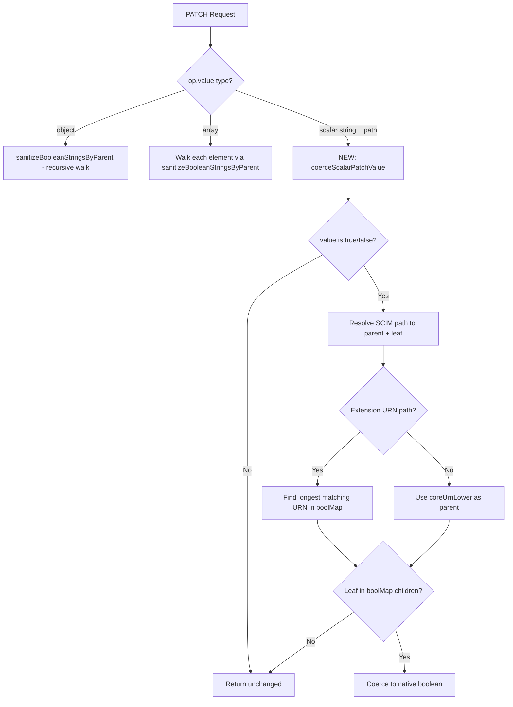

# PATCH Scalar Boolean String Coercion (Entra ID Fix)

> **Version**: 0.40.0
> **RFC**: 7644 S3.5.2 (PATCH operations), 7643 S2.2 (Attribute types)
> **Flag**: `AllowAndCoerceBooleanStrings` (default: `true`)

## Problem Statement

Microsoft Entra ID (Azure AD) SCIM Validator sends PATCH operations with boolean
values as strings. For example:

```json
{
  "schemas": ["urn:ietf:params:scim:api:messages:2.0:PatchOp"],
  "Operations": [
    { "op": "Replace", "path": "active", "value": "True" },
    { "op": "Replace", "path": "displayName", "value": "Updated Name" }
  ]
}
```

The `active` attribute is schema-typed as `boolean`, but Entra ID sends `"True"`
(a string). When `StrictSchemaValidation` is enabled, the pre-PATCH validation
(`SchemaValidator.validatePatchOperationValue`) rejected this with:

```
PATCH operation value validation failed: Attribute 'active' must be a boolean, got string.
```

This caused **100% of PATCH operations** from the Entra SCIM Validator to fail
with HTTP 400 because every PATCH includes an `active` replacement.

## Root Cause

The `coercePatchOpBooleans()` function handled two value shapes:

1. **Object value** (path-less replace): `{ op: "Replace", value: { active: "True" } }` - WORKED
2. **Array value**: `{ op: "Add", value: [{ active: "True" }] }` - WORKED

But it **did not handle** the third shape:

3. **Scalar string value with path**: `{ op: "Replace", path: "active", value: "True" }` - **MISSING**

This third shape is the standard format Entra ID uses for all PATCH operations.

## Architecture



## Path Resolution

The new `coerceScalarPatchValue()` function resolves SCIM PATCH paths to their
parent URN-dot-path and leaf attribute name using the same boolMap structure
used by `sanitizeBooleanStringsByParent()`:

| PATCH Path | Parent Path | Leaf | Coerced? |
|---|---|---|---|
| `active` | `urn:...:core:2.0:user` | `active` | Yes (boolean) |
| `displayName` | `urn:...:core:2.0:user` | `displayname` | No (string) |
| `emails[type eq "work"].primary` | `urn:...:core:2.0:user.emails` | `primary` | Yes (boolean) |
| `name.givenName` | `urn:...:core:2.0:user.name` | `givenname` | No (string) |
| `urn:...:enterprise:2.0:User:securityEnabled` | `urn:...:enterprise:2.0:user` | `securityenabled` | Yes (boolean) |
| `urn:...:enterprise:2.0:User:department` | `urn:...:enterprise:2.0:user` | `department` | No (string) |

## Implementation Details

### Changed File

- [scim-service-helpers.ts](../api/src/modules/scim/common/scim-service-helpers.ts) -
  `coercePatchOpBooleans()` + new `coerceScalarPatchValue()` helper

### Key Design Decisions

1. **Uses existing boolMap** - No new data structures; reuses the precomputed
   `booleansByParent` cache already built for `sanitizeBooleanStringsByParent()`

2. **Longest-prefix URN matching** - Extension URNs contain dots (e.g. `2.0`) and
   colons as separators. The function iterates all boolMap keys to find the longest
   matching URN prefix, avoiding incorrect splits on version dots.

3. **No coercion for non-true/false strings** - Only `"true"/"false"` (case-insensitive)
   are coerced. Other string values like `"yes"` or `"1"` are left unchanged.

4. **Single fix point** - The fix is in the shared `coercePatchOpBooleans()` function
   called by all three service layers (Users, Groups, Generic), so all resource types
   benefit from the fix.

### Interaction with Config Flags

| StrictSchemaValidation | AllowAndCoerceBooleanStrings | PATCH active="True" |
|---|---|---|
| True | True | Coerced to `true`, passes validation |
| True | False | Remains `"True"`, rejected with 400 |
| False | True | Coerced to `true` (but no strict validation anyway) |
| False | False | Remains `"True"`, no validation to reject it |

## Test Coverage

| Level | File | Tests |
|---|---|---|
| Unit | `scim-service-helpers.spec.ts` | 13 new tests (scalar path coercion) |
| E2E | `config-flags.e2e-spec.ts` | 4 new tests (PATCH scalar bool with flags) |
| Live | `live-test.ps1` section 9z-S | 5 tests (coercion on/off, sub-attrs, non-bool) |

### Unit Test Cases

- PATCH `path:"active"` with `value:"True"` -> coerced to `true`
- PATCH `path:"active"` with `value:"False"` -> coerced to `false`
- Case-insensitive coercion (`"true"`, `"TRUE"`, `"FALSE"`)
- Non-boolean path `path:"displayName"` with `value:"True"` -> NOT coerced
- Sub-attribute with value filter `emails[type eq "work"].primary` -> coerced
- Non-boolean sub-attribute `emails[type eq "work"].value` -> NOT coerced
- Extension URN path `urn:...:enterprise:2.0:User:securityEnabled` -> coerced
- Non-boolean extension path `urn:...:enterprise:2.0:User:department` -> NOT coerced
- Mixed batch (scalar + object ops in same request)
- Non-true/false string (`"yes"`) -> NOT coerced
- Missing path with scalar value -> NOT coerced
