# Phase 1 PATCH Fixes — Detailed Reference

> **Scope**: 5 changes resolving 7 of 13 Microsoft SCIM Validator failures  
> **RFC References**: RFC 7643 (Schema), RFC 7644 (Protocol), RFC 7643 §8 (Extension Schema)  
> **Date**: February 2026

---

## Table of Contents

1. [Change 1 — Content-Type: application/scim+json](#change-1--content-type-applicationscimjson)
2. [Change 2 — No-Path PATCH Replace for Users](#change-2--no-path-patch-replace-for-users)
3. [Change 3 — No-Path PATCH Replace for Groups](#change-3--no-path-patch-replace-for-groups)
4. [Change 4 — ValuePath Filter Expressions](#change-4--valuepath-filter-expressions)
5. [Change 5 — Enterprise Extension URN Paths](#change-5--enterprise-extension-urn-paths)
6. [Branch Priority & Decision Tree](#branch-priority--decision-tree)

---

## Change 1 — Content-Type: application/scim+json

### SCIM Specification

**RFC 7644 §3.1 — Background** states:

> *"SCIM is a protocol that, like any other, has its own rules about the
> form and content of data exchanged between client and server. These
> rules are described in this section.*
>
> *Two new media types are defined: "application/scim+json"...*
>
> *Clients and servers SHOULD use the "application/scim+json" media type."*

**RFC 7644 §3.1 — Request/Response**:

> *"Responses MUST be identified using the following media type:
> `application/scim+json`"*

The Microsoft SCIM Validator checks the `Content-Type` header on every response and rejects any that use the generic `application/json` instead of `application/scim+json`.

### What Changed

A NestJS interceptor (`ScimContentTypeInterceptor`) was added and registered globally via `APP_INTERCEPTOR` in `scim.module.ts`. It overrides NestJS's default `application/json` header on every SCIM response.

### Processing Diagram

```mermaid
sequenceDiagram
    participant Client as SCIM Client
    participant Controller as SCIM Controller
    participant Interceptor as ScimContentTypeInterceptor
    participant Express as Express Response

    Client->>Controller: GET /scim/endpoints/ep-001/Users/abc-123
    Controller->>Controller: Process request, build response object
    Controller-->>Interceptor: Response object (via RxJS pipe)
    
    Note over Interceptor: tap() operator fires AFTER<br/>handler returns but BEFORE<br/>response is sent to client
    
    Interceptor->>Express: response.headersSent?
    Express-->>Interceptor: false
    Interceptor->>Express: setHeader('Content-Type',<br/>'application/scim+json; charset=utf-8')
    Express-->>Client: HTTP 200 with correct Content-Type
```

### Example Request

```http
GET /scim/endpoints/ep-001/Users/abc-123 HTTP/1.1
Host: localhost:6000
Accept: application/scim+json
```

### Response — BEFORE Fix

```http
HTTP/1.1 200 OK
Content-Type: application/json; charset=utf-8   ← WRONG

{ "schemas": ["urn:ietf:params:scim:schemas:core:2.0:User"], ... }
```

### Response — AFTER Fix

```http
HTTP/1.1 200 OK
Content-Type: application/scim+json; charset=utf-8   ← CORRECT per RFC 7644 §3.1

{ "schemas": ["urn:ietf:params:scim:schemas:core:2.0:User"], ... }
```

### Code Flow

```
ScimContentTypeInterceptor.intercept()
  │
  ├─ next.handle().pipe(tap(() => { ... }))
  │     │
  │     ├─ context.switchToHttp().getResponse<Response>()
  │     │
  │     ├─ if (!response.headersSent)
  │     │     └─ response.setHeader('Content-Type', 'application/scim+json; charset=utf-8')
  │     │
  │     └─ (response data passes through unchanged)
  │
  └─ return Observable<response>
```

### Why This Output

| Before | After | Reason |
|--------|-------|--------|
| `application/json` | `application/scim+json` | RFC 7644 §3.1 mandates SCIM-specific media type |

---

## Change 2 — No-Path PATCH Replace for Users

### SCIM Specification

**RFC 7644 §3.5.2.1 — Replace** states:

> *"If 'path' is omitted, the target is assumed to be the resource
> itself. The value attribute SHALL contain a set of one or more
> attributes that are to be replaced."*

This means when a PATCH operation has `op: "replace"` with **no `path`**, the entire `value` object's keys should be treated as top-level attributes to replace on the resource. Keys like `userName`, `externalId`, `active` must update their dedicated database columns — not be dumped into a generic JSON blob.

**RFC 7644 §3.5.2.1 Example** (simplified):

```json
{
  "op": "replace",
  "value": {
    "emails": [{ "value": "x@y.com", "type": "work" }],
    "displayName": "New Name"
  }
}
```

### What Changed

The `applyPatchOperationsForEndpoint()` method now has a dedicated branch for no-path replace that:
1. Extracts `userName` → writes to `scimUser.userName` DB column
2. Extracts `externalId` → writes to `scimUser.externalId` DB column
3. Extracts `active` → writes to `scimUser.active` DB column
4. Spreads remaining attributes (e.g., `displayName`) into `rawPayload`
5. Calls `stripReservedAttributes()` to prevent duplication

### Processing Diagram

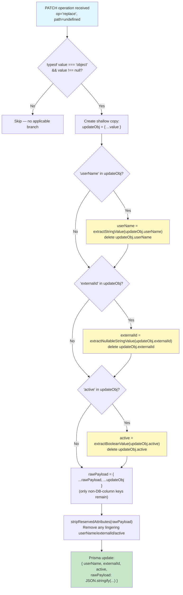

### Example Request

```http
PATCH /scim/endpoints/ep-001/Users/abc-123 HTTP/1.1
Content-Type: application/scim+json

{
  "schemas": ["urn:ietf:params:scim:api:messages:2.0:PatchOp"],
  "Operations": [
    {
      "op": "replace",
      "value": {
        "userName": "updated@contoso.com",
        "externalId": "EXT-999",
        "active": false,
        "displayName": "Updated User"
      }
    }
  ]
}
```

### Expected Response (200 OK)

```json
{
  "schemas": ["urn:ietf:params:scim:schemas:core:2.0:User"],
  "id": "abc-123",
  "userName": "updated@contoso.com",
  "externalId": "EXT-999",
  "active": false,
  "displayName": "Updated User",
  "meta": {
    "resourceType": "User",
    "created": "2026-01-15T10:00:00.000Z",
    "lastModified": "2026-02-09T12:00:00.000Z",
    "location": "http://localhost:6000/scim/endpoints/ep-001/Users/abc-123"
  }
}
```

### Data Flow Diagram

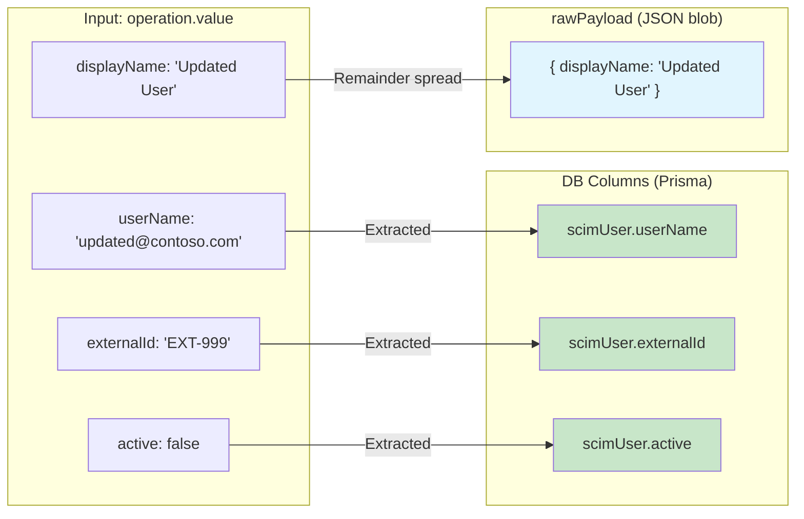

### Why This Output

| Field | Destination | Reason |
|-------|-------------|--------|
| `userName` | `scimUser.userName` DB column | First-class indexed field; must be unique per endpoint |
| `externalId` | `scimUser.externalId` DB column | First-class indexed field; used for uniqueness checks |
| `active` | `scimUser.active` DB column | Boolean DB column; drives provisioning state |
| `displayName` | `rawPayload` JSON blob | No dedicated DB column; stored as flexible JSON |

**Before the fix**: All four keys were dumped into `rawPayload`, leaving `userName`/`externalId`/`active` DB columns unchanged. The SCIM Validator saw stale values in the response and failed.

---

## Change 3 — No-Path PATCH Replace for Groups

### SCIM Specification

Same as Change 2 — **RFC 7644 §3.5.2.1**:

> *"If 'path' is omitted, the target is assumed to be the resource
> itself."*

Additionally, for Groups the `externalId` attribute is defined in **RFC 7643 §3.1 — Common Attributes**:

> *"A String that is an identifier for the resource as defined by the
> provisioning client."*

This means `externalId` MUST be accepted for Groups too, even though our Group DB model only has a `displayName` column.

### What Changed

`handleReplace()` was rewritten with 4 changes:
1. **New signature**: Now accepts and returns `rawPayload`
2. **No-path + string value**: Treated as `displayName` (backward-compatible)
3. **No-path + object value**: Extracts `displayName`, `members`, stores remaining keys (e.g., `externalId`) in `rawPayload`
4. **New `externalid` path branch**: Direct path-based `externalId` updates go to `rawPayload`

`patchGroupForEndpoint()` was updated to track, pass, destructure, and persist `rawPayload`.

### Processing Diagram

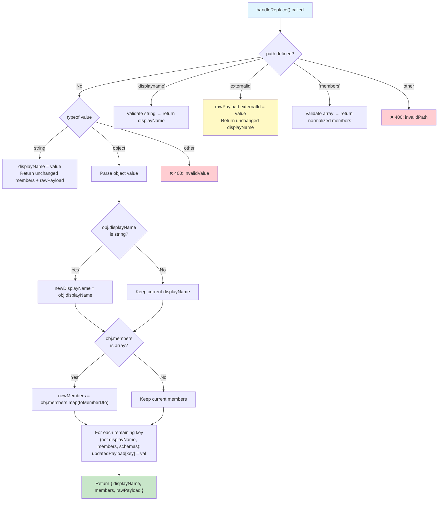

### Example Request

```http
PATCH /scim/endpoints/ep-001/Groups/grp-456 HTTP/1.1
Content-Type: application/scim+json

{
  "schemas": ["urn:ietf:params:scim:api:messages:2.0:PatchOp"],
  "Operations": [
    {
      "op": "replace",
      "value": {
        "displayName": "Renamed Team",
        "externalId": "GRP-EXT-42"
      }
    }
  ]
}
```

### Response — BEFORE Fix (400 Error)

```json
{
  "schemas": ["urn:ietf:params:scim:api:messages:2.0:Error"],
  "status": "400",
  "scimType": "invalidValue",
  "detail": "Replace operation for displayName requires a string value."
}
```

The old code only accepted a raw string for no-path replace. An object triggered the `typeof value !== 'string'` validation error.

### Response — AFTER Fix (200 OK)

```json
{
  "schemas": ["urn:ietf:params:scim:schemas:core:2.0:Group"],
  "id": "grp-456",
  "displayName": "Renamed Team",
  "externalId": "GRP-EXT-42",
  "members": [],
  "meta": {
    "resourceType": "Group",
    "lastModified": "2026-02-09T12:00:00.000Z",
    "location": "http://localhost:6000/scim/endpoints/ep-001/Groups/grp-456"
  }
}
```

### Persistence Diagram

```mermaid
flowchart LR
    subgraph "Input: operation.value (object)"
        V1["displayName: 'Renamed Team'"]
        V2["externalId: 'GRP-EXT-42'"]
    end

    subgraph "DB Column"
        DB1["scimGroup.displayName"]
    end

    subgraph "rawPayload (JSON blob)"
        RP["{ externalId: 'GRP-EXT-42' }"]
    end

    subgraph "Prisma $transaction"
        TX["scimGroup.update({<br/>  displayName: 'Renamed Team',<br/>  rawPayload: '{\"externalId\": \"GRP-EXT-42\"}'<br/>})"]
    end

    V1 -->|"Extracted as displayName"| DB1
    V2 -->|"Stored in rawPayload"| RP
    DB1 --> TX
    RP --> TX

    style DB1 fill:#c8e6c9
    style RP fill:#e1f5fe
    style TX fill:#f3e5f5
```

### Why This Output

| Field | Destination | Reason |
|-------|-------------|--------|
| `displayName` | `scimGroup.displayName` column | Only string field on Group DB model |
| `externalId` | `rawPayload` JSON blob | No DB column for groups; RFC 7643 §3.1 requires it be accepted |
| `members` (if provided) | `groupMember` table rows | Separate relational table via `$transaction` |

---

## Change 4 — ValuePath Filter Expressions

### SCIM Specification

**RFC 7644 §3.5.2 — Modifying with PATCH** defines `valuePath`:

> *"Each operation against an attribute MUST be compatible with the
> attribute's mutability and schema ... For multi-valued attributes,
> a filter (valuePath) can be specified to select specific values."*

**RFC 7644 §3.5.2.1 — Replace** with valuePath:

> *"If the target location path specifies a multi-valued attribute for
> which a value selection filter is supplied, the filter will be used to
> select the specific value to be replaced."*

**ABNF from RFC 7644 §3.10**:

```
PATH = attrPath / valuePath [subAttr]
valuePath = attrPath "[" valFilter "]"
valFilter = attrPath SP compareOp SP compValue
subAttr   = "." ATTRNAME
```

Example: `emails[type eq "work"].value` means:
- `attrPath` = `emails`
- `valFilter` = `type eq "work"`
- `subAttr` = `.value`

### What Changed

New utility file `scim-patch-path.ts` provides:
- `isValuePath(path)` — detects bracket expressions
- `parseValuePath(path)` — regex extraction into structured `ValuePathExpression`
- `matchesFilter(item, attr, op, val)` — case-insensitive filter matching
- `applyValuePathUpdate(payload, parsed, value)` — in-place update of matching element
- `removeValuePathEntry(payload, parsed)` — removal of matching element or sub-attribute

### Parsing Diagram

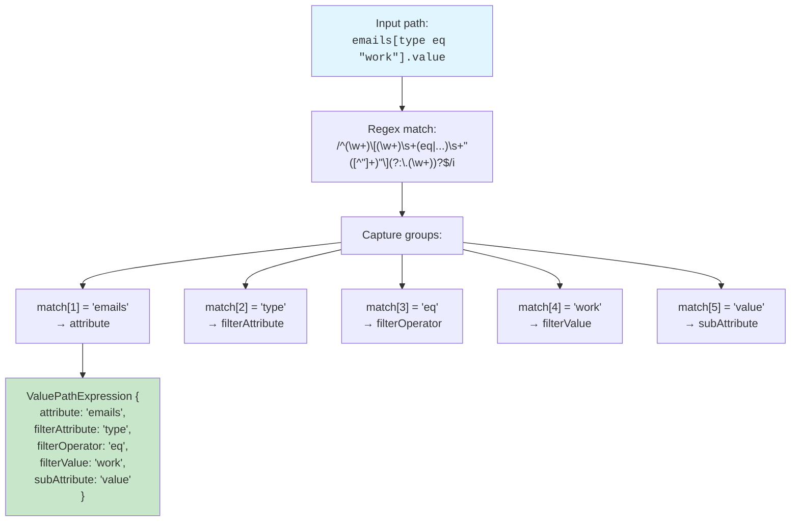

### Update Processing Diagram

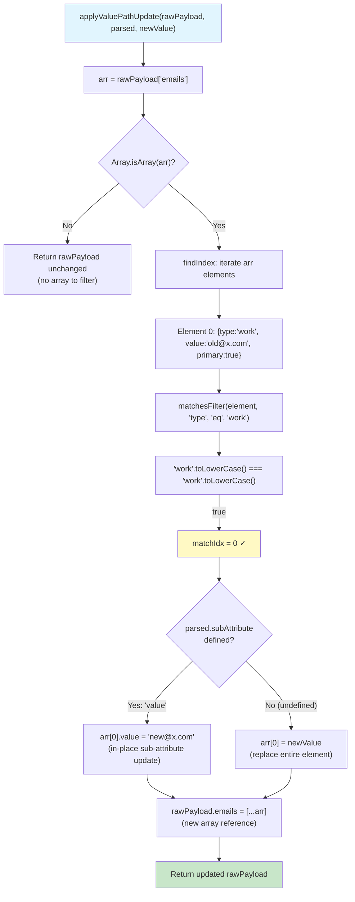

### Example Request — Replace Work Email Value

```http
PATCH /scim/endpoints/ep-001/Users/abc-123 HTTP/1.1
Content-Type: application/scim+json

{
  "schemas": ["urn:ietf:params:scim:api:messages:2.0:PatchOp"],
  "Operations": [
    {
      "op": "replace",
      "path": "emails[type eq \"work\"].value",
      "value": "newemail@contoso.com"
    }
  ]
}
```

**User's existing rawPayload in DB:**
```json
{
  "displayName": "John Doe",
  "emails": [
    { "type": "work", "value": "oldemail@contoso.com", "primary": true },
    { "type": "home", "value": "john@personal.com" }
  ]
}
```

### Expected Response (200 OK)

```json
{
  "schemas": ["urn:ietf:params:scim:schemas:core:2.0:User"],
  "id": "abc-123",
  "userName": "john@contoso.com",
  "active": true,
  "displayName": "John Doe",
  "emails": [
    { "type": "work", "value": "newemail@contoso.com", "primary": true },
    { "type": "home", "value": "john@personal.com" }
  ],
  "meta": { "resourceType": "User", "lastModified": "2026-02-09T..." }
}
```

### Before/After Comparison

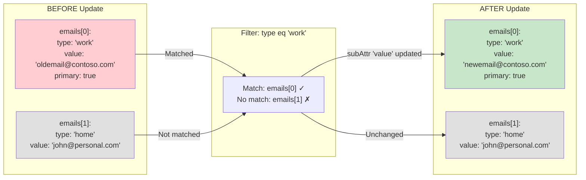

### Why This Output

| Element | Changed? | Reason |
|---------|----------|--------|
| `emails[0].value` | ✅ `old→new` | Matches filter `type eq "work"`, targeted sub-attribute is `value` |
| `emails[0].type` | ❌ Unchanged | Not the targeted sub-attribute |
| `emails[0].primary` | ❌ Unchanged | Not the targeted sub-attribute |
| `emails[1]` | ❌ Unchanged | Does not match filter `type eq "work"` |

### Example Request — Remove Work Email Entirely

```http
PATCH /scim/endpoints/ep-001/Users/abc-123 HTTP/1.1
Content-Type: application/scim+json

{
  "schemas": ["urn:ietf:params:scim:api:messages:2.0:PatchOp"],
  "Operations": [
    {
      "op": "remove",
      "path": "emails[type eq \"work\"]"
    }
  ]
}
```

### Expected Response (200 OK)

```json
{
  "schemas": ["urn:ietf:params:scim:schemas:core:2.0:User"],
  "id": "abc-123",
  "userName": "john@contoso.com",
  "emails": [
    { "type": "home", "value": "john@personal.com" }
  ],
  "meta": { ... }
}
```

### Remove Processing Diagram

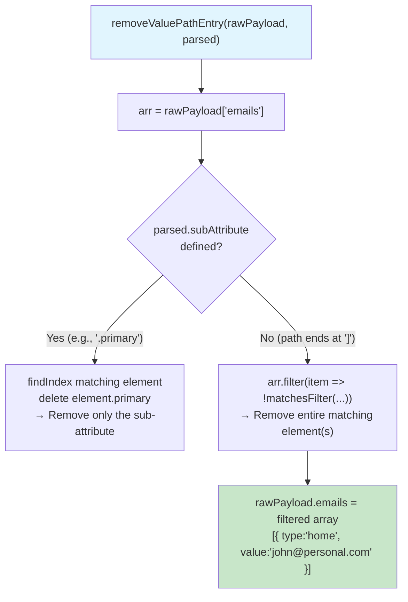

### Supported Filter Operators

Per RFC 7644 §3.4.2.2, the parser regex supports:

| Operator | Meaning | Example |
|----------|---------|---------|
| `eq` | Equal (case-insensitive for strings) | `type eq "work"` |
| `ne` | Not equal | `type ne "home"` |
| `co` | Contains | `value co "example"` |
| `sw` | Starts with | `value sw "admin"` |
| `ew` | Ends with | `value ew ".com"` |
| `gt` | Greater than | `count gt "5"` |
| `ge` | Greater than or equal | `count ge "5"` |
| `lt` | Less than | `count lt "10"` |
| `le` | Less than or equal | `count le "10"` |

> **Note**: Only `eq` has a dedicated case-insensitive implementation in `matchesFilter()`. Other operators fall back to strict string equality. This covers all Microsoft SCIM Validator test cases which only use `eq`.

---

## Change 5 — Enterprise Extension URN Paths

### SCIM Specification

**RFC 7643 §3.3 — Attribute Extensions** defines the mechanism:

> *"SCIM allows for extensions to define additional schema that
> extends existing resources and/or creates new resource types."*

**RFC 7643 §8 — Enterprise User Extension** defines the URN:

> *`urn:ietf:params:scim:schemas:extension:enterprise:2.0:User`*
>
> *Attributes: employeeNumber, costCenter, organization, division,
> department, manager.*

**RFC 7644 §3.10 — PATCH Path Filter** for extensions:

> *"attrPath  = [URI ":"] ATTRNAME *1subAttr"*
>
> *"The 'URI' prefix MUST be applied to attributes that are
> defined in a schema extension."*

This means a PATCH path like:
```
urn:ietf:params:scim:schemas:extension:enterprise:2.0:User:manager
```
Must be interpreted as: **within the extension schema `urn:...:User`**, update the **`manager` attribute**.

### What Changed

New functions in `scim-patch-path.ts`:
- `isExtensionPath(path)` — checks if path starts with a known extension URN + `:`
- `parseExtensionPath(path)` — splits into `{ schemaUrn, attributePath }`
- `applyExtensionUpdate(payload, parsed, value)` — creates/updates nested attribute in extension object
- `removeExtensionAttribute(payload, parsed)` — removes attribute from extension object

### URN Parsing Diagram

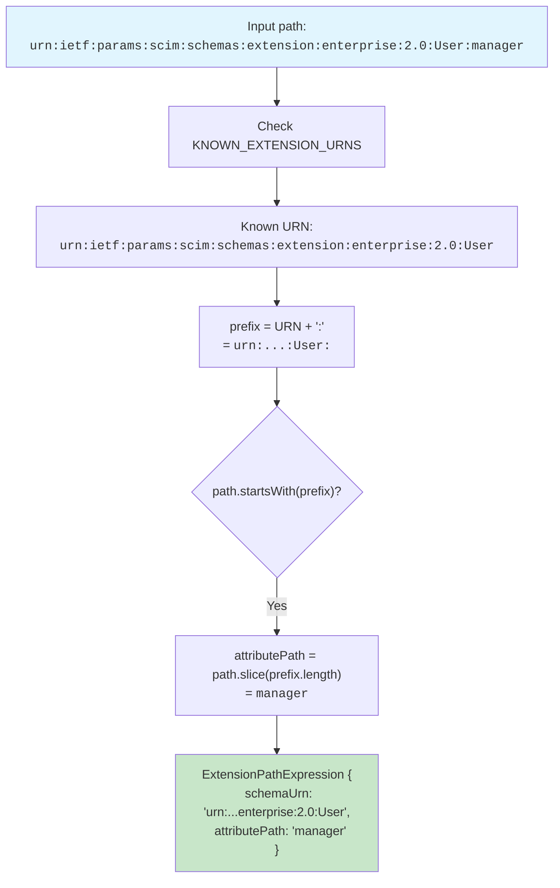

### Extension Update Diagram

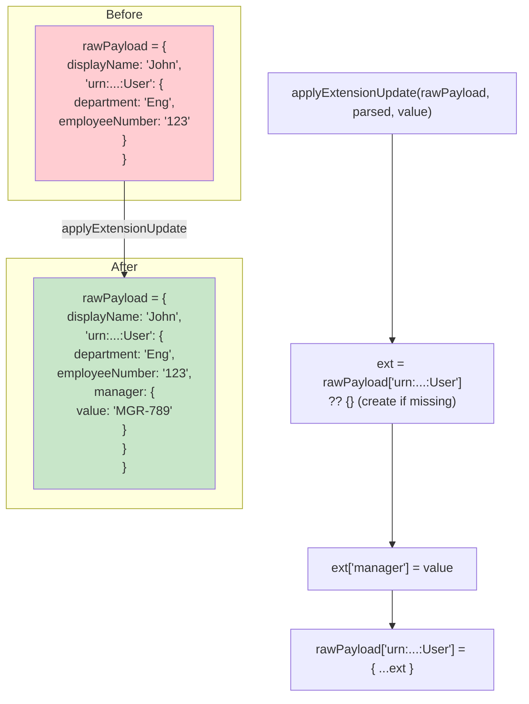

### Example Request — Add Manager

```http
PATCH /scim/endpoints/ep-001/Users/abc-123 HTTP/1.1
Content-Type: application/scim+json

{
  "schemas": ["urn:ietf:params:scim:api:messages:2.0:PatchOp"],
  "Operations": [
    {
      "op": "add",
      "path": "urn:ietf:params:scim:schemas:extension:enterprise:2.0:User:manager",
      "value": {
        "value": "MGR-789",
        "displayName": "Jane Manager"
      }
    }
  ]
}
```

**User's existing rawPayload:**
```json
{
  "displayName": "John Doe",
  "urn:ietf:params:scim:schemas:extension:enterprise:2.0:User": {
    "department": "Engineering",
    "employeeNumber": "12345"
  }
}
```

### Expected Response (200 OK)

```json
{
  "schemas": ["urn:ietf:params:scim:schemas:core:2.0:User"],
  "id": "abc-123",
  "userName": "john@contoso.com",
  "active": true,
  "displayName": "John Doe",
  "urn:ietf:params:scim:schemas:extension:enterprise:2.0:User": {
    "department": "Engineering",
    "employeeNumber": "12345",
    "manager": {
      "value": "MGR-789",
      "displayName": "Jane Manager"
    }
  },
  "meta": { "resourceType": "User", "lastModified": "2026-02-09T..." }
}
```

### Why This Output

| Extension Attribute | Changed? | Reason |
|---------------------|----------|--------|
| `department` | ❌ Unchanged | Not targeted by path |
| `employeeNumber` | ❌ Unchanged | Not targeted by path |
| `manager` | ✅ Added | Path `...User:manager` targets this attribute |

**Before the fix**: The path `urn:ietf:...:User:manager` fell through to the generic simple-path branch, which stored it as a **flat key**: `rawPayload["urn:...:User:manager"] = {...}`. This created a sibling key next to the existing `rawPayload["urn:...:User"]` object instead of nesting `manager` inside it. The SCIM Validator expected nested structure and failed.

### Example Request — Remove Manager

```http
PATCH /scim/endpoints/ep-001/Users/abc-123 HTTP/1.1
Content-Type: application/scim+json

{
  "schemas": ["urn:ietf:params:scim:api:messages:2.0:PatchOp"],
  "Operations": [
    {
      "op": "remove",
      "path": "urn:ietf:params:scim:schemas:extension:enterprise:2.0:User:manager"
    }
  ]
}
```

### Expected Response (200 OK)

```json
{
  "schemas": ["urn:ietf:params:scim:schemas:core:2.0:User"],
  "id": "abc-123",
  "userName": "john@contoso.com",
  "displayName": "John Doe",
  "urn:ietf:params:scim:schemas:extension:enterprise:2.0:User": {
    "department": "Engineering",
    "employeeNumber": "12345"
  },
  "meta": { ... }
}
```

### Extension Remove Diagram

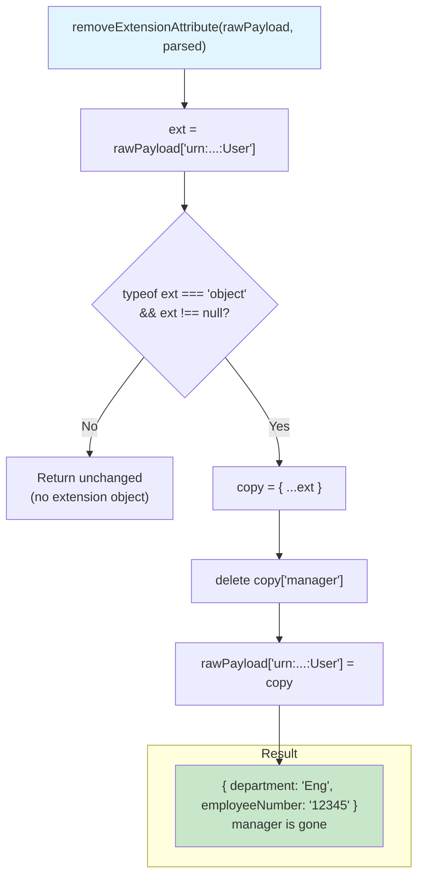

---

## Branch Priority & Decision Tree

The `applyPatchOperationsForEndpoint()` method evaluates PATCH operations through an ordered `if/else if` chain. This order is critical for correctness.

### Full Decision Tree (Add/Replace)

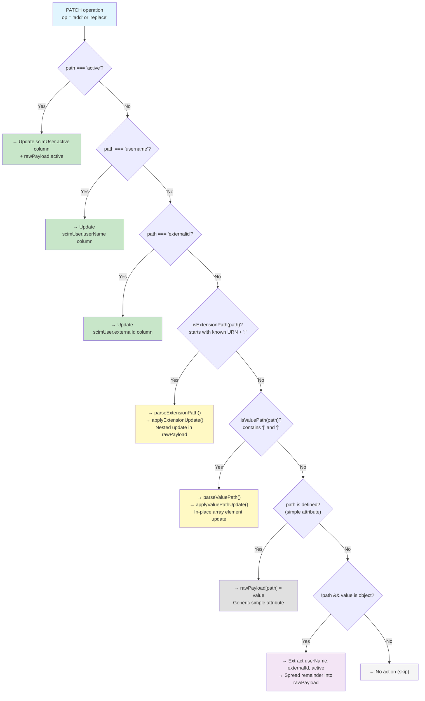

### Full Decision Tree (Remove)

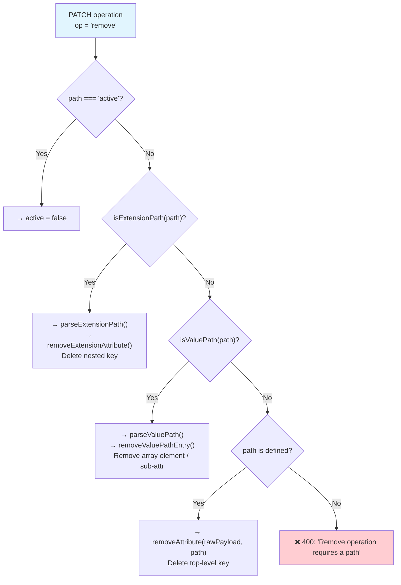

### Why This Order Matters

| Priority | Branch | Why it must come first |
|----------|--------|----------------------|
| 1-3 | `active` / `username` / `externalid` | DB columns must be caught before generic handlers would store them in rawPayload |
| 4 | Extension URN | Must be checked before valuePath — URN paths contain `:` but never `[`, so there's no ambiguity, but checking first avoids accidental partial-match on the simple-path fallback |
| 5 | ValuePath | Must be checked before simple-path — `emails[type eq "work"].value` contains dots and brackets that would be treated as a literal key name by the simple-path handler |
| 6 | Simple path | Catch-all for any remaining named attribute |
| 7 | No-path object | Only fires when path is truly absent; must be last to avoid false matches |

---

## Summary of SCIM Validator Tests Resolved

| # | Validator Test | Root Cause | Fix |
|---|----------------|------------|-----|
| 1 | PATCH User replace (no path) | userName not extracted from value object | Change 2 |
| 2 | PATCH User externalId (no path) | externalId not extracted from value object | Change 2 |
| 3 | PATCH User active (no path) | active not extracted from value object | Change 2 |
| 4 | PATCH Group replace (no path) | Object value rejected, only string accepted | Change 3 |
| 5 | PATCH Group externalId | No externalId path support for groups | Change 3 |
| 6 | PATCH User emails valuePath | `emails[type eq "work"].value` not parsed | Change 4 |
| 7 | PATCH User enterprise extension | `urn:...:User:manager` stored as flat key | Change 5 |

**Total: 7 of 13 failures resolved → 19 of 25 non-preview tests now expected to pass.**
