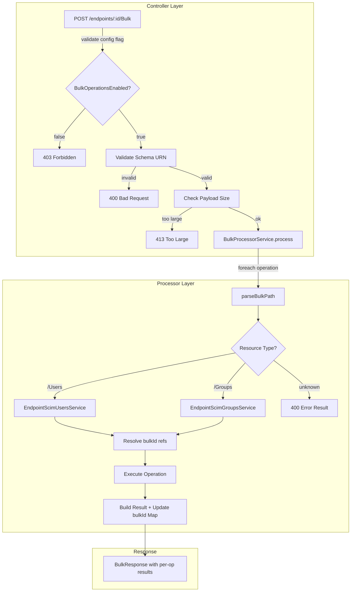
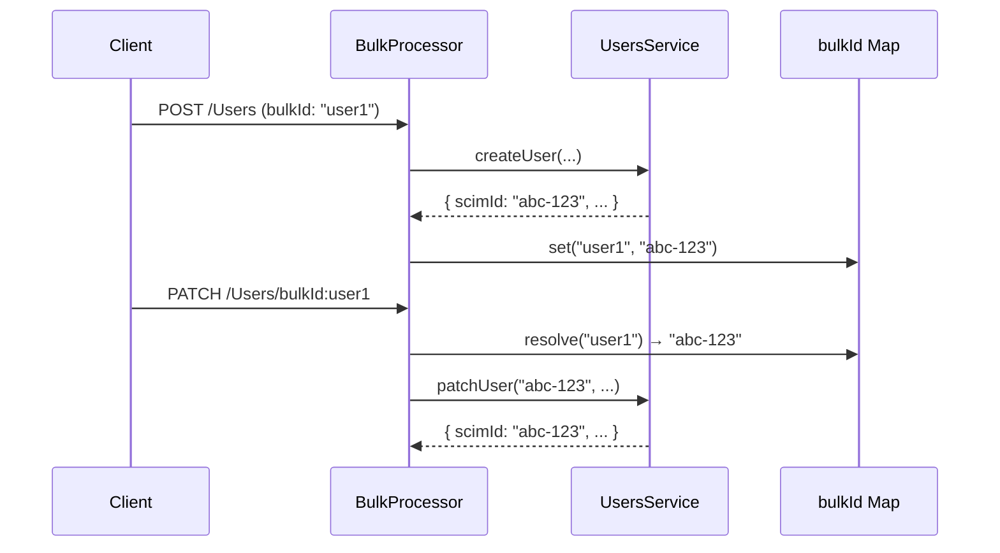

# Phase 9 — Bulk Operations (RFC 7644 §3.7)

> **Version**: v0.19.0 | **Phase**: 9 | **Status**: ✅ Complete  
> **RFC References**: RFC 7644 §3.7 (Bulk Operations)  
> **Branch**: `feat/torfc1stscimsvr`

---

## Overview

Phase 9 implements **SCIM Bulk Operations** per [RFC 7644 §3.7](https://datatracker.ietf.org/doc/html/rfc7644#section-3.7), enabling clients to send multiple SCIM operations (POST, PUT, PATCH, DELETE) in a single HTTP request. Operations are processed sequentially with support for:

- **Cross-operation references** via `bulkId` resolution
- **Fail-fast** via `failOnErrors` threshold
- **Per-operation error isolation** — individual failures don't abort the batch (unless `failOnErrors` triggers)
- **Both User and Group** resource types

This feature is **gated behind the `BulkOperationsEnabled` per-endpoint configuration flag** (default: `false`), ensuring zero impact on existing deployments.

---

## Architecture



### Key Design Decisions

| Decision | Rationale |
|----------|-----------|
| **Per-endpoint flag gating** | Zero-risk opt-in; existing endpoints unaffected |
| **Sequential processing** | RFC 7644 §3.7 requires ordered execution for `bulkId` cross-referencing |
| **Delegates to existing services** | Reuses `EndpointScimUsersService` and `EndpointScimGroupsService` — no duplicated CRUD logic |
| **Per-operation error isolation** | Individual operation failures return in-band error results; batch continues unless `failOnErrors` threshold reached |
| **`bulkId` Map\<string, string\>** | POST operations populate the map; subsequent operations resolve `bulkId:ref` references in paths and data |
| **Payload size guard** | `content-length` checked against `BULK_MAX_PAYLOAD_SIZE` (1MB) before processing; returns 413 with `scimType: 'tooLarge'` |
| **SPC advertises capabilities** | `ServiceProviderConfig.bulk.supported = true`, `maxOperations = 1000`, `maxPayloadSize = 1048576` |

---

## API Reference

### POST /scim/endpoints/:endpointId/Bulk

Process a batch of SCIM operations.

**Request Headers:**
- `Content-Type: application/scim+json`  
- `Authorization: Bearer <token>`

**Request Body (BulkRequest):**
```json
{
  "schemas": ["urn:ietf:params:scim:api:messages:2.0:BulkRequest"],
  "failOnErrors": 0,
  "Operations": [
    {
      "method": "POST",
      "path": "/Users",
      "bulkId": "user1",
      "data": {
        "schemas": ["urn:ietf:params:scim:schemas:core:2.0:User"],
        "userName": "jdoe@example.com",
        "displayName": "John Doe"
      }
    },
    {
      "method": "PATCH",
      "path": "/Users/bulkId:user1",
      "data": {
        "schemas": ["urn:ietf:params:scim:api:messages:2.0:PatchOp"],
        "Operations": [
          { "op": "replace", "path": "displayName", "value": "Jane Doe" }
        ]
      }
    }
  ]
}
```

**Response Body (BulkResponse):**
```json
{
  "schemas": ["urn:ietf:params:scim:api:messages:2.0:BulkResponse"],
  "Operations": [
    {
      "method": "POST",
      "bulkId": "user1",
      "location": "https://host/scim/endpoints/{id}/Users/{scimId}",
      "version": "W/\"v1\"",
      "status": "201"
    },
    {
      "method": "PATCH",
      "location": "https://host/scim/endpoints/{id}/Users/{scimId}",
      "version": "W/\"v2\"",
      "status": "200"
    }
  ]
}
```

### Error Responses

| Status | Condition |
|--------|-----------|
| 403 | `BulkOperationsEnabled` config flag not set or `false` |
| 400 | Missing `urn:ietf:params:scim:api:messages:2.0:BulkRequest` in `schemas[]` |
| 413 | Payload exceeds `BULK_MAX_PAYLOAD_SIZE` (1,048,576 bytes) |

### Per-Operation Error Result (in-band)

```json
{
  "method": "DELETE",
  "status": "404",
  "response": {
    "schemas": ["urn:ietf:params:scim:api:messages:2.0:Error"],
    "detail": "User not found",
    "status": "404"
  }
}
```

---

## Configuration

### Config Flag

| Flag | Type | Default | Description |
|------|------|---------|-------------|
| `BulkOperationsEnabled` | boolean | `false` | Gate bulk operations on the endpoint |

Enable via Admin API:
```bash
curl -X PATCH .../admin/endpoints/{id} \
  -d '{"config": {"BulkOperationsEnabled": "True"}}'
```

### ServiceProviderConfig

The SPC now advertises bulk support:
```json
{
  "bulk": {
    "supported": true,
    "maxOperations": 1000,
    "maxPayloadSize": 1048576
  }
}
```

### Constants

| Constant | Value | Location |
|----------|-------|----------|
| `BULK_MAX_OPERATIONS` | 1000 | `bulk-request.dto.ts` |
| `BULK_MAX_PAYLOAD_SIZE` | 1,048,576 (1MB) | `bulk-request.dto.ts` |
| `SCIM_BULK_REQUEST_SCHEMA` | `urn:ietf:params:scim:api:messages:2.0:BulkRequest` | `bulk-request.dto.ts` |
| `SCIM_BULK_RESPONSE_SCHEMA` | `urn:ietf:params:scim:api:messages:2.0:BulkResponse` | `bulk-request.dto.ts` |

---

## Implementation Files

### New Files

| File | Purpose | Lines |
|------|---------|-------|
| `dto/bulk-request.dto.ts` | BulkRequest/Response DTOs, constants, interfaces | ~172 |
| `services/bulk-processor.service.ts` | Sequential bulk operation processor with bulkId resolution | ~395 |
| `controllers/endpoint-scim-bulk.controller.ts` | POST /Bulk endpoint with config flag gate | ~115 |

### Modified Files

| File | Change |
|------|--------|
| `endpoint-config.interface.ts` | Added `BULK_OPERATIONS_ENABLED` flag constant, interface entry, default, validation |
| `scim-schemas.constants.ts` | SPC `bulk.supported` → `true`, `maxOperations` → `1000`, `maxPayloadSize` → `1048576` |
| `scim-constants.ts` | Added `TOO_LARGE: 'tooLarge'` to `SCIM_ERROR_TYPE` |
| `scim.module.ts` | Registered `EndpointScimBulkController` and `BulkProcessorService` |

---

## bulkId Cross-Referencing



The processor maintains a `Map<string, string>` that maps `bulkId` values to actual resource IDs created by POST operations. The regex pattern `bulkId:([^\s"]+)` is used to find and replace references in operation paths and nested data objects.

---

## failOnErrors Behavior

| `failOnErrors` Value | Behavior |
|---------------------|----------|
| `0` (default) | Process all operations regardless of failures |
| `N > 0` | Stop processing after `N` cumulative errors |

When processing stops early due to `failOnErrors`, remaining operations are not included in the response — only processed operations appear.

---

## Test Coverage

### Unit Tests (43 new)

| File | Tests | Coverage |
|------|-------|----------|
| `bulk-processor.service.spec.ts` | 32 | parseBulkPath, User CRUD, Group CRUD, unsupported types, bulkId resolution, failOnErrors, error handling, version pass-through, response schema, mixed operations |
| `endpoint-scim-bulk.controller.spec.ts` | 11 | Config flag gate (6 variants), endpoint validation, schema validation, payload size guard, successful processing delegation |

### E2E Tests (24 new)

| File | Tests | Coverage |
|------|-------|----------|
| `bulk-operations.e2e-spec.ts` | 24 | Config flag gating (3), User CRUD (4), Group CRUD (2), bulkId cross-referencing (3), failOnErrors (2), request validation (3), mixed operations (1), SPC (1), response format (4), uniqueness collision (1) |

### Live Integration Tests (18 new)

| Section | Tests | Coverage |
|---------|-------|----------|
| `9n` | 16 + 2 cleanup | Config flag gating (2), User CRUD via bulk (4), Group CRUD (2), bulkId cross-ref (1), failOnErrors (1), schema validation (1), unsupported type (1), mixed ops (1), SPC (1), response format (1), uniqueness collision (1), cleanup (2) |

### Updated Existing Tests (4)

| File | Change |
|------|--------|
| `service-provider-config.controller.spec.ts` | Updated `bulk.supported` → `true`, `maxOperations` → `1000`, `maxPayloadSize` → `1048576` |
| `scim-discovery.service.spec.ts` | Updated bulk assertions to match new SPC values |
| `endpoint-scim-discovery.controller.spec.ts` | Updated `bulk.supported` → `true` |

---

## Test Results Summary

| Level | Total | Passed | New |
|-------|-------|--------|-----|
| Unit | 2,320 | 2,320 ✅ | +43 (69 suites, +2) |
| E2E | 435 | 435 ✅ | +24 (22 suites, +1) |
| Live | 401 | 401 ✅ | +18 (section 9n) |
