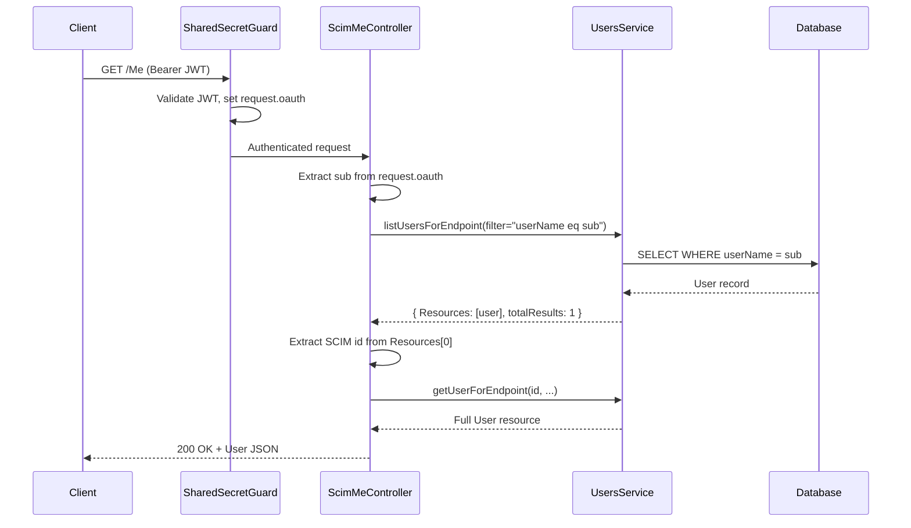

# Phase 10 — /Me Endpoint (RFC 7644 §3.11)

> **Version**: v0.20.0 | **Gap**: G10 | **Status**: ✅ Complete

---

## Overview

The `/Me` endpoint is a URI alias defined in RFC 7644 §3.11 that maps to the User resource associated with the currently authenticated subject. Instead of requiring the client to know its own SCIM `id`, `/Me` resolves the authenticated principal automatically.

## Architecture

### Identity Resolution Flow

### Error Cases

| Scenario | HTTP Status | SCIM Error |
|----------|-------------|------------|
| Legacy auth (no JWT) | 404 | `noTarget` — /Me requires OAuth with JWT sub claim |
| JWT missing `sub` claim | 404 | `noTarget` — JWT has no sub claim |
| No User with matching userName | 404 | `noTarget` — No User resource found |

## Implementation

### Files

| File | Purpose |
|------|---------|
| `api/src/modules/scim/controllers/scim-me.controller.ts` | Controller — identity resolution + CRUD delegation |
| `api/src/modules/scim/controllers/scim-me.controller.spec.ts` | 11 unit tests |
| `api/test/e2e/me-endpoint.e2e-spec.ts` | 10 E2E tests |
| `scripts/live-test.ps1` (section 9r) | 15 live integration tests |

### Supported Operations

| Method | Route | Description |
|--------|-------|-------------|
| GET | `/endpoints/:id/Me` | Read authenticated user |
| PUT | `/endpoints/:id/Me` | Replace authenticated user |
| PATCH | `/endpoints/:id/Me` | Partial update authenticated user |
| DELETE | `/endpoints/:id/Me` | Delete authenticated user |

All operations support `?attributes=` and `?excludedAttributes=` query parameters.

### Identity Resolution Strategy

1. Check `request.authType === 'oauth'` — reject legacy auth with 404
2. Extract `sub` claim from `request.oauth`
3. Query `listUsersForEndpoint({ filter: 'userName eq "${sub}"', count: 1 })`
4. Return `Resources[0].id` or throw 404

## Test Coverage

| Category | Count | Status |
|----------|-------|--------|
| Unit tests | 11 | ✅ All passing |
| E2E tests | 10 | ✅ All passing |
| Live integration tests | 15 | ✅ All passing |
| **Total** | **36** | **✅ All passing** |

## RFC References

- **RFC 7644 §3.11** — "/Me" Authenticated Subject Alias
- **RFC 7644 §3.2** — Creating Resources (POST)
- **RFC 7644 §3.5.1** — Replacing with PUT
- **RFC 7644 §3.5.2** — Modifying with PATCH
- **RFC 7644 §3.6** — Deleting Resources
