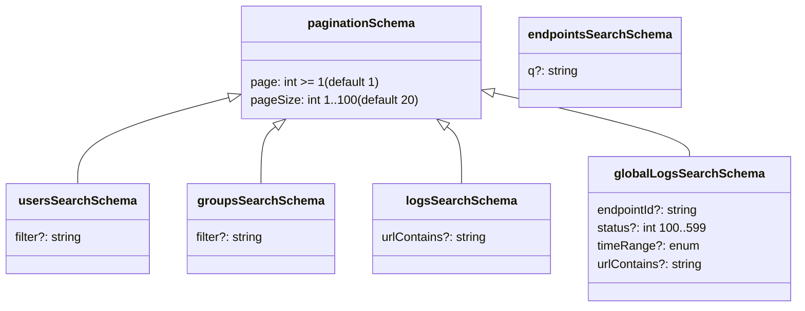
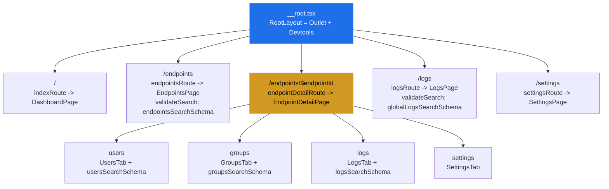
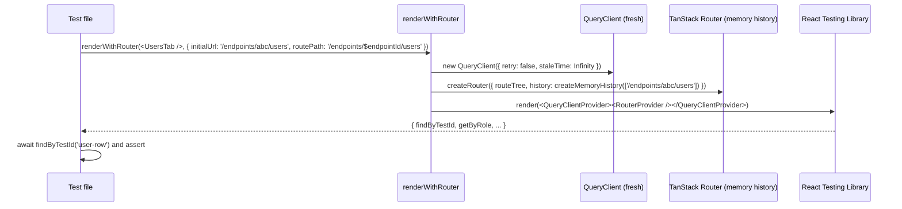

# Phase A1 - TanStack Router Foundation

> **Version:** 0.42.0-alpha.1 - **Date:** May 6, 2026  
> **Phase:** A1 (Foundation) of [UI_REDESIGN_REMAINING_GAPS_PLAN.md](UI_REDESIGN_REMAINING_GAPS_PLAN.md)  
> **Status:** Complete - additive scaffolding shipped, no production code wired in yet  
> **Predecessor:** None (this is the first phase of the gaps plan)  
> **Successor:** Phase A2 - cutover (replace `AppShell.AppRouter` with `<RouterProvider />`)

---

## 1. Summary

Phase A1 lands the entire TanStack Router foundation as **additive-only** scaffolding. Every existing test stays green, every existing user flow is unchanged, and the running UI continues to use the manual `currentPath` regex matcher inside [AppShell.tsx](../web/src/layout/AppShell.tsx). The new files are wired up, type-checked, and tested in isolation, but no production code path imports them. Cutover happens in Phase A2.

This doc explains what shipped, why each piece exists, and how the test layers prove the foundation is sound before A2 flips the switch.

---

## 2. Why Phase A1 First

The original UI redesign plan installed `@tanstack/react-router` v1.169 in [web/package.json](../web/package.json) but never used it. The current shell hand-rolls routing via:

- A `currentPath` field in [ui-store.ts](../web/src/store/ui-store.ts) (Zustand)
- A `navigate()` action that does `history.pushState` + sets `currentPath`
- A `popstate` listener that copies `window.location.pathname` back into `currentPath`
- An `AppRouter` component in [AppShell.tsx](../web/src/layout/AppShell.tsx) that does `currentPath.match(/^\/endpoints\/([^/]+)/)`

This setup has caused recurring bugs (sidebar 404s, /v2/ URL leak, broken back button, missing popstate handling) and fights React 19's concurrent rendering model. Replacing it with TanStack Router gives:

- Type-safe params via `useParams<{ endpointId: string }>()`
- Type-safe search params via zod `validateSearch`
- Loaders that run in parallel with renders (fewer `useEffect` chains)
- Built-in browser history integration (no popstate boilerplate)
- Devtools for the route tree, search-param state, and loader timing

A1 is dependency-free against everything else in the gaps plan, so it goes first.

---

## 3. What Shipped

### 3.1 Dependencies (commit `5a2a911`)

| Package | Where | Purpose |
|---------|-------|---------|
| `zod` | dependencies | Runtime URL search-param schemas |
| `@tanstack/router-devtools` | devDependencies | Browser inspector (dev-only, lazy-loaded) |

### 3.2 Search-param schemas (commit `dbdc0ef`)

[web/src/routes/search-schemas.ts](../web/src/routes/search-schemas.ts) defines six zod schemas plus the `TIME_RANGE_VALUES` constant. Each schema is exported as both a value and a TypeScript type via `z.infer<typeof schema>`.

| Schema | Used By | Search params |
|--------|---------|---------------|
| `paginationSchema` | base | `page`, `pageSize` |
| `usersSearchSchema` | UsersTab | + `filter` |
| `groupsSearchSchema` | GroupsTab | + `filter` |
| `logsSearchSchema` | per-endpoint LogsTab | + `urlContains` |
| `globalLogsSearchSchema` | LogsPage | + `endpointId`, `status`, `timeRange`, `urlContains` |
| `endpointsSearchSchema` | EndpointsPage | `q` |

**Conventions:** `page` is 1-indexed (UI convention), `pageSize` capped at 100 to match server-side `count` ceiling, empty-string filter values normalized to `undefined` (clean URL), `z.coerce.number()` throughout (URL search params arrive as strings), closed enum for `timeRange` to prevent UI/server divergence.

### 3.3 Route tree (commit `c06ebcf`)

| File | Path | Component | validateSearch |
|------|------|-----------|----------------|
| [__root.tsx](../web/src/routes/__root.tsx) | (root) | `<Outlet />` + dev-only `<TanStackRouterDevtools />` | - |
| [index.tsx](../web/src/routes/index.tsx) | `/` | `DashboardPage` | - |
| [endpoints.tsx](../web/src/routes/endpoints.tsx) | `/endpoints` | `EndpointsPage` | `endpointsSearchSchema` |
| [endpoints.$endpointId.tsx](../web/src/routes/endpoints.$endpointId.tsx) | `/endpoints/$endpointId` | `EndpointDetailPage` (layout) | - |
| [endpoints.$endpointId.users.tsx](../web/src/routes/endpoints.$endpointId.users.tsx) | `users` | `UsersTab` | `usersSearchSchema` |
| [endpoints.$endpointId.groups.tsx](../web/src/routes/endpoints.$endpointId.groups.tsx) | `groups` | `GroupsTab` | `groupsSearchSchema` |
| [endpoints.$endpointId.logs.tsx](../web/src/routes/endpoints.$endpointId.logs.tsx) | `logs` | `LogsTab` | `logsSearchSchema` |
| [endpoints.$endpointId.settings.tsx](../web/src/routes/endpoints.$endpointId.settings.tsx) | `settings` | `SettingsTab` | - |
| [logs.tsx](../web/src/routes/logs.tsx) | `/logs` | `LogsPage` | `globalLogsSearchSchema` |
| [settings.tsx](../web/src/routes/settings.tsx) | `/settings` | `SettingsPage` | - |
| [router.ts](../web/src/router.ts) | (assembly) | `createRouter` + `defaultPreload: 'intent'` + `defaultPreloadStaleTime: 30_000` | - |

The `__root.tsx` lazy-loads `@tanstack/router-devtools` with `React.lazy` gated on `import.meta.env.DEV` so production bundles tree-shake it. The `router.ts` registers a TypeScript module augmentation (`declare module '@tanstack/react-router' { interface Register { router: typeof router } }`) so `useParams` and `useSearch` infer the correct types in consumer components without explicit generics.

### 3.4 Test helper (commit `de8133a`)

[web/src/test/router-test-utils.tsx](../web/src/test/router-test-utils.tsx) exports `renderWithRouter(ui, { initialUrl, routePath, ...renderOptions })` which mounts `ui` inside a fresh in-memory router so hooks like `useParams`, `useSearch`, and `<Link>` work in tests.

Key design choices:
- **Catch-all default `routePath: '/$'`** so most tests just pass a UI element and an initial URL.
- **Opt-in typed params** via `routePath: '/endpoints/$endpointId/users'` so `useParams` exposes the correct param names for the test.
- **Fresh QueryClient per call** with retry disabled and infinite stale time so tests are deterministic.
- **`findByTestId` (async)** is required because `RouterProvider` resolves the initial route asynchronously - this is documented in the helper's JSDoc and the test file demonstrates it.

---

## 4. Test Layers

| Layer | File | Tests | Status |
|-------|------|-------|--------|
| Unit (schemas) | [search-schemas.test.ts](../web/src/routes/search-schemas.test.ts) | 20 | Pass |
| Unit (route tree) | [router.test.ts](../web/src/router.test.ts) | 4 | Pass |
| Unit (test helper) | [router-test-utils.test.tsx](../web/src/test/router-test-utils.test.tsx) | 4 | Pass |
| Full vitest suite | (all) | 268/268 (was 240 baseline + 28 new) | Pass |
| Production build | `vite build` | clean (9.51s) | Pass |
| TypeScript | `tsc --noEmit` (new files only) | 0 errors | Pass |

**Schema tests cover:**
- Defaults (page=1, pageSize=20)
- Coercion of numeric strings from URL (`?page=3` -> `3`)
- Bounds (page >= 1, pageSize 1..100)
- Garbage rejection (non-numeric, out-of-range)
- Empty-string -> undefined normalization (clean URLs)
- Closed-enum validation for `timeRange`
- TypeScript type inference (compile-time check)

**Router tests cover:**
- `router` and `routeTree` are exported and built
- All top-level paths exist (`/`, `/endpoints`, `/logs`, `/settings`)
- Endpoint detail has the 4 nested tab routes
- `defaultPreload` is `'intent'` (hover/focus prefetch)

**Test helper tests cover:**
- Basic mount inside router context
- Route param parsing via `routePath` (`/endpoints/$endpointId/users` -> `endpointId='abc-123'`)
- Search-param parsing (`?page=3&pageSize=50` -> typed numbers)
- `<Link>` rendering without crashes

---

## 5. Why No Backend Changes

Phase A1 is frontend-only scaffolding. The API surface is unchanged, so:
- No new E2E tests
- No new live-test sections
- No version bump on backend behavior - the `0.42.0-alpha.1` bump is for parity with the web package and to mark the start of the alpha series for the router migration
- 869+ live SCIM tests continue to pass against existing dev deployment v0.41.0

Backend work for the gaps plan starts in **Phase B** (`GET /admin/endpoints/:id/overview`).

---

## 6. What Did Not Ship in A1

These items are intentionally deferred:

| Item | Phase | Reason |
|------|-------|--------|
| Wire `<RouterProvider />` into `App.tsx` | A2 | Cutover is a separate, revertible commit |
| Strip `AppRouter` regex from `AppShell` | A2 | Cutover |
| Strip `currentPath` / `navigate` from `ui-store.ts` | A2 | Cutover |
| Replace Zustand `navigate` with `<Link>` | A2 | Cutover |
| Convert tab `useState` to nested route `<Outlet />` | A3 | Per-page migration |
| Move `PAGE_SIZE` `useState` to URL search params | A3 | Per-page migration |
| Move log `urlContains` filter to URL | A3 | Per-page migration |
| Add loaders + `preload="intent"` on Links | A4 | Polish |
| Update Playwright tests for URL-based assertions | A5 | E2E |

Each phase will land independently with its own tests, doc updates, and quality gates per the standing rule.

---

## 7. Risk Register

| Risk | Likelihood | Impact | Mitigation |
|------|-----------|--------|------------|
| `import 'zod'` increases bundle size | Low | Low | zod tree-shakes well; baseline budget set in Phase H6 |
| Devtools accidentally ship to prod | Low | Low | `import.meta.env.DEV` gate + `React.lazy` makes prod bundle drop them |
| Module augmentation conflicts with future routers | Low | Medium | Single `Register` interface; documented in router.ts |
| Test helper diverges from production router | Medium | Low | Helper uses fresh `createRouter`; production routes are tested separately in `router.test.ts` |
| Search-param schemas drift from server-side filters | Medium | Medium | Phase A3 wires consumers; integration tests in Phase H1 (MSW) cover both sides |

---

## 8. Definition of Done (A1)

- [x] `zod` and `@tanstack/router-devtools` installed
- [x] All six search-param schemas implemented and unit-tested
- [x] All ten route files (`__root` + 9 leaves) created
- [x] `router.ts` assembles route tree and exports the `Router` instance
- [x] `renderWithRouter` test helper covering common test scenarios
- [x] Web vitest suite passes (268/268)
- [x] Production build succeeds (`vite build` clean)
- [x] Zero TypeScript errors in new files
- [x] Version bumped to `0.42.0-alpha.1` in [api/package.json](../api/package.json) and [web/package.json](../web/package.json)
- [x] Doc shipped (this file)
- [x] [INDEX.md](INDEX.md), [CHANGELOG.md](../CHANGELOG.md), [Session_starter.md](../Session_starter.md) updated
- [ ] Quality gates run pre-A2 (deferred - A1 is additive, gates run as block at A2 cutover when behavior changes)

---

## 9. Next Up - Phase A2 (Cutover)

| Step | Change | Risk |
|------|--------|------|
| Modify [App.tsx](../web/src/App.tsx) to use `<RouterProvider router={router} />` | Medium - cutover | Keep `?ui=legacy` switch to allow rollback |
| Strip `AppRouter` regex from [AppShell.tsx](../web/src/layout/AppShell.tsx) | Low | Replaced by route tree |
| Strip `currentPath`, `navigate()`, popstate listener from [ui-store.ts](../web/src/store/ui-store.ts) | Low | URL is source of truth now |
| Replace Zustand `navigate` with `<Link>` + `useRouterState()` in [AppSidebar.tsx](../web/src/layout/AppSidebar.tsx) | Low | Per-component swap |
| Replace `useUIStore(navigate)` with `<Link>` in [DashboardPage.tsx](../web/src/pages/DashboardPage.tsx) and [EndpointsPage.tsx](../web/src/pages/EndpointsPage.tsx) | Low | Per-component swap |
| Update ~17 unit tests with `renderWithRouter` helper | Low | Helper from A1.6 ready |
| Smoke test: navigate every route, browser back/forward, deep-link refresh | Medium | Manual + Playwright |

A2 is the single cutover commit (or small commit chain) where behavior changes. Quality gates run there. Bump after A2: `0.42.0-alpha.1` -> `0.42.0-beta.1`.

---

## Cross-References

- [UI_REDESIGN_REMAINING_GAPS_PLAN.md](UI_REDESIGN_REMAINING_GAPS_PLAN.md) - the parent plan
- [UI_REDESIGN_ARCHITECTURE_AND_PLAN.md](UI_REDESIGN_ARCHITECTURE_AND_PLAN.md) - original 42-step plan, section 5.2 route structure
- [DELIVERY_PLAN.md](DELIVERY_PLAN.md) - active 6-week delivery plan
- [UI_GUIDE.md](UI_GUIDE.md) - user-facing UI guide
