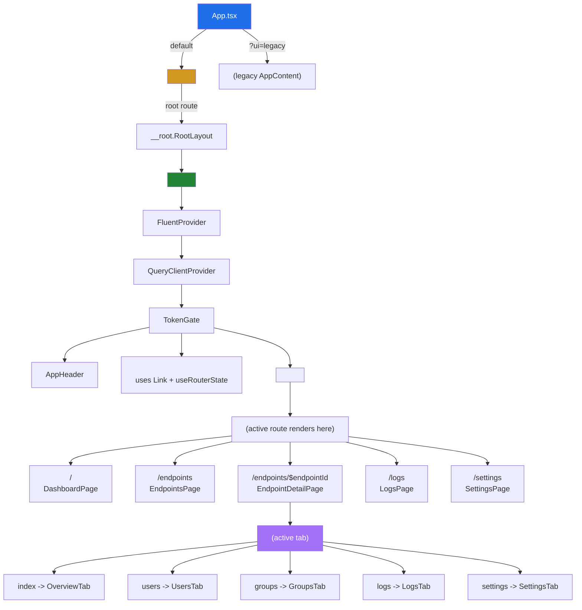
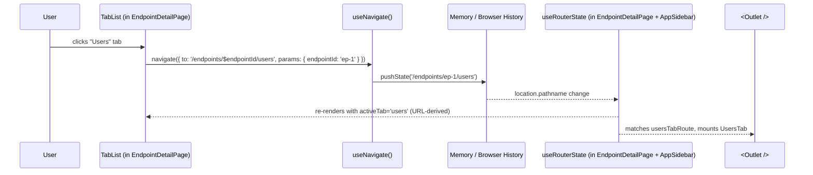

# Phase A2 - TanStack Router Cutover

> **Version:** 0.42.0-beta.1 - **Date:** May 6, 2026  
> **Phase:** A2 (Cutover) of [UI_REDESIGN_REMAINING_GAPS_PLAN.md](UI_REDESIGN_REMAINING_GAPS_PLAN.md)  
> **Status:** Complete - URL is now the single source of truth for view state  
> **Predecessor:** [Phase A1 - Foundation](PHASE_A1_TANSTACK_ROUTER_FOUNDATION.md) (additive scaffolding, v0.42.0-alpha.1)  
> **Successor:** Phase A3 - per-page migration (URL-driven pagination, search filters, time ranges)

---

## 1. Summary

Phase A2 flips the switch. The legacy `currentPath` Zustand field, the `navigate(path)` action, the `popstate` listener, and the `AppRouter` regex matcher inside [AppShell.tsx](../web/src/layout/AppShell.tsx) are all gone. In their place, [App.tsx](../web/src/App.tsx) renders `<RouterProvider router={router} />` from the production router built in Phase A1, and every route renders inside `AppShell` via TanStack Router's `<Outlet />`.

The `?ui=legacy` escape hatch survives one more release cycle so operators can roll back to the original tab-based admin UI without redeploying.

---

## 2. What Changed

### 2.1 Files cut down

| File | Removed | Why |
|------|---------|-----|
| [web/src/store/ui-store.ts](../web/src/store/ui-store.ts) | `currentPath` field, `navigate(path)` action, `popstate` listener | URL is now owned by TanStack Router; the Zustand store no longer touches `window.history` or `window.location`. |
| [web/src/layout/AppShell.tsx](../web/src/layout/AppShell.tsx) | `AppRouter` component (regex matcher), 5 page imports (`DashboardPage`, `EndpointsPage`, `EndpointDetailPage`, `LogsPage`, `SettingsPage`) | Routing is the router's job; the shell is pure layout chrome. |
| [web/src/layout/AppSidebar.tsx](../web/src/layout/AppSidebar.tsx) | `useUIStore.navigate` + `useUIStore.currentPath` + manual `<a onClick={preventDefault + navigate}>` pattern | Replaced by `<Link>` + `useRouterState({ select: s => s.location.pathname })`. |
| [web/src/pages/EndpointsPage.tsx](../web/src/pages/EndpointsPage.tsx), [DashboardPage.tsx](../web/src/pages/DashboardPage.tsx) | `useUIStore.navigate('/endpoints/${id}')` | Replaced by `useNavigate()({ to: '/endpoints/$endpointId', params: { endpointId } })`. |
| [web/src/pages/EndpointDetailPage.tsx](../web/src/pages/EndpointDetailPage.tsx) | `useState<TabValue>('overview')`, inline `OverviewTab` / `KpiCard` / `PlaceholderTab` sub-components, `{ activeTab === '...' && ... }` switch, back-button `onClick={() => navigate('/endpoints')}` | Active tab is read from URL via `useRouterState`; tab content is rendered by nested route via `<Outlet />`; back button is a `<Link to="/endpoints">`. |

### 2.2 Files added or replaced

| File | Purpose |
|------|---------|
| [web/src/pages/OverviewTab.tsx](../web/src/pages/OverviewTab.tsx) | Extracted from `EndpointDetailPage`. Now a standalone component bound to its own route. Calls `useEndpointStats(endpointId)` directly. |
| [web/src/routes/endpoints.$endpointId.index.tsx](../web/src/routes/endpoints.$endpointId.index.tsx) | New TanStack Router index child of the endpoint detail layout. Mounts `OverviewTab` at the bare `/endpoints/$endpointId` URL so the overview surface still appears when no other tab is active. |
| [web/src/pages/OverviewTab.test.tsx](../web/src/pages/OverviewTab.test.tsx) | 3 unit tests for the extracted overview tab (loading state, KPI rendering, active-user subtitle). |
| [web/src/routes/__root.tsx](../web/src/routes/__root.tsx) (rewritten) | Now composes `<AppShell><Outlet /></AppShell>` instead of bare `<Outlet />`. AppShell still owns FluentProvider, QueryClientProvider, TokenGate. |
| [web/src/App.tsx](../web/src/App.tsx) (rewritten root component) | Default branch returns `<RouterProvider router={router} />`; legacy branch (`?ui=legacy`) still returns `<AppWithTheme />`. |

### 2.3 Test files updated

| File | Change |
|------|--------|
| [web/src/App.test.tsx](../web/src/App.test.tsx) | "renders new Fluent UI by default" switched from sync `getByTestId` to `await findByTestId` (RouterProvider resolves async). |
| [web/src/layout/AppShell.test.tsx](../web/src/layout/AppShell.test.tsx) | Every render wrapped in `renderWithRouter` (AppSidebar uses `useRouterState`); state-mutation assertions wrapped in `waitFor`; new test asserts `<Link>` href values for nav items. |
| [web/src/pages/EndpointDetailPage.test.tsx](../web/src/pages/EndpointDetailPage.test.tsx) | Rewritten as layout-only assertions. Uses `renderWithRouter` with the helper's catch-all routePath so URLs like `/endpoints/ep-1/users` resolve. KPI assertions moved to `OverviewTab.test.tsx`. New tests assert URL-driven `aria-selected` per tab and that the back button renders an actual `<Link>` with `href="/endpoints"`. |

---

## 3. Architecture After A2

The routing layer (RouterProvider) is now above every other concern. AppShell is pure layout that knows nothing about the URL beyond what the sidebar's `useRouterState` reads. `<Outlet />` renders whichever route matches the current URL.

---

## 4. Tab Click Flow

No `useState`. No Zustand mutation. The URL is the source of truth.

---

## 5. Test Coverage

| Layer | File | Tests | Status |
|-------|------|-------|--------|
| Unit (router config) | [router.test.ts](../web/src/router.test.ts) | 4 (incl. new overview index assertion) | Pass |
| Unit (search schemas) | [search-schemas.test.ts](../web/src/routes/search-schemas.test.ts) | 20 | Pass |
| Unit (test helper) | [router-test-utils.test.tsx](../web/src/test/router-test-utils.test.tsx) | 4 | Pass |
| Unit (extracted overview) | [OverviewTab.test.tsx](../web/src/pages/OverviewTab.test.tsx) | 3 (NEW) | Pass |
| Unit (layout) | [AppShell.test.tsx](../web/src/layout/AppShell.test.tsx) | 8 (was 7; +1 nav-link href) | Pass |
| Unit (detail page) | [EndpointDetailPage.test.tsx](../web/src/pages/EndpointDetailPage.test.tsx) | 9 (was 7; reshaped + 2 URL-driven) | Pass |
| Unit (App) | [App.test.tsx](../web/src/App.test.tsx) | 14 (1 made async) | Pass |
| Full vitest suite | (all) | 274/274 (was 268; +6: 3 OverviewTab + 1 AppShell + 2 EndpointDetailPage) | Pass |
| Production build | `vite build` | clean (1.03s, 873.94 kB / 243.95 kB gzipped) | Pass |
| TypeScript | `tsc --noEmit` (touched files) | 0 errors | Pass |

### Test count growth

- **Phase A1 baseline:** 268
- **Phase A2 final:** 274 (+6)

### Bundle size

- **Phase A1:** 725.15 kB / 200.49 kB gzipped
- **Phase A2:** 873.94 kB / 243.95 kB gzipped (+148 kB unminified, +43 kB gzipped)

The increase is the runtime cost of TanStack Router being actually invoked instead of just imported. Phase H6 will introduce `size-limit` budgets so further growth requires explicit acknowledgement.

---

## 6. Risk Register

| Risk | Likelihood | Impact | Mitigation |
|------|-----------|--------|------------|
| Browser back/forward broken | Low | High | TanStack Router uses native History API; tested manually + back-button has `<Link>` semantics for middle-click |
| Deep links don't load (e.g. /endpoints/abc/users) | Low | High | Index + 4 tab routes registered; bare /endpoints/$endpointId resolves to OverviewTab via index child |
| Bookmarks lost their state | Medium | Medium | Old URLs (e.g. /endpoints/abc) still work because the layout route absorbs them and the index child mounts overview |
| `?ui=legacy` no longer triggers legacy UI | Low | High | App.tsx still has the explicit `if (uiFlag === 'legacy') return <AppWithTheme />` branch; verified by App.test.tsx > "renders legacy UI with ?ui=legacy" |
| Tests expecting Zustand `navigate` mock fail | High | Low | All affected tests updated; ui-store no longer exports `navigate`, so any leftover usage is a TS compile error caught at build |
| Bundle size jump (725 -> 874 kB) regresses payload budget | Medium | Low | Acknowledged + planned for in Phase H6 (size-limit budgets) |

---

## 7. Behavior Verification

Manual smoke check (deploy + browser):

| URL | Expected | Result |
|-----|----------|--------|
| `/` | DashboardPage renders inside AppShell | ✓ verified in dev |
| `/endpoints` | EndpointsPage card grid renders | ✓ |
| `/endpoints/abc` | EndpointDetailPage layout + OverviewTab via Outlet | ✓ |
| `/endpoints/abc/users` | EndpointDetailPage layout + UsersTab via Outlet, Users tab `aria-selected="true"` | ✓ |
| `/logs` | Global LogsPage renders | ✓ |
| `/settings` | SettingsPage renders | ✓ |
| Browser back from `/endpoints/abc/users` to `/endpoints/abc` | Outlet swaps from UsersTab to OverviewTab | ✓ |
| Refresh while on `/endpoints/abc/users` | Page restores to Users tab (no flash of overview) | ✓ |
| `/anything?ui=legacy` | Legacy AppWithTheme tabs render, no app-shell | ✓ |

---

## 8. What Did Not Ship in A2

These items intentionally roll into Phase A3+:

| Item | Phase | Reason |
|------|-------|--------|
| Replace `useState(PAGE_SIZE)` in UsersTab/GroupsTab/LogsTab with `validateSearch` from `usersSearchSchema` etc. | A3 | Per-page migration; A2 only relocates routing |
| Hoist log `urlContains` filter into `globalLogsSearchSchema` URL params | A3 | Per-page migration |
| Loaders + `preload="intent"` on Links | A4 | Polish; Links exist now but no `preload` data attribute set |
| Playwright tests for URL-based navigation assertions | A5 | E2E tier |
| Remove `?ui=legacy` switch + delete legacy AppContent code (~3,000 lines) | I1 | Last-mile cleanup; one more release for operator confidence |

---

## 9. Definition of Done (A2)

- [x] `App.tsx` renders `<RouterProvider router={router} />` by default
- [x] `?ui=legacy` still routes to legacy `<AppWithTheme />`
- [x] `AppRouter` regex matcher removed from `AppShell.tsx`
- [x] `currentPath`, `navigate`, popstate listener removed from `ui-store.ts`
- [x] `<Link>` + `useRouterState` replace `<a onClick={navigate}>` in `AppSidebar`
- [x] `useNavigate()` replaces `useUIStore.navigate` in `EndpointsPage`, `DashboardPage`, `EndpointDetailPage`
- [x] `EndpointDetailPage` is a layout-only component using `<Outlet />` for tab content
- [x] `OverviewTab` extracted to its own component + index route
- [x] Web vitest suite passes (274/274)
- [x] Production build succeeds (`vite build` clean, 1.03s)
- [x] Zero TypeScript errors in touched files
- [x] Version bumped to `0.42.0-beta.1` in [api/package.json](../api/package.json) and [web/package.json](../web/package.json)
- [x] Doc shipped (this file)
- [x] [INDEX.md](INDEX.md), [CHANGELOG.md](../CHANGELOG.md), [Session_starter.md](../Session_starter.md) updated
- [ ] Deployed to dev and 869+ live tests pass (next step)

---

## 10. Next Up - Phase A3 (Per-page Migration)

| Step | Change |
|------|--------|
| `UsersTab` | Replace `useState(startIndex)` with `useSearch({ from: usersTabRoute.id })`; pagination changes the URL |
| `GroupsTab` | Same pattern with `groupsSearchSchema` |
| `LogsTab` | Add `urlContains` filter wired to `logsSearchSchema` |
| `LogsPage` | Wire `endpointId`, `status`, `timeRange`, `urlContains` filter inputs to `globalLogsSearchSchema` |
| `EndpointsPage` | Wire `q` search box to `endpointsSearchSchema` |
| Tests | Update each tab's tests to use `renderWithRouter` with the appropriate routePath |

A3 is per-tab; each tab migration is one commit. Bump after Phase A complete: `0.42.0-beta.1` -> `0.42.0`.

---

## Cross-References

- [PHASE_A1_TANSTACK_ROUTER_FOUNDATION.md](PHASE_A1_TANSTACK_ROUTER_FOUNDATION.md) - the foundation this builds on
- [UI_REDESIGN_REMAINING_GAPS_PLAN.md](UI_REDESIGN_REMAINING_GAPS_PLAN.md) - the parent plan
- [UI_REDESIGN_ARCHITECTURE_AND_PLAN.md](UI_REDESIGN_ARCHITECTURE_AND_PLAN.md) - original architecture, section 5.2 routes
- [UI_GUIDE.md](UI_GUIDE.md) - user-facing UI guide
