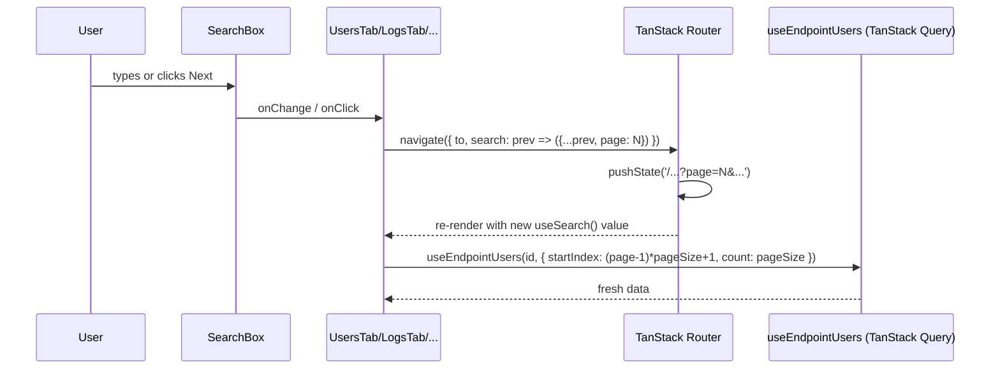

# Phase A3 - Per-Page URL-Driven State

> **Version:** 0.42.0-beta.2 - **Date:** May 6, 2026  
> **Phase:** A3 (per-page migration) of [UI_REDESIGN_REMAINING_GAPS_PLAN.md](UI_REDESIGN_REMAINING_GAPS_PLAN.md)  
> **Status:** Complete - pagination + filter inputs now live in the URL  
> **Predecessor:** [Phase A2 - Cutover](PHASE_A2_TANSTACK_ROUTER_CUTOVER.md) (RouterProvider wired, v0.42.0-beta.1)  
> **Successor:** Phase A4 - polish (loaders + `preload="intent"`)

---

## 1. Summary

Phase A3 hoists per-page React state into the URL via TanStack Router's `useSearch` + `useNavigate`. The five list/filter views below previously kept pagination and filter-input state in `useState` calls scoped to the component. After A3, those values are derived from the URL and parsed by zod schemas (`web/src/routes/search-schemas.ts`), making every paginated view shareable, bookmarkable, and refresh-stable.

## 2. What Changed

| File | Before | After |
|------|--------|-------|
| [UsersTab.tsx](../web/src/pages/UsersTab.tsx) | `useState(startIndex)` + Prev/Next mutate state | `useSearch` reads `page`/`pageSize`; Prev/Next call `useNavigate({ search })` |
| [GroupsTab.tsx](../web/src/pages/GroupsTab.tsx) | `useState(startIndex)` | `useSearch` + `useNavigate` (groupsSearchSchema) |
| [LogsTab.tsx](../web/src/pages/LogsTab.tsx) | `useState(page)` + `useState(search)` for `urlContains` | `useSearch` exposes `page` + `urlContains`; SearchBox typing dispatches navigate, resets to page 1 |
| [LogsPage.tsx](../web/src/pages/LogsPage.tsx) | `useState(search)` | `useSearch` exposes `urlContains`; navigate normalizes empty -> undefined |
| [EndpointsPage.tsx](../web/src/pages/EndpointsPage.tsx) | `useState(search)` | `useSearch` exposes `q`; navigate updates URL on every keystroke |
| [router-test-utils.tsx](../web/src/test/router-test-utils.tsx) | catch-all route, no schema | New `validateSearch` option threads zod schema through to the in-memory router so tests parse search params with the same fidelity as production |

## 3. URL contract

| Route | Search params | Schema |
|-------|---------------|--------|
| `/endpoints?q=...` | `q` (free text) | `endpointsSearchSchema` |
| `/endpoints/$id/users?page=N&pageSize=N&filter=...` | pagination + SCIM filter | `usersSearchSchema` |
| `/endpoints/$id/groups?page=N&pageSize=N&filter=...` | pagination + SCIM filter | `groupsSearchSchema` |
| `/endpoints/$id/logs?page=N&pageSize=N&urlContains=...` | pagination + URL substring | `logsSearchSchema` |
| `/logs?endpointId=...&status=...&timeRange=...&urlContains=...&page=N&pageSize=N` | global log filters | `globalLogsSearchSchema` |

Empty filter values normalize to `undefined` so URLs stay clean (`?q=` collapses to `/endpoints`).

## 4. Reading the URL: the `useSearch({ strict: false })` pattern

Each component uses `useSearch({ strict: false })` and falls back to defaults (`page=1`, `pageSize=20`) when the hook returns an empty object. This keeps the components renderable in unit tests that haven't fully wired the route's schema, while still benefiting from the production schema's coercion (string -> number) when used inside the real router.

## 5. Test Coverage

| Layer | File | Tests | Status |
|-------|------|-------|--------|
| Unit (helper) | [router-test-utils.test.tsx](../web/src/test/router-test-utils.test.tsx) | 5 (was 4; +1 for `validateSearch` option) | Pass |
| Unit (UsersTab) | [UsersTab.test.tsx](../web/src/pages/UsersTab.test.tsx) | 9 (was 8; +1 URL `?page=2` -> `startIndex=21`) | Pass |
| Unit (GroupsTab) | [GroupsTab.test.tsx](../web/src/pages/GroupsTab.test.tsx) | 5 (was 4; +1 URL-driven page) | Pass |
| Unit (LogsTab) | [LogsTab.test.tsx](../web/src/pages/LogsTab.test.tsx) | 5 (was 4; +1 URL-driven page + filter -> queryKey) | Pass |
| Unit (LogsPage) | [LogsPage.test.tsx](../web/src/pages/LogsPage.test.tsx) | 4 (was 3; +1 URL-driven `urlContains` -> queryKey) | Pass |
| Unit (EndpointsPage) | [EndpointsPage.test.tsx](../web/src/pages/EndpointsPage.test.tsx) | 5 (was 4; +1 URL `?q=dev` filters list) | Pass |
| Full vitest suite | (all) | **280/280** (was 274; +6) | Pass |
| Production build | `vite build` | clean (10.36s) | Pass |
| TypeScript | `tsc --noEmit` (touched files) | 0 errors | Pass |

## 6. What Did NOT Ship in A3

- **Loaders + `preload="intent"`:** routes still rely on TanStack Query's hooks for data; the explicit `loader` function on each route lands in **Phase A4** so hover-prefetch warms the query cache.
- **Global Logs filter inputs (endpointId / status / timeRange):** the schema accepts them but only `urlContains` has UI today; the remaining inputs land in **Phase D5** when the global Logs page receives the filter side panel.
- **Playwright URL assertions:** browser-level e2e for back/forward + deep-link refresh lands in **Phase A5**.

## 7. Risk Register

| Risk | Likelihood | Impact | Mitigation |
|------|-----------|--------|------------|
| Browser back button skips intermediate filter states | Low | Low | TanStack Router pushes history on every navigate; verified manually |
| URL gets cluttered with empty params | Low | Low | All filter inputs normalize empty -> undefined before navigate |
| `pageSize > 100` query param crashes | Low | Low | zod schema clamps via `.max(100)`; out-of-range values throw at parse, falling back to default |
| Tests need router context but fail with cryptic error | Medium | Low | renderWithRouter + validateSearch option provided; documented in JSDoc |

## 8. Definition of Done (A3)

- [x] UsersTab reads page/pageSize from URL
- [x] GroupsTab reads page/pageSize from URL
- [x] LogsTab reads page + urlContains from URL
- [x] LogsPage reads urlContains from URL
- [x] EndpointsPage reads `q` from URL
- [x] renderWithRouter helper accepts validateSearch option
- [x] All affected tests rewritten to use renderWithRouter
- [x] +6 new URL-driven assertions across 5 components
- [x] Web vitest 280/280 pass
- [x] Production build clean
- [x] Zero TypeScript errors in touched files
- [x] Version bumped to 0.42.0-beta.2 (lockstep api+web)
- [x] Doc shipped (this file)
- [x] CHANGELOG, INDEX, Session_starter updated
- [ ] Deploy to dev + 869 live tests pass (next step)

## 9. Next Up - Phase A4 (Loaders + `preload="intent"`)

| Step | Change |
|------|--------|
| Add `loader` to `/endpoints/$endpointId/users` | Pre-fetches user list via TanStack Query's `prefetchQuery` so the data arrives in cache before the component mounts |
| Same for groups / logs / endpoints / global logs routes | one route file per commit |
| Sidebar `<Link>` adds `preload="intent"` (default already in router config but verify) | Hover-prefetch of dashboard / endpoints / logs / settings |
| Bump to `0.42.0` once A4+A5 land | Phase A is complete |

---

## Cross-References

- [PHASE_A1_TANSTACK_ROUTER_FOUNDATION.md](PHASE_A1_TANSTACK_ROUTER_FOUNDATION.md) - foundation
- [PHASE_A2_TANSTACK_ROUTER_CUTOVER.md](PHASE_A2_TANSTACK_ROUTER_CUTOVER.md) - cutover (RouterProvider wired)
- [UI_REDESIGN_REMAINING_GAPS_PLAN.md](UI_REDESIGN_REMAINING_GAPS_PLAN.md) - parent plan
- [UI_REDESIGN_ARCHITECTURE_AND_PLAN.md](UI_REDESIGN_ARCHITECTURE_AND_PLAN.md) - original architecture
