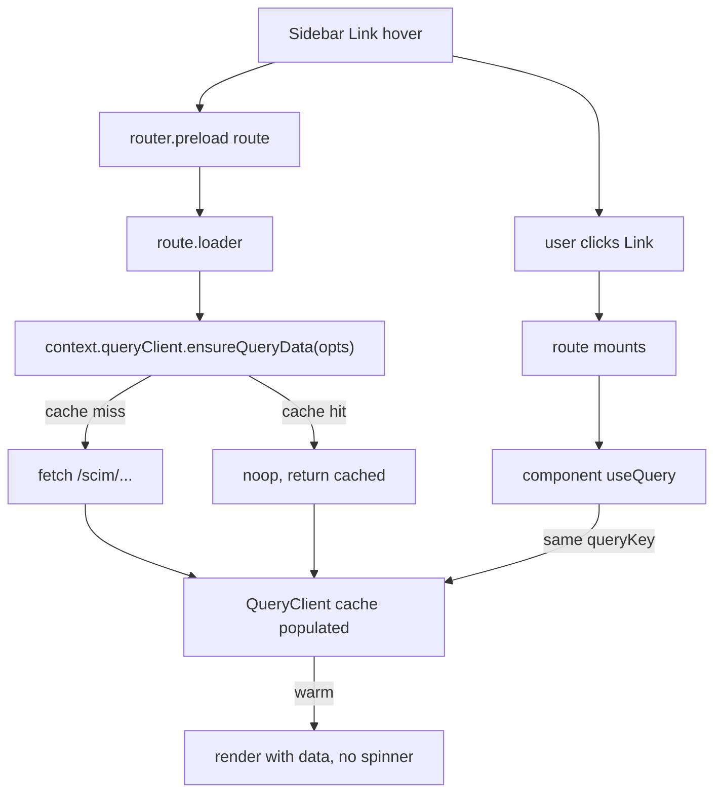

# Phase A4 - Route Loaders + Hover-Prefetch

> **Version:** 0.42.0-beta.3 - **Date:** May 6, 2026  
> **Phase:** A4 (loaders) of [UI_REDESIGN_REMAINING_GAPS_PLAN.md](UI_REDESIGN_REMAINING_GAPS_PLAN.md)  
> **Status:** Complete - every route pre-fetches its data on hover/focus  
> **Predecessor:** [Phase A3 - Per-Page URL State](PHASE_A3_PER_PAGE_URL_STATE.md) (URL is source of truth, v0.42.0-beta.2)  
> **Successor:** Phase A5 - Playwright e2e for back/forward + deep-link refresh

---

## 1. Summary

Phase A4 wires per-route `loader` functions that pre-fetch every page's data via `queryClient.ensureQueryData(...)`. Combined with the existing `defaultPreload: 'intent'` config (Phase A1) and `<Link>` components in the sidebar / cards / tabs, **hovering** a navigation target triggers the loader and warms the TanStack Query cache. By the time the user clicks, data is already in cache and the matched component renders synchronously - no spinner, no blank flash.

## 2. What Changed

### 2.1 New module: `web/src/api/query-client.ts`

Hoisted the `QueryClient` out of `AppShell.tsx` into a module-level singleton. Both the `<QueryClientProvider>` (mounted by AppShell) and the TanStack Router `context` consume the same instance, so loader writes are immediately readable by hooks.

### 2.2 `queries.ts` - extracted `*QueryOptions(...)` helpers

Each `useQuery` hook is now a thin wrapper around a matching `xxxQueryOptions(...)` helper. Loaders pass the same options object to `queryClient.ensureQueryData(...)`. Without this duplication tax it's easy for a loader to fetch a different URL or use a different cache key than the component, leading to a "loader runs but nothing populates" footgun.

| Helper | Used by |
|--------|---------|
| `dashboardQueryOptions()` | `useDashboard()` + `/` route loader |
| `healthQueryOptions()` | `useHealth()` + `/settings` route loader |
| `versionQueryOptions()` | `useVersion()` + `/settings` route loader |
| `endpointsQueryOptions()` | `useEndpoints()` + `/endpoints` route loader |
| `endpointDetailQueryOptions(id)` | `useEndpoint(id)` + `/endpoints/$endpointId` layout loader |
| `endpointStatsQueryOptions(id)` | `useEndpointStats(id)` + overview index + settings tab loaders |
| `endpointUsersQueryOptions(id, params)` | `useEndpointUsers(...)` + users tab loader |
| `endpointGroupsQueryOptions(id, params)` | `useEndpointGroups(...)` + groups tab loader |
| `endpointLogsQueryOptions({...})` | `useEndpointLogs(...)` (LogsTab) + logs tab loader |
| `globalLogsQueryOptions({...})` | `LogsPage` + `/logs` route loader |

### 2.3 `__root.tsx` - context-aware root route

```ts
// Before
export const rootRoute = createRootRoute({ component: RootLayout });

// After
export interface RouterContext {
  queryClient: QueryClient;
}
export const rootRoute = createRootRouteWithContext<RouterContext>()({
  component: RootLayout,
});
```

`createRootRouteWithContext` makes the context typed, so every `loader: ({ context }) => ...` gets a typed `context.queryClient`.

### 2.4 `router.ts` - injects context

```ts
import { queryClient } from './api/query-client';

export const router = createRouter({
  routeTree,
  defaultPreload: 'intent',
  defaultPreloadStaleTime: 30_000,
  context: { queryClient },   // <-- new
});
```

### 2.5 Per-route loaders



| Route | Loader pre-fetches | URL |
|-------|--------------------|-----|
| `/` | `dashboardQueryOptions()` | `GET /scim/admin/dashboard` |
| `/endpoints` | `endpointsQueryOptions()` | `GET /scim/admin/endpoints` |
| `/endpoints/$endpointId` (layout) | `endpointDetailQueryOptions(id)` | `GET /scim/admin/endpoints/:id` |
| `/endpoints/$endpointId/` (overview index) | `endpointStatsQueryOptions(id)` | `GET /scim/admin/endpoints/:id/stats` |
| `/endpoints/$endpointId/users` | `endpointUsersQueryOptions(id, { startIndex, count, filter })` | `GET /scim/endpoints/:id/Users?startIndex=...` |
| `/endpoints/$endpointId/groups` | `endpointGroupsQueryOptions(id, ...)` | `GET /scim/endpoints/:id/Groups?...` |
| `/endpoints/$endpointId/logs` | `endpointLogsQueryOptions({...})` | `GET /scim/admin/logs?endpointId=...&page=...` |
| `/endpoints/$endpointId/settings` | `endpointStatsQueryOptions(id)` | `GET /scim/admin/endpoints/:id/stats` |
| `/logs` | `globalLogsQueryOptions({ urlContains })` | `GET /scim/admin/logs?pageSize=50&...` |
| `/settings` | `versionQueryOptions()` + `healthQueryOptions()` (parallel) | `GET /scim/admin/version`, `GET /scim/health` |

The `loaderDeps` field on the URL-search-driven routes (users/groups/logs tabs, /logs) extracts only the search params the loader needs, so TanStack Router only re-runs the loader when those specific values change. Changing an unrelated search param doesn't force a refetch.

## 3. Test Coverage

| Layer | File | Tests | Status |
|-------|------|-------|--------|
| Structural (routes have loaders) | [router-loaders.test.ts](../web/src/router-loaders.test.ts) | 12 | Pass |
| Integration (loader pre-warms cache) | [router-loaders.integration.test.tsx](../web/src/router-loaders.integration.test.tsx) | 1 | Pass |
| Existing helper test | [router-test-utils.test.tsx](../web/src/test/router-test-utils.test.tsx) | 5 | Pass |
| All other component tests | (touched indirectly via shared queryOptions) | 275 | Pass |
| Full vitest suite | (all) | **293/293** (was 280; +13) | Pass |
| Production build | `vite build` | clean (10.02s) | Pass |
| TypeScript | `tsc --noEmit` (touched files) | 0 errors | Pass |

### Structural test (`router-loaders.test.ts`)

For every route in the tree that should pre-fetch data, asserts `route.options.loader` is a function. Catches regressions where someone removes a loader and silently breaks prefetch.

### Integration test (`router-loaders.integration.test.tsx`)

Mounts an in-memory router whose home route uses `dashboardQueryOptions()` as both loader and component query. Stubs `globalThis.fetch` with a sentinel payload, then asserts:
1. The component renders with the loader-populated data on first paint (sentinel visible, not "cold").
2. `globalThis.fetch` was called exactly once - the loader's call. The component's `useQuery` did NOT re-fetch because the cache was already populated.

This is the proof-of-concept that the contract `loader -> useQuery` cache hand-off works end-to-end.

### App.test.tsx fix

The "renders new Fluent UI by default" cutover test now sees an actual `<RouterProvider>` whose loaders call fetch. Without a fetch stub the loaders would hang and the AppShell stub would never appear. Added a permissive `globalThis.fetch = vi.fn().mockResolvedValue({ ok: true, status: 200, json: () => ({}) })` in the suite's `beforeEach`. Documented inline.

## 4. Why This Matters

- **Perceived performance**: hovering a sidebar link warms the next page's data. By the time the click registers, the route is fully populated. Server roundtrip happens during user mouse travel, not after click.
- **Single source of truth**: `xxxQueryOptions()` helpers force loader + hook to agree on URL + key + staleTime. Removes a class of bugs where loader and hook drift.
- **Sets up A5**: Playwright tests for back/forward + deep-link refresh can now assert that initial paint shows data (not spinner) when warm.
- **Sets up Phase E (mutations)**: invalidations triggered after a mutation will cause the matching `ensureQueryData` to refetch on next route visit, keeping cache fresh.

## 5. Risk Register

| Risk | Likelihood | Impact | Mitigation |
|------|-----------|--------|------------|
| Loader and hook fall out of sync (different URL/key) | Low | High | Both consume the shared `xxxQueryOptions()` helper - a single source of truth |
| Loader failure crashes initial render | Low | Medium | TanStack Router shows the `errorComponent` (default falls back to throwing); tests don't currently assert custom error UI - that lands in Phase G3 (ErrorBoundary) |
| Tests need fetch mocked everywhere | Medium | Low | Existing component tests use mocked hooks (`vi.mock('../api/queries', { useEndpointUsers: vi.fn() })`) so loaders aren't invoked. App.test.tsx + integration test stub global fetch explicitly |
| Stale-while-revalidate produces flicker | Low | Low | `defaultPreloadStaleTime: 30_000` matches typical query staleTime; cache hit returns synchronously |
| Bundle size grows | Low | Low | Loaders are pure functions, no new runtime deps |

## 6. Definition of Done (A4)

- [x] `query-client.ts` singleton created and consumed by both AppShell and router
- [x] `xxxQueryOptions(...)` helpers extracted in `queries.ts` for every query
- [x] `__root.tsx` uses `createRootRouteWithContext<{ queryClient }>()`
- [x] `router.ts` passes `context: { queryClient }` to `createRouter`
- [x] All 10 production routes have `loader` functions wired
- [x] URL-search-driven routes (users/groups/logs/global-logs) declare `loaderDeps` so prefetch is granular
- [x] LogsTab + LogsPage refactored to use shared queryOptions (no more inline useQuery + fetch)
- [x] App.test.tsx stubs `globalThis.fetch` so loaders resolve in isolated tests
- [x] +13 new web vitest tests (293 total)
- [x] Production build clean
- [x] Zero TypeScript errors in touched files
- [x] Version bumped to `0.42.0-beta.3` (lockstep api+web)
- [x] Doc shipped (this file)
- [x] CHANGELOG, INDEX, Session_starter updated
- [ ] Deploy to dev + 869 live tests pass (next step)

## 7. Next Up - Phase A5 (Playwright e2e)

| Step | Change |
|------|--------|
| Add Playwright spec for browser back/forward through `/endpoints/$id/users -> /groups -> back -> back` | Asserts URL changes, no full reload, content swaps |
| Deep-link refresh test: navigate to `/endpoints/$id/users?page=3`, refresh, assert page=3 still active | Validates URL is the source of truth in real browser |
| Hover prefetch assertion: hover Endpoints link, assert network request fired before click | Locks in the A4 prefetch contract |
| Bump to `0.42.0` once A5 lands - Phase A is complete |

---

## Cross-References

- [PHASE_A1_TANSTACK_ROUTER_FOUNDATION.md](PHASE_A1_TANSTACK_ROUTER_FOUNDATION.md) - foundation (route tree, devtools, schemas)
- [PHASE_A2_TANSTACK_ROUTER_CUTOVER.md](PHASE_A2_TANSTACK_ROUTER_CUTOVER.md) - cutover (RouterProvider wired)
- [PHASE_A3_PER_PAGE_URL_STATE.md](PHASE_A3_PER_PAGE_URL_STATE.md) - URL is source of truth for state
- [UI_REDESIGN_REMAINING_GAPS_PLAN.md](UI_REDESIGN_REMAINING_GAPS_PLAN.md) - parent plan
