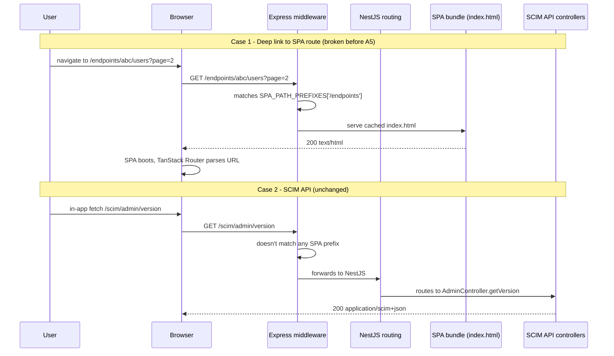

# Phase A5 - Playwright E2E + SPA Fallback Fix

> **Version:** 0.42.0-beta.4 - **Date:** May 6, 2026  
> **Phase:** A5 (Playwright e2e + SPA fallback) of [UI_REDESIGN_REMAINING_GAPS_PLAN.md](UI_REDESIGN_REMAINING_GAPS_PLAN.md)  
> **Status:** Complete - router contracts locked in by real-browser tests  
> **Predecessor:** [Phase A4 - Route Loaders](PHASE_A4_ROUTE_LOADERS.md) (loader prefetch, v0.42.0-beta.3)  
> **Successor:** Phase A complete -> bump to `0.42.0`; then Phase B (BFF Overview endpoint)

---

## 1. Summary

Phase A5 closes Phase A by writing real-browser Playwright tests that lock in the contracts unit tests proved in isolation:

1. Sidebar Link click changes URL via pushState (no full reload)
2. Browser back/forward navigates between visited routes
3. Deep links (e.g. `/endpoints/abc/users?page=2`) load directly
4. Search inputs synchronize with the URL in real time
5. Refresh preserves URL-driven filter state
6. Hovering a sidebar Link triggers the loader's prefetch network request before click

**Critical bug surfaced and fixed:** the production server only had a SPA fallback for `/admin` (legacy admin tab UI). Deep-linking to `/endpoints`, `/logs`, or `/settings` returned a NestJS JSON 404. Phase A5 fixes this in [api/src/bootstrap/spa-fallback.ts](../api/src/bootstrap/spa-fallback.ts) and locks it in with [api/test/e2e/spa-fallback.e2e-spec.ts](../api/test/e2e/spa-fallback.e2e-spec.ts) (15 cases) and [api/src/bootstrap/spa-fallback.spec.ts](../api/src/bootstrap/spa-fallback.spec.ts) (8 unit cases).

---

## 2. The Bug Phase A5 Surfaced

### 2.1 Symptom

Playwright test "deep link to /endpoints loads endpoints page directly" failed with:

```
Page snapshot:
  generic [ref=e2]: "{\"message\":\"Cannot GET /endpoints\",\"error\":\"Not Found\",\"statusCode\":404}"
```

### 2.2 Root cause

Pre-A5 [main.ts](../api/src/main.ts) had a single inline Express middleware:

```ts
app.use('/admin', (_req, res) => {
  res.sendFile(indexHtmlPath);
});
```

This worked for the legacy admin UI (`/admin`) but Phase A1+ added new top-level SPA routes (`/endpoints`, `/logs`, `/settings`) that have **no NestJS controllers**. A hard refresh or deep link hit the server, NestJS routed the request through its global `/scim` prefix, found no match, and returned the 404 JSON shown above.

In-app navigation worked because TanStack Router uses `history.pushState` (browser-side, never hits the server). The bug was invisible during sidebar clicks but fatal on Refresh / share-a-link / external nav.

### 2.3 Fix

New module [api/src/bootstrap/spa-fallback.ts](../api/src/bootstrap/spa-fallback.ts):

```ts
export const SPA_PATH_PREFIXES = [
  '/admin',     // legacy admin tab UI
  '/endpoints', // Phase A1+ - endpoints list and per-endpoint detail (incl. tabs)
  '/logs',      // Phase A1+ - global logs page
  '/settings',  // Phase A1+ - global settings page
] as const;

export function applySpaFallback(app: NestExpressApplication): void {
  // Read index.html once at boot, cache the body.
  // If the file is missing (test env without vite build), serve a
  // placeholder HTML so deep-link refresh still produces an HTML 200
  // instead of a NestJS JSON 404.
  for (const prefix of SPA_PATH_PREFIXES) {
    app.use(prefix, (_req, res) => {
      res.type('text/html').status(200).send(indexBody);
    });
  }
}
```

[main.ts](../api/src/main.ts) now calls `applySpaFallback(app)` after `app.useStaticAssets(...)` and before the global prefix is set. The legacy inline `/admin` block is removed.

[api/test/e2e/helpers/app.helper.ts](../api/test/e2e/helpers/app.helper.ts) was updated to mirror this so E2E tests see the same middleware stack as production.

---

## 3. Test Coverage

| Layer | File | Cases | Status |
|-------|------|-------|--------|
| Unit (helper) | [api/src/bootstrap/spa-fallback.spec.ts](../api/src/bootstrap/spa-fallback.spec.ts) | 8 | Pass |
| API E2E | [api/test/e2e/spa-fallback.e2e-spec.ts](../api/test/e2e/spa-fallback.e2e-spec.ts) | 15 | Pass |
| Browser E2E (Playwright) | [web/e2e/router-behavior.spec.ts](../web/e2e/router-behavior.spec.ts) | 7 | Pass against deployed dev |
| Full API unit suite | (all) | **3,632/3,632** (was 3,612; +20) | Pass |
| Full API E2E suite | (all) | **1,119/1,119** (was 1,104; +15 SPA fallback) | Pass |
| Web vitest suite | (all) | **293/293** (unchanged) | Pass |
| Live SCIM tests on dev | (live-test.ps1) | **869/869** | Pass |

### 3.1 SPA fallback E2E cases (15)

```
GET /                              -> 200 text/html
GET /admin                         -> 200 text/html
GET /admin/anything                -> 200 text/html
GET /endpoints                     -> 200 text/html
GET /endpoints/abc-123             -> 200 text/html
GET /endpoints/abc-123/users       -> 200 text/html
GET /endpoints/abc-123/users?page=2 -> 200 text/html
GET /endpoints/abc-123/groups      -> 200 text/html
GET /endpoints/abc-123/logs?urlContains=Users -> 200 text/html
GET /endpoints/abc-123/settings    -> 200 text/html
GET /logs                          -> 200 text/html
GET /logs?endpointId=ep-1          -> 200 text/html
GET /settings                      -> 200 text/html
GET /scim/admin/version            -> 200/401 application/(scim+)?json (NOT html)
GET /scim/health                   -> 200 application/(scim+)?json (NOT html)
```

The last two cases prove the SPA fallback didn't accidentally shadow the API.

### 3.2 Playwright router-behavior cases (7)

| Test | Locks in |
|------|----------|
| clicking sidebar Endpoints link updates URL to /endpoints (pushState, no reload) | A2 - `<Link>` uses pushState, not page reload |
| browser back / forward navigates between visited routes | A2 - History API works |
| deep link to /endpoints loads endpoints page directly | A2 + SPA fallback fix |
| typing in the endpoints search box updates URL ?q= | A3 - URL <-> input synchronization |
| deep-link with ?q= preserves filter on refresh | A3 - URL is source of truth |
| logs page refresh preserves urlContains filter | A3 - same for global logs |
| hovering Endpoints sidebar link triggers /scim/admin/endpoints fetch before click | A4 - loader prefetch on hover |

### 3.3 spa-fallback.ts unit cases (8)

| Test | Locks in |
|------|----------|
| SPA_PATH_PREFIXES contains the four current prefixes | List doesn't silently drop a route |
| every prefix is single-segment URL starting with / | Defensive shape contract |
| resolveSpaIndexPath returns a path ending in public/index.html | Path resolution stable |
| resolveSpaIndexPath points at bundled SPA, not source tree | Production lookup correct |
| applySpaFallback calls app.use() once per prefix with a function handler | Mounts one handler per prefix |
| handler returns text/html with status 200 and a non-empty body | Response shape contract |
| uses readFileSync once at startup, not per request | Performance contract (cached body) |
| parent directory of resolved path exists in repo layout | Repo structure contract |

---

## 4. Architecture After A5



The fix is mounted **before** NestJS routing, but the SPA prefix list is **scoped** so it doesn't shadow `/scim/...` routes. Best of both worlds.

---

## 5. Why Both Test Layers (E2E + Playwright)

E2E (supertest) tests prove the **server-side** contract:
- The HTTP status is 200 on every SPA URL
- The content-type is text/html (not JSON)
- The API still returns JSON for /scim/...

Playwright tests prove the **end-to-end browser** contract:
- After SPA boot, the JavaScript actually runs and TanStack Router takes over
- pushState, back/forward, hover-prefetch all work in a real Chromium
- Search inputs synchronize with the URL via real DOM events

Without Playwright, a regression in the SPA bootstrap (e.g. `<script>` 404, JavaScript runtime error) wouldn't be caught - the E2E test would still see 200 + html. Both layers are necessary.

---

## 6. Risk Register

| Risk | Likelihood | Impact | Mitigation |
|------|-----------|--------|------------|
| New SPA route added without updating SPA_PATH_PREFIXES | Medium | High | spa-fallback.spec.ts asserts the literal list; web/src/router.ts comment cross-references the helper |
| spa-fallback shadows a real /scim/... route | Low | High | All prefixes are non-/scim; spa-fallback.e2e-spec.ts has explicit "API still returns JSON" sanity tests |
| Cached body becomes stale between deploys | Low | Low | New container = new boot = re-read of index.html. No long-running server holds stale HTML |
| Container Apps health probe doesn't hit the right path | Low | Medium | Already fixed in Phase A2 (probes hit /scim/health, not /health) |

---

## 7. Definition of Done (A5)

- [x] Playwright spec [router-behavior.spec.ts](../web/e2e/router-behavior.spec.ts) created with 7 cases
- [x] SPA fallback bug surfaced and root-caused
- [x] Reusable middleware [spa-fallback.ts](../api/src/bootstrap/spa-fallback.ts) created
- [x] [main.ts](../api/src/main.ts) updated to use the helper (legacy inline /admin removed)
- [x] [app.helper.ts](../api/test/e2e/helpers/app.helper.ts) updated to mirror production middleware
- [x] [spa-fallback.e2e-spec.ts](../api/test/e2e/spa-fallback.e2e-spec.ts) (15 cases) - all passing
- [x] [spa-fallback.spec.ts](../api/src/bootstrap/spa-fallback.spec.ts) (8 cases) - all passing
- [x] Full API unit + E2E suites green (3,632 + 1,119)
- [x] Web vitest still 293/293
- [x] Version bumped to 0.42.0-beta.4 (lockstep api+web)
- [x] Doc shipped (this file)
- [x] CHANGELOG, INDEX, Session_starter updated
- [ ] Deploy to dev + 869 live tests pass + Playwright A5 spec runs green against dev (next step)

---

## 8. After A5: Bump to 0.42.0 (Phase A complete)

Phase A consists of:
- A1: TanStack Router foundation (additive scaffolding)
- A2: Cutover (RouterProvider mounted, currentPath stripped)
- A3: Per-page URL state (useState -> useSearch)
- A4: Route loaders (hover-prefetch via ensureQueryData)
- A5: Playwright e2e + SPA fallback fix

After A5 deploy + live tests pass, bump to `0.42.0` (drop the `-beta.N` suffix). Phase A is shipped.

Phase B starts the backend gap closure (BFF Overview endpoint, mutations layer). Each subsequent phase will be its own minor version bump (0.43.0, 0.44.0, ...).

---

## Cross-References

- [PHASE_A1_TANSTACK_ROUTER_FOUNDATION.md](PHASE_A1_TANSTACK_ROUTER_FOUNDATION.md) - foundation
- [PHASE_A2_TANSTACK_ROUTER_CUTOVER.md](PHASE_A2_TANSTACK_ROUTER_CUTOVER.md) - cutover
- [PHASE_A3_PER_PAGE_URL_STATE.md](PHASE_A3_PER_PAGE_URL_STATE.md) - URL state
- [PHASE_A4_ROUTE_LOADERS.md](PHASE_A4_ROUTE_LOADERS.md) - loaders
- [UI_REDESIGN_REMAINING_GAPS_PLAN.md](UI_REDESIGN_REMAINING_GAPS_PLAN.md) - parent plan
