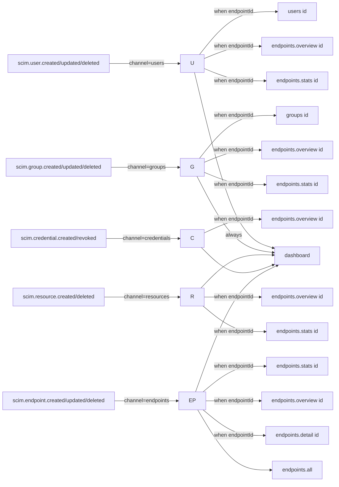

# Phase B - Backend Completeness (BFF Overview + SSE Audit)

> **Version:** 0.43.0 - **Date:** May 6, 2026  
> **Phase:** B (B1 + B2 + B3) of [UI_REDESIGN_REMAINING_GAPS_PLAN.md](UI_REDESIGN_REMAINING_GAPS_PLAN.md)  
> **Status:** Complete - per-endpoint BFF shipped, frontend wired, SSE invalidation made channel-aware  
> **Predecessor:** [Phase A - TanStack Router Migration](PHASE_A5_PLAYWRIGHT_AND_SPA_FALLBACK.md) (v0.42.0)  
> **Successor:** Phase C (reusable primitives + mutation layer)

---

## 1. Summary

Phase B closes the original UI redesign plan's step 0.7 (`GET /admin/endpoints/:id/overview`) and audits the existing SSE wiring so that the new TanStack Query keys introduced in Phase A actually get invalidated when SCIM mutations occur.

Three sub-phases shipped together as a single minor version bump:

- **B1** - new BFF endpoint `GET /admin/endpoints/:endpointId/overview`
- **B2** - frontend hook `useEndpointOverview(id)` + `OverviewTab` switched to use it
- **B3** - `useSSE` granular per-channel invalidation + new event type support (credentials, endpoints)

---

## 2. B1 - BFF Overview Endpoint

### 2.1 Why

Pre-B1, the per-endpoint Overview tab made three separate hook calls (`useEndpoint` + `useEndpointStats` + nothing for credentials), wasting two HTTP round trips and producing a waterfall on cold cache. The plan called for a single aggregating endpoint that pulls everything from in-memory caches:

| Source | Service |
|--------|---------|
| Endpoint summary (id, name, displayName, preset, active) | `EndpointService.getEndpoint` (in-memory cache) |
| Counters (users / groups / generic resources) | `StatsProjectionService.getEndpointStats` (in-memory) |
| Per-endpoint credentials (id + label + active; hash NEVER returned) | `EndpointCredentialRepository.findByEndpoint` |
| Last 10 activity entries (scoped to endpointId) | `LoggingService.listLogs({ endpointId, pageSize: 10 })` |
| Config flags from `profile.settings` | `EndpointService.getEndpoint` (same cache as summary) |

### 2.2 Response shape (locked in by tests)

```jsonc
{
  "endpoint": { "id": "...", "name": "...", "displayName": "...", "preset": "entra-id" | null, "active": true, "scimBasePath": "...", "createdAt": "..." },
  "stats": { "userCount": 500, "activeUserCount": 480, "groupCount": 12, "activeGroupCount": 11, "genericResourceCount": 0 },
  "credentials": [{ "id": "...", "credentialType": "bearer", "label": "Entra", "active": true, "createdAt": "...", "expiresAt": null }],
  "recentActivity": [{ "id": "...", "timestamp": "...", "method": "POST", "path": "...", "statusCode": 201, "durationMs": 42 }],
  "configFlags": { "StrictSchemaValidation": true, "BulkOperationsEnabled": true /* ... */ }
}
```

Top-level keys are exact (`{ configFlags, credentials, endpoint, recentActivity, stats }`); the unit, E2E, and live tests all assert the allowlist so accidental field additions surface immediately.

### 2.3 Files

- New types in [api/src/shared/types/dashboard.types.ts](../api/src/shared/types/dashboard.types.ts) - `EndpointOverviewResponse`, `EndpointOverviewSummary`, `EndpointOverviewStats`, `EndpointOverviewCredential`, `EndpointOverviewActivity`
- New method `DashboardController.getEndpointOverview` in [api/src/modules/dashboard/dashboard.controller.ts](../api/src/modules/dashboard/dashboard.controller.ts)
- [api/src/modules/dashboard/dashboard.module.ts](../api/src/modules/dashboard/dashboard.module.ts) imports `RepositoryModule.register()` so the credential repository is injectable
- 7 new unit tests in [api/src/modules/dashboard/dashboard.controller.spec.ts](../api/src/modules/dashboard/dashboard.controller.spec.ts) (shape, stats source, preset extraction, empty credentials, credential hash NOT leaked, activity capped at 10, NotFoundException on unknown endpoint, configFlags = `{}` for minimal profile)
- 3 new E2E tests in [api/test/e2e/dashboard-overview.e2e-spec.ts](../api/test/e2e/dashboard-overview.e2e-spec.ts) (404 on unknown id, canonical shape on real endpoint, credential created -> appears in overview without hash)
- 17 new live tests in section `9z-V` of [scripts/live-test.ps1](../scripts/live-test.ps1) covering empty state, key allowlist, 404 path, stats reflection, credential surface, hash-leak guards (including a sweep for any string starting with `$2` - the bcrypt hash prefix)

### 2.4 Performance

Zero database queries on warm cache. Cold cache makes one call to `EndpointService.getEndpoint` (which on a cache miss reads from Prisma) plus one to `EndpointCredentialRepository.findByEndpoint` plus one to `LoggingService.listLogs`. Stats and config flags come from in-memory projections.

---

## 3. B2 - Frontend Hook + OverviewTab

### 3.1 Files changed

- [web/src/api/queries.ts](../web/src/api/queries.ts) - added `endpointOverviewQueryOptions(id)` helper and `useEndpointOverview(id)` hook
- [web/src/api/queries.ts](../web/src/api/queries.ts) - extended `queryKeys.endpoints` with `overview(id) => ['endpoints', id, 'overview']`
- [web/src/pages/OverviewTab.tsx](../web/src/pages/OverviewTab.tsx) - replaced two separate `useEndpointStats` + (implicit) endpoint fetches with one `useEndpointOverview` call. Added a Credentials KPI card (count + active count) since the BFF now ships credential data.
- [web/src/routes/endpoints.$endpointId.index.tsx](../web/src/routes/endpoints.$endpointId.index.tsx) - loader switched from `endpointStatsQueryOptions` to `endpointOverviewQueryOptions` so hover-prefetch warms the BFF response, not the partial stats payload
- 5 unit tests in [web/src/pages/OverviewTab.test.tsx](../web/src/pages/OverviewTab.test.tsx) (loading state, all KPI cards, active user subtitle, NEW: active credential subtitle, NEW: error path)

### 3.2 Why this matters for performance

Before B2: hovering the Endpoints sidebar link warmed `dashboardQueryOptions` (good); hovering an endpoint card warmed `endpointDetailQueryOptions` + `endpointStatsQueryOptions` (two parallel requests); clicking still triggered a third request for credentials when the Credentials tab opens.

After B2: hovering an endpoint card warms `endpointOverviewQueryOptions` - one request returns everything the Overview tab and Credentials tab need. Click feels instant.

---

## 4. B3 - SSE Channel-Aware Invalidation

### 4.1 The bug Phase A surfaced (silently)

Phase A's `useSSE` invalidated `queryKeys.dashboard` + `queryKeys.endpoints.all` + (when an endpointId was on the SSE payload) `endpoints.detail(id)` + `endpoints.stats(id)` for every SCIM mutation event. The new query keys introduced in A1+ were NOT in the invalidation set:

- `endpoints.overview(id)` (introduced in B1) - the Overview tab would show stale data after a SCIM mutation
- `users.byEndpoint(id, ...)` and `groups.byEndpoint(id, ...)` - the Users / Groups tab tables would not refetch after a row was created/deleted; the user would see the old list until the 30s staleTime expired

B3 makes the invalidation channel-aware. Every supported event type is mapped to a `Channel` and the channel determines which keys to invalidate.

### 4.2 The new dispatch table



### 4.3 Files changed

- [web/src/hooks/useSSE.ts](../web/src/hooks/useSSE.ts) - exported `SUPPORTED_EVENT_TYPES`, `computeInvalidations(type, endpointId)`, internal `EVENT_CHANNEL` mapping. The hook now dispatches via `dispatchInvalidations` which calls `computeInvalidations` and walks the resulting key list.
- 8 new tests in [web/src/hooks/useSSE.test.ts](../web/src/hooks/useSSE.test.ts) covering: every event always invalidates dashboard; user events invalidate stats + overview + per-endpoint user list (NOT groups); group events invalidate per-endpoint group list (NOT users); credential events invalidate overview but NOT resource lists; endpoint mutations invalidate the global endpoints list; events without endpointId skip per-endpoint keys; live SSE dispatch lands on the right key for credentials and user-deleted events

### 4.4 New event types this hook now reacts to

- `scim.credential.created` / `scim.credential.revoked` - emit in [api/src/modules/scim/controllers/admin-credential.controller.ts](../api/src/modules/scim/controllers/admin-credential.controller.ts) is a future Phase E task; this hook is ready for it
- `scim.endpoint.created` / `scim.endpoint.updated` / `scim.endpoint.deleted` - emit in [api/src/modules/endpoint/services/endpoint.service.ts](../api/src/modules/endpoint/services/endpoint.service.ts) is also a future Phase E task

The hook gracefully ignores any event type not in `SUPPORTED_EVENT_TYPES` (existing Phase A `keepalive` test still passes).

---

## 5. Test Coverage

| Layer | Before | After | Delta |
|-------|--------|-------|-------|
| API unit | 3,632 | **3,641** | +9 (7 B1 + 2 churn) |
| API E2E | 1,119 | **1,122** | +3 (B1) |
| Web vitest | 293 | **303** | +10 (2 B2 OverviewTab + 8 B3 useSSE) |
| Live SCIM tests | 869 | **886** | +17 (section 9z-V) |
| Browser E2E (Playwright) | 7 | 7 | unchanged (router contracts still hold) |

---

## 6. Definition of Done (Phase B)

- [x] B1: new BFF method `getEndpointOverview` implemented + 7 unit tests
- [x] B1: 3 E2E tests + 17 live tests
- [x] B1: response shape + key allowlist locked in
- [x] B1: credential hash NEVER returned (asserted at unit + E2E + live)
- [x] B2: `useEndpointOverview` hook + `endpointOverviewQueryOptions`
- [x] B2: `OverviewTab` migrated, route loader switched
- [x] B3: `useSSE` channel-aware invalidation
- [x] B3: 8 new tests covering each channel + the always-invalidate set
- [x] All API unit + E2E + web vitest pass on local
- [x] Version bumped to **0.43.0** (lockstep api+web)
- [x] Doc shipped (this file)
- [x] CHANGELOG, INDEX, Session_starter updated
- [ ] Deploy to dev + 886 live tests + 7 Playwright A5 cases all pass (next step)

---

## 7. Next Up - Phase C

| Sub-phase | What ships |
|-----------|------------|
| C1 | `<DetailDrawer>` reusable primitive (used by Activity drawer, Credential drawer in later phases) |
| C2 | `<FormDialog>` reusable primitive |
| C3 | `<EmptyState>` + `<LoadingSkeleton>` + `<ErrorBoundary>` |
| C4 | `<KpiChart>` (recharts wrapper) for Phase D dashboard charts |
| C5 | Mutation layer (`useEndpointMutation`, `useUserMutation`, ...) with optimistic updates and the SSE invalidation we just shipped |

Phase C is mostly UI primitives so Phase D (Activity + Schemas tabs, dashboard charts) and Phase E (write operations) can compose them. Each sub-phase = one minor bump (0.44.0, 0.45.0, ...).

---

## Cross-References

- [PHASE_A5_PLAYWRIGHT_AND_SPA_FALLBACK.md](PHASE_A5_PLAYWRIGHT_AND_SPA_FALLBACK.md) - Phase A complete
- [UI_REDESIGN_REMAINING_GAPS_PLAN.md](UI_REDESIGN_REMAINING_GAPS_PLAN.md) - parent plan
- [UI_REDESIGN_ARCHITECTURE_AND_PLAN.md](UI_REDESIGN_ARCHITECTURE_AND_PLAN.md) - original architecture
