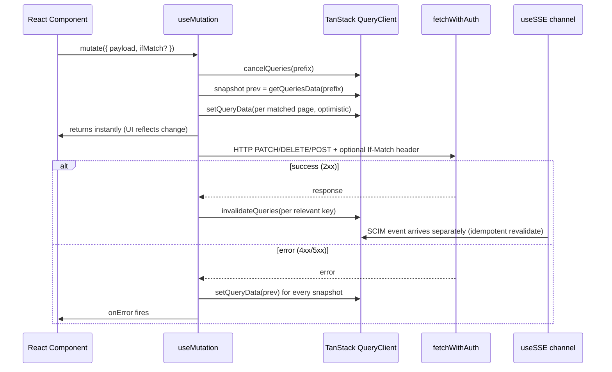
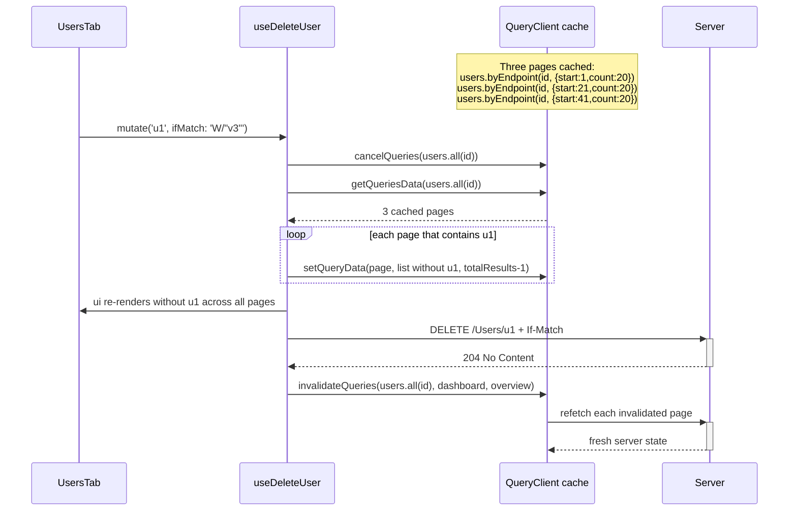

# Phase C - Reusable Primitives + Mutation Layer

> **Version:** 0.44.0 (initial) -> 0.44.1 (gap-fill / hardening) - **Date:** May 7, 2026  
> **Phase:** C of [UI_REDESIGN_REMAINING_GAPS_PLAN.md](UI_REDESIGN_REMAINING_GAPS_PLAN.md)  
> **Predecessor:** [Phase B - BFF Overview + SSE](PHASE_B_BFF_OVERVIEW_AND_SSE.md) (v0.43.0)  
> **Successor:** Phase D (Read-Only Completeness)  
> **Status:** Complete - primitives, mutation layer, optimistic updates, If-Match support, route-aware ErrorBoundary all shipped and gated.

---

## Table of Contents

1. [Summary](#1-summary)
2. [What Phase C Delivers](#2-what-phase-c-delivers)
3. [Component Contract Table](#3-component-contract-table)
4. [Mutation Layer Architecture](#4-mutation-layer-architecture)
5. [Optimistic Updates Sequence](#5-optimistic-updates-sequence)
6. [If-Match (ETag) Propagation](#6-if-match-etag-propagation)
7. [Primitive Consumer Map (Phase D / E)](#7-primitive-consumer-map-phase-d--e)
8. [Test Coverage](#8-test-coverage)
9. [v0.44.1 Hardening Changes (gap-fill)](#9-v0441-hardening-changes-gap-fill)
10. [Risk Register](#10-risk-register)
11. [Definition of Done](#11-definition-of-done)
12. [Cross-References](#12-cross-references)

---

## 1. Summary

Phase C ships the primitive layer that Phases D and E depend on:

- 6 reusable UI primitives (`DetailDrawer`, `FormDialog`, `EmptyState`, `LoadingSkeleton`, `ErrorBoundary`, `KpiChart`)
- 9 mutation hooks (`useCreateCredential`, `useDeleteCredential`, `useUpdateEndpointConfig`, `useCreateUser`, `useCreateGroup`, `useUpdateUser`, `useDeleteUser`, `useUpdateGroup`, `useDeleteGroup`)
- A barrel export at [web/src/components/primitives/index.ts](../web/src/components/primitives/index.ts)
- Universal optimistic-mutation pattern: `onMutate` snapshot -> optimistic write -> `onError` rollback -> `onSettled` invalidate
- `If-Match` ETag header propagation on every PATCH/DELETE so endpoints with `RequireIfMatch` get RFC 7644 S3.1 enforcement
- Route-aware `ErrorBoundary` via `resetKeys` (auto-reset on URL change)

No backend changes. No new API endpoints. Frontend-only phase that unblocks Phase E (write operations) and Phase D (composed read-only views with skeletons + empty states + charts).

---

## 2. What Phase C Delivers

| Sub-phase | Output | File | Tests |
|-----------|--------|------|-------|
| C1 | DetailDrawer (Fluent OverlayDrawer wrapper - title/body/footer slots, ESC/backdrop/X close) | [DetailDrawer.tsx](../web/src/components/primitives/DetailDrawer.tsx) | 6 |
| C2 | FormDialog (Fluent Dialog wrapper - submit/cancel/busy/error/disabled, blocks backdrop close while busy) | [FormDialog.tsx](../web/src/components/primitives/FormDialog.tsx) | 8 |
| C3a | EmptyState (icon + title + body + optional CTA, role="status" + aria-live="polite") | [EmptyState.tsx](../web/src/components/primitives/EmptyState.tsx) | 7 |
| C3b | LoadingSkeleton (Skeleton + SkeletonItem wrapper, count clamped 1-100) | [LoadingSkeleton.tsx](../web/src/components/primitives/LoadingSkeleton.tsx) | 6 |
| C3c | ErrorBoundary (class component + reset + custom fallback + onError telemetry + dev-only stack + `resetKeys`) | [ErrorBoundary.tsx](../web/src/components/primitives/ErrorBoundary.tsx) | 8 |
| C4 | KpiChart (recharts AreaChart sparkline, empty/single-point fallback, 4 Fluent color schemes) | [KpiChart.tsx](../web/src/components/primitives/KpiChart.tsx) | 6 |
| C5 | Mutation Layer (9 hooks with optimistic updates, If-Match support, rollback on error, invalidate on settle) | [queries.ts](../web/src/api/queries.ts) | 24 |
| - | Barrel export + props re-exports | [index.ts](../web/src/components/primitives/index.ts) | - |

**Total:** ~580 LOC of primitives + ~470 LOC of mutation layer + barrel = ~1,050 LOC frontend code, 65 unit tests.

---

## 3. Component Contract Table

Every primitive follows the same conventions so consumers compose them predictably:

| Convention | Applied To | Notes |
|------------|------------|-------|
| `data-testid` prop with derived sub-ids (e.g. `${testId}-close`, `${testId}-submit`) | All 6 primitives | Custom override + namespaced derivations for selectors |
| Slot-based composition (`children`, `footer`, etc.) | DetailDrawer, FormDialog, EmptyState | No double-wrapping; slot consumers own their content |
| Closes on ESC / backdrop / explicit close button | DetailDrawer, FormDialog | Fluent UI handles ESC; we collapse to single `onClose` |
| Backdrop click suppressed while `busy=true` | FormDialog | Prevents orphaned in-flight requests |
| Defensive prop clamping (count 1-100) | LoadingSkeleton | Bad inputs (0, -3, 9999) don't crash |
| Empty/single-point fallback | KpiChart | Renders explicit "no trend data yet" instead of recharts vertical-line bug |
| Stack traces only in dev | ErrorBoundary | `import.meta.env.DEV` Vite build-time replacement |
| Custom fallback prop (advanced) | ErrorBoundary | Default UI + custom UI both supported |
| Auto-reset on `resetKeys` change | ErrorBoundary | Mirrors `react-error-boundary` API; route-aware |
| `role="status"` + `aria-live="polite"` | EmptyState | Screen-reader announce on appearance |
| Theme-aware colors via `tokens.*` | DetailDrawer, FormDialog, EmptyState, ErrorBoundary, KpiChart | Dark mode adjusts automatically |

---

## 4. Mutation Layer Architecture

The 9 mutation hooks follow one universal contract:



### 4.1 Hook contract table

| Hook | HTTP | Optimistic | If-Match | Invalidates on settle |
|------|------|:----------:|:--------:|-----------------------|
| `useCreateCredential` | POST `/admin/endpoints/:id/credentials` | No | No | `endpoints.overview(id)` |
| `useDeleteCredential` | DELETE `.../credentials/:credId` | Yes (filter overview list) | No | `endpoints.overview(id)` |
| `useUpdateEndpointConfig` | PATCH `/admin/endpoints/:id` | Yes (shallow merge into detail) | No | `endpoints.detail(id)` + `endpoints.overview(id)` |
| `useCreateUser` | POST `/endpoints/:id/Users` | No | No | `users.all(id)` + `dashboard` + `endpoints.overview(id)` |
| `useCreateGroup` | POST `/endpoints/:id/Groups` | No | No | `groups.all(id)` + `dashboard` + `endpoints.overview(id)` |
| `useUpdateUser` | PATCH `/endpoints/:id/Users/:uid` | **Yes** (per-page shallow merge) | **Yes** | `users.all(id)` + `endpoints.overview(id)` |
| `useDeleteUser` | DELETE `.../Users/:uid` | **Yes** (per-page filter + decrement totalResults) | **Yes** | `users.all(id)` + `dashboard` + `endpoints.overview(id)` |
| `useUpdateGroup` | PATCH `/endpoints/:id/Groups/:gid` | **Yes** (per-page shallow merge) | **Yes** | `groups.all(id)` + `endpoints.overview(id)` |
| `useDeleteGroup` | DELETE `.../Groups/:gid` | **Yes** (per-page filter + decrement totalResults) | **Yes** | `groups.all(id)` + `dashboard` + `endpoints.overview(id)` |

### 4.2 Internal helpers

Two private helpers in [queries.ts](../web/src/api/queries.ts) keep the hooks readable:

- `patchListsContaining(qc, prefix, targetId, mutator)` - walks every cached list under `prefix` whose Resources contain a row matching `targetId`, mutates it via `mutator`, and returns a snapshot list for rollback. Used by both User and Group PATCH/DELETE optimism.
- `restoreListSnapshots(qc, snapshots)` - restores every snapshot verbatim on rollback.
- `ifMatchHeaders(ifMatch?)` - returns `{ 'If-Match': value }` only when a non-empty value is supplied; otherwise `undefined`. Centralizes the conditional so individual hooks don't repeat the trim/empty check.

---

## 5. Optimistic Updates Sequence

Optimistic updates target **every cached list page** that contains the target row, not just one. Because a single endpoint's Users list can have many paginated cache entries (different `startIndex` / `count` / `filter` combinations) under the `users.all(endpointId)` prefix, we walk all matches.

Example: `useDeleteUser` sequence on a 3-page user list:



If the server returns 412 (stale ETag) or 5xx, the rollback restores all 3 pages atomically.

---

## 6. If-Match (ETag) Propagation

RFC 7644 S3.1 specifies that SCIM clients SHOULD use If-Match on PATCH/PUT/DELETE to prevent stale writes. The SCIMServer endpoint config flag `RequireIfMatch` (G7) can elevate that SHOULD into a server-side 428 Precondition Required when the header is missing.

Phase C's mutation hooks support both modes:

| Endpoint config | Caller passes `ifMatch`? | Server response |
|---|---|---|
| RequireIfMatch=false | omitted | 200 OK (write applied) |
| RequireIfMatch=false | supplied with stale ETag | 412 Precondition Failed |
| RequireIfMatch=false | supplied with current ETag | 200 OK (write applied) |
| RequireIfMatch=true | omitted | **428 Precondition Required** |
| RequireIfMatch=true | supplied with stale ETag | 412 Precondition Failed |
| RequireIfMatch=true | supplied with current ETag | 200 OK (write applied) |

Phase E4 (User/Group detail drawer) reads the latest ETag from the cached resource (`meta.version` or response header captured at last fetch) and passes it through to the hook. The drawer surfaces 412 / 428 errors with a refresh button so the user can re-load and retry.

API shapes accepted by the hooks:

```typescript
// Bare-string variant (legacy / when no ETag enforcement is needed):
useDeleteUser(epId).mutate('u1');
useDeleteGroup(epId).mutate('g1');

// Object variant (preferred for write operations):
useDeleteUser(epId).mutate({ userId: 'u1', ifMatch: 'W/"v3"' });
useUpdateUser(epId).mutate({ userId: 'u1', body: { active: false }, ifMatch: 'W/"v3"' });
```

---

## 7. Primitive Consumer Map (Phase D / E)

This table locks in the contract between Phase C and the phases that consume it.

| Primitive / Hook | Future consumer | Phase | Use |
|------------------|-----------------|-------|-----|
| `DetailDrawer` | UsersTab row click | E4 | User detail + edit form |
| `DetailDrawer` | GroupsTab row click | E4 | Group detail + edit form |
| `DetailDrawer` | LogsPage row click | D5 | Log entry detail (status, headers, body) |
| `DetailDrawer` | ActivityTab entry click | D2 | Activity entry detail |
| `FormDialog` | CredentialsTab "Add credential" | E1 | Create-credential form |
| `FormDialog` | ManualProvisionPage | E3 | Create-user / create-group forms |
| `EmptyState` | UsersTab / GroupsTab / CredentialsTab / ActivityTab / LogsPage | D2/D5/E1 | Empty list state with CTA |
| `LoadingSkeleton` | All list views, OverviewTab | G1 | Replace "Loading..." text fallbacks |
| `ErrorBoundary` (with `resetKeys`) | Every route element | G3 | Per-route crash recovery; auto-reset on URL change |
| `KpiChart` | DashboardPage 24h request trend | D4 | Sparkline area chart on KPI card |
| `useCreateCredential` / `useDeleteCredential` | CredentialsTab | E1 | Mint and revoke per-endpoint bearer credentials |
| `useUpdateEndpointConfig` | SettingsTab Switch toggles | E2 | Optimistic config flag toggles + rollback on error |
| `useCreateUser` / `useCreateGroup` | ManualProvisionPage | E3 | Manual SCIM resource provisioning |
| `useUpdateUser` / `useDeleteUser` | UsersTab DetailDrawer | E4 | Edit + delete a user (optimistic, If-Match-aware) |
| `useUpdateGroup` / `useDeleteGroup` | GroupsTab DetailDrawer | E4 | Edit + delete a group (optimistic, If-Match-aware) |

---

## 8. Test Coverage

| Layer | Before Phase C | After v0.44.0 (initial) | After v0.44.1 (gap-fill) | Net delta |
|-------|---------------:|------------------------:|-------------------------:|----------:|
| Web vitest | 303 | 351 | **368** | +65 |
| API unit | 3,641 | 3,641 | 3,641 | 0 |
| API E2E | 1,122 | 1,122 | 1,122 | 0 |
| Live SCIM | 886 | 886 | 886 | 0 |
| Browser E2E (Playwright) | 7 | 7 | 7 | 0 |

Phase C is frontend-only - backend test counts are unchanged.

### 8.1 New web tests in v0.44.1

- 13 new mutation hook tests (4 for `useUpdateUser`, 5 for `useDeleteUser`, 3 for `useUpdateGroup`, 4 for `useDeleteGroup` - covering optimistic apply, rollback, If-Match propagation, list-page invalidation, bare-string backward compatibility)
- 3 tightened existing tests (`useCreateUser`/`useCreateGroup` overview-invalidation assertion, `useUpdateEndpointConfig` cold-cache path, `useDeleteCredential` post-settle cache state)
- 2 new ErrorBoundary tests (`resetKeys` auto-reset on change, no-reset when unchanged)

---

## 9. v0.44.1 Hardening Changes (gap-fill)

Internal post-Phase-C audit (recorded findings F-1 through F-15) closed the following gaps in a single follow-on commit:

| Finding | Gap | Resolution |
|---------|-----|------------|
| F-1 | Missing Phase C feature doc | This document |
| F-3 | `useUpdateUser` / `useDeleteUser` JSDoc claimed "optimistic" but implementation was non-optimistic | Implemented true `onMutate` snapshot + per-page apply + `onError` rollback for both hooks |
| F-4 | `useUpdateGroup` / `useDeleteGroup` were missing entirely (Phase E4 blocker) | Added both with the same optimistic pattern + tests |
| F-5 | No `If-Match` header propagation - silent failure on `RequireIfMatch` endpoints | Added optional `ifMatch` argument to all 4 PATCH/DELETE hooks; centralised through `ifMatchHeaders()` helper |
| F-6 | `useCreateUser` / `useCreateGroup` tests didn't assert overview invalidation | Added `expect(keys).toContain(JSON.stringify(queryKeys.endpoints.overview(EP_ID)))` |
| F-7 | `useUpdateEndpointConfig` cache-miss path untested | New test: PATCH with no seeded cache; assert `onSettled` invalidations still fire |
| F-8 | `useDeleteCredential` success-path assertion was weak | Now asserts the cached `credentials` array length is 0 after `mutateAsync` resolves |
| F-10 | `ErrorBoundary` had no auto-reset on URL change (would persist errors across routes) | Added `resetKeys: ReadonlyArray<unknown>` prop with shallow-equal compare in `componentDidUpdate` |
| F-11 | `queryKeys.users.all`/`groups.all` factory keys missing - mutations used string literals (`['users', endpointId]`) inconsistently with the rest of the registry | Added factory helpers; mutation hooks AND `useSSE.computeInvalidations` both use them so changes stay in lock-step |
| F-15 | `ResizeObserver` shim installed inside `KpiChart.test.tsx` `beforeAll`, leaked across describe blocks and other test files | Moved to global [web/src/test/setup.ts](../web/src/test/setup.ts) (also added `matchMedia` shim while there) |

### 9.1 Files modified in v0.44.1

| File | Change | LOC |
|------|--------|-----|
| [web/src/api/queries.ts](../web/src/api/queries.ts) | `queryKeys.users.all`/`groups.all`; rewrite User/Group PATCH/DELETE with optimism + If-Match; new `useUpdateGroup`/`useDeleteGroup`; helpers `ifMatchHeaders`, `patchListsContaining`, `restoreListSnapshots` | +160 / -32 |
| [web/src/api/mutations.test.ts](../web/src/api/mutations.test.ts) | Tightened 3 weak tests; 13 new tests for User/Group PATCH/DELETE optimism, rollback, If-Match | +320 / -8 |
| [web/src/components/primitives/ErrorBoundary.tsx](../web/src/components/primitives/ErrorBoundary.tsx) | Added `resetKeys` prop + `componentDidUpdate` shallow-equal check + `arraysShallowEqual` helper | +35 / -1 |
| [web/src/components/primitives/ErrorBoundary.test.tsx](../web/src/components/primitives/ErrorBoundary.test.tsx) | 2 new tests for `resetKeys` (auto-reset + no-reset-on-same-key) | +45 |
| [web/src/components/primitives/KpiChart.test.tsx](../web/src/components/primitives/KpiChart.test.tsx) | Removed local `ResizeObserver` shim (moved to setup.ts) | -16 |
| [web/src/test/setup.ts](../web/src/test/setup.ts) | Global `ResizeObserver` + `matchMedia` shims | +35 |
| [web/src/hooks/useSSE.ts](../web/src/hooks/useSSE.ts) | `computeInvalidations` uses new `queryKeys.users.all` / `groups.all` factories | +6 / -4 |

---

## 10. Risk Register

| Risk | Likelihood | Impact | Mitigation |
|------|------------|--------|------------|
| Optimistic per-page mutation desyncs from server when filter+sort change row order | Low | Low | `onSettled` always invalidates `users.all(id)` / `groups.all(id)`; even a temporarily wrong row order self-heals on next render |
| `If-Match` header forwarded to a non-RFC-7644 endpoint | Very Low | Low | Header-only; ignored by HTTP servers that don't honor it |
| `ErrorBoundary.resetKeys` shallow-equal comparing object identity | Medium | Low | Document in JSDoc; consumers should pass primitive keys (route paths, ids, NOT objects) |
| Multiple optimistic writes interleave during slow network | Medium | Medium | TanStack Query `cancelQueries` blocks in-flight refetches; subsequent `onSettled` invalidations always reach server-of-truth |
| New hooks (`useUpdateGroup`/`useDeleteGroup`) tested only at unit level until Phase E4 wires them up to a UI | Certain | Low | Phase E4 ships MSW + Playwright tests that exercise the full edit cycle |

---

## 11. Definition of Done

- [x] C1-C4 primitives implemented with slot conventions and 33 unit tests
- [x] C5 mutation layer: 9 hooks with universal `onMutate -> apply -> onError rollback -> onSettled invalidate` pattern
- [x] Barrel export with TypeScript prop types re-exported
- [x] **v0.44.1 hardening:** all 10 P0 findings closed (F-1, F-3 through F-11, F-15)
- [x] Optimistic User/Group PATCH and DELETE applied per-cached-page; rollback restores all snapshots
- [x] `If-Match` header propagation on every PATCH/DELETE hook; tested for present and absent paths
- [x] `ErrorBoundary` `resetKeys` for route-aware auto-reset
- [x] Global `ResizeObserver` + `matchMedia` shims in [test/setup.ts](../web/src/test/setup.ts)
- [x] **368** web vitest tests pass (303 -> 368, +65)
- [x] Vite production build clean (9.77s, 244.81 kB gz)
- [x] No new TypeScript errors; `tsc --noEmit` clean for all touched files
- [x] Feature doc shipped (this file), INDEX.md updated, CHANGELOG entry, Session_starter.md log entry
- [x] Lockstep version bump api+web `0.44.0` -> `0.44.1`
- [ ] **Per-phase quality gate:** deploy to dev + 886+ live SCIM tests + 7 Playwright cases all pass (next step - this also satisfies Phase B's deferred gate)

---

## 12. Cross-References

- [PHASE_B_BFF_OVERVIEW_AND_SSE.md](PHASE_B_BFF_OVERVIEW_AND_SSE.md) - Phase B (predecessor)
- [UI_REDESIGN_REMAINING_GAPS_PLAN.md](UI_REDESIGN_REMAINING_GAPS_PLAN.md) S6 - Phase C plan (parent)
- [UI_REDESIGN_ARCHITECTURE_AND_PLAN.md](UI_REDESIGN_ARCHITECTURE_AND_PLAN.md) S7 / S18 - state management strategy + optimistic mutation rollback pattern
- [G11_PER_ENDPOINT_CREDENTIALS.md](auth/G11_PER_ENDPOINT_CREDENTIALS.md) - Credential backend (consumed by C5 useCreateCredential / useDeleteCredential)
- [phases/PHASE_07_ETAG_CONDITIONAL_REQUESTS.md](phases/PHASE_07_ETAG_CONDITIONAL_REQUESTS.md) - ETag + RequireIfMatch backend (basis for C5 If-Match support)
