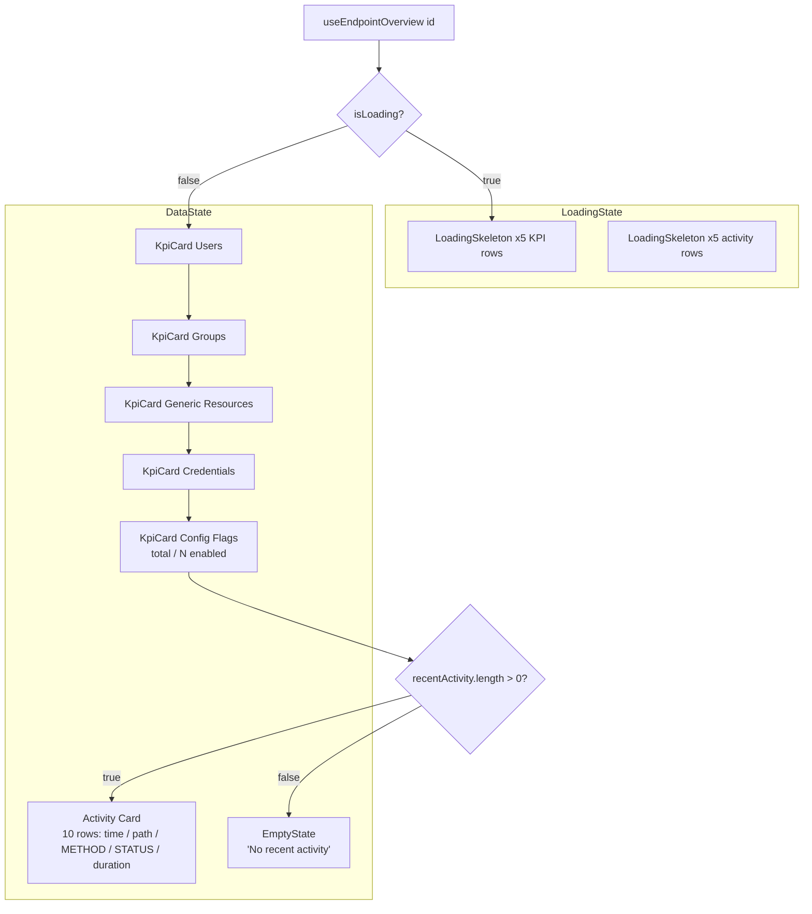

# Phase D1 - Overview Tab Data-Complete

> **Version:** 0.45.0-alpha.1 - **Date:** May 8, 2026  
> **Phase:** D1 of [UI_REDESIGN_REMAINING_GAPS_PLAN.md](UI_REDESIGN_REMAINING_GAPS_PLAN.md) Phase D  
> **Predecessor:** [Phase C - Reusable Primitives + Mutation Layer](PHASE_C_PRIMITIVES_AND_MUTATIONS.md) (v0.44.1)  
> **Successor:** Phase D2 (Activity tab) -> v0.45.0-alpha.2  
> **Status:** Complete - OverviewTab now data-complete (stats + recent activity + flag count + skeleton + empty state).

---

## Table of Contents

1. [Summary](#1-summary)
2. [Spec Reference](#2-spec-reference)
3. [What D1 Delivers](#3-what-d1-delivers)
4. [Component Layout](#4-component-layout)
5. [Implementation Notes](#5-implementation-notes)
6. [Tests](#6-tests)
7. [Definition of Done](#7-definition-of-done)
8. [Cross-References](#8-cross-references)

---

## 1. Summary

D1 turns the per-endpoint Overview tab from a 4-card stats summary into a **data-complete operational landing page**. It composes Phase C primitives (`LoadingSkeleton`, `EmptyState`) on top of the Phase B BFF (`useEndpointOverview`) so the user sees - in one round trip - everything that matters about an endpoint:

- Resource counts (Users, Groups, Generic, Credentials, Config Flags)
- Last 10 SCIM operations (method, path, status, duration)
- Skeleton-on-loading that mirrors the final layout (no CLS)
- Empty-state in the Activity slot when the endpoint has no traffic yet

Frontend-only. No new API endpoints. No backend test impact.

---

## 2. Spec Reference

[UI_REDESIGN_REMAINING_GAPS_PLAN.md S7.1 D1](UI_REDESIGN_REMAINING_GAPS_PLAN.md#71-d1---overview-tab-fully-data-driven):

> - Consume `useEndpointOverview` (B2) instead of stitching `useEndpointStats`
> - Render: stats cards + recent activity list + flag summary count + credential count
> - Skeleton on loading; EmptyState when no recent activity
> - Tests: 4 unit

All four bullets are now satisfied (5 KPI cards instead of 4 - we explicitly added the Config Flags card which the spec called out as "flag summary count").

---

## 3. What D1 Delivers

| Surface | Before D1 | After D1 |
|---------|-----------|----------|
| Loading state | Fluent `Spinner` with "Loading overview..." text | `LoadingSkeleton` mirroring 5 KPI cards + 5 activity rows (Phase G1 pattern) |
| KPI cards | 4 (Users / Groups / Generic / Credentials) | **5** (added Config Flags card showing `total / N enabled`) |
| Recent Activity | not rendered | 10-row card with method + path + status badge + duration; `EmptyState` when zero entries |
| Composition | inline JSX | uses `EmptyState`, `LoadingSkeleton` from [primitives](../web/src/components/primitives/index.ts) |
| Tests | 5 unit | **9 unit** (+4 new RED-then-GREEN tests) |

---

## 4. Component Layout

### 4.1 Activity row visual contract

Each row is a 5-column grid:

| Column | Content | Width |
|--------|---------|-------|
| 1 | Local time (HH:MM:SS) | auto |
| 2 | Path (truncated, full path in title attribute) | flex 1 |
| 3 | METHOD badge (outline) | auto |
| 4 | Status badge (filled, color-coded by class) | auto |
| 5 | Duration in ms | auto |

Status badge color mapping (`statusBadgeColor` helper):

| Status range | Fluent badge color |
|--------------|---------------------|
| 200-299 | success (green) |
| 300-399 | informative (blue) |
| 400-499 | warning (amber) |
| 500+ | danger (red) |
| 0 / unknown | subtle (neutral) |

### 4.2 Config Flags counting rule

Only flags that are **explicitly the boolean `true`** count as "enabled". The reasoning:

- Strings (e.g. `logLevel: 'INFO'`) are configuration values, not toggles. Counting them would falsely inflate the enabled count.
- Explicit `false` is documented as off; counting it would also be wrong.
- Missing flags return undefined, which is falsy. Same treatment as `false`.

This is the same rule that ENDPOINT_CONFIG_FLAGS_REFERENCE uses to compute "active features per endpoint".

---

## 5. Implementation Notes

### 5.1 Skeleton mirrors final layout (G1 pattern)

The loading state renders the Subtitle2 headers and the same 5-column KPI grid that the data state uses, with `LoadingSkeleton count={5}` slotted into the KPI row. When data arrives, the cards swap in without any layout shift (CLS = 0). This is the pattern Phase G1 will roll out across every tab.

### 5.2 EmptyState in the Activity slot

When `recentActivity.length === 0` we render an [EmptyState](../web/src/components/primitives/EmptyState.tsx) with the History icon, "No recent activity" headline, and the body "SCIM operations against this endpoint will appear here." No CTA - the user can't manually create activity from this surface. This matches the Phase G2 empty-state copy table for the "Activity (24h none)" row.

### 5.3 Activity row uses existing BFF data

No new query, no new hook. `useEndpointOverview` already returns `recentActivity: EndpointOverviewActivity[]` (capped at 10 server-side per Phase B1). D1 just renders it. When Phase D2 ships the dedicated Activity tab, we'll have a richer hook (`useEndpointActivity` with filters), but the Overview surface keeps the BFF-only path so the cold-cache landing experience stays one round trip.

### 5.4 Ms suffix without i18n

Duration is rendered as `${ms}ms` with hardcoded suffix. SCIMServer is English-only today; when i18n lands (post-Phase I) this gets routed through `t('overview.activity.durationMs', { ms })`.

---

## 6. Tests

[web/src/pages/OverviewTab.test.tsx](../web/src/pages/OverviewTab.test.tsx) - 9 tests total (5 retained from B2, +4 new for D1):

| # | Test | Origin |
|---|------|--------|
| 1 | shows loading spinner while overview is loading (now: skeleton) | B2 (still passes - asserts no `30` text yet) |
| 2 | renders all 4 KPI cards with correct totals | B2 |
| 3 | shows the active-user subtitle on the Users KPI card | B2 |
| 4 | shows the active credential count subtitle | B2 |
| 5 | renders an error message when the BFF call fails | B2 |
| **6** | **renders LoadingSkeleton (not Spinner) while loading** | **D1** |
| **7** | **renders the Recent Activity section with entries from the BFF** | **D1** |
| **8** | **shows an EmptyState in the Recent Activity slot when none exist** | **D1** |
| **9** | **renders a Config Flags KPI card with the count of enabled flags** | **D1** |

### 6.1 TDD evidence

| Phase | Result |
|-------|--------|
| RED | 4 new tests added; ran vitest -> 4 fail with expected "element not found" errors; 5 pre-existing pass |
| GREEN | rewrote OverviewTab to compose primitives + render activity + flag card -> 9/9 pass |
| REFACTOR | extracted `ActivityRow` sub-component + `statusBadgeColor` helper for clarity; no test changes needed |

### 6.2 Test count delta

- Web vitest: **368 -> 372** (+4 new D1 tests)
- API unit / E2E / live SCIM: unchanged (frontend-only)
- Production build: clean (`vite build` 14.28s)

---

## 7. Definition of Done

- [x] Spec items 1-3 from S7.1 satisfied (data-driven, recent activity list, flag count, skeleton, empty state)
- [x] +4 unit tests (one for each new behavior); both RED and GREEN evidence captured
- [x] Composes [LoadingSkeleton](../web/src/components/primitives/LoadingSkeleton.tsx) and [EmptyState](../web/src/components/primitives/EmptyState.tsx) primitives - NO ad-hoc spinner / "no data" text
- [x] No regressions: 372/372 web vitest pass, build clean
- [x] Frontend-only: 0 backend test impact
- [x] Lockstep version bump api+web `0.44.1` -> `0.45.0-alpha.1`
- [x] Feature doc shipped (this file), INDEX.md updated, CHANGELOG entry, Session_starter.md log entry
- [ ] **Sub-phase quality gate:** deploy v0.45.0-alpha.1 to dev + 888+ live SCIM tests + 7 Playwright cases all pass (next step)

---

## 8. Cross-References

- [PHASE_C_PRIMITIVES_AND_MUTATIONS.md](PHASE_C_PRIMITIVES_AND_MUTATIONS.md) - Phase C predecessor (primitives we compose)
- [PHASE_B_BFF_OVERVIEW_AND_SSE.md](PHASE_B_BFF_OVERVIEW_AND_SSE.md) - BFF endpoint that feeds OverviewTab
- [UI_REDESIGN_REMAINING_GAPS_PLAN.md](UI_REDESIGN_REMAINING_GAPS_PLAN.md) S7.1 - D1 spec (parent)
- [UI_REDESIGN_ARCHITECTURE_AND_PLAN.md](UI_REDESIGN_ARCHITECTURE_AND_PLAN.md) S5.3 - component hierarchy reference
- [ENDPOINT_CONFIG_FLAGS_REFERENCE.md](ENDPOINT_CONFIG_FLAGS_REFERENCE.md) - canonical config flags (consumed by Config Flags KPI)
