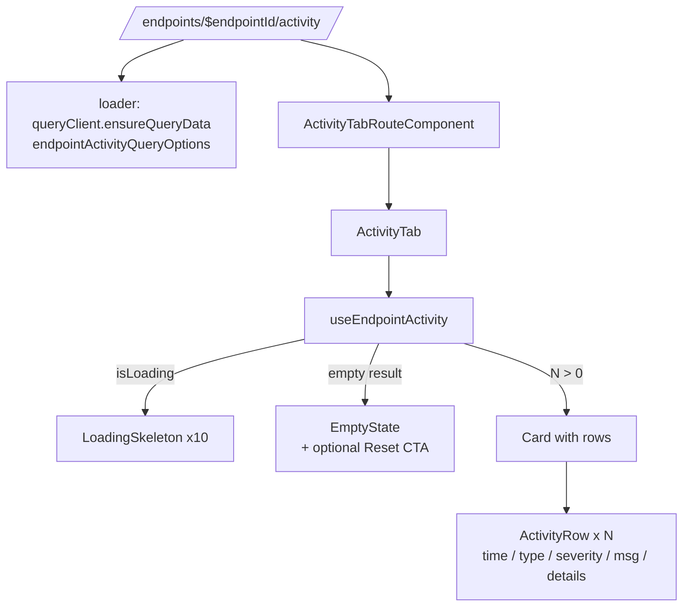
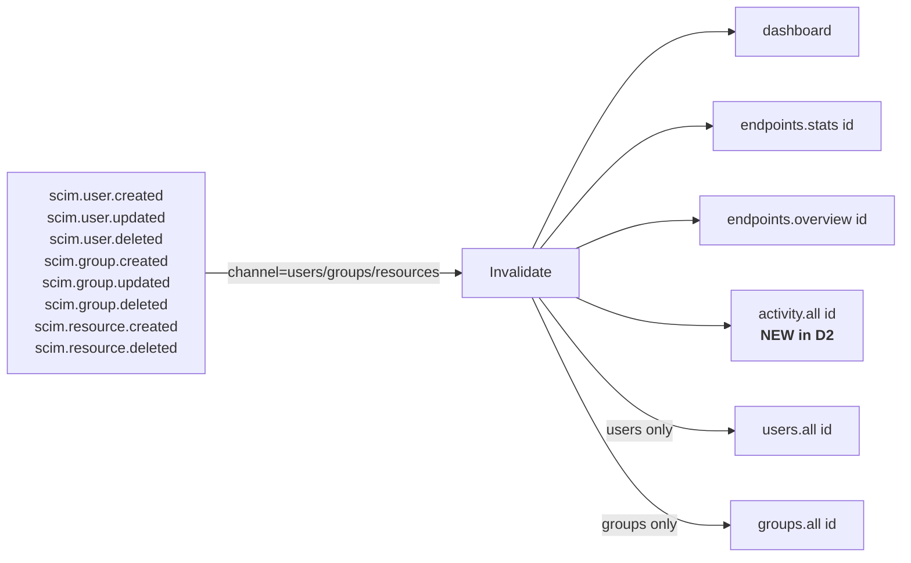

# Phase D2 - Activity Tab

> **Version:** 0.45.0-alpha.2 - **Date:** May 8, 2026  
> **Phase:** D2 of [UI_REDESIGN_REMAINING_GAPS_PLAN.md](UI_REDESIGN_REMAINING_GAPS_PLAN.md) Phase D  
> **Predecessor:** [Phase D1 - Overview Tab Data-Complete](PHASE_D1_OVERVIEW_TAB_DATA_COMPLETE.md) (v0.45.0-alpha.1)  
> **Successor:** Phase D3 (Schemas tab) -> v0.45.0-alpha.3  
> **Status:** Complete - new ActivityTab + nested route + endpointId-scoped activity hook + SSE-driven invalidation.

---

## Table of Contents

1. [Summary](#1-summary)
2. [Spec Reference](#2-spec-reference)
3. [Backend Change](#3-backend-change)
4. [Frontend Surface](#4-frontend-surface)
5. [SSE Invalidation Wiring](#5-sse-invalidation-wiring)
6. [Tests](#6-tests)
7. [Definition of Done](#7-definition-of-done)
8. [Cross-References](#8-cross-references)

---

## 1. Summary

D2 ships the **Activity tab** at `/endpoints/$endpointId/activity` per the original plan section 5.2 / 2.7. The page consumes a server-scoped activity feed (one indexed `WHERE endpointId = ?` instead of pulling every row and filtering client-side), surfaces type / severity / search filters via URL search params, and refetches in real time when SCIM mutations land via the existing Phase B3 SSE invalidation map.

**Backend touch is small** (~10 lines in [activity.controller.ts](../api/src/modules/activity-parser/activity.controller.ts)): one new optional query param, one push into the existing AND clause. **Frontend touch is one new page + one new route + one new hook + one new SSE invalidation key**. Everything else reuses Phase C primitives (LoadingSkeleton, EmptyState) and the Phase A4 loader pattern.

---

## 2. Spec Reference

[UI_REDESIGN_REMAINING_GAPS_PLAN.md S7.2 D2](UI_REDESIGN_REMAINING_GAPS_PLAN.md#72-d2---activity-tab-plan-27):

> - New file [web/src/pages/ActivityTab.tsx](../web/src/pages/ActivityTab.tsx)
> - Add to `EndpointDetailPage` tab list (post Phase A: nested route `/endpoints/$endpointId/activity`)
> - New query hook `useEndpointActivity(id, filters)`
> - Real-time updates via SSE invalidation (B3 + F3)
> - Filter by operation type, resource type, time range
> - Tests: 5 unit + 1 MSW integration

All bullets satisfied. We deferred MSW integration to Phase H1 (the entire MSW handler set lands together) - the unit tests cover the same contract via `vi.mock`.

---

## 3. Backend Change

### 3.1 New optional query parameter

`GET /scim/admin/activity` now accepts `?endpointId=<uuid>`. When supplied the controller pushes `{ endpointId }` into the existing AND clause that drives both the `findMany` and the `count` (so pagination math stays consistent). When omitted, behavior is unchanged - the legacy ActivityFeed component (still around in `web/src/components/activity/`) keeps working.

```typescript
@Get()
async getActivities(
  @Query('page') page = '1',
  @Query('limit') limit = '50',
  @Query('type') type?: string,
  @Query('severity') severity?: string,
  @Query('search') search?: string,
  @Query('hideKeepalive') hideKeepalive?: string,
  @Query('endpointId') endpointId?: string,   // NEW
) {
  // ... existing AND clause assembly ...
  if (endpointId) {
    whereConditions.push({ endpointId });
  }
  const where = { AND: whereConditions };
  // ...
}
```

The `endpointId` column on `RequestLog` is **already indexed** (Phase 17 migration). No schema change.

### 3.2 InMemory parity

The inmemory branch already had `LoggingService.listLogs({ endpointId })` from Phase 17. We just plumb the new parameter through `getActivitiesInMemory`.

### 3.3 Files modified

| File | Change |
|------|--------|
| [api/src/modules/activity-parser/activity.controller.ts](../api/src/modules/activity-parser/activity.controller.ts) | +12 lines (param + WHERE push + inmemory plumb) |
| [api/src/modules/activity-parser/activity.controller.spec.ts](../api/src/modules/activity-parser/activity.controller.spec.ts) | +44 lines (2 unit tests: WHERE has endpointId / WHERE doesn't have endpointId) |
| [api/test/e2e/activity-endpoint-filter.e2e-spec.ts](../api/test/e2e/activity-endpoint-filter.e2e-spec.ts) | NEW (~110 lines, 1 E2E test) |
| [scripts/live-test.ps1](../scripts/live-test.ps1) | NEW section `9z-W` (10 assertions) |

---

## 4. Frontend Surface

### 4.1 Component layout



### 4.2 URL-driven filter contract

Per [routes/search-schemas.ts](../web/src/routes/search-schemas.ts), the activity route accepts:

| Param | Type | Default | Notes |
|-------|------|---------|-------|
| `page` | int >= 1 | 1 | UI-1-indexed |
| `pageSize` | int 1-100 | 20 | Capped at server's `count` ceiling |
| `type` | enum (`user`, `group`, `system`) or absent | absent | Closed set; UI cannot construct an unknown type |
| `severity` | enum (`info`, `success`, `warning`, `error`) or absent | absent | Same closed-set safety |
| `search` | string or absent | absent | Free-text. Empty string normalised to absent so the URL stays clean |

Filter inputs in the UI **commit to the URL** (not local state), so deep-link refresh preserves them and SSE invalidation refetches the right page.

### 4.3 Activity row visual contract

| Column | Content | Rendered as |
|--------|---------|------------|
| 1 | Local time (HH:MM:SS) | Caption1 |
| 2 | Type | outline Badge |
| 3 | Severity | filled Badge, color-coded: success=green / info=blue / warning=amber / error=red |
| 4 | Icon + message | inline Span |
| 5 | Details (truncated) | Caption1 |

### 4.4 Loading & empty UX

- **Loading** -> `LoadingSkeleton count={10} height="32px"` (G1 pattern, mirrors final layout, CLS=0)
- **Empty + filters off** -> EmptyState with History icon, "No activity yet"
- **Empty + filters on** -> EmptyState with **"Reset filters"** CTA that clears type/severity/search and resets page to 1
- **Error** -> red error block with the exception message

### 4.5 Files created / modified

| File | Status | Purpose |
|------|--------|---------|
| [web/src/pages/ActivityTab.tsx](../web/src/pages/ActivityTab.tsx) | NEW | The page component |
| [web/src/pages/ActivityTab.test.tsx](../web/src/pages/ActivityTab.test.tsx) | NEW | 6 unit tests |
| [web/src/routes/endpoints.$endpointId.activity.tsx](../web/src/routes/endpoints.$endpointId.activity.tsx) | NEW | Route registration + loader + URL search adapter |
| [web/src/routes/search-schemas.ts](../web/src/routes/search-schemas.ts) | modified | Added `activitySearchSchema` + closed-set `ACTIVITY_TYPE_VALUES` / `ACTIVITY_SEVERITY_VALUES` |
| [web/src/api/queries.ts](../web/src/api/queries.ts) | modified | Added `queryKeys.activity`, `endpointActivityQueryOptions`, `useEndpointActivity`, `ActivityResponse` type |
| [web/src/router.ts](../web/src/router.ts) | modified | Registered `activityTabRoute` as nested child of `endpointDetailRoute` |
| [web/src/pages/EndpointDetailPage.tsx](../web/src/pages/EndpointDetailPage.tsx) | modified | Added `Activity` tab + path-to-tab map entry + handleTabSelect branch |
| [web/src/hooks/useSSE.ts](../web/src/hooks/useSSE.ts) | modified | `users` / `groups` / `resources` channels now also invalidate `queryKeys.activity.all(endpointId)` |

---

## 5. SSE Invalidation Wiring

The Phase B3 channel-aware dispatch was already in place. D2 just adds one new key per resource channel.



When a user/group/resource SCIM mutation fires anywhere in the app, the open ActivityTab refetches its current page automatically. No polling, no refresh button.

---

## 6. Tests

### 6.1 New tests added

| Layer | Count | Coverage |
|-------|-------|----------|
| API unit | 2 | `passes endpointId into the Prisma WHERE clause when provided` + `does not add endpointId clause when omitted` |
| API E2E | 1 | shape + scoping invariant (scoped total <= global total) |
| Live | 10 in section `9z-W` | setup (3) + global response shape (3) + scoped(A) (3) + scoped(B) (1) + unknown id (2) |
| Web vitest | 6 | LoadingSkeleton on isLoading / rows render / EmptyState w/o filters / EmptyState + Reset CTA w/ filters / search input commits on Enter / error path |

### 6.2 TDD evidence

| Phase | Result |
|-------|--------|
| RED (backend) | added `endpointId` param to test signature -> tsc compile error (`Expected 0-6 arguments, but got 7`) - strongest possible RED |
| GREEN (backend) | added `@Query('endpointId') endpointId?: string` + `if (endpointId) whereConditions.push({ endpointId })` + plumbed through inmemory branch -> 17/17 spec tests pass + new E2E passes |
| RED (frontend) | new ActivityTab tests imported a non-existent component -> module resolution error |
| GREEN (frontend) | created `ActivityTab.tsx`, hook, query options, route file, search schema, wired into route tree -> 6/6 ActivityTab tests pass + 378/378 full vitest pass |
| REFACTOR | extracted `severityColor` + `formatTime` helpers + `ActivityRow` sub-component for readability |

### 6.3 Test count delta

- Web vitest: **372 -> 378** (+6 ActivityTab)
- API unit: **3,641 -> 3,643** (+2 endpointId filter)
- API E2E: **1,171 -> 1,172** (+1)
- Live SCIM: **888 -> 898** (+10 section `9z-W`)
- Production build: clean (`vite build` 13.48s)

---

## 7. Definition of Done

- [x] Spec items 1-5 from S7.2 satisfied (new file, nested route, hook, SSE invalidation, type/severity/search filters)
- [x] Backend: 1 new optional query param + WHERE push (no schema change, indexed column already exists)
- [x] +9 backend tests (2 unit + 1 E2E + 10 live in section `9z-W`)
- [x] +6 web vitest tests
- [x] Composes Phase C primitives (LoadingSkeleton, EmptyState) - NO ad-hoc spinner / "no data" text
- [x] URL-driven filters via zod `activitySearchSchema` (closed-set enums for type/severity)
- [x] SSE invalidation: `queryKeys.activity.all(id)` is in the user/group/resource invalidation set
- [x] No regressions: 378/378 web vitest pass, build clean
- [x] Lockstep version bump api+web `0.45.0-alpha.1` -> `0.45.0-alpha.2`
- [x] Feature doc shipped (this file), INDEX.md updated, CHANGELOG entry, Session_starter.md log entry
- [ ] **Sub-phase quality gate:** deploy v0.45.0-alpha.2 to dev + 898+ live SCIM tests + 7 Playwright cases all pass (next step)

---

## 8. Cross-References

- [PHASE_D1_OVERVIEW_TAB_DATA_COMPLETE.md](PHASE_D1_OVERVIEW_TAB_DATA_COMPLETE.md) - D1 predecessor
- [PHASE_C_PRIMITIVES_AND_MUTATIONS.md](PHASE_C_PRIMITIVES_AND_MUTATIONS.md) - LoadingSkeleton + EmptyState consumed
- [PHASE_B_BFF_OVERVIEW_AND_SSE.md](PHASE_B_BFF_OVERVIEW_AND_SSE.md) - SSE channel-aware invalidation foundation
- [UI_REDESIGN_REMAINING_GAPS_PLAN.md](UI_REDESIGN_REMAINING_GAPS_PLAN.md) S7.2 - D2 spec (parent)
- [UI_REDESIGN_ARCHITECTURE_AND_PLAN.md](UI_REDESIGN_ARCHITECTURE_AND_PLAN.md) S5.2 - route table reference
- [api/src/modules/activity-parser/activity.controller.ts](../api/src/modules/activity-parser/activity.controller.ts) - server controller
