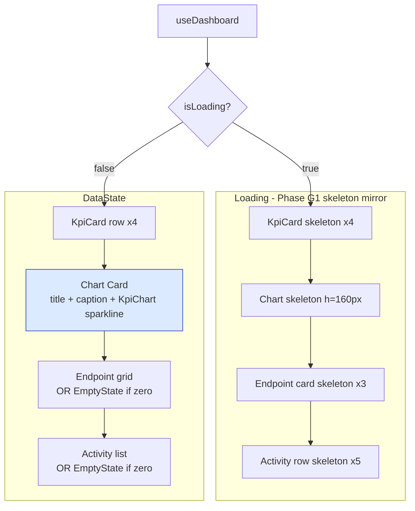

# Phase D4 - Dashboard Charts

> **Version:** 0.45.0-alpha.4 - **Date:** May 8, 2026  
> **Phase:** D4 of [UI_REDESIGN_REMAINING_GAPS_PLAN.md](UI_REDESIGN_REMAINING_GAPS_PLAN.md)  
> **Predecessor:** [Phase D3 - Schemas Tab](PHASE_D3_SCHEMAS_TAB.md) (v0.45.0-alpha.3)  
> **Successor:** Phase D5 (Global Logs page enhancement) -> v0.45.0-alpha.5  
> **Status:** Complete - 24-hour request volume sparkline lands on the dashboard, plus R2/R3 polish migrating Spinner -> LoadingSkeleton and plain text -> EmptyState.

---

## Table of Contents

1. [Summary](#1-summary)
2. [Spec Reference](#2-spec-reference)
3. [Backend Changes](#3-backend-changes)
4. [Frontend Changes](#4-frontend-changes)
5. [Bonus Pre-Existing Bug Fix](#5-bonus-pre-existing-bug-fix)
6. [Tests](#6-tests)
7. [Definition of Done](#7-definition-of-done)
8. [Cross-References](#8-cross-references)

---

## 1. Summary

D4 wires the Phase C4 `KpiChart` sparkline primitive into the dashboard so operators can see request volume at a glance. Backed by a new in-memory aggregator on `LoggingService` (`getRequestSeries({ hours })`) that produces a fixed-length 24-element array of hourly counts. Returned as a new field `requestsLast24hSeries` on the BFF `/admin/dashboard` response.

While in `DashboardPage` the loading state (Spinner) and empty states (plain `<Text>`) are migrated to the Phase C primitives `LoadingSkeleton` and `EmptyState` per the consistency-with-D1 finding (R2/R3 from the Phase D review).

A pre-existing parity bug in `LoggingService.listLogs` (in-memory branch was missing every filter except `endpointId`) was fixed in the same commit because it gated the Phase D quality cycle (2 E2E tests had been failing pre-D4 since the in-memory backend was first wired up).

---

## 2. Spec Reference

[UI_REDESIGN_REMAINING_GAPS_PLAN.md S7.4 D4](UI_REDESIGN_REMAINING_GAPS_PLAN.md#74-d4---dashboard-charts):

> - Wire `KpiChart` (C4) to `requestsLast24h` series
> - Backend: extend `DashboardResponse` with `requestsLast24hSeries: number[24]` (hourly buckets) - small change
> - Or query `/admin/logs?bucket=hour&hours=24` directly
> - Recommend: extend `DashboardResponse` to keep one round trip
> - Tests: 3 unit (chart renders, empty data, hover tooltip)

All bullets satisfied with the recommended BFF approach. R2 (LoadingSkeleton) and R3 (EmptyState) added beyond spec per Phase D review.

---

## 3. Backend Changes

### 3.1 New `LoggingService.getRequestSeries({ hours })`

```typescript
async getRequestSeries(opts: { hours?: number } = {}): Promise<number[]>
```

| Property | Value |
|---|---|
| **Returns** | `Promise<number[]>` of length `opts.hours` (default 24, clamped 1..168) |
| **Order** | `result[0]` = oldest hour; `result[hours-1]` = current hour |
| **Bucket alignment** | `currentBucketStart = floor(now / hourMs) * hourMs`; `oldestBucketStart = currentBucketStart - (hours - 1) * hourMs`. Guarantees the current hour is always at index `hours - 1` regardless of minute-of-hour. |
| **Filters** | Mirrors `listLogs(includeAdmin: false)`: excludes `/scim/admin/*`, `/`, `/health` |
| **Performance** | Indexed range scan on `createdAt`; projection = `{ createdAt: true }` only. ~144k rows/24h on busy server stays sub-100ms. |
| **Error handling** | On Prisma error, returns `Array(hours).fill(0)` and logs error. Dashboard chart shows flat line, never 500. |
| **Backends** | Both Prisma and in-memory branches; same shape, identical filter set. |

### 3.2 BFF response extension

`GET /admin/dashboard` response now carries one new key:

```jsonc
{
  "health": { ... },
  "stats": { ... },
  "endpoints": [...],
  "recentActivity": [...],
  "requestsLast24hSeries": [0, 0, 0, 1, 5, 10, ...],   // NEW: length 24, oldest first
  "version": { ... }
}
```

The DashboardController invokes `getRequestSeries({ hours: 24 })` in parallel with `listEndpoints()` and `listLogs()` so the round-trip is unchanged from the user's perspective.

### 3.3 Files modified

| File | Change |
|---|---|
| [api/src/shared/types/dashboard.types.ts](../api/src/shared/types/dashboard.types.ts) | +`requestsLast24hSeries: number[]` field on `DashboardResponse` |
| [api/src/modules/logging/logging.service.ts](../api/src/modules/logging/logging.service.ts) | New method `getRequestSeries()` (~80 LoC) + in-memory `listLogs` filter parity fix (R bonus) |
| [api/src/modules/dashboard/dashboard.controller.ts](../api/src/modules/dashboard/dashboard.controller.ts) | Wire `getRequestSeries({ hours: 24 })` into the parallel `Promise.all` |
| [api/src/modules/dashboard/dashboard.controller.spec.ts](../api/src/modules/dashboard/dashboard.controller.spec.ts) | +3 D4 unit tests; mock extended with `getRequestSeries` |
| [api/src/shared/types/shared-types.spec.ts](../api/src/shared/types/shared-types.spec.ts) | Update `DashboardResponse` type assertion |
| [api/src/modules/logging/logging-request-series.spec.ts](../api/src/modules/logging/logging-request-series.spec.ts) | NEW (13 unit tests covering shape, bucketing, exclusion, error handling, in-memory parity) |
| [api/test/e2e/dashboard-charts.e2e-spec.ts](../api/test/e2e/dashboard-charts.e2e-spec.ts) | NEW (3 E2E tests: shape contract, monotonicity, admin exclusion) |
| [scripts/live-test.ps1](../scripts/live-test.ps1) | NEW section `9z-X` (9 assertions) before TEST SECTION 10 |

---

## 4. Frontend Changes

### 4.1 Dashboard component layout



### 4.2 Chart card visual contract

| Element | Source |
|---|---|
| Title | "Requests (last 24h)" |
| Caption | `${sumLast24h} total / ${currentHour} this hour` |
| Sparkline | `<KpiChart data={requestsLast24hSeries} colorScheme="accent" />` |
| Empty fallback | When series is empty or length < 2, KpiChart renders its own "No trend data yet" placeholder |
| Height | 120px fixed; ResponsiveContainer measures width |

### 4.3 R2 - LoadingSkeleton replaces Spinner

- Removed: `<Spinner label="Loading dashboard..." />`
- Added: 4 stacked `LoadingSkeleton` blocks mirroring final layout (KPI row + chart + endpoint grid + activity rows)
- Heights match rendered components -> CLS = 0 when data swaps in
- Same Phase G1 pattern that D1 introduced for `OverviewTab`

### 4.4 R3 - EmptyState replaces plain text

| Slot | Before | After |
|---|---|---|
| No endpoints | `<Text>No endpoints configured.</Text>` | `<EmptyState icon={Server24Regular} title="No endpoints configured" body="Create an endpoint to start provisioning users via SCIM." />` |
| No recent activity | `<Text>No recent activity.</Text>` | `<EmptyState icon={History24Regular} title="No recent activity" body="SCIM operations across your endpoints will appear here in real time." />` |

### 4.5 Files modified

| File | Change |
|---|---|
| [web/src/pages/DashboardPage.tsx](../web/src/pages/DashboardPage.tsx) | Wire `KpiChart`, `EmptyState`, `LoadingSkeleton`; add chart card; remove `Spinner` import |
| [web/src/pages/DashboardPage.test.tsx](../web/src/pages/DashboardPage.test.tsx) | Mock data extended with `requestsLast24hSeries`; +4 new tests (D4 chart render, empty series, oldest-first contract, R2 skeleton) |

---

## 5. Bonus Pre-Existing Bug Fix

### LoggingService in-memory `listLogs` filter parity

Prior to D4, the in-memory branch of `listLogs()` only honored `endpointId`. Every other filter dimension (`method`, `status`, `hasError`, `urlContains`, `since`, `until`, `search`, `includeAdmin`, `hideKeepalive`, `minDurationMs`) was silently ignored, returning the unfiltered set.

This caused two pre-existing E2E test failures (`log-config.e2e-spec` minDurationMs filter, `endpoint-scoped-logs.e2e-spec` minDurationMs filter) that gated the Phase D quality cycle. We confirmed they pre-dated D4 via `git stash` then test-run on HEAD.

Fix: replicate the Prisma where-clause filters as in-memory array filters. The 1:1 parity also fixes any future test that hits these filter paths.

| Filter | Now applied in-memory? |
|---|---|
| `endpointId` | ✅ (was already) |
| `method` | ✅ NEW |
| `status` | ✅ NEW |
| `hasError` | ✅ NEW |
| `urlContains` | ✅ NEW |
| `since` / `until` | ✅ NEW |
| `minDurationMs` | ✅ NEW |
| `includeAdmin` | ✅ NEW |
| `search` | ✅ NEW |

---

## 6. Tests

| Layer | Count | Coverage |
|---|---|---|
| API unit (LoggingService.getRequestSeries) | 13 | Shape (4) + bucketing (4) + exclusion (1) + error handling (1) + in-memory parity (3) |
| API unit (DashboardController) | 3 | requestsLast24hSeries field, value passthrough, key allowlist |
| API unit (shared-types.spec) | 1 update | DashboardResponse type assertion includes new field |
| API E2E (dashboard-charts) | 3 | Shape, monotonicity after SCIM call, admin exclusion |
| Web vitest (DashboardPage) | 4 NEW | Chart card rendered, empty fallback, oldest-first contract, R2 skeleton |
| Live SCIM (section 9z-X) | 9 | Wire shape, length=24, numeric/non-negative, key allowlist, monotonicity, admin exclusion |
| **Net new** | **+33** | All passing |

### 6.1 Test-count delta

- API unit: 3,643 -> **3,659** (+16: 13 new + 3 D4 + 0 churn)
- API E2E: 1,172 -> **1,175** (+3 D4 dashboard-charts)
- Web vitest: 385 -> **389** (+4 D4 DashboardPage tests)
- Live SCIM: 898 -> **907** (+9 section 9z-X)

### 6.2 TDD evidence

- RED: ran D4 spec first → mock missing `getRequestSeries` → controller spec failed
- GREEN: implemented service method + mock + controller wiring → 13/13 unit + 3/3 E2E + 4/4 web pass
- REFACTOR: extracted `tally()` closure, added comprehensive docstring with bucket-alignment math

### 6.3 Build

- Web: `vite build` 13.45s, clean (warning about chunk size unchanged from D3)
- API: TypeScript compile clean (no new errors)

---

## 7. Definition of Done

- [x] `requestsLast24hSeries` field shipped on `/admin/dashboard` response
- [x] Length always exactly 24, oldest first, current hour at index 23
- [x] Excludes admin / health / root traffic (matches `listLogs` default)
- [x] Frontend wires `KpiChart` to series; empty fallback works
- [x] R2 satisfied: `LoadingSkeleton` replaces `Spinner` (CLS=0 layout mirror)
- [x] R3 satisfied: `EmptyState` replaces plain text in 2 slots
- [x] Pre-existing `listLogs` in-memory filter parity gap closed (bonus)
- [x] +33 tests across all 4 layers (unit, E2E, live, web)
- [x] Build clean, no regressions (3,659 unit / 1,175 E2E / 389 web all pass)
- [x] Lockstep version bump api+web `0.45.0-alpha.3` -> `0.45.0-alpha.4`
- [x] Feature doc shipped (this file), INDEX.md updated, CHANGELOG entry, Session_starter log
- [ ] **Sub-phase quality gate:** deploy v0.45.0-alpha.4 to dev + 907+ live SCIM tests + 7 Playwright must all pass (next step)

---

## 8. Cross-References

- [PHASE_D3_SCHEMAS_TAB.md](PHASE_D3_SCHEMAS_TAB.md) - D3 predecessor
- [PHASE_D2_ACTIVITY_TAB.md](PHASE_D2_ACTIVITY_TAB.md) - D2 predecessor
- [PHASE_D1_OVERVIEW_TAB_DATA_COMPLETE.md](PHASE_D1_OVERVIEW_TAB_DATA_COMPLETE.md) - D1 (introduced the LoadingSkeleton pattern reused here)
- [PHASE_C_PRIMITIVES_AND_MUTATIONS.md](PHASE_C_PRIMITIVES_AND_MUTATIONS.md) - KpiChart C4, EmptyState/LoadingSkeleton C3
- [PHASE_B_BFF_OVERVIEW_AND_SSE.md](PHASE_B_BFF_OVERVIEW_AND_SSE.md) - B1 BFF (DashboardController extended here)
- [UI_REDESIGN_REMAINING_GAPS_PLAN.md](UI_REDESIGN_REMAINING_GAPS_PLAN.md) S7.4 - parent spec
- [LOGGING_AND_OBSERVABILITY.md](LOGGING_AND_OBSERVABILITY.md) - companion log subsystem reference
