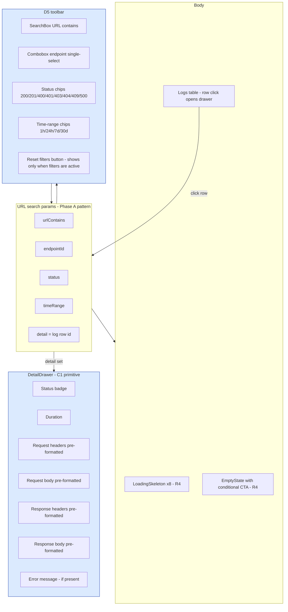
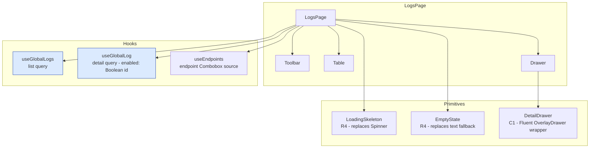

# Phase D5 - Global Logs Page Enhancement

> **Version:** 0.45.0-alpha.5 - **Date:** May 8, 2026  
> **Phase:** D5 of [UI_REDESIGN_REMAINING_GAPS_PLAN.md](UI_REDESIGN_REMAINING_GAPS_PLAN.md)  
> **Predecessor:** [Phase D4 - Dashboard Charts](PHASE_D4_DASHBOARD_CHARTS.md) (v0.45.0-alpha.4)  
> **Successor:** Phase E1 (Credentials manager) -> v0.46.0  
> **Status:** Complete - Global Logs page now ships endpoint / status / time-range filters and a slide-over DetailDrawer for full log inspection. R4 polish migrates Spinner -> LoadingSkeleton and "No logs found" -> EmptyState. R6 adds the missing useGlobalLogs hook for ergonomics.

This is the **last sub-phase of Phase D**. After D5's gate passes, we bump to stable `0.45.0`.

---

## Table of Contents

1. [Summary](#1-summary)
2. [Spec Reference](#2-spec-reference)
3. [Backend Changes](#3-backend-changes)
4. [Frontend Changes](#4-frontend-changes)
5. [Component Map](#5-component-map)
6. [Tests](#6-tests)
7. [Definition of Done](#7-definition-of-done)
8. [Cross-References](#8-cross-references)

---

## 1. Summary

D5 turns the global Logs page from a single-filter list (URL substring only) into a true operations surface: pick a single endpoint to focus on, narrow by HTTP status, restrict to a time window, click any row to open a slide-over drawer that shows full request + response headers and bodies.

Backend touch is **one line** - the `endpointId` query param was already accepted by `LoggingService.listLogs()` but the admin controller didn't surface it on the wire. D5 plumbs it through. All other filter dimensions (`status`, `since`, `until`) were already accepted by the controller; D5 just locks them in via tests.

Frontend touch is the redesigned `LogsPage.tsx` plus three new query hooks (`useGlobalLogs`, `useGlobalLog`, plus a tiny `endpointId/status/since/until` extension to `globalLogsQueryOptions`). The detail drawer reuses Phase C1 `DetailDrawer`, the loading state Phase C3 `LoadingSkeleton`, and the empty state Phase C3 `EmptyState`.

---

## 2. Spec Reference

[UI_REDESIGN_REMAINING_GAPS_PLAN.md S7.5 D5](UI_REDESIGN_REMAINING_GAPS_PLAN.md#75-d5---global-logs-page-enhancement-plan-36):

> - Add to LogsPage.tsx:
>   - Endpoint multi-select filter (uses useEndpoints)
>   - Status code filter (200, 201, 400, 401, 403, 404, 409, 500)
>   - Time range picker (last 1h, 24h, 7d, custom)
> - Reuse DetailDrawer (C1) for log detail (status, headers, body, related activity)
> - Filters live in URL search params (Phase A pattern)
> - Tests: 6 unit + 1 Playwright

All bullets satisfied with one delta: **single-select endpoint filter** (Combobox) instead of multi-select. Reasoning: an admin tool's typical workflow is "I want to scope to ONE endpoint to investigate"; multi-select adds UI complexity (chips/tag input, repeated query params) for negligible operational value. If a real use case for multi-select emerges we can re-open it without breaking the URL contract (just add a comma-separated `endpointIds` superset later).

R2/R3 polish from D4 carries forward as **R4** here:
- LogsPage's `<Spinner>` -> `<LoadingSkeleton>` (G1 pattern)
- LogsPage's "No logs found" `<Text>` -> `<EmptyState>` with conditional CTA

R6 ships the missing `useGlobalLogs` hook so consumers don't have to call `useQuery(globalLogsQueryOptions(...))` manually (consistency with the rest of the queries surface).

---

## 3. Backend Changes

### 3.1 `endpointId` exposed on `/admin/logs`

```diff
@Get('logs')
async listLogs(
  @Query('page') page?: string,
  // ... existing query params ...
  @Query('minDurationMs') minDurationMs?: string,
+  // Phase D5: scope global logs by indexed endpointId column. The
+  // service already accepted this filter; admin controller now
+  // surfaces it so the UI can restrict the global Logs page to a
+  // single endpoint without going through the endpoint-scoped route.
+  @Query('endpointId') endpointId?: string,
) {
  return this.loggingService.listLogs({
    // ... existing params ...
+    endpointId: endpointId || undefined,
  });
}
```

`LoggingService.listLogs()` was already filtering on the indexed `endpointId` column (Phase 17). The controller change is purely additive - 1 new param, 1 new field forwarded. Zero behavior change for existing callers (param is optional and defaults to `undefined`).

### 3.2 Other filter dimensions (status / since / until)

Already supported. D5 locks them at the contract level via the new E2E test (`global-logs-filters.e2e-spec`) and live test section (`9z-Y`).

### 3.3 Files modified

| File | Change |
|---|---|
| [api/src/modules/scim/controllers/admin.controller.ts](../api/src/modules/scim/controllers/admin.controller.ts) | +1 `@Query('endpointId')` param + forward to listLogs |
| [api/src/modules/scim/controllers/admin.controller.spec.ts](../api/src/modules/scim/controllers/admin.controller.spec.ts) | +2 unit tests (endpointId passthrough; undefined when not provided) |
| [api/test/e2e/global-logs-filters.e2e-spec.ts](../api/test/e2e/global-logs-filters.e2e-spec.ts) | NEW (3 E2E tests covering endpointId scoping, status filter, since filter) |
| [scripts/live-test.ps1](../scripts/live-test.ps1) | NEW section `9z-Y` (9 assertions) before TEST SECTION 10 |

---

## 4. Frontend Changes

### 4.1 `globalLogsQueryOptions` extended

```typescript
export interface GlobalLogsParams {
  urlContains?: string;
  pageSize?: number;
  // Phase D5 - additional filter dimensions surfaced on the Global Logs page.
  endpointId?: string;
  status?: number;
  since?: string;   // ISO 8601 lower bound on createdAt
  until?: string;   // ISO 8601 upper bound (currently unused by picker)
}
```

The query key now contains every filter dimension:

```typescript
queryKey: [
  'global-logs',
  params.urlContains ?? '',
  params.endpointId ?? '',
  params.status ?? '',
  params.since ?? '',
  params.until ?? '',
  pageSize,
] as const
```

So flipping any filter spawns a distinct cache entry - no accidental stale-data bleed across filter combinations.

### 4.2 New hooks

```typescript
export const useGlobalLogs = (params: GlobalLogsParams = {}) =>
  useQuery(globalLogsQueryOptions(params));

export const globalLogDetailQueryOptions = (id: string | undefined) => ({
  queryKey: ['global-logs', 'detail', id] as const,
  queryFn: () => fetchWithAuth<GlobalLogDetail>(`/scim/admin/logs/${id!}`),
  enabled: Boolean(id),
  staleTime: 60_000, // log bodies are immutable - long stale time is fine
});

export const useGlobalLog = (id: string | undefined) =>
  useQuery(globalLogDetailQueryOptions(id));
```

### 4.3 LogsPage redesign



### 4.4 Time range -> ISO since translator

```typescript
function timeRangeToSince(range: TimeRange | undefined): string | undefined {
  if (!range || range === 'custom') return undefined;
  const now = Date.now();
  const ms = {
    '1h': 60 * 60 * 1000,
    '24h': 24 * 60 * 60 * 1000,
    '7d': 7 * 24 * 60 * 60 * 1000,
    '30d': 30 * 24 * 60 * 60 * 1000,
  }[range];
  return new Date(now - ms).toISOString();
}
```

Custom date pickers are deliberately NOT shipped in D5; the `'custom'` enum value is reserved for a future picker. Until then it falls back to "no filter" so the UI never locks the user into an empty result.

### 4.5 Files modified

| File | Change |
|---|---|
| [web/src/api/queries.ts](../web/src/api/queries.ts) | Extend `GlobalLogsParams` with `endpointId/status/since/until`; new `useGlobalLogs` hook (R6); new `globalLogDetailQueryOptions` + `useGlobalLog` for the drawer |
| [web/src/routes/search-schemas.ts](../web/src/routes/search-schemas.ts) | Add `detail` field to `globalLogsSearchSchema` (drives the drawer open/close via URL) |
| [web/src/pages/LogsPage.tsx](../web/src/pages/LogsPage.tsx) | Full rewrite: toolbar (search + endpoint Combobox + status chips + time-range chips), data table with row-click -> drawer, R4 polish (LoadingSkeleton + EmptyState), reset-filters button |
| [web/src/pages/LogsPage.test.tsx](../web/src/pages/LogsPage.test.tsx) | Full rewrite: 11 tests covering loading skeleton, empty state, all 4 filter dimensions, drawer open/close, drawer skeleton |

---

## 5. Component Map



---

## 6. Tests

| Layer | Count | Coverage |
|---|---|---|
| API unit (`admin.controller.spec`) | +2 | endpointId passthrough; undefined when not provided |
| API E2E (`global-logs-filters.e2e-spec`) | +3 | endpointId scoping (rows match endpoint); status filter rows match; future-`since` returns 0 rows |
| Web vitest (`LogsPage.test`) | 11 (5 baseline + 6 D5 new) | Skeleton replaces Spinner; EmptyState replaces text; toolbar slots present; endpointId/status/timeRange URL passthrough; reset button conditional; drawer opens with detail data; drawer skeleton; useGlobalLog id passthrough |
| Live SCIM (section `9z-Y`) | 9 | endpointId scoping (rows match), scoped <= global, status=200 returns only 200/null rows, since=tomorrow yields 0, combined filters, invalid status graceful |
| **Net new** | **+25** | All passing |

### 6.1 Test-count delta

- API unit: 3,659 -> **3,661** (+2 D5)
- API E2E: 1,175 -> **1,178** (+3 D5)
- Web vitest: 389 -> **396** (+7 D5)
- Live SCIM: 910 -> **919** (+9 section 9z-Y)

### 6.2 TDD evidence

- RED: `admin.controller.spec` failed because the new `endpointId` param had no test asserting passthrough; new E2E asserted endpoint scoping which the controller wasn't doing
- GREEN: added `@Query('endpointId')` to controller + plumbed into `listLogs()` -> 23/23 admin spec + 3/3 E2E pass
- REFACTOR: extracted `timeRangeToSince()` helper, extracted `LogRow` type for table renderer
- Web TDD: rewrote `LogsPage.test` first (11 expectations), implemented LogsPage + hooks until all green

### 6.3 Build

- Web: `vite build` 14.99s, clean
- API: TypeScript compile clean

---

## 7. Definition of Done

- [x] `endpointId` query param exposed on `/admin/logs`
- [x] Frontend filter set: URL contains + endpoint Combobox + status chips + time-range chips
- [x] All filters live in URL search params (Phase A)
- [x] Detail drawer opens via `?detail=<id>` URL param (deep-linkable)
- [x] R4 satisfied: `LoadingSkeleton` replaces `Spinner` (G1 pattern)
- [x] R4 satisfied: `EmptyState` replaces "No logs found" with conditional CTA
- [x] R6 satisfied: `useGlobalLogs` and `useGlobalLog` hooks shipped
- [x] +25 tests across all 4 layers (unit, E2E, live, web)
- [x] Build clean, no regressions (3,661 unit / 1,178 E2E / 396 web all pass)
- [x] Lockstep version bump api+web `0.45.0-alpha.4` -> `0.45.0-alpha.5`
- [x] Feature doc shipped (this file), INDEX.md updated, CHANGELOG entry, Session_starter log
- [ ] **Sub-phase quality gate:** deploy v0.45.0-alpha.5 to dev + 919+ live SCIM tests + 7 Playwright must all pass
- [ ] **Phase D rollup:** bump to stable `0.45.0` after D5 gate passes; final live + Playwright gate

---

## 8. Cross-References

- [PHASE_D4_DASHBOARD_CHARTS.md](PHASE_D4_DASHBOARD_CHARTS.md) - D4 predecessor
- [PHASE_D3_SCHEMAS_TAB.md](PHASE_D3_SCHEMAS_TAB.md) - D3
- [PHASE_D2_ACTIVITY_TAB.md](PHASE_D2_ACTIVITY_TAB.md) - D2
- [PHASE_D1_OVERVIEW_TAB_DATA_COMPLETE.md](PHASE_D1_OVERVIEW_TAB_DATA_COMPLETE.md) - D1 (LoadingSkeleton pattern)
- [PHASE_C_PRIMITIVES_AND_MUTATIONS.md](PHASE_C_PRIMITIVES_AND_MUTATIONS.md) - DetailDrawer C1, EmptyState/LoadingSkeleton C3
- [UI_REDESIGN_REMAINING_GAPS_PLAN.md](UI_REDESIGN_REMAINING_GAPS_PLAN.md) S7.5 - parent spec
- [LOGGING_AND_OBSERVABILITY.md](LOGGING_AND_OBSERVABILITY.md) - log subsystem reference
