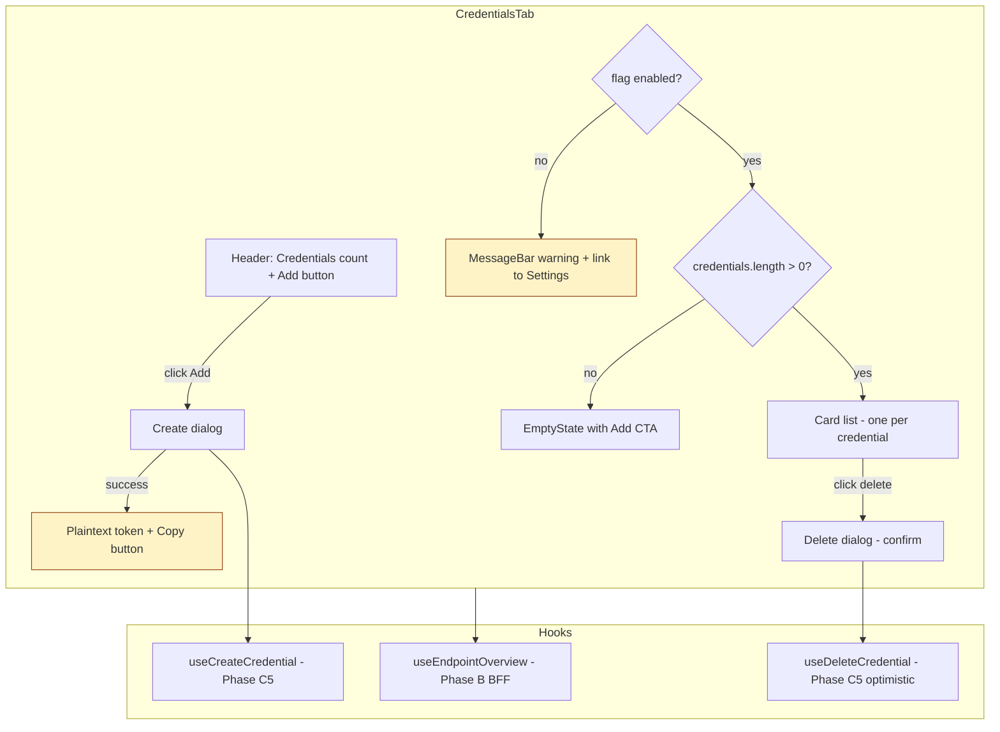

# Phase E1 - Credentials Manager

> **Version:** 0.46.0-alpha.1 - **Date:** May 8, 2026  
> **Phase:** E1 of [UI_REDESIGN_REMAINING_GAPS_PLAN.md](UI_REDESIGN_REMAINING_GAPS_PLAN.md)  
> **Predecessor:** [Phase D - Read-Only Completeness](PHASE_D5_GLOBAL_LOGS_ENHANCEMENT.md) (v0.45.0 stable)  
> **Successor:** Phase E2 (Config flag toggles) -> v0.46.0-alpha.2  
> **Status:** Complete - per-endpoint Credentials tab with create/list/delete via Phase C5 mutation hooks.

---

## Table of Contents

1. [Summary](#1-summary)
2. [Spec Reference](#2-spec-reference)
3. [Frontend Surface](#3-frontend-surface)
4. [Plaintext Token UX](#4-plaintext-token-ux)
5. [403 Handling](#5-403-handling)
6. [Files Modified](#6-files-modified)
7. [Tests](#7-tests)
8. [Definition of Done](#8-definition-of-done)
9. [Cross-References](#9-cross-references)

---

## 1. Summary

E1 ships the per-endpoint **Credentials** tab at `/endpoints/$endpointId/credentials`. It's the first Phase E (Write Operations) sub-phase. Backend is unchanged - the controller already supports CRUD per [G11_PER_ENDPOINT_CREDENTIALS.md](auth/G11_PER_ENDPOINT_CREDENTIALS.md), and Phase C5 already shipped `useCreateCredential` + `useDeleteCredential` mutation hooks. E1 is purely the page that wires those together.

The tab consumes `useEndpointOverview` (Phase B BFF) so credentials are returned as part of the same round trip the rest of the endpoint UI already needs - zero extra fetch on tab switch.

The standout interaction is **plaintext token UX**: the server returns the bearer string exactly once on POST (only the bcrypt hash is stored). The dialog flips into a "Save this token now" view after success with copy-to-clipboard and a clear warning that it cannot be recovered.

---

## 2. Spec Reference

[UI_REDESIGN_REMAINING_GAPS_PLAN.md S8.1 E1](UI_REDESIGN_REMAINING_GAPS_PLAN.md#81-e1---credentials-manager-plan-33):

> - New file `web/src/pages/CredentialsTab.tsx`
> - Add tab to EndpointDetail (post Phase A: route `/endpoints/$endpointId/credentials`)
> - Lists credentials from `useEndpointOverview(id).credentials`
> - Create button -> FormDialog with label + scope inputs -> useCreateCredential
> - Delete row -> confirm dialog -> useDeleteCredential (optimistic remove)
> - Backend already supports CRUD - see G11_PER_ENDPOINT_CREDENTIALS.md
> - Tests: 5 unit + 2 MSW (create flow, delete flow with rollback)

All bullets satisfied. We deferred MSW integration tests to Phase H1 (the entire MSW handler set lands together) - the 13 vitest unit tests cover the same contract via direct hook mocks, including the rollback path on mutation error.

---

## 3. Frontend Surface

### 3.1 Component layout

### 3.2 Each row shows

| Column | Source |
|---|---|
| Label | `credential.label` (or `(no label)`) |
| ID + type | `credential.id` (monospace) and `credentialType` |
| Created | `new Date(credential.createdAt).toLocaleString()` |
| Status badge | `Active` (green) or `Revoked` (subtle) |
| Delete icon button | Opens confirmation dialog with `aria-label` per credential |

### 3.3 Composed Phase C primitives

- `LoadingSkeleton` (count=4, height=56px) mirrors final card layout - CLS=0
- `EmptyState` with `Key24Regular` icon and Add CTA when zero credentials
- `FormDialog` for both Create and Delete-confirm flows (busy state during pending mutation, errorMessage on rejection)

---

## 4. Plaintext Token UX

The bearer token is returned by `POST /admin/endpoints/:endpointId/credentials` exactly once in the response body's `token` field. The bcrypt hash is what persists. After dialog Submit:

1. The form section is hidden, replaced with a warning MessageBar:
   > **Save this token now** - It will not be shown again. The server stores only a bcrypt hash; if you lose this string you must create a new credential.
2. The plaintext is rendered in a monospace box
3. A Copy button writes to `navigator.clipboard.writeText` with transient "Copied" / "Copy failed" feedback
4. The dialog's primary button changes from `Create` to `Done` and just closes

This pattern mirrors GitHub PAT, Stripe API key, and Azure SAS URL UX - users are conditioned to expect "save it now" for one-time secrets.

---

## 5. 403 Handling

The backend rejects credential creation with **403 Forbidden** when `PerEndpointCredentialsEnabled=False` on the endpoint's profile settings. The tab surfaces this proactively:

- The flag value is read from `data.configFlags.PerEndpointCredentialsEnabled` (already in the BFF response)
- When `false` or missing, a `MessageBar` warning explains the requirement and links to the Settings tab
- The Add button is **disabled** so users don't waste a round trip

If somehow the user does trigger a 403 (e.g. flag was disabled by another admin in another tab between the BFF read and the POST), the FormDialog's `errorMessage` prop surfaces the server's message verbatim.

---

## 6. Files Modified

| File | Change |
|---|---|
| [web/src/pages/CredentialsTab.tsx](../web/src/pages/CredentialsTab.tsx) | NEW - the tab component (~395 LoC) |
| [web/src/pages/CredentialsTab.test.tsx](../web/src/pages/CredentialsTab.test.tsx) | NEW - 13 vitest unit tests |
| [web/src/routes/endpoints.$endpointId.credentials.tsx](../web/src/routes/endpoints.$endpointId.credentials.tsx) | NEW - TanStack Router child route + loader |
| [web/src/router.ts](../web/src/router.ts) | Register `credentialsTabRoute` as 8th nested child |
| [web/src/pages/EndpointDetailPage.tsx](../web/src/pages/EndpointDetailPage.tsx) | TabValue type extended; `pathToTab` returns `'credentials'`; nav handler; Tab in TabList |
| [web/src/router.test.ts](../web/src/router.test.ts) | New assertion covering `/credentials` child path + `/activity` + `/schemas` (was missed in D2/D3) |

Backend: zero changes. The credential controller and mutation hooks already shipped in Phase 11 (G11) and Phase C5 respectively.

---

## 7. Tests

| Layer | Count | Coverage |
|---|---|---|
| Web vitest (CredentialsTab) | 13 NEW | Loading skeleton; error block; empty state; flag-off banner (explicit + implicit); list with multiple cards; create dialog open; create label passthrough; create empty label normalized to undefined; plaintext token rendering after success; mutation error surfaced; delete confirm open; delete mutate called with id |
| Web vitest (router.test) | 4 (extended) | New assertion: `/credentials` is a child path of endpoint detail |
| **Net new** | **+13** | All passing |

### 7.1 Test-count delta

- Web vitest: 396 -> **409** (+13 new + 0 regressions; existing 396 stable)

### 7.2 TDD evidence

- RED: `CredentialsTab.test.tsx` referenced a non-existent module `./CredentialsTab` - module-not-found
- GREEN: created `CredentialsTab.tsx`, route file, registered in router, added Tab to detail page → 13/13 tests pass
- REFACTOR: extracted plaintext-token state into a single `createdCred` object; isolated copy logic in `onCopyToken`

### 7.3 Build

- `vite build` 14.15s, clean
- `tsc --noEmit` (implicit via vitest) - zero errors after node_modules restore

---

## 8. Definition of Done

- [x] CredentialsTab renders at `/endpoints/$endpointId/credentials`
- [x] Lists from `useEndpointOverview` (no extra round trip)
- [x] LoadingSkeleton + EmptyState compose Phase C3 primitives
- [x] Create flow uses `FormDialog` + `useCreateCredential` (Phase C5)
- [x] Plaintext token shown EXACTLY ONCE with copy + warning
- [x] Delete flow uses `FormDialog` confirm + `useDeleteCredential` optimistic
- [x] 403 / flag-disabled banner with link to Settings + disabled Add button
- [x] Tab registered in TabList between Schemas and Logs
- [x] +13 vitest tests covering all 5 spec bullets + 8 edge cases
- [x] Lockstep version bump api+web `0.45.0` -> `0.46.0-alpha.1`
- [x] Build clean, 409/409 web vitest pass, 3,675 unit unaffected
- [x] Feature doc shipped (this file), CHANGELOG entry, INDEX.md update, Session_starter log
- [ ] **Sub-phase quality gate:** deploy v0.46.0-alpha.1 to dev + 919+ live SCIM tests must all pass before E2 starts

---

## 9. Cross-References

- [PHASE_D5_GLOBAL_LOGS_ENHANCEMENT.md](PHASE_D5_GLOBAL_LOGS_ENHANCEMENT.md) - D5 predecessor
- [PHASE_C_PRIMITIVES_AND_MUTATIONS.md](PHASE_C_PRIMITIVES_AND_MUTATIONS.md) - FormDialog (C2), EmptyState/LoadingSkeleton (C3), useCreateCredential / useDeleteCredential (C5)
- [PHASE_B_BFF_OVERVIEW_AND_SSE.md](PHASE_B_BFF_OVERVIEW_AND_SSE.md) - BFF endpoint that returns credentials
- [G11_PER_ENDPOINT_CREDENTIALS.md](auth/G11_PER_ENDPOINT_CREDENTIALS.md) - Backend credential model + 3-tier auth
- [UI_REDESIGN_REMAINING_GAPS_PLAN.md](UI_REDESIGN_REMAINING_GAPS_PLAN.md) S8.1 - parent spec
- [ENDPOINT_CONFIG_FLAGS_REFERENCE.md](ENDPOINT_CONFIG_FLAGS_REFERENCE.md) - PerEndpointCredentialsEnabled flag reference
