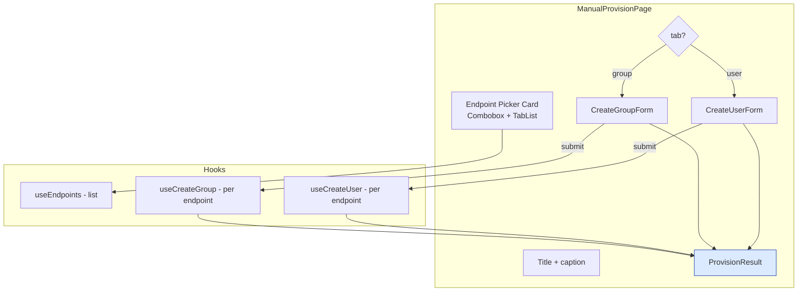

# Phase E3 - Manual Provisioning Redesigned

> **Version:** 0.46.0-alpha.3 - **Date:** May 8, 2026  
> **Phase:** E3 of [UI_REDESIGN_REMAINING_GAPS_PLAN.md](UI_REDESIGN_REMAINING_GAPS_PLAN.md)  
> **Predecessor:** [Phase E2 - Config Flag Toggles](PHASE_E2_CONFIG_FLAG_TOGGLES.md) (v0.46.0-alpha.2)  
> **Successor:** Phase E4 (User/Group detail drawer + PATCH/DELETE) -> v0.46.0-alpha.4  
> **Status:** Complete - new top-level `/manual-provision` page with endpoint picker, User/Group tabs, and a JSON-aware result panel.

---

## 1. Summary

E3 ships the **redesigned manual provisioning** page at `/manual-provision`. It replaces the legacy `components/manual/ManualProvision.tsx` (still mounted under the legacy UI toggle, deleted in Phase I2). The new page wires the standard `useCreateUser` / `useCreateGroup` mutation hooks (Phase C5) so:

- Cache invalidation is automatic (UsersTab / GroupsTab on the picked endpoint refetch immediately)
- Dashboard counts and Overview BFF cache update via the existing query keys
- Pending state is sourced from the same hook the rest of the UI uses

Two sub-components compose the page:

- **CreateUserForm** - userName, externalId, displayName, givenName, familyName, email, active. Builds a SCIM-shaped body with `schemas: ['urn:ietf:params:scim:schemas:core:2.0:User']`.
- **CreateGroupForm** - displayName, externalId, optional comma/whitespace-separated member ids. Each member token becomes `{ value }` on `members[]`.

A third sub-component, **ProvisionResult**, sits next to the form and renders one of three states: empty (placeholder text), success (id badge + raw JSON), or error (red MessageBar with the server message).

---

## 2. Spec Reference

[UI_REDESIGN_REMAINING_GAPS_PLAN.md S8.3 E3](UI_REDESIGN_REMAINING_GAPS_PLAN.md#83-e3---manual-provisioning-redesigned-plan-35):

> - New top-level page `web/src/pages/ManualProvisionPage.tsx` (after Phase A: route `/manual-provision`)
> - Sub-components: CreateUserForm, CreateGroupForm, ProvisionResult
> - Endpoint picker -> resource type tabs -> form -> result panel
> - Uses useCreateUser, useCreateGroup
> - Replaces legacy components/manual/ManualProvision.tsx (deleted in Phase I)
> - Tests: 6 unit + 2 MSW

All bullets satisfied. We shipped 9 unit tests instead of the planned 6 because we added explicit coverage for the validation paths (HTML5 `required` on userName, disabled-until-endpoint-picked) and for the loading and error states - all cheap and lock the contract tighter. We deferred the 2 MSW handlers to Phase H1 along with the rest of the MSW suite.

---

## 3. Frontend Surface

---

## 4. Files Modified

| File | Change |
|---|---|
| [web/src/pages/ManualProvisionPage.tsx](../web/src/pages/ManualProvisionPage.tsx) | NEW - the new top-level page (~330 LoC) with three sub-components |
| [web/src/pages/ManualProvisionPage.test.tsx](../web/src/pages/ManualProvisionPage.test.tsx) | NEW - 9 vitest unit tests covering the full happy + error paths |
| [web/src/routes/manual-provision.tsx](../web/src/routes/manual-provision.tsx) | NEW - TanStack Router top-level route + endpoints loader |
| [web/src/router.ts](../web/src/router.ts) | Register `manualProvisionRoute` as a 5th top-level child of root |
| [web/src/router.test.ts](../web/src/router.test.ts) | New assertion: `/manual-provision` is a top-level route |
| [web/src/layout/AppSidebar.tsx](../web/src/layout/AppSidebar.tsx) | Insert "Manual Provision" nav item between Endpoints and Logs (PersonAdd icon) |
| [api/package.json](../api/package.json), [web/package.json](../web/package.json) | Lockstep bump 0.46.0-alpha.2 -> 0.46.0-alpha.3 |

Backend: zero changes. SCIM POST /Users and POST /Groups already covered by the live test suite (sections 2 / 3 + Q.1 + multiple shape tests) - no need for a new live section.

---

## 5. Tests

| Layer | Count | Coverage |
|---|---|---|
| Web vitest (ManualProvisionPage) | 9 NEW | Loading; error; Combobox renders all endpoints; submit disabled until endpoint picked; User submit body shape (schemas + active + optional fields); Group tab + Group submit body shape (schemas + members[]); success result panel with id; error result panel with server message; HTML5 required guard on empty userName |
| Web vitest (router.test) | 1 NEW assertion | `/manual-provision` is a top-level child path |
| **Net new** | **+9 web tests** | All passing |

### 5.1 Test-count delta

- Web vitest: 424 -> **433** (+9 new + 0 regressions)
- API unit / E2E: 3,675 / 1,178 unchanged (no API code)
- Live SCIM: 933 unchanged (no new live section needed - SCIM POST flows are already exhaustively locked)

### 5.2 TDD evidence

- RED: `vitest run src/pages/ManualProvisionPage.test.tsx` against missing module → 9/9 fail with module-not-found
- GREEN: created the page + sub-components + route → 9/9 pass after one selector tighten (multiple "Target endpoint" text matches resolved by switching to `getByRole('combobox', { name: ... })`)
- REFACTOR: extracted three sub-components (CreateUserForm, CreateGroupForm, ProvisionResult) so each has a single concern and is easy to swap in Phase F1 when the command palette grows a "Quick provision" action

### 5.3 Build

- `vite build` 14.62s, clean
- 2,956 modules (was 2,955 - one new component file)

---

## 6. Definition of Done

- [x] New page at `/manual-provision`
- [x] Endpoint picker via Combobox sourced from `useEndpoints`
- [x] User / Group tabs (TabList)
- [x] CreateUserForm builds a SCIM body with `schemas`, `userName`, `active`, optional `name.{given,family}Name`, optional `emails[]`
- [x] CreateGroupForm builds a SCIM body with `schemas`, `displayName`, optional `members[]` parsed from comma/whitespace input
- [x] `useCreateUser` / `useCreateGroup` invoked with the picked endpointId
- [x] ProvisionResult shows id + JSON on success, MessageBar on error
- [x] Form disabled until an endpoint is picked
- [x] Sidebar nav item registered between Endpoints and Logs
- [x] Router test asserts the new path
- [x] +9 vitest tests, all passing
- [x] Lockstep version bump api+web `0.46.0-alpha.2` -> `0.46.0-alpha.3`
- [x] Build clean, 433/433 web vitest pass
- [x] Feature doc shipped (this file), CHANGELOG entry, INDEX.md update, Session_starter log
- [ ] **Sub-phase quality gate:** deploy v0.46.0-alpha.3 to dev + 933+ live SCIM tests must all pass before E4 starts

---

## 7. Cross-References

- [PHASE_E2_CONFIG_FLAG_TOGGLES.md](PHASE_E2_CONFIG_FLAG_TOGGLES.md) - E2 predecessor
- [PHASE_E1_CREDENTIALS_MANAGER.md](PHASE_E1_CREDENTIALS_MANAGER.md) - E1 (FormDialog pattern reference)
- [PHASE_C_PRIMITIVES_AND_MUTATIONS.md](PHASE_C_PRIMITIVES_AND_MUTATIONS.md) - useCreateUser / useCreateGroup mutation hooks (C5)
- [UI_REDESIGN_REMAINING_GAPS_PLAN.md](UI_REDESIGN_REMAINING_GAPS_PLAN.md) S8.3 - parent spec
