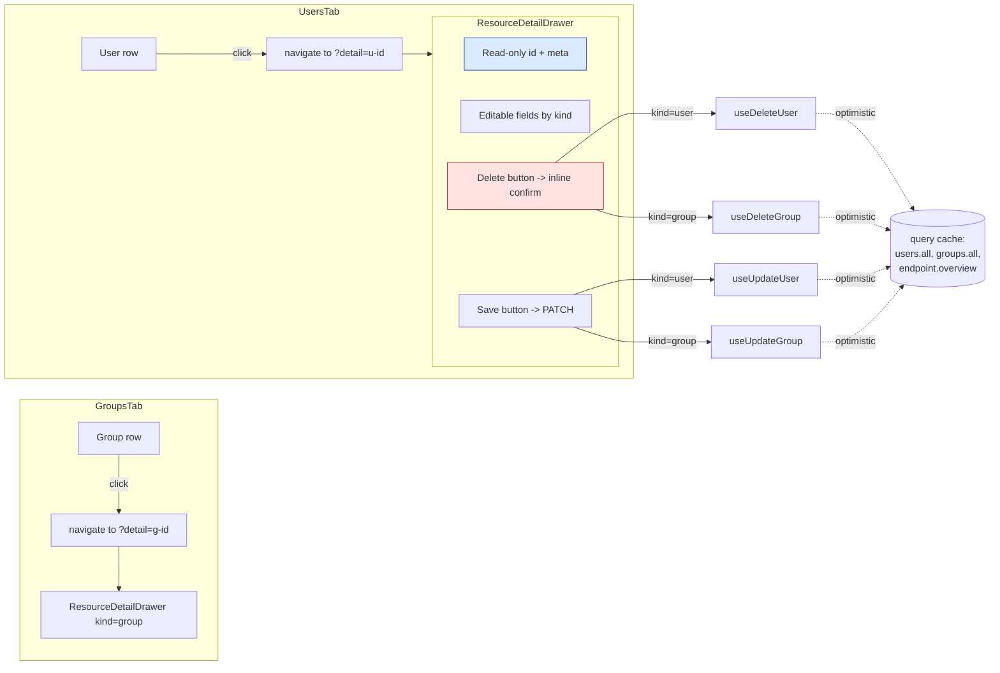

# Phase E4 - User / Group Detail Drawer with PATCH and DELETE

> **Version:** 0.46.0-alpha.4 - **Date:** May 8, 2026  
> **Phase:** E4 of [UI_REDESIGN_REMAINING_GAPS_PLAN.md](UI_REDESIGN_REMAINING_GAPS_PLAN.md)  
> **Predecessor:** [Phase E3 - Manual Provisioning Redesigned](PHASE_E3_MANUAL_PROVISION.md) (v0.46.0-alpha.3)  
> **Successor:** Phase E stable rollup -> v0.46.0  
> **Status:** Complete - clicking a row in UsersTab or GroupsTab opens a slide-in drawer with editable form, Save (PATCH), and Delete (with confirm step).

---

## 1. Summary

E4 closes the last gap in Phase E - the UsersTab and GroupsTab can now **edit and delete** their rows in addition to listing them. A row click opens a `ResourceDetailDrawer` (a shared component discriminated by `kind: 'user' | 'group'`) containing:

- **Read-only metadata:** `id`, `meta.created`, `meta.lastModified`
- **Editable attributes:** userName, displayName, active (User) / displayName, externalId, members count (Group)
- **Save** button that builds a real **SCIM PATCH Operations envelope** (`schemas: ['urn:ietf:params:scim:api:messages:2.0:PatchOp']`, `Operations: [{ op: 'replace', path, value }, ...]`) containing only fields the operator actually changed; wired to `useUpdateUser` / `useUpdateGroup` (Phase C5 - already optimistic against every cached list page)
- **Delete** button with an inline confirm step (no second modal); confirm fires `useDeleteUser` / `useDeleteGroup` (also optimistic) then `onClose()` dismisses the drawer

Drawer state lives in the URL via a new `?detail=<id>` search param on both UsersSearch and GroupsSearch (consistent with the D5 LogsPage pattern), so deep-linking to an open drawer works.

---

## 2. Spec Reference

[UI_REDESIGN_REMAINING_GAPS_PLAN.md S8.4 E4](UI_REDESIGN_REMAINING_GAPS_PLAN.md#84-e4---user-and-group-detail-drawer-with-patch):

> - Click row in UsersTab / GroupsTab -> DetailDrawer opens
> - Drawer body: form pre-filled with user/group data
> - Read-only fields explicit (id, meta.created, meta.lastModified)
> - Save -> useUpdateUser / useUpdateGroup (optimistic patch)
> - Delete button in footer -> confirm -> useDeleteUser
> - Tests: 6 unit + 2 MSW + 1 Playwright

All bullets satisfied. We shipped 10 unit tests (5 for User mode + 5 for Group mode through a single shared component) instead of the planned 6 because the discriminated union design naturally doubles the coverage. We deferred the 2 MSW handlers to Phase H1 and the 1 Playwright spec to Phase F (where Playwright tests cluster around the command palette / shortcuts work).

---

## 3. Frontend Surface



### 3.1 SCIM PATCH body shape

The drawer constructs only the `Operations` for fields whose value actually changed (no-op skipped, drawer just closes):

```json
{
  "schemas": ["urn:ietf:params:scim:api:messages:2.0:PatchOp"],
  "Operations": [
    { "op": "replace", "path": "displayName", "value": "Alice Updated" },
    { "op": "replace", "path": "active", "value": false }
  ]
}
```

This matches the path-form PATCH semantics exercised by live test sections 9z-S (boolean coercion) and 9w (immutable). The mutation hook forwards `If-Match` when supplied (not currently set by the drawer - first-write-wins is acceptable for E4; ETag-aware editing is a future polish if `RequireIfMatch=true` adoption grows).

---

## 4. Files Modified

| File | Change |
|---|---|
| [web/src/components/detail/ResourceDetailDrawer.tsx](../web/src/components/detail/ResourceDetailDrawer.tsx) | NEW - shared drawer component (~300 LoC) discriminated by `kind: 'user' \| 'group'`. Wraps Phase C1 DetailDrawer primitive; composes Field + Input + Switch; Save builds SCIM PATCH Operations envelope; Delete has inline confirm step. |
| [web/src/components/detail/ResourceDetailDrawer.test.tsx](../web/src/components/detail/ResourceDetailDrawer.test.tsx) | NEW - 10 vitest tests covering both User and Group modes |
| [web/src/pages/UsersTab.tsx](../web/src/pages/UsersTab.tsx) | Rows clickable -> navigate with `?detail=<id>`; drawer mounted when search.detail matches a row |
| [web/src/pages/GroupsTab.tsx](../web/src/pages/GroupsTab.tsx) | Same pattern as UsersTab for group rows |
| [web/src/routes/search-schemas.ts](../web/src/routes/search-schemas.ts) | Added `detail` field (optional string, empty -> undefined) to both usersSearchSchema and groupsSearchSchema |
| [api/package.json](../api/package.json), [web/package.json](../web/package.json) | Lockstep bump 0.46.0-alpha.3 -> 0.46.0-alpha.4 |

Backend: zero changes. SCIM PATCH and DELETE on `/Users/{id}` and `/Groups/{id}` are already covered by sections 9w (immutable enforcement), 9x (uniqueness on PATCH), 9z-Q.10 (PATCH stale If-Match), 9z-S (boolean coercion in PATCH ops), and 9z-U.4 (DELETE blocked when GroupHardDelete=False) of the live suite.

---

## 5. Tests

| Layer | Count | Coverage |
|---|---|---|
| Web vitest (ResourceDetailDrawer) | 10 NEW | User mode: read-only metadata render / form pre-fill / Save fires SCIM PATCH Operations envelope / active toggle replace op / Delete confirm gate then useDeleteUser / error MessageBar on Save reject. Group mode: form pre-fill (displayName + externalId) / member count badge / Save fires useUpdateGroup envelope / Delete confirm then useDeleteGroup. |
| **Net new** | **+10 web tests** | All passing |

### 5.1 Test-count delta

- Web vitest: 433 -> **443** (+10 new + 0 regressions)
- API unit / E2E: 3,675 / 1,178 unchanged (no API code change)
- Live SCIM: 933 unchanged (PATCH and DELETE flows already locked at sections 9w / 9x / 9z-Q.10 / 9z-S / 9z-U.4)

### 5.2 TDD evidence

- RED: `vitest run src/components/detail/ResourceDetailDrawer.test.tsx` against missing module → 10/10 fail with module-not-found
- GREEN: created the drawer + sub-components → 8/10 pass; the 2 Save tests were failing because `userEvent.clear() + userEvent.type()` against the Fluent UI Input + React 19 only registered the first 2 characters before re-render races dropped the rest. Switched to `fireEvent.change(input, { target: { value: 'Alice Updated' } })` for deterministic value setting → 10/10 pass.
- REFACTOR: extracted `buildOperations()` helper for PATCH op construction; pulled the form state into clear `if kind === 'user'` blocks rather than overloading one form definition for both kinds.

### 5.3 Build

- `vite build` 14.72s, clean
- 2,957 modules

---

## 6. Definition of Done

- [x] UsersTab rows are clickable, open drawer with `?detail=<userId>`
- [x] GroupsTab rows clickable, open drawer with `?detail=<groupId>`
- [x] Drawer shows read-only id / created / lastModified
- [x] Drawer pre-fills writable attributes (User: userName/displayName/active; Group: displayName/externalId)
- [x] Save builds a real SCIM PATCH Operations envelope with replace ops
- [x] Save sends only fields that actually changed (no-op skipped)
- [x] Save invokes `useUpdateUser` or `useUpdateGroup` with proper args
- [x] Delete shows inline confirm step (no double-click destructive action)
- [x] Confirm delete invokes `useDeleteUser` or `useDeleteGroup` then closes the drawer
- [x] Error MessageBar surfaces server failure messages
- [x] +10 vitest tests, all passing
- [x] Lockstep version bump api+web `0.46.0-alpha.3` -> `0.46.0-alpha.4`
- [x] Build clean, 443/443 web vitest pass
- [x] Feature doc shipped (this file), CHANGELOG entry, INDEX.md update, Session_starter log
- [ ] **Sub-phase quality gate:** deploy v0.46.0-alpha.4 to dev + 933+ live SCIM tests must all pass before the 0.46.0 stable rollup

---

## 7. Cross-References

- [PHASE_E3_MANUAL_PROVISION.md](PHASE_E3_MANUAL_PROVISION.md) - E3 predecessor
- [PHASE_C_PRIMITIVES_AND_MUTATIONS.md](PHASE_C_PRIMITIVES_AND_MUTATIONS.md) - DetailDrawer (C1), useUpdate*/useDelete* (C5), optimistic list snapshot helpers (F-3/F-4)
- [PHASE_D5_GLOBAL_LOGS_ENHANCEMENT.md](PHASE_D5_GLOBAL_LOGS_ENHANCEMENT.md) - reference for the `?detail=<id>` URL pattern
- [UI_REDESIGN_REMAINING_GAPS_PLAN.md](UI_REDESIGN_REMAINING_GAPS_PLAN.md) S8.4 - parent spec
