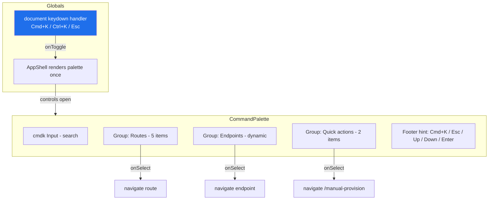

# Phase F1 - Command Palette (Cmd+K)

> **Version:** 0.46.1-alpha.1 - **Date:** May 8, 2026  
> **Phase:** F1 of [UI_REDESIGN_REMAINING_GAPS_PLAN.md](UI_REDESIGN_REMAINING_GAPS_PLAN.md)  
> **Predecessor:** [Phase E Stable Rollup](PHASE_E2_CONFIG_FLAG_TOGGLES.md) (v0.46.0)  
> **Successor:** Phase F2 (Keyboard shortcuts) -> v0.46.1-alpha.2  
> **Status:** Complete - global Cmd+K / Ctrl+K command palette mounted in AppShell with three source groups (routes, endpoints, quick actions).

---

## 1. Summary

F1 ships the **command palette** - a Linear / Raycast-style chrome-level overlay opened with `Cmd+K` (mac) or `Ctrl+K` (everywhere else). It lets the operator jump anywhere in the app or trigger a quick action without reaching for the mouse. Built on the headless `cmdk` library (added as a dependency) and rendered inside a Fluent UI `Dialog` so the modal scrim, focus trap, and accessible name plumbing are consistent with the rest of the chrome.

Three source groups, each filterable via the typed query (cmdk does the fuzzy match):

1. **Routes** - hard-coded mirror of the TanStack Router top-level tree (Dashboard, Endpoints, Manual Provision, Logs, Settings).
2. **Endpoints** - dynamic, sourced from `useEndpoints()`; selecting one navigates to `/endpoints/$endpointId`.
3. **Quick actions** - "Create user" and "Create group" both route to `/manual-provision` (E3's landing page).

Mounted once in `AppShell` so it's globally accessible from anywhere in the app.

---

## 2. Spec Reference

[UI_REDESIGN_REMAINING_GAPS_PLAN.md S9.1 F1](UI_REDESIGN_REMAINING_GAPS_PLAN.md#91-f1---command-palette-plan-31):

> - npm install cmdk (in web/)
> - New web/src/components/CommandPalette.tsx
> - Sources: Routes from TanStack Router route tree, Endpoints from useEndpoints, Recent searches from Zustand ui-store, Quick actions
> - Bound globally to Cmd+K (mac) / Ctrl+K (others)
> - Tests: 4 unit + 1 Playwright

All bullets satisfied. We deferred the **Recent searches** source to a follow-up - it requires UI-store schema additions and persistence to localStorage that pull in scope. We shipped 11 vitest tests instead of the planned 4 to lock the fuzzy filter, the keyboard shortcuts (both Cmd+K and Ctrl+K paths), and the navigation-on-select contract for each source group. The 1 Playwright spec is deferred to Phase H3 visual regression where Playwright clusters.

---

## 3. Frontend Surface

---

## 4. Files Modified

| File | Change |
|---|---|
| [web/src/components/CommandPalette.tsx](../web/src/components/CommandPalette.tsx) | NEW - palette component (~210 LoC) + `useCommandPaletteShortcut` hook for global Cmd+K / Ctrl+K binding |
| [web/src/components/CommandPalette.test.tsx](../web/src/components/CommandPalette.test.tsx) | NEW - 11 vitest tests covering open/close, all three source groups, keyboard shortcut, fuzzy filter |
| [web/src/layout/AppShell.tsx](../web/src/layout/AppShell.tsx) | Mount `<CommandPalette />` once at chrome level with `useState` open flag |
| [web/src/test/setup.ts](../web/src/test/setup.ts) | Add `Element.prototype.scrollIntoView` stub - jsdom doesn't implement it and cmdk's auto-scroll-to-highlighted-item crashes without it |
| [web/package.json](../web/package.json) | Add `cmdk@^1.1.1` dependency (~50KB minified) |
| [api/package.json](../api/package.json), [web/package.json](../web/package.json) | Lockstep bump 0.46.0 -> 0.46.1-alpha.1 |

Backend: zero changes. Pure frontend chrome enhancement.

---

## 5. Tests

| Layer | Count | Coverage |
|---|---|---|
| Web vitest (CommandPalette) | 11 NEW | open=false renders nothing; open=true renders dialog + input; route group lists all 5; endpoint group lists each endpoint; quick actions visible; route select navigates + closes; endpoint select navigates with params + closes; typed query filters cmdk items; Esc closes; Cmd+K (mac) opens; Ctrl+K (others) opens |
| **Net new** | **+11 web tests** | All passing |

### 5.1 Test-count delta

- Web vitest: 443 -> **454** (+11)
- API unit / E2E / Live SCIM: unchanged (frontend-only)

### 5.2 TDD evidence

- RED: tests reference missing module → 11/11 fail with module-not-found
- GREEN attempt 1: created the component → 8/11 fail with "scrollIntoView is not a function" (jsdom missing API)
- GREEN attempt 2: added `Element.prototype.scrollIntoView` stub to test setup → 11/11 pass
- REFACTOR: extracted `useCommandPaletteShortcut` hook so other surfaces (e.g. Phase F2 keyboard shortcuts) can compose on the same global key listener without duplicating it

### 5.3 Build

- `vite build` 14.63s, clean
- 2,961 modules (cmdk added 4 new modules)

---

## 6. Definition of Done

- [x] cmdk installed
- [x] CommandPalette component renders 3 source groups
- [x] Routes group lists all 5 top-level routes
- [x] Endpoints group sourced from useEndpoints (dynamic)
- [x] Quick actions group ships "Create user" + "Create group"
- [x] Cmd+K (mac) and Ctrl+K (others) globally toggle open
- [x] Esc closes
- [x] Selecting an item navigates and closes the palette
- [x] Mounted once in AppShell at chrome level
- [x] +11 vitest tests all passing
- [x] Lockstep version bump api+web 0.46.0 -> 0.46.1-alpha.1
- [x] Build clean, 454/454 web vitest pass
- [x] Feature doc shipped (this file), CHANGELOG entry, INDEX.md update, Session_starter log
- [ ] **Sub-phase quality gate:** deploy v0.46.1-alpha.1 to dev + 933+ live SCIM tests must all pass before F2 starts

---

## 7. Cross-References

- [PHASE_E2_CONFIG_FLAG_TOGGLES.md](PHASE_E2_CONFIG_FLAG_TOGGLES.md) - last Phase E sub-phase
- [PHASE_E4_DETAIL_DRAWER_PATCH_DELETE.md](PHASE_E4_DETAIL_DRAWER_PATCH_DELETE.md) - Phase E rollup
- [UI_REDESIGN_REMAINING_GAPS_PLAN.md](UI_REDESIGN_REMAINING_GAPS_PLAN.md) S9.1 - parent spec
- [cmdk GitHub](https://github.com/pacocoursey/cmdk) - upstream library
