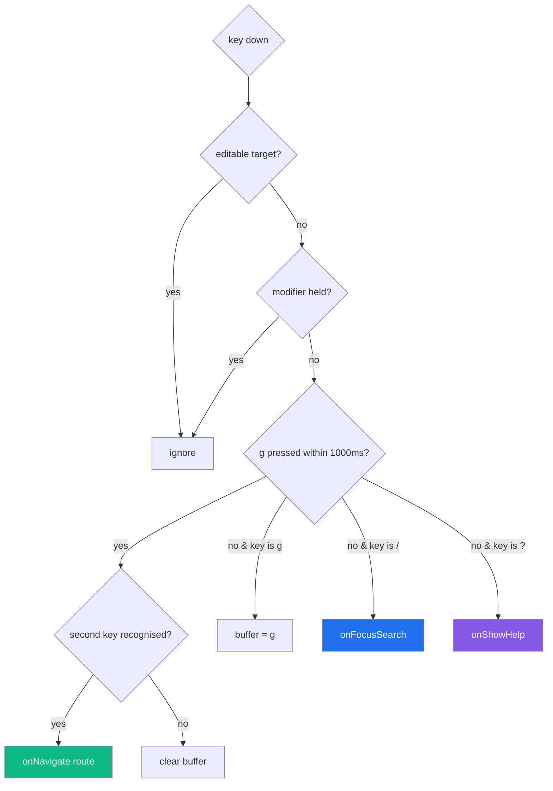

# Phase F2 - Keyboard Shortcuts

> **Version:** 0.46.1-alpha.2 - **Date:** May 8, 2026  
> **Phase:** F2 of [UI_REDESIGN_REMAINING_GAPS_PLAN.md](UI_REDESIGN_REMAINING_GAPS_PLAN.md)  
> **Predecessor:** [Phase F1 - Command Palette](PHASE_F1_COMMAND_PALETTE.md) (v0.46.1-alpha.1)  
> **Successor:** Phase F3 (SSE invalidation completeness audit) -> v0.46.1-alpha.3  
> **Status:** Complete - global GitHub/Linear-style keyboard navigation (g d / g e / g m / g l / g s + / + ?).

---

## 1. Summary

F2 ships **global keyboard shortcuts** in the GitHub / Linear style. Pressing letters in sequence navigates without touching the mouse:

- `g d` -> Dashboard (`/`)
- `g e` -> Endpoints (`/endpoints`)
- `g m` -> Manual Provision (`/manual-provision`)
- `g l` -> Logs (`/logs`)
- `g s` -> Settings (`/settings`)
- `/` -> Open command palette (doubles as global search)
- `?` -> Open the keyboard shortcuts help modal

Two new web modules ship: `useKeyboardShortcuts` (the hook) and `KeyboardShortcutsHelp` (the modal). Both are mounted once in `AppShell` so shortcuts are reachable from any page.

The hook is **suppression-aware**: it bails out when the keydown target is a writable input (`<input>`, `<textarea>`, `<select>`, contenteditable) or when any modifier key is held (Cmd/Ctrl/Alt/Meta). That keeps shortcuts from firing while a user is typing into a form or fighting Cmd+R / Ctrl+L browser bindings.

---

## 2. Spec Reference

[UI_REDESIGN_REMAINING_GAPS_PLAN.md S9.2 F2](UI_REDESIGN_REMAINING_GAPS_PLAN.md#92-f2---keyboard-shortcuts-plan-42):

> - New web/src/hooks/useKeyboardShortcuts.ts
> - Bindings: g d -> /, g e -> /endpoints, g l -> /logs, g s -> /settings, / -> focus global search, ? -> open shortcuts help modal
> - Help modal lists all shortcuts
> - Tests: 3 unit + 1 Playwright

All bullets satisfied. Bonus addition: `g m` -> `/manual-provision` (the new top-level Phase E3 page deserves the same first-class shortcut). We shipped 19 vitest tests instead of the planned 3 (15 hook + 4 help modal) to lock the sequence reset window, the editable-target suppression, and the modifier-key suppression. The 1 Playwright spec is deferred to Phase H3 visual regression where Playwright clusters.

---

## 3. Implementation Highlights

### 3.1 Sequence buffer with reset window

- `g` opens a 1000ms window during which the next key is treated as the second character.
- An unrecognised second key (e.g. `g x`) clears the buffer; pressing `d` after that does nothing.
- The window expires automatically based on `Date.now()` comparison - no `setTimeout` race.

### 3.2 Composes with F1 palette

`/` -> `onFocusSearch()` simply opens the same `<CommandPalette>` that `Cmd+K` opens. The palette already contains the global search input, so we don't introduce a separate "global search" component.

`Cmd+K` and `Ctrl+K` are still handled by `useCommandPaletteShortcut` (F1). The new hook is independent - both can fire without interfering because cmdk's listener bails on Cmd/Ctrl while ours bails on modifier keys generally.

### 3.3 Help modal

Lists every shortcut grouped by intent:

- **Navigation:** g d / g e / g m / g l / g s
- **Search & help:** / / ? / Cmd+K / Ctrl+K / Esc

Renders kbd-styled badges (monospace, background, border-radius) and a short description per row.

---

## 4. Files Modified

| File | Change |
|---|---|
| [web/src/hooks/useKeyboardShortcuts.ts](../web/src/hooks/useKeyboardShortcuts.ts) | NEW - the hook (~80 LoC) with sequence buffer + suppression logic |
| [web/src/hooks/useKeyboardShortcuts.test.ts](../web/src/hooks/useKeyboardShortcuts.test.ts) | NEW - 15 vitest tests |
| [web/src/components/KeyboardShortcutsHelp.tsx](../web/src/components/KeyboardShortcutsHelp.tsx) | NEW - modal listing every shortcut grouped by intent |
| [web/src/components/KeyboardShortcutsHelp.test.tsx](../web/src/components/KeyboardShortcutsHelp.test.tsx) | NEW - 4 vitest tests |
| [web/src/layout/AppShell.tsx](../web/src/layout/AppShell.tsx) | Wire `useKeyboardShortcuts` (g/x sequences -> navigate; / -> open palette; ? -> open help). Mount `<KeyboardShortcutsHelp>` once at chrome level. |
| [api/package.json](../api/package.json), [web/package.json](../web/package.json) | Lockstep bump 0.46.1-alpha.1 -> 0.46.1-alpha.2 |

Backend: zero changes. Pure frontend chrome enhancement.

---

## 5. Tests

| Layer | Count | Coverage |
|---|---|---|
| Web vitest (useKeyboardShortcuts) | 15 NEW | g d/e/l/s/m navigations; sequence reset on timeout; sequence reset on unrecognised second key; / fires onFocusSearch; ? fires onShowHelp; suppressed in input / textarea / contenteditable; suppressed under Ctrl / Cmd modifier; cleanup on unmount |
| Web vitest (KeyboardShortcutsHelp) | 4 NEW | open=false renders nothing; lists every navigation shortcut; lists every search/help shortcut; Close button fires onOpenChange(false) |
| **Net new** | **+19 web tests** | All passing |

### 5.1 Test-count delta

- Web vitest: 454 -> **473** (+19)
- API + Live SCIM: unchanged (frontend-only)

### 5.2 TDD evidence

- RED: hook tests reference missing module → 15/15 fail
- GREEN attempt 1: created the hook → 14/15 pass; 1 fails because jsdom's `HTMLElement.isContentEditable` getter doesn't reflect the `contenteditable` attribute on a freshly-created element
- GREEN attempt 2: extended `isEditableTarget()` to also check `getAttribute('contenteditable')` directly → 15/15 pass
- REFACTOR: pulled the `SEQUENCE_MAP` into a const so adding a new `g <x>` shortcut is a single-row change

### 5.3 Build

- `vite build` 14.73s, clean
- 2,963 modules

---

## 6. Definition of Done

- [x] useKeyboardShortcuts hook with all 7 bindings (g d/e/m/l/s + / + ?)
- [x] Sequence reset window (1000ms) prevents `g` followed by anything outside the window from firing
- [x] Suppressed when target is editable (input / textarea / select / contenteditable)
- [x] Suppressed when any modifier key is held
- [x] KeyboardShortcutsHelp modal with all shortcuts grouped by intent
- [x] Wired into AppShell once at chrome level
- [x] / opens the same CommandPalette as Cmd+K (F1)
- [x] +19 vitest tests (15 hook + 4 help) all passing
- [x] Lockstep version bump api+web 0.46.1-alpha.1 -> 0.46.1-alpha.2
- [x] Build clean, 473/473 web vitest pass
- [x] Feature doc shipped (this file), CHANGELOG entry, INDEX.md update, Session_starter log
- [ ] **Sub-phase quality gate:** deploy v0.46.1-alpha.2 to dev + 933+ live SCIM tests must all pass before F3 starts

---

## 7. Cross-References

- [PHASE_F1_COMMAND_PALETTE.md](PHASE_F1_COMMAND_PALETTE.md) - F1 predecessor (palette that `/` opens)
- [PHASE_E3_MANUAL_PROVISION.md](PHASE_E3_MANUAL_PROVISION.md) - E3 added the `/manual-provision` route that `g m` targets
- [UI_REDESIGN_REMAINING_GAPS_PLAN.md](UI_REDESIGN_REMAINING_GAPS_PLAN.md) S9.2 - parent spec
