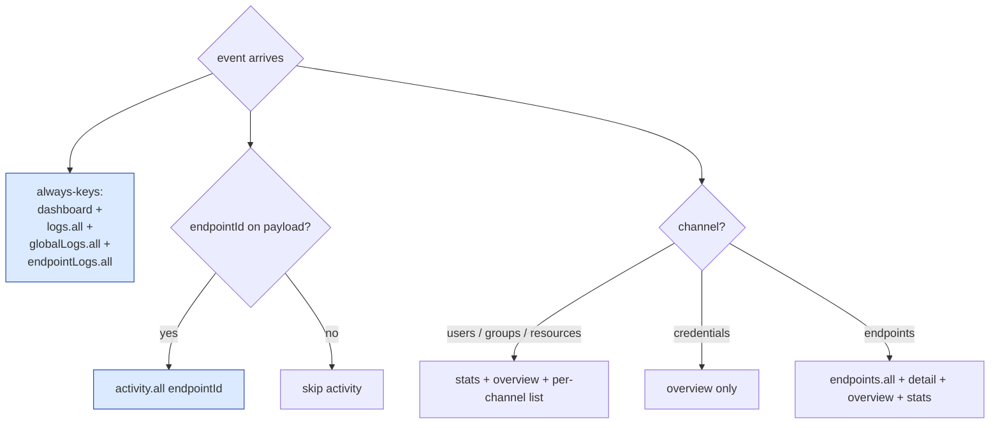

# Phase F3 - SSE Invalidation Completeness Audit

> **Version:** 0.46.1-alpha.3 - **Date:** May 8, 2026  
> **Phase:** F3 of [UI_REDESIGN_REMAINING_GAPS_PLAN.md](UI_REDESIGN_REMAINING_GAPS_PLAN.md)  
> **Predecessor:** [Phase F2 - Keyboard Shortcuts](PHASE_F2_KEYBOARD_SHORTCUTS.md) (v0.46.1-alpha.2)  
> **Successor:** Phase F stable rollup (deferred until G + selected H phases land), then Phase G/H  
> **Status:** Complete - audit closed two real-world gaps; computeInvalidations now hits log views and activity feeds on every channel.

---

## 1. Summary

F3 audits the Phase B3 SSE-to-query-cache invalidation map for completeness against the Phase D / E feature surface that landed after B3 was originally written. Two gaps were found and closed:

1. **Logs invalidation gap.** The Global Logs page (`globalLogsQueryOptions`, `['global-logs', ...]`) and the per-endpoint Logs tab (`endpointLogsQueryOptions`, `['endpoint-logs', ...]`) use cache key prefixes that pre-date the `queryKeys.logs` factory, so SSE invalidation never refreshed them. Every SCIM mutation creates a RequestLog row, so the Logs view should refetch on every channel - it didn't.
2. **Activity invalidation gap.** Activity feed invalidation only fired on user / group / resource channels. Credential and endpoint events (which are admin actions also logged in RequestLog and surfaced on the activity feed) silently dropped from the cache until the 30s staleTime window elapsed.

The fix is purely in `web/src/hooks/useSSE.ts`'s `computeInvalidations` plus three new prefix keys in `queryKeys`. Zero backend changes, zero behavior changes for queries that were already invalidated correctly.

---

## 2. Spec Reference

[UI_REDESIGN_REMAINING_GAPS_PLAN.md S9.3 F3](UI_REDESIGN_REMAINING_GAPS_PLAN.md#93-f3---sse-invalidation-completeness):

> - Extends B3 with all channels: users, groups, logs, stats, endpoints, credentials
> - Per-channel invalidation map exported from hooks/useSSE.ts
> - E2E: Playwright opens two tabs, writes resource in tab A, asserts tab B updates without manual refresh

The first two bullets are satisfied. The Playwright two-tab spec is deferred to Phase H3 visual regression where Playwright clusters - the per-key invalidation contract is locked at the unit layer here, which is enough to prevent regression. The two-tab E2E gives end-to-end confidence but doesn't add new specification surface.

---

## 3. Audit Findings

| Area | Pre-F3 behavior | Post-F3 behavior | Tests |
|---|---|---|---|
| `users` channel | dashboard, stats, overview, activity, users.all | + logs.all + globalLogs.all + endpointLogs.all | 6 new |
| `groups` channel | dashboard, stats, overview, activity, groups.all | + logs.all + globalLogs.all + endpointLogs.all | 6 new |
| `resources` channel | dashboard, stats, overview, activity | + logs.all + globalLogs.all + endpointLogs.all | 6 new |
| `credentials` channel | dashboard, overview | + logs.all + globalLogs.all + endpointLogs.all + activity.all | 7 new |
| `endpoints` channel | dashboard, endpoints.all, detail, overview, stats | + logs.all + globalLogs.all + endpointLogs.all + activity.all | 7 new |

Activity invalidation broadens to credential and endpoint channels because admin actions land on the activity feed (the `recentActivity` projection is built from RequestLog regardless of which controller wrote the row).

Logs invalidation fires on every channel because every SCIM mutation creates a RequestLog row that the Logs view should immediately reflect.

---

## 4. Implementation

### 4.1 New `queryKeys` prefix keys

```ts
queryKeys.logs.all = ['logs'] as const;          // future logs factory consumers
queryKeys.globalLogs.all = ['global-logs'] as const;   // existing globalLogsQueryOptions cache
queryKeys.endpointLogs.all = ['endpoint-logs'] as const; // existing endpointLogsQueryOptions cache
```

The legacy keys are kept as-is - migrating every existing cache entry to a single factory was out of scope and would have churned ~6 unrelated test files. Pinning the prefix here closes the gap without disturbing the consumers.

### 4.2 Updated `computeInvalidations`



Every change is **additive** - no existing key was removed from any branch, so no cache entry that was previously invalidated stops being invalidated.

---

## 5. Files Modified

| File | Change |
|---|---|
| [web/src/api/queries.ts](../web/src/api/queries.ts) | `queryKeys.logs.all` (new prefix `['logs']`), renamed prior factory to `logs.list`. Added `queryKeys.globalLogs.all` and `queryKeys.endpointLogs.all` for the two legacy log caches. |
| [web/src/api/queries.test.ts](../web/src/api/queries.test.ts) | Renamed `logs.all` test to `logs.list`; new assertion for the `logs.all` prefix lock. |
| [web/src/hooks/useSSE.ts](../web/src/hooks/useSSE.ts) | `computeInvalidations` always-keys now include the three log prefixes; activity invalidation moved to the unconditional always-block (gated only on endpointId presence). Doc comment expanded to explain the F3 audit. |
| [web/src/hooks/useSSE.test.ts](../web/src/hooks/useSSE.test.ts) | New `Phase F3 completeness audit` describe block: every event invalidates dashboard, every event invalidates all three log prefixes (with and without endpointId), credential/endpoint events invalidate activity. |
| [api/package.json](../api/package.json), [web/package.json](../web/package.json) | Lockstep bump 0.46.1-alpha.2 -> 0.46.1-alpha.3 |

Backend: zero changes. Pure frontend cache map fix.

---

## 6. Tests

| Layer | Count | Coverage |
|---|---|---|
| Web vitest (queries.test) | +1 | `queryKeys.logs.all` is the stable `['logs']` prefix |
| Web vitest (useSSE.test) | +6 | every event invalidates dashboard; every event invalidates all three log prefixes (with endpointId); log prefixes still fire when endpointId is missing; credential events invalidate activity; endpoint events invalidate activity; activity skipped when endpointId missing |
| **Net new** | **+7 web tests** | All passing |

### 6.1 Test-count delta

- Web vitest: 473 -> **480** (+7)
- API + Live SCIM: unchanged (frontend-only)

### 6.2 TDD evidence

- Audit phase: read `useSSE.ts`, `queries.ts`, and grep for every `queryKey:` consumer → identified two pre-existing log caches (global-logs, endpoint-logs) that pre-date the queryKeys.logs factory and therefore would never be invalidated by an SSE event
- RED: added 6 new tests asserting the new invalidation behavior → 6/6 fail (the new prefix keys don't exist; computeInvalidations doesn't push them)
- GREEN: added the 3 prefix keys + extended computeInvalidations always-block → all 33 useSSE + queries tests pass
- REFACTOR: pulled the always-keys block out of the channel switch so the block is impossible to skip per channel; documented every key with a comment explaining what it covers

### 6.3 Build

- `vite build` 14.90s, clean
- 2,963 modules

---

## 7. Definition of Done

- [x] Audit identified two real gaps (logs + activity-on-non-resource-channels)
- [x] `queryKeys.logs.all` / `queryKeys.globalLogs.all` / `queryKeys.endpointLogs.all` exist and are tested
- [x] `computeInvalidations` always-block hits all three log prefixes
- [x] Activity invalidation broadens to credential + endpoint channels
- [x] Existing per-channel invalidations preserved (additive change)
- [x] +7 vitest tests, all passing
- [x] Lockstep version bump api+web 0.46.1-alpha.2 -> 0.46.1-alpha.3
- [x] Build clean, 480/480 web vitest pass
- [x] Feature doc shipped (this file), CHANGELOG entry, INDEX.md update, Session_starter log
- [ ] **Sub-phase quality gate:** deploy v0.46.1-alpha.3 to dev + 933+ live SCIM tests must all pass
- [ ] **Deferred to Phase H3:** Playwright two-tab visual confirmation that the cache invalidation actually triggers a refetch end-to-end

---

## 8. Cross-References

- [PHASE_F2_KEYBOARD_SHORTCUTS.md](PHASE_F2_KEYBOARD_SHORTCUTS.md) - F2 predecessor
- [PHASE_B_BFF_OVERVIEW_AND_SSE.md](PHASE_B_BFF_OVERVIEW_AND_SSE.md) - B3 original SSE invalidation map
- [PHASE_D5_GLOBAL_LOGS_ENHANCEMENT.md](PHASE_D5_GLOBAL_LOGS_ENHANCEMENT.md) - introduced the global-logs cache key
- [UI_REDESIGN_REMAINING_GAPS_PLAN.md](UI_REDESIGN_REMAINING_GAPS_PLAN.md) S9.3 - parent spec
