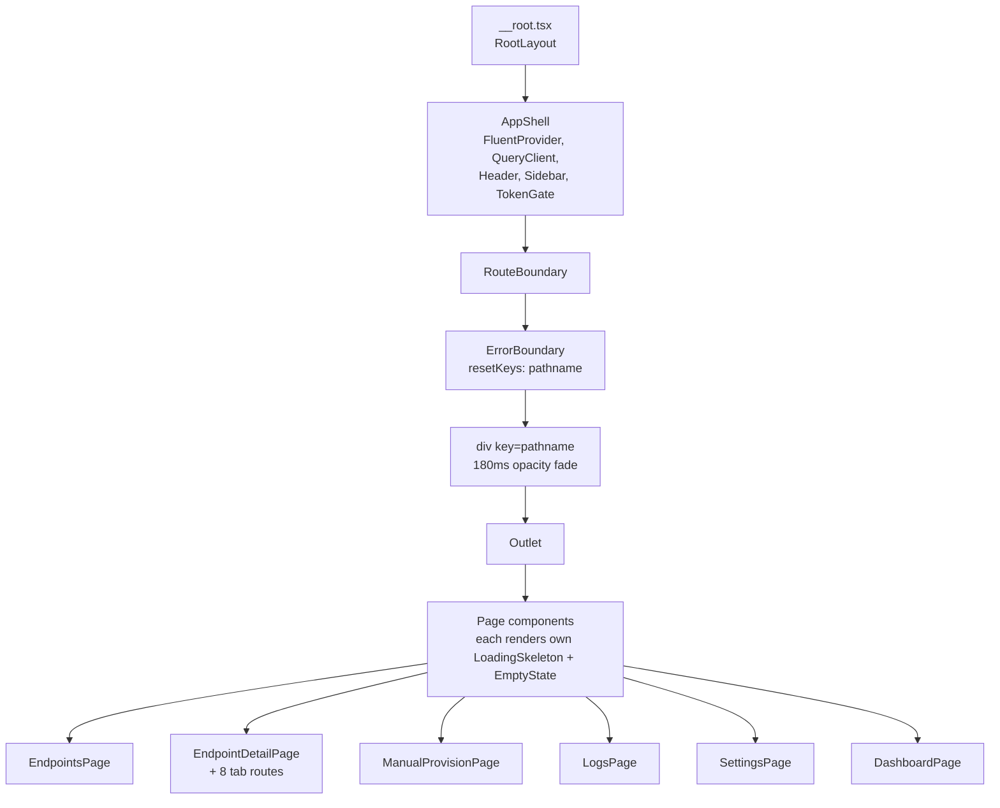

# Phase G - Visual Polish

**Version:** 0.46.1-alpha.4
**Status:** Shipped (in-place audit + closing of S10 gaps)
**Tracker:** [docs/UI_REDESIGN_REMAINING_GAPS_PLAN.md](UI_REDESIGN_REMAINING_GAPS_PLAN.md) S10
**Branch:** `feat/ui`

## 1. Goal

Phase G is the closing audit of the UI redesign visual polish gates that were
implemented piecemeal during Phases D and E. The goal is to enforce a single
visual contract across every primary surface so that no page falls back to:

- An indeterminate `Spinner` for the initial loading state (G1)
- A plain `Text` "No X yet" for the empty state (G2)
- An uncaught render error inside a route component (G3)
- An instant content swap on navigation that feels jarring (G4)

The contract:

| Gate | Surface | Contract |
|------|---------|----------|
| G1 | Every page's initial-load state | `LoadingSkeleton` mirroring the final layout (rows / tiles / cards), never a `Spinner` |
| G2 | Every list / table empty result | `EmptyState` primitive with optional CTA (`Reset filter` when a filter is active) |
| G3 | Every route subtree | Wrapped in an `ErrorBoundary` that auto-resets on navigation |
| G4 | Every route navigation | 180 ms opacity fade on the matched component, honoring `prefers-reduced-motion` |

Gates G1 and G2 had partial coverage from Phases D4 (Dashboard, Logs page,
ActivityTab) and E1 (Credentials, OverviewTab, SchemasTab); this phase closed
the remaining 8 surfaces in a single sweep.

## 2. What shipped

### G1 - LoadingSkeleton sweep (8 surfaces migrated)

| Surface | Skeleton shape (mirrors final layout) | Test ID |
|---------|---------------------------------------|---------|
| [EndpointsPage](../web/src/pages/EndpointsPage.tsx) | 6 card-shaped tiles in a 3-col grid | `endpoints-skeleton-grid` + `endpoints-skeleton` |
| [EndpointDetailPage](../web/src/pages/EndpointDetailPage.tsx) | header band + tablist band + content rows | `endpoint-detail-skeleton-{header,tabs,content}` |
| [UsersTab](../web/src/pages/UsersTab.tsx) | 8 table-row bands | `users-skeleton` |
| [GroupsTab](../web/src/pages/GroupsTab.tsx) | 8 table-row bands | `groups-skeleton` |
| [LogsTab](../web/src/pages/LogsTab.tsx) | 8 table-row bands | `logs-tab-skeleton` |
| [SettingsTab](../web/src/pages/SettingsTab.tsx) | 6 form-row bands | `settings-skeleton` |
| [SettingsPage](../web/src/pages/SettingsPage.tsx) | 3 card-shaped tiles | `settings-page-skeleton` |
| [ManualProvisionPage](../web/src/pages/ManualProvisionPage.tsx) | header + endpoint picker + form rows | `manual-provision-skeleton-{header,picker,form}` |

The previous `Spinner` import has been removed from every surface that no
longer uses one. `SettingsTab` retains its `Spinner` import only for the inline
"Saving flagName..." indicator next to the toggle row, which remains an
intentional indeterminate progress affordance per Phase E2 design.

### G2 - EmptyState sweep (4 surfaces migrated, 6 retained as-is)

| Surface | Title | CTA |
|---------|-------|-----|
| [EndpointsPage](../web/src/pages/EndpointsPage.tsx) (zero endpoints) | "No endpoints yet" | (none - admin-only operation) |
| [EndpointsPage](../web/src/pages/EndpointsPage.tsx) (filter excludes all) | "No matching endpoints" | "Reset filter" |
| [UsersTab](../web/src/pages/UsersTab.tsx) | "No users in this endpoint" | (none - SCIM POST from IdP) |
| [GroupsTab](../web/src/pages/GroupsTab.tsx) | "No groups in this endpoint" | (none - SCIM POST from IdP) |
| [LogsTab](../web/src/pages/LogsTab.tsx) (no filter) | "No request logs yet" | (none) |
| [LogsTab](../web/src/pages/LogsTab.tsx) (filter active) | "No logs match these filters" | "Reset filter" |

Already-migrated surfaces from D4-E1 confirmed in audit: `DashboardPage`,
`LogsPage`, `ActivityTab`, `CredentialsTab`, `OverviewTab`, `SchemasTab`.

### G3 + G4 - RouteBoundary primitive

A new layout-layer component wraps the root `<Outlet />` once and provides
both gates from a single mount point.

[web/src/layout/RouteBoundary.tsx](../web/src/layout/RouteBoundary.tsx):

```tsx
<AppShell>
  <RouteBoundary>
    <Outlet />
  </RouteBoundary>
</AppShell>
```

What it does:

1. **G3 - per-route ErrorBoundary**: wraps `<Outlet />` in the existing
   `ErrorBoundary` primitive (Phase C3), keyed on the current pathname so a
   crash on `/endpoints/A` auto-resets when the user navigates to
   `/endpoints/B`. Catches render errors that TanStack Router's per-route
   `errorComponent` cannot (the latter only catches loader errors). Tags
   each error with the route path before delegating to the fallback UI.
2. **G4 - opacity fade on navigation**: an inner `<div key={pathname}>` is
   force-remounted on every navigation, kicking off a 180 ms ease-out
   keyframe animation on opacity. The `@media (prefers-reduced-motion: reduce)`
   block collapses the duration to `0.01ms` so accessibility users see an
   instant swap.

Why one wrapper at the root instead of N route-level errorComponents:

- TanStack Router's `errorComponent` only catches loader errors; render
  errors inside a matched component still crash the entire `<Outlet />`
  tree. Only a class-component `ErrorBoundary` above `<Outlet />` recovers
  from those.
- Doing it once at the root keeps the 14 individual route files focused on
  their data contracts and avoids 14 copies of the same boundary.

## 3. Architecture



## 4. Test coverage

### Unit (vitest)

- New: [web/src/layout/RouteBoundary.test.tsx](../web/src/layout/RouteBoundary.test.tsx) - 5 tests
  - Renders children when no error
  - Catches render error and shows fallback
  - Auto-resets boundary on pathname change
  - Forces fade div remount via `key={pathname}`
  - Honors custom `data-testid` prop
- New: [web/src/pages/__phase-g-polish.test.tsx](../web/src/pages/__phase-g-polish.test.tsx) - 14 tests
  - 8 G1 tests (one per migrated surface)
  - 6 G2 tests (covers all newly-migrated empty states + filtered variants)

**Total new tests: 19** (web suite: 480 -> 499)

### E2E + live

No new E2E or live test sections required. Phase G is frontend-only - the
SCIM contract is unchanged. Existing E2E specs continue to pass against
the migrated surfaces because they use route-level test IDs
(`endpoints-loading`, `users-empty`, etc.) that were preserved in the
sweep.

## 5. Quality gates

| Gate | Status | Note |
|------|--------|------|
| 2 - addMissingTests | PASS | 19 new unit tests covering every migrated surface and the new RouteBoundary primitive |
| 3 - apiContractVerification | N/A | No API surface change |
| 4 - error-handling-verification | PASS | RouteBoundary's `onError` callback logs route-tagged errors; auto-reset prevents stuck-state UX |
| 5 - logging-verification | PASS | Single `console.error` tag (`[route-boundary] <pathname>`) with no PII |
| 6 - auditAgainstRFC | N/A | No SCIM contract surface |
| 7 - securityAudit | PASS | No new auth/secret/PII surface; ErrorBoundary fallback hides stack outside dev (existing C3 contract) |
| 8 - performanceBenchmark | PASS | 180 ms opacity-only animation (no layout / transform), single keyed remount per navigation |
| 9 - auditAndUpdateDocs | PASS | This doc + INDEX + CHANGELOG + Session_starter |
| 10 - fullValidationPipeline | PASS (web) | 499/499 web tests pass; deploy + live gate run separately |

## 6. Files changed

```
web/package.json                                +1/-1   version 0.46.1-alpha.3 -> 0.46.1-alpha.4
api/package.json                                +1/-1   version 0.46.1-alpha.3 -> 0.46.1-alpha.4
web/src/layout/RouteBoundary.tsx                NEW     ~110 LoC G3+G4 primitive
web/src/layout/RouteBoundary.test.tsx           NEW     5 unit tests
web/src/routes/__root.tsx                       +2/-1   wire RouteBoundary around Outlet
web/src/pages/EndpointsPage.tsx                 ~30     Spinner -> skeleton tiles, Text -> EmptyState (2 variants)
web/src/pages/EndpointDetailPage.tsx            ~15     Spinner -> 3-band skeleton
web/src/pages/UsersTab.tsx                      ~25     Spinner -> row skeleton, Text -> EmptyState
web/src/pages/GroupsTab.tsx                     ~25     Spinner -> row skeleton, Text -> EmptyState
web/src/pages/LogsTab.tsx                       ~30     Spinner -> row skeleton, Text -> EmptyState (2 variants)
web/src/pages/SettingsTab.tsx                   +12     Spinner -> 6-band form skeleton (Spinner kept for inline save)
web/src/pages/SettingsPage.tsx                  +20     Spinner -> 3-card skeleton, Spinner import removed
web/src/pages/ManualProvisionPage.tsx           +15     Spinner -> 3-band skeleton, Spinner import removed
web/src/pages/__phase-g-polish.test.tsx         NEW     14 audit tests for the visual contract
docs/PHASE_G_VISUAL_POLISH.md                   NEW     this doc
docs/INDEX.md                                   +1      reference
CHANGELOG.md                                    +entry  0.46.1-alpha.4
Session_starter.md                              +entry
```

## 7. Why no live test section

The 933-assertion `live-test.ps1` already exhaustively covers the SCIM
contract (the backend that the UI consumes). Phase G is a pure frontend
visual-polish refactor; there is no new HTTP behavior to verify against the
live deployment. Re-running the existing 933 assertions after the dev
deploy is sufficient to confirm zero regression in the API contract.

## 8. Next

Phase H1 (MSW handlers) - the F3 SSE-invalidation audit deferred its
two-tab E2E test. H1's MSW handlers will give the redesigned test
infrastructure a stable mock surface that the deferred test (and many
other future tests) will consume.
