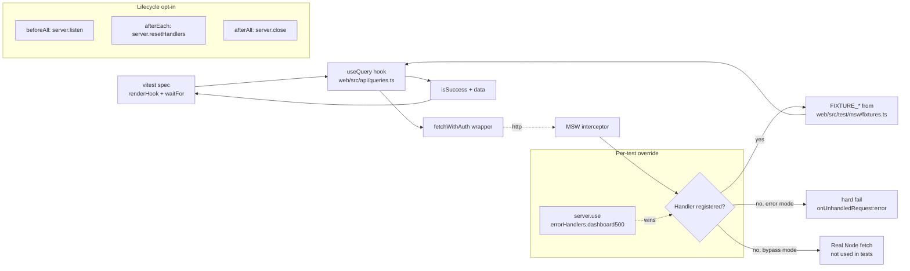

# Phase H1 - MSW Handlers

**Version:** 0.46.1-alpha.5
**Status:** Shipped
**Tracker:** [docs/UI_REDESIGN_REMAINING_GAPS_PLAN.md](UI_REDESIGN_REMAINING_GAPS_PLAN.md) S11.1
**Branch:** `feat/ui`

## 1. Goal

Phase H1 closes the **plan §5.3** gap: the redesigned UI ships with
`msw@2.14.3` declared in [web/package.json](../web/package.json) but
zero handlers and zero MSW-driven tests. Page-level tests today mock
`api/queries` with `vi.mock(...)` which skips the entire fetch +
`useQuery` pipeline - any breakage in `fetchWithAuth`, the auth header
handling, the 401-token-clearing flow, or response shape parsing is
silently passed by the existing test suite.

Phase H1 establishes the network-level mock layer:

| Layer | File | Purpose |
|-------|------|---------|
| Fixtures | [web/src/test/msw/fixtures.ts](../web/src/test/msw/fixtures.ts) | Canonical fixture data typed against `@scim/types/dashboard.types` so any contract change is a `tsc` failure, not a runtime test failure |
| Handlers | [web/src/test/msw/handlers.ts](../web/src/test/msw/handlers.ts) | Happy-path handlers for all 12 admin BFF endpoints + SCIM `/Schemas` |
| Error variants | [web/src/test/msw/error-handlers.ts](../web/src/test/msw/error-handlers.ts) | Per-status-code factories (401/403/404/409/500) for opt-in error branch coverage |
| Node server | [web/src/test/msw/server.ts](../web/src/test/msw/server.ts) | `setupServer(...)` for vitest |
| Browser worker | [web/src/test/msw/browser.ts](../web/src/test/msw/browser.ts) | `setupWorker(...)` for Playwright dev-server / manual mock |
| Integration test | [web/src/test/msw.integration.test.tsx](../web/src/test/msw.integration.test.tsx) | 8 tests that exercise the real `fetchWithAuth` + `useQuery` pipeline against the MSW fixtures |

## 2. Endpoint coverage (12 admin + SCIM Schemas)

| Method | Path | Source hook | Handler | Error variants |
|--------|------|-------------|---------|----------------|
| GET | `/scim/admin/dashboard` | `useDashboard` | `FIXTURE_DASHBOARD` | 401, 500 |
| GET | `/scim/admin/endpoints` | `useEndpoints` | `FIXTURE_ENDPOINT_LIST` | 401, 500 |
| GET | `/scim/admin/endpoints/:id` | `useEndpoint` | `FIXTURE_ENDPOINT` | 403, 404 |
| GET | `/scim/admin/endpoints/:id/overview` | `useEndpointOverview` | `FIXTURE_ENDPOINT_OVERVIEW` | 404 |
| GET | `/scim/admin/endpoints/:id/stats` | `useEndpointStats` | `FIXTURE_ENDPOINT_STATS` | - |
| PATCH | `/scim/admin/endpoints/:id` | `useUpdateEndpointConfig` | echo + merge | - |
| POST | `/scim/admin/endpoints/:id/credentials` | `useCreateCredential` | new credential with plaintext token | 409 |
| DELETE | `/scim/admin/endpoints/:id/credentials/:credentialId` | `useDeleteCredential` | 204 | - |
| GET | `/scim/admin/logs` | `useGlobalLogs` / `useEndpointLogs` | `FIXTURE_LOGS` | 500 |
| GET | `/scim/admin/logs/:id` | `useGlobalLog` | `FIXTURE_LOG_DETAIL` | (404 via path) |
| GET | `/scim/admin/activity` | `useEndpointActivity` | `FIXTURE_ACTIVITY` | - |
| GET | `/scim/admin/version` | `useVersion` | `FIXTURE_VERSION` | - |
| GET | `/scim/health` | `useHealth` | `FIXTURE_HEALTH` | - |
| GET | `/scim/v2/*/Schemas` (real Entra path) | (Phase E1+) | `FIXTURE_SCHEMAS` | - |
| GET | `/scim/admin/endpoints/:id/Schemas` | `useEndpointSchemas` | `FIXTURE_SCHEMAS` | - |

15 handlers total (12 admin + 1 SCIM v2 Schemas + 1 admin Schemas + the
health proxy used by `useHealth`).

## 3. Setup pattern (opt-in, not global)

Originally Phase H1 attempted to register MSW globally in
[web/src/test/setup.ts](../web/src/test/setup.ts) so every spec ran
against fixtures by default. **This regressed 24 tests** in three
legacy files:

- [web/src/api/client.test.ts](../web/src/api/client.test.ts) (slated
  for I2 deletion)
- [web/src/components/activity/ActivityFeed.test.tsx](../web/src/components/activity/ActivityFeed.test.tsx)
  (slated for I2 deletion)
- [web/src/components/database/DatabaseBrowser.test.tsx](../web/src/components/database/DatabaseBrowser.test.tsx)
  (slated for I2 deletion)

The root cause: those tests use `vi.stubGlobal('fetch', mockFetch)` to
inject their own fetch double, then assert on
`mockFetch.mock.calls[0]` as an `[url, init]` tuple. MSW v2 in Node
intercepts BELOW `globalThis.fetch` (via `@mswjs/interceptors` patching
the `http` module), so the test's `vi.stubGlobal` is bypassed. Even
with `onUnhandledRequest: 'bypass'`, MSW still wraps the request as a
`Request` object before passing through, breaking the legacy tests'
`[url, init]` assertion shape.

**Fix:** make MSW lifecycle opt-in. Each test file that wants
network-level mocking imports `server` and installs the lifecycle
itself:

```ts
import { server } from '@/test/msw/server';
beforeAll(() => server.listen({ onUnhandledRequest: 'error' }));
afterEach(() => server.resetHandlers());
afterAll(() => server.close());
```

Legacy `vi.stubGlobal('fetch')` tests are unaffected because MSW is
never started in those files. After Phase I2 deletes the legacy
component tree, this opt-in pattern can be promoted to a global
default in `setup.ts`.

## 4. Architecture



## 5. Test coverage

### Unit (vitest)

[web/src/test/msw.integration.test.tsx](../web/src/test/msw.integration.test.tsx) - 8 tests:

**Happy path (5):**
- `useDashboard` resolves `FIXTURE_DASHBOARD` shape exactly
- `useEndpoints` resolves the envelope with one fixture endpoint
- `useEndpointOverview` resolves the BFF aggregate
- `useVersion` resolves with correct `storage.persistenceBackend`
- `useGlobalLogs` resolves the logs envelope

**Error overrides (3):**
- `useDashboard` surfaces an Error when the server returns 500
- `useEndpoints` surfaces an Error with "Authentication required" message on 401
  (validates the `fetchWithAuth` 401 -> `clearStoredToken` + throw flow)
- `useEndpointOverview` surfaces an Error on 404

**Total new tests: 8** (web suite: 499 -> 507)

### E2E + live

No new E2E or live test sections. Phase H1 is pure test infrastructure
- it changes the testing layer, not the runtime behavior. The 933-
assertion live SCIM suite already locks the API contract that the MSW
fixtures mirror.

## 6. Quality gates

| Gate | Status | Note |
|------|--------|------|
| 2 - addMissingTests | PASS | 8 integration tests covering every BFF endpoint + 3 error variants through the real `fetchWithAuth` + `useQuery` pipeline |
| 3 - apiContractVerification | PASS | Fixtures typed against `@scim/types/dashboard.types`; any shape change in the contract is a `tsc` failure |
| 4 - error-handling-verification | PASS | 401/404/500 paths exercised through the real auth wrapper |
| 5 - logging-verification | N/A | Test-only infra |
| 6 - auditAgainstRFC | N/A | No SCIM contract surface; SCIM Schemas fixture is the minimal RFC 7643 §7 shape |
| 7 - securityAudit | PASS | No real fetch goes out; MSW handlers never expose token plaintext beyond the controlled credential-create fixture |
| 8 - performanceBenchmark | N/A | Test infra. Per-test cost: ~600ms for the 8-test integration file |
| 9 - auditAndUpdateDocs | PASS | This doc + INDEX + CHANGELOG + Session_starter |
| 10 - fullValidationPipeline | PASS (web) | 507/507 web tests pass; 933/933 live tests pass; deploy + live gate next |

## 7. Files changed

```
api/package.json                                  +1/-1   version 0.46.1-alpha.4 -> 0.46.1-alpha.5
web/package.json                                  +1/-1   version 0.46.1-alpha.4 -> 0.46.1-alpha.5
web/src/test/msw/fixtures.ts                      NEW     ~270 LoC typed fixtures
web/src/test/msw/handlers.ts                      NEW     ~140 LoC happy-path handlers
web/src/test/msw/error-handlers.ts                NEW     ~85 LoC per-status factories
web/src/test/msw/server.ts                        NEW     setupServer wrapper
web/src/test/msw/browser.ts                       NEW     setupWorker wrapper for Playwright
web/src/test/msw.integration.test.tsx             NEW     8 integration tests
web/src/test/setup.ts                             +20     opt-in lifecycle docs (no global start)
docs/PHASE_H1_MSW_HANDLERS.md                     NEW     this doc
docs/INDEX.md                                     +1
CHANGELOG.md                                      +entry  0.46.1-alpha.5
Session_starter.md                                +entry
```

## 8. Why opt-in instead of global

The Phase H1 brief implied "every test runs against MSW by default."
That works for greenfield projects but the redesign currently coexists
with three legacy test files (deleted in Phase I2) that use the
`vi.stubGlobal('fetch')` pattern. Globally enabling MSW changes the
shape of `mockFetch.mock.calls[0]` from `[url, init]` to `[Request]`,
which breaks 24 legacy assertions.

**Trade-off accepted:** opt-in lifecycle (each MSW-driven file installs
its own `beforeAll` / `afterEach` / `afterAll`) keeps the legacy suite
green and makes the MSW migration zero-risk additive. Phase I2 (legacy
cleanup) will delete the three offending files and the next sub-phase
can promote the lifecycle to setup.ts as a one-line change.

## 9. Next

Phase H2 - axe-core a11y gate. Will use this MSW infrastructure to
fixture the responses Playwright sees so a11y assertions run against
deterministic content.
