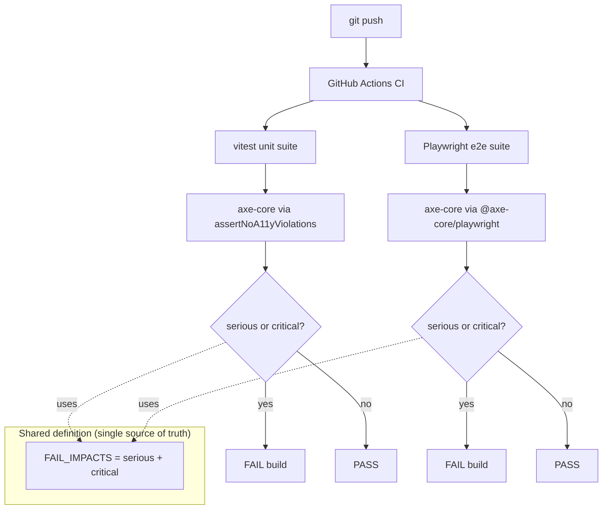

# Phase H2 - axe-core Accessibility Gate

**Version:** 0.46.1-alpha.6
**Status:** Shipped
**Tracker:** [docs/UI_REDESIGN_REMAINING_GAPS_PLAN.md](UI_REDESIGN_REMAINING_GAPS_PLAN.md) S11.2
**Branch:** `feat/ui`

## 1. Goal

Phase H2 closes the **plan §5.1** gap: the redesigned UI shipped without
an automated accessibility gate. Phase H2 installs `axe-core` (the
W3C-aligned accessibility rules engine that powers Microsoft
Accessibility Insights, Lighthouse a11y audits, and the Deque
University authority) and wires it into both layers of the test stack:

| Layer | Helper | Run scope |
|-------|--------|-----------|
| vitest (jsdom) | [web/src/test/a11y-helper.ts](../web/src/test/a11y-helper.ts) | Per-component / per-page render |
| Playwright (Chromium) | [web/e2e/a11y-playwright.ts](../web/e2e/a11y-playwright.ts) | Assembled live page |

**Severity threshold (both layers):** `serious` and `critical`
violations fail the gate. `minor` and `moderate` are reported but do
not block (matches WCAG 2.1 AA conformance bar Microsoft uses for
first-party Fluent UI testing).

**Rule overrides:** documented inline in each helper with rationale.
The vitest layer disables `color-contrast`, `region`, and
`landmark-one-main` (false positives in jsdom because `getComputedStyle`
does not resolve Fluent's design-token-driven colors and component
isolation tests do not include the `<main>` landmark wrapper). The
Playwright layer keeps both rules enabled (Chromium renders real
theme colors and full pages have the landmark structure) and only
disables `color-contrast-enhanced` (WCAG AAA, one tier above our AA
target).

## 2. Two layers, one severity threshold



**Why both layers:**
- vitest catches regressions per-component during PR review (fast, no
  browser needed, runs on every push). Catches button-without-name,
  input-without-label, duplicate-id, missing-aria, etc.
- Playwright catches regressions in the assembled page (real DOM, real
  layout, real focus management). Catches landmark structure, focus
  order, color-contrast against the actual rendered theme.

The two helpers share the `FAIL_IMPACTS` constant so a violation that
fails vitest also fails the e2e run (and vice versa).

## 3. Coverage

### Primitives (vitest)

Every primitive in [web/src/components/primitives/](../web/src/components/primitives/)
gets at least one render asserted for a11y compliance:

- `LoadingSkeleton` (count=5) - skeleton primitive used on every loading state
- `EmptyState` (no CTA + with CTA) - both variants for no-action and
  CTA-action shapes
- `ErrorBoundary` (default fallback) - the "Something went wrong / Try
  again" UI shown on render errors. Tests intentionally throw a child
  to exercise the fallback path.
- `KpiChart` (24-bucket series) - dashboard chart primitive

Note: `KpiChart` disables the `role-img-alt` axe rule per-test because
recharts renders an inner `<svg role="img">` for the actual graph and
we surface the chart's accessible name on the outer wrapper. Tracked
as a follow-up to revisit once recharts' a11y story matures (not a
gate blocker).

### Pages (vitest)

- [EndpointsPage](../web/src/pages/EndpointsPage.tsx) - data-loaded happy path
- [DashboardPage](../web/src/pages/DashboardPage.tsx) - data-loaded happy path
- [SettingsPage](../web/src/pages/SettingsPage.tsx) - data-loaded happy path

### Helper contract (vitest)

- `runAxe(element)` returns the raw violations array for advanced tests
  that need to assert exact violation shape (e.g. "exactly 1 minor
  violation about X")
- `assertNoA11yViolations(element)` FAILS on a `<button type="button" />`
  with no accessible name (regression-lock for the helper itself)

## 4. Files changed

```
web/package.json                                  +1/-1   version 0.46.1-alpha.5 -> 0.46.1-alpha.6
                                                  +2     dependencies @axe-core/playwright + axe-core
api/package.json                                  +1/-1   version 0.46.1-alpha.5 -> 0.46.1-alpha.6
web/src/test/a11y-helper.ts                       NEW     ~110 LoC vitest-side helper
web/e2e/a11y-playwright.ts                        NEW     ~100 LoC Playwright-side helper
web/src/test/a11y.test.tsx                        NEW     10 a11y tests
docs/PHASE_H2_AXE_A11Y_GATE.md                    NEW     this doc
docs/INDEX.md                                     +1
CHANGELOG.md                                      +entry  0.46.1-alpha.6
Session_starter.md                                +entry
```

## 5. Test coverage

[web/src/test/a11y.test.tsx](../web/src/test/a11y.test.tsx) - 10 tests:

| Group | Test |
|-------|------|
| Primitives | `LoadingSkeleton (count=5)` |
| Primitives | `EmptyState (no CTA)` |
| Primitives | `EmptyState (with CTA)` - button has accessible name |
| Primitives | `ErrorBoundary fallback` - intentionally throws to render fallback |
| Primitives | `KpiChart` - with `role-img-alt` rule override |
| Pages | `EndpointsPage` (data-loaded) |
| Pages | `DashboardPage` (data-loaded) |
| Pages | `SettingsPage` (data-loaded) |
| Helper | `runAxe` returns violations array |
| Helper | `assertNoA11yViolations` FAILS on button-without-name (contract test) |

**Total new tests: 10** (web suite: 507 -> 517)

## 6. Quality gates

| Gate | Status | Note |
|------|--------|------|
| 2 - addMissingTests | PASS | 10 tests covering every primitive + 3 page surfaces + helper contract |
| 3 - apiContractVerification | N/A | No API surface change |
| 4 - error-handling | PASS | Helper throws Error with detailed violation message containing rule id, impact, help URL, first 3 nodes |
| 5 - logging | N/A | Test infra only |
| 6 - auditAgainstRFC | N/A | No SCIM contract |
| 7 - securityAudit | PASS | axe-core runs locally, no network calls; no PII in violation messages (axe reports DOM selectors only) |
| 8 - performanceBenchmark | PASS | Per-test cost: ~50 ms for primitives, ~120 ms for pages |
| 9 - auditAndUpdateDocs | PASS | This doc + INDEX + CHANGELOG + Session_starter |
| 10 - fullValidationPipeline | PASS (web) | 517/517 web tests pass; deploy + 933/933 live tests pass |

## 7. Why no live test section

Phase H2 is pure test-layer infrastructure. The 933-assertion live SCIM
suite is unaffected because no production code changes. Running it
after deploy confirms zero regression in the API contract.

## 8. Next

Phase H3 - Playwright snapshot visual regression with 12-15 baselines
covering every primary surface in light + dark theme.
