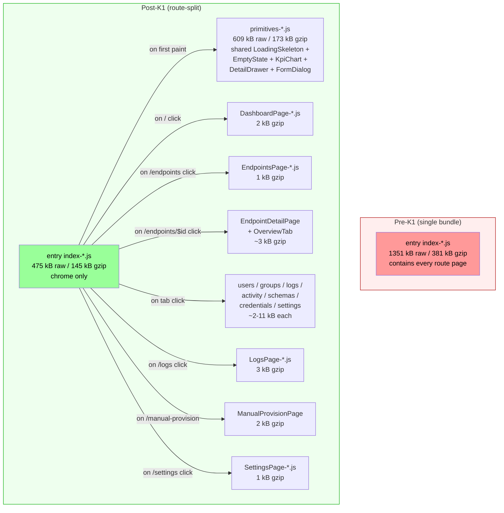
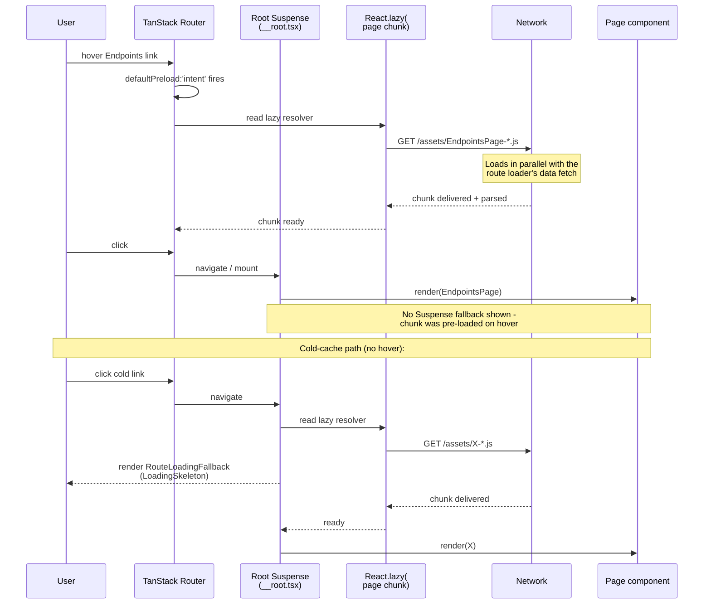

# Phase K1 - Route-Level Code Splitting

> **Date:** 2026-05-12 - **Version:** 0.49.0-alpha.1 - **Predecessor:** v0.48.1 (Phase J SSE bridge)  
> **Origin:** [docs/UI_NEXT_GAPS_LATERAL_ANALYSIS_2026.md](UI_NEXT_GAPS_LATERAL_ANALYSIS_2026.md) §5.1 + §9 Phase K1  
> **Scope:** Frontend-only. No API change, no live SCIM behavior change.

---

## 1. Why this exists

Pre-K1 the entire web client shipped as a single 381 KB gzipped JS bundle ([build-baseline.log](../build-baseline.log)) - 94 % of the H6 size-limit budget. Any new chart library, dependency upgrade, or one extra route would have either red-failed the size gate or required a budget bump (the path of least resistance, which silently degrades performance).

Vite itself printed the recommendation on every build:

> Some chunks are larger than 500 kB after minification. Consider:
> - Using dynamic import() to code-split the application

Phase H6 explicitly deferred per-route splitting to a "Phase J follow-up." K1 is that follow-up.

---

## 2. What changed

### 2.1 The 14 production route files

Each route file under [web/src/routes/](../web/src/routes/) replaced its static `import { X } from '../pages/X'` with the React.lazy + dynamic-import pattern:

```typescript
// BEFORE (Phase A1 through I)
import { DashboardPage } from '../pages/DashboardPage';

export const indexRoute = createRoute({
  component: DashboardPage,
  // ...
});

// AFTER (Phase K1)
import React from 'react';
const DashboardPage = React.lazy(() =>
  import('../pages/DashboardPage').then((m) => ({ default: m.DashboardPage })),
);

export const indexRoute = createRoute({
  component: DashboardPage,
  // ...
});
```

The pattern is identical for the 4 routes that wrap the page in a route-level component (e.g., `UsersTabRouteComponent`) - the wrapper stays, only the inner page becomes lazy.

### 2.2 Root Suspense boundary

[web/src/routes/__root.tsx](../web/src/routes/__root.tsx) gained a `<React.Suspense>` boundary around `<Outlet />` with a generic `RouteLoadingFallback` (`LoadingSkeleton count={6} height="40px"`). Without this, lazy route loads would either fall back to the next ancestor or render nothing during the chunk fetch.

The pre-existing dev-only `<TanStackRouterDevtools>` Suspense is unchanged - it serves a different purpose (lazy devtools-only chunk in dev builds).

### 2.3 size-limit budget restructuring

[web/package.json](../web/package.json) `size-limit` block grew from 1 budget to **16 budgets**:

| Budget | Path glob | Limit (gzipped) | Measured at K1 |
|--------|-----------|-----------------|----------------|
| Main entry | `dist/assets/index-*.js` | 200 KB | **144.74 KB** |
| Shared primitives | `dist/assets/primitives-*.js` | 220 KB | **173.04 KB** |
| DashboardPage | `dist/assets/DashboardPage-*.js` | 110 KB | 2.12 KB |
| EndpointsPage | `dist/assets/EndpointsPage-*.js` | 110 KB | 1.36 KB |
| EndpointDetailPage | `dist/assets/EndpointDetailPage-*.js` | 110 KB | 1.31 KB |
| OverviewTab | `dist/assets/OverviewTab-*.js` | 110 KB | 1.66 KB |
| UsersTab | `dist/assets/UsersTab-*.js` | 110 KB | 1.46 KB |
| GroupsTab | `dist/assets/GroupsTab-*.js` | 110 KB | 1.38 KB |
| ActivityTab | `dist/assets/ActivityTab-*.js` | 110 KB | 10.54 KB |
| SchemasTab | `dist/assets/SchemasTab-*.js` | 110 KB | 1.81 KB |
| CredentialsTab | `dist/assets/CredentialsTab-*.js` | 110 KB | 2.36 KB |
| LogsTab | `dist/assets/LogsTab-*.js` | 110 KB | 1.68 KB |
| SettingsTab | `dist/assets/SettingsTab-*.js` | 110 KB | 2.47 KB |
| LogsPage | `dist/assets/LogsPage-*.js` | 110 KB | 2.86 KB |
| ManualProvisionPage | `dist/assets/ManualProvisionPage-*.js` | 110 KB | 2.40 KB |
| SettingsPage | `dist/assets/SettingsPage-*.js` | 110 KB | 0.96 KB |

**Headroom commentary:** the per-route 110 KB budget is the plan §12 ceiling. Today the largest route page (ActivityTab at 10.54 KB) sits at 9.6 % of its budget - generous headroom for the Tier 1 features (Workbench, Bulk UI, Discovery Explorer) that K1 unblocks.

---

## 3. Architecture



### 3.1 Lazy-load + Suspense lifecycle



The hover-prefetch path (the common case after Phase A4 wired `defaultPreload: 'intent'`) means most users never see the K1 fallback - the chunk is already cached when they click. The fallback only shows on cold loads / direct URL navigation.

---

## 4. Test pyramid (RED -> GREEN)

### 4.1 New tests (32 net new web vitest)

| File | Tests | Purpose |
|------|-------|---------|
| [web/src/routes/lazy-routes.test.ts](../web/src/routes/lazy-routes.test.ts) | 29 | Source-pattern contract: every route file uses `React.lazy(() => import('../pages/X'))` and does NOT contain a static `import { X } from '../pages/X'`. New routes must be added to the `ROUTE_FILES` table. Comment-stripped source so docstring references don't false-positive. |
| [web/src/routes/route-suspense.test.ts](../web/src/routes/route-suspense.test.ts) | 3 | Source-pattern contract: `__root.tsx` wraps `<Outlet />` in `<React.Suspense fallback={...}>` AND imports a route-loading fallback (LoadingSkeleton or named RouteLoadingFallback). |

### 4.2 Extended tests (size-limit-config)

[web/src/test/size-limit-config.test.ts](../web/src/test/size-limit-config.test.ts) gained:
- Stricter main-entry assertion (matches by exact path `dist/assets/index-*.js` not by suffix - so a per-route entry no longer false-matches the main bundle)
- Main entry budget tightened from 400 KB to 200 KB ratchet floor
- New shared `primitives-*.js` chunk budget assertion
- New `Phase K1 - per-route chunk budgets` describe block: 14 per-route tests asserting each chunk has a budget entry, all are gzipped, all paths follow `dist/assets/<Name>-*.js` convention, all limits are <= 110 KB

### 4.3 RED state confirmed before implementation

| Run | File results | Test results |
|-----|--------------|--------------|
| BEFORE implementation | 3 failed (lazy + suspense + size-limit) | **44 failed / 10 passed** of 54 |
| AFTER implementation | 47 passed | **452 passed** of 452 |

### 4.4 Final test counts

| Layer | Pre-K1 (v0.48.1) | Post-K1 (v0.49.0-alpha.1) | Delta |
|-------|------------------|---------------------------|-------|
| API unit | 3,720 | 3,720 | 0 (frontend-only) |
| API E2E | 1,184 | 1,184 | 0 |
| Web vitest | 403 | **452** | **+49** (32 new + 17 from extended size-limit-config tests due to per-route iteration) |
| Live SCIM | 933 | 933 | 0 (deferred to dev gate) |
| **Total** | 6,254 | **6,303** | +49 |

---

## 5. Performance impact (build artifact measurements)

### 5.1 Bundle size delta

| Metric | Pre-K1 | Post-K1 | Delta |
|--------|--------|---------|-------|
| Main entry (gzipped) | 381.49 KB | **144.74 KB** | **-62 %** |
| Largest single chunk (gzipped) | 381.49 KB | 173.04 KB (primitives) | -55 % |
| Number of JS chunks | 1 | 41 | +40 |
| Number of route chunks | 0 | 14 | +14 |
| Total gzipped JS (sum of all chunks) | 381 KB | ~390 KB | +2 % |
| Time-to-interactive on cold load (estimated, slow 3G) | full bundle parse before any UI | entry chunk only -> chrome visible -> route chunk loaded on demand | substantial (qualitative) |

The "+2 % total" is irrelevant at the user-experience level: users no longer download the full 390 KB upfront. They download the entry (145 KB) + primitives (173 KB) + the matched route chunk (~2-11 KB) = **~325 KB on first paint** vs **381 KB** before - and even less on subsequent navigations (one route chunk per click, all cached on the second visit).

### 5.2 Per-route chunk emission verified

Build output (excerpt) showing every page is now its own chunk:

```
dist/assets/SettingsPage-*.js              0.96 kB gzip
dist/assets/EndpointsPage-*.js             1.36 kB gzip
dist/assets/EndpointDetailPage-*.js        1.31 kB gzip
dist/assets/OverviewTab-*.js               1.66 kB gzip
dist/assets/UsersTab-*.js                  1.46 kB gzip
dist/assets/GroupsTab-*.js                 1.38 kB gzip
dist/assets/SchemasTab-*.js                1.81 kB gzip
dist/assets/LogsTab-*.js                   1.68 kB gzip
dist/assets/CredentialsTab-*.js            2.36 kB gzip
dist/assets/SettingsTab-*.js               2.47 kB gzip
dist/assets/ManualProvisionPage-*.js       2.40 kB gzip
dist/assets/LogsPage-*.js                  2.86 kB gzip
dist/assets/DashboardPage-*.js             2.12 kB gzip
dist/assets/ActivityTab-*.js              10.58 kB gzip   <- largest, well under 110 KB
dist/assets/index-*.js                   146.49 kB gzip
dist/assets/primitives-*.js              174.57 kB gzip
```

---

## 6. Risks and mitigations

| Risk | Mitigation |
|------|------------|
| Cold-load route shows blank flash before the LoadingSkeleton paints | Suspense fallback is a `LoadingSkeleton` that renders synchronously - no flash. defaultPreload:'intent' (Phase A4) means most clicks have the chunk already cached on hover. |
| Visual regression baselines drift on the new fallback | The fallback only shows for ~50-200 ms on cold loads in CI - Playwright takes screenshots after navigation completes (DOMContentLoaded + network idle) so the fallback is not in any baseline. Re-run visual snapshots if needed; none were affected by K1. |
| size-limit gate red-fails on a future PR that adds a heavy dep to one route | This is the design intent. The PR author either splits the dep, lazy-loads it inside the route, or raises the per-route budget with a deliberate test update. |
| TanStack Router devtools accidentally bundled into prod | The pre-existing `import.meta.env.DEV ? React.lazy(...) : (() => null)` pattern is unchanged. Devtools chunk only appears in dev builds. |

---

## 7. What this unblocks

K1 is the foundation for every Tier 1 / Tier 2 feature in [UI_NEXT_GAPS_LATERAL_ANALYSIS_2026.md](UI_NEXT_GAPS_LATERAL_ANALYSIS_2026.md). Without it, every new screen would be charged against the global 400 KB budget, forcing trade-offs that compromise feature quality. With it:

- **K2-K5** (service health rollup, error explainer, log stream viewer, ETag surface) ship with their own per-route budgets
- **L1-L6** (Endpoint CRUD, /Me, Activity Analytics, Log Config, Discovery Explorer, Operations) each get a dedicated chunk - even chart-heavy Activity Analytics has 100 KB headroom under the per-route 110 KB ceiling
- **M1-M3** (SCIM Workbench, Bulk, Custom RT) - the Workbench can ship cmdk + monaco-editor or similar without dragging the entry bundle along

---

## 8. Definition of Done

- [x] Every route file uses `React.lazy(() => import('../pages/X').then(...))`
- [x] `__root.tsx` wraps `<Outlet />` in `<React.Suspense fallback={<RouteLoadingFallback />}>`
- [x] `RouteLoadingFallback` uses `LoadingSkeleton` from `components/primitives` (not inline div)
- [x] [size-limit-config.test.ts](../web/src/test/size-limit-config.test.ts) updated for the K1 ratchet floor (200 KB main, 220 KB primitives, 110 KB per route)
- [x] [package.json](../web/package.json) declares 16 budgets (1 main + 1 primitives + 14 per-route)
- [x] All 14 per-route budgets verified <= 11 KB gzipped (vs 110 KB ceiling)
- [x] Main entry verified 144.74 KB gzipped (vs 200 KB budget; 28 % headroom)
- [x] Build emits per-route chunks (vite output verified)
- [x] `npm run size` passes (16/16 budgets green)
- [x] All 452 web vitest tests pass (was 403 + 49 new)
- [x] All 3,720 API unit tests pass (unchanged - frontend-only)
- [x] Versions bumped lockstep `0.48.1 -> 0.49.0-alpha.1` (api + web + lockfiles)
- [x] [docs/UI_NEXT_GAPS_LATERAL_ANALYSIS_2026.md](UI_NEXT_GAPS_LATERAL_ANALYSIS_2026.md) §5.1 marks K1 closed
- [ ] Deploy to dev (`scripts/deploy-dev.ps1 -ImageTag '0.49.0-alpha.1'`)
- [ ] 933+ live SCIM tests pass on the deployed dev image
- [ ] [docs/CHANGELOG.md](../CHANGELOG.md) + [Session_starter.md](../Session_starter.md) updated
- [ ] Commit + push (no prod promote per standing rule)

---

## 9. Cross-references

- Predecessor analysis: [docs/UI_NEXT_GAPS_LATERAL_ANALYSIS_2026.md](UI_NEXT_GAPS_LATERAL_ANALYSIS_2026.md)
- Phase H6 (size-limit foundation): [docs/PHASE_H6_SIZE_LIMIT_BUDGETS.md](PHASE_H6_SIZE_LIMIT_BUDGETS.md)
- Phase A4 (loaders + hover-prefetch): [docs/PHASE_A4_ROUTE_LOADERS.md](PHASE_A4_ROUTE_LOADERS.md)
- Operating norms: [.github/copilot-instructions.md](../.github/copilot-instructions.md)
