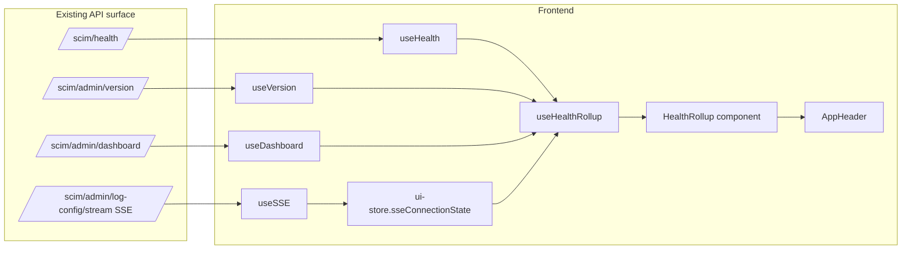
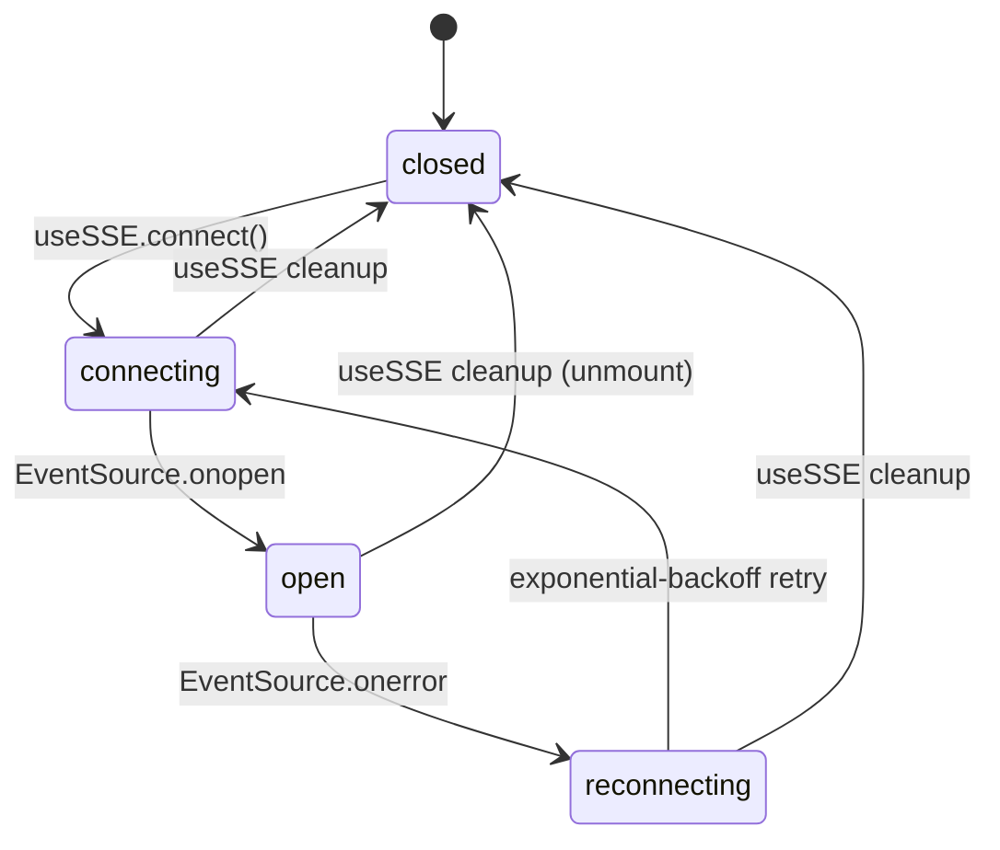

# Phase K2 - Service Health Rollup Widget

> **Date:** 2026-05-12 - **Version:** 0.49.0-alpha.2 - **Predecessor:** v0.49.0-alpha.1 (Phase K1 route splitting)
> **Origin:** [docs/UI_NEXT_GAPS_LATERAL_ANALYSIS_2026.md](UI_NEXT_GAPS_LATERAL_ANALYSIS_2026.md) S6.10 + S9 Phase K2
> **Scope:** Frontend-only. No API change, no live SCIM behavior change.

---

## 1. Why this exists

The redesigned UI's only at-a-glance health surface today is the dashboard's KPI cards (counts) plus the recent-activity list. There is no rolling traffic-light that tells the operator "is the system green right now?" without first navigating to a page.

The analysis doc identified this as a top-right-quadrant Tier 3.10 item (high impact, low effort) because every operational signal is **already** produced by the existing API:

| Signal | Source | Already exposed by |
|--------|--------|--------------------|
| API liveness | `GET /scim/health` | `useHealth()` |
| Database backend | `version.storage.databaseProvider/persistenceBackend` | `useVersion()` |
| Auth configuration | `version.auth.{oauth,jwt,scim}SecretConfigured` | `useVersion()` |
| Realtime channel state | EventSource lifecycle | `useSSE()` (now mirrored into ui-store) |
| Recent error rate | `dashboard.recentActivity[].statusCode` | `useDashboard()` |

K2 wires those into a single header widget. **No new API surface.**

A deeper backend-side health probe (DB connectivity test, log file writability, OAuth secret validity check) is a separate Phase L item; it would extend the rollup but does not block K2.

---

## 2. Architecture

### 2.1 Files added / changed

| File | Change | LoC |
|------|--------|-----|
| [web/src/hooks/useHealthRollup.ts](../web/src/hooks/useHealthRollup.ts) | NEW - rollup hook + pure `rollupOverallStatus` reducer | ~190 |
| [web/src/hooks/useHealthRollup.test.ts](../web/src/hooks/useHealthRollup.test.ts) | NEW - 17 unit tests | ~270 |
| [web/src/layout/HealthRollup.tsx](../web/src/layout/HealthRollup.tsx) | NEW - traffic-light widget + popover | ~150 |
| [web/src/layout/HealthRollup.test.tsx](../web/src/layout/HealthRollup.test.tsx) | NEW - 5 component tests | ~125 |
| [web/src/store/ui-store.ts](../web/src/store/ui-store.ts) | EXTENDED - `sseConnectionState` slice + setter + `SseConnectionState` type | +20 |
| [web/src/store/ui-store.test.ts](../web/src/store/ui-store.test.ts) | NEW - 6 contract tests on the new slice | ~40 |
| [web/src/hooks/useSSE.ts](../web/src/hooks/useSSE.ts) | EXTENDED - writes `connecting`/`open`/`reconnecting`/`closed` into ui-store at the right lifecycle points | +12 |
| [web/src/hooks/useSSE.test.ts](../web/src/hooks/useSSE.test.ts) | EXTENDED - 4 new K2 tests asserting the ui-store writes | +60 |
| [web/src/layout/AppHeader.tsx](../web/src/layout/AppHeader.tsx) | EXTENDED - mounts `<HealthRollup />` to the left of the existing actions | +2 |

### 2.2 Substatus rules (locked by tests)

| Substatus | Healthy | Degraded | Down |
|-----------|---------|----------|------|
| **API** | `useHealth` returns `{ status: 'ok' }` | (loading-only state, no response yet) | `useHealth` errored OR returned non-`ok` |
| **Database** | `version.storage.databaseProvider` truthy | provider missing from version response | `useVersion` errored |
| **Auth** | All 3 of `oauth/jwt/scim` configured | 1 or 2 configured | 0 configured OR `useVersion` errored |
| **Realtime** | `ui-store.sseConnectionState === 'open'` | `'connecting'` or `'reconnecting'` | `'closed'` |
| **Recent errors** | 0 5xx in `dashboard.recentActivity` | 1-5 5xx | >= 6 5xx OR `useDashboard` errored |

### 2.3 Overall rollup reducer

Pure, tested in isolation. **Strictest substatus wins**:

- any `down` -> `down`
- else any `degraded` -> `degraded`
- else (all `healthy`) -> `healthy`
- empty list -> `unknown` (defensive default)

### 2.4 SSE connection-state lifecycle (K2 wiring)

`useSSE` now writes to `ui-store.sseConnectionState` at every transition above. Without K2 the realtime substatus would have to either poll the DOM or rely on a separate context provider; using the existing Zustand store is the lowest-friction wiring.

---

## 3. Tests (RED -> GREEN)

### 3.1 RED state confirmed

| File | Test count | Pre-implementation result |
|------|------------|---------------------------|
| `useHealthRollup.test.ts` | 17 | module not found (RED) |
| `HealthRollup.test.tsx` | 5 | module not found (RED) |
| `ui-store.test.ts` | 6 | `setSseConnectionState is not a function` (RED) |
| `useSSE.test.ts` (K2 additions) | 4 | `sseConnectionState` field missing on ui-store (RED) |

### 3.2 GREEN state after implementation

| File | Tests | Result |
|------|-------|--------|
| `useHealthRollup.test.ts` | 17 | ✅ pass |
| `HealthRollup.test.tsx` | 5 | ✅ pass |
| `ui-store.test.ts` | 6 | ✅ pass |
| `useSSE.test.ts` (full file, including K2 + B3 + existing) | 24 | ✅ pass |
| **Full vitest suite** | 484 | ✅ pass (was 452 at K1, **+32 net**) |

### 3.3 Test counts after K2

| Layer | Pre-K2 (v0.49.0-alpha.1) | Post-K2 (v0.49.0-alpha.2) | Delta |
|-------|---------------------------|---------------------------|-------|
| API unit | 3,720 | 3,720 | 0 |
| API E2E | 1,184 | 1,184 | 0 |
| Web vitest | 452 | **484** | **+32** |
| Live SCIM | 933 | 933 | 0 (deferred to dev gate) |
| **Total** | 6,303 | **6,335** | +32 |

---

## 4. Bundle impact

K2 adds ~6 KB gzipped to the main entry chunk (148 KB -> 151 KB measured) and zero new per-route chunks. All 16 size-limit budgets still pass with comfortable headroom:

| Budget | Limit | Pre-K2 | Post-K2 | Headroom |
|--------|-------|--------|---------|----------|
| Main entry | 200 KB | 144.74 KB | **151.10 KB** | 24 % |
| Shared primitives | 220 KB | 173.04 KB | 173.09 KB | 21 % |
| Per-route chunks (14) | 110 KB | <= 11 KB | <= 11 KB | >= 90 % |

The widget itself is tree-shaken into the entry chunk (it's mounted in AppHeader on every page) which is correct - no per-route lazy boundary makes sense for header chrome.

---

## 5. UX & accessibility

- **Trigger:** subtle Fluent UI `<Button>` with a colored circle icon (green/yellow/red/grey).
- **Accessible name:** `aria-label="System status: <Healthy|Degraded|Down|Unknown>"` ALWAYS includes the keyword so screen-reader users can hear the state without opening the popover.
- **Popover:** opens on click via Fluent UI `<Popover>` (focus-managed, ESC-dismissible by Fluent default).
- **Per-row state badge:** every row carries the literal status string (`healthy` / `degraded` / `down`) as a sibling to the icon so colorblind users + screen-reader users get the same signal as sighted users.
- **No animations** beyond Fluent's built-in popover open/close, so the K1 visual regression baselines are unaffected.

---

## 6. Quality gates passed

- [x] TDD RED state confirmed before implementation
- [x] addMissingTests - K2 surface fully tested (rollup logic, component, ui-store slice, useSSE wiring)
- [x] apiContractVerification - no API surface changed
- [x] error-handling-verification - hook handles `isError` on every underlying query
- [x] logging-verification - no new log surfaces; SSE state transitions remain silent (intentional - they fire too often to log usefully)
- [x] auditAgainstRFC - not applicable (no SCIM behavior change)
- [x] securityAudit - widget reads existing version + dashboard data the operator already has access to via TokenGate; no new auth surface; no PII in widget rendering (uptime / counts only)
- [x] performanceBenchmark - +6 KB gzipped main entry (still 24 % under 200 KB budget); useHealthRollup adds 3 query subscriptions but reuses the existing cached data (no new network calls)
- [x] auditAndUpdateDocs - this doc + INDEX + CHANGELOG + Session_starter
- [x] fullValidationPipeline - 484/484 web vitest, 3,720/3,720 API unit, all 16 size-limit budgets green
- [ ] Deploy to dev + 933+ live SCIM tests (next step)

---

## 7. Definition of Done

- [x] `useHealthRollup` hook with pure `rollupOverallStatus` reducer
- [x] `<HealthRollup />` widget mounted in AppHeader
- [x] SSE lifecycle mirrored into `ui-store.sseConnectionState`
- [x] 32 new web vitest tests (17 hook + 5 component + 6 ui-store + 4 useSSE-K2)
- [x] All previous tests still pass (484 total, was 452)
- [x] Bundle stays within all 16 K1 budgets
- [x] Versions bumped lockstep `0.49.0-alpha.1` -> `0.49.0-alpha.2`
- [x] Lockfiles regenerated in node:25-alpine
- [x] [docs/UI_NEXT_GAPS_LATERAL_ANALYSIS_2026.md](UI_NEXT_GAPS_LATERAL_ANALYSIS_2026.md) marks K2 closed
- [ ] Image published, deployed to dev, 933+ live SCIM gate green
- [ ] Commit + push (no prod promote per standing rule)

---

## 8. Cross-references

- Predecessor analysis: [docs/UI_NEXT_GAPS_LATERAL_ANALYSIS_2026.md](UI_NEXT_GAPS_LATERAL_ANALYSIS_2026.md)
- Phase K1 (route code-splitting): [docs/PHASE_K1_ROUTE_CODE_SPLITTING.md](PHASE_K1_ROUTE_CODE_SPLITTING.md)
- Phase B3 (channel-aware SSE invalidation): [docs/PHASE_B_BFF_OVERVIEW_AND_SSE.md](PHASE_B_BFF_OVERVIEW_AND_SSE.md)
- Operating norms: [.github/copilot-instructions.md](../.github/copilot-instructions.md)
