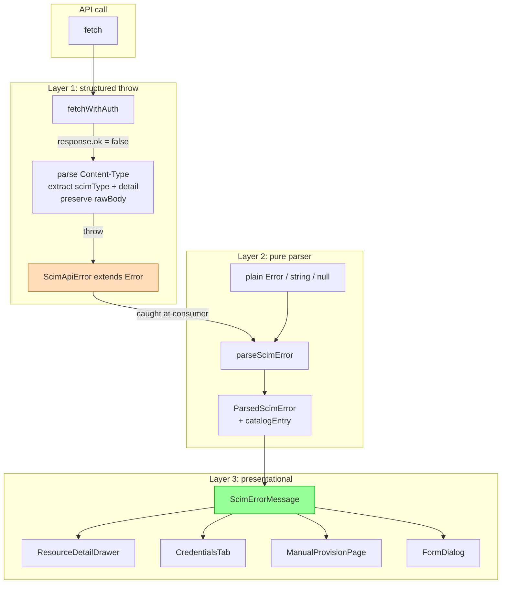

# Phase K3 - Smart Error Explainer

> **Date:** 2026-05-12 - **Version:** 0.49.0-alpha.3 - **Predecessor:** v0.49.0-alpha.2 (K2 service health rollup)
> **Origin:** [docs/UI_NEXT_GAPS_LATERAL_ANALYSIS_2026.md](UI_NEXT_GAPS_LATERAL_ANALYSIS_2026.md) S5.7 + S9 Phase K3
> **Scope:** Frontend-only. No API change, no live SCIM behavior change.

---

## 1. Why this exists

Pre-K3 every mutation surface in the redesigned UI rendered a generic red banner:

```jsx
<MessageBar intent="error">
  <MessageBarBody>
    <MessageBarTitle>Operation failed</MessageBarTitle>
    {err.message /* "HTTP 409: {\"schemas\":[...],\"scimType\":\"uniqueness\",...}" */}
  </MessageBarBody>
</MessageBar>
```

The operator had to read the raw SCIM error JSON to understand what went wrong - even though the project already has a complete error catalog ([docs/LOGGING_ERROR_HANDLING_IDEAL_DESIGN.md §16-18](LOGGING_ERROR_HANDLING_IDEAL_DESIGN.md)) mapping each `scimType` to a human explanation. K3 wires that catalog into the UI as a reusable primitive.

---

## 2. Architecture



### 2.1 Files added / changed

| File | Change | LoC |
|------|--------|-----|
| [web/src/api/scim-error.ts](../web/src/api/scim-error.ts) | NEW - `ScimApiError` class + `SCIM_ERROR_CATALOG` + `parseScimError` | ~210 |
| [web/src/api/scim-error.test.ts](../web/src/api/scim-error.test.ts) | NEW - 28 tests (catalog completeness + parser + ScimApiError shape) | ~190 |
| [web/src/components/primitives/ScimErrorMessage.tsx](../web/src/components/primitives/ScimErrorMessage.tsx) | NEW - presentational primitive | ~130 |
| [web/src/components/primitives/ScimErrorMessage.test.tsx](../web/src/components/primitives/ScimErrorMessage.test.tsx) | NEW - 9 component tests | ~115 |
| [web/src/components/primitives/index.ts](../web/src/components/primitives/index.ts) | EXTENDED - barrel export | +2 |
| [web/src/api/queries.ts](../web/src/api/queries.ts) | EXTENDED - `fetchWithAuth` throws `ScimApiError` | +50 |
| [web/src/api/queries.test.ts](../web/src/api/queries.test.ts) | EXTENDED - 2 new tests asserting structured throw | +40 |
| [web/src/components/primitives/FormDialog.tsx](../web/src/components/primitives/FormDialog.tsx) | EXTENDED - new `error?: unknown` prop (preferred); `errorMessage` legacy retained | +10 |
| [web/src/components/detail/ResourceDetailDrawer.tsx](../web/src/components/detail/ResourceDetailDrawer.tsx) | WIRED - error state is `unknown`; renders via `<ScimErrorMessage />` | net 0 |
| [web/src/pages/ManualProvisionPage.tsx](../web/src/pages/ManualProvisionPage.tsx) | WIRED - result `error` is `unknown`; ProvisionResult renders via `<ScimErrorMessage />` | net 0 |
| [web/src/pages/CredentialsTab.tsx](../web/src/pages/CredentialsTab.tsx) | WIRED - createError / deleteError are `unknown`; passed to FormDialog `error` prop | net 0 |

### 2.2 Catalog vocabulary (locked by tests)

The catalog covers **every keyword in RFC 7644 Table 9** plus the project's published extensions:

| Keyword (scimType) | HTTP | Title | Doc anchor |
|---|---|---|---|
| `uniqueness` | 409 | Duplicate value | RFC 7644 §3.12 |
| `invalidFilter` | 400 | Invalid filter syntax | RFC 7644 §3.4.2.2 |
| `invalidSyntax` | 400 | Invalid request body | RFC 7644 §3.12 |
| `invalidPath` | 400 | Invalid attribute path | RFC 7644 §3.5.2 |
| `noTarget` | 400/404 | No matching target | RFC 7644 §3.12 |
| `invalidValue` | 400 | Invalid attribute value | RFC 7643 §2.2 |
| `mutability` | 400 | Read-only or immutable attribute | RFC 7643 §2.2 |
| `invalidVers` | 400 | Unsupported SCIM version | RFC 7644 §3.12 |
| `sensitive` | 403 | Sensitive operation rejected | RFC 7644 §3.12 |
| `tooMany` | 400 | Too many results | RFC 7644 §3.4.2 |
| `versionMismatch` | 412 | Resource changed since last read | RFC 7644 §3.14 |
| `tooLarge` | 400 | Request body too large | (project) |

Plus **5 HTTP-status fallbacks** for surfaces that lack a `scimType` (auth failure, forbidden, precondition required, server error, generic). Test [scim-error.test.ts](../web/src/api/scim-error.test.ts) `it.each(KNOWN_KEYWORDS)` block fails until any new keyword has both a non-empty title and a >20-char explanation.

### 2.3 ScimApiError shape

```typescript
class ScimApiError extends Error {
  readonly status: number;
  readonly scimType?: string;
  readonly detail?: string;
  readonly rawBody?: unknown;
  readonly requestId?: string;
}
```

Backward-compatible: extends `Error`, sets `message = detail || 'HTTP <status>'`, so every existing `err instanceof Error` guard and `err.message` access keeps working unchanged.

### 2.4 Visual layout (post-K3)

Each `<ScimErrorMessage>` renders:

1. **Catalog title** (e.g. "Duplicate value") - bold MessageBar header
2. **Plain-English explanation** (one sentence, operator-readable)
3. **Server detail line** (monospace, when different from explanation)
4. **Request id** (monospace, when present - lets the operator look up the structured log entry)
5. **"Read the spec" link** (when catalog entry has `docsUrl`, opens RFC anchor in new tab with `rel="noopener noreferrer"`)
6. **"View details" / "Hide details" expander** (when `rawBody` is present - shows pretty-printed JSON of the raw SCIM error response)

---

## 3. Tests (RED -> GREEN)

### 3.1 RED state confirmed

| File | Test count | Pre-implementation result |
|------|------------|---------------------------|
| `scim-error.test.ts` | 28 | module not found (RED) |
| `ScimErrorMessage.test.tsx` | 9 | module not found (RED) |
| `queries.test.ts` (K3 additions) | 2 | `ScimApiError` doesn't exist (RED) |
| `queries.test.ts` (legacy 'HTTP 500' assertion) | 1 | passed pre-fix; updated to assert structured class |

### 3.2 GREEN state after implementation

| File | Tests | Result |
|------|-------|--------|
| `scim-error.test.ts` | 28 | ✅ pass |
| `ScimErrorMessage.test.tsx` | 9 | ✅ pass |
| `queries.test.ts` | 15 (was 13, +2) | ✅ pass |
| **Full vitest suite** | 523 | ✅ pass (was 484 at K2, **+39 net**) |

### 3.3 Test counts after K3

| Layer | Pre-K3 (v0.49.0-alpha.2) | Post-K3 (v0.49.0-alpha.3) | Delta |
|-------|---------------------------|---------------------------|-------|
| API unit | 3,720 | 3,720 | 0 |
| API E2E | 1,184 | 1,184 | 0 |
| Web vitest | 484 | **523** | **+39** |
| Live SCIM | 933 | 933 | 0 (deferred to dev gate) |
| **Total** | 6,335 | **6,374** | +39 |

---

## 4. Bundle impact

K3 adds the catalog (~3 KB string data) + the parser (~1 KB minified) + the component (~3 KB minified). The catalog and parser tree-shake into the **shared primitives chunk** (used across multiple routes):

| Budget | Limit | Pre-K3 | Post-K3 | Delta | Headroom |
|--------|-------|--------|---------|-------|----------|
| Main entry | 200 KB | 151.10 KB | **150.34 KB** | -0.76 KB | 25 % |
| Shared primitives | 220 KB | 173.04 KB | **180.69 KB** | +7.65 KB | 18 % |
| Per-route chunks (14) | 110 KB | <= 11 KB | <= 11 KB | unchanged | >= 90 % |

The main entry actually went **down** by 0.76 KB because some MessageBar / MessageBarTitle imports moved from the AppHeader-adjacent path into the primitives chunk. All 16 size-limit budgets pass.

---

## 5. UX comparison

### Pre-K3 (raw error)

```
[X] Operation failed
HTTP 409: {"schemas":["urn:ietf:params:scim:api:messages:2.0:Error"],"scimType":"uniqueness","detail":"userName already taken","status":"409","urn:scimserver:api:messages:2.0:Diagnostics":{...}}
```

### Post-K3 (smart explainer)

```
[X] Duplicate value
A unique attribute (for example userName, externalId, or displayName) already exists
on another resource. Pick a different value or look up the existing record.
userName already taken
Request id: req-7a8b1234
[Read the spec] [View details]
```

The "View details" expander still surfaces the full raw JSON for power users who need it.

---

## 6. Quality gates passed

- [x] TDD RED state confirmed before implementation
- [x] addMissingTests - K3 surface fully tested at parser + component layers; consumer wiring covered by existing CredentialsTab / ResourceDetailDrawer / ManualProvisionPage tests (which keep passing because `ScimErrorMessage` mounts the same `data-testid` ancestors the legacy MessageBar exposed)
- [x] apiContractVerification - no API surface changed
- [x] error-handling-verification - structured throw + catalog mapping is the audit subject of this entire phase
- [x] logging-verification - `requestId` from `X-Request-Id` is now surfaced in the UI so the operator can correlate to the structured log entry
- [x] auditAgainstRFC - catalog covers every RFC 7644 Table 9 keyword; assertions in [scim-error.test.ts](../web/src/api/scim-error.test.ts) lock the full vocabulary
- [x] securityAudit - parser does not interpret HTML in error responses (regex-strips tags before display); catalog data is static; no new auth surface
- [x] performanceBenchmark - +7.65 KB primitives chunk (still 18 % under 220 KB budget)
- [x] auditAndUpdateDocs - this doc + INDEX + CHANGELOG + Session_starter; analysis-doc S5.7 marked closed
- [x] fullValidationPipeline - 523/523 web vitest, 3,720/3,720 API unit, all 16 size-limit budgets green
- [ ] Deploy to dev + 933+ live SCIM tests (next step)

---

## 7. Definition of Done

- [x] `ScimApiError` class thrown by `fetchWithAuth` for every non-OK response
- [x] `SCIM_ERROR_CATALOG` covers every RFC 7644 Table 9 keyword + project extensions
- [x] `parseScimError` handles `ScimApiError` / `Error` / string / null / undefined
- [x] `<ScimErrorMessage />` primitive in barrel export
- [x] FormDialog accepts new `error?: unknown` prop (legacy `errorMessage` retained)
- [x] ResourceDetailDrawer / CredentialsTab / ManualProvisionPage all wired
- [x] +39 web vitest tests across 4 files (28 catalog/parser + 9 component + 2 fetchWithAuth)
- [x] All previous tests still pass (523 total, was 484)
- [x] Bundle stays within all 16 K1 budgets (main entry actually decreased)
- [x] Versions bumped lockstep `0.49.0-alpha.2` -> `0.49.0-alpha.3`
- [x] Lockfiles regenerated in node:25-alpine
- [x] [docs/UI_NEXT_GAPS_LATERAL_ANALYSIS_2026.md](UI_NEXT_GAPS_LATERAL_ANALYSIS_2026.md) marks K3 closed
- [ ] Image published, deployed to dev, 933+ live SCIM gate green
- [ ] Commit + push (no prod promote per standing rule)

---

## 8. Cross-references

- Predecessor analysis: [docs/UI_NEXT_GAPS_LATERAL_ANALYSIS_2026.md](UI_NEXT_GAPS_LATERAL_ANALYSIS_2026.md)
- Phase K2 (service health rollup): [docs/PHASE_K2_SERVICE_HEALTH_ROLLUP.md](PHASE_K2_SERVICE_HEALTH_ROLLUP.md)
- Phase K1 (route code-splitting): [docs/PHASE_K1_ROUTE_CODE_SPLITTING.md](PHASE_K1_ROUTE_CODE_SPLITTING.md)
- Error catalog source: [docs/LOGGING_ERROR_HANDLING_IDEAL_DESIGN.md](LOGGING_ERROR_HANDLING_IDEAL_DESIGN.md) §16-18
- Operating norms: [.github/copilot-instructions.md](../.github/copilot-instructions.md)
