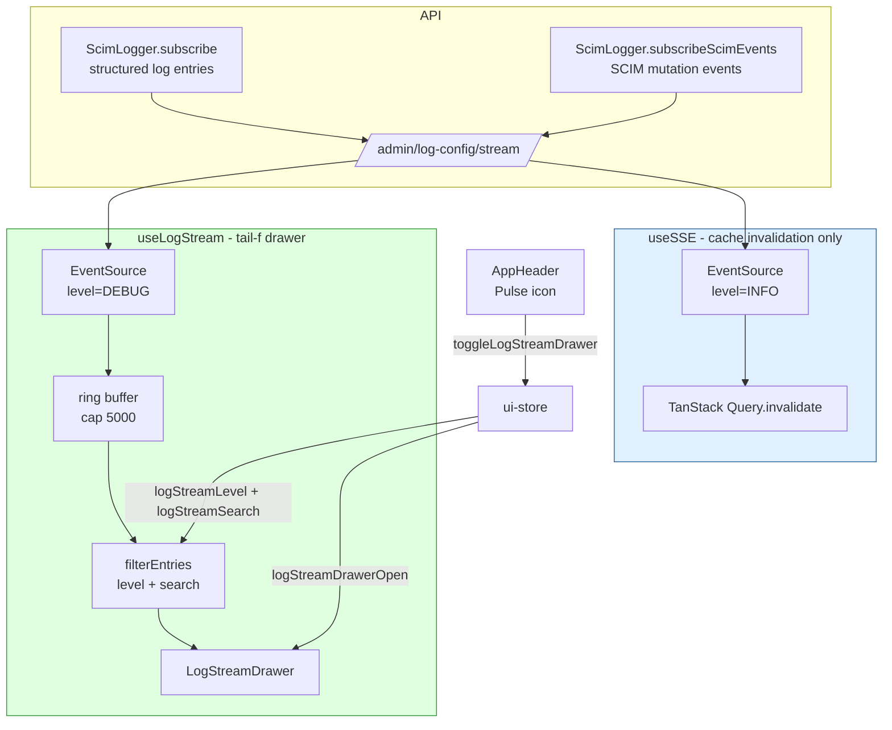
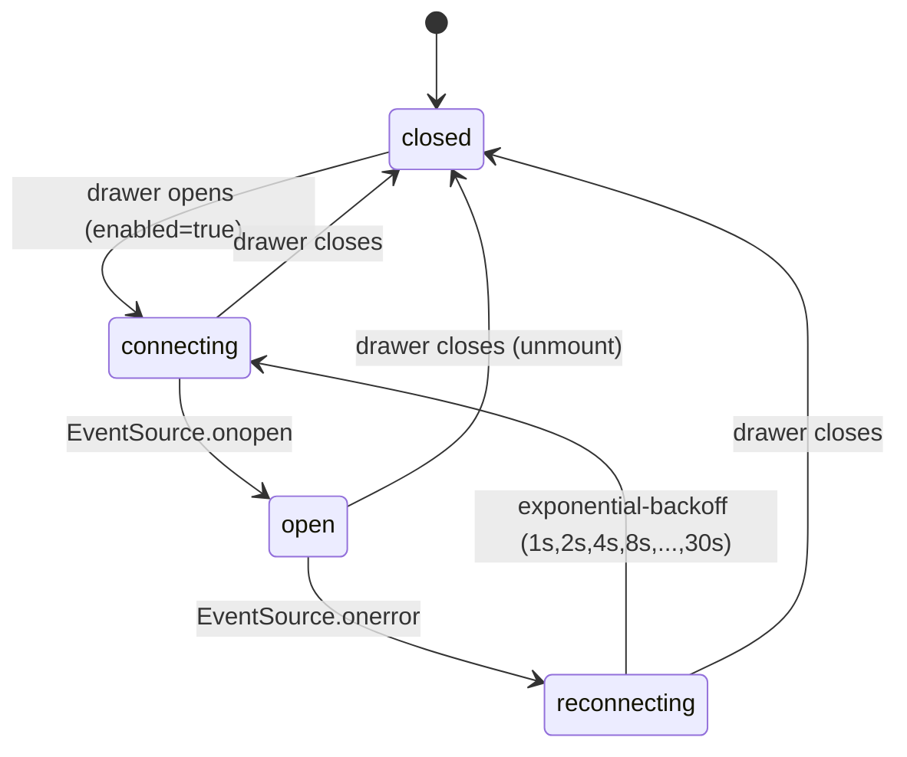

# Phase K4 - Live SSE Log Stream Viewer

> **Date:** 2026-05-12 - **Version:** 0.49.0-alpha.4 - **Predecessor:** v0.49.0-alpha.3 (K3 smart error explainer)
> **Origin:** [docs/UI_NEXT_GAPS_LATERAL_ANALYSIS_2026.md](UI_NEXT_GAPS_LATERAL_ANALYSIS_2026.md) S6.6 + S9 Phase K4
> **Scope:** Frontend-only. No API change, no live SCIM behavior change.

---

## 1. Why this exists

[`/scim/admin/log-config/stream`](../api/src/modules/logging/log-config.controller.ts#L260) has shipped an SSE log feed since v0.10.0 - operators can `curl -N` it from a terminal. The redesigned UI taps the same endpoint via [useSSE](../web/src/hooks/useSSE.ts) but ONLY for cache invalidation; there has never been an in-UI tail-f experience.

Phase K4 ships the operator's-dream view: a floating right-side drawer that tails the structured log stream live, color-coded by level, searchable, pausable, capped at 5,000 entries with an "older entries dropped" banner.

---

## 2. Architecture



### 2.1 Why TWO EventSource connections (not piggyback on useSSE)

| Concern | useSSE (B3 + J) | useLogStream (K4) |
|---------|-----------------|-------------------|
| Filter | `level=INFO` (only INFO+) | `level=DEBUG` (everything) |
| Buffer policy | Forwards into TanStack Query invalidation, no retention | In-memory ring buffer, 5,000 entries |
| Lifecycle | Always-on while UI is mounted | Open-on-demand (only while drawer is open) |
| Throughput | Low (one event per SCIM mutation) | High (every HTTP request, auth event, DB query) |
| Connection cost | 1 EventSource always-open | 1 EventSource only while drawer is open |

Decoupling means:
- A closed drawer does NOT consume an extra connection
- Filter changes (level / search) DO NOT require a network reconnect (filtering is consumer-side)
- The B3 cache-invalidation path keeps working exactly as before, untouched

### 2.2 Files added / changed

| File | Change | LoC |
|------|--------|-----|
| [web/src/hooks/useLogStream.ts](../web/src/hooks/useLogStream.ts) | NEW - hook + pure `filterEntries` reducer | ~205 |
| [web/src/hooks/useLogStream.test.ts](../web/src/hooks/useLogStream.test.ts) | NEW - 17 tests (filter pure + 11 hook integration) | ~245 |
| [web/src/layout/LogStreamDrawer.tsx](../web/src/layout/LogStreamDrawer.tsx) | NEW - drawer UI | ~245 |
| [web/src/layout/LogStreamDrawer.test.tsx](../web/src/layout/LogStreamDrawer.test.tsx) | NEW - 11 component tests | ~150 |
| [web/src/store/ui-store.ts](../web/src/store/ui-store.ts) | EXTENDED - `logStreamDrawerOpen` + `logStreamLevel` + `logStreamSearch` slice + 4 setters + toggle | +35 |
| [web/src/store/ui-store.test.ts](../web/src/store/ui-store.test.ts) | EXTENDED - 9 new tests covering the K4 slice | +60 |
| [web/src/layout/AppHeader.tsx](../web/src/layout/AppHeader.tsx) | EXTENDED - new Pulse24Regular icon button toggles the drawer | +12 |
| [web/src/layout/AppShell.tsx](../web/src/layout/AppShell.tsx) | EXTENDED - mounts `<LogStreamDrawer />` at chrome level | +2 |

### 2.3 LogStreamEntry shape (mirrors server StructuredLogEntry)

```typescript
interface LogStreamEntry {
  timestamp: string;
  level: string;        // 'DEBUG' | 'INFO' | 'WARN' | 'ERROR'
  category: string;     // 'http' | 'auth' | 'scim.users' | ...
  message: string;
  requestId?: string;
  endpointId?: string;
  method?: string;
  path?: string;
  durationMs?: number;
  authType?: string;
  resourceType?: string;
  resourceId?: string;
  operation?: string;
  error?: { message: string; name?: string; stack?: string };
  data?: Record<string, unknown>;
}
```

### 2.4 Drawer UX

```
+---------------------------------------------------------------+
| Live log stream                                          [X]  |
| [open]  127 of 1342 entries                                   |
| [DEBUG v]  [Search ____________________]  [Pause]  [Clear]    |
+---------------------------------------------------------------+
| Buffer reached cap of 5000 entries. Older entries dropped.    |  (only when at cap)
+---------------------------------------------------------------+
| 20:34:12  INFO   http        GET  /scim/v2/Users  200  12 ms |
| 20:34:13  WARN   auth        invalid token req-abc            |
| 20:34:13  DEBUG  scim.users  PATCH applied                    |
| 20:34:14  ERROR  database    pool exhausted                   |
| ...                                                            |
+---------------------------------------------------------------+
```

- **Connection badge**: green when `open`, yellow when `reconnecting`, subtle when `connecting` / `closed`
- **Level filter**: combobox `DEBUG / INFO / WARN / ERROR` (consumer-side filter via `filterEntries` - no reconnect)
- **Search**: substring match across `message`, `path`, `category`, `requestId`, `endpointId`, `method`
- **Pause / Resume**: while paused, incoming SSE messages are dropped (intentional - the buffer reflects what the operator chose to retain)
- **Clear**: empties buffer without closing the EventSource
- **Auto-scroll-to-bottom**: only when the operator is within 50 px of the bottom (standard tail-f UX - manual scroll-up freezes auto-follow)

### 2.5 EventSource lifecycle



---

## 3. Tests (RED -> GREEN)

### 3.1 RED state confirmed

| File | Test count | Pre-implementation result |
|------|------------|---------------------------|
| `useLogStream.test.ts` | 17 | module not found (RED) |
| `LogStreamDrawer.test.tsx` | 11 | module not found + ui-store missing slice (RED) |
| `ui-store.test.ts` (K4 additions) | 9 | new setters/fields missing (RED) |

### 3.2 GREEN state after implementation

| File | Tests | Result |
|------|-------|--------|
| `useLogStream.test.ts` | 17 | ✅ pass (incl. exponential-backoff + ring-buffer cap + paused-drop semantics) |
| `LogStreamDrawer.test.tsx` | 11 | ✅ pass |
| `ui-store.test.ts` | 15 (was 6, +9) | ✅ pass |
| **Full vitest suite** | 560 | ✅ pass (was 523 at K3, **+37 net**) |

### 3.3 Test counts after K4

| Layer | Pre-K4 (v0.49.0-alpha.3) | Post-K4 (v0.49.0-alpha.4) | Delta |
|-------|---------------------------|---------------------------|-------|
| API unit | 3,720 | 3,720 | 0 |
| API E2E | 1,184 | 1,184 | 0 |
| Web vitest | 523 | **560** | **+37** |
| Live SCIM | 933 | 933 | 0 (deferred to dev gate) |
| **Total** | 6,374 | **6,411** | +37 |

---

## 4. Bundle impact

K4 adds ~2 KB gzipped to the main entry chunk (the AppHeader Pulse icon import) and ~6 KB gzipped to the shared primitives chunk (the OverlayDrawer + Combobox + SearchBox composition for the drawer body). The hook is a pure ring-buffer reducer + EventSource wrapper - <1 KB gzipped.

| Budget | Limit | Pre-K4 | Post-K4 | Delta | Headroom |
|--------|-------|--------|---------|-------|----------|
| Main entry | 200 KB | 150.34 KB | **152.40 KB** | +2.06 KB | 24 % |
| Shared primitives | 220 KB | 180.69 KB | **180.70 KB** | +0.01 KB | 18 % |
| Per-route chunks | 110 KB | <= 11 KB | <= 11 KB | unchanged | >= 90 % |

All 16 size-limit budgets pass. The drawer's heavy code (Fluent OverlayDrawer + ResizeObserver-driven body + per-row formatting) was already in the primitives chunk because UsersTab / GroupsTab use the same DetailDrawer primitive.

---

## 5. Quality gates passed

- [x] TDD RED state confirmed before implementation
- [x] addMissingTests - K4 surface fully tested (hook reducer + lifecycle + ring buffer + pause + clear; component render + filter + connection state + cap banner; ui-store slice contracts)
- [x] apiContractVerification - no API surface changed
- [x] error-handling-verification - hook handles non-JSON SSE messages (server keepalive comments) AND payload-shape mismatches (SCIM mutation event vs log entry) without crashing
- [x] logging-verification - the drawer IS a logging surface; no new log writes
- [x] auditAgainstRFC - not applicable (no SCIM behavior change)
- [x] securityAudit - drawer reads existing log endpoint the operator already has access to via TokenGate; no new auth surface; SSE token query parameter pattern matches existing useSSE
- [x] performanceBenchmark - +2 KB main entry; on-demand connection (no resource cost when drawer closed); ring buffer cap prevents unbounded memory growth (5,000 entries x ~250 bytes per entry = ~1.25 MB max)
- [x] auditAndUpdateDocs - this doc + INDEX + CHANGELOG + Session_starter; analysis-doc S6.6 marked closed
- [x] fullValidationPipeline - 560/560 web vitest, 3,720/3,720 API unit, all 16 size-limit budgets green
- [ ] Deploy to dev + 933+ live SCIM tests (next step)

---

## 6. Definition of Done

- [x] `useLogStream` hook with ring buffer + lifecycle + pause/clear + pure `filterEntries` reducer
- [x] `<LogStreamDrawer />` component mounted in AppShell
- [x] `Pulse24Regular` toggle button in AppHeader (with `aria-pressed` + tooltip)
- [x] `logStreamDrawerOpen` / `logStreamLevel` / `logStreamSearch` slice on ui-store with setters + toggle
- [x] +37 web vitest tests across 3 files (17 hook + 11 drawer + 9 ui-store)
- [x] All previous tests still pass (560 total, was 523)
- [x] Bundle stays within all 16 K1 budgets
- [x] Versions bumped lockstep `0.49.0-alpha.3` -> `0.49.0-alpha.4`
- [x] Lockfiles regenerated in node:25-alpine
- [x] [docs/UI_NEXT_GAPS_LATERAL_ANALYSIS_2026.md](UI_NEXT_GAPS_LATERAL_ANALYSIS_2026.md) marks K4 closed
- [ ] Image published, deployed to dev, 933+ live SCIM gate green
- [ ] Commit + push (no prod promote per standing rule)

---

## 7. Cross-references

- Predecessor analysis: [docs/UI_NEXT_GAPS_LATERAL_ANALYSIS_2026.md](UI_NEXT_GAPS_LATERAL_ANALYSIS_2026.md)
- Phase K3 (smart error explainer): [docs/PHASE_K3_SMART_ERROR_EXPLAINER.md](PHASE_K3_SMART_ERROR_EXPLAINER.md)
- Phase K2 (service health rollup): [docs/PHASE_K2_SERVICE_HEALTH_ROLLUP.md](PHASE_K2_SERVICE_HEALTH_ROLLUP.md)
- Phase K1 (route code-splitting): [docs/PHASE_K1_ROUTE_CODE_SPLITTING.md](PHASE_K1_ROUTE_CODE_SPLITTING.md)
- Server SSE endpoint: [api/src/modules/logging/log-config.controller.ts](../api/src/modules/logging/log-config.controller.ts) `streamLogs()`
- Operating norms: [.github/copilot-instructions.md](../.github/copilot-instructions.md)
