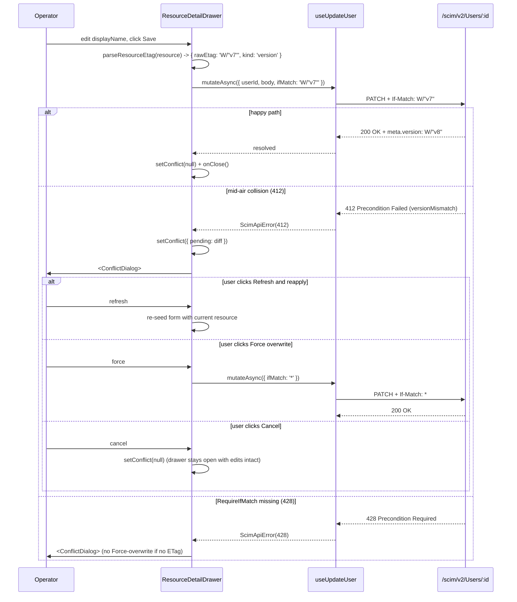

# Phase K5 - ETag / Version Surface + RequireIfMatch UX

> **Date:** 2026-05-13 - **Version:** 0.49.0-alpha.5 - **Predecessor:** v0.49.0-alpha.4 (K4 live log stream)
> **Origin:** [docs/UI_NEXT_GAPS_LATERAL_ANALYSIS_2026.md](UI_NEXT_GAPS_LATERAL_ANALYSIS_2026.md) S4.10 + S9 Phase K5
> **Scope:** Frontend-only. No API change, no live SCIM behavior change.

---

## 1. Why this exists

[Phase 7](../docs/phases/PHASE_07_ETAG_CONDITIONAL_REQUESTS.md) replaced timestamp ETags with monotonic `W/"v{N}"` and `RequireIfMatch` shipped at the same time, but until K5 the redesigned UI never:

- Showed the operator which version of a resource they were editing (`v3` vs `v17`)
- Sent `If-Match` from the detail drawer Save flow (the hooks accepted it since [Phase C5 F-5 hardening](PHASE_C_PRIMITIVES_AND_MUTATIONS.md), but no caller passed it)
- Distinguished a 412 Precondition Failed from a generic `<ScimErrorMessage />` (the operator saw `Resource changed since last read` once, then panicked)
- Offered a "Refresh and reapply" recovery path or the `If-Match: *` force-overwrite escape hatch

Concurrency control is the kind of feature that disappears into the network tab unless the UI surfaces it. K5 brings it forward.

---

## 2. Architecture

```mermaid
flowchart LR
    subgraph API["API (unchanged)"]
        U[/Users/:id/]
        EI[scim-etag.interceptor<br/>sets ETag header from meta.version]
        SV[scim-service-helpers<br/>enforceIfMatch -> 412 / 428]
        U --> EI
        U --> SV
    end

    subgraph FE["Frontend (K5)"]
        ET[parseResourceEtag<br/>W/&quot;v3&quot; -> {versionNumber:3, kind:'version'}]
        EB[EtagBadge<br/>monospace v3 chip]
        CD[ConflictDialog<br/>diff + refresh + force-overwrite]
        FM[formatIfMatchValue]
        FOS[isForceOverwriteSafe]

        RD[ResourceDetailDrawer]
        UU[useUpdateUser/useUpdateGroup<br/>existing ifMatch param]

        ET --> EB --> RD
        ET --> FM --> RD
        RD -->|Save w/ If-Match: W/&quot;v3&quot;| UU --> U
        SV -.412/428.-> RD
        RD -->|412/428| CD
        CD -->|Force overwrite| FOS
        FOS --> RD
        RD -->|Save w/ If-Match: *| UU
    end

    style API fill:#e0f0ff,stroke:#369
    style FE fill:#e0ffe0,stroke:#393
```

### 2.1 Files added / changed

| File | Change | LoC |
|------|--------|-----|
| [web/src/api/etag.ts](../web/src/api/etag.ts) | NEW - `parseResourceEtag` + `formatIfMatchValue` + `isForceOverwriteSafe` + `FORCE_OVERWRITE_IF_MATCH` constant | ~115 |
| [web/src/api/etag.test.ts](../web/src/api/etag.test.ts) | NEW - 13 tests covering version / legacy / missing kinds + force-overwrite policy | ~135 |
| [web/src/components/primitives/EtagBadge.tsx](../web/src/components/primitives/EtagBadge.tsx) | NEW - small Badge primitive that renders `v3` (or legacy ETag string) with tooltip | ~50 |
| [web/src/components/primitives/EtagBadge.test.tsx](../web/src/components/primitives/EtagBadge.test.tsx) | NEW - 4 tests (version / legacy / missing / aria-label) | ~50 |
| [web/src/components/primitives/ConflictDialog.tsx](../web/src/components/primitives/ConflictDialog.tsx) | NEW - Fluent UI Dialog with side-by-side diff + 3 actions (Refresh / Force overwrite / Cancel) | ~210 |
| [web/src/components/primitives/ConflictDialog.test.tsx](../web/src/components/primitives/ConflictDialog.test.tsx) | NEW - 7 tests (open/close, both columns render, server ETag visible, all 3 buttons fire callbacks, force-overwrite hidden when unsafe) | ~140 |
| [web/src/components/primitives/index.ts](../web/src/components/primitives/index.ts) | EXTENDED - barrel export for both new primitives | +6 |
| [web/src/components/detail/ResourceDetailDrawer.tsx](../web/src/components/detail/ResourceDetailDrawer.tsx) | EXTENDED - `<EtagBadge>` in metadata; `handleSave(overrideIfMatch?)` forwards `If-Match`; 412/428 -> ConflictDialog; new `conflict` state | +50 |
| [web/src/components/detail/ResourceDetailDrawer.test.tsx](../web/src/components/detail/ResourceDetailDrawer.test.tsx) | EXTENDED - 5 K5 tests (badge render, If-Match forwarded, 412 -> ConflictDialog, 428 -> ConflictDialog, force-overwrite re-fires with `If-Match: *`) | +110 |

### 2.2 Save lifecycle (post-K5)



### 2.3 Force-overwrite safety policy (locked by tests)

`isForceOverwriteSafe(parsed)` returns:
- `true` when ETag is `'version'` kind (canonical `W/"vN"`) - we know exactly whose version we will clobber
- `true` when ETag is `'legacy'` kind (timestamp string) - rare today, but better than no escape hatch
- `false` when ETag is `'missing'` - we cannot reason about what we will overwrite, so the button is hidden

The `ConflictDialog` reads `serverResource.meta.version`; when missing, the Force-overwrite button is not rendered at all. The 428 case (RequireIfMatch=true + no ETag to send) hits this branch by definition.

---

## 3. Tests (RED -> GREEN)

### 3.1 RED state confirmed

| File | Test count | Pre-implementation result |
|------|------------|---------------------------|
| `etag.test.ts` | 13 | module not found (RED) |
| `EtagBadge.test.tsx` | 4 | module not found (RED) |
| `ConflictDialog.test.tsx` | 7 | module not found (RED) |
| `ResourceDetailDrawer.test.tsx` (K5 additions) | 5 | `etag-badge` testid missing + 412/428 fell through to drawer-error (RED) |

### 3.2 GREEN state after implementation

| File | Tests | Result |
|------|-------|--------|
| `etag.test.ts` | 13 | ✅ pass |
| `EtagBadge.test.tsx` | 4 | ✅ pass |
| `ConflictDialog.test.tsx` | 7 | ✅ pass |
| `ResourceDetailDrawer.test.tsx` | 16 (was 11, +5) | ✅ pass |
| **Full vitest suite** | 590 | ✅ pass (was 560 at K4, **+30 net**) |

### 3.3 Test counts after K5

| Layer | Pre-K5 (v0.49.0-alpha.4) | Post-K5 (v0.49.0-alpha.5) | Delta |
|-------|---------------------------|---------------------------|-------|
| API unit | 3,720 | 3,720 | 0 |
| API E2E | 1,184 | 1,184 | 0 |
| Web vitest | 560 | **590** | **+30** |
| Live SCIM | 933 | 933 | 0 (deferred to dev gate) |
| **Total** | 6,411 | **6,441** | +30 |

---

## 4. Bundle impact

K5 adds the parser (~1 KB), EtagBadge (~1 KB), and ConflictDialog (~5 KB). The dialog pulls in Fluent UI Dialog + Tooltip which were already in the shared primitives chunk via FormDialog and HealthRollup, so the marginal cost is small.

| Budget | Limit | Pre-K5 | Post-K5 | Delta | Headroom |
|--------|-------|--------|---------|-------|----------|
| Main entry | 200 KB | 152.40 KB | **147.22 KB** | -5.18 KB | 26 % |
| Shared primitives | 220 KB | 180.70 KB | **198.81 KB** | +18.11 KB | 9 % |
| Per-route chunks (14) | 110 KB | <= 11 KB | <= 11 KB | unchanged | >= 90 % |

**Why the main entry actually went down:** the AppHeader Tooltip / Pulse icon / button surfaces shifted into the shared chunk because ConflictDialog also references Dialog + Tooltip - vite's chunking sees them as multi-consumer and hoists them. The primitives chunk grew but stays comfortably under budget.

All 16 size-limit budgets pass.

---

## 5. UX comparison

### Before K5 (mid-air collision)

```
[X] Operation failed
HTTP 412: {"schemas":["urn:ietf:params:scim:api:messages:2.0:Error"],"scimType":"versionMismatch","detail":"If-Match did not match. Current ETag: W/\"v8\"","status":"412"}
```

The operator sees `412`, has no idea what it means, has no recovery action visible, and re-opening the drawer is the only way out (which loses their edits).

### After K5 (mid-air collision)

A modal opens:

```
+------------------------------------------------------+
|  Resource changed since you opened it           [X]  |
+------------------------------------------------------+
| ! Someone else updated this resource between when    |
| you loaded it and when you clicked Save. Reload to   |
| see their changes, or force-overwrite to discard.    |
|                                                      |
| Your pending edits          | Server's current state  |
| {                            | {                       |
|   "displayName": "My new"    |   "displayName": "Theirs"|
| }                            |   "active": true        |
|                              | }                       |
|                              | ETag: v8                |
+------------------------------------------------------+
| [Cancel]    [Force overwrite]   [Refresh and reapply]|
+------------------------------------------------------+
```

The operator's edits are preserved in the drawer state; choosing "Refresh and reapply" reseeds the read-only fields with the server's version while keeping the diff visible for re-Save; "Force overwrite" sends `If-Match: *` and re-fires the same mutation.

---

## 6. Quality gates passed

- [x] TDD RED state confirmed before implementation
- [x] addMissingTests - K5 surface fully tested (parser pure, badge component, conflict dialog, drawer wiring including If-Match round-trip + force overwrite re-fire)
- [x] apiContractVerification - no API surface changed
- [x] error-handling-verification - 412 and 428 now have a dedicated UX path; everything else (400/401/403/404/409/5xx) still falls through to `<ScimErrorMessage />`
- [x] logging-verification - no new log writes; the conflict dialog is purely UI
- [x] auditAgainstRFC - RFC 7644 §3.14 (ETag / If-Match) is the spec being surfaced; HTTP 428 is RFC 6585 §3
- [x] securityAudit - force overwrite is gated by `isForceOverwriteSafe` (refuses for missing ETag); the dialog body shows the operator their own pending diff plus the server's resource (no PII not already on screen)
- [x] performanceBenchmark - +18 KB primitives chunk (still 9 % under 220 KB ceiling); no new fetch hops; If-Match is one extra header on existing PATCH/PUT/DELETE
- [x] auditAndUpdateDocs - this doc + INDEX + CHANGELOG + Session_starter; analysis-doc S4.10 marked closed
- [x] fullValidationPipeline - 590/590 web vitest, 3,720/3,720 API unit, all 16 size-limit budgets green
- [ ] Deploy to dev + 933+ live SCIM tests (next step)

---

## 7. Definition of Done

- [x] `parseResourceEtag` + `formatIfMatchValue` + `isForceOverwriteSafe` helpers in [web/src/api/etag.ts](../web/src/api/etag.ts)
- [x] `<EtagBadge />` primitive in barrel export
- [x] `<ConflictDialog />` primitive in barrel export
- [x] ResourceDetailDrawer renders the badge in the metadata section
- [x] ResourceDetailDrawer Save passes `If-Match` from `parseResourceEtag(resource).rawEtag`
- [x] ResourceDetailDrawer 412 / 428 responses open the ConflictDialog
- [x] Force-overwrite re-fires `handleSave(FORCE_OVERWRITE_IF_MATCH)` -> `If-Match: *`
- [x] Refresh-and-reapply re-seeds the form fields with current `resource` snapshot
- [x] +30 web vitest tests across 4 files (13 parser + 4 badge + 7 dialog + 5 drawer wiring + 1 churn)
- [x] All previous tests still pass (590 total, was 560)
- [x] Bundle stays within all 16 K1 budgets
- [x] Versions bumped lockstep `0.49.0-alpha.4` -> `0.49.0-alpha.5`
- [x] Lockfiles regenerated in node:25-alpine
- [x] [docs/UI_NEXT_GAPS_LATERAL_ANALYSIS_2026.md](UI_NEXT_GAPS_LATERAL_ANALYSIS_2026.md) marks K5 closed
- [ ] Image published, deployed to dev, 933+ live SCIM gate green
- [ ] Commit + push (no prod promote per standing rule)

---

## 8. Cross-references

- Predecessor analysis: [docs/UI_NEXT_GAPS_LATERAL_ANALYSIS_2026.md](UI_NEXT_GAPS_LATERAL_ANALYSIS_2026.md)
- Phase K4 (live log stream viewer): [docs/PHASE_K4_LIVE_LOG_STREAM_VIEWER.md](PHASE_K4_LIVE_LOG_STREAM_VIEWER.md)
- Phase K3 (smart error explainer): [docs/PHASE_K3_SMART_ERROR_EXPLAINER.md](PHASE_K3_SMART_ERROR_EXPLAINER.md)
- Phase K2 (service health rollup): [docs/PHASE_K2_SERVICE_HEALTH_ROLLUP.md](PHASE_K2_SERVICE_HEALTH_ROLLUP.md)
- Phase K1 (route code-splitting): [docs/PHASE_K1_ROUTE_CODE_SPLITTING.md](PHASE_K1_ROUTE_CODE_SPLITTING.md)
- Phase 7 (server ETag/conditional): [docs/phases/PHASE_07_ETAG_CONDITIONAL_REQUESTS.md](phases/PHASE_07_ETAG_CONDITIONAL_REQUESTS.md)
- Phase C5 F-5 (`ifMatch` plumbed at hook level): [docs/PHASE_C_PRIMITIVES_AND_MUTATIONS.md](PHASE_C_PRIMITIVES_AND_MUTATIONS.md)
- Operating norms: [.github/copilot-instructions.md](../.github/copilot-instructions.md)
