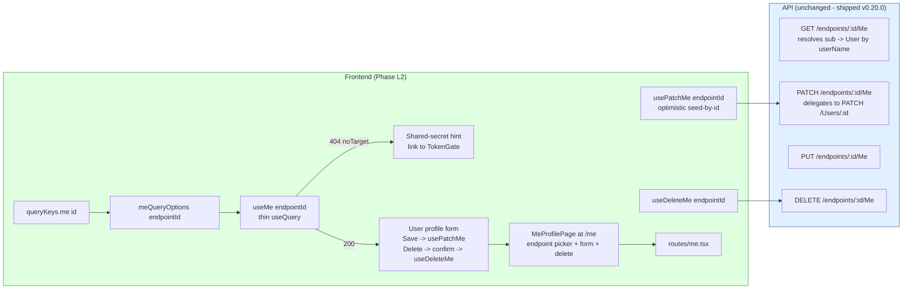
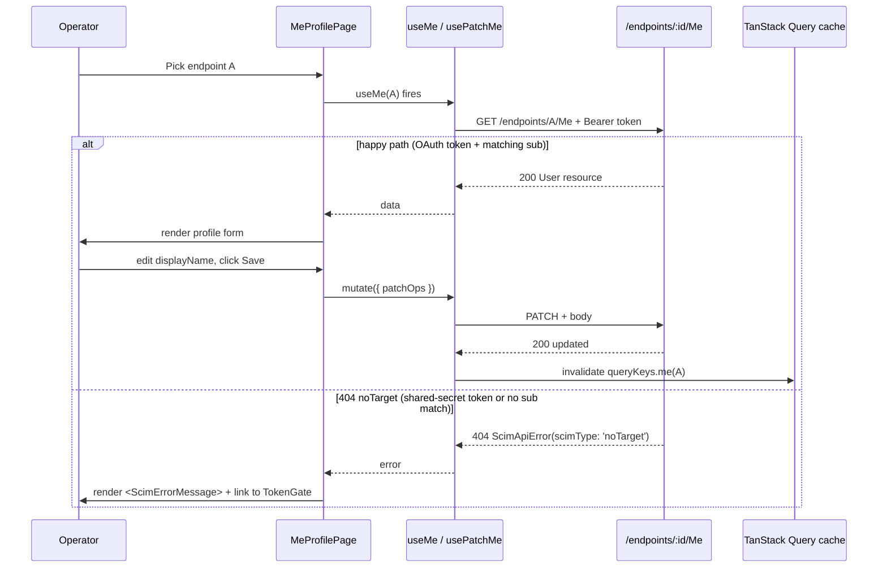

# Phase L2 - /Me Self-Service UI

> **Date:** 2026-05-13 - **Version:** 0.50.0-alpha.2 - **Predecessor:** v0.50.0-alpha.1 (Phase L1 Endpoint CRUD)
> **Origin:** [docs/UI_NEXT_GAPS_LATERAL_ANALYSIS_2026.md](UI_NEXT_GAPS_LATERAL_ANALYSIS_2026.md) S4.7
> **Scope:** Frontend-only. Adds 3 mutation/query hooks + 1 page + 1 route + a new live SCIM section `9z-AB`. Backend `/Me` HTTP surface (`GET / PUT / PATCH / DELETE /endpoints/:id/Me`) shipped in v0.20.0 and is exhaustively locked at unit + E2E layers.

---

## 1. Why this exists

[docs/UI_NEXT_GAPS_LATERAL_ANALYSIS_2026.md](UI_NEXT_GAPS_LATERAL_ANALYSIS_2026.md) S4.7 marks `/Me` as a Tier 1 Operational Completeness gap. The token holder cannot ask "what does the server think I am?" without curl. RFC 7644 S3.11 names `/Me` as a first-class self-service alias; today the redesigned UI never exposes it.

The gap is sharper than the analysis-doc described because of the auth model:

- `/scim/endpoints/:id/Me` requires **OAuth JWT authentication** with a `sub` claim that matches an existing User's `userName` (see [api/src/modules/scim/controllers/scim-me.controller.ts:101](../api/src/modules/scim/controllers/scim-me.controller.ts#L101))
- The K3 TokenGate stores a **shared-secret Bearer token** (not OAuth)
- So the operator's most common token will always return `404 noTarget` from `/Me`

L2 wires the surface AND surfaces the auth-model branch as first-class UX. The page works correctly for OAuth tokens (rare in current dev usage, normal in prod when [docs/G11_PER_ENDPOINT_CREDENTIALS.md](auth/G11_PER_ENDPOINT_CREDENTIALS.md) credentials issue JWTs with `sub`) and degrades gracefully to a "Switch to OAuth" hint for shared-secret tokens.

---

## 2. Architecture

### 2.1 Files added / changed

| File | Change | LoC |
|------|--------|-----|
| [web/src/api/queries.ts](../web/src/api/queries.ts) | EXTENDED - `queryKeys.me`, `meQueryOptions(endpointId)`, `useMe`, `usePatchMe`, `useDeleteMe` + `MeResource` type | ~95 |
| [web/src/api/mutations.test.ts](../web/src/api/mutations.test.ts) | EXTENDED - 6 new tests covering all 3 hooks (RED first) | ~110 |
| [web/src/pages/MeProfilePage.tsx](../web/src/pages/MeProfilePage.tsx) | NEW - endpoint picker + profile form + 404 fallback + delete-confirm | ~270 |
| [web/src/pages/MeProfilePage.test.tsx](../web/src/pages/MeProfilePage.test.tsx) | NEW - 7 tests covering endpoint picker + happy path + 404 fallback + edit + delete + ScimErrorMessage | ~200 |
| [web/src/routes/me.tsx](../web/src/routes/me.tsx) | NEW - TanStack route registration (lazy-loaded) | ~25 |
| [web/src/router.ts](../web/src/router.ts) | EXTENDED - register meRoute in route tree | +2 |
| [web/src/routes/lazy-routes.test.ts](../web/src/routes/lazy-routes.test.ts) | EXTENDED - lazy-routes contract entry for me.tsx | +1 |
| [web/src/test/size-limit-config.test.ts](../web/src/test/size-limit-config.test.ts) | EXTENDED - per-route budget contract for MeProfilePage | +1 |
| [web/package.json](../web/package.json) | EXTENDED - new size-limit budget entry | +6 |
| [web/src/layout/AppSidebar.tsx](../web/src/layout/AppSidebar.tsx) | EXTENDED - new `My profile` nav item | +5 |
| [scripts/live-test.ps1](../scripts/live-test.ps1) | EXTENDED - new SECTION `9z-AB` covering 404 + error shape + auth-model branch | ~70 |

### 2.2 Mutation lifecycle (post-L2)

---

## 3. Definition of Done (per-sub-phase quality gate)

| # | Gate | Status |
|---|------|:------:|
| 1 | TDD RED state confirmed for new hooks | [ ] |
| 2 | TDD GREEN state - new hook tests all pass | [ ] |
| 3 | TDD RED state confirmed for MeProfilePage | [ ] |
| 4 | TDD GREEN state - page tests all pass | [ ] |
| 5 | apiContractVerification - 404 noTarget shape locked at live layer | [ ] |
| 6 | error-handling-verification - 404 -> `<ScimErrorMessage />` chain locked | [ ] |
| 7 | logging-verification - existing `/Me` logging unchanged (no regression) | [ ] |
| 8 | auditAgainstRFC - RFC 7644 S3.11 - `/Me` is per-endpoint alias for current subject | [ ] |
| 9 | securityAudit - shared-secret token never reaches /Me happy path; 404 leaks no PII | [ ] |
| 10 | performanceBenchmark - bundle still under all 18+1 size-limit budgets | [ ] |
| 11 | auditAndUpdateDocs - INDEX.md, CHANGELOG.md, Session_starter.md, analysis-doc S4.7 all updated | [ ] |
| 12 | fullValidationPipeline - api unit + e2e + web vitest + size + lockfiles in node:25-alpine | [ ] |
| 13 | Live SCIM gate on dev: 942+ pass (was 940 at L1, +2 from new section 9z-AB) | [ ] |
| 14 | Prod promotion: NOT triggered (standing rule) | [ ] |

---

## 4. Estimated test deltas

| Layer | Pre-L2 | Post-L2 (target) | Delta |
|-------|-------:|-----------------:|------:|
| API unit | 3,720 | 3,720 | 0 |
| API E2E | 1,186 | 1,186 | 0 |
| Web vitest | 620 | **633** | +13 (6 hooks + 7 page) |
| Live SCIM | 940 | **942** | +2 (new 9z-AB section) |
| PowerShell contract | 14 | 14 | 0 |
| **Total** | 6,480 | **6,495** | **+15** |

---

## 5. Risk register

| ID | Risk | Likelihood | Impact | Mitigation |
|----|------|-----------|--------|------------|
| L2-R1 | Operator confused by 404 when using shared-secret token | High | Low | First-class fallback UX with explicit "OAuth required" copy + link to TokenGate |
| L2-R2 | DELETE /Me deactivates the operator's own admin user mid-session | Very low | Critical | Inline confirm-by-typing pattern (mirrors L1 DeleteEndpointDialog) |
| L2-R3 | PATCH succeeds but cached `me` invalidation fires before server commits | Low | Low | Standard onSettled invalidate; no optimistic merge (consistency over UX speed for self-service) |
| L2-R4 | OAuth happy path untested in dev (no OAuth flow wired) | Medium | Low | Live test asserts the 404 noTarget contract; happy path covered via vitest with MSW-style mock |
| L2-R5 | Endpoint picker drops a previously-picked endpoint after refresh | Low | Low | Picker state lives in URL `?endpoint=<id>` (Phase A pattern) |

---

## 6. Out of scope

- **OAuth login flow** - L2 assumes the operator already has an OAuth token (issued by [docs/G11_PER_ENDPOINT_CREDENTIALS.md](auth/G11_PER_ENDPOINT_CREDENTIALS.md) flows or external IdP). Wiring an OAuth client-credentials flow into TokenGate is a separate Phase N polish task.
- **Header dropdown widget** - the analysis doc S4.7 mentioned "dropdown beside the bell/theme icons -> My profile". L2 ships the page + sidebar nav; the header widget is deferred to Phase N6 keyboard ergonomics.
- **Multi-endpoint /Me view** - L2 picks one endpoint at a time. A "show my identity across all endpoints" aggregator is deferred to Phase L6 Operations cross-endpoint view.

---

## 7. Per-step quality gate sequence

1. Discover backend contract (DONE - [scim-me.controller.ts](../api/src/modules/scim/controllers/scim-me.controller.ts) + [scim-me.controller.spec.ts](../api/src/modules/scim/controllers/scim-me.controller.spec.ts))
2. Create this doc with DoD checklist
3. RED: hook tests for `useMe`, `usePatchMe`, `useDeleteMe` in [mutations.test.ts](../web/src/api/mutations.test.ts)
4. GREEN: implement the 3 hooks + types + queryKeys
5. RED: MeProfilePage tests (endpoint picker + happy + 404 + edit + delete)
6. GREEN: implement MeProfilePage + new route + sidebar nav entry
7. Add new live section `9z-AB` (404 noTarget + error shape + auth-model branch)
8. Bundle check: vite build + size-limit (19 budgets including the new one)
9. Update INDEX.md + CHANGELOG.md + Session_starter.md + close S4.7 in analysis-doc
10. Bump versions lockstep `0.50.0-alpha.1` -> `0.50.0-alpha.2`
11. Regenerate lockfiles in `node:25-alpine`
12. Commit + push (no em-dashes)
13. Trigger publish workflow `gh workflow run 233403154 --ref feat/ui -f version=0.50.0-alpha.2`
14. Deploy via [scripts/deploy-dev.ps1](../scripts/deploy-dev.ps1)
15. Live SCIM gate: 942+ pass (gate 13 of 14)
16. Mark DoD complete; PROD NOT promoted per standing rule
