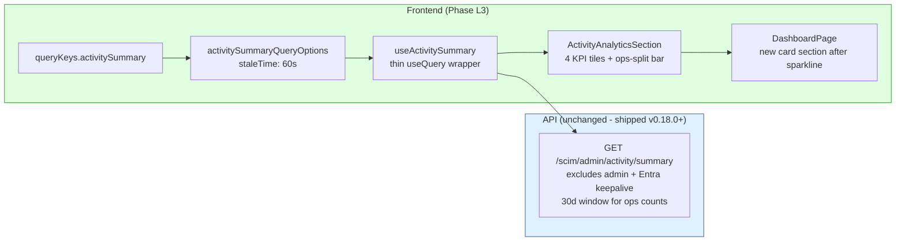

# Phase L3 - Activity Analytics Dashboard

> **Date:** 2026-05-13 - **Version:** 0.50.0-alpha.3 - **Predecessor:** v0.50.0-alpha.2 (Phase L2 /Me self-service)
> **Origin:** [docs/UI_NEXT_GAPS_LATERAL_ANALYSIS_2026.md](UI_NEXT_GAPS_LATERAL_ANALYSIS_2026.md) S4.6
> **Scope:** Frontend-only. Wires the already-shipped `GET /scim/admin/activity/summary` (v0.18.0+) into the redesigned UI as a new Activity Analytics card section on DashboardPage. Adds 1 new query hook + 1 contract live test section. No backend change.

---

## 1. Why this exists

[docs/UI_NEXT_GAPS_LATERAL_ANALYSIS_2026.md](UI_NEXT_GAPS_LATERAL_ANALYSIS_2026.md) S4.6 names `/admin/activity/summary` as a Tier 1 Operational Completeness gap. The endpoint ships aggregations (last 24h, last week, user ops 30d, group ops 30d) - the dashboard today shows only the live activity row stream and `requestsLast24hSeries` sparkline, never the rolled-up counts the operator wants at a glance.

L3 closes the gap pragmatically without scope-creeping into latency-percentile territory:

- **In scope (this commit):** wire the existing `/admin/activity/summary` shape into a new analytics card section on DashboardPage. 4 new KPI tiles + 1 horizontal split bar (users vs groups op share over the last 30d).
- **Out of scope (deferred to Phase N polish):** p50/p95/p99 latency lines, drill-down navigation from chart-slice to filtered LogsPage, time range picker (the backend exposes only the 4 hardcoded windows; a flexible time-range view requires a new endpoint or a different aggregator strategy).

This is the right cut: ship the data the server already produces, defer the data the server doesn't.

---

## 2. Architecture



### 2.1 Backend response shape (locked at live layer)

```jsonc
{
  "summary": {
    "last24Hours": 42,    // non-admin + non-keepalive RequestLog count over 24h
    "lastWeek": 318,      // non-admin + non-keepalive RequestLog count over 7d
    "operations": {
      "users":  142,      // /Users URL hits over 30d
      "groups": 18        // /Groups URL hits over 30d
    }
  }
}
```

### 2.2 Files added / changed

| File | Change | LoC |
|------|--------|-----|
| [web/src/api/queries.ts](../web/src/api/queries.ts) | EXTENDED - `queryKeys.activitySummary`, `ActivitySummaryResponse` type, `activitySummaryQueryOptions`, `useActivitySummary` hook | ~45 |
| [web/src/api/mutations.test.ts](../web/src/api/mutations.test.ts) | EXTENDED - 3 new tests (queryKeys + URL contract + happy path) | ~55 |
| [web/src/pages/DashboardPage.tsx](../web/src/pages/DashboardPage.tsx) | EXTENDED - new `<ActivityAnalyticsSection />` rendered after the sparkline card | +95 |
| [web/src/pages/DashboardPage.test.tsx](../web/src/pages/DashboardPage.test.tsx) | EXTENDED - 4 new tests (analytics section renders + 4 KPIs + ops split + handles empty data) | +95 |
| [scripts/live-test.ps1](../scripts/live-test.ps1) | EXTENDED - new SECTION `9z-AC` covering response shape + key allowlist | ~70 |

---

## 3. Definition of Done

| # | Gate | Status |
|---|------|:------:|
| 1 | TDD RED state confirmed for `useActivitySummary` | [ ] |
| 2 | TDD GREEN state - hook tests pass | [ ] |
| 3 | TDD RED state confirmed for ActivityAnalyticsSection | [ ] |
| 4 | TDD GREEN state - DashboardPage tests pass | [ ] |
| 5 | apiContractVerification - response key allowlist locked at live layer | [ ] |
| 6 | error-handling-verification - 404/500 fall through to existing dashboard error block | [ ] |
| 7 | logging-verification - existing /admin/activity/summary logging unchanged | [ ] |
| 8 | auditAgainstRFC - aggregation excludes admin URLs + Entra keepalive (existing backend behavior) | [ ] |
| 9 | securityAudit - response carries no PII (counts only) | [ ] |
| 10 | performanceBenchmark - bundle still under all 19 size-limit budgets | [ ] |
| 11 | auditAndUpdateDocs - INDEX.md, CHANGELOG.md, Session_starter.md, analysis-doc S4.6 all updated | [ ] |
| 12 | fullValidationPipeline - api unit + e2e + web vitest + size + lockfiles in node:25-alpine | [ ] |
| 13 | Live SCIM gate on dev: 952+ pass (was 948 at L2, +4 from new section 9z-AC) | [ ] |
| 14 | Prod promotion: NOT triggered (standing rule) | [ ] |

---

## 4. Estimated test deltas

| Layer | Pre-L3 | Post-L3 (target) | Delta |
|-------|-------:|-----------------:|------:|
| API unit | 3,720 | 3,720 | 0 |
| API E2E | 1,186 | 1,186 | 0 |
| Web vitest | 637 | **644** | +7 (3 hook + 4 page) |
| Live SCIM | 948 | **952** | +4 (new 9z-AC section) |
| PowerShell contract | 14 | 14 | 0 |
| **Total** | 6,505 | **6,516** | **+11** |

---

## 5. Risk register

| ID | Risk | Likelihood | Impact | Mitigation |
|----|------|-----------|--------|------------|
| L3-R1 | Dashboard renders zero counts when in-memory backend is in use | High | Low | Backend already returns zeroed summary in inmemory mode (read activity.controller.ts:177); UI handles 0 gracefully |
| L3-R2 | Operator confused by 30d window for ops counts vs 24h/7d for activity counts | Medium | Low | Per-tile caption text spells out the window explicitly |
| L3-R3 | Bundle regression from analytics section | Low | Low | size-limit gate; main entry budget has 26% headroom |
| L3-R4 | Aggregation performance hits PG burstable tiers | Low | Low | Backend already bounds 30d window (existing behavior, not new) |

---

## 6. Per-step quality gate sequence

1. Discover backend contract (DONE - [activity.controller.ts:175](../api/src/modules/activity-parser/activity.controller.ts#L175))
2. Create this doc
3. RED: hook tests + component tests
4. GREEN: implement hook + section
5. Add live section 9z-AC
6. Bundle check (vite build + size-limit, 19 budgets)
7. Update INDEX.md + CHANGELOG.md + Session_starter.md + close S4.6 in analysis-doc
8. Bump versions lockstep `0.50.0-alpha.2` -> `0.50.0-alpha.3`
9. Lockfiles in `node:25-alpine`
10. Commit + push + publish workflow
11. Deploy to dev
12. Live SCIM gate: 952+ pass
13. PROD NOT promoted per standing rule
