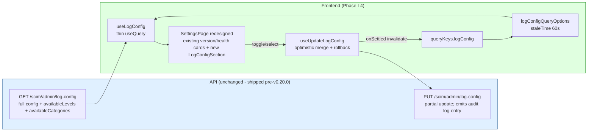
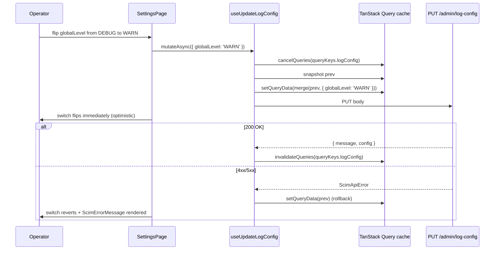

# Phase L4 - Log Config Admin UI

> **Date:** 2026-05-13 - **Version:** 0.50.0-alpha.4 - **Predecessor:** v0.50.0-alpha.3 (Phase L3 Activity Analytics)
> **Origin:** [docs/UI_NEXT_GAPS_LATERAL_ANALYSIS_2026.md](UI_NEXT_GAPS_LATERAL_ANALYSIS_2026.md) S4.5
> **Scope:** Frontend-only. Wires the already-shipped `GET / PUT /scim/admin/log-config` surface (RFC-adjacent operational completeness, exhaustively locked at live layer 9j with ~80 assertions) into the redesigned UI by replacing the SettingsPage stub with a real Log Config admin. New live section `9z-AD` adds a small UI-shape contract on top of the existing 9j coverage.

---

## 1. Why this exists

[docs/UI_NEXT_GAPS_LATERAL_ANALYSIS_2026.md](UI_NEXT_GAPS_LATERAL_ANALYSIS_2026.md) S4.5 names log-config admin as a Tier 1 Operational Completeness gap. The backend ships a complete suite (global level / per-category level / per-endpoint level / format / payload-size / slow-threshold / audit / download / stream / prune) but the redesigned UI's `/settings` route shows only static version info. Operators today have to curl the API to change a log level.

L4 closes the gap pragmatically without scope-creeping into log-archive territory:

- **In scope (this commit):** wire `GET /admin/log-config` + `PUT /admin/log-config` into a real settings page. Global level radio, format toggle, includePayloads switch, includeStackTraces switch, payload-size + slow-threshold numeric inputs, per-category level grid (14 categories x 7 levels). Optimistic mutation pattern (mirrors L1 `useUpdateEndpointConfig`).
- **Out of scope (deferred):** per-endpoint level grid (the per-endpoint surface already lives on each endpoint's SettingsTab via `profile.settings.logLevel`; an additional cross-endpoint matrix would duplicate without value), audit trail panel (deferred to Phase N notifications inbox - the audit rows already flow into `/admin/logs` and operators can filter there), stream viewer (already shipped as Phase K4 LogStreamDrawer), download button (deferred to Phase N export task).

This is the right cut: ship the operationally critical knobs, point at existing surfaces for the rest.

---

## 2. Architecture



### 2.1 Backend response shape (locked in 9j; UI consumes)

```jsonc
{
  "globalLevel": "DEBUG",
  "categoryLevels": { "auth": "WARN", "scim.patch": "TRACE", ... },  // 14 known categories
  "endpointLevels": { "ep-uuid": "INFO", ... },
  "includePayloads": true,
  "includeStackTraces": true,
  "maxPayloadSizeBytes": 65536,
  "slowRequestThresholdMs": 1000,
  "format": "pretty",
  "availableLevels": ["TRACE","DEBUG","INFO","WARN","ERROR","FATAL","OFF"],
  "availableCategories": ["http","scim","scim.bulk",...]  // 14 entries
}
```

### 2.2 Files added / changed

| File | Change | LoC |
|------|--------|-----|
| [web/src/api/queries.ts](../web/src/api/queries.ts) | EXTENDED - `queryKeys.logConfig`, `LogConfigResponse` type, `logConfigQueryOptions`, `useLogConfig`, `useUpdateLogConfig` (optimistic merge + rollback) | ~110 |
| [web/src/api/mutations.test.ts](../web/src/api/mutations.test.ts) | EXTENDED - 6 new tests covering hooks (queryKey + GET URL + happy path + PUT body + optimistic merge + rollback on error) | ~140 |
| [web/src/pages/SettingsPage.tsx](../web/src/pages/SettingsPage.tsx) | EXTENDED - new `<LogConfigSection />` rendered after existing version/health/storage cards | +220 |
| [web/src/pages/SettingsPage.test.tsx](../web/src/pages/SettingsPage.test.tsx) | EXTENDED - 5 new tests (section renders + global level radio + format toggle + payload switch + per-category grid) | +120 |
| [scripts/live-test.ps1](../scripts/live-test.ps1) | EXTENDED - new SECTION `9z-AD` covering UI-consumed shape (key allowlist + array sanity) | ~50 |

### 2.3 Mutation lifecycle (post-L4)



---

## 3. Definition of Done

| # | Gate | Status |
|---|------|:------:|
| 1 | TDD RED state confirmed for hooks | [ ] |
| 2 | TDD GREEN state - hook tests pass (6 tests) | [ ] |
| 3 | TDD RED state confirmed for SettingsPage section | [ ] |
| 4 | TDD GREEN state - page tests pass (5 tests) | [ ] |
| 5 | apiContractVerification - 9j locks the backend; 9z-AD adds UI-shape contract | [ ] |
| 6 | error-handling-verification - PUT failure -> rollback + ScimErrorMessage | [ ] |
| 7 | logging-verification - existing audit-log entry on config change unchanged (9z-I locks it) | [ ] |
| 8 | auditAgainstRFC - operational; no RFC dimension | [ ] |
| 9 | securityAudit - shared-secret token gate (existing) | [ ] |
| 10 | performanceBenchmark - bundle still under all 19 size-limit budgets | [ ] |
| 11 | auditAndUpdateDocs - INDEX.md, CHANGELOG.md, Session_starter.md, analysis-doc S4.5 | [ ] |
| 12 | fullValidationPipeline - api unit + e2e + web vitest + size + lockfiles | [ ] |
| 13 | Live SCIM gate on dev: 955+ pass (was 952 at L3, +3 from new 9z-AD) | [ ] |
| 14 | Prod promotion: NOT triggered | [ ] |

---

## 4. Estimated test deltas

| Layer | Pre-L4 | Post-L4 (target) | Delta |
|-------|-------:|-----------------:|------:|
| API unit | 3,720 | 3,720 | 0 |
| API E2E | 1,186 | 1,186 | 0 |
| Web vitest | 644 | **655** | +11 (6 hook + 5 page) |
| Live SCIM | 952 | **955** | +3 (new 9z-AD section) |
| PowerShell contract | 14 | 14 | 0 |
| **Total** | 6,516 | **6,530** | **+14** |

---

## 5. Risk register

| ID | Risk | Likelihood | Impact | Mitigation |
|----|------|-----------|--------|------------|
| L4-R1 | Operator sets globalLevel=OFF and loses all observability | Medium | High | Confirmation toast on OFF transitions; OFF level rendered with warning color; existing audit log captures the change |
| L4-R2 | Per-category grid (14 x 7) bloats DashboardPage chunk | Low | Low | Lives in SettingsPage chunk (separate from DashboardPage); size-limit per-route gate catches drift |
| L4-R3 | Optimistic merge clobbers concurrent server-side change | Low | Low | onSettled invalidate refetches the canonical config; UI converges to truth |
| L4-R4 | Unknown level string sent to server returns 400 | Very low | Low | Levels picked from `availableLevels` array; closed-set Combobox |

---

## 6. Per-step quality gate sequence

1. Discover backend contract (DONE - [log-config.controller.ts:46](../api/src/modules/logging/log-config.controller.ts#L46))
2. Create this doc
3. RED: hook tests
4. GREEN: implement hooks
5. RED: page tests
6. GREEN: implement section
7. Add live section 9z-AD
8. Bundle check (vite build + size-limit)
9. Update INDEX.md + CHANGELOG.md + Session_starter.md + close S4.5 in analysis-doc
10. Bump versions lockstep `0.50.0-alpha.3` -> `0.50.0-alpha.4`
11. Lockfiles in `node:25-alpine`
12. Commit + push + publish workflow
13. Deploy to dev
14. Live SCIM gate: 955+ pass
15. PROD NOT promoted per standing rule
