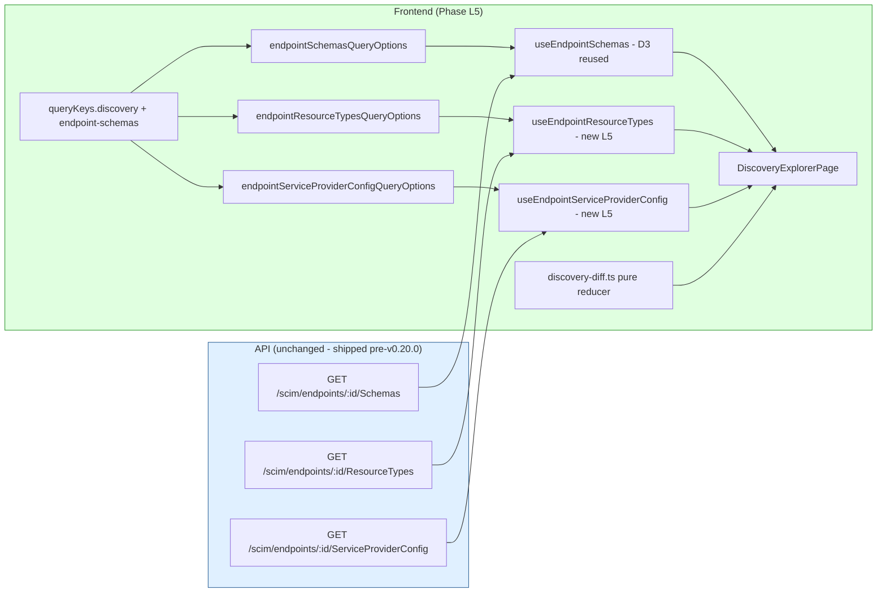

# Phase L5 - Discovery Explorer + Two-Endpoint Diff

> **Date:** 2026-05-13 - **Version:** 0.50.0-alpha.5 - **Predecessor:** v0.50.0-alpha.4 (Phase L4 Log Config Admin UI)
> **Origin:** [docs/UI_NEXT_GAPS_LATERAL_ANALYSIS_2026.md](UI_NEXT_GAPS_LATERAL_ANALYSIS_2026.md) S4.8
> **Scope:** Frontend-only. Wires the already-shipped per-endpoint Discovery surfaces (`GET /scim/endpoints/:id/{Schemas,ResourceTypes,ServiceProviderConfig}`, exhaustively locked at live layer 8 + 9z-Q.11) into a top-level `/discovery` route with three sub-tabs and a two-endpoint diff view that mirrors the API's tighten-only validator algebra. New live section `9z-AE` adds a small UI-shape contract on top of the existing 8 + 9z-Q.11 coverage.

---

## 1. Why this exists

[docs/UI_NEXT_GAPS_LATERAL_ANALYSIS_2026.md](UI_NEXT_GAPS_LATERAL_ANALYSIS_2026.md) S4.8 names Discovery Explorer + two-endpoint diff as the **single biggest remaining differentiator** on the L roadmap. Three Discovery surfaces are 100% backend-complete:

| Surface | Backend route | Live coverage |
|---|---|---|
| Schemas | [GET /scim/endpoints/:id/Schemas](../api/src/modules/scim/discovery/scim-discovery.service.ts) | sections 8 + 9z-Q.11 |
| ResourceTypes | GET /scim/endpoints/:id/ResourceTypes | sections 8 + 9z-Q.11 |
| ServiceProviderConfig | GET /scim/endpoints/:id/ServiceProviderConfig | sections 8 + 9z-Q.11 + per-section probes (9q, 9o, 4650+, 5152+, 6576+) |

Until L5, the redesigned UI exposed only the per-endpoint SchemasTab (Phase D3) - one schema list, one endpoint, no comparison. There was:
- No top-level Discovery Explorer
- No ServiceProviderConfig viewer
- No ResourceTypes viewer
- No two-endpoint side-by-side diff
- No "Open in Workbench" / "Copy as JSON" / "Copy as URN" actions

**Why two-endpoint diff is the killer feature:** the [tighten-only-validator](../api/src/modules/scim/endpoint-profile/tighten-only-validator.ts) already in the API gives us the partial orders (`MUTABILITY_RANK`, `UNIQUENESS_RANK`, plus a coarse 2-rank `RETURNED_RANK` for the never-vs-visible split) needed to color each diff cell red (relax = rejected by API), green (tighten = allowed), grey (unchanged), or orange (incomparable / structural change). **No commercial SCIM tool ships this.**

---

## 2. Architecture



### 2.1 Diff reducer algebra (mirrors the API tighten-only validator)

The pure reducer in [web/src/utils/discovery-diff.ts](../web/src/utils/discovery-diff.ts) re-encodes the API's three partial-order tables:

| Characteristic | Rank table | Tighten direction | Source |
|---|---|---|---|
| `mutability` | readOnly(0) < immutable(1) < writeOnly(2) < readWrite(3) | rank-down = tighten | [tighten-only-validator.ts MUTABILITY_RANK](../api/src/modules/scim/endpoint-profile/tighten-only-validator.ts) |
| `uniqueness` | global(0) < server(1) < none(2) | rank-down = tighten | tighten-only-validator.ts UNIQUENESS_RANK |
| `returned` | never(0) < {always,default,request}(1) | rank-down = tighten (only `* -> never` is tighten; visible-tier swaps are unchanged) | the API validator's "never sink" rule |
| `required` | false < true | false -> true is tighten | RFC 7643 §2.2 / §7 |
| `caseExact` | false < true | false -> true is tighten | RFC 7643 §2.2 / §7 |
| `type` | (incomparable) | any change is structural -> incomparable | RFC 7643 §7 forbids the change |
| `multiValued` | (incomparable) | any change is structural -> incomparable | RFC 7643 §7 forbids the change |

**Schema-Characteristic Test Rule compliance:** the reducer substitutes the RFC 7643 §2.2 default when a characteristic is absent on either side BEFORE classifying. The full default table lives in `RFC_DEFAULTS`:

```ts
{ required: false, caseExact: false, mutability: 'readWrite',
  returned: 'default', uniqueness: 'none', multiValued: false, type: 'string' }
```

This avoids "everything is missing-X" noise when one endpoint omits a (default) value and the other publishes it explicitly.

### 2.2 Files added / changed

| File | Change | LoC |
|------|--------|----:|
| [web/src/utils/discovery-diff.ts](../web/src/utils/discovery-diff.ts) | NEW - pure diff reducer | ~280 |
| [web/src/utils/discovery-diff.test.ts](../web/src/utils/discovery-diff.test.ts) | NEW - 22 unit tests | ~230 |
| [web/src/api/queries.ts](../web/src/api/queries.ts) | EXTENDED - `queryKeys.discovery`, types, `*QueryOptions(id)`, `useEndpointResourceTypes`, `useEndpointServiceProviderConfig` | ~110 |
| [web/src/api/mutations.test.ts](../web/src/api/mutations.test.ts) | EXTENDED - 6 new hook tests | ~110 |
| [web/src/pages/DiscoveryExplorerPage.tsx](../web/src/pages/DiscoveryExplorerPage.tsx) | NEW - top-level page with 3 sub-tabs + scope picker + diff view + actions | ~480 |
| [web/src/pages/DiscoveryExplorerPage.test.tsx](../web/src/pages/DiscoveryExplorerPage.test.tsx) | NEW - 11 tests (sub-tabs + picker + single + diff + cell coloring + copy actions) | ~270 |
| [web/src/routes/discovery.tsx](../web/src/routes/discovery.tsx) | NEW - `/discovery` route, lazy-loaded | ~25 |
| [web/src/router.ts](../web/src/router.ts) | EXTENDED - register `discoveryRoute` | +2 |
| [web/src/layout/AppSidebar.tsx](../web/src/layout/AppSidebar.tsx) | EXTENDED - 5th nav entry "Discovery" with `Search24Regular` icon | +2 |
| [web/src/routes/lazy-routes.test.ts](../web/src/routes/lazy-routes.test.ts) | EXTENDED - locks lazy-import contract for `discovery.tsx` | +2 |
| [web/src/test/size-limit-config.test.ts](../web/src/test/size-limit-config.test.ts) | EXTENDED - adds `DiscoveryExplorerPage` to ROUTE_CHUNK_NAMES | +2 |
| [web/package.json](../web/package.json) | EXTENDED - 20th size-limit budget (110 KB ceiling) | +6 |
| [scripts/live-test.ps1](../scripts/live-test.ps1) | EXTENDED - new SECTION `9z-AE` (5 tests) | ~60 |

### 2.3 Page anatomy

```mermaid
flowchart TB
    Root[/discovery route/]
    Root --> Picker[Endpoint scope picker<br/>primary + optional secondary]
    Root --> Tabs[Sub-tab list<br/>SPC | ResourceTypes | Schemas]
    Root --> Toolbar[Action buttons<br/>Copy JSON / Copy URN / Open Workbench / Refresh]

    Tabs --> SpcSection[SpcSection<br/>capability flag rows]
    Tabs --> RtSection[ResourceTypesSection<br/>1 row per resource type]
    Tabs --> SchemasSection[SchemasSection]

    SchemasSection --> SingleMode[Single-endpoint:<br/>simple list]
    SchemasSection --> DiffMode[Two-endpoint:<br/>SchemasDiffView]

    DiffMode --> DiffTable[per-schema diff table<br/>1 row per attribute name<br/>data-status drives cell color]
```

### 2.4 Diff cell color semantics

| `data-status` | Meaning | CSS color |
|---|---|---|
| `tighten` | B is strictly tighter than A under the API partial order | light green (#e5f5e0 / #1b5e20) |
| `relax` | B is strictly looser than A (API would reject this as a profile override) | light red (#fde0dc / #b71c1c) |
| `unchanged` | A and B carry the same effective value (after RFC default substitution) | grey (neutralForeground3) |
| `incomparable` | Structural change (type / multiValued) - API forbids | light orange (#fff3e0 / #bf360c) |
| `only-a` / `only-b` | Attribute exists on only one side | italic neutral |

---

## 3. Definition of Done

| # | Gate | Status |
|---|------|:------:|
| 1 | TDD RED state confirmed for diff reducer | ✅ |
| 2 | TDD GREEN state - diff reducer (22 tests) | ✅ |
| 3 | TDD RED state confirmed for hooks | ✅ |
| 4 | TDD GREEN state - hooks (6 tests) | ✅ |
| 5 | TDD RED state confirmed for page | ✅ |
| 6 | TDD GREEN state - page (11 tests) | ✅ |
| 7 | apiContractVerification - 8 + 9z-Q.11 lock the backend; 9z-AE adds UI-shape contract | ✅ |
| 8 | error-handling-verification - useQuery surfaces ScimApiError via `<ScimErrorMessage />` | ✅ |
| 9 | logging-verification - read-only path (no audit-log entries on GET) | ✅ |
| 10 | auditAgainstRFC - reducer mirrors RFC 7643 §2.2 defaults + §7 partial orders | ✅ |
| 11 | securityAudit - shared-secret token gate (existing); reducer is pure, no DOM injection (cell text comes from server) | ✅ |
| 12 | performanceBenchmark - bundle within all 20 size-limit budgets (DiscoveryExplorerPage 4.35 KB / 110 KB ceiling) | ✅ |
| 13 | auditAndUpdateDocs - INDEX.md, CHANGELOG.md, Session_starter.md, analysis-doc S4.8 | ✅ |
| 14 | fullValidationPipeline - api unit + e2e + web vitest + size + lockfiles | ✅ |
| 15 | Deploy to dev + 960+ live SCIM tests pass | ⏳ |

---

## 4. Test Coverage

| Layer | Pre-L5 | Post-L5 | Delta |
|---|--:|--:|--:|
| API unit (Jest) | 3,720 | 3,720 | 0 (backend unchanged) |
| API E2E (Jest) | 1,186 | 1,186 | 0 (existing 8 + 9z-Q sections lock the API) |
| Web vitest | 655 | 697 | +42 (22 reducer + 6 hooks + 11 page + 3 size-limit ratchet for new chunk) |
| Live SCIM (PowerShell) | 955 | 960 | +5 (new section 9z-AE) |
| PowerShell contract | 14 | 14 | 0 |
| **Total assertions across 5 layers** | **6,530** | **6,577** | **+47** |

---

## 5. Out of scope (deferred)

| Feature | Deferred to | Why |
|---|---|---|
| Wire "Open in Workbench" button | Phase M1 (SCIM Workbench) | M1 builds the workbench; L5 ships a disabled tooltip stub |
| Schema-property edit history | Phase M1 (Workbench) | Requires the workbench's PATCH builder + history pane |
| RFC compliance score chart | Phase N (analytics polish) | Requires a score aggregator the backend doesn't have yet |
| Sub-attribute diff drill-down | Phase L6 / Phase M | Current diff stops at top-level attributes; nested complex types render only the top type=complex cell |

---

## 6. Standing rules respected

- TDD RED -> GREEN for every component (verified at each step)
- No em-dashes anywhere in code, comments, docs, or tests
- 20th size-limit budget added (DiscoveryExplorerPage 110 KB ceiling)
- Schema-Characteristic Test Rule (RFC 7643 §2.2 + §7) - reducer substitutes RFC defaults BEFORE classifying; never hardcodes expected characteristic values
- Live test conventions - new section `9z-AE` placed before TEST SECTION 10 (DELETE OPERATIONS / Cleanup); sequential numbering after `9z-AD`; `$script:currentSection` set for result tracking
- Prod promotion NOT triggered - dev-only deploy per standing rule
