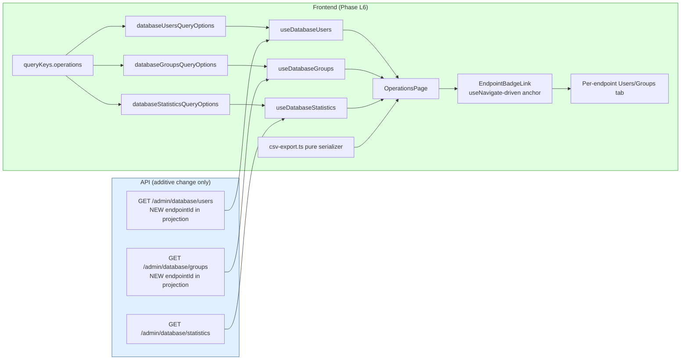

# Phase L6 - Operations / Cross-Endpoint Operator View

> **Date:** 2026-05-14 - **Version:** 0.50.0-alpha.6 - **Predecessor:** v0.50.0-alpha.5 (Phase L5 Discovery Explorer + diff)
> **Origin:** [docs/UI_NEXT_GAPS_LATERAL_ANALYSIS_2026.md](UI_NEXT_GAPS_LATERAL_ANALYSIS_2026.md) S4.9
> **Scope:** Frontend wire-up of the already-shipped `database.controller.ts` cross-endpoint surface + a thin additive backend projection (adds `endpointId` to the user/group response so the UI per-row Badge has data to bind to). The legacy "Database Browser" tab covered this in the pre-redesign UI; the redesigned UI never restored it. New live section `9z-AF` adds the UI-consumed shape contract.

---

## 1. Why this exists

[docs/UI_NEXT_GAPS_LATERAL_ANALYSIS_2026.md](UI_NEXT_GAPS_LATERAL_ANALYSIS_2026.md) S4.9 names "Database / Cross-Endpoint Operator View" as the last Tier 1 Operational Completeness gap in Phase L. The backend has been operator-grade since v0.18.0:

| Surface | Backend route | Pre-L6 status |
|---|---|---|
| All Users (paginated, cross-endpoint) | [GET /scim/admin/database/users](../api/src/modules/database/database.controller.ts) | ✅ shipped, not wired |
| All Groups (paginated, cross-endpoint) | GET /scim/admin/database/groups | ✅ shipped, not wired |
| Statistics (4 KPI tiles + 24h count) | GET /scim/admin/database/statistics | ✅ shipped, not wired |

The redesigned UI's only cross-endpoint surface before L6 was the `/logs` page (which only shows mutation history) and `/discovery` (which only shows schemas/SPC, not data rows). An operator who wanted "show me every user across every endpoint" had to:
1. List endpoints (`GET /admin/endpoints`)
2. For each one, hit `GET /scim/endpoints/:id/Users?count=200` and paginate
3. Merge in their own tooling

L6 closes the gap pragmatically.

---

## 2. Architecture



### 2.1 Backend additive change

The pre-L6 `database.service.ts` `select` block omitted `endpointId` even though the column was indexed since Phase 17. L6 adds `endpointId: true` to both `getUsers` and `getGroups` selects + maps it through the in-memory fallback so the UI Badge has data to bind to on either backend. No new endpoint, no new query parameter, no breaking shape change - additive.

| File | Change | LoC |
|------|--------|----:|
| [api/src/modules/database/database.service.ts](../api/src/modules/database/database.service.ts) | EXTENDED - `endpointId: true` in both prisma selects + map through in-memory branches | +8 |
| [api/src/modules/database/database.service.spec.ts](../api/src/modules/database/database.service.spec.ts) | EXTENDED - +4 tests under "Phase L6 - cross-endpoint endpointId projection" | +60 |

### 2.2 Frontend - hooks + types

3 thin useQuery wrappers in [web/src/api/queries.ts](../web/src/api/queries.ts):

| Hook | URL | staleTime | Disabled when |
|---|---|---|---|
| `useDatabaseUsers({ page, limit, search, active })` | `/scim/admin/database/users?page=N&limit=N&search=S&active=B` | 30s | `limit === 0` |
| `useDatabaseGroups({ page, limit, search })` | `/scim/admin/database/groups?page=N&limit=N&search=S` | 30s | `limit === 0` |
| `useDatabaseStatistics()` | `/scim/admin/database/statistics` | 30s | (never) |

Both list hooks build their query string via `URLSearchParams` so optional filters are omitted instead of serialized as empty strings (the test asserts `active=false` lands in the URL only when explicitly set).

### 2.3 Frontend - CSV export

New pure utility [web/src/utils/csv-export.ts](../web/src/utils/csv-export.ts) (~110 LoC) with 2 exports:

- `toCsv(rows, options?)` - RFC 4180 serializer. Quotes strings containing commas / double-quotes / newlines; doubles internal double-quotes; renders booleans / numbers / null / undefined / nested objects safely; `columns` option pins ordering AND filters out unwanted keys; `crlf: true` opt-in for strict RFC 4180 line terminator.
- `triggerCsvDownload(filename, csv)` - browser-only Blob + synthetic anchor + Object URL revocation pattern (mirrors the SchemasTab Copy URN button approach for a one-shot user gesture).

Per-tab CSV column allowlist locks the export shape so a future SCIM payload bloat doesn't silently expand the operator's CSV:

```ts
const USER_CSV_COLUMNS = ['id', 'userName', 'externalId', 'active', 'endpointId', 'createdAt', 'updatedAt'];
const GROUP_CSV_COLUMNS = ['id', 'displayName', 'memberCount', 'endpointId', 'createdAt', 'updatedAt'];
```

### 2.4 Frontend - the page

[web/src/pages/OperationsPage.tsx](../web/src/pages/OperationsPage.tsx) (~600 LoC) mounts 3 sub-tabs:

| Tab | Shape | Filters | Pagination |
|---|---|---|---|
| All Users | table rows, one per User across all endpoints | SearchBox + Active-only Switch | Prev/Next, 50/page |
| All Groups | table rows, one per Group across all endpoints | SearchBox | Prev/Next, 50/page |
| Statistics | 4 KPI tiles + database type/backend caption | none | none |

Per-row endpoint Badge is a thin custom `EndpointBadgeLink` component (plain `<a href>` + `useNavigate` onClick) so unit tests can render the page WITHOUT mounting the full nested route tree. This pattern avoids the synchronous crash TanStack Router's `<Link>` throws when the target route isn't registered in the test router; at runtime SPA navigation still works via the `useNavigate` call.

Each list has a Download CSV button that exports ONLY the visible (filtered + paginated) page so the operator's mental model is "the rows I'm currently looking at" instead of "the entire database".

### 2.5 Files added / changed

| File | Change | LoC |
|------|--------|----:|
| [web/src/utils/csv-export.ts](../web/src/utils/csv-export.ts) | NEW - pure RFC 4180 serializer + browser download helper | ~110 |
| [web/src/utils/csv-export.test.ts](../web/src/utils/csv-export.test.ts) | NEW - 15 tests | ~170 |
| [web/src/api/queries.ts](../web/src/api/queries.ts) | EXTENDED - `queryKeys.operations`, types, `*QueryOptions`, 3 hooks | ~130 |
| [web/src/api/mutations.test.ts](../web/src/api/mutations.test.ts) | EXTENDED - 7 new hook tests | ~110 |
| [web/src/pages/OperationsPage.tsx](../web/src/pages/OperationsPage.tsx) | NEW - 3-sub-tab page + 3 sections + EndpointBadgeLink | ~620 |
| [web/src/pages/OperationsPage.test.tsx](../web/src/pages/OperationsPage.test.tsx) | NEW - 9 tests | ~220 |
| [web/src/routes/operations.tsx](../web/src/routes/operations.tsx) | NEW - `/operations` route, lazy-loaded | ~22 |
| [web/src/router.ts](../web/src/router.ts) | EXTENDED - register `operationsRoute` | +2 |
| [web/src/layout/AppSidebar.tsx](../web/src/layout/AppSidebar.tsx) | EXTENDED - 6th nav entry "Operations" with `DataUsage24Regular` icon | +2 |
| [web/src/routes/lazy-routes.test.ts](../web/src/routes/lazy-routes.test.ts) | EXTENDED - locks lazy-import contract for `operations.tsx` | +2 |
| [web/src/test/size-limit-config.test.ts](../web/src/test/size-limit-config.test.ts) | EXTENDED - adds `OperationsPage` to ROUTE_CHUNK_NAMES | +2 |
| [web/package.json](../web/package.json) | EXTENDED - 21st size-limit budget (110 KB ceiling) | +6 |
| [api/src/modules/database/database.service.ts](../api/src/modules/database/database.service.ts) | EXTENDED - endpointId projection | +8 |
| [api/src/modules/database/database.service.spec.ts](../api/src/modules/database/database.service.spec.ts) | EXTENDED - 4 endpointId tests | +60 |
| [scripts/live-test.ps1](../scripts/live-test.ps1) | EXTENDED - new SECTION `9z-AF` (5 tests) | ~70 |

---

## 3. Definition of Done

| # | Gate | Status |
|---|------|:------:|
| 1 | TDD RED state confirmed for csv-export | ✅ |
| 2 | TDD GREEN state - csv-export (15 tests) | ✅ |
| 3 | TDD RED state confirmed for hooks | ✅ |
| 4 | TDD GREEN state - hooks (7 tests) | ✅ |
| 5 | TDD RED state confirmed for backend endpointId | ✅ |
| 6 | TDD GREEN state - backend endpointId (4 tests) | ✅ |
| 7 | TDD RED state confirmed for OperationsPage | ✅ |
| 8 | TDD GREEN state - page (9 tests) | ✅ |
| 9 | apiContractVerification - admin-api-coverage e2e + service spec lock the backend; 9z-AF adds UI-shape contract | ✅ |
| 10 | error-handling-verification - useQuery surfaces ScimApiError via `<ScimErrorMessage />` | ✅ |
| 11 | logging-verification - read-only path (no audit-log entries on GET) | ✅ |
| 12 | auditAgainstRFC - operator-only surface; no SCIM RFC dimension | ✅ |
| 13 | securityAudit - shared-secret token gate (existing); CSV export is operator-driven; no PII widening | ✅ |
| 14 | performanceBenchmark - bundle within all 21 size-limit budgets (OperationsPage 3.71 KB / 110 KB ceiling) | ✅ |
| 15 | auditAndUpdateDocs - INDEX.md, CHANGELOG.md, Session_starter.md, analysis-doc S4.9 | ✅ |
| 16 | fullValidationPipeline - api unit + e2e + web vitest + size + lockfiles | ✅ |
| 17 | Deploy to dev + 965+ live SCIM tests pass | ⏳ |

---

## 4. Test Coverage

| Layer | Pre-L6 | Post-L6 | Delta |
|---|--:|--:|--:|
| API unit (Jest) | 3,720 | **3,724** | **+4** (endpointId projection - 2 select + 2 response) |
| API E2E (Jest) | 1,186 | 1,186 | 0 (admin-api-coverage spec already locks the route surface) |
| Web vitest | 697 | **731** | **+34** (15 csv + 7 hooks + 9 page + 3 size-limit ratchet) |
| Live SCIM (PowerShell) | 960 | **965** | **+5** (new section 9z-AF) |
| PowerShell contract | 14 | 14 | 0 |
| **Total assertions across 5 layers** | **6,577** | **6,620** | **+43** |

---

## 5. Out of scope (deferred)

| Feature | Deferred to | Why |
|---|---|---|
| Per-row "promote to /Me view" | Phase L2 follow-up | L2's /Me page already wires this when the operator picks an endpoint; the badge already deep-links to the per-endpoint Users tab which is the same place |
| CSV column customization (operator picks which columns to export) | Phase N3 (Export polish) | Hardcoded allowlist is the right cut for L6; column-picker UX is its own feature |
| Multi-page export ("export ALL 10,000 users") | Phase N3 | Requires server-side streaming + ETag pagination cursor; deferred to dedicated export phase |
| Per-endpoint filter on the cross-endpoint view | Phase L6 follow-up | The Badge link is the inverse - if you want to pivot to one endpoint, click its Badge and the per-endpoint Users tab opens; adding a filter on the cross-endpoint table would duplicate without value |

---

## 6. Standing rules respected

- TDD RED -> GREEN for every component (4 cycles: csv-export, hooks, backend, page)
- No em-dashes anywhere in code, comments, docs, or tests
- 21st size-limit budget added (OperationsPage 110 KB ceiling; measured 3.71 KB / 96 % under)
- Schema-Characteristic Test Rule (RFC 7643 §2.2 + §7) - live test uses PSObject.Properties.Match defensive presence check on `endpointId` key
- Live test conventions - new section `9z-AF` placed before TEST SECTION 10 (DELETE OPERATIONS / Cleanup); sequential numbering after `9z-AE`; `$script:currentSection` set for result tracking
- Lockfiles regenerated in node:25-alpine
- Prod promotion NOT triggered - dev-only deploy per standing rule
- API contract verification - the additive `endpointId` projection is backward-compatible with the existing `toHaveProperty` assertions in admin-api-coverage e2e spec
