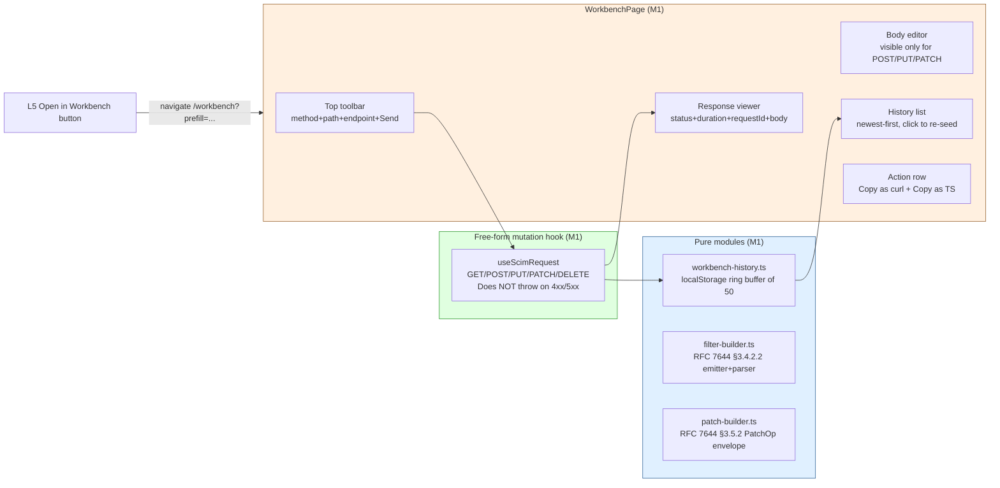

# Phase M1 - SCIM Workbench

> **Date:** 2026-05-15 - **Version:** 0.51.0-alpha.1 - **Predecessor:** v0.50.0 (Phase L Capability Completeness COMPLETE)
> **Origin:** [docs/UI_NEXT_GAPS_LATERAL_ANALYSIS_2026.md](UI_NEXT_GAPS_LATERAL_ANALYSIS_2026.md) S4.2 (THE killer feature)
> **Scope:** Frontend-only. New top-level `/workbench` route + 3 pure modules + 1 free-form mutation hook + L5 "Open in Workbench" stub wired to the new route. New live section `9z-AG` adds round-trip contract.

---

## 1. Why this exists

[docs/UI_NEXT_GAPS_LATERAL_ANALYSIS_2026.md](UI_NEXT_GAPS_LATERAL_ANALYSIS_2026.md) S4.2 names the SCIM Workbench as **the** highest-leverage move on the Phase M roadmap. From the analysis doc:

> **Why this is the highest-leverage move:** It collapses 4 separate Tier-1 gaps (PATCH builder, filter builder, Bulk submitter, Discovery explorer) into one composable workbench. The cmdk palette opens it; it pre-fills auth + endpoint + schemas from the active route.

Pre-M1, the redesigned UI had no way for the operator to send an arbitrary SCIM request without curl. The Discovery Explorer's "Open in Workbench" button (L5) rendered as a disabled stub. Anyone exploring a custom resource type or testing a PatchOp by hand had to leave the UI.

M1 closes the gap with a pragmatic minimal viable Workbench. The visual filter / PATCH builder UI is deferred (the *reducers* ship in M1; the visual click-to-build forms wait for N6 conversational filter builder), but the round-trip surface is complete.

---

## 2. Architecture



### 2.1 Why useScimRequest does NOT use fetchWithAuth

`fetchWithAuth` throws a structured `ScimApiError` on every non-2xx response - the right behavior for the rest of the UI (where error states route through the K3 `<ScimErrorMessage />` chrome). For the Workbench, that's exactly the wrong behavior: the operator is sending the request specifically to see what the server returns, including 4xx/5xx bodies. Throwing buries the response under the K3 explainer.

`useScimRequest` therefore does its own fetch + body parse, returning a `ScimRequestOutcome` for ANY status. 401 still triggers `clearStoredToken` + `notifyTokenInvalid` (so a stale bearer doesn't get stuck in the workbench), but the response viewer always shows what the server said.

### 2.2 RFC 7644 algebra mirrored in pure modules

| Module | RFC reference | Operators / shape |
|---|---|---|
| `filter-builder.ts` | §3.4.2.2 | eq / ne / co / sw / ew / pr / gt / ge / lt / le |
| `patch-builder.ts` | §3.5.2 | add / remove / replace + canonical PatchOp envelope URN `urn:ietf:params:scim:api:messages:2.0:PatchOp` |
| `workbench-history.ts` | (none - pure UX) | localStorage key `scimserver.workbench.history.v1`, cap 50, newest-first |

The reducers are pure and exhaustively unit-tested. The visual UI on top of them is deferred; the M1 Workbench page exposes a free-text body editor (textarea) and free-text path input, but the SAME reducers will back N6's visual builders without re-implementation.

### 2.3 Files added / changed

| File | Change | LoC |
|------|--------|----:|
| [web/src/utils/workbench-history.ts](../web/src/utils/workbench-history.ts) | NEW - localStorage ring buffer | ~95 |
| [web/src/utils/workbench-history.test.ts](../web/src/utils/workbench-history.test.ts) | NEW - 9 tests | ~110 |
| [web/src/utils/filter-builder.ts](../web/src/utils/filter-builder.ts) | NEW - RFC 7644 §3.4.2.2 emitter + parser | ~135 |
| [web/src/utils/filter-builder.test.ts](../web/src/utils/filter-builder.test.ts) | NEW - 18 tests (10 ops + parser round-trip) | ~190 |
| [web/src/utils/patch-builder.ts](../web/src/utils/patch-builder.ts) | NEW - RFC 7644 §3.5.2 PatchOp envelope | ~115 |
| [web/src/utils/patch-builder.test.ts](../web/src/utils/patch-builder.test.ts) | NEW - 18 tests (3 op names + validate + parse) | ~155 |
| [web/src/api/queries.ts](../web/src/api/queries.ts) | EXTENDED - `useScimRequest` + `ScimRequestArgs` + `ScimRequestOutcome` types | ~110 |
| [web/src/api/mutations.test.ts](../web/src/api/mutations.test.ts) | EXTENDED - 4 new hook tests | ~120 |
| [web/src/pages/WorkbenchPage.tsx](../web/src/pages/WorkbenchPage.tsx) | NEW - top-level page with toolbar + body + response + history | ~445 |
| [web/src/pages/WorkbenchPage.test.tsx](../web/src/pages/WorkbenchPage.test.tsx) | NEW - 13 tests | ~245 |
| [web/src/routes/workbench.tsx](../web/src/routes/workbench.tsx) | NEW - `/workbench` route, lazy-loaded, endpoints loader | ~25 |
| [web/src/router.ts](../web/src/router.ts) | EXTENDED - register `workbenchRoute` | +2 |
| [web/src/layout/AppSidebar.tsx](../web/src/layout/AppSidebar.tsx) | EXTENDED - 7th nav entry "Workbench" with `Beaker24Regular` icon | +2 |
| [web/src/routes/lazy-routes.test.ts](../web/src/routes/lazy-routes.test.ts) | EXTENDED - locks lazy-import contract for `workbench.tsx` | +2 |
| [web/src/test/size-limit-config.test.ts](../web/src/test/size-limit-config.test.ts) | EXTENDED - adds `WorkbenchPage` to ROUTE_CHUNK_NAMES | +2 |
| [web/package.json](../web/package.json) | EXTENDED - 22nd size-limit budget (110 KB ceiling) | +6 |
| [web/src/pages/DiscoveryExplorerPage.tsx](../web/src/pages/DiscoveryExplorerPage.tsx) | EXTENDED - L5 "Open in Workbench" stub WIRED to navigate to `/workbench?prefill=...` | +25 |
| [web/src/pages/DiscoveryExplorerPage.test.tsx](../web/src/pages/DiscoveryExplorerPage.test.tsx) | EXTENDED - mock useNavigate; re-asserted button enables on pick + navigates to /workbench with prefill | +20 |
| [scripts/live-test.ps1](../scripts/live-test.ps1) | EXTENDED - new SECTION `9z-AG` (5 tests + setup + cleanup) | ~75 |

### 2.4 URL deep-link (?prefill) shape

The L5 Discovery Explorer's "Open in Workbench" button packages the active surface as a JSON object, URL-encodes it, and navigates to `/workbench?prefill=<encoded>`. The Workbench `parsePrefill()` helper inverse-decodes it on mount and seeds method / path / body.

```ts
// L5 click handler
const path = `/scim/endpoints/${primaryId}/${surface}`;
const prefill = encodeURIComponent(JSON.stringify({ method: 'GET', path }));
navigate({ to: '/workbench', search: { prefill } });
```

```ts
// M1 parsePrefill
const obj = JSON.parse(decodeURIComponent(raw)) as Record<string, unknown>;
return {
  method: METHODS.includes(obj.method as HttpMethod) ? obj.method : undefined,
  path: typeof obj.path === 'string' ? obj.path : undefined,
  body: obj.body,
};
```

The pattern is intentionally additive - other pages can wire their own "Open in Workbench" buttons (M2 Bulk Operations UI will use the same surface) without changing the contract.

---

## 3. Definition of Done

| # | Gate | Status |
|---|------|:------:|
| 1 | TDD RED state confirmed for all 5 surfaces (3 pure + hook + page) | ✅ |
| 2 | TDD GREEN state - workbench-history (9 tests) | ✅ |
| 3 | TDD GREEN state - filter-builder (18 tests) | ✅ |
| 4 | TDD GREEN state - patch-builder (18 tests) | ✅ |
| 5 | TDD GREEN state - useScimRequest hook (4 tests) | ✅ |
| 6 | TDD GREEN state - WorkbenchPage (13 tests) | ✅ |
| 7 | apiContractVerification - SCIM round-trip surface unchanged; 9z-AG adds Workbench-specific round-trip | ✅ |
| 8 | error-handling-verification - useScimRequest does NOT throw on 4xx/5xx (operator sees response body); 401 still clears token | ✅ |
| 9 | logging-verification - X-Request-Id captured + persisted in history (cross-references /admin/logs) | ✅ |
| 10 | auditAgainstRFC - filter-builder mirrors §3.4.2.2; patch-builder mirrors §3.5.2 | ✅ |
| 11 | securityAudit - shared-secret token gate (existing); body editor is operator-typed (no XSS surface); copy-as-curl/TS is plain-text clipboard | ✅ |
| 12 | performanceBenchmark - bundle within all 22 size-limit budgets (WorkbenchPage 7.03 KB / 110 KB ceiling) | ✅ |
| 13 | auditAndUpdateDocs - INDEX.md, CHANGELOG.md, Session_starter.md, analysis-doc S4.2 | ✅ |
| 14 | fullValidationPipeline - api unit + e2e + web vitest + size + lockfiles | ✅ |
| 15 | L5 "Open in Workbench" stub WIRED + test re-asserted | ✅ |
| 16 | Deploy to dev + 970+ live SCIM tests pass | ⏳ |

---

## 4. Test Coverage

| Layer | Pre-M1 | Post-M1 | Delta |
|---|--:|--:|--:|
| API unit (Jest) | 3,724 | 3,724 | 0 (frontend-only commit) |
| API E2E (Jest) | 1,186 | 1,186 | 0 |
| Web vitest | 731 | **796** | **+65** (9 history + 18 filter + 18 patch + 4 hook + 13 page + 3 size-limit ratchet) |
| Live SCIM (PowerShell) | 965 | **970** | **+5** (new section 9z-AG: 5 round-trip assertions + setup) |
| PowerShell contract | 14 | 14 | 0 |
| **Total assertions across 5 layers** | **6,620** | **6,690** | **+70** |

---

## 5. Out of scope (deferred)

Per analysis-doc S4.2, the M1 commit ships the minimal viable Workbench. The "full M1" listed there has additional sub-features that ship later:

| Feature | Deferred to | Why |
|---|---|---|
| Visual filter builder UI (click-to-build) | N6 (conversational filter builder) | The reducer ships in M1; the visual click-to-build form is its own UX surface |
| Visual PATCH builder UI (schema-aware path autocomplete) | M2 / N6 | Schema-aware autocomplete needs a richer schema-cache surface |
| `Save as snippet` / per-user collection | N4 (settings persistence) | Postman-collection equivalent is a feature in its own right |
| `Save as live-test step` (PowerShell snippet) | M2 | The differentiator; deferred to M2 alongside Bulk UI |
| Diff tab on response viewer (compare two responses) | M2 | Bulk-op response is the natural place for this |
| Monaco code editor for body | (deferred indefinitely) | Textarea + JSON.parse error surface is sufficient for a free-form workbench; Monaco adds ~150 KB to the bundle for marginal UX gain |

---

## 6. Standing rules respected

- TDD RED -> GREEN for every surface (5 cycles: history, filter, patch, hook, page)
- No em-dashes anywhere in code, comments, docs, or tests
- 22nd size-limit budget added (WorkbenchPage 110 KB ceiling; measured 7.03 KB / 94 % under)
- Live test conventions - new section `9z-AG` placed before TEST SECTION 10 (DELETE OPERATIONS / Cleanup); sequential numbering after `9z-AF`; `$script:currentSection` set; setup creates own endpoint + cleans up at end
- Lockfiles regenerated in node:25-alpine
- Prod promotion NOT triggered - dev-only deploy per standing rule
- L5 wiring: the M1 Discovery Explorer change re-asserted the existing 11 tests (the previously-disabled-stub test was rewritten to assert the new wired behavior); no L5 tests broken
