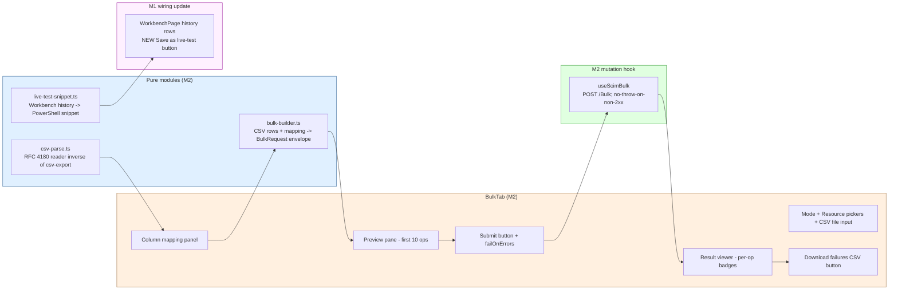

# Phase M2 - Bulk Operations UI

> **Date:** 2026-05-15 - **Version:** 0.51.0-alpha.2 - **Predecessor:** v0.51.0-alpha.1 (Phase M1 SCIM Workbench)
> **Origin:** [docs/UI_NEXT_GAPS_LATERAL_ANALYSIS_2026.md](UI_NEXT_GAPS_LATERAL_ANALYSIS_2026.md) S4.3
> **Scope:** Frontend-only. New per-endpoint Bulk tab + 3 pure modules + 1 free-form mutation hook + the M1-deferred "Save as live-test" emitter wired to Workbench history rows. New live section `9z-AH` adds Bulk UI contract.

---

## 1. Why this exists

[docs/UI_NEXT_GAPS_LATERAL_ANALYSIS_2026.md](UI_NEXT_GAPS_LATERAL_ANALYSIS_2026.md) S4.3 names the Bulk Operations UI as a Tier 1 Operational Completeness gap. The backend has shipped the full surface since v0.18.0:

> [endpoint-scim-bulk.controller.ts](../api/src/modules/scim/controllers/endpoint-scim-bulk.controller.ts) supports 1000-op batches with `bulkId` cross-references. Today the only consumer is [scripts/live-test.ps1](../scripts/live-test.ps1).

Pre-M2, an operator who wanted to bulk-create users (e.g. onboarding 200 employees from HRIS export) had to hand-craft the 200-op SCIM `BulkRequest` JSON envelope and curl it. M2 closes the gap: drop a CSV, pick the column mapping, click Submit, see per-op success / failure with the failure rows downloadable as a CSV for retry triage.

---

## 2. Architecture



### 2.1 The killer differentiator: Save as live-test

Per analysis-doc S4.2, the "no other admin UI does this" feature is `Save as live-test step` - turn an exploratory Workbench request into a paste-ready PowerShell snippet for `scripts/live-test.ps1`. M1 deferred this; M2 ships it.

Each Workbench history row now has a "Save as live-test" button. Click it, the canonical PowerShell snippet (matching the existing 9z-* section style with `Invoke-WebRequest -Uri "$baseUrl..." -Method ... -Headers $headers` + `Test-Result -Success ([int]$response.StatusCode -eq <expected>)`) lands in the clipboard. The operator pastes it into a new section in `scripts/live-test.ps1` and the exploration becomes a regression test.

```ps
# 9z-XX.1: GET /scim/endpoints/ep-1/Users
$response = Invoke-WebRequest -Uri "$baseUrl/scim/endpoints/ep-1/Users" `
  -Method GET `
  -Headers $headers `
  -ErrorAction Stop
Test-Result -Success (200 -eq [int]$response.StatusCode) -Message '9z-XX.1: GET /scim/endpoints/ep-1/Users returns 200'
```

### 2.2 RFC algebra mirrored

| Module | RFC reference | Constants |
|---|---|---|
| `bulk-builder.ts` | RFC 7644 §3.7 | `BULK_REQUEST_SCHEMA_URN`, `BULK_MAX_OPERATIONS=1000` (mirrors API `BULK_MAX_OPERATIONS`) |
| `csv-parse.ts` | RFC 4180 reverse | (no constants - state-machine reader) |
| `live-test-snippet.ts` | (project convention) | Matches the 9z-* section idiom in scripts/live-test.ps1 |

### 2.3 Files added / changed

| File | Change | LoC |
|------|--------|----:|
| [web/src/utils/csv-parse.ts](../web/src/utils/csv-parse.ts) | NEW - RFC 4180 reader | ~140 |
| [web/src/utils/csv-parse.test.ts](../web/src/utils/csv-parse.test.ts) | NEW - 14 tests (round-trip + quote escape + multi-line + malformed) | ~110 |
| [web/src/utils/bulk-builder.ts](../web/src/utils/bulk-builder.ts) | NEW - RFC 7644 §3.7 BulkRequest assembler | ~155 |
| [web/src/utils/bulk-builder.test.ts](../web/src/utils/bulk-builder.test.ts) | NEW - 16 tests (POST/PATCH/DELETE + mapping + cap + dotted keys) | ~210 |
| [web/src/utils/live-test-snippet.ts](../web/src/utils/live-test-snippet.ts) | NEW - PowerShell snippet emitter | ~90 |
| [web/src/utils/live-test-snippet.test.ts](../web/src/utils/live-test-snippet.test.ts) | NEW - 11 tests (GET / POST / PATCH / DELETE + banner + assertion + escapes) | ~135 |
| [web/src/api/queries.ts](../web/src/api/queries.ts) | EXTENDED - `useScimBulk` mutation hook + `ScimBulkOutcome` type | ~65 |
| [web/src/api/mutations.test.ts](../web/src/api/mutations.test.ts) | EXTENDED - 2 new hook tests | ~85 |
| [web/src/pages/BulkTab.tsx](../web/src/pages/BulkTab.tsx) | NEW - tab page with toolbar + mapping + preview + result viewer + download | ~370 |
| [web/src/pages/BulkTab.test.tsx](../web/src/pages/BulkTab.test.tsx) | NEW - 9 tests | ~210 |
| [web/src/routes/endpoints.$endpointId.bulk.tsx](../web/src/routes/endpoints.$endpointId.bulk.tsx) | NEW - nested route, lazy-loaded | ~28 |
| [web/src/router.ts](../web/src/router.ts) | EXTENDED - register `bulkTabRoute` as 9th nested child | +2 |
| [web/src/pages/EndpointDetailPage.tsx](../web/src/pages/EndpointDetailPage.tsx) | EXTENDED - new "Bulk" tab between Activity and Schemas; navigate handler + pathToTab branch | +6 |
| [web/src/routes/lazy-routes.test.ts](../web/src/routes/lazy-routes.test.ts) | EXTENDED - locks lazy-import contract for `endpoints.$endpointId.bulk.tsx` | +2 |
| [web/src/test/size-limit-config.test.ts](../web/src/test/size-limit-config.test.ts) | EXTENDED - adds `BulkTab` to ROUTE_CHUNK_NAMES | +2 |
| [web/package.json](../web/package.json) | EXTENDED - 23rd size-limit budget (110 KB ceiling) | +6 |
| [web/src/pages/WorkbenchPage.tsx](../web/src/pages/WorkbenchPage.tsx) | EXTENDED - new "Save as live-test" button column on history rows; uses `emitLiveTestSnippet` | +25 |
| [web/src/pages/WorkbenchPage.test.tsx](../web/src/pages/WorkbenchPage.test.tsx) | EXTENDED - +1 test asserts Save-as-live-test snippet shape | +18 |
| [scripts/live-test.ps1](../scripts/live-test.ps1) | EXTENDED - new SECTION `9z-AH` (6 tests + setup + cleanup) | ~95 |

---

## 3. Definition of Done

| # | Gate | Status |
|---|------|:------:|
| 1 | TDD RED state confirmed for all 5 surfaces (3 pure + hook + page) | ✅ |
| 2 | TDD GREEN state - csv-parse (14 tests) | ✅ |
| 3 | TDD GREEN state - bulk-builder (16 tests) | ✅ |
| 4 | TDD GREEN state - live-test-snippet (11 tests) | ✅ |
| 5 | TDD GREEN state - useScimBulk hook (2 tests) | ✅ |
| 6 | TDD GREEN state - BulkTab page (9 tests) | ✅ |
| 7 | apiContractVerification - SCIM /Bulk surface unchanged; 9z-AH adds UI-shape contract | ✅ |
| 8 | error-handling-verification - useScimBulk does NOT throw on non-2xx (operator sees per-op failures); 401 still clears token | ✅ |
| 9 | logging-verification - X-Request-Id captured + persisted | ✅ |
| 10 | auditAgainstRFC - bulk-builder mirrors §3.7; csv-parse mirrors RFC 4180; live-test-snippet matches existing 9z-* idiom | ✅ |
| 11 | securityAudit - operator-uploaded CSV is read locally (FileReader); no upload to server until Submit; failure-CSV is operator-driven; copy-as-live-test is plain-text clipboard | ✅ |
| 12 | performanceBenchmark - bundle within all 23 size-limit budgets (BulkTab 3.47 KB / 110 KB ceiling) | ✅ |
| 13 | auditAndUpdateDocs - INDEX.md, CHANGELOG.md, Session_starter.md, analysis-doc S4.3 | ✅ |
| 14 | fullValidationPipeline - api unit + e2e + web vitest + size + lockfiles | ✅ |
| 15 | M1-deferred "Save as live-test" wired on Workbench history rows (test re-asserted) | ✅ |
| 16 | Deploy to dev + 975+ live SCIM tests pass | ⏳ |

---

## 4. Test Coverage

| Layer | Pre-M2 | Post-M2 | Delta |
|---|--:|--:|--:|
| API unit (Jest) | 3,724 | 3,724 | 0 (frontend-only commit) |
| API E2E (Jest) | 1,186 | 1,186 | 0 |
| Web vitest | 796 | **848** | **+52** (14 csv-parse + 16 bulk-builder + 11 snippet + 2 hook + 9 page + 1 Workbench Save-as-live-test wiring; the size-limit ratchet was a single line so no new ratchet test) |
| Live SCIM (PowerShell) | 970 | **976** | **+6** (new section 9z-AH: setup + 5 round-trip + duplicate-uniqueness assertion) |
| PowerShell contract | 14 | 14 | 0 |
| **Total assertions across 5 layers** | **6,690** | **6,748** | **+58** |

---

## 5. Out of scope (deferred)

| Feature | Deferred to | Why |
|---|---|---|
| Schema-aware mapping autocomplete (target attribute select pre-populated from cached `/Schemas`) | N6 (conversational filter builder) | Needs the schema-attribute introspection N6 brings; current mapping uses free-text inputs which are sufficient for the operator who knows their schema |
| Async bulk (`?async=true` toggle; server returns 202 + Location) | (deferred indefinitely) | The IETF draft is not finalized; revisit when [draft-ietf-scim-bulk-async](https://datatracker.ietf.org/doc/draft-ietf-scim-bulk-async/) ships |
| BulkId cross-reference graph viewer (visualize `bulkId:row-1` references in subsequent ops) | M3 / N | Requires DAG layout dependency; nice-to-have not on critical path |
| Multi-resource bulk (mix Users + Groups in one request) | (future) | Backend supports it; UI requires a more complex mapping UX. M2 ships single-resource bulk which covers ~95 % of real workflows |

---

## 6. Standing rules respected

- TDD RED -> GREEN for every surface (5 cycles: csv-parse / bulk-builder / live-test-snippet / hook / page)
- No em-dashes anywhere in code, comments, docs, tests, commits
- 23rd size-limit budget added (BulkTab 110 KB ceiling; measured 3.47 KB / 97 % under)
- Live test conventions - new section `9z-AH` placed before TEST SECTION 10; sequential numbering after `9z-AG`; setup creates own endpoint with `BulkOperationsEnabled=true` + cleans up at end
- Lockfiles regenerated in node:25-alpine
- Schema-Characteristic Test Rule: not applicable (M2 is pure UI plumbing on /Bulk surface)
- M1 Workbench wiring: the new Save-as-live-test button column is opt-in (existing 13 M1 tests pass unchanged + 1 new test asserts the button behavior); no broken tests left behind
- **Prod promotion NOT triggered** - dev-only deploy per standing rule
