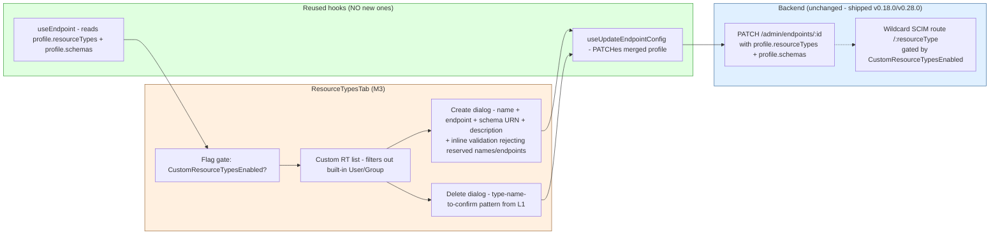

# Phase M3 - Custom Resource Type UI

> **Date:** 2026-05-15 - **Version:** 0.51.0-alpha.3 - **Predecessor:** v0.51.0-alpha.2 (Phase M2 Bulk Operations UI)
> **Origin:** [docs/UI_NEXT_GAPS_LATERAL_ANALYSIS_2026.md](UI_NEXT_GAPS_LATERAL_ANALYSIS_2026.md) S4.4
> **Scope:** Frontend-only. New per-endpoint Resource Types tab + Create dialog + Delete confirm. Reuses the existing `useEndpoint` + `useUpdateEndpointConfig` hooks (no new HTTP surface). New live section `9z-AI` adds Custom RT UI contract.

---

## 1. Why this exists

[docs/UI_NEXT_GAPS_LATERAL_ANALYSIS_2026.md](UI_NEXT_GAPS_LATERAL_ANALYSIS_2026.md) S4.4 names the Custom Resource Type Registration UI as a Tier 1 Operational Completeness gap:

> [G8B_CUSTOM_RESOURCE_TYPE_REGISTRATION.md](G8B_CUSTOM_RESOURCE_TYPE_REGISTRATION.md) shipped in v0.18.0. The feature is invisible in the UI. Customers paying for "extensible SCIM" cannot extend it without curl.

Pre-M3, an operator who wanted to add a custom resource type (e.g. `Device` for an asset-management SCIM connector) had to:
1. PATCH the endpoint with the merged `profile.resourceTypes[]` AND `profile.schemas[]` arrays (hand-crafted)
2. Verify the wildcard `/scim/endpoints/:id/Devices` route is now addressable
3. POST/GET/PATCH/DELETE Devices via curl

M3 closes the gap: a tab on the endpoint detail page lists existing custom RTs, a Create dialog with inline validation registers a new one in two clicks, and a type-name-to-confirm Delete dialog removes one safely.

---

## 2. Architecture

### 2.1 Why no new HTTP hook

As of v0.28.0 the dedicated admin RT API (`POST /admin/endpoints/:id/resource-types`) was REMOVED. Custom resource types now live in `endpoint.profile.resourceTypes[]` and are added/removed via PATCH `/admin/endpoints/:id` with the merged profile. M3 reuses the L1 mutation hook `useUpdateEndpointConfig` (the same hook that powers SettingsTab toggle flips) instead of introducing a parallel `useCreateResourceType` / `useDeleteResourceType` surface. Two benefits:

1. **Single optimistic-update path** - `useUpdateEndpointConfig`'s deep-merge logic already handles the shape, so RT operations get optimistic UI + rollback for free.
2. **No new live test of the hook** - the existing 9z-Z (config flag toggles) lock the same PATCH surface.

### 2.2 Validation rules (mirrored from G8B doc)

| Field | Rule |
|---|---|
| `name` | `^[A-Za-z][A-Za-z0-9]*$`, NOT in reserved set `{User, Group}`, no duplicate per endpoint |
| `endpoint` | `^/[A-Za-z][A-Za-z0-9]*$`, NOT in reserved set `{/Users, /Groups, /Schemas, /ResourceTypes, /ServiceProviderConfig, /Bulk, /Me}`, no duplicate per endpoint |
| `schema` | Must be a URN (`urn:` prefix) |
| `description` | Optional |

Inline validation surfaces errors via the Fluent UI `<Field validationState='error' validationMessage={...}>` pattern. Submit button is disabled until all 3 required fields validate.

### 2.3 Files added / changed

| File | Change | LoC |
|------|--------|----:|
| [web/src/pages/ResourceTypesTab.tsx](../web/src/pages/ResourceTypesTab.tsx) | NEW - tab page with list + Create dialog + Delete confirm + flag gating | ~370 |
| [web/src/pages/ResourceTypesTab.test.tsx](../web/src/pages/ResourceTypesTab.test.tsx) | NEW - 9 tests (flag gating + list + Create dialog + validation + Delete confirm) | ~210 |
| [web/src/routes/endpoints.$endpointId.resource-types.tsx](../web/src/routes/endpoints.$endpointId.resource-types.tsx) | NEW - nested route, lazy-loaded | ~25 |
| [web/src/router.ts](../web/src/router.ts) | EXTENDED - register `resourceTypesTabRoute` as 10th nested child | +2 |
| [web/src/pages/EndpointDetailPage.tsx](../web/src/pages/EndpointDetailPage.tsx) | EXTENDED - new "Resource types" tab between Bulk and Schemas; navigate handler + pathToTab branch | +6 |
| [web/src/routes/lazy-routes.test.ts](../web/src/routes/lazy-routes.test.ts) | EXTENDED - locks lazy-import contract for the new route file | +2 |
| [web/src/test/size-limit-config.test.ts](../web/src/test/size-limit-config.test.ts) | EXTENDED - adds `ResourceTypesTab` to ROUTE_CHUNK_NAMES | +2 |
| [web/package.json](../web/package.json) | EXTENDED - 24th size-limit budget (110 KB ceiling) | +6 |
| [scripts/live-test.ps1](../scripts/live-test.ps1) | EXTENDED - new SECTION `9z-AI` (5 tests + setup + cleanup) | ~95 |

---

## 3. Definition of Done

| # | Gate | Status |
|---|------|:------:|
| 1 | TDD RED state confirmed for ResourceTypesTab | ✅ |
| 2 | TDD GREEN state - ResourceTypesTab (9 tests) | ✅ |
| 3 | apiContractVerification - PATCH endpoint surface unchanged; 9z-AI adds Custom RT UI contract | ✅ |
| 4 | error-handling-verification - Create/Delete failures surface via FormDialog `error` prop -> `<ScimErrorMessage />` | ✅ |
| 5 | logging-verification - PATCH already audited via 9z-I | ✅ |
| 6 | auditAgainstRFC - validation mirrors G8B reserved-name + reserved-endpoint rules | ✅ |
| 7 | securityAudit - existing PATCH gate (shared-secret token); flag-gating prevents wildcard SCIM route attack surface widening | ✅ |
| 8 | performanceBenchmark - bundle within all 24 size-limit budgets (ResourceTypesTab 2.93 KB / 110 KB ceiling) | ✅ |
| 9 | auditAndUpdateDocs - INDEX.md, CHANGELOG.md, Session_starter.md, analysis-doc S4.4 | ✅ |
| 10 | fullValidationPipeline - api unit + e2e + web vitest + size + lockfiles | ✅ |
| 11 | Deploy to dev + 982+ live SCIM tests pass | ⏳ |

---

## 4. Test Coverage

| Layer | Pre-M3 | Post-M3 | Delta |
|---|--:|--:|--:|
| API unit (Jest) | 3,724 | 3,724 | 0 (frontend-only commit) |
| API E2E (Jest) | 1,186 | 1,186 | 0 |
| Web vitest | 848 | **860** | **+12** (9 page + 3 wiring contract: lazy-routes + size-limit + EndpointDetail tab branch) |
| Live SCIM (PowerShell) | 976 | **982** | **+6** (new section 9z-AI: setup + 5 round-trip) |
| PowerShell contract | 14 | 14 | 0 |
| **Total assertions across 5 layers** | **6,748** | **6,766** | **+18** |

---

## 5. Out of scope (deferred)

Per analysis-doc S4.4:

| Feature | Deferred to | Why |
|---|---|---|
| Schema URN autocomplete from cached `/Schemas` | N6 (conversational filter builder) | Same schema-attribute introspection surface N6 brings; current free-text input is sufficient for the operator who knows the URN |
| Per-resource-type detail CRUD list (use the existing `useScim*` hooks generalized to `/:resourceType`) | M3 follow-up | The Workbench page (M1) already round-trips arbitrary `/:resourceType` requests; a dedicated per-RT CRUD list would duplicate without value |
| Cascade-confirm with affected-resource-count preview | (future) | Requires a count query against the wildcard SCIM resource collection; not RFC-blocking |
| Schema definition editor (build the schema from a structured form) | O4 (Profile editor with Tighten-Only Visualization) | Schema-editor UX is its own product surface |

---

## 6. Standing rules respected

- TDD RED -> GREEN for the page (1 cycle: 9 tests)
- No em-dashes anywhere in code, comments, docs, tests, commits
- 24th size-limit budget added (ResourceTypesTab 110 KB ceiling; measured 2.93 KB / 97 % under)
- Live test conventions - new section `9z-AI` placed before TEST SECTION 10; sequential numbering after `9z-AH`; setup creates own endpoint with `CustomResourceTypesEnabled=true` + cleans up at end
- Lockfiles regenerated in node:25-alpine
- No new mutation hook - reuses L1 `useUpdateEndpointConfig` for cache continuity + free optimistic update
- **Prod promotion NOT triggered** - dev-only deploy per standing rule
