# Phase N1 - Notifications Inbox

> **Date:** 2026-05-15 - **Version:** 0.52.0-alpha.1 - **Predecessor:** v0.51.0 (Phase M complete)
> **Origin:** [docs/UI_NEXT_GAPS_LATERAL_ANALYSIS_2026.md](UI_NEXT_GAPS_LATERAL_ANALYSIS_2026.md) S5.5
> **Scope:** Frontend-only. New notifications-store + Bell button in AppHeader + right-side drawer + useSSE bridge. **No new live SCIM section** - the underlying SSE event surface is already exhaustively locked at sections 9z-H + 9z-I + 9z-V.

---

## 1. Why this exists

[docs/UI_NEXT_GAPS_LATERAL_ANALYSIS_2026.md](UI_NEXT_GAPS_LATERAL_ANALYSIS_2026.md) S5.5:

> SSE-driven events fire today but have no human-visible surface beyond cache invalidation. Operator misses the signal "endpoint X just went red" unless they happen to be on the dashboard.

Pre-N1, an operator might miss critical events (an endpoint deleted, a credential revoked, a bulk operation that errored on 50 rows) because the only signal was cache invalidation - silent, invisible. N1 surfaces every supported SCIM event as a human-readable notification entry with severity + endpoint + relative-time + a "Take me there" link to the per-endpoint Activity tab.

---

## 2. Architecture

```mermaid
flowchart LR
    subgraph API["API (unchanged)"]
        SSE[POST /scim/admin/log-config/stream<br/>SCIM mutation events via ScimEventSseBridge]
    end

    subgraph BRIDGE["useSSE bridge (extended N1)"]
        US[useSSE - existing]
        PN[pushNotification - NEW]
        US --> PN
    end

    subgraph STORE["notifications-store (NEW)"]
        EN[entries - ring buffer of 50, newest-first]
        UC[unreadCount]
        DD[dedupe by id - SSE bridge uses bucketKey]
        TTL[7-day TTL pruning]
        LS[localStorage persistence]
    end

    subgraph UI["UI surfaces (NEW)"]
        BTN[NotificationsButton<br/>Bell + unread badge in AppHeader]
        DRW[NotificationsDrawer<br/>right OverlayDrawer with list + actions]
    end

    SSE --> US
    PN --> STORE
    STORE --> BTN
    STORE --> DRW
    BTN -- toggle ui-store.notificationsDrawerOpen --> DRW

    style BRIDGE fill:#e0ffe0,stroke:#393
    style STORE fill:#e0f0ff,stroke:#369
    style UI fill:#fff0e0,stroke:#963
```

### 2.1 Why dedupe by id (and the bucketKey contract)

A Bulk POST can fire 100 `scim.user.created` events within the same second. Naive append-on-event would flood the inbox with 100 indistinguishable entries.

The store dedupes by entry `id` (simple + fast). The SSE bridge generates ids deterministically from `bucketKey(type, endpointId, timestamp)` which buckets to second-resolution - so 100 events with the same (type, endpointId, second) all produce the same id, and only the first one lands. Explicit callers (unit tests, future per-row notifications) pass distinct ids and always land.

This contract is fully unit-tested at both the store layer (`bucketKey`-derived ids dedupe; distinct ids always append) and the bridge layer (SSE emits with timestamps in the same second collapse to one entry).

### 2.2 Severity classification

| Event type pattern | Severity | Rationale |
|---|---|---|
| `*.error` or `*.failed` | error | Explicit backend-emitted failure |
| `scim.endpoint.updated`, `scim.endpoint.deleted`, `scim.credential.revoked` | warning | Operator should NOTICE config changes |
| Everything else (routine CRUD) | info | Background visibility |

### 2.3 TTL + persistence semantics

- Persist key: `scimserver.notifications.v1`
- Cap: 50 entries (oldest dropped on append)
- TTL: 7 days (`pruneExpired()` runs on every drawer mount)
- Corrupt-storage tolerance: malformed JSON returns `{ entries: [], unreadCount: 0 }`; the next append silently overwrites the bad payload

### 2.4 Files added / changed

| File | Change | LoC |
|------|--------|----:|
| [web/src/store/notifications-store.ts](../web/src/store/notifications-store.ts) | NEW - Zustand store + dedupe + TTL + persistence | ~195 |
| [web/src/store/notifications-store.test.ts](../web/src/store/notifications-store.test.ts) | NEW - 13 tests | ~170 |
| [web/src/store/ui-store.ts](../web/src/store/ui-store.ts) | EXTENDED - `notificationsDrawerOpen` + `setNotificationsDrawerOpen` + `toggleNotificationsDrawer` | +10 |
| [web/src/store/ui-store.test.ts](../web/src/store/ui-store.test.ts) | EXTENDED - 2 new tests | +16 |
| [web/src/hooks/useSSE.ts](../web/src/hooks/useSSE.ts) | EXTENDED - `pushNotification()` + `EVENT_TITLE` map; wired into `onmessage` after `dispatchInvalidations` | +60 |
| [web/src/hooks/useSSE.test.ts](../web/src/hooks/useSSE.test.ts) | EXTENDED - 4 new bridge tests (append on event + bucketKey dedupe + severity classification + ignore non-SCIM) | +75 |
| [web/src/layout/NotificationsButton.tsx](../web/src/layout/NotificationsButton.tsx) | NEW - Bell icon + unread badge (caps at 99+) | ~85 |
| [web/src/layout/NotificationsButton.test.tsx](../web/src/layout/NotificationsButton.test.tsx) | NEW - 6 tests | ~90 |
| [web/src/layout/NotificationsDrawer.tsx](../web/src/layout/NotificationsDrawer.tsx) | NEW - right OverlayDrawer with list + Mark-all-read + Clear + Take-me-there | ~250 |
| [web/src/layout/NotificationsDrawer.test.tsx](../web/src/layout/NotificationsDrawer.test.tsx) | NEW - 8 tests | ~125 |
| [web/src/layout/AppShell.tsx](../web/src/layout/AppShell.tsx) | EXTENDED - mount `<NotificationsDrawer />` once at chrome level | +2 |
| [web/src/layout/AppHeader.tsx](../web/src/layout/AppHeader.tsx) | EXTENDED - mount `<NotificationsButton />` between HealthRollup and the Log Stream toggle | +2 |

---

## 3. Definition of Done

| # | Gate | Status |
|---|------|:------:|
| 1 | TDD RED state confirmed for store / bridge / button / drawer | ✅ |
| 2 | TDD GREEN state - notifications-store (13 tests) | ✅ |
| 3 | TDD GREEN state - ui-store slice (2 tests) | ✅ |
| 4 | TDD GREEN state - useSSE bridge (4 tests) | ✅ |
| 5 | TDD GREEN state - NotificationsButton (6 tests) | ✅ |
| 6 | TDD GREEN state - NotificationsDrawer (8 tests) | ✅ |
| 7 | apiContractVerification - underlying SSE surface unchanged; covered by 9z-H + 9z-I + 9z-V | ✅ |
| 8 | error-handling-verification - corrupt-storage tolerance + non-SCIM event filtering | ✅ |
| 9 | logging-verification - notifications are read-only on top of existing SSE channel | ✅ |
| 10 | auditAgainstRFC - operator UX; no RFC dimension | ✅ |
| 11 | securityAudit - localStorage scope per-origin; no remote persistence; no Web Push surface (deferred); operator-typed messages contain only event metadata (no payload bodies) | ✅ |
| 12 | performanceBenchmark - bundle within all 24 size-limit budgets (Notifications mounted in entry chunk; main entry +2.44 KB gz, no new per-route chunk) | ✅ |
| 13 | auditAndUpdateDocs - INDEX.md, CHANGELOG.md, Session_starter.md, analysis-doc S5.5 | ✅ |
| 14 | fullValidationPipeline - api unit + e2e + web vitest + size + lockfiles | ✅ |
| 15 | Deploy to dev + 984+ live SCIM tests pass | ⏳ |

---

## 4. Test Coverage

| Layer | Pre-N1 | Post-N1 | Delta |
|---|--:|--:|--:|
| API unit (Jest) | 3,724 | 3,724 | 0 (frontend-only commit) |
| API E2E (Jest) | 1,186 | 1,186 | 0 |
| Web vitest | 860 | **893** | **+33** (13 store + 2 ui-store + 4 SSE bridge + 6 button + 8 drawer) |
| Live SCIM (PowerShell) | 984 | 984 | 0 (SSE surface already locked by 9z-H + 9z-I + 9z-V; the N1 client surface is pure UI) |
| PowerShell contract | 14 | 14 | 0 |
| **Total assertions across 5 layers** | **6,768** | **6,801** | **+33** |

---

## 5. Out of scope (deferred)

Per analysis-doc S5.5:

| Feature | Deferred to | Why |
|---|---|---|
| Toast for high-severity events (dismissable) | N1 follow-up | Adds a global ToastController surface; not in the MVP and the drawer already covers the signal |
| Browser push notifications via the Web Push API | (deferred indefinitely) | Requires a service worker we don't ship; analysis-doc S5.5 explicitly marks as optional |
| Per-row dismiss (clear one entry) | (future) | "Clear all" covers the operational case; per-row would need swipe-to-dismiss UX |
| Persist across browsers via `/admin/me/preferences` | N4 (settings persistence) | localStorage is sufficient today; server-side persistence is its own feature |

---

## 6. Standing rules respected

- TDD RED -> GREEN for every surface (5 cycles: store / ui-store / bridge / button / drawer)
- No em-dashes anywhere in code, comments, docs, tests, commits
- No new size-limit budget added (Notifications mounted in entry chunk via AppShell; the +2.44 KB on the entry chunk is within the 200 KB ceiling)
- Lockfiles regenerated in node:25-alpine
- L4-style `setNotificationsDrawerOpen` setter alongside the existing logStream pattern keeps the ui-store API consistent
- **Prod promotion NOT triggered** - dev-only deploy per standing rule
